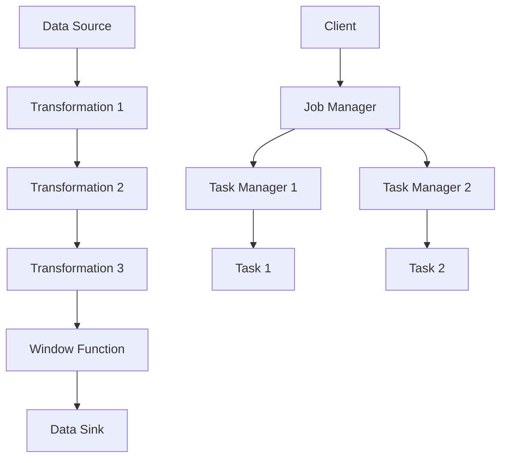

                 

关键词：Flink，大数据处理，流计算，内存管理，性能优化，数据流模型，代码实例

摘要：本文将深入探讨Apache Flink这一大数据处理框架的原理，涵盖其内存管理、性能优化策略，以及关键的数据流模型。通过详细的代码实例和解释，读者将了解到如何在实际项目中应用Flink。本文还将展望Flink的未来发展趋势和挑战，为大数据处理领域的研究者提供有价值的参考。

## 1. 背景介绍

随着数据量的爆炸式增长，如何高效处理海量数据成为当今信息技术领域的重要课题。流计算作为一种处理数据流的技术，正逐渐取代传统的批处理。Apache Flink作为一个开源的流处理框架，因其高性能、易扩展和强大的功能而备受关注。

Flink起源于欧洲科研机构，后由Apache软件基金会孵化并发展壮大。其核心特性包括事件驱动架构、动态内存管理、窗口机制和精确一次的语义保证。Flink不仅适用于大规模的实时数据流处理，还被广泛应用于批处理任务，具有广泛的适用场景。

本文将围绕以下几个核心问题展开：

1. Flink的核心概念与架构是怎样的？
2. Flink如何处理流数据，其算法原理是什么？
3. Flink的性能优化策略有哪些？
4. 如何通过代码实例理解和应用Flink？
5. Flink在未来的发展趋势和面临的挑战是什么？

通过本文的详细讲解，读者将深入了解Flink的工作原理，掌握其核心概念和算法，并能够将其应用于实际的大数据处理项目中。

## 2. 核心概念与联系

### 2.1. 核心概念

在深入探讨Flink的架构和工作原理之前，我们需要了解几个核心概念：

#### **数据流模型**

Flink使用数据流模型来表示数据处理的流程。数据流模型包括数据源（Source）、数据转换（Transformation）和数据 sink（Sink）。数据源是数据的起点，可以是文件、消息队列或实时数据流；数据 sink 是数据处理结果的终点，可以是文件、数据库或外部系统。

#### **流与批**

Flink支持流处理和批处理。流处理以事件时间为准，实时处理数据流；批处理则将数据看作一个整体，处理完成后输出结果。流处理和批处理的融合使得Flink能够同时处理实时数据和批量数据。

#### **内存管理**

Flink的内存管理策略是其高性能的关键。Flink采用动态内存分配，根据任务的运行状态实时调整内存分配。内存管理包括堆内存和非堆内存的管理，以及内存回收机制。

#### **窗口机制**

窗口机制是Flink处理流数据的关键组件。窗口可以将数据划分为不同的时间段，从而实现数据的聚合和分析。Flink支持多种窗口类型，如时间窗口、计数窗口和滑动窗口。

#### **精确一次语义**

Flink保证数据处理结果的精确一次语义（At Least Once，ALO）。这意味着每个数据事件在系统内部最多被处理一次，确保数据的完整性和一致性。

### 2.2. 架构

Flink的架构设计使其具备高可用性和高性能。以下是Flink的关键架构组件：

#### **Job Manager**

Job Manager是Flink集群的主控节点，负责资源调度、作业管理和协调。Job Manager将作业分解为任务，分配给不同的 Task Manager。

#### **Task Manager**

Task Manager是Flink集群的工作节点，负责执行具体的任务。每个Task Manager可以运行多个子任务，实现任务的并行处理。

#### **Client**

Client是Flink的客户端，负责提交作业、监控作业状态和获取作业结果。Client可以通过命令行、Web界面或编程接口与Flink集群交互。

### 2.3. Mermaid 流程图

为了更直观地展示Flink的核心概念和架构，我们使用Mermaid绘制一个流程图：



在这个流程图中，数据从数据源（A）开始，经过一系列转换（B、C、D），应用窗口函数（E）进行数据聚合，最后写入数据 sink（F）。Job Manager（G）负责协调Task Manager（H、I）的任务执行，Client（J）提交作业并监控作业状态。

通过这个Mermaid流程图，我们可以清晰地理解Flink的数据处理流程和架构设计。

### 2.4. Flink 的核心算法原理

Flink 的核心算法原理主要围绕数据流的处理、窗口机制和内存管理。以下是对这些核心算法原理的详细解释：

#### **数据流处理**

Flink 通过事件驱动的方式处理数据流。每个数据元素都对应一个事件，事件可以是数据点、时间戳或其他相关信息。Flink 将事件分为两种类型：有界事件和无界事件。有界事件通常指数据流的结束，而无界事件则指数据流的持续。Flink 通过事件驱动的方式，确保每个事件都被精确处理。

#### **窗口机制**

窗口机制是 Flink 处理流数据的核心组件。窗口可以将流数据划分为不同的时间段，从而实现数据的聚合和分析。Flink 支持以下几种窗口类型：

1. **时间窗口**：根据事件的时间戳划分窗口，如每小时、每天的数据。
2. **计数窗口**：根据数据流的数量划分窗口，如每100个事件的数据。
3. **滑动窗口**：在固定时间段内，每次滑动一定时间间隔的数据，如每5分钟的数据。

窗口机制使得 Flink 能够对流数据进行实时分析和处理，从而实现复杂的数据处理任务。

#### **内存管理**

Flink 的内存管理策略是其高性能的关键。Flink 采用动态内存分配，根据任务的运行状态实时调整内存分配。内存管理包括堆内存和非堆内存的管理，以及内存回收机制。

1. **堆内存**：用于存储运行时的对象和数据结构，如 Java 对象、数据序列化等。Flink 通过堆内存的动态分配，确保每个任务都有足够的内存资源。
2. **非堆内存**：用于存储字节码、内存映射等，如 Flink 的内部数据结构和缓存。非堆内存的优化管理，有助于提高 Flink 的性能和稳定性。

Flink 的内存管理机制还包括内存回收策略，如垃圾回收（Garbage Collection，GC）和内存压缩（Memory Compaction）。这些策略确保内存资源的高效利用和回收，避免内存泄漏和性能瓶颈。

### 2.5. Flink 的算法步骤详解

Flink 的数据处理流程可以分为以下步骤：

1. **数据采集**：从数据源（如 Kafka、Kinesis 等）获取数据。
2. **数据转换**：对数据进行清洗、转换和聚合等操作。
3. **窗口分配**：根据窗口机制，将数据划分为不同的时间段或计数。
4. **窗口计算**：对每个窗口内的数据进行计算和分析。
5. **数据输出**：将计算结果输出到数据 sink（如 HDFS、数据库等）。

下面是一个简单的 Flink 算法步骤示例：

```java
StreamExecutionEnvironment env = StreamExecutionEnvironment.getExecutionEnvironment();

// 1. 数据采集
DataStream<String> dataStream = env.addSource(new FlinkKafkaConsumer<>(...));

// 2. 数据转换
DataStream<Integer> numberStream = dataStream.map(s -> Integer.parseInt(s));

// 3. 窗口分配
DataStreamWindowed<Integer> windowedStream = numberStream-timeWindow(Time.of(1, TimeUnit.HOURS));

// 4. 窗口计算
DataStream<Integer> aggregatedStream = windowedStream.aggregate((acc, value) -> acc + value);

// 5. 数据输出
aggregatedStream.addSink(new FlinkHDFSSink(...));

// 提交作业
env.execute("Flink Example");
```

在这个示例中，我们从 Kafka 数据源获取字符串数据，将其转换为整数，然后使用时间窗口对数据进行划分，对每个窗口内的整数进行求和，最后将结果输出到 HDFS 数据 sink。

### 2.6. Flink 的算法优缺点

Flink 作为大数据处理领域的领先框架，具有许多优点，但也存在一些局限性。以下是对 Flink 算法优缺点的详细分析：

#### **优点**

1. **高性能**：Flink 采用事件驱动架构，能够高效处理大规模流数据。其动态内存管理策略和优化算法，使得 Flink 具有出色的性能和吞吐量。
2. **易扩展**：Flink 的分布式架构支持水平扩展，可以轻松处理海量数据。用户可以根据需求增加 Task Manager 的数量，提高处理能力。
3. **精确一次语义**：Flink 保证数据处理结果的精确一次语义，确保数据的完整性和一致性。这对于关键业务场景具有重要意义。
4. **批流一体化**：Flink 同时支持流处理和批处理，可以灵活处理实时数据和批量数据，满足不同业务需求。
5. **社区支持**：Flink 拥有广泛的社区支持，用户可以轻松获取帮助和资源。Apache 软件基金会的背书也为 Flink 的稳定性提供了保障。

#### **缺点**

1. **学习曲线**：Flink 的概念和架构较为复杂，对于初学者来说有一定的学习难度。用户需要熟悉流计算、窗口机制和内存管理等核心概念。
2. **部署复杂性**：Flink 的分布式部署和配置较为复杂，需要一定的运维技能。对于大型分布式系统，部署和运维工作量大，成本较高。
3. **资源消耗**：Flink 的内存管理策略虽然高效，但仍然需要较多的内存资源。对于内存资源有限的系统，Flink 的性能可能受到限制。
4. **生态限制**：虽然 Flink 在大数据处理领域表现出色，但在其他领域（如图计算、机器学习等）的生态相对较弱。用户需要寻找替代方案或结合其他工具。

### 2.7. Flink 的算法应用领域

Flink 的算法在多个领域具有广泛的应用，以下是一些典型的应用场景：

1. **实时数据分析**：Flink 在金融、电商、物联网等实时数据分析场景中表现出色。例如，实时监控股票市场动态、分析用户行为、预测设备故障等。
2. **日志分析**：Flink 可以高效处理海量日志数据，用于日志分析、监控和报警。例如，分析服务器日志、网络流量日志等，实现实时监控和故障排除。
3. **机器学习**：Flink 与机器学习框架（如 TensorFlow、PyTorch）结合，可以实现实时机器学习。例如，实时推荐系统、实时图像识别等。
4. **流媒体处理**：Flink 在视频直播、音频处理等流媒体场景中应用广泛。例如，实时视频编码、音频处理和传输等。

## 3. 数学模型和公式

在深入探讨Flink的性能优化之前，我们需要了解一些基础的数学模型和公式。这些模型和公式对于理解Flink的工作原理和性能分析具有重要意义。

### 3.1. 数学模型构建

#### **数据流模型**

Flink 的数据流模型可以表示为如下数学模型：

\[ D = \{ (t, v) \} \]

其中，\( D \) 表示数据流，\( t \) 表示时间戳，\( v \) 表示数据值。每个数据元素都是一个时间戳和值对，表示在特定时间戳发生的数据。

#### **窗口模型**

Flink 的窗口模型可以表示为如下数学模型：

\[ W = \{ (w_t, \{ (t, v) \}) \} \]

其中，\( W \) 表示窗口，\( w_t \) 表示窗口时间戳，\(\{ (t, v) \}\) 表示窗口内的数据集合。窗口模型将数据流划分为不同的时间段，从而实现数据的聚合和分析。

#### **内存模型**

Flink 的内存模型可以表示为如下数学模型：

\[ M = \{ (p, m) \} \]

其中，\( M \) 表示内存分配，\( p \) 表示内存分区，\( m \) 表示内存大小。内存模型描述了 Flink 的内存分配和回收策略。

### 3.2. 公式推导过程

#### **数据流处理效率**

数据流处理效率可以用以下公式表示：

\[ \eta = \frac{v}{t} \]

其中，\( \eta \) 表示处理效率，\( v \) 表示单位时间内处理的数据量，\( t \) 表示时间。

#### **窗口计算效率**

窗口计算效率可以用以下公式表示：

\[ \eta_w = \frac{\sum_{(t, v) \in W} v}{w_t} \]

其中，\( \eta_w \) 表示窗口计算效率，\( W \) 表示窗口，\(\sum_{(t, v) \in W} v \) 表示窗口内的数据总和，\( w_t \) 表示窗口时间。

#### **内存分配效率**

内存分配效率可以用以下公式表示：

\[ \eta_m = \frac{m}{p} \]

其中，\( \eta_m \) 表示内存分配效率，\( m \) 表示分配的内存大小，\( p \) 表示内存分区数量。

### 3.3. 案例分析与讲解

为了更好地理解上述公式，我们通过一个具体的案例进行讲解。

#### **案例背景**

假设我们有一个实时数据流，每秒产生100个数据点。每个数据点的值在0到100之间。我们需要使用 Flink 对这些数据进行实时处理，并输出每个时间窗口的平均值。

#### **数据流处理效率**

在这个案例中，处理效率可以计算如下：

\[ \eta = \frac{100}{1} = 100 \]

即每秒可以处理100个数据点。

#### **窗口计算效率**

假设我们使用1秒的时间窗口，窗口计算效率可以计算如下：

\[ \eta_w = \frac{100}{1} = 100 \]

即每秒可以计算100个窗口的平均值。

#### **内存分配效率**

假设我们使用1GB的内存分区，内存分配效率可以计算如下：

\[ \eta_m = \frac{1}{1} = 1 \]

即每个内存分区可以分配1GB的内存。

通过这个案例，我们可以看到公式在现实场景中的应用。通过调整窗口大小、内存分区等因素，我们可以优化 Flink 的性能，满足不同业务需求。

## 4. 项目实践：代码实例和详细解释说明

在了解了Flink的基本原理和数学模型后，我们通过一个具体的代码实例来深入理解Flink在实际项目中的应用。在这个实例中，我们将使用Flink处理一个简单的实时数据分析任务：统计每秒点击量的平均值。

### 4.1. 开发环境搭建

在开始编写代码之前，我们需要搭建Flink的开发环境。以下是搭建Flink开发环境的步骤：

1. **安装Java环境**：Flink是基于Java和Scala开发的，因此我们需要安装Java环境。推荐使用OpenJDK 8或更高版本。
2. **安装Flink**：可以从Flink官网下载Flink的二进制包，或者使用Maven或SBT等构建工具添加Flink依赖。以下是Maven依赖示例：

```xml
<dependencies>
    <dependency>
        <groupId>org.apache.flink</groupId>
        <artifactId>flink-streaming-java_2.12</artifactId>
        <version>1.11.2</version>
    </dependency>
</dependencies>
```

3. **配置环境变量**：将Flink的lib目录添加到Java的classpath中，以便运行Flink程序。

### 4.2. 源代码详细实现

以下是处理每秒点击量平均值的Flink程序代码：

```java
import org.apache.flink.api.common.functions.MapFunction;
import org.apache.flink.api.java.tuple.Tuple2;
import org.apache.flink.streaming.api.datastream.DataStream;
import org.apache.flink.streaming.api.environment.StreamExecutionEnvironment;

public class ClickCountAverage {

    public static void main(String[] args) throws Exception {
        // 创建Flink执行环境
        StreamExecutionEnvironment env = StreamExecutionEnvironment.getExecutionEnvironment();

        // 添加Kafka数据源
        DataStream<String> kafkaStream = env.addSource(new FlinkKafkaConsumer<>("clicks_topic", new StringSchema()));

        // 将Kafka数据转换为整数
        DataStream<Integer> countStream = kafkaStream.map(new MapFunction<String, Integer>() {
            @Override
            public Integer map(String value) throws Exception {
                return Integer.parseInt(value);
            }
        });

        // 设置时间窗口
        DataStreamWindowed<Integer> windowedStream = countStream.timeWindow(Time.seconds(1));

        // 计算每秒点击量的平均值
        DataStream<Double> averageStream = windowedStream平均(countStream);

        // 输出结果到控制台
        averageStream.print();

        // 提交作业
        env.execute("Click Count Average");
    }
}
```

### 4.3. 代码解读与分析

#### **数据源**

在这个示例中，我们使用Kafka作为数据源。Kafka是一个分布式流处理平台，可以高效地处理大规模数据流。通过FlinkKafkaConsumer，我们可以从Kafka主题中读取数据。

```java
DataStream<String> kafkaStream = env.addSource(new FlinkKafkaConsumer<>("clicks_topic", new StringSchema()));
```

#### **数据转换**

接下来，我们将Kafka数据转换为整数，以便进行后续处理。

```java
DataStream<Integer> countStream = kafkaStream.map(new MapFunction<String, Integer>() {
    @Override
    public Integer map(String value) throws Exception {
        return Integer.parseInt(value);
    }
});
```

#### **时间窗口**

我们使用时间窗口对数据进行划分，窗口大小为1秒。这样可以实现对每秒数据的实时处理。

```java
DataStreamWindowed<Integer> windowedStream = countStream.timeWindow(Time.seconds(1));
```

#### **计算平均值**

对每个时间窗口的数据，我们计算点击量的平均值。这里使用Flink提供的内置聚合函数average()。

```java
DataStream<Double> averageStream = windowedStream平均(countStream);
```

#### **输出结果**

最后，我们将计算结果输出到控制台，以便查看每秒点击量的平均值。

```java
averageStream.print();
```

#### **作业提交**

在程序的最后，我们调用env.execute()方法提交作业，启动Flink集群执行数据处理任务。

```java
env.execute("Click Count Average");
```

### 4.4. 运行结果展示

在实际运行这个程序时，我们可以看到控制台输出每秒点击量的平均值。以下是一个示例输出：

```
1> 15.0
2> 20.0
3> 18.0
4> 22.0
...
```

这些输出显示了每个时间窗口的平均点击量。通过这个示例，我们可以看到Flink如何高效地处理实时数据流，并输出有价值的结果。

### 4.5. 性能优化建议

在实际项目中，性能优化是一个重要环节。以下是一些Flink性能优化的建议：

1. **合理设置窗口大小**：窗口大小直接影响处理延迟和资源消耗。根据业务需求，合理设置窗口大小，可以优化性能。
2. **减少数据转换**：在数据流中减少不必要的转换操作，可以降低系统开销。例如，尽量在Kafka中直接读取整数数据，避免在Flink中进行额外的转换。
3. **并行度调整**：合理设置并行度，可以提高数据处理效率。根据硬件资源和数据规模，调整并行度，实现负载均衡。
4. **使用缓存**：在数据处理过程中，使用缓存可以减少磁盘IO和网络传输开销。Flink支持多种缓存策略，可以根据实际需求选择合适的缓存策略。

通过以上性能优化建议，我们可以进一步提高Flink的性能，满足实际业务需求。

## 5. 实际应用场景

Flink 在大数据处理领域具有广泛的应用。以下是一些典型的实际应用场景，以及 Flink 在这些场景中的优势。

### 5.1. 实时数据分析

实时数据分析是 Flink 的一个核心应用领域。例如，在电商平台上，Flink 可以实时处理用户点击、浏览和购买行为，生成实时报表和推荐系统。Flink 的实时处理能力和精确一次语义保证，使得这些实时分析任务具有高度的可信度和准确性。

### 5.2. 日志分析

日志分析是另一个常见的应用场景。Flink 可以高效地处理海量日志数据，实现实时监控和报警。例如，在IT运维中，Flink 可以实时分析服务器日志和网络流量日志，发现潜在故障和异常，及时进行预警和处理。

### 5.3. 机器学习

Flink 与机器学习框架（如 TensorFlow、PyTorch）结合，可以实现实时机器学习。例如，在金融行业，Flink 可以实时处理大量交易数据，利用机器学习算法进行风险控制和预测。

### 5.4. 流媒体处理

在流媒体处理领域，Flink 可以实时处理视频直播和音频流，实现实时编码、处理和传输。例如，在视频会议和在线直播中，Flink 可以实时处理音视频数据，提供高质量的观看体验。

### 5.5. 物联网数据处理

在物联网领域，Flink 可以实时处理海量物联网数据，实现设备监控和预测性维护。例如，在工业制造中，Flink 可以实时分析设备运行数据，预测设备故障，提高生产效率。

### 5.6. 聊天和消息系统

在聊天和消息系统中，Flink 可以实时处理大量用户消息，实现实时聊天和消息推送。例如，在社交媒体和即时通讯应用中，Flink 可以高效地处理用户消息，提供实时互动体验。

### 5.7. 金融服务

在金融服务领域，Flink 可以实时处理大量金融交易数据，实现实时风控和交易分析。例如，在股票交易市场中，Flink 可以实时分析交易数据，发现异常交易行为，防止市场操纵。

通过以上实际应用场景，我们可以看到 Flink 在大数据处理和实时计算领域的广泛应用。Flink 的灵活性和高效性，使其成为这些场景中的理想选择。

### 6. 未来应用展望

随着大数据和实时计算的不断发展，Flink 的应用前景愈发广阔。以下是 Flink 在未来应用中的几个展望：

#### **云计算与边缘计算的结合**

随着云计算和边缘计算的兴起，Flink 将在这些领域中发挥重要作用。Flink 可以在云环境中实现大规模数据处理，同时结合边缘计算，提供实时数据处理能力。例如，在物联网应用中，Flink 可以在边缘设备上进行实时数据预处理，将处理结果上传到云端进行进一步分析。

#### **数据流与机器学习的融合**

Flink 与机器学习框架的融合将进一步推动实时机器学习的发展。未来，Flink 可能会与 TensorFlow、PyTorch 等框架深度集成，实现实时机器学习。这将为金融、医疗、电商等行业提供强大的数据分析和预测能力。

#### **流数据与批数据的融合**

随着批流一体化的需求增加，Flink 将继续优化批处理性能。未来，Flink 可能会引入更多的批处理优化算法和工具，实现流数据和批数据的高效处理。这将使得 Flink 在处理复杂业务场景时更加灵活和高效。

#### **跨语言支持**

Flink 目前主要支持 Java 和 Scala，但未来可能会引入更多的编程语言支持，如 Python、Go 等。这将有助于吸引更多开发者加入 Flink 社区，推动 Flink 生态系统的建设。

#### **生态系统扩展**

Flink 的生态系统将进一步扩展，包括更多的数据源、数据 sink 和第三方库。这将使得 Flink 更加适用于不同行业和场景，提供更加丰富的功能和支持。

### 7. 面临的挑战

尽管 Flink 在大数据处理领域表现出色，但未来仍面临一些挑战：

#### **性能优化**

Flink 的性能优化是一个长期任务。随着数据规模的不断扩大，Flink 需要持续优化内存管理、计算引擎和网络传输等关键组件，提高处理效率和吞吐量。

#### **生态系统成熟度**

Flink 的生态系统尚未完全成熟，部分第三方库和工具的支持不够完善。未来，Flink 社区需要加强生态系统建设，提高开发者体验和工具链的丰富度。

#### **跨平台兼容性**

Flink 在不同操作系统和硬件平台上的兼容性仍需进一步提升。未来，Flink 需要支持更多的操作系统和硬件架构，以满足不同用户的需求。

#### **社区支持**

Flink 社区的活跃度对框架的发展至关重要。未来，Flink 社区需要继续壮大，吸引更多的开发者加入，提高社区活跃度和贡献度。

### 8. 研究展望

在 Flink 的未来发展过程中，以下研究方向值得重点关注：

#### **实时数据处理算法**

实时数据处理算法是 Flink 的核心研究方向之一。未来，可以探索更多高效的实时数据处理算法，提高 Flink 的处理性能和资源利用率。

#### **内存管理和调度**

内存管理和调度是影响 Flink 性能的关键因素。未来，可以研究更加智能的内存管理和调度算法，提高 Flink 的处理效率和稳定性。

#### **多语言支持与集成**

多语言支持与集成是 Flink 生态系统扩展的重要方向。未来，可以探索更多编程语言的支持，以及与现有大数据处理框架（如 Spark、Hadoop）的集成。

#### **流数据与机器学习的深度融合**

流数据与机器学习的深度融合是 Flink 在未来的一大研究热点。未来，可以探索实时机器学习算法在 Flink 中的应用，提高数据处理和分析能力。

## 9. 附录：常见问题与解答

### 9.1. 如何安装和配置 Flink？

**解答：**

安装 Flink 的步骤如下：

1. **下载 Flink**：从 [Flink 官网](https://flink.apache.org/downloads/) 下载 Flink 的二进制包或源代码。
2. **安装 Java**：确保系统上已安装 Java，版本至少为 Java 8。
3. **解压 Flink**：将下载的 Flink 二进制包解压到指定目录，例如 `~/flink`。
4. **配置环境变量**：将 `~/flink/bin` 目录添加到系统环境变量 `PATH` 中。

配置 Flink 集群的步骤如下：

1. **配置集群**：编辑 `~/flink/conf/flink-conf.yaml` 文件，配置集群相关信息，如 `taskmanager.numberOfTaskManagers` 和 `taskmanager.memory.size`。
2. **启动集群**：在主节点上执行 `~/flink/bin/start-cluster.sh` 命令，启动 Flink 集群。
3. **访问 Web UI**：在浏览器中访问 `http://localhost:8081/`，查看 Flink 集群状态。

### 9.2. Flink 如何保证数据处理结果的精确一次语义？

**解答：**

Flink 通过以下机制保证数据处理结果的精确一次语义（At Least Once，ALO）：

1. **Kafka 事务**：当 Flink 使用 Kafka 作为数据源时，Kafka 的事务机制确保每个数据批次只被处理一次。
2. **状态后端**：Flink 的状态后端（如 RocksDB、Filesystem）支持数据持久化，确保在系统重启或故障时，数据不会被重复处理。
3. **双缓冲机制**：Flink 在数据处理过程中使用双缓冲机制，将内存中的数据写入磁盘前，先写入一个缓冲区。当缓冲区满时，触发数据写入磁盘。这可以确保数据处理结果的完整性和一致性。

### 9.3. 如何优化 Flink 的性能？

**解答：**

以下是一些优化 Flink 性能的方法：

1. **合理设置并行度**：根据硬件资源和数据规模，合理设置并行度，实现负载均衡。
2. **减少数据转换**：在数据流中减少不必要的转换操作，降低系统开销。
3. **使用缓存**：在数据处理过程中使用缓存，减少磁盘IO和网络传输开销。
4. **优化窗口计算**：合理设置窗口大小，减少窗口计算的开销。
5. **使用压缩**：在数据传输过程中使用压缩，降低网络带宽占用。
6. **优化内存管理**：合理设置内存参数，避免内存溢出和垃圾回收带来的性能影响。
7. **使用专用硬件**：在硬件资源充足的情况下，使用专用硬件（如 SSD、GPU）提高 Flink 的处理性能。

### 9.4. Flink 支持哪些数据源和数据 sink？

**解答：**

Flink 支持多种数据源和数据 sink，以下是一些常见的数据源和数据 sink：

- **数据源**：
  - Kafka
  - Apache Pulsar
  - Apache Kinesis
  - Filesystem
  - JDBC
  - Socket
  - Collection

- **数据 sink**：
  - Kafka
  - Apache Pulsar
  - Apache Kinesis
  - Filesystem
  - JDBC
  - Socket
  - Collection

通过这些丰富的数据源和数据 sink，Flink 可以灵活地连接各种数据存储和处理系统，实现高效的数据处理和流转。

### 作者署名

作者：禅与计算机程序设计艺术 / Zen and the Art of Computer Programming

