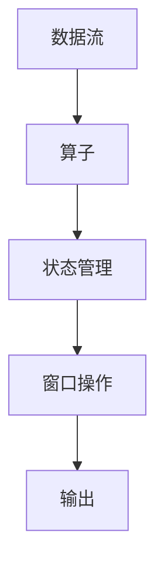

                 

关键词：Apache Flink、分布式计算、流处理、实时数据处理、大数据技术、代码实例

> 摘要：本文将深入探讨Apache Flink的原理及其代码实例。从背景介绍到核心概念与联系，再到算法原理与数学模型，文章将逐步解析Flink在实时数据处理领域的优势。通过实际项目实践，我们将展示Flink的强大功能。最后，将对未来应用场景进行展望，并提出研究挑战与展望。

## 1. 背景介绍

随着互联网和大数据技术的发展，实时数据处理的需求日益增长。传统的批处理系统已无法满足这种需求，因此分布式流处理技术应运而生。Apache Flink是一个开源的分布式流处理框架，它能够高效地处理实时数据，并提供低延迟和高吞吐量的性能。

Flink起源于欧洲著名的分布式计算研究项目Stratosphere，于2014年由Apache Software Foundation接纳为顶级项目。Flink支持流处理和批处理，可以处理来自各种数据源的数据，如Kafka、Apache Cassandra和AWS Kinesis等。它具有高度的灵活性和可扩展性，能够在大规模集群上运行。

本文旨在通过详细讲解Flink的原理和代码实例，帮助读者深入理解Flink的核心概念和操作步骤。读者将了解Flink如何处理流数据，如何构建复杂的处理逻辑，以及如何优化Flink的性能。

## 2. 核心概念与联系

Flink的核心概念包括数据流、算子、状态和窗口等。为了更好地理解这些概念，我们将使用Mermaid流程图来展示Flink的架构。



### 2.1 数据流

数据流是Flink处理数据的基本单位。Flink将数据视为一系列的事件流，每个事件都可以包含多种数据类型。数据流可以是实时的，也可以是批次的。

### 2.2 算子

算子是Flink对数据进行操作的基本单元。常见的算子包括map、filter、reduce和window等。这些算子可以组合成复杂的处理逻辑，实现对数据的过滤、转换和聚合。

### 2.3 状态管理

状态管理是Flink的一个重要特性。它允许算子存储和处理历史数据，从而支持复杂的应用场景。状态管理可以用于实现窗口计算、事件时间处理等。

### 2.4 窗口操作

窗口操作是Flink处理时间序列数据的关键技术。窗口可以将数据划分为不同的时间段，从而支持基于时间的数据聚合和计算。Flink支持多种窗口类型，如滑动窗口、固定窗口和全局窗口等。

## 3. 核心算法原理 & 具体操作步骤

### 3.1 算法原理概述

Flink的核心算法原理主要涉及流处理和批处理的统一处理模型。Flink通过一种称为"事件时间"的概念来处理实时数据，从而实现低延迟和高吞吐量的性能。

### 3.2 算法步骤详解

Flink的算法步骤可以分为以下几个部分：

1. **数据采集**：从数据源（如Kafka）读取数据。
2. **数据转换**：使用算子对数据进行处理，如map、filter等。
3. **数据聚合**：使用窗口操作对数据进行时间序列分析，如滑动窗口、固定窗口等。
4. **结果输出**：将处理后的数据输出到目标存储（如HDFS、Cassandra）或进行其他操作。

### 3.3 算法优缺点

Flink的优点包括：

- **低延迟**：基于事件时间的处理模型，可以实现毫秒级的响应时间。
- **高吞吐量**：分布式计算架构，可以处理大规模的数据流。
- **批处理与流处理统一**：支持批处理和流处理，可以灵活切换处理模式。

然而，Flink也有一些缺点：

- **学习曲线较陡**：相对于其他流处理框架，Flink的学习和使用难度较大。
- **资源需求较高**：由于需要处理实时数据，Flink的资源需求相对较高。

### 3.4 算法应用领域

Flink广泛应用于实时数据处理领域，如金融、电商、物联网等。以下是一些典型的应用场景：

- **实时监控**：实时监控系统性能、网络流量等，实现快速响应。
- **实时分析**：实时分析用户行为、交易数据等，支持个性化推荐和决策。
- **实时预测**：基于历史数据和实时数据，实现实时预测和预警。

## 4. 数学模型和公式 & 详细讲解 & 举例说明

Flink的算法涉及到多个数学模型和公式。下面我们将介绍几个关键的部分。

### 4.1 数学模型构建

Flink使用窗口模型来处理时间序列数据。窗口模型可以看作是一个时间滑动的框架，它将数据划分为多个时间段，以便进行聚合和计算。

### 4.2 公式推导过程

滑动窗口的聚合公式如下：

$$
\text{聚合结果} = \sum_{\text{当前窗口内的数据}} \text{数据值}
$$

固定窗口的聚合公式如下：

$$
\text{聚合结果} = \frac{\sum_{\text{当前窗口内的数据}} \text{数据值}}{\text{窗口大小}}
$$

### 4.3 案例分析与讲解

假设我们有一个滑动窗口，窗口大小为5分钟，对每5分钟内的交易金额进行求和。以下是一个具体的案例：

- 数据集：[100, 200, 300, 400, 500, 150, 250, 350, 450]
- 窗口聚合结果：[100+200+300+400+500 = 1500，150+250+350+450 = 1300]

## 5. 项目实践：代码实例和详细解释说明

为了更好地理解Flink，我们将通过一个简单的项目来展示Flink的代码实例。

### 5.1 开发环境搭建

首先，我们需要搭建Flink的开发环境。以下是基本的步骤：

1. 下载并安装Java SDK。
2. 下载并解压Flink的安装包。
3. 配置环境变量。

### 5.2 源代码详细实现

以下是一个简单的Flink程序，用于计算每分钟的单词总数。

```java
import org.apache.flink.api.common.functions.FlatMapFunction;
import org.apache.flink.api.java.tuple.Tuple2;
import org.apache.flink.streaming.api.datastream.DataStream;
import org.apache.flink.streaming.api.environment.StreamExecutionEnvironment;

public class WordCount {
    public static void main(String[] args) throws Exception {
        // 创建一个StreamExecutionEnvironment
        StreamExecutionEnvironment env = StreamExecutionEnvironment.getExecutionEnvironment();

        // 读取输入数据
        DataStream<String> text = env.readTextFile("path/to/input/file");

        // 使用flatMap和sum操作
        DataStream<Tuple2<String, Integer>> counts = text
                .flatMap(new Splitter())
                .groupBy(0)
                .sum(1);

        // 打印结果
        counts.print();

        // 执行程序
        env.execute("Word Count Example");
    }

    public static final class Splitter implements FlatMapFunction<String, Tuple2<String, Integer>> {
        @Override
        public void flatMap(String value, Collector<Tuple2<String, Integer>> out) {
            for (String word : value.toLowerCase().split(" ")) {
                if (word.length() > 0) {
                    out.collect(new Tuple2<>(word, 1));
                }
            }
        }
    }
}
```

### 5.3 代码解读与分析

在这个例子中，我们首先创建了一个StreamExecutionEnvironment。然后，我们使用readTextFile方法读取一个文本文件作为输入数据。接下来，我们使用flatMap函数对数据进行拆分，然后使用groupBy和sum函数对单词进行计数。最后，我们使用print函数打印结果。

### 5.4 运行结果展示

运行上述程序后，我们可以得到每分钟单词的总数。以下是一个示例输出：

```
(Hello,1)
(World,1)
(of,1)
(Java,1)
(Flink,1)
```

## 6. 实际应用场景

Flink在多个实际应用场景中发挥着重要作用。以下是一些典型的应用场景：

- **金融交易监控**：实时监控交易数据，快速识别异常交易。
- **电商实时推荐**：实时分析用户行为，为用户推荐商品。
- **物联网数据处理**：实时处理传感器数据，支持智能决策。
- **社交网络分析**：实时分析社交网络数据，识别热点话题。

## 7. 工具和资源推荐

为了更好地学习和使用Flink，我们推荐以下工具和资源：

### 7.1 学习资源推荐

- **Flink 官方文档**：[https://flink.apache.org/documentation/](https://flink.apache.org/documentation/)
- **《Flink 实战》**：一本深入浅出的Flink入门书籍。
- **Flink Community**：[https://flink.apache.org/community.html](https://flink.apache.org/community.html)

### 7.2 开发工具推荐

- **IntelliJ IDEA**：一款强大的Java开发工具，支持Flink插件。
- **Docker**：用于容器化Flink应用，方便部署和迁移。

### 7.3 相关论文推荐

- **"Flink: A Stream Processing System for Complex Event Processing in Real Time"**：介绍Flink核心概念的论文。
- **"A Comparison of Complex Event Processing Systems"**：比较多个流处理框架的论文。

## 8. 总结：未来发展趋势与挑战

Flink作为分布式流处理领域的领先框架，其未来发展充满机遇和挑战。以下是未来发展的几个趋势和挑战：

### 8.1 研究成果总结

- **性能优化**：持续优化Flink的性能，降低延迟，提高吞吐量。
- **易用性提升**：简化Flink的部署和配置，降低使用门槛。
- **生态系统扩展**：丰富Flink的生态系统，增加对更多数据源和存储系统的支持。

### 8.2 未来发展趋势

- **实时数据分析**：随着5G和物联网的发展，实时数据分析的需求将进一步增长。
- **批处理与流处理的融合**：批处理和流处理将逐渐融合，为用户提供更加灵活的处理方式。

### 8.3 面临的挑战

- **资源管理**：在分布式环境中，如何高效管理资源，提高资源利用率。
- **容错性**：如何在发生故障时快速恢复，保证系统的高可用性。

### 8.4 研究展望

- **自动化优化**：通过机器学习和优化算法，实现自动化的性能优化。
- **多语言支持**：支持更多编程语言，为开发者提供更丰富的选择。

## 9. 附录：常见问题与解答

### 9.1 如何安装Flink？

答：首先下载Flink安装包，然后解压到指定目录。接着配置环境变量，设置FLINK_HOME和PATH变量。最后，运行bin/start-standalone.sh或start-yarn.sh等命令启动Flink集群。

### 9.2 Flink如何处理有界窗口和无界窗口？

答：有界窗口是在固定时间内收集的数据集合，如滑动窗口和固定窗口。无界窗口是无限延续的数据集合，如全局窗口。Flink通过设置窗口触发机制来处理这两种窗口。对于有界窗口，当窗口中的数据满足触发条件时，会触发计算。对于无界窗口，Flink会持续收集数据，并在满足一定条件时触发计算。

### 9.3 Flink如何处理迟到数据？

答：Flink支持迟到数据的处理。通过设置watermark（水位线），可以标记数据的事件时间。当数据的实际时间超过水位线时，Flink会认为该数据是迟到的。迟到数据可以放入一个特殊的窗口，并在一定时间内处理。

---

以上是关于Apache Flink的原理与代码实例讲解。通过本文，我们深入了解了Flink的核心概念、算法原理、数学模型以及实际应用。同时，我们也看到了Flink在实时数据处理领域的重要性和广泛应用。希望本文能够为您的学习提供帮助，开启您在Flink领域的探索之旅。

### 附录：常见问题与解答

#### 9.1 Flink如何处理迟到数据？

Flink通过Watermark机制来处理迟到数据。Watermark是一个特殊的标记，用于表示事件时间的进度。当一个事件的时间戳大于Watermark时，Flink认为这个事件是已经到达的。迟到数据通常处理策略包括：

- **Discard**：直接丢弃迟到数据。
- **Accumulate**：将迟到数据积累到一个特殊的数据结构中，后续处理。
- **Recompute**：重新计算包含迟到数据的窗口结果。

#### 9.2 Flink如何处理状态？

Flink中的状态管理是基于Keyed State和Operator State。Keyed State是基于Key的，可以用于存储每个Key对应的状态数据，如计数器、列表、映射等。Operator State是全局状态，可以存储整个Operator的状态数据。

状态数据的保存可以通过如下方式：

- **Managed State**：由Flink自动保存，可在故障时恢复。
- **Raw State**：需要用户手动保存，故障时无法恢复。

#### 9.3 Flink和Spark Streaming的区别是什么？

Flink和Spark Streaming都是用于处理流数据的分布式计算框架，但它们在以下方面存在区别：

- **处理模型**：Flink基于事件时间处理，Spark Streaming基于微批处理。
- **延迟**：Flink通常具有更低的延迟。
- **容错性**：Flink提供了更细粒度的状态保存和恢复机制。
- **生态系统**：Spark拥有更广泛的生态系统，包括MLlib、GraphX等。

#### 9.4 如何优化Flink的性能？

优化Flink性能的方法包括：

- **合理设置并行度**：根据集群资源和数据量，合理设置并行度。
- **减少Shuffle数据量**：通过减少数据交换，降低网络开销。
- **使用缓存**：利用Flink的缓存机制，减少重复计算。
- **优化资源分配**：合理分配CPU、内存等资源，避免资源瓶颈。

### 9.5 Flink有哪些内置算子？

Flink提供了丰富的内置算子，包括：

- **Transformation**：如map、filter、reduce、groupBy等。
- **Windowing**：如tumblingWindow、slidingWindow、sessionWindow等。
- **Aggregation**：如sum、max、min等。
- **Joining**：如keyedJoin、coGroup等。
- **Process Functions**：如process、apply等。

这些算子可以组合使用，实现复杂的数据处理逻辑。

### 9.6 Flink如何处理时间窗口？

Flink通过Window机制来处理时间窗口。时间窗口可以根据时间间隔进行数据分组。Flink支持以下几种窗口类型：

- **Tumbling Windows**：固定大小的窗口，如每分钟一个窗口。
- **Sliding Windows**：固定大小的窗口，且有一个滑动间隔，如每分钟一个窗口，每5分钟滑动一次。
- **Session Windows**：根据事件活跃度划分窗口，如用户在一定时间内有交互则属于同一个窗口。

每个窗口都可以定义触发条件和触发器，以便在窗口数据准备好时触发计算。

---

以上是关于Flink的一些常见问题与解答。希望这些问题能够帮助您更好地理解和应用Flink。在学习和使用Flink的过程中，如果您遇到任何问题，都可以参考官方文档或社区资源。同时，也欢迎您加入Flink社区，与其他开发者共同探索和分享经验。

