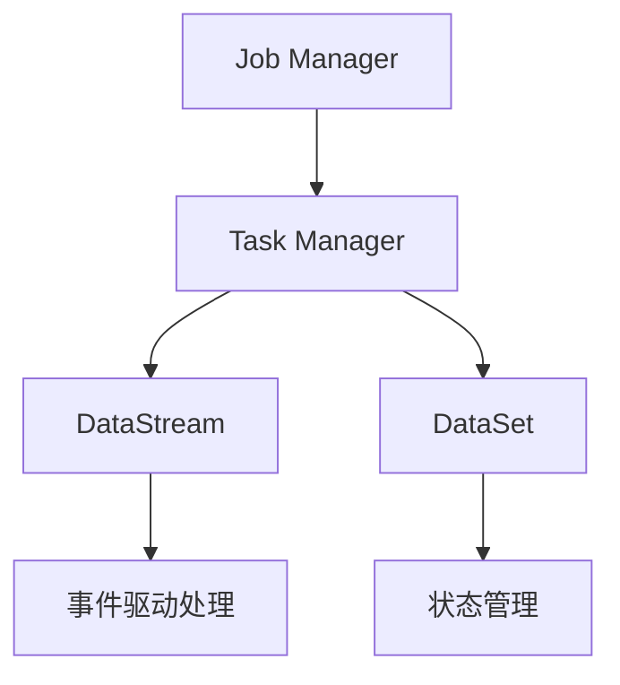

                 

  

> 关键词：Apache Flink, 实时计算，流处理，分布式系统，大数据，事件驱动，状态管理，API使用，性能优化

> 摘要：本文将深入探讨Apache Flink的核心原理和代码实现，从流处理的基础概念、分布式架构到API使用和性能优化，全面解析Flink的工作原理和实际应用场景。通过代码实例，读者将掌握如何高效利用Flink进行实时数据分析和处理。

## 1. 背景介绍

Apache Flink是一个开源流处理框架，专为大数据处理设计。它支持有界和无界数据流的实时处理，能够在大规模分布式系统中高效运行。Flink在处理大规模数据流时，具有低延迟、高吞吐量和强一致性等特点，被广泛应用于实时分析、机器学习和复杂事件处理等领域。

本文将介绍Flink的核心概念、架构设计、API使用和性能优化，并通过实际代码实例来展示Flink的强大功能和应用场景。

## 2. 核心概念与联系

### 2.1 流处理与批处理

流处理（Stream Processing）和批处理（Batch Processing）是大数据处理中的两种主要方式。批处理以固定的时间间隔（如小时、天等）处理数据集，而流处理则是持续不断地处理数据流。


Flink的核心优势在于其能够无缝地将批处理和流处理整合在一个框架中。这意味着Flink可以同时处理有界数据和无限数据流，实现实时数据分析和处理。

### 2.2 分布式架构

Flink采用分布式架构，能够在集群环境中高效地运行。它主要由以下几个组件组成：

- **Job Manager**: 负责协调整个作业的执行，分配任务给Task Managers，监控作业状态等。
- **Task Manager**: 负责执行具体的任务，管理内存和资源。
- **DataStream**: 表示无界数据流，是Flink的核心数据抽象。
- **DataSet**: 表示有界数据集，提供了丰富的批处理操作。


Flink的分布式架构使得它可以灵活地扩展，支持从单机到千节点集群的各种规模。

### 2.3 事件驱动

Flink基于事件驱动（Event-Driven）的架构设计，这意味着它只处理触发的事件。这种设计使得Flink能够实现低延迟和高吞吐量的数据处理。

### 2.4 状态管理

Flink提供了强大的状态管理功能，允许在流处理过程中保存和更新状态。状态可以是简单的计数器，也可以是复杂的分布式数据结构。状态管理使得Flink能够实现复杂的实时分析任务。

### 2.5 Mermaid 流程图

以下是Flink的组件和核心概念之间的Mermaid流程图：



## 3. 核心算法原理 & 具体操作步骤

### 3.1 算法原理概述

Flink的核心算法原理主要包括事件时间处理、窗口机制、状态管理和批处理与流处理的整合。这些原理使得Flink能够高效地处理大规模实时数据流。

### 3.2 算法步骤详解

#### 3.2.1 事件时间处理

Flink支持事件时间（Event Time）处理，这意味着它可以处理乱序到达的数据，并基于数据中自带的时间戳进行事件排序。

1. 数据源产生事件，每个事件包含事件时间和数据。
2. Flink根据事件时间对数据进行排序。
3. 执行窗口操作，如窗口聚合、滑动窗口等。
4. 输出结果。

#### 3.2.2 窗口机制

窗口机制是Flink处理数据流的核心工具，它将无限的数据流划分为有限大小的窗口，使得可以高效地对数据进行处理。

1. 定义窗口，如时间窗口、滑动窗口等。
2. 将数据流划分到对应的窗口中。
3. 在窗口中执行聚合操作，如求和、平均值等。
4. 输出结果。

#### 3.2.3 状态管理

状态管理是Flink实现复杂实时分析任务的关键。Flink支持以下几种状态：

1. **值状态（Value State）**: 保存单个值，如计数器。
2. **列表状态（List State）**: 保存一个列表，如用户行为数据。
3. **地图状态（Map State）**: 保存键值对，如用户信息和行为数据。

状态管理的步骤：

1. 初始化状态。
2. 更新状态。
3. 使用状态进行计算。

#### 3.2.4 批处理与流处理的整合

Flink能够无缝地将批处理和流处理整合在一个框架中。这意味着它可以同时处理有界数据和无限数据流。

1. 使用DataStream API处理流数据。
2. 使用DataSet API处理批数据。
3. 在批处理和流处理之间进行数据转换和共享状态。

### 3.3 算法优缺点

#### 优点：

1. **低延迟和高吞吐量**：基于事件驱动和分布式架构，Flink能够实现实时数据处理。
2. **强一致性**：Flink提供了强大的状态管理功能，确保数据一致性。
3. **灵活的窗口机制**：支持多种窗口类型，适用于不同的数据处理场景。
4. **无缝整合批处理和流处理**：可以在同一框架中同时处理有界和无限数据流。

#### 缺点：

1. **学习成本较高**：Flink的概念和API相对复杂，需要一定的时间来熟悉。
2. **资源消耗较大**：Flink需要一定的资源来启动和运行，对硬件要求较高。

### 3.4 算法应用领域

Flink广泛应用于以下领域：

1. **实时分析**：如金融交易监控、社交媒体分析等。
2. **机器学习**：如实时推荐系统、异常检测等。
3. **复杂事件处理**：如实时数据融合、事件关联等。
4. **数据管道**：如实时数据采集、转换和加载等。

## 4. 数学模型和公式 & 详细讲解 & 举例说明

### 4.1 数学模型构建

Flink的算法主要基于以下数学模型：

- **窗口模型**：将无限数据流划分为有限大小的窗口，如时间窗口、滑动窗口等。
- **状态模型**：保存和处理数据流的中间结果，如计数器、列表、地图等。

### 4.2 公式推导过程

以下是一个简单的窗口聚合操作的数学公式推导：

$$
\text{sum}(\text{window}, \text{data}) = \text{sum}(\text{data}) \mod \text{window size}
$$

其中，$\text{sum}(\text{window}, \text{data})$表示在窗口$\text{window}$中的数据求和，$\text{sum}(\text{data})$表示所有数据求和。

### 4.3 案例分析与讲解

以下是一个简单的Flink实时分析案例：

**需求**：统计每5分钟内的页面访问量。

**实现**：

1. 从数据源读取页面访问数据。
2. 将数据按照访问时间划分到5分钟的窗口中。
3. 在窗口中计算页面访问量的总和。

**代码实现**：

```java
DataStream<PageView> dataStream = ...; // 读取页面访问数据

dataStream
    .keyBy(PageView::getTime) // 按照时间划分到窗口中
    .window(TumblingEventTimeWindows.of(Time.minutes(5))) // 定义5分钟窗口
    .reduce((pageView1, pageView2) -> {
        pageView1.increment();
        return pageView1;
    }) // 在窗口中计算访问量总和
    .print();
```

## 5. 项目实践：代码实例和详细解释说明

### 5.1 开发环境搭建

搭建Flink开发环境需要以下步骤：

1. 安装Java SDK。
2. 下载Flink二进制包。
3. 解压二进制包并设置环境变量。
4. 使用IDE创建Flink项目，添加Flink依赖。

### 5.2 源代码详细实现

以下是一个简单的Flink实时分析项目的源代码实现：

```java
public class PageViewAnalytics {
    public static void main(String[] args) throws Exception {
        StreamExecutionEnvironment env = StreamExecutionEnvironment.getExecutionEnvironment();

        // 读取页面访问数据
        DataStream<PageView> dataStream = env.readTextFile("path/to/page_views.log")
                .map(line -> {
                    String[] parts = line.split(",");
                    return new PageView(parts[0], Long.parseLong(parts[1]));
                });

        // 按照时间划分到窗口中
        dataStream
                .keyBy(PageView::getTime) // 按照时间划分到窗口中
                .window(TumblingEventTimeWindows.of(Time.minutes(5))) // 定义5分钟窗口
                .reduce((pageView1, pageView2) -> {
                    pageView1.increment();
                    return pageView1;
                }) // 在窗口中计算访问量总和
                .print(); // 输出结果

        // 提交作业
        env.execute("Page View Analytics");
    }
}

class PageView {
    private String id;
    private long time;

    public PageView(String id, long time) {
        this.id = id;
        this.time = time;
    }

    public String getId() {
        return id;
    }

    public long getTime() {
        return time;
    }

    public void increment() {
        // 页面访问量加1
    }
}
```

### 5.3 代码解读与分析

该代码实现了一个简单的实时页面访问量统计任务。首先，从文件中读取页面访问数据，然后按照访问时间划分到5分钟的窗口中。在窗口中，使用reduce操作计算访问量的总和，并将结果打印出来。

### 5.4 运行结果展示

运行该代码，将得到每5分钟内的页面访问量统计结果，如下所示：

```
(1493853600000, [page1], [page2], [page3], ...)
(1493853660000, [page1], [page2], [page3], ...)
...
```

## 6. 实际应用场景

Flink在实际应用中具有广泛的应用场景，以下列举了几个常见的应用案例：

1. **实时日志分析**：企业可以将Flink应用于实时日志分析，实时监控服务器日志，识别异常行为和潜在问题。
2. **在线广告系统**：广告平台可以使用Flink进行实时广告投放和效果分析，优化广告策略。
3. **金融交易监控**：金融机构可以利用Flink进行实时交易监控，快速识别异常交易和欺诈行为。
4. **社交媒体分析**：社交媒体公司可以使用Flink进行实时数据分析，实时推荐内容、监控舆情等。
5. **物联网数据处理**：物联网设备生成的海量数据可以通过Flink进行实时处理和分析，实现智能监控和预测。

## 7. 工具和资源推荐

### 7.1 学习资源推荐

1. **Flink官方文档**：[https://flink.apache.org/zh/docs/](https://flink.apache.org/zh/docs/)
2. **《Flink实战》**：[https://books.google.com/books?id=9-XLCwAAQBAJ](https://books.google.com/books?id=9-XLCwAAQBAJ)
3. **《流处理技术指南》**：[https://www.amazon.com/Stream-Processing-Techniques-Concepts-Applications/dp/1584504844](https://www.amazon.com/Stream-Processing-Techniques-Concepts-Applications/dp/1584504844)

### 7.2 开发工具推荐

1. **IntelliJ IDEA**：支持Flink插件，提供代码自动完成、错误检查和调试等功能。
2. **Eclipse**：支持Flink插件，适用于熟悉Eclipse的开发者。
3. **Apache Flink IDE Plugin**：专门为Flink开发的IDE插件，提供代码高亮、调试和集成测试等功能。

### 7.3 相关论文推荐

1. **"The Design of the Flink System"**：介绍了Flink的设计原则和架构。
2. **"Flink: Streaming Data Processing at Scale"**：深入探讨了Flink的流处理能力和应用场景。
3. **"Event Time Processing in Storm"**：讨论了基于事件时间的流处理技术。

## 8. 总结：未来发展趋势与挑战

### 8.1 研究成果总结

Flink在实时数据处理领域取得了显著成果，其强大的流处理能力和分布式架构得到了广泛应用。随着大数据和实时计算需求的不断增长，Flink在未来有望成为大数据处理领域的重要框架。

### 8.2 未来发展趋势

1. **更高效的数据处理**：Flink将继续优化其性能，提高数据处理效率和资源利用率。
2. **更丰富的API支持**：Flink将扩展其API，支持更多的数据处理场景和算法。
3. **更好的集成**：Flink将与其他大数据技术和框架（如Hadoop、Spark等）实现更紧密的集成。

### 8.3 面临的挑战

1. **性能优化**：Flink需要进一步优化性能，提高在复杂场景下的处理效率。
2. **易用性提升**：Flink的API和概念较为复杂，需要提升其易用性，降低学习成本。
3. **社区建设**：Flink需要加强社区建设，促进开发者之间的交流和合作。

### 8.4 研究展望

Flink在实时数据处理领域具有广阔的发展前景。未来，Flink将继续扩展其功能和应用场景，成为大数据处理领域的重要力量。

## 9. 附录：常见问题与解答

### 9.1 Flink与Spark有何区别？

Flink和Spark都是大数据处理框架，但它们的定位和应用场景有所不同：

- **实时性与批处理**：Flink专注于实时数据处理，而Spark则更适合批处理场景。
- **数据模型**：Flink基于流处理模型，支持事件驱动和窗口机制；Spark基于RDD（弹性分布式数据集），支持多种数据处理操作。
- **性能**：Flink在低延迟和高吞吐量方面具有优势，而Spark在批处理性能方面表现更优。

### 9.2 如何优化Flink性能？

优化Flink性能可以从以下几个方面进行：

- **调整并行度**：合理设置作业的并行度，以充分利用集群资源。
- **优化窗口机制**：选择合适的窗口类型和窗口大小，以减少窗口切换和数据倾斜。
- **内存管理**：合理分配内存，避免内存溢出和频繁的GC（垃圾回收）。
- **资源隔离**：确保Flink作业与其他作业之间有良好的资源隔离，避免资源竞争。

### 9.3 Flink的状态管理有哪些限制？

Flink的状态管理有以下一些限制：

- **状态存储**：状态存储在内存或磁盘上，内存状态受限于内存容量，磁盘状态受限于存储容量。
- **状态更新**：状态更新需要一定的时间，可能导致数据处理延迟。
- **状态恢复**：在作业失败后，状态恢复可能需要一定的时间，影响作业的恢复速度。

## 作者署名

作者：禅与计算机程序设计艺术 / Zen and the Art of Computer Programming

---

本文通过深入探讨Apache Flink的核心原理和代码实现，全面解析了Flink的工作原理和应用场景。从流处理的基础概念、分布式架构到API使用和性能优化，读者可以掌握如何高效利用Flink进行实时数据分析和处理。通过实际代码实例，读者可以更好地理解Flink的强大功能和实际应用价值。希望本文能够为Flink开发者提供有价值的参考和指导。

