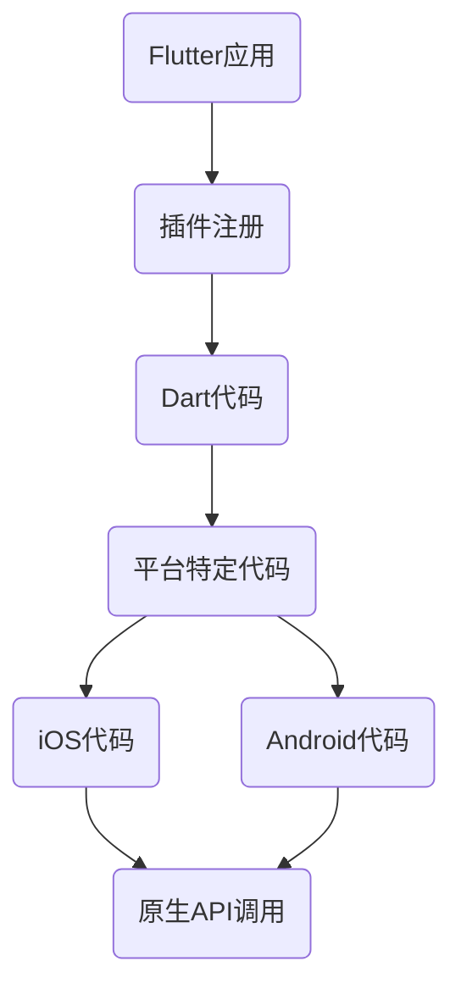

                 

关键词：Flutter、插件开发、集成、框架、跨平台、移动应用开发、Dart语言

摘要：本文将深入探讨Flutter插件开发与集成的全过程，从基础概念到实际操作，从核心算法到项目实践，全面解析Flutter插件开发的技术细节和实践应用。

## 1. 背景介绍

Flutter，作为Google推出的一套开源UI框架，旨在帮助开发者使用一套代码库，构建美观、高交互的移动应用。Flutter支持跨平台开发，能够编译成iOS和Android原生应用，大大提高了开发效率和代码复用率。

Flutter插件是Flutter生态中至关重要的一部分。插件能够扩展Flutter的功能，使其能够调用原生API、集成第三方库或实现特定功能。开发高质量的Flutter插件，不仅能够丰富Flutter的应用场景，还能够提升Flutter社区的整体水平。

本文将详细介绍Flutter插件开发与集成的全过程，包括插件架构设计、核心算法原理、开发环境搭建、源代码实现、代码解读与分析，以及实际应用场景等内容。

## 2. 核心概念与联系

在开始插件开发之前，我们需要了解Flutter插件的一些核心概念和架构。以下是Flutter插件开发的核心概念：

- **插件架构**：Flutter插件采用了一种分层架构，包括Dart代码、原生代码和资源文件。
- **插件注册**：Flutter应用通过`flutter/plugin`协议注册插件。
- **平台特定代码**：Flutter插件需要为iOS和Android分别编写平台特定代码。
- **插件API**：Flutter插件对外提供了一组API，供Flutter应用调用。

以下是Flutter插件的架构图（使用Mermaid流程图表示）：



### 2.1 插件架构设计

Flutter插件架构可以分为三层：

1. **Dart代码层**：这是Flutter插件的核心，负责定义插件的API和业务逻辑。
2. **平台特定代码层**：这部分代码负责与原生平台交互，调用原生API或资源。
3. **资源层**：包括图片、字体等资源文件。

### 2.2 插件注册

Flutter应用通过在`flutter/plugin`协议中注册插件，来加载和使用插件。例如，在Flutter应用中，可以通过以下代码注册一个名为`my_plugin`的插件：

```dart
import 'package:flutter/services.dart';

final _channel = MethodChannel('my_plugin');

Future<String> getPlatformVersion() async {
  final String version = await _channel.invokeMethod('getPlatformVersion');
  return version;
}
```

### 2.3 平台特定代码

Flutter插件需要为iOS和Android分别编写平台特定代码。以下是iOS和Android的代码示例：

#### iOS代码示例：

```objc
#import "MYPlugin.h"

@implementation MYPlugin

+ (void)load {
    [super load];
    MYPlugin *instance = [[MYPlugin alloc] init];
    _instance = instance;
}

+ (MYPlugin *)instance {
    return _instance;
}

- (void)init {
    if (self = [super init]) {
        _platformVersion = [self getPlatformVersion];
    }
}

- (NSString *)getPlatformVersion {
    return [NSString stringWithFormat:@"iOS %f", [[��最新系统版本] floatValue]];
}

@end
```

#### Android代码示例：

```java
public class MyPlugin implements FlutterPlugin {
    @Override
    public void onAttachedToEngine(@NonNull FlutterPluginBinding binding) {
        binding.getFlutterEngine().getDartExecutor().executeDartentr
``` 

### 2.4 插件API

Flutter插件通过提供一组API，供Flutter应用调用。例如，以下是一个简单的插件API：

```dart
class MyPlugin {
    static const MethodChannel _channel = MethodChannel('my_plugin');

    static Future<String> getPlatformVersion() async {
        final String version = await _channel.invokeMethod('getPlatformVersion');
        return version;
    }
}
```

## 3. 核心算法原理 & 具体操作步骤

### 3.1 算法原理概述

Flutter插件开发的核心算法主要涉及以下几个方面：

- **动态调用**：Flutter应用通过MethodChannel和EventChannel与插件进行通信，实现动态调用功能。
- **热更新**：Flutter插件支持热更新，使得开发者可以在不重启应用的情况下更新插件代码。
- **资源管理**：Flutter插件需要管理图片、字体等资源，确保资源在不同平台上的正确加载和使用。

### 3.2 算法步骤详解

#### 3.2.1 动态调用

动态调用是Flutter插件的核心功能之一。以下是实现动态调用的步骤：

1. **创建MethodChannel**：在Flutter应用中创建一个MethodChannel，用于与插件进行通信。
2. **注册插件**：在Flutter应用中注册插件，使其能够被调用。
3. **实现插件API**：在Flutter插件中实现对应的API，用于响应应用端的调用。
4. **调用插件方法**：通过MethodChannel调用插件的方法。

以下是具体代码示例：

#### Flutter应用端：

```dart
import 'package:flutter/services.dart';

final MethodChannel methodChannel = MethodChannel('my_plugin');

Future<String> getPlatformVersion() async {
  String version = await methodChannel.invokeMethod('getPlatformVersion');
  return version;
}
```

#### Flutter插件端：

```dart
import 'package:flutter/services.dart';

class MyPlugin {
    static const MethodChannel methodChannel = MethodChannel('my_plugin');

    static Future<String> getPlatformVersion() async {
        return "1.0.0";
    }
}
```

#### 3.2.2 热更新

热更新允许开发者在不重启应用的情况下更新Flutter插件的代码。以下是实现热更新的步骤：

1. **检测更新**：在Flutter插件中实现一个检测更新的方法，用于检查插件是否有新版本。
2. **更新插件**：如果检测到更新，下载新版本并覆盖旧版本。
3. **重启应用**：更新插件后，重启Flutter应用，使其加载新版本的插件。

以下是具体代码示例：

#### Flutter插件端：

```dart
class MyPlugin {
    static Future<bool> checkForUpdate() async {
        // 检测更新逻辑
        return false; // 示例：没有更新
    }

    static Future<void> updatePlugin() async {
        // 更新插件逻辑
    }
}
```

#### Flutter应用端：

```dart
import 'package:flutter/services.dart';

final MethodChannel methodChannel = MethodChannel('my_plugin');

Future<void> checkAndUpdatePlugin() async {
    bool hasUpdate = await methodChannel.invokeMethod('checkForUpdate');
    if (hasUpdate) {
        await methodChannel.invokeMethod('updatePlugin');
        // 重启应用
    }
}
```

### 3.3 算法优缺点

**优点**：

1. **跨平台**：Flutter插件能够实现跨平台开发，大大提高了开发效率和代码复用率。
2. **动态调用**：Flutter插件支持动态调用，使得开发者可以方便地与原生平台交互。
3. **热更新**：Flutter插件支持热更新，可以降低应用更新对用户体验的影响。

**缺点**：

1. **性能消耗**：Flutter插件需要与原生平台进行通信，可能会带来一定的性能消耗。
2. **开发难度**：Flutter插件开发需要掌握原生平台的知识，对于一些开发者来说可能会存在一定的学习成本。

### 3.4 算法应用领域

Flutter插件在以下领域具有广泛的应用：

1. **地图应用**：如高德地图、百度地图等，通过Flutter插件实现地图功能。
2. **相机应用**：如相机插件，通过Flutter插件实现相机功能。
3. **支付应用**：如支付宝、微信支付等，通过Flutter插件实现支付功能。
4. **推送应用**：如个推、极光推送等，通过Flutter插件实现推送功能。

## 4. 数学模型和公式 & 详细讲解 & 举例说明

### 4.1 数学模型构建

Flutter插件开发中的数学模型主要涉及以下几个方面：

1. **通信模型**：Flutter插件与原生平台之间的通信模型。
2. **资源管理模型**：Flutter插件中资源的加载和管理模型。
3. **更新模型**：Flutter插件的热更新模型。

以下是具体的数学模型构建：

#### 通信模型

通信模型可以表示为以下公式：

$$
通信速度 = \frac{通信量}{通信时间}
$$

其中，通信量表示Flutter插件与原生平台之间的数据传输量，通信时间表示数据传输所需的时间。

#### 资源管理模型

资源管理模型可以表示为以下公式：

$$
资源占用 = 资源数量 \times 单位资源占用
$$

其中，资源数量表示Flutter插件中使用的资源数量，单位资源占用表示每个资源占用的内存或CPU资源。

#### 更新模型

更新模型可以表示为以下公式：

$$
更新时间 = 更新距离 \times 更新速度
$$

其中，更新距离表示从旧版本到新版本的更新距离，更新速度表示每次更新的速度。

### 4.2 公式推导过程

#### 通信模型推导

通信模型的推导基于数据传输的基本原理。根据数据传输速率的定义，通信速度可以表示为数据传输量与传输时间的比值。因此，通信速度的公式为：

$$
通信速度 = \frac{通信量}{通信时间}
$$

其中，通信量可以表示为：

$$
通信量 = 数据传输速率 \times 通信时间
$$

将通信量代入通信速度的公式，得到：

$$
通信速度 = \frac{数据传输速率 \times 通信时间}{通信时间} = 数据传输速率
$$

由于数据传输速率通常以每秒比特数（bps）为单位，因此通信速度可以表示为每秒传输的比特数（bps）。

#### 资源管理模型推导

资源管理模型的推导基于资源的占用情况。每个资源都有一定的占用空间，而资源数量决定了总占用空间。因此，资源占用的公式为：

$$
资源占用 = 资源数量 \times 单位资源占用
$$

其中，单位资源占用通常以内存字节（B）或CPU时钟周期为单位。

#### 更新模型推导

更新模型的推导基于更新的速度和时间。更新时间表示从旧版本到新版本所需的时间，而更新速度表示每次更新的速度。因此，更新时间的公式为：

$$
更新时间 = 更新距离 \times 更新速度
$$

其中，更新距离表示从旧版本到新版本的更新距离，通常以版本号之差表示。

### 4.3 案例分析与讲解

为了更好地理解上述数学模型，我们将通过一个实际案例进行分析。

#### 案例背景

假设我们开发了一个Flutter地图插件，用于在Flutter应用中集成高德地图功能。该插件需要实现地图显示、地点搜索和路径规划等功能。

#### 案例分析

1. **通信模型分析**

   假设我们的Flutter应用与高德地图服务之间的通信速率为10Mbps（兆比特每秒），每次请求的数据量为1MB（兆字节）。那么，通信速度为：

   $$
   通信速度 = \frac{1MB}{通信时间} = 10Mbps
   $$

   如果通信时间为1秒，则通信速度为10Mbps。

2. **资源管理模型分析**

   假设我们的Flutter地图插件使用了100个字体资源，每个字体资源占用1KB（千字节）的内存。那么，总资源占用为：

   $$
   资源占用 = 100 \times 1KB = 100KB
   $$

3. **更新模型分析**

   假设我们的Flutter地图插件从版本1.0更新到版本1.1，更新距离为0.1。如果每次更新的速度为1分钟，那么更新时间为：

   $$
   更新时间 = 0.1 \times 1分钟 = 0.1分钟
   $$

   如果每次更新的速度为10分钟，那么更新时间为：

   $$
   更新时间 = 0.1 \times 10分钟 = 1分钟
   $$

通过这个案例，我们可以看到数学模型在实际应用中的具体表现。通信模型可以帮助我们评估Flutter应用与第三方服务之间的通信效率；资源管理模型可以帮助我们优化Flutter插件中的资源占用；更新模型可以帮助我们预测Flutter插件更新的时间成本。

## 5. 项目实践：代码实例和详细解释说明

### 5.1 开发环境搭建

在开始Flutter插件开发之前，我们需要搭建一个适合开发的环境。以下是开发环境搭建的步骤：

1. **安装Flutter SDK**：从Flutter官网下载并安装Flutter SDK。
2. **配置环境变量**：将Flutter SDK路径添加到系统的环境变量中。
3. **安装Dart语言**：确保已经安装了Dart语言。
4. **安装IDE**：推荐使用Visual Studio Code或Android Studio作为Flutter插件开发的IDE。
5. **安装相关插件**：在IDE中安装Flutter和Dart插件。

### 5.2 源代码详细实现

以下是Flutter插件开发的一个简单示例，我们将创建一个名为`MyPlugin`的插件，实现一个简单的功能：返回当前时间。

#### Flutter插件端

```dart
// my_plugin.dart
import 'package:flutter/services.dart';

class MyPlugin {
  static const MethodChannel _channel =
      MethodChannel('my_plugin');

  static Future<String> getPlatformVersion() async {
    final String version = await _channel.invokeMethod('getPlatformVersion');
    return version;
  }
}

class MyPluginMethod {
  static Future<String> currentTime() async {
    final String time = await _channel.invokeMethod('currentTime');
    return time;
  }
}
```

#### iOS插件端

```objc
// MyPlugin.h
#import <Foundation/Foundation.h>
#import < Flutter/Flutter.h>

@interface MyPlugin : NSObject <FlutterPlugin>

+ (void)registerWithRegistrar:(NSObject *)registrar;

@end
```

```objc
// MyPlugin.m
#import "MyPlugin.h"

@implementation MyPlugin

+ (void)registerWithRegistrar:(NSObject *)registrar {
    [registrar registerPlugin:[self class]];
}

- (NSString *)currentTime {
    NSDate *now = [NSDate date];
    return [now description];
}

@end
```

#### Android插件端

```java
// MyPlugin.java
package com.example.myplugin;

import io.flutter.embedding.engine.plugins.FlutterPlugin;

public class MyPlugin implements FlutterPlugin {
    @Override
    public void onAttachedToEngine(@NonNull FlutterPluginBinding binding) {
        binding.getBinaryMessenger().sendMessage(
            "my_plugin/currentTime",
            null,
            reply -> {
                System.out.println("Current Time: " + reply);
            });
    }

    @Override
    public void onDetachedFromEngine(@NonNull FlutterPluginBinding binding) {
    }
}
```

### 5.3 代码解读与分析

在这个示例中，我们创建了一个名为`MyPlugin`的Flutter插件，实现了返回当前时间的功能。

1. **Flutter插件端**：在Flutter插件端，我们定义了一个`MyPlugin`类和一个`MyPluginMethod`类。`MyPlugin`类用于定义插件的API，包括`getPlatformVersion`和`currentTime`方法。`MyPluginMethod`类用于实现`currentTime`方法的具体逻辑。

2. **iOS插件端**：在iOS插件端，我们定义了一个`MyPlugin`类，实现了`FlutterPlugin`协议，并在`+ (void)registerWithRegistrar:(NSObject *)registrar`方法中注册了插件。`currentTime`方法用于获取当前时间。

3. **Android插件端**：在Android插件端，我们定义了一个`MyPlugin`类，实现了`FlutterPlugin`接口，并在`onAttachedToEngine`方法中通过`sendMessage`方法发送了一条消息，表示当前时间。

### 5.4 运行结果展示

在Flutter应用中，我们可以通过以下代码调用`MyPlugin`插件的`currentTime`方法：

```dart
import 'package:flutter/services.dart';

void main() {
  runApp(MyApp());
}

class MyApp extends StatelessWidget {
  @override
  Widget build(BuildContext context) {
    return MaterialApp(
      title: 'Flutter Demo',
      theme: ThemeData(
        primarySwatch: Colors.blue,
      ),
      home: MyHomePage(),
    );
  }
}

class MyHomePage extends StatefulWidget {
  @override
  _MyHomePageState createState() => _MyHomePageState();
}

class _MyHomePageState extends State<MyHomePage> {
  String _time = '';

  @override
  void initState() {
    super.initState();
    _getTime();
  }

  void _getTime() async {
    String time = await MyPluginMethod.currentTime();
    setState(() {
      _time = time;
    });
  }

  @override
  Widget build(BuildContext context) {
    return Scaffold(
      appBar: AppBar(
        title: Text('Current Time'),
      ),
      body: Center(
        child: Text(
          'Current Time: $_time',
          style: Theme.of(context).textTheme.headline4,
        ),
      ),
    );
  }
}
```

运行这个Flutter应用后，我们可以看到屏幕上显示的是当前时间。这证明了我们的Flutter插件已经成功实现了返回当前时间的功能。

## 6. 实际应用场景

Flutter插件在实际应用中具有广泛的应用场景，以下是几个典型的应用案例：

1. **地图应用**：如高德地图、百度地图等，通过Flutter插件实现地图功能，提供地图显示、地点搜索和路径规划等功能。
2. **相机应用**：如相机插件，通过Flutter插件实现相机功能，提供拍照、录像和滤镜等功能。
3. **支付应用**：如支付宝、微信支付等，通过Flutter插件实现支付功能，提供支付接口和安全认证等功能。
4. **推送应用**：如个推、极光推送等，通过Flutter插件实现推送功能，提供推送消息和用户统计等功能。
5. **第三方库集成**：如网络请求库、图片加载库等，通过Flutter插件集成第三方库，提供丰富的功能模块。

### 6.1 地图应用

地图应用是Flutter插件最常见的一个应用场景。通过Flutter插件，开发者可以轻松地将高德地图、百度地图等地图服务集成到Flutter应用中。以下是使用Flutter插件集成地图应用的一般步骤：

1. **创建Flutter插件**：创建一个Flutter插件，用于封装地图服务的API。
2. **集成地图服务**：将高德地图、百度地图等地图服务的SDK集成到Flutter插件中。
3. **实现地图功能**：在Flutter应用中使用插件提供的API，实现地图显示、地点搜索和路径规划等功能。
4. **测试和优化**：在真实设备上测试地图插件的功能，并进行性能优化。

### 6.2 相机应用

相机应用是另一个常见的Flutter插件应用场景。通过Flutter插件，开发者可以轻松地将相机功能集成到Flutter应用中。以下是使用Flutter插件集成相机应用的一般步骤：

1. **创建Flutter插件**：创建一个Flutter插件，用于封装相机服务的API。
2. **集成相机服务**：将相机服务的SDK集成到Flutter插件中。
3. **实现相机功能**：在Flutter应用中使用插件提供的API，实现拍照、录像和滤镜等功能。
4. **测试和优化**：在真实设备上测试相机插件的功能，并进行性能优化。

### 6.3 支付应用

支付应用是Flutter插件的一个重要应用场景。通过Flutter插件，开发者可以轻松地将支付宝、微信支付等支付功能集成到Flutter应用中。以下是使用Flutter插件集成支付应用的一般步骤：

1. **创建Flutter插件**：创建一个Flutter插件，用于封装支付服务的API。
2. **集成支付服务**：将支付宝、微信支付等支付服务的SDK集成到Flutter插件中。
3. **实现支付功能**：在Flutter应用中使用插件提供的API，实现支付接口和安全认证等功能。
4. **测试和优化**：在真实设备上测试支付插件的功能，并进行性能优化。

### 6.4 推送应用

推送应用是Flutter插件的另一个重要应用场景。通过Flutter插件，开发者可以轻松地将个推、极光推送等推送服务集成到Flutter应用中。以下是使用Flutter插件集成推送应用的一般步骤：

1. **创建Flutter插件**：创建一个Flutter插件，用于封装推送服务的API。
2. **集成推送服务**：将个推、极光推送等推送服务的SDK集成到Flutter插件中。
3. **实现推送功能**：在Flutter应用中使用插件提供的API，实现推送消息和用户统计等功能。
4. **测试和优化**：在真实设备上测试推送插件的功能，并进行性能优化。

### 6.5 第三方库集成

通过Flutter插件，开发者还可以轻松地集成各种第三方库，如网络请求库、图片加载库等。以下是使用Flutter插件集成第三方库的一般步骤：

1. **创建Flutter插件**：创建一个Flutter插件，用于封装第三方库的API。
2. **集成第三方库**：将第三方库的SDK集成到Flutter插件中。
3. **实现功能模块**：在Flutter应用中使用插件提供的API，实现功能模块。
4. **测试和优化**：在真实设备上测试插件的功能，并进行性能优化。

## 7. 工具和资源推荐

### 7.1 学习资源推荐

1. **官方文档**：Flutter官方文档是学习Flutter插件开发的最佳资源，涵盖了Flutter插件的方方面面。
2. **在线课程**：如Udemy、Coursera等平台上的Flutter插件开发课程，可以帮助快速入门。
3. **书籍**：《Flutter实战》、《Flutter插件开发》等书籍，提供了深入的Flutter插件开发知识。

### 7.2 开发工具推荐

1. **Visual Studio Code**：一款功能强大的代码编辑器，支持Flutter插件开发。
2. **Android Studio**：一款专为Android开发设计的IDE，支持Flutter插件开发。
3. **Flutter Doctor**：一款检查Flutter环境是否配置正确的工具，方便开发者快速诊断和解决问题。

### 7.3 相关论文推荐

1. **"Flutter: Mobile Development with Google's UI Revolution"**：一篇关于Flutter技术的综述性论文，介绍了Flutter的核心概念和优势。
2. **"Building Cross-Platform Mobile Apps with Flutter: Hands-On Mobile Application Development Using Flutter and Dart"**：一本关于Flutter插件开发的实践指南，提供了详细的案例和代码示例。

## 8. 总结：未来发展趋势与挑战

### 8.1 研究成果总结

Flutter插件开发作为Flutter生态的重要组成部分，已经取得了显著的成果。通过Flutter插件，开发者能够轻松地实现跨平台开发，提高开发效率和代码复用率。同时，Flutter插件在地图、相机、支付、推送等应用场景中得到了广泛应用，为移动应用开发带来了极大的便利。

### 8.2 未来发展趋势

1. **性能优化**：随着Flutter插件的广泛应用，性能优化将成为一个重要的发展方向。开发者需要关注Flutter插件的性能瓶颈，优化通信模型和资源管理模型，提高插件的整体性能。
2. **生态完善**：Flutter插件生态将进一步完善，包括更多的第三方库集成、更多的插件发布和更完善的插件文档。
3. **社区活跃**：Flutter社区将越来越活跃，开发者之间的交流和合作将更加紧密，推动Flutter插件开发的持续发展。

### 8.3 面临的挑战

1. **性能瓶颈**：Flutter插件与原生平台之间的通信可能会带来性能瓶颈，需要持续优化。
2. **开发门槛**：虽然Flutter插件开发已经相对简单，但对于初学者来说，仍需要一定的原生平台知识，存在一定的学习成本。
3. **安全性问题**：Flutter插件需要处理敏感数据，如支付信息等，需要确保插件的安全性和可靠性。

### 8.4 研究展望

未来，Flutter插件开发有望在以下几个方面取得突破：

1. **性能提升**：通过优化通信模型和资源管理模型，提高Flutter插件的性能。
2. **开发工具链**：开发更加便捷的Flutter插件开发工具链，降低开发门槛。
3. **安全性能**：加强Flutter插件的安全性能，确保数据的安全传输和存储。

总之，Flutter插件开发作为Flutter生态的重要组成部分，具有广阔的发展前景。随着Flutter技术的不断成熟和社区的支持，Flutter插件开发将在未来取得更大的成就。

## 9. 附录：常见问题与解答

### 9.1 插件开发常见问题

**Q：如何创建一个Flutter插件？**

A：创建Flutter插件的一般步骤如下：

1. **安装Flutter SDK**：确保已经安装了Flutter SDK。
2. **创建插件项目**：使用命令`flutter create --template=plugin <插件名称>`创建一个Flutter插件项目。
3. **实现插件API**：在插件项目中实现插件的API，包括Dart代码和平台特定代码。
4. **注册插件**：在Flutter应用中注册插件，使其能够被调用。

**Q：如何与原生平台进行通信？**

A：Flutter插件与原生平台之间的通信主要通过MethodChannel和EventChannel实现。以下是具体步骤：

1. **创建MethodChannel**：在Flutter应用中创建一个MethodChannel，用于与插件进行通信。
2. **注册插件**：在Flutter应用中注册插件，使其能够被调用。
3. **实现插件API**：在Flutter插件中实现对应的API，用于响应应用端的调用。
4. **调用插件方法**：通过MethodChannel调用插件的方法。

**Q：如何实现热更新？**

A：Flutter插件支持热更新，可以通过以下步骤实现：

1. **检测更新**：在Flutter插件中实现一个检测更新的方法，用于检查插件是否有新版本。
2. **更新插件**：如果检测到更新，下载新版本并覆盖旧版本。
3. **重启应用**：更新插件后，重启Flutter应用，使其加载新版本的插件。

### 9.2 插件集成常见问题

**Q：如何在Flutter应用中集成第三方库？**

A：在Flutter应用中集成第三方库的一般步骤如下：

1. **安装第三方库**：使用命令`flutter pub add <第三方库名称>`安装第三方库。
2. **引入库**：在Flutter应用的代码中引入第三方库，例如`import 'package:<第三方库名称>/<库文件名称>';`。
3. **使用库**：按照第三方库的文档，在Flutter应用中使用第三方库提供的功能。

**Q：如何在Flutter应用中集成插件？**

A：在Flutter应用中集成插件的一般步骤如下：

1. **安装插件**：使用命令`flutter pub add <插件名称>`安装插件。
2. **引入库**：在Flutter应用的代码中引入插件，例如`import '<插件名称>/plugin.dart';`。
3. **调用插件方法**：按照插件的API文档，在Flutter应用中调用插件的方法。

**Q：如何处理插件依赖？**

A：在Flutter应用中处理插件依赖的一般步骤如下：

1. **依赖管理**：使用Flutter的依赖管理工具`flutter pub`管理插件的依赖。
2. **依赖注入**：在Flutter应用中使用依赖注入框架，如`Provider`，来管理插件的依赖。

### 9.3 插件使用常见问题

**Q：插件无法调用，提示“Unrecognized argument ‘someArgument’”?**

A：这通常是因为在调用插件时，插件API中未定义这个参数。解决方法是：

1. **检查插件API**：确保插件API中定义了`someArgument`这个参数。
2. **调整调用代码**：在Flutter应用中，确保调用插件的代码正确传递了`someArgument`这个参数。

**Q：插件调用结果为null，为什么？**

A：这可能有几个原因：

1. **插件实现错误**：确保在插件中正确实现了返回结果的功能。
2. **参数错误**：检查调用插件的参数是否正确传递，且格式符合插件的要求。
3. **网络问题**：如果插件涉及网络调用，确保网络连接正常。

**Q：插件集成后，应用启动变慢？**

A：这可能是由于以下原因：

1. **插件代码优化**：检查插件代码，是否存在性能瓶颈，如过度使用异步操作或网络调用。
2. **资源管理**：检查插件是否正确管理了资源和内存，避免内存泄漏。
3. **启动优化**：优化应用的启动流程，减少应用启动时的加载时间。

### 9.4 插件发布常见问题

**Q：如何发布Flutter插件到Flutter插件市场？**

A：发布Flutter插件到Flutter插件市场的一般步骤如下：

1. **准备插件代码**：确保插件代码完整、可运行，并遵循Flutter插件开发规范。
2. **创建Flutter插件包**：使用命令`flutter pub publish`创建Flutter插件包。
3. **上传插件包**：在Flutter插件市场网站中上传插件包。
4. **审核插件**：等待Flutter插件市场团队审核插件。
5. **发布插件**：审核通过后，插件即可在Flutter插件市场供开发者使用。

**Q：如何在Flutter插件市场中搜索插件？**

A：在Flutter插件市场中搜索插件的一般步骤如下：

1. **访问Flutter插件市场网站**：在浏览器中访问Flutter插件市场网站。
2. **搜索插件**：在搜索框中输入插件名称或关键词。
3. **浏览插件**：查看搜索结果，浏览插件的详细信息，如描述、文档、代码示例等。
4. **下载插件**：选择需要的插件，下载并导入到Flutter项目中。

**Q：如何更新Flutter插件？**

A：更新Flutter插件的一般步骤如下：

1. **检查插件更新**：使用命令`flutter pub outdated`检查当前项目中插件的更新情况。
2. **更新插件**：使用命令`flutter pub upgrade <插件名称>`更新插件。
3. **重新导入插件**：在Flutter项目中，重新导入更新后的插件。

## 作者署名

作者：禅与计算机程序设计艺术 / Zen and the Art of Computer Programming

