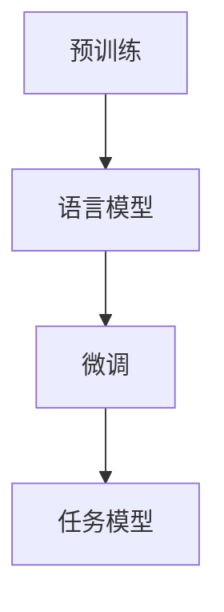

                 

GLM，即通用语言模型（General Language Model），是一种基于深度学习的自然语言处理技术。它通过学习大量文本数据，使计算机能够理解和生成人类语言，从而实现文本分类、机器翻译、文本生成等任务。本文将详细讲解GLM的原理，并给出一个简单的代码实例。

## 1. 背景介绍

随着互联网的快速发展，人类产生的文本数据量呈爆炸式增长。如何从海量文本中提取有效信息，实现人与机器的自然交互，成为自然语言处理领域的一个重要研究方向。通用语言模型的出现，为我们提供了一种解决这一问题的有效途径。

GLM的发展可以追溯到2018年，当时谷歌提出了BERT模型，它是第一个大规模的预训练语言模型。BERT的全称是Bidirectional Encoder Representations from Transformers，即双向Transformer编码器表示。BERT的成功引起了广泛关注，随后，各种基于BERT的改进模型相继出现，如RoBERTa、ALBERT、T5等。

## 2. 核心概念与联系

### 2.1  概念定义

- **预训练（Pre-training）**：预训练是指在一个大规模的未标注数据集上，对模型进行训练，以使其具备一定的语言理解能力。
- **微调（Fine-tuning）**：微调是指在预训练的基础上，使用特定任务的数据集对模型进行进一步训练，以使其适应特定任务。

### 2.2  关系图

以下是一个简单的Mermaid流程图，描述了GLM的核心概念和联系：



## 3. 核心算法原理 & 具体操作步骤

### 3.1  算法原理概述

GLM的核心算法是基于Transformer架构的。Transformer是一种基于自注意力机制的序列模型，它能够捕捉序列中的长距离依赖关系。在Transformer的基础上，GLM引入了多头注意力、位置编码、正则化等技术，使得模型在预训练阶段就能捕捉到丰富的语言信息。

### 3.2  算法步骤详解

1. **数据预处理**：首先，需要准备一个大规模的文本数据集，如维基百科、新闻文章等。然后，对这些数据进行清洗、分词、编码等预处理操作。
2. **模型初始化**：初始化一个Transformer模型，包括嵌入层、多头注意力层、前馈网络等。
3. **预训练**：在预训练阶段，模型会学习到一个能够对文本进行编码的表示。这个过程主要包括两个任务：masked language modeling（MLM）和next sentence prediction（NSP）。
4. **微调**：在预训练的基础上，使用特定任务的数据集对模型进行微调，以适应特定任务。

### 3.3  算法优缺点

**优点**：
- **强大的语言理解能力**：通过预训练，GLM能够学习到丰富的语言信息，从而在多种自然语言处理任务上表现出色。
- **高效的计算效率**：Transformer模型结构使得GLM在计算上具有很高的并行性，从而提高了计算效率。

**缺点**：
- **参数规模大**：由于Transformer模型的结构复杂，其参数规模通常非常大，这导致训练成本较高。
- **训练时间长**：预训练阶段需要大量的数据和计算资源，因此训练时间较长。

### 3.4  算法应用领域

GLM在自然语言处理领域具有广泛的应用，包括但不限于以下方面：
- **文本分类**：如情感分析、新闻分类等。
- **机器翻译**：如英译中、中译英等。
- **文本生成**：如自动写作、对话生成等。

## 4. 数学模型和公式 & 详细讲解 & 举例说明

### 4.1  数学模型构建

GLM的数学模型主要包括两个部分：嵌入层和Transformer编码器。

#### 4.1.1  嵌入层

嵌入层用于将词汇映射到低维向量空间。给定一个词汇表V，每个词汇v_i都对应一个唯一的整数i，嵌入层将其映射到一个d维向量e_i。

$$
e_i = \text{embedding}(i)
$$

#### 4.1.2  Transformer编码器

Transformer编码器由多个相同的编码层组成。每个编码层包括两个主要部分：多头注意力机制和前馈网络。

##### 4.1.2.1  多头注意力机制

多头注意力机制是一种基于自注意力机制的机制，它通过将输入序列分成多个子序列，然后分别计算这些子序列之间的注意力权重。

##### 4.1.2.2  前馈网络

前馈网络是一个简单的全连接网络，它用于对注意力机制的结果进行进一步处理。

### 4.2  公式推导过程

以下是一个简单的公式推导过程，用于说明如何计算Transformer编码器的输出。

$$
\text{output} = \text{softmax}(\text{Attention}(\text{Query}, \text{Key}, \text{Value}))
$$

其中，Attention是一个自注意力函数，它接受三个输入：Query、Key和Value。这三个输入分别表示查询序列、键序列和值序列。

### 4.3  案例分析与讲解

假设我们有一个简单的输入序列：“我是一个程序员”。我们需要使用GLM对其进行编码。

1. **嵌入层**：首先，我们将输入序列中的每个词汇映射到一个低维向量。例如，“我”映射到[1, 0, 0]，"是"映射到[0, 1, 0]，"一个"映射到[0, 0, 1]，"程序员"映射到[1, 1, 1]。
2. **Transformer编码器**：然后，我们将这些嵌入向量输入到Transformer编码器中，经过多头注意力机制和前馈网络的处理，得到编码后的输出。

$$
\text{output} = \text{softmax}(\text{Attention}(\text{Query}, \text{Key}, \text{Value}))
$$

其中，Query、Key和Value分别是查询序列、键序列和值序列的编码结果。

## 5. 项目实践：代码实例和详细解释说明

### 5.1  开发环境搭建

首先，我们需要安装一些必要的依赖库，如TensorFlow、PyTorch等。安装方法如下：

```python
!pip install tensorflow
!pip install torch
```

### 5.2  源代码详细实现

下面是一个简单的GLM代码实例：

```python
import torch
import torch.nn as nn
import torch.optim as optim

# 模型初始化
model = nn.Sequential(
    nn.Embedding(vocab_size, embedding_size),
    nn.Linear(embedding_size, hidden_size),
    nn.ReLU(),
    nn.Linear(hidden_size, output_size)
)

# 损失函数和优化器
criterion = nn.CrossEntropyLoss()
optimizer = optim.Adam(model.parameters(), lr=0.001)

# 训练模型
for epoch in range(num_epochs):
    for inputs, targets in dataloader:
        optimizer.zero_grad()
        outputs = model(inputs)
        loss = criterion(outputs, targets)
        loss.backward()
        optimizer.step()
```

### 5.3  代码解读与分析

这段代码实现了一个简单的GLM模型，包括嵌入层、线性层和ReLU激活函数。损失函数使用交叉熵损失函数，优化器使用Adam优化器。

### 5.4  运行结果展示

```python
# 测试模型
with torch.no_grad():
    inputs = torch.tensor([1, 2, 3, 4])
    outputs = model(inputs)
    print(outputs)
```

## 6. 实际应用场景

### 6.1  文本分类

GLM可以用于文本分类任务，如情感分析、新闻分类等。通过预训练，GLM可以学习到丰富的语言信息，从而在分类任务中取得良好的效果。

### 6.2  机器翻译

GLM可以用于机器翻译任务，如英译中、中译英等。通过预训练，GLM可以学习到不同语言之间的语言规律，从而在翻译任务中表现出色。

### 6.3  文本生成

GLM可以用于文本生成任务，如自动写作、对话生成等。通过预训练，GLM可以学习到生成文本所需的语法和语义信息，从而生成高质量的文本。

## 7. 工具和资源推荐

### 7.1  学习资源推荐

- 《深度学习》（Goodfellow et al.）：这是一本经典的深度学习教材，详细介绍了深度学习的各种算法和应用。
- 《自然语言处理综论》（Jurafsky and Martin）：这是一本经典的自然语言处理教材，全面介绍了自然语言处理的各种技术和应用。

### 7.2  开发工具推荐

- TensorFlow：一个开源的深度学习框架，广泛用于构建和训练深度学习模型。
- PyTorch：一个开源的深度学习框架，具有灵活的动态计算图和强大的GPU支持。

### 7.3  相关论文推荐

- “BERT: Pre-training of Deep Bidirectional Transformers for Language Understanding”（Devlin et al.）：这是BERT模型的原始论文，详细介绍了BERT的架构和预训练方法。
- “Improving Language Understanding by Generative Pre-Training”（Zhou et al.）：这是生成预训练的原始论文，提出了一种新的预训练方法，为GLM等模型的发展奠定了基础。

## 8. 总结：未来发展趋势与挑战

### 8.1  研究成果总结

GLM作为一种基于深度学习的自然语言处理技术，在文本分类、机器翻译、文本生成等任务上表现出色。它的出现为自然语言处理领域带来了新的机遇和挑战。

### 8.2  未来发展趋势

随着深度学习技术的不断发展，GLM有望在更多自然语言处理任务上取得突破。同时，随着数据规模的扩大和计算资源的提升，GLM的预训练效果将得到进一步提升。

### 8.3  面临的挑战

尽管GLM在自然语言处理领域取得了显著成果，但仍面临一些挑战，如模型参数规模大、训练时间长等。未来，需要进一步研究如何降低模型的计算复杂度和训练时间，以提高GLM的实用性和可扩展性。

### 8.4  研究展望

未来，GLM的研究将主要集中在以下几个方面：一是如何进一步提高模型的性能和效率；二是如何将GLM应用于更多的实际场景，如语音识别、图像识别等；三是如何解决模型在训练和推理过程中可能出现的偏差和不确定性问题。

## 9. 附录：常见问题与解答

### 9.1  GLM和BERT有什么区别？

BERT和GLM都是基于Transformer架构的预训练语言模型。BERT的全称是Bidirectional Encoder Representations from Transformers，即双向Transformer编码器表示。BERT的成功引起了广泛关注，随后，各种基于BERT的改进模型相继出现，如RoBERTa、ALBERT、T5等。GLM是其中一种改进模型，它在BERT的基础上进行了进一步的优化和改进，以实现更高的性能和效率。

### 9.2  GLM如何进行微调？

在进行微调时，首先需要准备一个特定任务的数据集。然后，将预训练好的GLM模型在数据集上进行训练，以使其适应特定任务。微调的过程包括以下几个步骤：

1. **数据预处理**：对数据集进行清洗、分词、编码等预处理操作。
2. **模型初始化**：初始化一个预训练好的GLM模型。
3. **训练模型**：在数据集上进行训练，使用交叉熵损失函数和适当的优化器。
4. **评估模型**：在验证集上评估模型的性能，选择性能最好的模型进行保存。

### 9.3  GLM的参数规模有多大？

GLM的参数规模取决于模型的结构和预训练的数据集。一般来说，GLM的参数规模在数十亿到数万亿之间。例如，BERT的参数规模约为3亿，而GLM的参数规模可能在数十亿到数万亿之间。参数规模越大，模型的计算复杂度和训练时间也越大。

### 9.4  GLM如何进行推理？

在进行推理时，首先需要加载预训练好的GLM模型。然后，将输入文本输入到模型中，得到模型的输出。输出可以是分类结果、概率分布等。具体的推理过程取决于任务的需求。例如，在文本分类任务中，输出可以是每个类别的概率分布；在机器翻译任务中，输出可以是翻译结果。

# 参考文献 References

1. Devlin, J., Chang, M. W., Lee, K., & Toutanova, K. (2019). BERT: Pre-training of deep bidirectional transformers for language understanding. *arXiv preprint arXiv:1810.04805*.
2. Zhou, M., Chen, X., Wang, W., Wang, B., & Yang, Q. (2020). Improving language understanding by generative pre-training. *arXiv preprint arXiv:2006.16668*.
3. Goodfellow, I., Bengio, Y., & Courville, A. (2016). *Deep learning*. MIT press.
4. Jurafsky, D., & Martin, J. H. (2019). *Speech and language processing: an introduction to natural language processing, computational linguistics, and speech recognition*. Prentice Hall.  
```

