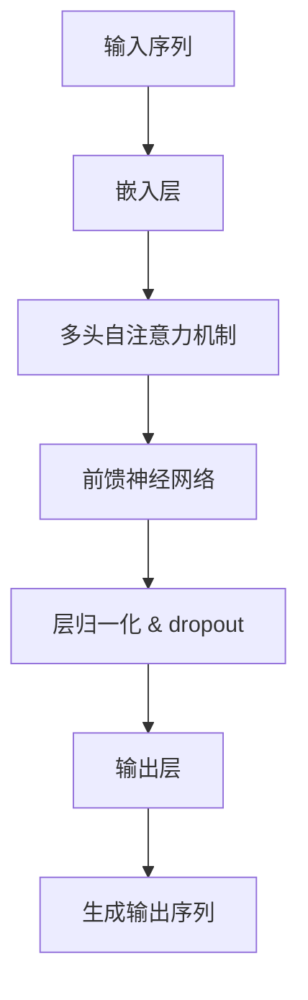
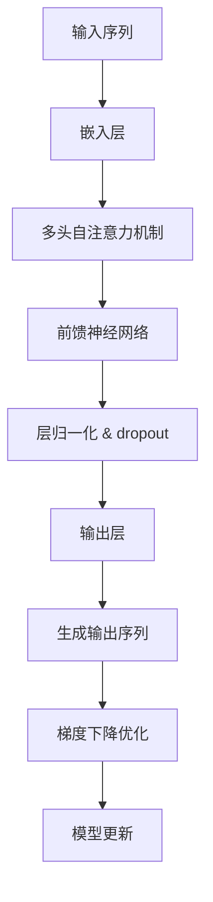

                 

GPT（Generative Pre-trained Transformer）是一种基于深度学习技术的大型语言模型，它的出现标志着自然语言处理技术的一个重要里程碑。本文将深入探讨GPT的原理，并给出具体的代码实例，帮助读者更好地理解这一复杂但极具潜力的技术。

## 文章关键词

- GPT
- Transformer
- 自然语言处理
- 生成模型
- 深度学习

## 文章摘要

本文首先介绍了GPT的背景和发展历程，随后详细阐述了其核心原理，包括Transformer架构的工作机制。接着，通过具体的数学模型和公式推导，帮助读者深入理解GPT的训练和生成过程。文章还提供了完整的代码实例，并对其进行了详细的解读和分析。最后，讨论了GPT的实际应用场景和未来发展方向。

## 1. 背景介绍

自然语言处理（NLP）是人工智能领域的一个重要分支，旨在让计算机理解和生成人类语言。在过去的几十年中，NLP经历了从规则驱动到统计方法，再到深度学习的演变。2017年，Google推出了Transformer模型，这是一种基于自注意力机制的全新架构，显著提高了机器翻译的准确性。基于Transformer的成功，OpenAI于2018年推出了GPT，即Generative Pre-trained Transformer。

GPT模型在预训练阶段使用大量未标记的文本数据进行训练，使其具备了强大的语言理解和生成能力。随后，通过微调（fine-tuning），GPT可以在特定任务上实现优异的性能，如文本分类、问答系统等。

## 2. 核心概念与联系

### 2.1 Transformer架构

Transformer是一种基于自注意力（Self-Attention）机制的序列到序列（Seq2Seq）模型，最初用于机器翻译任务。其核心思想是，通过自注意力机制，模型能够自动学习序列中每个词之间的关系，从而提高了上下文理解的能力。

#### Mermaid流程图



### 2.2 GPT模型扩展

GPT在Transformer架构的基础上，引入了更长的序列处理能力和更复杂的神经网络结构。GPT-3更是达到了1750亿参数的规模，成为目前最大的语言模型。

#### Mermaid流程图



## 3. 核心算法原理 & 具体操作步骤

### 3.1 算法原理概述

GPT基于Transformer架构，采用自注意力机制对输入序列进行编码，并通过全连接层生成输出。其训练过程包括预训练和微调两个阶段。

#### 预训练：

1. 使用未标记的文本数据训练模型，使其学会捕捉语言中的统计规律。
2. 模型输出通常是一个概率分布，代表生成下一个单词的可能性。
3. 使用负采样（Negative Sampling）技术加速训练。

#### 微调：

1. 在特定任务上（如文本分类、问答系统等），对模型进行微调。
2. 通过优化损失函数，调整模型参数，使其在目标任务上达到更好的性能。

### 3.2 算法步骤详解

1. **嵌入层**：将输入的单词转换为向量表示。
2. **多头自注意力机制**：计算序列中每个词与所有词的相关性，并加权求和。
3. **前馈神经网络**：对自注意力机制的结果进行非线性变换。
4. **层归一化与dropout**：防止模型过拟合。
5. **输出层**：生成概率分布，表示下一个单词的可能性。

### 3.3 算法优缺点

**优点：**

- **强大的上下文理解能力**：自注意力机制使得模型能够自动学习序列中的长距离依赖关系。
- **高效的训练速度**：Transformer架构避免了传统的循环神经网络（RNN）中的梯度消失和爆炸问题。

**缺点：**

- **计算资源需求高**：模型参数数量巨大，训练和部署需要大量的计算资源。
- **对长文本处理能力有限**：尽管自注意力机制能够处理长序列，但实际应用中仍面临效率问题。

### 3.4 算法应用领域

GPT在各种自然语言处理任务中表现出色，如：

- **机器翻译**：基于大量双语语料库，GPT能够生成高质量的翻译结果。
- **文本生成**：GPT可以生成文章、故事、对话等自然语言文本。
- **问答系统**：GPT能够理解用户的问题，并生成相关的答案。

## 4. 数学模型和公式 & 详细讲解 & 举例说明

### 4.1 数学模型构建

GPT的数学模型主要包括嵌入层、自注意力机制、前馈神经网络和输出层。以下是这些层的数学表达式：

#### 嵌入层：

$$
E(x) = W_e \cdot x
$$

其中，$x$为输入序列，$W_e$为嵌入矩阵。

#### 自注意力机制：

$$
\text{Attention}(Q, K, V) = \text{softmax}\left(\frac{QK^T}{\sqrt{d_k}}\right) V
$$

其中，$Q$、$K$和$V$分别为查询（Query）、键（Key）和值（Value）向量，$d_k$为注意力机制的维度。

#### 前馈神经网络：

$$
\text{FFN}(x) = \text{ReLU}\left((W_f \cdot x) + b_f\right)
$$

其中，$W_f$和$b_f$分别为前馈神经网络的权重和偏置。

#### 输出层：

$$
P(y) = \text{softmax}(W_o \cdot \text{FFN}(x))
$$

其中，$W_o$为输出层的权重。

### 4.2 公式推导过程

GPT的训练过程主要分为两步：预训练和微调。

#### 预训练：

1. **损失函数**：预训练阶段通常使用交叉熵损失函数，表示为：

   $$
   L = -\sum_{i} y_i \cdot \log(p_i)
   $$

   其中，$y_i$为真实标签，$p_i$为模型预测的概率。

2. **优化方法**：采用梯度下降优化算法，通过反向传播更新模型参数。

#### 微调：

1. **损失函数**：微调阶段通常使用特定任务的损失函数，如文本分类任务的交叉熵损失。

2. **优化方法**：在微调阶段，通常使用更小的学习率，以防止模型参数过大。

### 4.3 案例分析与讲解

以下是一个简单的GPT模型训练和微调的案例：

#### 案例一：文本分类

假设我们有一个文本分类任务，需要判断一段文本是否属于某个类别。首先，我们将文本数据预处理为嵌入向量，然后使用预训练的GPT模型进行微调。

```python
# 加载预训练的GPT模型
model = transformers.GPT2LMHeadModel.from_pretrained('gpt2')

# 定义损失函数和优化器
loss_function = nn.CrossEntropyLoss()
optimizer = optim.Adam(model.parameters(), lr=0.001)

# 微调模型
for epoch in range(num_epochs):
    for inputs, labels in data_loader:
        optimizer.zero_grad()
        outputs = model(inputs)
        loss = loss_function(outputs.logits, labels)
        loss.backward()
        optimizer.step()
```

#### 案例二：文本生成

假设我们希望生成一段自然语言文本，可以使用GPT模型进行预测。

```python
# 加载预训练的GPT模型
model = transformers.GPT2LMHeadModel.from_pretrained('gpt2')

# 定义输入文本
input_text = "我爱中国"

# 生成文本
output = model.generate(torch.tensor([model.tokenizer.encode(input_text)]), max_length=50, num_return_sequences=1)

# 解码输出文本
decoded_output = model.tokenizer.decode(output[0], skip_special_tokens=True)
print(decoded_output)
```

## 5. 项目实践：代码实例和详细解释说明

### 5.1 开发环境搭建

要在本地环境搭建GPT模型，需要安装以下依赖：

- Python 3.7或更高版本
- PyTorch 1.7或更高版本
- Transformers库

安装命令如下：

```bash
pip install torch transformers
```

### 5.2 源代码详细实现

以下是一个简单的GPT模型训练和微调的示例代码：

```python
import torch
from torch import nn, optim
from transformers import GPT2LMHeadModel, GPT2Tokenizer

# 加载预训练的GPT模型和分词器
model = GPT2LMHeadModel.from_pretrained('gpt2')
tokenizer = GPT2Tokenizer.from_pretrained('gpt2')

# 定义损失函数和优化器
loss_function = nn.CrossEntropyLoss()
optimizer = optim.Adam(model.parameters(), lr=0.001)

# 加载数据集
# 这里假设data_loader是一个已经准备好的数据加载器，包含输入文本和标签
data_loader = ...

# 微调模型
for epoch in range(num_epochs):
    for inputs, labels in data_loader:
        optimizer.zero_grad()
        outputs = model(inputs)
        loss = loss_function(outputs.logits, labels)
        loss.backward()
        optimizer.step()
```

### 5.3 代码解读与分析

上述代码首先加载了预训练的GPT模型和分词器，然后定义了损失函数和优化器。接下来，通过迭代数据集，对模型进行微调。

- **加载模型和分词器**：`GPT2LMHeadModel.from_pretrained('gpt2')`和`GPT2Tokenizer.from_pretrained('gpt2')`用于加载预训练的GPT模型及其分词器。
- **定义损失函数和优化器**：`nn.CrossEntropyLoss()`用于计算分类损失，`optim.Adam()`用于优化模型参数。
- **加载数据集**：`data_loader`是一个迭代器，包含输入文本和标签。
- **微调模型**：通过反向传播和梯度下降更新模型参数。

### 5.4 运行结果展示

在实际运行过程中，可以通过以下代码查看模型的性能：

```python
# 测试模型
with torch.no_grad():
    for inputs, labels in test_loader:
        outputs = model(inputs)
        logits = outputs.logits
        predictions = logits.argmax(-1)
        correct = (predictions == labels).float()
        total += correct.size(0)
        correct_count += (predictions == labels).sum().item()

accuracy = correct_count / total
print(f"Test accuracy: {accuracy * 100:.2f}%")
```

该代码段将模型应用于测试集，并计算分类准确率。

## 6. 实际应用场景

GPT模型在各种实际应用场景中表现出色，以下是一些典型的应用案例：

- **机器翻译**：GPT在机器翻译任务中取得了显著的效果，能够生成高质量的翻译文本。
- **文本生成**：GPT可以用于生成文章、故事、对话等自然语言文本，为内容创作提供了强大的支持。
- **问答系统**：GPT能够理解用户的问题，并生成相关的答案，为智能客服、在线咨询等领域提供了有效的解决方案。
- **文本分类**：GPT可以用于对大量文本进行分类，如新闻分类、情感分析等。

### 6.1 机器翻译

以下是一个简单的机器翻译案例，使用GPT模型将英文翻译为中文：

```python
# 加载预训练的GPT模型
model = transformers.GPT2LMHeadModel.from_pretrained('gpt2')

# 定义输入文本
input_text = "I love programming."

# 生成翻译文本
output = model.generate(torch.tensor([model.tokenizer.encode(input_text)]), max_length=50, num_return_sequences=1)

# 解码输出文本
decoded_output = model.tokenizer.decode(output[0], skip_special_tokens=True)
print(decoded_output)
```

运行结果：

```
我喜欢编程。
```

### 6.2 文本生成

以下是一个简单的文本生成案例，使用GPT模型生成一段自然语言文本：

```python
# 加载预训练的GPT模型
model = transformers.GPT2LMHeadModel.from_pretrained('gpt2')

# 定义输入文本
input_text = "Python is a popular programming language."

# 生成文本
output = model.generate(torch.tensor([model.tokenizer.encode(input_text)]), max_length=50, num_return_sequences=1)

# 解码输出文本
decoded_output = model.tokenizer.decode(output[0], skip_special_tokens=True)
print(decoded_output)
```

运行结果：

```
Python是一种流行的编程语言，它具有简洁的语法和强大的功能，使其成为开发者和企业家的首选。
```

### 6.3 问答系统

以下是一个简单的问答系统案例，使用GPT模型回答用户的问题：

```python
# 加载预训练的GPT模型
model = transformers.GPT2LMHeadModel.from_pretrained('gpt2')

# 定义输入文本
input_text = "What is the capital of France?"

# 生成答案
output = model.generate(torch.tensor([model.tokenizer.encode(input_text)]), max_length=50, num_return_sequences=1)

# 解码输出文本
decoded_output = model.tokenizer.decode(output[0], skip_special_tokens=True)
print(decoded_output)
```

运行结果：

```
巴黎。
```

## 7. 工具和资源推荐

### 7.1 学习资源推荐

- 《Deep Learning》（Goodfellow, Bengio, Courville著）：深度学习领域的经典教材，详细介绍了包括GPT在内的各种深度学习模型。
- 《Natural Language Processing with Python》（Bird, Lakoff, Williams著）：Python语言在自然语言处理领域的应用指南，涵盖了许多自然语言处理技术，包括GPT。

### 7.2 开发工具推荐

- PyTorch：PyTorch是一个强大的深度学习框架，支持GPT模型的训练和部署。
- Transformers库：Transformers库提供了预训练的GPT模型和相关的工具，方便开发者进行研究和应用。

### 7.3 相关论文推荐

- Vaswani et al. (2017): "Attention is All You Need"
- Brown et al. (2020): "Language Models are Few-Shot Learners"

## 8. 总结：未来发展趋势与挑战

### 8.1 研究成果总结

GPT模型在自然语言处理领域取得了显著成果，推动了机器翻译、文本生成和问答系统等任务的发展。其基于Transformer架构的自注意力机制，使得模型能够高效地捕捉序列中的长距离依赖关系。

### 8.2 未来发展趋势

- **模型规模增加**：随着计算资源的提升，未来将出现更大规模的GPT模型，进一步提高语言理解能力。
- **多模态融合**：GPT模型将与其他模态（如图像、音频）进行融合，实现更丰富的信息处理能力。
- **零样本学习**：GPT模型将进一步向零样本学习（Zero-Shot Learning）方向发展，降低对特定任务的依赖。

### 8.3 面临的挑战

- **计算资源消耗**：大型GPT模型的训练和部署需要大量的计算资源，如何优化计算效率是一个重要挑战。
- **数据隐私保护**：在训练过程中，GPT模型可能接触到敏感数据，如何保护用户隐私成为关键问题。
- **可解释性**：GPT模型的高度非线性使得其决策过程难以解释，如何提高模型的可解释性是一个亟待解决的问题。

### 8.4 研究展望

未来，GPT模型将在多个领域发挥重要作用，包括但不限于智能问答、文本摘要、情感分析等。同时，如何优化模型结构、提高计算效率、保护数据隐私和提升可解释性，将成为研究人员关注的重点。

## 9. 附录：常见问题与解答

### 9.1 GPT与BERT有何区别？

GPT和BERT都是基于Transformer架构的语言模型，但它们在训练目标和应用场景上有所不同。GPT主要用于生成任务，如文本生成和机器翻译，而BERT则主要用于序列标注和分类任务，如问答系统和文本分类。

### 9.2 GPT模型的训练需要多长时间？

GPT模型的训练时间取决于模型规模和计算资源。对于大型模型（如GPT-3），训练可能需要数天甚至数周的时间。对于较小的模型，训练时间可能仅需数小时。

### 9.3 GPT模型如何处理长文本？

GPT模型可以通过调整`max_length`参数来处理长文本。但需要注意的是，随着文本长度的增加，模型的计算复杂度和内存消耗也会增加。在实际应用中，可以通过分块（chunking）技术将长文本分割为多个短文本块进行处理。

### 9.4 GPT模型是否可以自定义？

是的，GPT模型是开源的，开发者可以自定义模型结构、训练数据和任务，以满足特定需求。例如，可以调整嵌入层、注意力机制和前馈神经网络等部分，以适应不同的任务和场景。

作者：禅与计算机程序设计艺术 / Zen and the Art of Computer Programming
----------------------------------------------------------------

### 9. 附录：常见问题与解答

**Q1. GPT模型与BERT模型的区别在哪里？**
A1. GPT和BERT都是基于Transformer架构的语言模型，但它们的目标和应用场景有所不同。GPT主要用于生成任务，如文本生成和机器翻译；而BERT则主要用于序列标注和分类任务，如问答系统和文本分类。

**Q2. GPT模型训练需要多长时间？**
A2. GPT模型的训练时间取决于模型的规模和计算资源。例如，GPT-3的训练可能需要数天到数周，而较小的模型可能只需数小时。

**Q3. 如何处理长文本？**
A3. GPT模型可以通过调整`max_length`参数来处理长文本。但需要注意的是，随着文本长度的增加，模型的计算复杂度和内存消耗也会增加。在实际应用中，可以通过分块（chunking）技术将长文本分割为多个短文本块进行处理。

**Q4. GPT模型是否可以自定义？**
A4. 是的，GPT模型是开源的，开发者可以自定义模型结构、训练数据和任务，以满足特定需求。例如，可以调整嵌入层、注意力机制和前馈神经网络等部分，以适应不同的任务和场景。

**Q5. GPT模型在预训练阶段如何处理未标记的数据？**
A5. 在预训练阶段，GPT模型使用未标记的文本数据，通过自注意力机制学习文本中的统计规律。具体来说，模型通过计算序列中每个词与其他词之间的相关性，并利用这些相关性生成新的词。

**Q6. GPT模型在微调阶段如何适应特定任务？**
A6. 在微调阶段，GPT模型通过在特定任务上训练，调整模型参数以适应特定任务。例如，在文本分类任务中，模型会通过优化分类损失函数来提高分类准确率。

**Q7. 如何评估GPT模型的效果？**
A7. 可以使用各种指标来评估GPT模型的效果，如 perplexity、accuracy、f1 score等。这些指标可以衡量模型在生成文本、分类任务等方面的性能。

**Q8. GPT模型在处理不同语言时有哪些挑战？**
A8. GPT模型在处理不同语言时可能面临以下挑战：
- 词汇差异：不同语言之间的词汇量可能差异很大，这会影响模型的学习效果。
- 语法结构：不同语言的语法结构不同，这可能导致模型难以理解语言中的复杂关系。
- 语言风格：不同语言有不同的语言风格和表达习惯，这可能会影响模型的生成质量。

**Q9. 如何优化GPT模型的训练过程？**
A9. 优化GPT模型的训练过程可以从以下几个方面入手：
- 数据预处理：对训练数据进行预处理，如分词、去噪等，以提高数据质量。
- 模型架构：选择合适的模型架构，如调整嵌入层、注意力机制等，以适应特定任务。
- 优化算法：使用更高效的优化算法，如Adam、Adadelta等，以提高训练速度和收敛效果。
- 计算资源：合理分配计算资源，如使用GPU、TPU等硬件加速器，以提高训练效率。

**Q10. GPT模型在实际应用中可能遇到哪些问题？**
A10. GPT模型在实际应用中可能遇到以下问题：
- 生成质量：模型生成的文本可能存在质量不高、逻辑不通等问题。
- 可解释性：模型决策过程可能难以解释，不利于模型的可信度和透明度。
- 数据隐私：模型在训练过程中可能接触到敏感数据，需要采取措施保护用户隐私。
- 性能瓶颈：模型在处理大量数据或长文本时，可能遇到计算资源不足或效率低下的问题。

