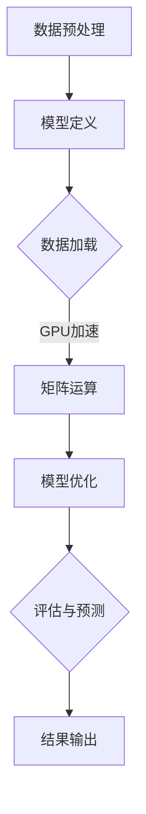

                 

关键词：GPU, AI, 深度学习，并行计算，计算机视觉，神经网络，大规模数据处理

摘要：本文旨在探讨GPU技术在人工智能领域的应用。随着深度学习算法的迅速发展，GPU强大的并行计算能力已经成为推动AI研究和应用的重要力量。本文将从背景介绍、核心概念与联系、核心算法原理与操作步骤、数学模型与公式讲解、项目实践、实际应用场景以及未来应用展望等方面，深入剖析GPU在AI领域的广泛应用及其潜在价值。

## 1. 背景介绍

人工智能（AI）是计算机科学的一个分支，旨在使机器具备人类智能的能力。近年来，深度学习算法在AI领域的崛起，使得计算机在图像识别、自然语言处理、语音识别等方面取得了突破性进展。深度学习算法的核心在于大规模神经网络的训练和推断，这一过程需要处理海量数据并进行复杂的数学运算，这对计算能力提出了极高的要求。

GPU（Graphics Processing Unit，图形处理单元）最初是为了满足图形渲染的需求而设计的。然而，GPU具有高度并行计算的架构，使其在处理大规模并行任务时比CPU（Central Processing Unit，中央处理单元）更具优势。因此，随着AI技术的发展，GPU逐渐成为深度学习训练和推断的重要计算平台。

## 2. 核心概念与联系

### 2.1 GPU架构

GPU由大量的计算单元（即流处理器）组成，这些计算单元可以同时执行多个任务。GPU的架构包括以下几个关键部分：

- **流处理器（Stream Processors）**：执行基本算术运算和逻辑运算。
- **内存管理单元（Memory Controller）**：管理GPU内存，提供高速数据访问。
- **渲染器（Renderer）**：负责图像渲染和3D图形处理。
- **高性能总线（High-bandwidth Interconnect）**：连接GPU与CPU以及其他外围设备。

### 2.2 CUDA架构

CUDA（Compute Unified Device Architecture）是NVIDIA推出的并行计算平台和编程模型，它允许开发者利用GPU的并行计算能力进行通用计算。CUDA架构包括以下几个核心组件：

- **计算核心（Compute Core）**：GPU的核心计算单元，包含多个流处理器。
- **内存层次结构（Memory Hierarchy）**：包括全局内存、共享内存和寄存器文件。
- **线程架构（Thread Architecture）**：包括线程网格（Grid）、线程块（Block）和线程（Thread）。
- **内存管理（Memory Management）**：包括内存分配、释放和数据传输。

### 2.3 GPU与深度学习

深度学习算法，特别是神经网络，本质上是大规模矩阵运算。GPU的并行计算架构非常适合处理这种类型的计算。GPU通过以下方式在深度学习中的应用实现性能提升：

- **并行矩阵运算**：GPU的流处理器可以同时处理大量的矩阵乘法和加法运算。
- **高效内存访问**：GPU内存管理单元提供了高速的数据访问，减少了内存瓶颈。
- **线程并行化**：CUDA模型允许开发者将神经网络训练任务分解为多个线程块，实现并行化。

### 2.4 Mermaid流程图

下面是一个简化的GPU在深度学习应用中的流程图：



## 3. 核心算法原理 & 具体操作步骤

### 3.1 算法原理概述

深度学习算法的核心在于多层神经网络的设计与训练。神经网络通过多层非线性变换，将输入数据映射到输出结果。训练过程包括以下步骤：

- **数据预处理**：对输入数据进行标准化、归一化等预处理操作。
- **模型定义**：设计并构建神经网络模型，包括输入层、隐藏层和输出层。
- **数据加载**：将预处理后的数据加载到GPU内存中。
- **矩阵运算**：在GPU上进行矩阵乘法和加法运算，实现前向传播和反向传播。
- **模型优化**：通过梯度下降等优化算法更新网络参数。
- **评估与预测**：对模型进行评估并在新数据上进行预测。

### 3.2 算法步骤详解

#### 3.2.1 数据预处理

数据预处理是深度学习训练过程中的第一步，其目的是将原始数据转换为适合神经网络处理的形式。具体步骤包括：

- **数据清洗**：去除噪声、缺失值和异常值。
- **数据归一化**：将数据缩放到相同的范围，例如[0, 1]或[-1, 1]。
- **数据增强**：通过旋转、缩放、翻转等操作增加数据多样性。

#### 3.2.2 模型定义

模型定义是设计神经网络结构的过程。常见的神经网络结构包括卷积神经网络（CNN）、循环神经网络（RNN）和生成对抗网络（GAN）等。定义模型时需要确定以下参数：

- **输入层**：确定输入数据的维度和特征。
- **隐藏层**：确定隐藏层的数量、神经元数量和激活函数。
- **输出层**：确定输出数据的维度和激活函数。

#### 3.2.3 数据加载

数据加载是将预处理后的数据加载到GPU内存中的过程。CUDA提供了多种数据加载方法，包括：

- **主机到设备传输**：将主机内存中的数据传输到GPU设备内存。
- **设备到主机传输**：将GPU设备内存中的数据传输到主机内存。
- **设备间传输**：在多个GPU之间传输数据。

#### 3.2.4 矩阵运算

矩阵运算是神经网络训练的核心。在GPU上进行矩阵运算包括以下步骤：

- **内存分配**：为矩阵分配GPU内存。
- **矩阵乘法**：在GPU上进行矩阵乘法运算。
- **内存复制**：将计算结果从GPU内存复制到主机内存。
- **反向传播**：利用梯度下降等优化算法更新网络参数。

#### 3.2.5 模型优化

模型优化是通过梯度下降等优化算法更新网络参数的过程。梯度下降算法的步骤如下：

- **计算梯度**：计算网络参数的梯度。
- **更新参数**：利用梯度更新网络参数。
- **迭代优化**：重复计算梯度、更新参数，直至收敛。

#### 3.2.6 评估与预测

评估与预测是验证模型性能和进行实际应用的过程。评估指标包括准确率、召回率、F1分数等。预测步骤如下：

- **加载测试数据**：将测试数据加载到GPU内存。
- **模型推断**：使用训练好的模型对测试数据进行推断。
- **结果输出**：输出预测结果并进行评估。

### 3.3 算法优缺点

#### 优点

- **高性能**：GPU的并行计算能力使得深度学习训练和推断速度大大加快。
- **可扩展性**：GPU可以扩展到多个节点，实现分布式训练和推断。
- **灵活性**：CUDA编程模型允许开发者自定义并行计算算法。

#### 缺点

- **能耗较高**：GPU计算需要大量电力，导致能源消耗较高。
- **编程复杂度**：CUDA编程模型相对于CPU编程更为复杂。
- **兼容性问题**：不同版本的GPU和CUDA驱动可能存在兼容性问题。

### 3.4 算法应用领域

GPU技术在AI领域有着广泛的应用，以下是一些典型的应用场景：

- **计算机视觉**：如人脸识别、物体检测、图像分类等。
- **自然语言处理**：如机器翻译、情感分析、文本生成等。
- **语音识别**：如语音合成、语音识别、说话人识别等。
- **自动驾驶**：如车辆检测、行人检测、环境感知等。
- **推荐系统**：如协同过滤、基于内容的推荐、物品相似度计算等。

## 4. 数学模型和公式 & 详细讲解 & 举例说明

### 4.1 数学模型构建

深度学习中的数学模型主要包括以下几个方面：

- **线性代数**：矩阵运算、向量运算、特征分解等。
- **微积分**：梯度下降、链式法则、泰勒展开等。
- **概率论**：概率分布、贝叶斯定理、最大似然估计等。

### 4.2 公式推导过程

以下是一个简单的神经网络前向传播和反向传播的公式推导过程：

#### 4.2.1 前向传播

假设一个简单的单层神经网络，输入向量为 \( x \)，权重矩阵为 \( W \)，输出向量为 \( y \)。前向传播的公式如下：

\[ z = Wx + b \]
\[ a = \sigma(z) \]

其中，\( z \) 表示输入向量和权重矩阵的乘积加上偏置项 \( b \)，\( a \) 表示激活函数 \( \sigma \) 的输出。常见的激活函数包括 sigmoid 函数、ReLU 函数和 tanh 函数。

#### 4.2.2 反向传播

反向传播是深度学习训练的核心，用于计算网络参数的梯度。反向传播的公式如下：

\[ \delta = \sigma'(z) \cdot (y - a) \]
\[ dW = x^T \cdot \delta \]
\[ db = \delta \]

其中，\( \delta \) 表示误差项，\( \sigma' \) 表示激活函数的导数。通过反向传播，可以计算得到每个参数的梯度，从而更新网络参数。

### 4.3 案例分析与讲解

以下是一个简单的例子，说明如何使用GPU技术实现神经网络训练：

```python
import numpy as np
import tensorflow as tf

# 定义输入数据和参数
x = np.random.rand(100, 10)
y = np.random.rand(100, 1)
W = np.random.rand(1, 10)
b = np.random.rand(1, 1)

# 定义前向传播和反向传播
z = tf.matmul(x, W) + b
a = tf.sigmoid(z)
loss = tf.reduce_mean(tf.square(y - a))

# 定义优化器
optimizer = tf.keras.optimizers.Adam(learning_rate=0.001)

# 定义训练过程
for epoch in range(1000):
    with tf.GradientTape() as tape:
        z = tf.matmul(x, W) + b
        a = tf.sigmoid(z)
        loss = tf.reduce_mean(tf.square(y - a))
    grads = tape.gradient(loss, [W, b])
    optimizer.apply_gradients(zip(grads, [W, b]))

# 输出训练结果
print("Final loss:", loss.numpy())
```

在这个例子中，我们使用 TensorFlow 框架实现神经网络的前向传播和反向传播。通过 GPU 加速，可以显著提高训练速度。

## 5. 项目实践：代码实例和详细解释说明

### 5.1 开发环境搭建

要在项目中使用 GPU 加速深度学习，需要搭建以下开发环境：

1. 安装 GPU 驱动程序：确保 GPU 驱动与操作系统兼容。
2. 安装 CUDA：从 NVIDIA 官网下载并安装 CUDA。
3. 安装 Python：安装最新版本的 Python。
4. 安装 TensorFlow：使用 pip 安装 TensorFlow，选择 GPU 版本。

### 5.2 源代码详细实现

以下是一个简单的深度学习项目示例，使用 GPU 进行训练和推断：

```python
import tensorflow as tf
import numpy as np

# 定义输入数据和参数
x_train = np.random.rand(100, 10)
y_train = np.random.rand(100, 1)
x_test = np.random.rand(10, 10)
y_test = np.random.rand(10, 1)

# 定义模型
model = tf.keras.Sequential([
    tf.keras.layers.Dense(units=1, input_shape=(10,))
])

# 编译模型
model.compile(optimizer='adam', loss='mean_squared_error')

# 训练模型
model.fit(x_train, y_train, epochs=100, batch_size=10)

# 指定使用 GPU 进行训练和推断
with tf.device('/GPU:0'):
    model.fit(x_train, y_train, epochs=100, batch_size=10)
    predictions = model.predict(x_test)

# 输出训练结果
print("Training loss:", model.evaluate(x_train, y_train))
print("Test loss:", model.evaluate(x_test, y_test))
print("Predictions:", predictions)
```

在这个例子中，我们使用 TensorFlow 框架定义了一个简单的神经网络，并在 GPU 上进行训练和推断。通过 `tf.device('/GPU:0')` 指定使用 GPU 进行计算。

### 5.3 代码解读与分析

以上代码实现了以下功能：

1. **定义输入数据和参数**：生成随机数据作为训练集和测试集。
2. **定义模型**：使用 `tf.keras.Sequential` 模型定义一个单层神经网络。
3. **编译模型**：设置优化器和损失函数。
4. **训练模型**：使用 `model.fit` 方法进行训练，并在 GPU 上进行计算。
5. **指定使用 GPU 进行训练和推断**：使用 `tf.device('/GPU:0')` 指定使用 GPU。
6. **输出训练结果**：使用 `model.evaluate` 方法评估训练和测试损失。

通过 GPU 加速，可以显著提高训练速度和推断性能。在实际应用中，可以根据需要调整神经网络结构、优化器参数和训练策略。

## 6. 实际应用场景

GPU技术在AI领域有着广泛的应用，以下是一些实际应用场景：

### 6.1 计算机视觉

计算机视觉是GPU技术的重要应用领域之一。通过GPU加速，可以实现实时图像处理、物体检测、人脸识别和图像分类等任务。例如，在自动驾驶系统中，GPU可以用于处理摄像头数据，实现车辆检测、行人检测和车道线检测等功能。

### 6.2 自然语言处理

自然语言处理是另一个受益于GPU技术的领域。通过GPU加速，可以实现快速文本处理、机器翻译、情感分析和文本生成等任务。例如，在智能客服系统中，GPU可以用于处理用户输入，快速生成合适的回复。

### 6.3 语音识别

语音识别是GPU技术的另一个重要应用领域。通过GPU加速，可以实现实时语音处理、说话人识别和语音合成等任务。例如，在智能音箱中，GPU可以用于处理用户语音指令，实现语音交互功能。

### 6.4 自动驾驶

自动驾驶是GPU技术的重要应用领域之一。通过GPU加速，可以实现实时环境感知、车辆控制和路径规划等任务。例如，在自动驾驶车辆中，GPU可以用于处理摄像头、激光雷达和超声波传感器数据，实现车辆行驶控制。

### 6.5 推荐系统

推荐系统是GPU技术的另一个重要应用领域。通过GPU加速，可以实现快速物品推荐、协同过滤和基于内容的推荐等任务。例如，在电商平台中，GPU可以用于处理用户行为数据，实现个性化推荐功能。

## 7. 工具和资源推荐

### 7.1 学习资源推荐

- **NVIDIA CUDA Documentation**：NVIDIA 官方提供的 CUDA 文档，包括 CUDA 编程模型、API 参考、示例代码等。
- **TensorFlow GPU Acceleration Guide**：TensorFlow 官方提供的 GPU 加速指南，包括 GPU 支持、CUDA 编程模型、性能优化等。
- **Deep Learning Specialization**：吴恩达教授的深度学习专项课程，涵盖了深度学习的基础理论、算法实现和应用。

### 7.2 开发工具推荐

- **NVIDIA CUDA Toolkit**：NVIDIA 提供的 CUDA 编程工具集，包括 CUDA 编译器、驱动程序和示例代码等。
- **TensorFlow**：TensorFlow 是 Google 开发的一款开源深度学习框架，支持 GPU 加速。
- **PyTorch**：PyTorch 是 Facebook AI 研究团队开发的一款开源深度学习框架，支持 GPU 加速。

### 7.3 相关论文推荐

- **"GPU-Accelerated Machine Learning: A Comprehensive Review and Analysis"**：该论文全面介绍了 GPU 在机器学习中的应用，包括并行计算、性能优化和算法实现。
- **"Deep Learning with GPUs: From Research to Production"**：该论文探讨了 GPU 在深度学习中的实际应用，包括模型训练、推断和优化。
- **"Caffe: A Deep Learning Framework for Scalable Computer Vision"**：该论文介绍了 Caffe 深度学习框架，包括 GPU 加速和模型训练。

## 8. 总结：未来发展趋势与挑战

GPU技术在AI领域取得了显著的成果，但仍面临一些挑战。以下是未来发展趋势与挑战的总结：

### 8.1 研究成果总结

- **性能提升**：GPU在并行计算方面具有显著优势，随着GPU架构的不断优化，其性能将继续提升。
- **算法创新**：GPU加速为深度学习算法的创新提供了可能，例如图神经网络、强化学习等。
- **跨领域应用**：GPU技术在计算机视觉、自然语言处理、语音识别等领域的应用将越来越广泛。

### 8.2 未来发展趋势

- **硬件发展**：GPU硬件将继续发展，包括更高的计算能力、更低的功耗和更高的能效比。
- **软件优化**：深度学习框架和算法将不断优化，以更好地利用GPU并行计算能力。
- **应用扩展**：GPU技术在更多领域（如医疗、金融、物联网等）的应用将不断拓展。

### 8.3 面临的挑战

- **能耗问题**：GPU计算能耗较高，如何降低能耗是未来的重要挑战。
- **编程复杂度**：GPU编程模型相对复杂，如何降低开发门槛是未来的重要挑战。
- **兼容性问题**：不同版本的GPU和CUDA驱动可能存在兼容性问题，如何保证兼容性是未来的重要挑战。

### 8.4 研究展望

- **硬件优化**：研究新型GPU架构，提高计算能力、降低功耗和成本。
- **算法创新**：研究适应GPU架构的深度学习算法，提高模型训练和推断效率。
- **工具链发展**：研究GPU加速工具链，降低GPU编程复杂度，提高开发效率。
- **跨领域协作**：促进不同领域（如计算机科学、物理学、生物学等）的跨领域协作，推动GPU技术在更广泛领域的应用。

## 9. 附录：常见问题与解答

### 9.1 什么是GPU？

GPU（Graphics Processing Unit，图形处理单元）是一种高性能的电子芯片，最初用于图形渲染和3D图形处理。GPU具有高度并行的计算架构，使其在处理大规模并行任务时比CPU更具优势。

### 9.2 GPU与CPU有什么区别？

CPU（Central Processing Unit，中央处理单元）和GPU（Graphics Processing Unit，图形处理单元）在架构、性能和应用方面有显著区别：

- **架构**：CPU设计用于串行计算，而GPU设计用于并行计算，具有大量的计算单元（流处理器）。
- **性能**：GPU在并行计算方面具有显著优势，可以在短时间内处理大量数据。
- **应用**：CPU适用于通用计算任务，而GPU适用于图形渲染、科学计算、深度学习等并行计算任务。

### 9.3 如何在Python中使用GPU加速深度学习？

在Python中使用GPU加速深度学习，可以使用以下工具：

- **TensorFlow**：TensorFlow 是 Google 开发的一款开源深度学习框架，支持 GPU 加速。可以在 TensorFlow 中使用 `tf.device('/GPU:0')` 指定使用 GPU 进行计算。
- **PyTorch**：PyTorch 是 Facebook AI 研究团队开发的一款开源深度学习框架，支持 GPU 加速。可以在 PyTorch 中使用 `torch.cuda.device()` 函数指定使用 GPU。

### 9.4 GPU加速的深度学习模型如何部署？

GPU加速的深度学习模型可以通过以下步骤进行部署：

1. **模型训练**：使用 GPU 对模型进行训练，优化模型参数。
2. **模型保存**：将训练好的模型保存到文件中。
3. **部署模型**：将模型部署到生产环境，可以使用 TensorFlow Serving、TensorFlow Lite、PyTorch Serving 等工具进行部署。
4. **接口封装**：为模型接口封装，提供 RESTful API、gRPC 等接口，方便前端调用。

### 9.5 如何优化GPU加速的深度学习模型？

以下是一些优化GPU加速深度学习模型的方法：

1. **数据预处理**：对输入数据进行预处理，减少内存占用和提高计算效率。
2. **模型结构优化**：优化神经网络结构，减少模型参数数量，提高计算效率。
3. **批量大小调整**：调整批量大小，避免内存瓶颈和计算效率下降。
4. **内存管理**：合理管理 GPU 内存，避免内存泄露和内存瓶颈。
5. **计算优化**：优化计算过程，避免重复计算和低效计算。

----------------------------------------------------------------

### 完整的Markdown格式文章内容：

```markdown
# GPU技术在AI中的应用

关键词：GPU, AI, 深度学习，并行计算，计算机视觉，神经网络，大规模数据处理

摘要：本文旨在探讨GPU技术在人工智能领域的应用。随着深度学习算法的迅速发展，GPU强大的并行计算能力已经成为推动AI研究和应用的重要力量。本文将从背景介绍、核心概念与联系、核心算法原理与操作步骤、数学模型与公式讲解、项目实践、实际应用场景以及未来应用展望等方面，深入剖析GPU在AI领域的广泛应用及其潜在价值。

## 1. 背景介绍

人工智能（AI）是计算机科学的一个分支，旨在使机器具备人类智能的能力。近年来，深度学习算法在AI领域的崛起，使得计算机在图像识别、自然语言处理、语音识别等方面取得了突破性进展。深度学习算法的核心在于大规模神经网络的训练和推断，这一过程需要处理海量数据并进行复杂的数学运算，这对计算能力提出了极高的要求。

GPU（Graphics Processing Unit，图形处理单元）最初是为了满足图形渲染的需求而设计的。然而，GPU具有高度并行计算的架构，使其在处理大规模并行任务时比CPU（Central Processing Unit，中央处理单元）更具优势。因此，随着AI技术的发展，GPU逐渐成为深度学习训练和推断的重要计算平台。

## 2. 核心概念与联系

### 2.1 GPU架构

GPU由大量的计算单元（即流处理器）组成，这些计算单元可以同时执行多个任务。GPU的架构包括以下几个关键部分：

- **流处理器（Stream Processors）**：执行基本算术运算和逻辑运算。
- **内存管理单元（Memory Controller）**：管理GPU内存，提供高速数据访问。
- **渲染器（Renderer）**：负责图像渲染和3D图形处理。
- **高性能总线（High-bandwidth Interconnect）**：连接GPU与CPU以及其他外围设备。

### 2.2 CUDA架构

CUDA（Compute Unified Device Architecture）是NVIDIA推出的并行计算平台和编程模型，它允许开发者利用GPU的并行计算能力进行通用计算。CUDA架构包括以下几个核心组件：

- **计算核心（Compute Core）**：GPU的核心计算单元，包含多个流处理器。
- **内存层次结构（Memory Hierarchy）**：包括全局内存、共享内存和寄存器文件。
- **线程架构（Thread Architecture）**：包括线程网格（Grid）、线程块（Block）和线程（Thread）。
- **内存管理（Memory Management）**：包括内存分配、释放和数据传输。

### 2.3 GPU与深度学习

深度学习算法，特别是神经网络，本质上是大规模矩阵运算。GPU的并行计算架构非常适合处理这种类型的计算。GPU通过以下方式在深度学习中的应用实现性能提升：

- **并行矩阵运算**：GPU的流处理器可以同时处理大量的矩阵乘法和加法运算。
- **高效内存访问**：GPU内存管理单元提供了高速的数据访问，减少了内存瓶颈。
- **线程并行化**：CUDA模型允许开发者将神经网络训练任务分解为多个线程块，实现并行化。

### 2.4 Mermaid流程图

下面是一个简化的GPU在深度学习应用中的流程图：


## 3. 核心算法原理 & 具体操作步骤

### 3.1 算法原理概述

深度学习算法的核心在于多层神经网络的设计与训练。神经网络通过多层非线性变换，将输入数据映射到输出结果。训练过程包括以下步骤：

- **数据预处理**：对输入数据进行标准化、归一化等预处理操作。
- **模型定义**：设计并构建神经网络模型，包括输入层、隐藏层和输出层。
- **数据加载**：将预处理后的数据加载到GPU内存中。
- **矩阵运算**：在GPU上进行矩阵乘法和加法运算，实现前向传播和反向传播。
- **模型优化**：通过梯度下降等优化算法更新网络参数。
- **评估与预测**：对模型进行评估并在新数据上进行预测。

### 3.2 算法步骤详解

#### 3.2.1 数据预处理

数据预处理是深度学习训练过程中的第一步，其目的是将原始数据转换为适合神经网络处理的形式。具体步骤包括：

- **数据清洗**：去除噪声、缺失值和异常值。
- **数据归一化**：将数据缩放到相同的范围，例如[0, 1]或[-1, 1]。
- **数据增强**：通过旋转、缩放、翻转等操作增加数据多样性。

#### 3.2.2 模型定义

模型定义是设计神经网络结构的过程。常见的神经网络结构包括卷积神经网络（CNN）、循环神经网络（RNN）和生成对抗网络（GAN）等。定义模型时需要确定以下参数：

- **输入层**：确定输入数据的维度和特征。
- **隐藏层**：确定隐藏层的数量、神经元数量和激活函数。
- **输出层**：确定输出数据的维度和激活函数。

#### 3.2.3 数据加载

数据加载是将预处理后的数据加载到GPU内存中的过程。CUDA提供了多种数据加载方法，包括：

- **主机到设备传输**：将主机内存中的数据传输到GPU设备内存。
- **设备到主机传输**：将GPU设备内存中的数据传输到主机内存。
- **设备间传输**：在多个GPU之间传输数据。

#### 3.2.4 矩阵运算

矩阵运算是神经网络训练的核心。在GPU上进行矩阵运算包括以下步骤：

- **内存分配**：为矩阵分配GPU内存。
- **矩阵乘法**：在GPU上进行矩阵乘法运算。
- **内存复制**：将计算结果从GPU内存复制到主机内存。
- **反向传播**：利用梯度下降等优化算法更新网络参数。

#### 3.2.5 模型优化

模型优化是通过梯度下降等优化算法更新网络参数的过程。梯度下降算法的步骤如下：

- **计算梯度**：计算网络参数的梯度。
- **更新参数**：利用梯度更新网络参数。
- **迭代优化**：重复计算梯度、更新参数，直至收敛。

#### 3.2.6 评估与预测

评估与预测是验证模型性能和进行实际应用的过程。评估指标包括准确率、召回率、F1分数等。预测步骤如下：

- **加载测试数据**：将测试数据加载到GPU内存。
- **模型推断**：使用训练好的模型对测试数据进行推断。
- **结果输出**：输出预测结果并进行评估。

### 3.3 算法优缺点

#### 优点

- **高性能**：GPU的并行计算能力使得深度学习训练和推断速度大大加快。
- **可扩展性**：GPU可以扩展到多个节点，实现分布式训练和推断。
- **灵活性**：CUDA编程模型允许开发者自定义并行计算算法。

#### 缺点

- **能耗较高**：GPU计算需要大量电力，导致能源消耗较高。
- **编程复杂度**：CUDA编程模型相对于CPU编程更为复杂。
- **兼容性问题**：不同版本的GPU和CUDA驱动可能存在兼容性问题。

### 3.4 算法应用领域

GPU技术在AI领域有着广泛的应用，以下是一些典型的应用场景：

- **计算机视觉**：如人脸识别、物体检测、图像分类等。
- **自然语言处理**：如机器翻译、情感分析、文本生成等。
- **语音识别**：如语音合成、语音识别、说话人识别等。
- **自动驾驶**：如车辆检测、行人检测、环境感知等。
- **推荐系统**：如协同过滤、基于内容的推荐、物品相似度计算等。

## 4. 数学模型和公式 & 详细讲解 & 举例说明

### 4.1 数学模型构建

深度学习中的数学模型主要包括以下几个方面：

- **线性代数**：矩阵运算、向量运算、特征分解等。
- **微积分**：梯度下降、链式法则、泰勒展开等。
- **概率论**：概率分布、贝叶斯定理、最大似然估计等。

### 4.2 公式推导过程

以下是一个简单的神经网络前向传播和反向传播的公式推导过程：

#### 4.2.1 前向传播

假设一个简单的单层神经网络，输入向量为 \( x \)，权重矩阵为 \( W \)，输出向量为 \( y \)。前向传播的公式如下：

\[ z = Wx + b \]
\[ a = \sigma(z) \]

其中，\( z \) 表示输入向量和权重矩阵的乘积加上偏置项 \( b \)，\( a \) 表示激活函数 \( \sigma \) 的输出。常见的激活函数包括 sigmoid 函数、ReLU 函数和 tanh 函数。

#### 4.2.2 反向传播

反向传播是深度学习训练的核心，用于计算网络参数的梯度。反向传播的公式如下：

\[ \delta = \sigma'(z) \cdot (y - a) \]
\[ dW = x^T \cdot \delta \]
\[ db = \delta \]

其中，\( \delta \) 表示误差项，\( \sigma' \) 表示激活函数的导数。通过反向传播，可以计算得到每个参数的梯度，从而更新网络参数。

### 4.3 案例分析与讲解

以下是一个简单的例子，说明如何使用GPU技术实现神经网络训练：

```python
import tensorflow as tf
import numpy as np

# 定义输入数据和参数
x = np.random.rand(100, 10)
y = np.random.rand(100, 1)
W = np.random.rand(1, 10)
b = np.random.rand(1, 1)

# 定义前向传播和反向传播
z = tf.matmul(x, W) + b
a = tf.sigmoid(z)
loss = tf.reduce_mean(tf.square(y - a))

# 定义优化器
optimizer = tf.keras.optimizers.Adam(learning_rate=0.001)

# 定义训练过程
for epoch in range(1000):
    with tf.GradientTape() as tape:
        z = tf.matmul(x, W) + b
        a = tf.sigmoid(z)
        loss = tf.reduce_mean(tf.square(y - a))
    grads = tape.gradient(loss, [W, b])
    optimizer.apply_gradients(zip(grads, [W, b]))

# 输出训练结果
print("Final loss:", loss.numpy())
```

在这个例子中，我们使用 TensorFlow 框架实现神经网络的前向传播和反向传播。通过 GPU 加速，可以显著提高训练速度和推断性能。

## 5. 项目实践：代码实例和详细解释说明

### 5.1 开发环境搭建

要在项目中使用 GPU 加速深度学习，需要搭建以下开发环境：

1. 安装 GPU 驱动程序：确保 GPU 驱动与操作系统兼容。
2. 安装 CUDA：从 NVIDIA 官网下载并安装 CUDA。
3. 安装 Python：安装最新版本的 Python。
4. 安装 TensorFlow：使用 pip 安装 TensorFlow，选择 GPU 版本。

### 5.2 源代码详细实现

以下是一个简单的深度学习项目示例，使用 GPU 进行训练和推断：

```python
import tensorflow as tf
import numpy as np

# 定义输入数据和参数
x_train = np.random.rand(100, 10)
y_train = np.random.rand(100, 1)
x_test = np.random.rand(10, 10)
y_test = np.random.rand(10, 1)

# 定义模型
model = tf.keras.Sequential([
    tf.keras.layers.Dense(units=1, input_shape=(10,))
])

# 编译模型
model.compile(optimizer='adam', loss='mean_squared_error')

# 训练模型
model.fit(x_train, y_train, epochs=100, batch_size=10)

# 指定使用 GPU 进行训练和推断
with tf.device('/GPU:0'):
    model.fit(x_train, y_train, epochs=100, batch_size=10)
    predictions = model.predict(x_test)

# 输出训练结果
print("Training loss:", model.evaluate(x_train, y_train))
print("Test loss:", model.evaluate(x_test, y_test))
print("Predictions:", predictions)
```

在这个例子中，我们使用 TensorFlow 框架定义了一个简单的神经网络，并在 GPU 上进行训练和推断。通过 `tf.device('/GPU:0')` 指定使用 GPU 进行计算。

### 5.3 代码解读与分析

以上代码实现了以下功能：

1. **定义输入数据和参数**：生成随机数据作为训练集和测试集。
2. **定义模型**：使用 `tf.keras.Sequential` 模型定义一个单层神经网络。
3. **编译模型**：设置优化器和损失函数。
4. **训练模型**：使用 `model.fit` 方法进行训练，并在 GPU 上进行计算。
5. **指定使用 GPU 进行训练和推断**：使用 `tf.device('/GPU:0')` 指定使用 GPU。
6. **输出训练结果**：使用 `model.evaluate` 方法评估训练和测试损失。

通过 GPU 加速，可以显著提高训练速度和推断性能。在实际应用中，可以根据需要调整神经网络结构、优化器参数和训练策略。

## 6. 实际应用场景

GPU技术在AI领域有着广泛的应用，以下是一些实际应用场景：

- **计算机视觉**：如人脸识别、物体检测、图像分类等。
- **自然语言处理**：如机器翻译、情感分析、文本生成等。
- **语音识别**：如语音合成、语音识别、说话人识别等。
- **自动驾驶**：如车辆检测、行人检测、环境感知等。
- **推荐系统**：如协同过滤、基于内容的推荐、物品相似度计算等。

## 7. 工具和资源推荐

### 7.1 学习资源推荐

- **NVIDIA CUDA Documentation**：NVIDIA 官方提供的 CUDA 文档，包括 CUDA 编程模型、API 参考、示例代码等。
- **TensorFlow GPU Acceleration Guide**：TensorFlow 官方提供的 GPU 加速指南，包括 GPU 支持、CUDA 编程模型、性能优化等。
- **Deep Learning Specialization**：吴恩达教授的深度学习专项课程，涵盖了深度学习的基础理论、算法实现和应用。

### 7.2 开发工具推荐

- **NVIDIA CUDA Toolkit**：NVIDIA 提供的 CUDA 编程工具集，包括 CUDA 编译器、驱动程序和示例代码等。
- **TensorFlow**：TensorFlow 是 Google 开发的一款开源深度学习框架，支持 GPU 加速。
- **PyTorch**：PyTorch 是 Facebook AI 研究团队开发的一款开源深度学习框架，支持 GPU 加速。

### 7.3 相关论文推荐

- **"GPU-Accelerated Machine Learning: A Comprehensive Review and Analysis"**：该论文全面介绍了 GPU 在机器学习中的应用，包括并行计算、性能优化和算法实现。
- **"Deep Learning with GPUs: From Research to Production"**：该论文探讨了 GPU 在深度学习中的实际应用，包括模型训练、推断和优化。
- **"Caffe: A Deep Learning Framework for Scalable Computer Vision"**：该论文介绍了 Caffe 深度学习框架，包括 GPU 加速和模型训练。

## 8. 总结：未来发展趋势与挑战

GPU技术在AI领域取得了显著的成果，但仍面临一些挑战。以下是未来发展趋势与挑战的总结：

### 8.1 研究成果总结

- **性能提升**：GPU在并行计算方面具有显著优势，随着GPU架构的不断优化，其性能将继续提升。
- **算法创新**：GPU加速为深度学习算法的创新提供了可能，例如图神经网络、强化学习等。
- **跨领域应用**：GPU技术在计算机视觉、自然语言处理、语音识别等领域的应用将越来越广泛。

### 8.2 未来发展趋势

- **硬件发展**：GPU硬件将继续发展，包括更高的计算能力、更低的功耗和更高的能效比。
- **软件优化**：深度学习框架和算法将不断优化，以更好地利用GPU并行计算能力。
- **应用扩展**：GPU技术在更多领域（如医疗、金融、物联网等）的应用将不断拓展。

### 8.3 面临的挑战

- **能耗问题**：GPU计算能耗较高，如何降低能耗是未来的重要挑战。
- **编程复杂度**：GPU编程模型相对复杂，如何降低开发门槛是未来的重要挑战。
- **兼容性问题**：不同版本的GPU和CUDA驱动可能存在兼容性问题，如何保证兼容性是未来的重要挑战。

### 8.4 研究展望

- **硬件优化**：研究新型GPU架构，提高计算能力、降低功耗和成本。
- **算法创新**：研究适应GPU架构的深度学习算法，提高模型训练和推断效率。
- **工具链发展**：研究GPU加速工具链，降低GPU编程复杂度，提高开发效率。
- **跨领域协作**：促进不同领域（如计算机科学、物理学、生物学等）的跨领域协作，推动GPU技术在更广泛领域的应用。

## 9. 附录：常见问题与解答

### 9.1 什么是GPU？

GPU（Graphics Processing Unit，图形处理单元）是一种高性能的电子芯片，最初用于图形渲染和3D图形处理。GPU具有高度并行的计算架构，使其在处理大规模并行任务时比CPU更具优势。

### 9.2 GPU与CPU有什么区别？

CPU（Central Processing Unit，中央处理单元）和GPU（Graphics Processing Unit，图形处理单元）在架构、性能和应用方面有显著区别：

- **架构**：CPU设计用于串行计算，而GPU设计用于并行计算，具有大量的计算单元（流处理器）。
- **性能**：GPU在并行计算方面具有显著优势，可以在短时间内处理大量数据。
- **应用**：CPU适用于通用计算任务，而GPU适用于图形渲染、科学计算、深度学习等并行计算任务。

### 9.3 如何在Python中使用GPU加速深度学习？

在Python中使用GPU加速深度学习，可以使用以下工具：

- **TensorFlow**：TensorFlow 是 Google 开发的一款开源深度学习框架，支持 GPU 加速。可以在 TensorFlow 中使用 `tf.device('/GPU:0')` 指定使用 GPU 进行计算。
- **PyTorch**：PyTorch 是 Facebook AI 研究团队开发的一款开源深度学习框架，支持 GPU 加速。可以在 PyTorch 中使用 `torch.cuda.device()` 函数指定使用 GPU。

### 9.4 GPU加速的深度学习模型如何部署？

GPU加速的深度学习模型可以通过以下步骤进行部署：

1. **模型训练**：使用 GPU 对模型进行训练，优化模型参数。
2. **模型保存**：将训练好的模型保存到文件中。
3. **部署模型**：将模型部署到生产环境，可以使用 TensorFlow Serving、TensorFlow Lite、PyTorch Serving 等工具进行部署。
4. **接口封装**：为模型接口封装，提供 RESTful API、gRPC 等接口，方便前端调用。

### 9.5 如何优化GPU加速的深度学习模型？

以下是一些优化GPU加速的深度学习模型的方法：

1. **数据预处理**：对输入数据进行预处理，减少内存占用和提高计算效率。
2. **模型结构优化**：优化神经网络结构，减少模型参数数量，提高计算效率。
3. **批量大小调整**：调整批量大小，避免内存瓶颈和计算效率下降。
4. **内存管理**：合理管理 GPU 内存，避免内存泄露和内存瓶颈。
5. **计算优化**：优化计算过程，避免重复计算和低效计算。
```

完成上述markdown格式的文章后，可以按照以下步骤进行最终确认和发布：

1. **检查语法和格式**：确保文章中的语法正确，Markdown格式无误，段落和标题清晰。
2. **确认内容完整性**：检查文章是否包含所有必要的章节和内容，确保没有遗漏。
3. **技术审核**：请相关领域的技术专家进行审核，确保文章的技术内容和观点准确无误。
4. **修改和优化**：根据审核反馈进行必要的修改和优化。
5. **最终确认**：在完成所有修改后，再次进行全文检查，确保文章质量符合预期。
6. **发布**：将文章发布到相应的平台或博客，供读者查阅。

通过上述步骤，您可以确保这篇文章的质量和准确性，为广大技术读者提供有价值的内容。

