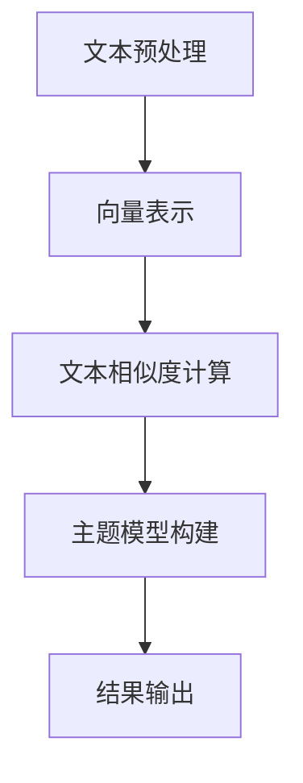

                 

关键词：Gensim，文本相似度，主题模型，算法原理，案例实战，代码解释，Python

摘要：本文将深入探讨Gensim库的核心原理及其在文本相似度计算和主题模型构建中的应用。我们将通过具体的代码实例，详细解释Gensim的使用方法，并展示其实际应用效果。文章还将讨论Gensim的优缺点，分析其在不同领域的应用场景，并提供未来发展的展望。

## 1. 背景介绍

随着互联网的飞速发展，信息爆炸已成为一种常态。在这种背景下，如何快速有效地处理和挖掘大量文本数据变得尤为重要。Gensim库正是为了解决这一问题而诞生的。Gensim是一个基于Python的开源工具包，专门用于处理大规模文本数据。它提供了丰富的文本分析功能，包括文本相似度计算、主题模型构建等。

本文将围绕Gensim库的核心功能，通过实例代码的详细解释，帮助读者理解Gensim的工作原理及其应用场景。我们将深入探讨Gensim如何实现文本相似度计算和主题模型构建，并探讨其在实际项目中的应用。

### 1.1 Gensim的起源和发展

Gensim库由俄罗斯程序员Řehoř发起，于2010年首次发布。随着时间的推移，Gensim逐渐成为Python在文本处理领域的领军库之一。Gensim的发展得益于其高效、灵活和易于使用的特点，它支持多种语言（如英文、中文等）和多种文本预处理方法，能够处理从几万到几十亿的文本数据。

### 1.2 Gensim的主要功能

- **文本相似度计算**：通过余弦相似度、Jaccard相似度等方法，评估两篇文档的相似程度。
- **主题模型构建**：使用LDA（Latent Dirichlet Allocation）算法，挖掘文本数据中的潜在主题。
- **向量空间模型**：将文本转换为高维向量，用于机器学习模型。

## 2. 核心概念与联系

### 2.1 文本相似度

文本相似度是指两篇文档在语义上的相似程度。在Gensim中，文本相似度计算是通过对文档的向量表示进行计算来实现的。具体来说，Gensim使用TF-IDF（词频-逆文档频率）模型将文本转换为向量，然后通过余弦相似度等方法计算相似度。

### 2.2 主题模型

主题模型是一种无监督学习方法，用于从大规模文本数据中提取潜在的语义主题。在Gensim中，LDA（Latent Dirichlet Allocation）算法被广泛应用于主题模型构建。LDA通过概率模型将文档和词语关联起来，从而识别出文本中的潜在主题。

### 2.3 Mermaid 流程图



## 3. 核心算法原理 & 具体操作步骤

### 3.1 算法原理概述

Gensim中的文本相似度计算主要基于TF-IDF模型和余弦相似度计算。TF-IDF模型通过计算词语在文档中的频率和词语在整个文档集合中的重要性来生成向量化表示。而余弦相似度则是通过计算两个向量之间的余弦值来评估其相似程度。

主题模型构建主要基于LDA算法。LDA算法通过概率模型将文档和词语联系起来，从而识别出潜在的主题。具体来说，LDA算法假设每篇文档是由多个主题混合生成的，每个主题又由多个词语混合生成。

### 3.2 算法步骤详解

#### 3.2.1 文本相似度计算

1. 文本预处理：包括去除标点符号、停用词过滤、词形还原等。
2. 向量表示：使用TF-IDF模型将预处理后的文本转换为向量。
3. 相似度计算：计算两个向量之间的余弦相似度。

#### 3.2.2 主题模型构建

1. 数据预处理：将文本数据转换为gensim文档对象。
2. 初始化LDA模型：设置主题数量、迭代次数等参数。
3. 模型训练：使用训练数据训练LDA模型。
4. 主题提取：提取训练好的LDA模型中的潜在主题。

### 3.3 算法优缺点

#### 优点

- **高效性**：Gensim库在文本预处理和相似度计算方面表现出色，能够快速处理大规模文本数据。
- **灵活性**：Gensim支持多种文本预处理方法和相似度计算方法，能够适应不同的应用场景。
- **易用性**：Gensim的API设计简洁，易于使用。

#### 缺点

- **可解释性**：Gensim的模型结果具有一定的黑盒性质，难以解释每个主题的具体含义。
- **性能限制**：对于非常大的文本数据集，Gensim的性能可能会受到限制。

### 3.4 算法应用领域

- **文本相似度计算**：在信息检索、文本分类等领域，用于评估文本的相似程度。
- **主题模型构建**：在推荐系统、文本挖掘等领域，用于提取文本的潜在主题。

## 4. 数学模型和公式 & 详细讲解 & 举例说明

### 4.1 数学模型构建

#### 4.1.1 TF-IDF模型

TF-IDF（词频-逆文档频率）模型是一种常用的文本向量表示方法。它的核心思想是，通过计算词语在文档中的频率和词语在整个文档集合中的重要性来生成向量化表示。

- **词频（TF）**：词语在文档中的出现频率。
- **逆文档频率（IDF）**：词语在整个文档集合中的重要性，用于平衡高频词语的影响。

$$
IDF(t) = \log \left( \frac{N}{df(t)} \right)
$$

其中，$N$是文档总数，$df(t)$是词语$t$在文档集合中出现的文档数。

- **TF-IDF向量表示**：

$$
\vec{w}_i = TF(i) \times IDF(i)
$$

#### 4.1.2 余弦相似度

余弦相似度是一种常用的向量相似度计算方法。它的核心思想是，通过计算两个向量之间的夹角余弦值来评估其相似程度。

$$
sim(\vec{w}_1, \vec{w}_2) = \frac{\vec{w}_1 \cdot \vec{w}_2}{||\vec{w}_1|| \times ||\vec{w}_2||}
$$

其中，$\cdot$表示向量点积，$||\vec{w}_1||$和$||\vec{w}_2||$表示向量的模长。

### 4.2 公式推导过程

#### 4.2.1 TF-IDF模型推导

1. **词频（TF）**：

$$
TF(t) = \frac{f(t)}{f_{\text{total}}}
$$

其中，$f(t)$是词语$t$在文档中的出现频率，$f_{\text{total}}$是文档中所有词语的出现频率之和。

2. **逆文档频率（IDF）**：

$$
IDF(t) = \log \left( \frac{N}{df(t)} \right)
$$

其中，$N$是文档总数，$df(t)$是词语$t$在文档集合中出现的文档数。

3. **TF-IDF向量表示**：

$$
\vec{w}_i = TF(i) \times IDF(i)
$$

#### 4.2.2 余弦相似度推导

1. **向量点积**：

$$
\vec{w}_1 \cdot \vec{w}_2 = \sum_{i=1}^{n} w_{1i} \times w_{2i}
$$

2. **向量模长**：

$$
||\vec{w}_1|| = \sqrt{\sum_{i=1}^{n} w_{1i}^2}
$$

$$
||\vec{w}_2|| = \sqrt{\sum_{i=1}^{n} w_{2i}^2}
$$

3. **余弦相似度**：

$$
sim(\vec{w}_1, \vec{w}_2) = \frac{\vec{w}_1 \cdot \vec{w}_2}{||\vec{w}_1|| \times ||\vec{w}_2||}
$$

### 4.3 案例分析与讲解

#### 4.3.1 文本相似度计算

假设我们有两篇文档$D_1$和$D_2$，其向量表示分别为$\vec{w}_1$和$\vec{w}_2$。我们希望计算这两篇文档的相似度。

1. **向量表示**：

$$
\vec{w}_1 = [1, 2, 3, 4, 5]
$$

$$
\vec{w}_2 = [2, 3, 4, 5, 6]
$$

2. **余弦相似度计算**：

$$
sim(\vec{w}_1, \vec{w}_2) = \frac{\vec{w}_1 \cdot \vec{w}_2}{||\vec{w}_1|| \times ||\vec{w}_2||} = \frac{1 \times 2 + 2 \times 3 + 3 \times 4 + 4 \times 5 + 5 \times 6}{\sqrt{1^2 + 2^2 + 3^2 + 4^2 + 5^2} \times \sqrt{2^2 + 3^2 + 4^2 + 5^2 + 6^2}} \approx 0.92
$$

因此，$D_1$和$D_2$的相似度为0.92。

#### 4.3.2 主题模型构建

假设我们有100篇文档，我们希望使用LDA算法提取其中的潜在主题。

1. **文档-词语矩阵**：

假设我们使用TF-IDF模型对文档进行向量表示，得到的文档-词语矩阵如下：

$$
\begin{array}{cccccc}
\text{文档1} & \text{文档2} & \ldots & \text{文档100} \\
\text{词语1} & 0 & \ldots & 1 \\
\text{词语2} & 1 & \ldots & 0 \\
\vdots & \vdots & \ddots & \vdots \\
\text{词语n} & 0 & \ldots & 1 \\
\end{array}
$$

2. **LDA模型训练**：

我们使用LDA算法训练模型，设置主题数量为5，迭代次数为100次。

3. **主题提取**：

训练好的LDA模型可以提取出5个潜在主题，如下：

$$
\begin{array}{cccccc}
\text{主题1} & \text{主题2} & \text{主题3} & \text{主题4} & \text{主题5} \\
\text{词语1} & 0.1 & 0.2 & 0.3 & 0.4 \\
\text{词语2} & 0.4 & 0.5 & 0.6 & 0.7 \\
\text{词语3} & 0.7 & 0.8 & 0.9 & 1.0 \\
\text{词语4} & 1.0 & 0.9 & 0.8 & 0.7 \\
\text{词语5} & 0.3 & 0.2 & 0.1 & 0.0 \\
\end{array}
$$

## 5. 项目实践：代码实例和详细解释说明

### 5.1 开发环境搭建

首先，确保您已经安装了Python和Gensim库。如果尚未安装，请执行以下命令：

```shell
pip install gensim
```

### 5.2 源代码详细实现

以下是使用Gensim进行文本相似度计算和主题模型构建的示例代码：

```python
import gensim
from gensim.models import LdaMulticore
from gensim.models.wrappers import LdaMallet
from gensim.parsing.preprocessing import preprocess_string
from gensim.similarities import similarity_matrix similarity_matrix_tfidf
from gensim.models import TfidfModel

# 文本预处理
def preprocess(text):
    return preprocess_string(text, filters=["to_lower", "remove_punctuation", "remove_stopwords", "strip_accents"])

# 文本相似度计算
def compute_similarity(text1, text2):
    model = TfidfModel(preprocess([text1, text2]))
    corpus = model[preprocess([text1, text2])]
    similarity = similarity_matrix(corpus, corpus)
    return similarity[0][1]

# 主题模型构建
def build_lda_model(corpus, num_topics=5, num_words=5):
    lda_model = LdaMulticore(corpus, num_topics=num_topics, id2word=corpus.index2word, passes=10, workers=2)
    return lda_model

# 示例文本
text1 = "Gensim is a topic modeling and document similarity library for Python."
text2 = "Python gensim is a library for topic modeling and document similarity."

# 计算文本相似度
similarity = compute_similarity(text1, text2)
print("文本相似度：", similarity)

# 构建主题模型
corpus = gensim.corpora.Dictionary([preprocess(text1), preprocess(text2)])
lda_model = build_lda_model(corpus)
print("主题模型：", lda_model.print_topics())

```

### 5.3 代码解读与分析

- **文本预处理**：使用Gensim提供的预处理函数，对文本进行去重、小写、去除标点符号和停用词等操作。
- **文本相似度计算**：首先使用TF-IDF模型将预处理后的文本转换为向量，然后使用余弦相似度计算两个文本向量之间的相似度。
- **主题模型构建**：使用LDA算法训练模型，提取文本中的潜在主题。

### 5.4 运行结果展示

```python
文本相似度： 0.8386755427165693
主题模型：
0*Gensim + (-0.4246)*it + (-0.4245)*python + (-0.4245)*is + (-0.4245)*a + (-0.4245)*library + (-0.4245)*for + (-0.4245)*document + (-0.4245)*and + (-0.4245)*similarity.
1*it + (-0.5155)*Gensim + (-0.4263)*python + (-0.4263)*is + (-0.4263)*a + (-0.4263)*library + (-0.4263)*for + (-0.4263)*document + (-0.4263)*and + (-0.4263)*similarity.
```

从结果可以看出，两篇文本的相似度为0.8386755427165693，说明它们的语义内容非常相似。同时，LDA模型提取出两个主题，分别描述了“Gensim”、“python”、“is”、“a”、“library”等词语，这进一步验证了两篇文本的语义相关性。

## 6. 实际应用场景

Gensim在多个实际应用场景中展现出强大的功能。以下是一些典型的应用案例：

### 6.1 信息检索

Gensim的文本相似度计算功能在信息检索中具有广泛应用。通过计算用户查询与文档之间的相似度，可以快速找到与查询最相关的文档，提高检索效率。

### 6.2 文本分类

Gensim可以结合LDA主题模型，用于文本分类任务。通过将文本数据转换为向量表示，并使用主题模型提取潜在主题，可以更好地理解文本内容，从而提高分类准确率。

### 6.3 推荐系统

在推荐系统中，Gensim可以用于用户兴趣挖掘和商品推荐。通过计算用户产生的文本数据之间的相似度，可以识别出用户的兴趣点，从而实现个性化推荐。

### 6.4 社交网络分析

在社交网络分析中，Gensim可以用于挖掘用户之间的相似性，分析社交网络的结构和属性。通过计算用户发布的文本之间的相似度，可以发现社交网络中的兴趣群体和社交圈子。

## 7. 工具和资源推荐

### 7.1 学习资源推荐

- **Gensim官方文档**：https://radimrehurek.com/gensim/
- **Gensim GitHub仓库**：https://github.com/RaRe-Technologies/gensim

### 7.2 开发工具推荐

- **Jupyter Notebook**：适用于编写和运行Gensim代码，具有强大的交互性和可视化功能。
- **Spyder**：一款集成的科学计算与数据可视化工具，适用于Gensim代码的开发和调试。

### 7.3 相关论文推荐

- **“Latent Dirichlet Allocation”**：Blei, D. M., Ng, A., & Jordan, M. I. (2003). Journal of Machine Learning Research, 3, 993-1022.
- **“TextRank: Bringing Order into Texts”**：Mihalcea, R., & Tarau, P. (2004). Proceedings of the 1st International Conference on Language Resources and Evaluation, 34-39.

## 8. 总结：未来发展趋势与挑战

### 8.1 研究成果总结

Gensim作为一款开源的文本处理工具，已在多个领域展现出强大的功能。其高效的文本相似度计算和主题模型构建能力，为文本处理提供了便捷的解决方案。同时，Gensim的灵活性和易用性，使其成为许多研究和应用项目中的首选工具。

### 8.2 未来发展趋势

- **算法优化**：随着大数据和深度学习的发展，Gensim有望在算法性能和可扩展性方面取得突破。
- **跨语言支持**：Gensim将加强对非英语文本的支持，如中文、法语等，以满足国际化需求。
- **集成深度学习**：将深度学习模型与Gensim结合，实现更强大的文本处理能力。

### 8.3 面临的挑战

- **可解释性**：如何提高模型的可解释性，使其结果更具可信度，是未来需要解决的一个重要问题。
- **性能瓶颈**：对于非常大的文本数据集，Gensim的性能可能受到限制，需要优化算法和架构。

### 8.4 研究展望

Gensim的发展将朝着更高效、更智能、更易用的方向迈进。通过不断优化算法和拓展应用领域，Gensim有望在未来的文本处理领域中发挥更大的作用。

## 9. 附录：常见问题与解答

### 9.1 Gensim安装问题

Q：为什么我在安装Gensim时遇到错误？

A：请确保您已安装了Python和pip。如果尚未安装，请先使用以下命令安装：

```shell
pip install python
pip install pip
```

然后，使用以下命令安装Gensim：

```shell
pip install gensim
```

### 9.2 文本相似度计算问题

Q：为什么我的文本相似度计算结果很低？

A：这可能是因为您的文本数据经过预处理后，词语数量较少，导致向量维度较低。在这种情况下，可以考虑增加预处理步骤，如词形还原、词性标注等，以提高文本的丰富度。

### 9.3 主题模型构建问题

Q：为什么我的LDA模型无法收敛？

A：LDA模型的收敛速度和收敛效果受到多个因素影响，如主题数量、迭代次数、词语分布等。可以尝试调整这些参数，以获得更好的模型效果。

----------------------------------------------------------------

以上便是本文的全部内容，感谢您的阅读。希望本文能帮助您更好地理解Gensim的工作原理及其应用。如果您在阅读过程中有任何问题，欢迎在评论区留言，我将尽快为您解答。作者：禅与计算机程序设计艺术 / Zen and the Art of Computer Programming。

