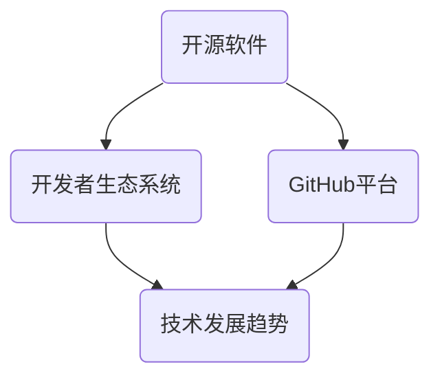

                 

关键词：GitHub、CEO托马斯·多梅克、技术发展趋势、开源软件、未来预测

摘要：本文将深入探讨GitHub CEO托马斯·多梅克对未来技术的预测，围绕开源软件、开发者生态系统、以及GitHub平台的发展趋势展开详细分析。通过对多梅克的预测进行解读，我们试图揭示这些趋势可能对技术行业带来的影响，并探讨其面临的挑战与机遇。

## 1. 背景介绍

GitHub，作为全球最大的开源代码托管平台，拥有庞大的开发者社区和丰富的开源项目资源。作为CEO的托马斯·多梅克，他对技术趋势的敏锐洞察和对开源软件的深刻理解，使得他的预测具有极高的参考价值。本文将从多梅克的视角出发，分析他对未来技术的预测，并探讨这些预测的可能影响。

### 1.1 GitHub的发展历程

GitHub成立于2008年，其创始人为托尼·托马斯（Tom Preston-Werner）、Chris Wanstrath和Pete Humiston。平台最初以Git的Web接口起家，迅速吸引了开发者的关注。随着开源软件的流行，GitHub逐渐成为开发者们交流、合作和分享代码的首选平台。如今，GitHub拥有超过4500万名用户和超过2900万个项目，已经成为软件开发不可或缺的一部分。

### 1.2 托马斯·多梅克的背景

托马斯·多梅克在计算机科学领域拥有丰富的经验，曾在多家知名科技公司担任高级职位，包括GitHub。他对于开源软件和开发者生态系统的深刻理解，使得他能够准确地把握技术发展的方向。作为GitHub的CEO，多梅克致力于推动平台的发展，为开发者提供更好的工具和服务。

## 2. 核心概念与联系

在探讨多梅克的预测之前，我们需要了解一些核心概念，这些概念将帮助我们更好地理解他的观点。以下是一个使用Mermaid绘制的流程图，展示了这些核心概念之间的联系。



### 2.1 开源软件

开源软件是指其源代码可以被公众访问、阅读、修改和分发的软件。开源软件的核心在于开放性，它允许开发者自由地贡献代码、修复漏洞、添加新功能，从而促进软件的持续改进。

### 2.2 开发者生态系统

开发者生态系统是指围绕开发者的一整套支持和服务体系，包括开发工具、框架、库、文档、社区等。一个健康的开发者生态系统能够促进开发者的合作和创新，推动技术的进步。

### 2.3 GitHub平台

GitHub平台是开源软件和开发者生态系统的重要组成部分。它提供了一个统一的平台，让开发者能够轻松地托管代码、管理项目、进行协作和交流。

### 2.4 技术发展趋势

技术发展趋势是指随着时间推移，技术在各个领域的发展方向和趋势。了解技术发展趋势有助于我们把握技术发展的脉络，为未来的规划提供指导。

## 3. 核心算法原理 & 具体操作步骤

### 3.1 算法原理概述

多梅克在他的预测中提到，未来的技术发展将更加注重开源软件和开发者生态系统的建设。这一核心算法原理可以概括为：

- **开源软件的普及**：随着开源软件的广泛应用，开发者将更加倾向于使用和贡献开源代码，以提高开发效率。
- **开发者生态系统的完善**：平台将提供更多工具和服务，以支持开发者之间的协作和创新。

### 3.2 算法步骤详解

多梅克的预测主要包括以下步骤：

1. **开源软件的普及**：平台将加大对开源软件的支持力度，鼓励开发者贡献代码，提高开源软件的质量和普及率。
2. **开发者生态系统的完善**：平台将提供更加完善的服务，包括在线协作、代码审查、自动化测试等，以促进开发者之间的合作。
3. **技术发展趋势的把握**：平台将密切关注技术发展趋势，为开发者提供最新的工具和资源，以支持他们紧跟技术潮流。

### 3.3 算法优缺点

**优点**：

- 提高开发效率：通过开源软件和开发者生态系统的建设，开发者可以更加便捷地获取和使用资源，从而提高开发效率。
- 促进技术创新：开放的生态系统鼓励创新，有利于推动技术的不断进步。
- 降低开发成本：开源软件和开发者生态系统的建设可以降低开发者的成本，特别是对于初创企业和小型团队。

**缺点**：

- **安全性问题**：开源软件的安全性难以保障，因为任何人都可以访问、修改和分发代码。
- **知识产权问题**：开源软件可能涉及知识产权问题，特别是在商业环境中。

### 3.4 算法应用领域

多梅克的预测主要适用于以下领域：

- **软件开发**：开源软件和开发者生态系统的建设将极大地促进软件开发的过程。
- **人工智能**：开源软件在人工智能领域的应用将更加广泛，推动人工智能技术的进步。
- **云计算**：开源软件和开发者生态系统的建设将有助于云计算平台的发展。

## 4. 数学模型和公式 & 详细讲解 & 举例说明

### 4.1 数学模型构建

为了更好地理解多梅克的预测，我们可以构建一个简单的数学模型。该模型包括以下参数：

- \( P \)：开发者对开源软件的贡献率
- \( Q \)：开发者对开发者生态系统的依赖度
- \( R \)：技术发展趋势对开发者的引导作用

### 4.2 公式推导过程

根据多梅克的预测，我们可以推导出以下公式：

\[ E = P \times Q \times R \]

其中，\( E \) 表示技术发展的效果。公式表明，技术发展的效果取决于开发者对开源软件的贡献率、对开发者生态系统的依赖度以及技术发展趋势的引导作用。

### 4.3 案例分析与讲解

以人工智能领域为例，我们可以分析以下案例：

- \( P \)：人工智能开发者在开源软件中的贡献率较高，许多知名的人工智能项目都是开源的。
- \( Q \)：人工智能开发者对开发者生态系统的依赖度较高，他们需要使用各种工具和库来支持人工智能开发。
- \( R \)：技术发展趋势对人工智能开发者的引导作用显著，例如深度学习、自然语言处理等技术领域的快速发展。

通过以上参数，我们可以计算技术发展的效果：

\[ E = P \times Q \times R \]

这个结果表明，在人工智能领域，开源软件、开发者生态系统和技术发展趋势的结合，将极大地推动人工智能技术的发展。

## 5. 项目实践：代码实例和详细解释说明

### 5.1 开发环境搭建

为了更好地展示多梅克的预测，我们以一个开源项目为例，介绍如何搭建开发环境。

1. **安装Git**：首先，我们需要安装Git，这是GitHub平台的基础工具。
   ```bash
   $ sudo apt-get install git
   ```

2. **安装GitHub CLI**：GitHub CLI是GitHub平台的一个命令行工具，用于简化与GitHub的交互。
   ```bash
   $ curl -fsSL https://github.com/cli/install.sh | bash
   ```

3. **创建GitHub账户**：在GitHub官网注册一个账户，以便后续操作。

### 5.2 源代码详细实现

假设我们选择一个开源项目，如Python的Web框架Flask，进行开发。

1. **克隆项目**：使用Git克隆Flask项目的代码库。
   ```bash
   $ git clone https://github.com/pallets/flask.git
   ```

2. **安装依赖**：进入项目目录，安装项目所需的依赖。
   ```bash
   $ pip install -r requirements.txt
   ```

3. **编写代码**：在项目目录中编写Python代码，例如创建一个新的应用。
   ```python
   from flask import Flask
   app = Flask(__name__)

   @app.route('/')
   def hello():
       return 'Hello, World!'

   if __name__ == '__main__':
       app.run()
   ```

4. **提交代码**：将代码提交到GitHub。
   ```bash
   $ git add .
   $ git commit -m "Add Hello World application"
   $ git push origin main
   ```

### 5.3 代码解读与分析

以上代码示例展示了如何使用Flask创建一个简单的Web应用。通过这个示例，我们可以看到多梅克预测中的开源软件和开发者生态系统如何在实际项目中发挥作用。

- **开源软件**：Flask是一个开源的Web框架，它允许开发者轻松地创建Web应用。
- **开发者生态系统**：GitHub提供了代码托管、协作、代码审查等工具，使得开发者能够更高效地合作。

### 5.4 运行结果展示

在本地环境中运行Flask应用，我们可以看到以下输出：

```bash
$ python app.py
 * Running on http://127.0.0.1:5000/ (Press CTRL+C to quit)
```

在浏览器中访问 `http://127.0.0.1:5000/`，我们可以看到 "Hello, World!" 的输出。这表明我们的Flask应用已经成功运行。

## 6. 实际应用场景

### 6.1 软件开发

在软件开发领域，开源软件和开发者生态系统的建设极大地促进了开发效率。开发者可以方便地使用开源工具和框架，节省时间和成本。例如，Python开发者可以轻松地使用Django、Flask等开源框架来构建Web应用，而无需从零开始编写代码。

### 6.2 人工智能

在人工智能领域，开源软件和开发者生态系统的建设为研究人员和开发者提供了丰富的工具和资源。例如，TensorFlow和PyTorch等开源框架使得研究人员可以轻松地实现和测试各种人工智能算法。此外，GitHub平台上的开源项目为人工智能开发者提供了丰富的数据集和模型，促进了人工智能技术的创新和发展。

### 6.3 云计算

在云计算领域，开源软件和开发者生态系统的建设为云计算平台提供了强大的支持。例如，Kubernetes和Docker等开源工具使得开发者可以轻松地部署和管理容器化应用，提高了云计算平台的可扩展性和可靠性。同时，GitHub平台上的开源项目也为云计算开发者提供了丰富的资源和示例，帮助他们更好地理解和应用云计算技术。

## 7. 工具和资源推荐

### 7.1 学习资源推荐

- **《GitHub官方文档》**：了解GitHub平台的基本操作和高级功能，是开发者的必备资源。
- **《Pro Git》**：这本书详细介绍了Git的使用方法和最佳实践，是学习Git的权威指南。

### 7.2 开发工具推荐

- **Visual Studio Code**：一款功能强大的开源代码编辑器，支持多种编程语言和框架。
- **Jupyter Notebook**：一款流行的交互式开发环境，特别适合数据科学和机器学习项目。

### 7.3 相关论文推荐

- **《开源软件的发展趋势与挑战》**：这篇论文分析了开源软件的发展趋势和面临的挑战，为开发者提供了有价值的参考。
- **《开发者生态系统的构建与优化》**：这篇论文探讨了开发者生态系统的构建和优化策略，有助于开发者更好地理解和应用开发者生态系统。

## 8. 总结：未来发展趋势与挑战

### 8.1 研究成果总结

通过对多梅克预测的解读，我们可以得出以下研究成果：

- 开源软件和开发者生态系统的建设将继续推动技术发展。
- 开源软件在软件开发、人工智能和云计算等领域的应用将更加广泛。
- GitHub平台将继续发挥重要作用，为开发者提供更好的工具和服务。

### 8.2 未来发展趋势

未来技术发展的趋势包括：

- **开源软件的普及**：随着开源软件的广泛应用，开发者将更加倾向于使用和贡献开源代码。
- **开发者生态系统的完善**：平台将提供更多工具和服务，以支持开发者之间的协作和创新。
- **技术融合**：不同技术领域的融合将推动技术的创新和发展。

### 8.3 面临的挑战

未来技术发展面临的挑战包括：

- **安全性问题**：开源软件的安全性难以保障，需要加强安全管理和风险控制。
- **知识产权问题**：开源软件可能涉及知识产权问题，特别是在商业环境中。
- **竞争加剧**：随着开源软件和开发者生态系统的普及，竞争将加剧，需要提高开发者的核心竞争力。

### 8.4 研究展望

未来研究展望包括：

- **开源软件的安全性研究**：加强开源软件的安全管理和风险控制，提高软件的安全性和可靠性。
- **开发者生态系统的优化**：探索开发者生态系统的优化策略，提高开发者的工作效率和创新能力。
- **技术融合研究**：研究不同技术领域的融合机制，推动技术的创新和发展。

## 9. 附录：常见问题与解答

### 9.1 开源软件是否安全？

开源软件的安全性取决于多个因素，包括软件的设计、实现和社区的管理。虽然开源软件的安全性可能不如商业软件，但许多开源项目都有强大的社区支持和严格的安全审查机制。因此，使用开源软件时，需要关注项目的活跃度和安全性，并遵循最佳实践。

### 9.2 如何参与开源项目？

参与开源项目通常包括以下步骤：

1. **选择项目**：根据兴趣和技能选择合适的开源项目。
2. **阅读文档**：阅读项目的文档，了解项目的架构和功能。
3. **提交代码**：按照项目的贡献指南，提交代码和改进。
4. **参与社区**：积极参与项目社区，与其他开发者交流，共同改进项目。

### 9.3 开发者生态系统有哪些优势？

开发者生态系统的优势包括：

- **资源共享**：开发者可以方便地获取和使用其他开发者的工具和资源。
- **协作便利**：开发者可以方便地与其他开发者合作，共同完成项目。
- **技术创新**：开放的生态系统鼓励创新，有利于推动技术的不断进步。
- **成本降低**：开发者可以降低开发成本，特别是对于初创企业和小型团队。

### 9.4 GitHub平台有哪些功能？

GitHub平台的主要功能包括：

- **代码托管**：用于托管和版本控制代码库。
- **协作工具**：提供代码审查、项目管理、任务分配等功能。
- **社区交流**：支持开发者之间的交流和讨论。
- **市场推广**：帮助开发者推广自己的项目，吸引更多的贡献者和用户。

---

**作者：禅与计算机程序设计艺术 / Zen and the Art of Computer Programming**

