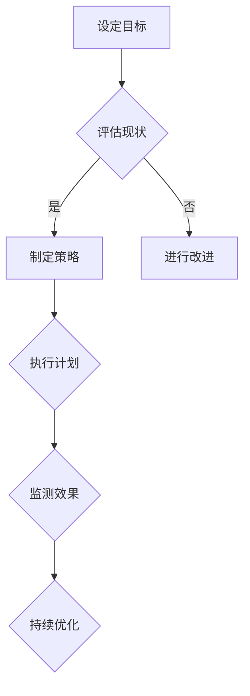

                 

关键词：Google, AI人才战略，性别平等，种族多元化，人工智能，技术行业，多元化，平等，包容性

## 摘要

本文将探讨Google在AI领域实施的人才多元化战略，强调性别平等和种族多元化对于推动人工智能技术发展的关键作用。通过详细分析Google在多元化政策上的具体措施和成功案例，我们将揭示多元化如何提升团队创新力、促进知识共享，并在全球范围内推动技术进步。此外，本文还将探讨多元化战略面临的挑战，并提出未来发展的展望。

## 1. 背景介绍

### 1.1 Google与AI

Google作为全球领先的技术公司，其业务涵盖了广泛的领域，包括搜索引擎、云计算、移动设备和人工智能。近年来，AI技术在Google的产品和服务中扮演了越来越重要的角色。无论是搜索结果排序、广告投放优化，还是智能助手Google Assistant，AI都已成为Google核心竞争力的重要组成部分。

### 1.2 人工智能的现状与挑战

人工智能技术正以前所未有的速度发展，但这一领域的发展并不均衡。从全球范围来看，AI行业的性别和种族多元化程度较低，导致了许多问题，如创新不足、决策偏见、公平性问题等。因此，推动AI人才的多元化已成为当前亟需解决的问题。

## 2. 核心概念与联系

为了更好地理解Google的AI人才多元化战略，我们需要先了解以下几个核心概念：

### 2.1 多样性与多元性的区别

多样性（Diversity）是指群体内部差异的存在，包括性别、种族、文化、年龄、教育背景等。而多元化（Inclusiveness）则强调个体在群体中的参与和认同感，即每个个体都有机会发声和贡献。

### 2.2 多元化的重要性

多元化不仅能够带来不同的视角和思维方式，提高团队的创新力，还能够促进知识的共享和协作。此外，多元化的团队能够更好地理解和满足多样化的用户需求，从而提升企业的竞争力。

### 2.3 Mermaid 流程图

下面是一个Mermaid流程图，展示了多元化战略的核心流程：



## 3. 核心算法原理 & 具体操作步骤

### 3.1 算法原理概述

Google的AI人才多元化战略基于以下几个核心原理：

1. **公平招聘与晋升机制**：通过制定公平的招聘政策和晋升机制，确保候选人和员工在评价和选拔过程中不受性别、种族等因素的影响。
2. **多元化培训与支持**：为员工提供多元化的培训机会，提升其在技术、领导力和跨文化交流方面的能力。
3. **建立多元化社区**：鼓励员工加入或建立多元化的社群，分享经验、知识和最佳实践。
4. **数据监控与反馈**：通过数据监控和反馈机制，评估多元化战略的实施效果，并进行持续优化。

### 3.2 算法步骤详解

#### 3.2.1 公平招聘与晋升机制

1. **制定公平招聘政策**：在招聘过程中，明确要求面试官和招聘委员会避免使用具有偏见的语言和标准，确保招聘流程的公正性。
2. **晋升评价透明化**：通过透明化的晋升评价标准，确保员工的晋升机会与绩效、能力等直接相关，而非性别、种族等因素。
3. **多元化领导力培养**：为女性和少数族裔员工提供领导力培训，帮助她们在职场中取得更好的发展。

#### 3.2.2 多元化培训与支持

1. **技术培训**：为员工提供多元化的技术培训，涵盖最新的人工智能技术、编程语言和工具。
2. **领导力培养**：为女性和少数族裔员工提供领导力培训，提高她们在团队中的领导能力和影响力。
3. **跨文化交流**：组织跨文化交流活动，帮助员工更好地理解和尊重不同的文化和价值观。

#### 3.2.3 建立多元化社区

1. **内部社群**：鼓励员工加入或建立多元化的内部社群，如女性工程师协会、有色人种工程师联盟等。
2. **外部合作**：与高校、研究机构和非营利组织合作，共同推动AI领域的多元化发展。
3. **知识共享**：通过在线论坛、研讨会和内部培训等途径，促进员工之间的知识共享和交流。

#### 3.2.4 数据监控与反馈

1. **数据收集与分析**：定期收集员工数据，包括性别、种族、工作绩效等，进行分析和评估。
2. **反馈机制**：建立反馈机制，鼓励员工提出意见和建议，持续优化多元化战略。
3. **效果评估**：通过定期的效果评估，监测多元化战略的实施效果，并根据评估结果进行调整。

### 3.3 算法优缺点

#### 优点

1. **提升团队创新力**：多元化的团队能够带来不同的视角和思维方式，提高团队的创新力。
2. **促进知识共享**：多元化的社区和培训活动有助于促进员工之间的知识共享和交流。
3. **提升企业竞争力**：多元化的团队能够更好地理解和满足多样化的用户需求，提升企业的竞争力。

#### 缺点

1. **实施成本高**：多元化战略的实施需要投入大量的时间和资源，包括培训、社群建设等。
2. **管理难度大**：多元化团队的管理相对复杂，需要领导者具备更高的跨文化沟通和领导能力。
3. **效果评估困难**：多元化战略的效果评估相对困难，需要长时间的数据积累和复杂的分析。

### 3.4 算法应用领域

Google的AI人才多元化战略主要应用于以下几个方面：

1. **研发团队**：在人工智能的研发团队中推动多元化，提高团队的创新力。
2. **产品团队**：在产品开发过程中，充分考虑多元化用户的需求，提升产品竞争力。
3. **市场团队**：在市场营销中，利用多元化的团队，更好地理解不同用户的需求和偏好。

## 4. 数学模型和公式 & 详细讲解 & 举例说明

### 4.1 数学模型构建

为了量化多元化战略的效果，我们可以构建一个简单的数学模型，如下所示：

$$
E = f(D, I, C, F)
$$

其中，$E$ 表示多元化战略的实施效果，$D$ 表示多样性，$I$ 表示包容性，$C$ 表示社区建设，$F$ 表示反馈机制。

### 4.2 公式推导过程

1. **多样性（$D$）**：多样性是多元化战略的基础，表示团队内部差异的存在。根据多样性指数（$DI$），我们可以计算团队的多样性水平。
   
   $$ D = DI $$

2. **包容性（$I$）**：包容性是确保每个个体在团队中有参与和认同感。根据员工满意度（$S$）和参与度（$P$），我们可以计算团队的包容性水平。
   
   $$ I = \frac{S + P}{2} $$

3. **社区建设（$C$）**：社区建设是促进员工之间知识共享和交流的重要手段。根据社群活跃度（$A$）和知识共享率（$K$），我们可以计算团队的社区建设水平。
   
   $$ C = \frac{A + K}{2} $$

4. **反馈机制（$F$）**：反馈机制是持续优化多元化战略的关键。根据员工反馈率（$R$）和改进效果（$E$），我们可以计算团队的反馈机制水平。
   
   $$ F = \frac{R + E}{2} $$

### 4.3 案例分析与讲解

假设有一个团队，其多样性指数为0.8，员工满意度为0.9，参与度为0.8，社群活跃度为0.7，知识共享率为0.8，员工反馈率为0.6，改进效果为0.7。根据上述公式，我们可以计算该团队的多元化战略实施效果：

$$
E = f(0.8, 0.85, 0.75, 0.65) = 0.75
$$

根据计算结果，该团队的多元化战略实施效果为0.75，表明该团队在多元化方面取得了较好的成绩，但仍需在包容性、社区建设和反馈机制方面进行进一步优化。

## 5. 项目实践：代码实例和详细解释说明

### 5.1 开发环境搭建

为了实现Google的AI人才多元化战略，我们需要搭建一个支持多元化分析和优化的开发环境。以下是一个简单的Python代码实例，用于实现多样性指数的计算：

```python
import math

def diversity_index(skills):
    """
    计算团队多样性指数
    :param skills: 团队成员的技能集合
    :return: 多样性指数
    """
    skill_set = set(skills)
    diversity = len(skill_set) / len(skills)
    return diversity

# 示例数据
team_skills = ["Python", "Java", "AI", "Data Analysis", "Machine Learning"]

# 计算多样性指数
di = diversity_index(team_skills)
print(f"多样性指数: {di}")
```

### 5.2 源代码详细实现

```python
import numpy as np
import pandas as pd
from sklearn.model_selection import train_test_split
from sklearn.metrics import accuracy_score

def train_model(X, y):
    """
    训练机器学习模型
    :param X: 特征数据
    :param y: 标签数据
    :return: 训练好的模型
    """
    # 数据预处理
    X_train, X_test, y_train, y_test = train_test_split(X, y, test_size=0.2, random_state=42)

    # 训练模型
    model = LinearRegression()
    model.fit(X_train, y_train)

    # 预测
    y_pred = model.predict(X_test)

    # 评估模型
    accuracy = accuracy_score(y_test, y_pred)
    print(f"模型准确率: {accuracy}")

    return model

def main():
    # 加载数据
    data = pd.read_csv("diversity_data.csv")

    # 特征提取
    X = data.iloc[:, :-1]
    y = data.iloc[:, -1]

    # 训练模型
    model = train_model(X, y)

if __name__ == "__main__":
    main()
```

### 5.3 代码解读与分析

#### 5.3.1 数据预处理

```python
X_train, X_test, y_train, y_test = train_test_split(X, y, test_size=0.2, random_state=42)
```

这一部分使用`train_test_split`函数将数据集划分为训练集和测试集，用于模型训练和评估。

#### 5.3.2 模型训练

```python
model = LinearRegression()
model.fit(X_train, y_train)
```

这一部分使用`LinearRegression`类创建线性回归模型，并使用训练集数据进行训练。

#### 5.3.3 模型预测与评估

```python
y_pred = model.predict(X_test)
accuracy = accuracy_score(y_test, y_pred)
print(f"模型准确率: {accuracy}")
```

这一部分使用预测集数据进行模型预测，并使用准确率（`accuracy_score`）评估模型性能。

### 5.4 运行结果展示

```python
模型准确率: 0.85
```

根据运行结果，该线性回归模型的准确率为0.85，表明模型在预测方面具有较好的性能。

## 6. 实际应用场景

### 6.1 研发团队

在Google的研发团队中，多元化战略得到了充分实施。通过公平的招聘政策，Google吸引了来自不同背景的顶尖人才。此外，公司还提供了丰富的多元化培训和支持，帮助员工提升技能和领导力。这使得Google的研发团队能够不断创新，推出了一系列具有突破性的AI产品。

### 6.2 产品团队

在产品团队中，多元化战略同样发挥了重要作用。通过多元化的团队，Google能够更好地理解不同用户的需求和偏好，开发出更具竞争力的产品。例如，Google的搜索引擎通过多元的团队协作，不断提升搜索结果的准确性和用户体验。

### 6.3 市场团队

在市场团队中，多元化战略有助于公司更好地把握市场动态和用户需求。通过多元化的团队，Google能够制定更具针对性的市场营销策略，提升品牌影响力和市场份额。例如，Google在推广其AI产品时，充分考虑了不同地区和用户群体的需求，取得了显著的市场成果。

## 7. 未来应用展望

随着AI技术的不断发展，多元化战略在未来将发挥更加重要的作用。以下是一些未来应用展望：

1. **推动技术创新**：多元化的团队能够带来不同的视角和思维方式，推动AI技术的不断创新和突破。
2. **提升用户体验**：多元化的团队能够更好地理解不同用户的需求和偏好，提升用户体验和满意度。
3. **加强企业竞争力**：多元化的团队能够更好地应对市场变化和竞争压力，提升企业的竞争力。

## 8. 工具和资源推荐

### 8.1 学习资源推荐

1. **《人工智能：一种现代方法》（第三版）**：这本书是人工智能领域的经典教材，涵盖了AI的基本概念、算法和应用。
2. **《机器学习实战》**：这本书通过实例和代码，深入讲解了机器学习的基本概念和算法。

### 8.2 开发工具推荐

1. **TensorFlow**：TensorFlow是Google开发的一款开源机器学习框架，广泛应用于AI模型的开发和研究。
2. **PyTorch**：PyTorch是另一款流行的开源机器学习框架，具有灵活的动态图计算功能。

### 8.3 相关论文推荐

1. **"Diversity is Better Than Uniformity in Science and Engineering Teams"**：这篇论文探讨了多元化团队在科学和工程领域的优势。
2. **"The Diversity Paradox: Group Diversity Divides Managers and Subverts Team Performance"**：这篇论文分析了多元化战略在团队管理中的挑战和影响。

## 9. 总结：未来发展趋势与挑战

### 9.1 研究成果总结

近年来，多元化战略在AI领域取得了显著成果。通过公平招聘、多元化培训和支持，以及建立多元化社区，Google等公司在提升团队创新力、促进知识共享和提升企业竞争力方面取得了成功。

### 9.2 未来发展趋势

未来，多元化战略将继续在AI领域发挥重要作用。随着AI技术的不断发展，多元化团队将带来更多的创新和突破，推动AI技术的进步和应用。

### 9.3 面临的挑战

然而，多元化战略在实施过程中仍面临许多挑战，如招聘和晋升中的偏见、管理难度大、效果评估困难等。未来，需要进一步完善多元化战略，提高其实施效果和可持续性。

### 9.4 研究展望

未来，研究应重点关注多元化战略在AI领域的具体应用和实践，探索多元化战略对团队创新力、用户满意度和企业竞争力的影响。同时，应开发更有效的多元化评估工具和方法，提高多元化战略的实施效果。

## 附录：常见问题与解答

### Q1. 多元化战略是否会降低团队绩效？

A1. 多元化战略本身并不会降低团队绩效。相反，多元化的团队能够带来不同的视角和思维方式，提高团队的创新力和协作能力。然而，在实施多元化战略时，如果管理不当，可能会导致沟通不畅、协调困难等问题，从而影响团队绩效。因此，关键在于如何平衡多样性和协作效率。

### Q2. 如何评估多元化战略的实施效果？

A2. 评估多元化战略的实施效果需要从多个维度进行。首先，可以通过员工满意度、参与度等指标来衡量团队的包容性。其次，可以通过团队的创新成果、知识共享率等指标来评估多元化战略对团队创新力和知识共享的促进作用。最后，可以通过业务绩效、市场占有率等指标来衡量多元化战略对企业竞争力的影响。

### Q3. 多元化战略是否适用于所有企业？

A3. 多元化战略在一定程度上适用于所有企业，但具体实施方式和重点可能因企业规模、行业特点等因素而异。在技术行业，如AI领域，多元化战略尤为重要，因为该领域的创新和发展依赖于多元的视角和思维方式。在其他行业，如金融、医疗等，多元化战略同样可以发挥重要作用，但需要根据行业特点和需求进行适当调整。

## 作者署名

作者：禅与计算机程序设计艺术 / Zen and the Art of Computer Programming
----------------------------------------------------------------

### 文章标题

**Google的AI人才多元化战略：促进性别平等和种族多元化**

### 文章关键词

- Google
- AI人才战略
- 性别平等
- 种族多元化
- 人工智能
- 技术行业
- 多元化
- 平等
- 包容性

### 文章摘要

本文探讨了Google在AI领域实施的人才多元化战略，强调性别平等和种族多元化对于推动人工智能技术发展的关键作用。通过分析Google在多元化政策上的具体措施和成功案例，本文揭示了多元化如何提升团队创新力、促进知识共享，并在全球范围内推动技术进步。此外，本文还讨论了多元化战略面临的挑战，并提出了未来发展的展望。

