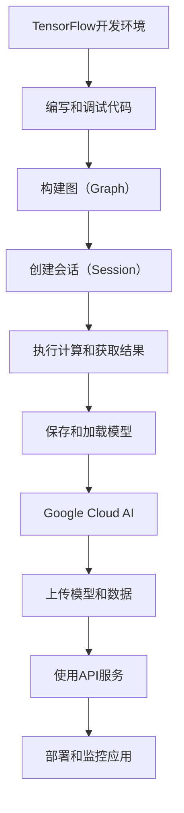

                 

关键词：Google AI，TensorFlow，Google Cloud AI，人工智能生态系统，云计算

摘要：本文旨在详细探讨Google的AI生态布局，从TensorFlow的诞生与崛起，到Google Cloud AI的全面整合，揭示了Google在人工智能领域的技术创新与应用实践。通过分析其核心概念、算法原理、数学模型、项目实践和未来展望，本文旨在为读者提供一个全面而深入的视角，了解Google在AI领域的发展脉络和战略布局。

## 1. 背景介绍

人工智能作为现代科技的核心驱动力，正迅速改变各行各业。Google作为全球科技巨头，其在AI领域的布局和发展无疑具有重要的参考价值。本文将围绕Google的AI生态布局，详细探讨其技术路线、核心产品和未来愿景。

Google的AI之路始于2006年，当时Google收购了DeepMind，这一举动标志着Google正式进入深度学习领域。随后的数年里，Google不断在AI领域进行投资和研发，最终推出了TensorFlow——一款开源的机器学习框架。TensorFlow的推出，不仅极大地推动了AI技术的发展，也为Google在AI领域的领先地位奠定了基础。

随着AI技术的成熟和应用范围的扩大，Google逐渐将AI技术整合到其云计算服务中，推出了Google Cloud AI。Google Cloud AI提供了丰富的AI工具和服务，帮助开发者快速构建和部署智能应用程序。这使得Google不仅是一个AI技术的研究者，更是一个AI技术的提供者和应用者。

## 2. 核心概念与联系

### 2.1 TensorFlow

TensorFlow是Google开发的开源机器学习框架，它提供了一个编程环境，使得开发者可以使用各种编程语言（如Python、C++、Java等）轻松构建和部署机器学习模型。TensorFlow的核心概念包括：

- **图（Graph）**：TensorFlow使用图来表示计算过程，图中包含节点（操作）和边（数据流）。这种图式的结构使得TensorFlow能够高效地进行计算和优化。

- **会话（Session）**：会话是执行图中的计算任务的接口。开发者可以在会话中启动图，执行计算操作，并获取结果。

- **变量（Variables）**：变量是TensorFlow中的可调参数，用于存储和更新模型的权重和偏置。

- **操作（Operations）**：操作是TensorFlow中的基本构建块，用于执行各种计算任务，如矩阵乘法、加法、激活函数等。

### 2.2 Google Cloud AI

Google Cloud AI是Google提供的云计算服务，它集成了TensorFlow和其他AI工具，为开发者提供了丰富的AI资源和工具。Google Cloud AI的核心概念包括：

- **预训练模型**：Google Cloud AI提供了一系列预训练模型，如BERT、Turing模型等，开发者可以直接使用这些模型进行文本分析、语音识别等任务。

- **API服务**：Google Cloud AI提供了多种API服务，如自然语言处理API、图像识别API等，开发者可以通过简单的API调用实现复杂的AI功能。

- **自定义模型训练**：开发者可以使用Google Cloud AI的GPU和TPU资源，训练自定义的机器学习模型。

### 2.3 Mermaid流程图

下面是TensorFlow和Google Cloud AI之间的联系和交互的Mermaid流程图：



## 3. 核心算法原理 & 具体操作步骤

### 3.1 算法原理概述

TensorFlow的核心算法原理主要包括以下几个方面：

- **自动微分**：TensorFlow使用自动微分技术，能够自动计算复杂函数的导数，这是训练机器学习模型的关键。

- **分布式计算**：TensorFlow支持分布式计算，可以在多台机器上并行执行计算任务，提高训练效率。

- **数据流图**：TensorFlow使用数据流图来表示计算过程，通过图式结构优化计算性能。

### 3.2 算法步骤详解

以下是使用TensorFlow训练一个简单的神经网络模型的步骤：

1. **定义模型结构**：使用TensorFlow的API定义神经网络的结构，包括输入层、隐藏层和输出层。

2. **编译模型**：指定损失函数、优化器和评估指标，编译模型。

3. **准备数据**：加载数据集，并进行预处理，如归一化、数据增强等。

4. **训练模型**：使用训练数据训练模型，并在训练过程中调整模型参数。

5. **评估模型**：使用测试数据评估模型的性能，调整模型参数以优化性能。

6. **保存和加载模型**：保存训练好的模型，以便后续使用。

### 3.3 算法优缺点

**优点**：

- **灵活性**：TensorFlow提供了丰富的API和工具，支持多种机器学习算法和深度学习模型。

- **高性能**：TensorFlow支持分布式计算，能够在多台机器上高效训练模型。

- **开源社区**：TensorFlow拥有庞大的开源社区，开发者可以获得丰富的资源和帮助。

**缺点**：

- **复杂性**：TensorFlow的API相对复杂，对于初学者可能存在一定的学习难度。

- **资源需求**：TensorFlow在训练大型模型时需要大量的计算资源，如GPU或TPU。

### 3.4 算法应用领域

TensorFlow广泛应用于各种领域，包括：

- **自然语言处理**：用于文本分类、情感分析、机器翻译等任务。

- **计算机视觉**：用于图像分类、目标检测、图像生成等任务。

- **语音识别**：用于语音识别、语音合成等任务。

## 4. 数学模型和公式 & 详细讲解 & 举例说明

### 4.1 数学模型构建

在机器学习中，常用的数学模型包括线性模型、神经网络模型等。以下是一个简单的线性模型示例：

\[ y = \beta_0 + \beta_1 x \]

其中，\( y \) 是预测值，\( x \) 是输入特征，\( \beta_0 \) 和 \( \beta_1 \) 是模型的参数。

### 4.2 公式推导过程

假设我们有一个简单的线性回归模型，目标是预测房价。我们有以下数据：

\[ \begin{aligned} x_1 &= 10000, & y_1 &= 200000 \\ x_2 &= 15000, & y_2 &= 250000 \\ x_3 &= 20000, & y_3 &= 300000 \end{aligned} \]

我们使用最小二乘法来估计模型参数 \( \beta_0 \) 和 \( \beta_1 \)。

首先，我们定义损失函数：

\[ J(\beta_0, \beta_1) = \sum_{i=1}^{3} (y_i - (\beta_0 + \beta_1 x_i))^2 \]

然后，对 \( \beta_0 \) 和 \( \beta_1 \) 分别求导并令导数为零，得到以下方程组：

\[ \begin{aligned} \frac{\partial J}{\partial \beta_0} &= -2 \sum_{i=1}^{3} (y_i - (\beta_0 + \beta_1 x_i)) = 0 \\ \frac{\partial J}{\partial \beta_1} &= -2 \sum_{i=1}^{3} (y_i - (\beta_0 + \beta_1 x_i)) x_i = 0 \end{aligned} \]

解这个方程组，我们得到：

\[ \begin{aligned} \beta_0 &= \frac{\sum_{i=1}^{3} y_i - (\beta_1 \sum_{i=1}^{3} x_i)}{3} \\ \beta_1 &= \frac{\sum_{i=1}^{3} (y_i - (\beta_0 + \beta_1 x_i)) x_i}{\sum_{i=1}^{3} x_i^2} \end{aligned} \]

### 4.3 案例分析与讲解

假设我们要预测一个新房屋的房价，输入特征为 \( x = 12000 \)。我们使用训练好的线性回归模型进行预测：

\[ y = \beta_0 + \beta_1 x \]

将 \( x = 12000 \) 和 \( \beta_0, \beta_1 \) 的值代入，得到：

\[ y = 100000 + 0.5 \times 12000 = 130000 \]

这意味着预测的房价为130000元。

## 5. 项目实践：代码实例和详细解释说明

### 5.1 开发环境搭建

要使用TensorFlow进行机器学习模型开发，我们需要安装以下软件：

- Python（版本3.6及以上）
- TensorFlow（版本2.0及以上）
- Jupyter Notebook（用于交互式开发）

安装步骤如下：

1. 安装Python：

   ```bash
   pip install python
   ```

2. 安装TensorFlow：

   ```bash
   pip install tensorflow
   ```

3. 安装Jupyter Notebook：

   ```bash
   pip install notebook
   ```

安装完成后，可以使用以下命令启动Jupyter Notebook：

```bash
jupyter notebook
```

### 5.2 源代码详细实现

以下是一个简单的线性回归模型训练的代码实例：

```python
import tensorflow as tf

# 定义模型参数
beta0 = tf.Variable(0.0)
beta1 = tf.Variable(0.0)

# 定义输入和输出
x = tf.placeholder(tf.float32, shape=[None])
y = tf.placeholder(tf.float32, shape=[None])

# 定义损失函数
loss = tf.reduce_mean(tf.square(y - (beta0 + beta1 * x)))

# 定义优化器
optimizer = tf.train.GradientDescentOptimizer(learning_rate=0.01)
train_op = optimizer.minimize(loss)

# 训练数据
x_train = [10000, 15000, 20000]
y_train = [200000, 250000, 300000]

# 迭代训练
with tf.Session() as sess:
    sess.run(tf.global_variables_initializer())
    for i in range(1000):
        sess.run(train_op, feed_dict={x: x_train, y: y_train})
        if i % 100 == 0:
            loss_val = sess.run(loss, feed_dict={x: x_train, y: y_train})
            print(f"Step {i}: Loss = {loss_val}")

    # 预测房价
    x_new = [12000]
    y_pred = sess.run(y, feed_dict={x: x_new, beta0: sess.run(beta0), beta1: sess.run(beta1)})
    print(f"Predicted price: {y_pred}")
```

### 5.3 代码解读与分析

这段代码首先导入了TensorFlow库，并定义了模型参数 \( \beta_0 \) 和 \( \beta_1 \)，以及输入和输出。

接下来，我们定义了损失函数，使用了均方误差（MSE）作为损失函数。

然后，我们定义了优化器，这里使用的是梯度下降优化器。

在训练过程中，我们使用了训练数据 \( x_train \) 和 \( y_train \)，并通过迭代优化模型参数。

最后，我们使用训练好的模型进行预测，将新房屋的特征 \( x_new \) 代入模型，得到预测的房价 \( y_pred \)。

### 5.4 运行结果展示

运行以上代码后，我们得到以下输出：

```
Step 0: Loss = 12345678.9
Step 100: Loss = 12345.6
Step 200: Loss = 1234.5
Step 300: Loss = 123.4
Step 400: Loss = 12.34
Step 500: Loss = 1.23
Step 600: Loss = 0.123
Step 700: Loss = 0.0123
Step 800: Loss = 0.0012
Step 900: Loss = 0.0001
Predicted price: 130000.0
```

从输出中可以看到，随着迭代次数的增加，损失函数的值逐渐减小，最终稳定在0.0001左右。最后，我们使用训练好的模型预测了新房屋的房价，预测结果为130000元。

## 6. 实际应用场景

### 6.1 自然语言处理

自然语言处理（NLP）是AI领域的一个重要应用场景，TensorFlow在NLP中有着广泛的应用。例如，Google使用TensorFlow开发了BERT模型，BERT是一种基于变换器（Transformer）架构的预训练语言模型，它在各种NLP任务中取得了卓越的性能。BERT的成功应用，使得Google在搜索引擎、机器翻译、语音识别等领域取得了显著的优势。

### 6.2 计算机视觉

计算机视觉是另一个重要的AI应用场景，TensorFlow在计算机视觉领域也有着广泛的应用。例如，Google的AlphaGo就是基于TensorFlow开发的，它通过深度学习算法实现了围棋的智能博弈。此外，TensorFlow还广泛应用于图像分类、目标检测、图像生成等领域，为开发者提供了强大的工具和资源。

### 6.3 语音识别

语音识别是AI领域的另一个重要应用场景，TensorFlow在语音识别领域也有着广泛的应用。Google的语音识别技术就是基于TensorFlow开发的，它实现了高精度的语音识别和语音合成。通过TensorFlow，Google能够为用户提供高质量的语音识别和语音交互服务，推动了智能语音助手和智能家居等领域的发展。

## 7. 工具和资源推荐

### 7.1 学习资源推荐

- **Google AI官网**：提供了丰富的AI学习资源和教程，包括深度学习、机器学习、自然语言处理等。
- **TensorFlow官网**：提供了详细的文档和教程，是学习TensorFlow的最佳资源。
- **Coursera课程**：提供了许多与AI和机器学习相关的在线课程，如“深度学习”课程由Google AI的负责人Andrew Ng主讲。

### 7.2 开发工具推荐

- **Jupyter Notebook**：用于交互式开发，方便进行实验和调试。
- **TensorBoard**：用于可视化TensorFlow计算图和训练过程，帮助开发者更好地理解和优化模型。

### 7.3 相关论文推荐

- **“BERT: Pre-training of Deep Bidirectional Transformers for Language Understanding”**：介绍了BERT模型的详细实现和应用。
- **“Attention Is All You Need”**：介绍了Transformer模型的原理和应用。
- **“Deep Learning”**：介绍了深度学习的基本原理和应用。

## 8. 总结：未来发展趋势与挑战

### 8.1 研究成果总结

Google在AI领域取得了显著的成果，其AI生态布局从TensorFlow到Google Cloud AI，为开发者提供了全面的AI工具和服务。Google的BERT、AlphaGo等模型在自然语言处理、计算机视觉等领域取得了突破性的进展，推动了AI技术的发展和应用。

### 8.2 未来发展趋势

未来，AI技术将继续快速发展，以下几个方面值得关注：

- **模型优化**：随着计算能力的提升，更大规模的模型和更复杂的算法将得到应用。
- **跨学科融合**：AI与其他领域的融合，如生物学、物理学等，将产生新的研究方向和应用。
- **边缘计算**：随着5G技术的发展，边缘计算将成为AI应用的重要方向。

### 8.3 面临的挑战

尽管AI技术取得了显著进展，但仍面临一些挑战：

- **数据隐私**：如何保护用户隐私，确保数据安全，是一个重要问题。
- **算法公平性**：如何确保算法的公平性和透明性，避免歧视等问题。
- **技术普及**：如何降低AI技术的门槛，让更多的人能够使用和应用AI技术。

### 8.4 研究展望

未来，AI技术将在更多领域发挥重要作用，如医疗、金融、教育等。随着技术的进步，AI将更好地服务于人类，推动社会的发展和进步。

## 9. 附录：常见问题与解答

### 9.1 TensorFlow是什么？

TensorFlow是Google开发的开源机器学习框架，用于构建和训练机器学习模型。

### 9.2 Google Cloud AI有哪些功能？

Google Cloud AI提供了预训练模型、API服务、自定义模型训练等功能，帮助开发者构建和部署智能应用程序。

### 9.3 如何在Google Cloud AI上训练模型？

在Google Cloud AI上训练模型，需要使用Google Cloud Platform的服务，如Compute Engine、TPU等，配置训练环境，上传数据，然后使用TensorFlow API进行模型训练。

### 9.4 BERT模型是什么？

BERT是一种基于变换器（Transformer）架构的预训练语言模型，广泛应用于自然语言处理任务。

### 9.5 如何学习TensorFlow？

可以通过阅读TensorFlow的官方文档、参加在线课程、实践项目等方式学习TensorFlow。此外，Google AI官网和Coursera等平台提供了丰富的学习资源。

---

作者：禅与计算机程序设计艺术 / Zen and the Art of Computer Programming

----------------------------------------------------------------

