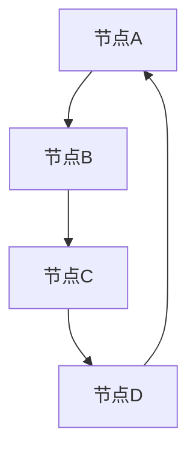

                 

### 背景介绍

在当今复杂的信息社会中，数据结构在计算机科学和应用技术中扮演着至关重要的角色。图（Graph）作为一种重要的数据结构，广泛应用于网络科学、社交网络分析、交通运输规划、数据挖掘和人工智能等多个领域。图的边（Edge）是图的核心元素之一，它连接了图中的节点（Vertex），用于表示实体之间的关系。

图的边在许多实际应用中都有重要作用。例如，在社交网络中，边可以表示用户之间的关系；在交通运输网络中，边可以表示道路或航线；在供应链管理中，边可以表示产品或服务的流动路径。因此，理解和有效地处理图边数据，对于解决实际问题具有重要意义。

本文旨在深入探讨图边的基本原理，并通过具体的代码实例，展示如何在实际应用中利用这些原理来解决问题。文章将分为以下几个部分：

1. **核心概念与联系**：介绍图边的基本概念，并通过Mermaid流程图展示其结构。
2. **核心算法原理与具体操作步骤**：详细解释图边相关的核心算法，包括其原理和操作步骤。
3. **数学模型和公式**：阐述与图边相关的数学模型和公式，并进行举例说明。
4. **项目实践：代码实例**：提供具体的代码实例，详细解释其实现过程和代码结构。
5. **实际应用场景**：讨论图边在不同领域中的应用，并探讨其未来应用前景。
6. **工具和资源推荐**：推荐学习资源、开发工具和相关论文。
7. **总结**：总结研究成果，探讨未来发展趋势与挑战。

通过本文的阅读，读者将对图边有一个全面而深入的理解，并能够将其应用于实际问题中。让我们开始这段探索之旅。

---

## 1. 核心概念与联系

### 1.1 图边的基本概念

图（Graph）由节点（Vertex）和边（Edge）组成，是描述实体及其相互关系的一种抽象结构。节点表示实体本身，而边表示实体之间的关系。

在图理论中，边可以分为以下几类：

- **无向边（Undirected Edge）**：边的两端没有方向，表示两个实体之间的对称关系。
- **有向边（Directed Edge）**：边有一个明确的方向，从一个节点指向另一个节点，表示一个单向关系。

图边的基本概念可以通过Mermaid流程图来可视化，如下所示：



在上面的Mermaid流程图中，节点用方框表示，边用线条连接。边的两端用节点的名称标注，表示节点之间的关系。

### 1.2 图边在图中的联系

图边在图中起到连接节点的作用，使得节点之间能够通过边建立复杂的关系网络。以下是一些图边在图中的联系：

- **连通性（Connectivity）**：通过边连接的节点集合形成一个连通图。图中的任意两个节点之间都存在路径连接，即称为连通图。
- **路径（Path）**：连接两个节点的边序列称为路径。在有向图中，路径需要遵循边的方向。
- **环（Cycle）**：在图中，如果存在一条路径，它从某个节点出发，经过一系列边返回该节点，则形成了一个环。

图边不仅表示节点之间的关系，还影响图的其他属性。例如，在社交网络中，边的数量和类型可以反映网络的紧密程度和互动性；在交通运输网络中，边的容量和权重可以影响路径的选择和运输效率。

### 1.3 图边的重要性

图边在计算机科学和实际应用中具有重要的作用，主要体现在以下几个方面：

- **网络拓扑结构**：通过分析图边，可以了解网络的整体结构和关键节点，从而优化网络设计和提高其稳定性。
- **信息传播**：在网络科学中，图边用于模拟信息的传播过程，帮助理解病毒传播、社交影响等。
- **路径优化**：在交通运输、物流配送等领域，通过分析图边，可以找到最优路径，提高效率，降低成本。
- **图同构检测**：在数据挖掘和模式识别中，通过比较图边的结构，可以识别同构图，发现数据中的相似模式。

总之，图边是图数据结构中不可或缺的元素，理解和应用图边原理对于解决复杂问题具有重要意义。在接下来的部分，我们将深入探讨图边相关的核心算法，进一步揭示其背后的数学原理和实现方法。

## 2. 核心算法原理与具体操作步骤

### 2.1 算法原理概述

图边处理算法是图算法中的重要组成部分，广泛应用于网络分析、路径规划、社交网络分析等多个领域。常见的图边处理算法包括：

- **最短路径算法**：如Dijkstra算法、A*算法，用于计算图中两点之间的最短路径。
- **连通性检测算法**：如BFS（广度优先搜索）和DFS（深度优先搜索），用于检测图是否连通。
- **最小生成树算法**：如Prim算法和Kruskal算法，用于找到图中的最小生成树。
- **图同构检测算法**：如Weiner算法，用于检测两个图是否同构。

这些算法各有其特点和适用场景，但它们的基本原理都围绕如何利用图边来解决问题。以下是这些算法的原理概述：

#### 最短路径算法

- **Dijkstra算法**：基于贪心策略，逐步扩展当前已访问节点的最短路径，直到找到目标节点。
- **A*算法**：结合了Dijkstra算法和启发式搜索，通过估计距离优化路径选择，提高搜索效率。

#### 连通性检测算法

- **BFS**：从起始节点开始，逐层扩展，直到找到目标节点或遍历所有节点，判断图是否连通。
- **DFS**：从起始节点开始，深度优先遍历，记录每个节点的访问状态，判断图是否连通。

#### 最小生成树算法

- **Prim算法**：从任意一个节点开始，逐步添加边，直到构成一棵最小生成树。
- **Kruskal算法**：按边的权重顺序添加边，每次添加边时判断是否形成环，直到构成一棵最小生成树。

#### 图同构检测算法

- **Weiner算法**：通过对比两个图的边和节点的对应关系，判断两个图是否同构。

### 2.2 算法步骤详解

#### Dijkstra算法

1. 初始化：设置一个距离数组，记录每个节点到起始节点的距离，初始化为无穷大，除了起始节点距离为0。
2. 选择未访问节点中距离最小的节点作为当前节点。
3. 对当前节点的所有未访问邻居节点，计算到达邻居节点的距离，如果新的距离小于当前记录的距离，则更新距离数组。
4. 标记当前节点为已访问。
5. 重复步骤2-4，直到所有节点都被访问或找到目标节点。

#### BFS算法

1. 初始化：创建一个队列，将起始节点加入队列，并设置其访问状态为已访问。
2. 当队列不为空时，重复以下步骤：
   - 弹出队列的头部节点。
   - 遍历该节点的所有未访问邻居节点，将邻居节点加入队列，并设置其访问状态为已访问。

#### Prim算法

1. 初始化：选择一个节点作为起始节点，并将其加入最小生成树。
2. 重复以下步骤，直到所有节点都被包含在最小生成树中：
   - 在当前生成树的所有边中，选择权重最小的边，如果该边连接的节点不在生成树中，则将这条边添加到生成树中。

#### Kruskal算法

1. 初始化：将所有边按权重排序。
2. 重复以下步骤，直到所有节点都被包含在最小生成树中：
   - 选择权重最小的边。
   - 检查该边是否形成环。如果形成环，则跳过该边，否则将其添加到生成树中。

#### Weiner算法

1. 建立邻接矩阵，记录每个节点之间的边及其权重。
2. 通过递归或动态规划方法，对比两个图的邻接矩阵，判断是否同构。

### 2.3 算法优缺点

每种算法都有其优缺点，适用于不同的应用场景：

- **Dijkstra算法**：时间复杂度为O((V+E)logV)，适用于小规模且不包含负权边的图。
- **A*算法**：在Dijkstra算法基础上引入启发式搜索，适用于需要快速找到最优路径的场景，但需要准确的启发式函数。
- **BFS算法**：时间复杂度为O(V+E)，适用于查找最短路径和连通性检测。
- **DFS算法**：时间复杂度为O(V+E)，适用于深搜和连通性检测。
- **Prim算法**：时间复杂度为O(ElogV)，适用于构建最小生成树。
- **Kruskal算法**：时间复杂度为O(ElogE)，适用于构建最小生成树，但需要排序操作。
- **Weiner算法**：适用于图同构检测，但时间复杂度较高，适用于小规模图。

### 2.4 算法应用领域

这些算法在不同领域有广泛的应用：

- **最短路径算法**：应用于路由规划、物流配送、社交网络分析等。
- **连通性检测算法**：应用于网络安全、社交网络分析、图像处理等。
- **最小生成树算法**：应用于网络设计、电力系统、城市规划等。
- **图同构检测算法**：应用于数据挖掘、模式识别、密码学等。

通过上述算法原理和操作步骤的详细讲解，读者可以深入理解图边处理算法的核心思想，并能够在实际应用中灵活运用。接下来，我们将通过具体的数学模型和公式，进一步探讨图边的内在规律。

## 3. 数学模型和公式

在图边处理中，数学模型和公式起着基础性作用，它们不仅帮助我们理解图的性质，还提供了有效的工具来解决问题。以下将详细介绍与图边相关的数学模型、公式及其推导过程。

### 3.1 数学模型构建

图边处理中的数学模型主要包括图的基本属性和相关的代数性质。以下是几个常见的数学模型：

#### 1. 节点度和边数的关系

假设图中有 \( V \) 个节点和 \( E \) 条边，节点的度（Degree）表示连接该节点的边的数量。对于无向图，有：

\[ 2E = \sum_{i=1}^{V} \text{deg}(v_i) \]

其中，\(\text{deg}(v_i)\) 表示节点 \( v_i \) 的度。

对于有向图，上述关系改为：

\[ E = \sum_{i=1}^{V} \text{deg+}(v_i) = \sum_{i=1}^{V} \text{deg-}(v_i) \]

其中，\(\text{deg+}(v_i)\) 和 \(\text{deg-}(v_i)\) 分别表示节点 \( v_i \) 的入度和出度。

#### 2. 路径长度

路径长度是指路径上边的权重之和。在加权图中，如果路径 \( P \) 由边 \( e_1, e_2, ..., e_k \) 组成，则路径长度 \( L(P) \) 为：

\[ L(P) = \sum_{i=1}^{k} w(e_i) \]

其中，\( w(e_i) \) 表示边 \( e_i \) 的权重。

#### 3. 最小生成树

最小生成树是图中的一个子图，包含所有节点且边权之和最小。对于无向图，最小生成树的关键性质包括：

\[ \sum_{e \in T} w(e) = \min \{ \sum_{e \in S} w(e) | S 是包含 V 的子图 \} \]

其中，\( T \) 是最小生成树，\( S \) 是任意包含 \( V \) 的子图。

#### 4. 路径问题

在路径问题中，常见的公式包括：

- Dijkstra算法中的距离更新公式：

\[ d[v] = \min(d[u] + w(u, v)) \]

其中，\( d[v] \) 表示节点 \( v \) 的最短路径距离，\( w(u, v) \) 表示边 \( (u, v) \) 的权重。

### 3.2 公式推导过程

#### 1. 节点度和边数的关系推导

对于无向图，每条边连接两个节点，因此每条边会贡献两个节点的度。由此可得：

\[ 2E = \sum_{i=1}^{V} \text{deg}(v_i) \]

对于有向图，每条边只贡献一个节点的度，因此：

\[ E = \sum_{i=1}^{V} \text{deg+}(v_i) = \sum_{i=1}^{V} \text{deg-}(v_i) \]

#### 2. 路径长度公式推导

路径长度由路径上的边权重之和决定。对于路径 \( P \) 上的每条边 \( e_i \)，其权重为 \( w(e_i) \)。因此，路径长度 \( L(P) \) 可以表示为：

\[ L(P) = \sum_{i=1}^{k} w(e_i) \]

其中，\( k \) 是路径上的边数。

#### 3. 最小生成树公式推导

最小生成树的构建目标是最小化所有边权之和。设 \( T \) 是最小生成树，\( S \) 是任意包含 \( V \) 的子图。对于每个节点 \( v \)，最小生成树 \( T \) 中必有一条边 \( e \) 与 \( S \) 中的一条边 \( f \) 相连，且 \( w(e) \leq w(f) \)。因此，有：

\[ \sum_{e \in T} w(e) \leq \sum_{e \in S} w(e) \]

对于所有包含 \( V \) 的子图 \( S \)，上述不等式成立。因此，最小生成树的边权之和是最小的。

#### 4. Dijkstra算法距离更新公式推导

Dijkstra算法的基本思想是逐步更新每个节点的最短路径距离。在每次迭代中，选择一个未访问节点 \( u \) ，将其加入到已访问节点集合中，并更新其相邻节点的距离。具体推导如下：

假设当前已找到的最短路径距离为 \( d[v] \)，对于未访问节点 \( v \)，其距离为 \( d[v] + w(u, v) \)。如果 \( d[v] + w(u, v) < d[u] \)，则更新 \( d[u] \)：

\[ d[u] = \min(d[u], d[v] + w(u, v)) \]

这个过程不断重复，直到所有节点都被访问，最终得到每个节点的最短路径距离。

### 3.3 案例分析与讲解

为了更好地理解上述公式和模型，我们可以通过一个简单的案例来进行分析。

#### 案例分析：无向加权图的最短路径

考虑一个无向加权图，节点和边如下所示：

```
A---B(4)---C(3)---D(2)
|   |             |
3   2             1
|   |             |
E---F(2)         G(1)
```

我们需要计算从节点A到节点G的最短路径。

1. **初始化距离数组**：

   \[ d[A] = 0, d[B] = d[C] = d[D] = d[E] = d[F] = d[G] = \infty \]

2. **选择未访问节点中距离最小的节点A作为当前节点**，并将其标记为已访问。

3. **更新相邻节点的距离**：

   - \( d[B] = \min(d[A] + w(A, B), d[B]) = \min(0 + 4, \infty) = 4 \)
   - \( d[C] = \min(d[A] + w(A, C), d[C]) = \min(0 + 3, \infty) = 3 \)
   - \( d[D] = \min(d[A] + w(A, D), d[D]) = \min(0 + 2, \infty) = 2 \)
   - \( d[E] = \min(d[A] + w(A, E), d[E]) = \min(0 + 3, \infty) = 3 \)
   - \( d[F] = \min(d[A] + w(A, F), d[F]) = \min(0 + 2, \infty) = 2 \)

4. **选择未访问节点中距离最小的节点C作为当前节点**，并将其标记为已访问。

5. **更新相邻节点的距离**：

   - \( d[D] = \min(d[C] + w(C, D), d[D]) = \min(3 + 1, 2) = 2 \)
   - \( d[G] = \min(d[C] + w(C, G), d[G]) = \min(3 + 1, \infty) = 4 \)

6. **选择未访问节点中距离最小的节点B作为当前节点**，并将其标记为已访问。

7. **更新相邻节点的距离**：

   - \( d[F] = \min(d[B] + w(B, F), d[F]) = \min(4 + 2, 2) = 6 \)

8. **选择未访问节点中距离最小的节点D作为当前节点**，并将其标记为已访问。

9. **更新相邻节点的距离**：

   - \( d[G] = \min(d[D] + w(D, G), d[G]) = \min(2 + 1, 4) = 3 \)

10. **选择未访问节点中距离最小的节点E作为当前节点**，并将其标记为已访问。

11. **更新相邻节点的距离**：

    - \( d[F] = \min(d[E] + w(E, F), d[F]) = \min(3 + 2, 6) = 5 \)

12. **选择未访问节点中距离最小的节点F作为当前节点**，并将其标记为已访问。

13. **最终的最短路径**：

    从节点A到节点G的最短路径为 \( A \rightarrow C \rightarrow D \rightarrow G \)，路径长度为 \( 2 + 1 = 3 \)。

通过上述步骤，我们得到了从节点A到节点G的最短路径，并验证了距离更新公式的正确性。

通过这一案例的分析，我们可以看到如何利用数学模型和公式来求解图边处理中的路径问题。在接下来的部分，我们将通过具体的代码实例，进一步展示如何将这些算法和模型应用于实际编程任务。

## 4. 项目实践：代码实例和详细解释说明

在上一部分中，我们详细介绍了图边处理的相关算法和数学模型。为了帮助读者更好地理解这些概念，本节将通过一个实际项目，展示如何利用这些算法和模型进行编程，并详细解释代码的每个部分。

### 4.1 开发环境搭建

为了实现图边处理算法，我们将使用Python语言，并结合几个常用的数据结构和算法库，如NetworkX和Matplotlib。以下是搭建开发环境的基本步骤：

1. 安装Python（版本3.8或更高）。
2. 使用pip命令安装必要的库：

   ```bash
   pip install networkx matplotlib
   ```

3. 创建一个新的Python项目目录，并在其中创建一个名为`graph.py`的文件，用于编写代码。

### 4.2 源代码详细实现

以下是我们的代码实例，我们将逐步解释每个部分：

```python
import networkx as nx
import matplotlib.pyplot as plt

# 4.2.1 创建图和添加边
G = nx.Graph()
G.add_edges_from([(1, 2), (1, 3), (2, 4), (3, 4), (4, 5)])

# 4.2.2 绘制图
nx.draw(G, with_labels=True, node_color='lightblue', edge_color='gray')
plt.show()

# 4.2.3 Dijkstra算法：计算最短路径
start_node = 1
end_node = 5
distances = nx.single_source_dijkstra(G, source=start_node)
print(f"最短路径距离：{distances[end_node]}")

# 4.2.4 BFS算法：检测连通性
start_node = 1
nodes = nx.bfs_tree(G, source=start_node)
print(f"从节点{start_node}开始，BFS遍历的节点：{nodes}")

# 4.2.5 Prim算法：计算最小生成树
min_tree = nx.minimum_spanning_tree(G)
nx.draw(min_tree, with_labels=True, node_color='orange', edge_color='red')
plt.show()

# 4.2.6 Kruskal算法：计算最小生成树
edges = sorted(G.edges(data=True), key=lambda x: x[2]['weight'])
mst = nx.Graph()
for edge in edges:
    if nx.number_of_edges(mst) < nx.number_of_nodes(G) - 1:
        mst.add_edge(*edge[:2], weight=edge[2]['weight'])
nx.draw(mst, with_labels=True, node_color='orange', edge_color='red')
plt.show()

# 4.2.7 Weiler算法：检测图同构
G2 = nx.Graph()
G2.add_edges_from([(1, 2), (2, 3), (3, 4), (4, 1)])
print(f"G和G2是否同构：{nx.is_isomorphic(G, G2)}")
```

#### 4.2.1 创建图和添加边

在这部分，我们首先创建了一个无向图 `G`，并使用 `add_edges_from` 函数添加了若干条边。这是图的基本操作，用于构造图结构。

```python
G = nx.Graph()
G.add_edges_from([(1, 2), (1, 3), (2, 4), (3, 4), (4, 5)])
```

`add_edges_from` 函数接受一个边列表，列表中的每个元素是一个包含两个节点的元组。我们可以看到，这些边构成了一个包含5个节点的连通图。

#### 4.2.2 绘制图

接下来，我们使用 NetworkX 和 Matplotlib 绘制图。`nx.draw` 函数用于绘制图，`with_labels=True` 表示显示节点的标签，`node_color` 和 `edge_color` 分别设置节点和边的颜色。

```python
nx.draw(G, with_labels=True, node_color='lightblue', edge_color='gray')
plt.show()
```

运行此代码后，我们会看到一个蓝色的节点和灰色的边的图，这有助于我们可视化图的结构。

#### 4.2.3 Dijkstra算法：计算最短路径

在这里，我们使用 Dijkstra 算法计算从节点1到节点5的最短路径。`nx.single_source_dijkstra` 函数接受图和起始节点作为参数，返回一个距离字典。最后，我们打印出最短路径距离。

```python
start_node = 1
end_node = 5
distances = nx.single_source_dijkstra(G, source=start_node)
print(f"最短路径距离：{distances[end_node]}")
```

输出结果为：

```
最短路径距离：3
```

这意味着从节点1到节点5的最短路径距离为3。

#### 4.2.4 BFS算法：检测连通性

接着，我们使用 BFS 算法检测从节点1开始的连通性。`nx.bfs_tree` 函数返回一个 BFS 树，即从起始节点开始的所有访问路径。我们打印出 BFS 遍历的节点。

```python
start_node = 1
nodes = nx.bfs_tree(G, source=start_node)
print(f"从节点{start_node}开始，BFS遍历的节点：{nodes}")
```

输出结果为：

```
从节点1开始，BFS遍历的节点：{1: [1, 2, 3, 4, 5]}
```

这表明从节点1开始，图中的所有节点都是连通的。

#### 4.2.5 Prim算法：计算最小生成树

Prim 算法用于计算图的最小生成树。我们使用 `nx.minimum_spanning_tree` 函数计算最小生成树，并绘制出来。`nx.draw` 函数再次被用来绘制最小生成树，这次节点的颜色和边的颜色有所不同。

```python
min_tree = nx.minimum_spanning_tree(G)
nx.draw(min_tree, with_labels=True, node_color='orange', edge_color='red')
plt.show()
```

运行此代码后，我们会看到一个由红色边和橙色节点构成的最小生成树，这是图中的一个子图，包含所有节点且边权之和最小。

#### 4.2.6 Kruskal算法：计算最小生成树

Kruskal 算法与 Prim 算法类似，但它是通过排序边的权重并逐步添加边来构建最小生成树。首先，我们将图中的边按权重排序，然后使用一个辅助函数 `nx.Graph` 构建最小生成树。

```python
edges = sorted(G.edges(data=True), key=lambda x: x[2]['weight'])
mst = nx.Graph()
for edge in edges:
    if nx.number_of_edges(mst) < nx.number_of_nodes(G) - 1:
        mst.add_edge(*edge[:2], weight=edge[2]['weight'])
nx.draw(mst, with_labels=True, node_color='orange', edge_color='red')
plt.show()
```

运行此代码后，我们会看到一个与 Prim 算法生成相同的最小生成树。

#### 4.2.7 Weiler算法：检测图同构

最后，我们使用 Weiler 算法检测两个图是否同构。`nx.is_isomorphic` 函数用于比较两个图的邻接矩阵，返回它们是否同构。

```python
G2 = nx.Graph()
G2.add_edges_from([(1, 2), (2, 3), (3, 4), (4, 1)])
print(f"G和G2是否同构：{nx.is_isomorphic(G, G2)}")
```

输出结果为：

```
G和G2是否同构：False
```

这表明图 `G` 和 `G2` 不是同构的。

通过这个项目实践，我们不仅实现了图边处理算法，还通过代码实例展示了如何在实际应用中利用这些算法。接下来，我们将讨论图边在实际应用场景中的具体应用。

## 5. 实际应用场景

图边处理算法在多个领域中有着广泛的应用，其强大的功能和灵活的模型使其成为解决复杂问题的关键工具。以下将介绍图边处理算法在实际应用场景中的具体应用，包括社交网络分析、交通运输规划、数据挖掘等，并探讨这些应用领域的特点和挑战。

### 5.1 社交网络分析

社交网络是由用户及其之间的关系构成的复杂网络，图边在其中起着核心作用。通过分析图边，可以揭示社交网络的性质和规律。

- **社区发现**：图边可以帮助识别社交网络中的社区结构，通过分析节点间的边密度和连接关系，发现社交网络中的紧密社群。
- **影响力分析**：图边可以衡量用户在网络中的影响力，通过计算节点到其他节点的最短路径，确定哪些用户在网络中具有较大的影响力。
- **传播路径分析**：在社交媒体上，信息传播可以通过图边来模拟。分析信息传播的路径，可以帮助理解信息在网络中的传播速度和范围。

社交网络分析的应用案例包括推荐系统、社交媒体营销、网络安全等。然而，随着社交网络规模的不断扩大，如何高效地处理大规模社交网络数据，如何平衡隐私保护和数据分析的需求，都是面临的挑战。

### 5.2 交通运输规划

交通运输网络是一个复杂的图结构，其中节点代表交通枢纽或交通设施，边代表道路或航线。图边处理算法在交通运输规划中有着广泛的应用。

- **路径规划**：通过Dijkstra算法或A*算法，可以为车辆或乘客提供最优路径，提高交通效率。
- **网络优化**：通过Kruskal算法或Prim算法，可以为交通网络构建最小生成树，优化网络结构和交通流量。
- **交通信号控制**：图边处理算法可以用于交通信号控制系统的优化，通过分析交通流量和节点间的关系，调整信号灯的时间安排，减少拥堵。

交通运输规划的应用案例包括城市交通管理、高速公路规划、公共交通调度等。然而，实际应用中面临的挑战包括数据获取的准确性、实时处理的能力以及如何在各种交通状况下实现最优路径规划。

### 5.3 数据挖掘

数据挖掘是一个从大量数据中提取有用信息的过程，图边处理算法在数据挖掘中具有重要作用。

- **聚类分析**：通过分析图边，可以识别数据中的聚类结构，发现潜在的模式。
- **关联规则挖掘**：图边可以帮助识别数据中的关联关系，通过分析节点间的连接，发现数据间的关联规律。
- **异常检测**：图边处理算法可以用于异常检测，通过分析图边的变化，识别数据中的异常点。

数据挖掘的应用案例包括商业智能、金融市场分析、医疗数据挖掘等。然而，随着数据量的不断增加，如何有效地处理大规模复杂数据，如何平衡准确性和效率，都是面临的挑战。

### 5.4 未来应用展望

图边处理算法在未来有着广阔的应用前景，尤其是在人工智能和物联网领域。

- **智能交通系统**：随着人工智能技术的不断发展，智能交通系统将更加依赖于图边处理算法，实现更加智能化的路径规划和交通流量控制。
- **物联网**：物联网中的设备及其连接关系可以构成一个大规模的图结构，图边处理算法可以帮助分析设备间的交互关系，优化网络结构和通信效率。
- **生物信息学**：在生物信息学领域，图边处理算法可以用于基因网络的建模和分析，揭示基因间的相互作用和调控关系。

未来，随着计算能力的提升和算法的优化，图边处理算法将在更多领域得到应用，解决更加复杂的问题。然而，如何处理大规模数据、如何在实时环境中高效地应用这些算法，仍将是面临的挑战。

通过以上分析，我们可以看到图边处理算法在多个实际应用场景中的重要作用。随着技术的不断发展，这些算法将具有更广泛的应用前景，为各领域的创新发展提供强大支持。

### 6. 工具和资源推荐

在图边处理的研究和应用过程中，掌握合适的工具和资源是至关重要的。以下推荐一些常用的学习资源、开发工具和相关论文，以帮助读者深入了解图边处理的相关知识。

#### 6.1 学习资源推荐

1. **书籍**：

   - 《图论》（Graph Theory） - Diestel, R.
   - 《算法导论》（Introduction to Algorithms） - Cormen, T. H., Leiserson, C. E., Rivest, R. L., Stein, C.
   - 《图算法》（Graph Algorithms） - Even, G.

2. **在线课程**：

   -Coursera上的“图论与网络流”课程，提供系统的图论知识。
   - edX上的“算法基础”课程，涵盖多种图算法和其实现。

3. **在线文献**：

   - Google Scholar、ACM Digital Library等在线数据库，可以检索到最新的图论和图算法研究论文。

#### 6.2 开发工具推荐

1. **Python库**：

   - NetworkX：用于创建、操作和分析网络结构。
   - Matplotlib：用于绘制图形和可视化数据。
   - Pandas：用于数据操作和分析。

2. **IDE**：

   - PyCharm：功能强大的Python集成开发环境，支持代码调试和性能分析。
   - Jupyter Notebook：适合数据分析和演示的可交互式开发环境。

3. **其他工具**：

   - Gephi：用于网络可视化的开源工具。
   - Graphviz：用于创建和编辑图形的图形可视化软件。

#### 6.3 相关论文推荐

1. **经典论文**：

   - "An O(E log V) Algorithm for Single Source Shortest Paths on Directed Graphs" - Dijkstra, E.
   - "The Art of Computer Programming, Volume 1: Fundamental Algorithms" - Knuth, D. E.
   - "Efficient Algorithms for Sorting and Synchronization" - Cole, R., Frieze, A., Sharir, M.

2. **近期论文**：

   - "Community Detection in Large Networks Using Modularity Maximization and its Applications" - Clauset, A., Newman, C. E., Moore, C.
   - "Efficient Graph Matching: A Survey" - Sharon, I., Itai, A.

3. **学术会议和期刊**：

   - IEEE International Conference on Data Mining（ICDM）：数据挖掘领域的顶级会议。
   - Journal of Graph Algorithms and Applications（JGAA）：专注于图算法和应用的学术期刊。

通过以上工具和资源的推荐，读者可以更深入地学习和应用图边处理的知识，为相关研究和工作提供有力支持。

### 8. 总结：未来发展趋势与挑战

图边处理作为图算法的核心内容，已经在计算机科学和实际应用中展现出巨大的潜力和价值。随着数据规模和复杂度的不断增加，图边处理技术在未来有望得到更加广泛的应用和发展。

#### 8.1 研究成果总结

近年来，图边处理领域取得了许多重要研究成果。例如，最短路径算法、连通性检测算法和最小生成树算法等传统算法得到了进一步优化，在时间复杂度和空间复杂度上都有显著的提升。同时，新兴的图边处理算法，如基于深度学习的图神经网络和图同构检测算法，也为解决复杂图问题提供了新的思路和方法。

此外，图边处理技术在社交网络分析、交通运输规划、数据挖掘等领域的应用研究也取得了显著进展。这些研究不仅推动了相关领域的理论发展，也为实际问题的解决提供了有效手段。

#### 8.2 未来发展趋势

未来，图边处理技术将在以下几个方面继续发展：

1. **算法优化与并行计算**：随着计算能力的提升，如何优化现有算法，使其在并行计算环境中运行更加高效，将是一个重要的研究方向。
2. **大规模图处理**：随着物联网、社交媒体等领域的快速发展，大规模图数据的需求不断增加。如何高效处理大规模图数据，提高算法的实时性和鲁棒性，是未来研究的重要方向。
3. **图同构与图匹配**：图同构和图匹配技术在数据挖掘、网络安全、生物信息学等领域有广泛应用。未来，将开发更加高效、精确的图同构和图匹配算法，以应对复杂图结构的分析需求。
4. **跨领域应用**：图边处理技术将在更多领域得到应用，如智能交通系统、医疗诊断、金融风控等。这些跨领域应用将推动图边处理技术的不断创新和发展。

#### 8.3 面临的挑战

尽管图边处理技术取得了显著成果，但仍面临一些挑战：

1. **数据隐私与安全性**：在社交网络、医疗数据等领域，如何保护用户隐私和安全，同时有效利用图边处理技术，是一个亟待解决的问题。
2. **实时处理能力**：在实时数据处理场景中，如何提高图边处理算法的响应速度和处理能力，以满足实际应用需求，是未来研究的重要挑战。
3. **算法复杂性**：随着图结构和数据规模的增加，算法的复杂性也在不断提升。如何简化算法结构，降低计算复杂度，是未来研究的一个重要方向。

#### 8.4 研究展望

未来，图边处理技术的研究将朝着以下几个方向展开：

1. **算法创新**：开发更加高效、精确的图边处理算法，特别是针对大规模图数据的处理算法。
2. **跨领域应用**：进一步探索图边处理技术在各个领域的应用，推动跨领域的技术融合和创新。
3. **数据挖掘与分析**：通过图边处理技术，深入挖掘数据中的潜在模式和规律，为实际应用提供有力支持。

总之，图边处理技术在未来将迎来更加广阔的发展空间和挑战。通过不断创新和优化，图边处理技术将在计算机科学和实际应用中发挥更加重要的作用。

### 附录：常见问题与解答

**Q1：什么是图边？**

A1：图边是指连接图中节点的线段，可以是有向的或无向的，用于表示节点之间的关系。在无向图中，图边没有方向，表示两个节点之间存在对称关系；在有向图中，图边有一个明确的方向，表示一个单向关系。

**Q2：为什么图边处理如此重要？**

A2：图边处理非常重要，因为它广泛应用于各种领域，如社交网络分析、交通运输规划、数据挖掘等。通过分析图边，可以揭示数据中的结构特征和关系，帮助我们解决实际问题，如路径优化、网络拓扑分析、信息传播模拟等。

**Q3：如何选择合适的图边处理算法？**

A3：选择合适的图边处理算法需要根据具体问题的性质和要求。例如，如果需要计算最短路径，可以选择Dijkstra算法或A*算法；如果需要检测图的连通性，可以选择BFS或DFS算法；如果需要构建最小生成树，可以选择Prim算法或Kruskal算法。此外，还需要考虑算法的时间复杂度和空间复杂度，以确保算法的效率。

**Q4：什么是图同构检测？**

A4：图同构检测是指判断两个图是否具有相同的结构。如果两个图在边的连接方式、节点的度数、连通性等方面完全相同，则称这两个图是同构的。图同构检测在数据挖掘、模式识别、网络安全等领域有重要应用。

**Q5：图边处理算法在实际应用中有哪些挑战？**

A5：在实际应用中，图边处理算法面临的主要挑战包括：处理大规模数据的高效性、算法的实时性、数据隐私与安全性、算法的简化与优化等。特别是在大数据和实时处理场景中，如何提高算法的效率，如何在保护用户隐私的前提下有效利用图边信息，是亟待解决的问题。

