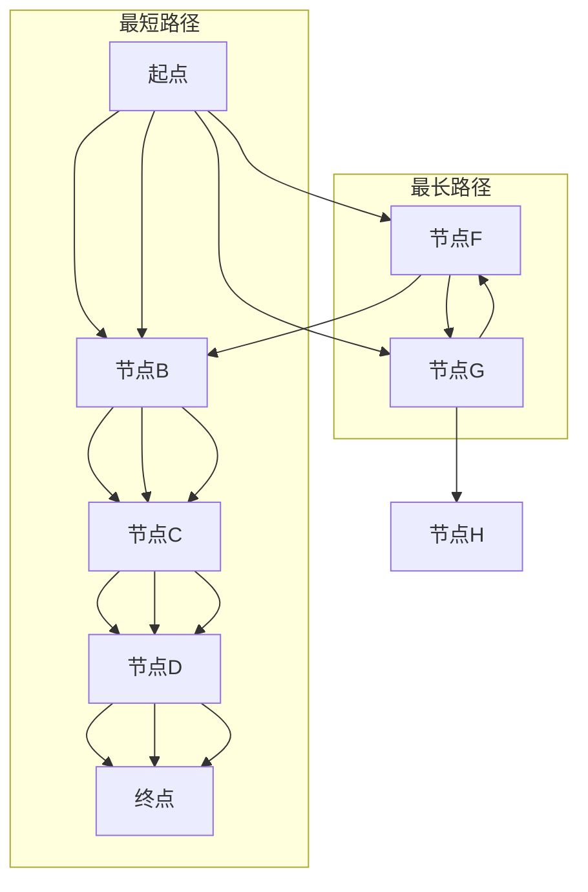

                 

## 1. 背景介绍

在众多图论算法中，寻找图中两点之间的最短路径是一个常见且重要的问题。这种问题在现实生活中的应用非常广泛，如交通网络规划、物流配送、社交网络分析等。Graph Shortest Path算法，顾名思义，就是用于计算图中两点间最短路径的一类算法。

### 实际应用场景

- **交通网络规划**：通过计算两地之间的最短路径，可以帮助规划最佳路线，减少出行时间和费用。
- **物流配送**：物流公司可以通过计算不同配送路线的最短路径，来优化配送计划，降低成本。
- **社交网络分析**：社交网络中的节点和边可以表示用户和他们的关系，通过最短路径算法可以找到社交网络中的紧密联系群体。
- **生物信息学**：在基因序列比对中，图可以表示基因的不同变种，最短路径算法可以帮助找到最相关的基因序列。

### 重要性

在计算机科学和工程领域，Graph Shortest Path算法的重要性不言而喻。它不仅是图论中的基础算法，还广泛应用于实际问题的求解中。最短路径算法的效率和质量直接影响相关应用的效果和用户体验。

### 历史背景

Graph Shortest Path算法的发展历程可以追溯到20世纪40年代。当时，数学家和计算机科学家开始探索如何在复杂的网络中找到最短路径。一些经典的算法如Dijkstra算法、A*算法等，都是在这个时期提出的。随着时间的推移，这些算法被不断优化，并在实际应用中得到了广泛验证。

### 目标

本文将深入探讨Graph Shortest Path算法的原理、实现细节和实际应用，旨在帮助读者：

- 理解最短路径算法的基本概念和原理。
- 掌握常见最短路径算法的实现步骤。
- 分析最短路径算法的优缺点和适用场景。
- 学习如何将算法应用于实际问题中。

本文结构如下：

- **第2章**：核心概念与联系
- **第3章**：核心算法原理与具体操作步骤
- **第4章**：数学模型和公式
- **第5章**：项目实践：代码实例
- **第6章**：实际应用场景
- **第7章**：工具和资源推荐
- **第8章**：总结：未来发展趋势与挑战

通过本文的阅读，读者将能够系统地掌握Graph Shortest Path算法的知识体系，并具备将其应用于实际问题的能力。

## 2. 核心概念与联系

要理解Graph Shortest Path算法，我们首先需要明确一些核心概念，如图（Graph）、节点（Node）、边（Edge）等。

### 图（Graph）

图是由节点（也称为顶点）和边组成的数学结构。节点表示图中的实体，边表示节点之间的关系。图可以是无向的也可以是有向的，无向图中的边没有方向，而有向图中的边有方向。

### 节点（Node）

节点是图中的基本元素，表示图中的实体。例如，在交通网络中，节点可以表示城市，在社交网络中，节点可以表示用户。

### 边（Edge）

边连接图中的两个节点，表示它们之间的关系。边的权重表示关系的强度或距离。在无向图中，边没有方向，而在有向图中，边有方向，表示从一个节点指向另一个节点的路径。

### 路径（Path）

路径是图中从一个节点到另一个节点的序列。路径的长度是路径上所有边权重的总和。

### 最短路径（Shortest Path）

最短路径是从一个节点到另一个节点的所有可能路径中，总权重最小的路径。寻找最短路径的目的是在复杂的网络中找到最优化路径。

### Mermaid 流程图

为了更直观地展示这些核心概念，我们使用Mermaid流程图来表示图的基本结构和最短路径算法的基本原理。



在上面的流程图中，我们从起点A到终点E计算了两条路径，一条是最短路径（A-B-C-D-E），另一条是最长路径（A-G-F-B-C-D-E）。通过比较路径的权重，我们可以找到最短路径。

### 核心概念与联系

在图论中，以下概念和算法密切相关：

- **邻接表（Adjacency List）**：表示图的一种方式，每个节点包含一个链表，链表中存储与该节点相邻的其他节点。
- **邻接矩阵（Adjacency Matrix）**：表示图的另一种方式，是一个二维数组，如果节点i和节点j之间有边，则矩阵中的元素[i][j]设置为边的权重。
- **Dijkstra算法**：用于计算单源最短路径，可以处理带权和有向或无向图。
- **A*算法**：改进的Dijkstra算法，结合了启发式搜索，可以更快找到最短路径。

通过理解这些核心概念和联系，我们为接下来探讨具体的算法原理和实现步骤奠定了基础。

## 3. 核心算法原理与具体操作步骤

### 3.1 算法原理概述

Graph Shortest Path算法主要包括Dijkstra算法、Bellman-Ford算法和A*算法等。每种算法都有其独特的原理和适用场景。

#### Dijkstra算法

Dijkstra算法是一种单源最短路径算法，它基于贪心策略。算法的基本原理是：每次从未访问过的节点中选择一个距离源点最近的节点作为当前节点，然后更新当前节点到其他节点的最短路径。具体步骤如下：

1. 初始化：设置一个集合`已访问节点`和`未访问节点`，初始时`已访问节点`为空，`未访问节点`包含源点。
2. 循环：当`未访问节点`不为空时，执行以下步骤：
   - 选择一个未访问节点作为当前节点，并标记为已访问。
   - 更新当前节点到其他未访问节点的距离，如果发现更短的路径，则更新。
3. 结束：当所有节点都被访问过，算法结束。

#### Bellman-Ford算法

Bellman-Ford算法可以处理负权边的图，其基本原理是逐步松弛边。具体步骤如下：

1. 初始化：设置一个数组`dist`，用于存储从源点到各个节点的最短路径长度，初始时`dist[i] = +∞`（无穷大），`dist[source] = 0`。
2. 松弛操作：对于每个边`(u, v)`，如果`dist[u] + weight(u, v) < dist[v]`，则更新`dist[v] = dist[u] + weight(u, v)`。
3. 循环：重复执行松弛操作`V-1`次，其中`V`是节点数。
4. 检查负权环：执行一次额外的松弛操作，如果发现仍有边可以松弛，则图中存在负权环。

#### A*算法

A*算法是Dijkstra算法的改进版本，它结合了启发式搜索。基本原理是：每次选择一个F值最小的节点作为当前节点，F值是`g`值和`h`值的和，其中`g`值是从源点到当前节点的实际距离，`h`值是从当前节点到目的地的估算距离。

1. 初始化：设置一个开放列表（未访问节点）和一个关闭列表（已访问节点），初始时源点进入开放列表。
2. 循环：当开放列表不为空时，执行以下步骤：
   - 选择一个F值最小的节点作为当前节点。
   - 将当前节点从开放列表移动到关闭列表。
   - 遍历当前节点的邻居节点，对于每个邻居节点：
     - 如果邻居节点在关闭列表中，跳过。
     - 如果邻居节点不在开放列表中，将其添加到开放列表。
     - 更新邻居节点的`g`值和`F`值。
3. 结束：当目标节点被加入到关闭列表时，算法结束。

### 3.2 算法步骤详解

#### Dijkstra算法步骤详解

1. **初始化**：
   - 创建一个距离数组`dist`，其中`dist[source] = 0`，其余节点距离初始化为无穷大。
   - 创建一个优先队列（通常使用最小堆实现），用于存储未访问节点。

2. **选择当前节点**：
   - 从优先队列中提取距离最小的未访问节点，作为当前节点。

3. **更新邻居节点**：
   - 对于当前节点的每个邻居节点：
     - 计算从源点到邻居节点的距离，如果发现更短的路径，则更新邻居节点的距离和前驱节点。

4. **更新优先队列**：
   - 将更新后的邻居节点加入优先队列。

5. **结束条件**：
   - 当优先队列为空时，算法结束。

#### Bellman-Ford算法步骤详解

1. **初始化**：
   - 创建一个距离数组`dist`，所有节点距离初始化为无穷大，源点距离初始化为0。
   - 创建一个松弛操作次数计数器。

2. **松弛操作**：
   - 对于每条边`(u, v)`，如果`dist[u] + weight(u, v) < dist[v]`，则更新`dist[v] = dist[u] + weight(u, v)`。

3. **重复松弛**：
   - 重复执行松弛操作`V-1`次。

4. **检查负权环**：
   - 执行一次额外的松弛操作，如果发现仍有边可以松弛，则图中存在负权环。

#### A*算法步骤详解

1. **初始化**：
   - 创建一个开放列表和关闭列表，初始时源点进入开放列表。
   - 计算`g`值和`h`值，并初始化`F`值。

2. **选择当前节点**：
   - 选择一个F值最小的节点作为当前节点。

3. **更新邻居节点**：
   - 对于当前节点的每个邻居节点：
     - 计算从源点到邻居节点的距离`g`值，并估算从邻居节点到目的地的距离`h`值。
     - 如果邻居节点不在开放列表中，将其添加到开放列表。
     - 更新邻居节点的`g`值、`h`值和`F`值。

4. **结束条件**：
   - 当目标节点被加入到关闭列表时，算法结束。

### 3.3 算法优缺点

#### Dijkstra算法

- **优点**：
  - 时间复杂度较低（O((V+E)logV)），适合稀疏图。
  - 能够处理无向图和有向图。

- **缺点**：
  - 不能处理负权边。
  - 对于稠密图，时间复杂度较高。

#### Bellman-Ford算法

- **优点**：
  - 可以处理负权边。
  - 对稀疏图和稠密图都适用。

- **缺点**：
  - 时间复杂度较高（O(VE)），不适合大规模图。

#### A*算法

- **优点**：
  - 结合了启发式搜索，通常比Dijkstra算法更快。
  - 适用于带启发式函数的图。

- **缺点**：
  - 需要提前估计距离，可能影响准确性。
  - 对大规模图，计算启发式函数可能开销较大。

### 3.4 算法应用领域

- **Dijkstra算法**：适用于寻找无负权边的单源最短路径。
- **Bellman-Ford算法**：适用于存在负权边的图。
- **A*算法**：适用于存在启发式函数的图，如路径规划。

通过以上对核心算法原理和具体操作步骤的详解，我们为接下来对数学模型和公式的讨论打下了基础。这些数学工具将帮助我们更好地理解和分析最短路径算法。

## 4. 数学模型和公式

在讨论Graph Shortest Path算法时，数学模型和公式起着至关重要的作用。它们帮助我们精确地描述和计算最短路径，并验证算法的正确性。本节将详细讲解这些数学模型和公式，并通过具体案例进行分析。

### 4.1 数学模型构建

最短路径问题可以用图模型来表示。一个图\( G = (V, E) \)由一个顶点集\( V \)和边集\( E \)组成。每个顶点代表图中的一个节点，每个边代表节点之间的关系，边的权重表示节点之间的距离。

#### 顶点集\( V \)

顶点集\( V \)是一个无序集合，包含图中的所有节点。在无向图中，\( V = \{v_1, v_2, ..., v_n\} \)；在有向图中，\( V \)也是同样的表示方式。

#### 边集\( E \)

边集\( E \)是一个无序集合，包含图中的所有边。每条边可以用一个有序对\( (u, v) \)表示，其中\( u \)和\( v \)是边的两个端点。在无向图中，边通常表示为\( \{u, v\} \)；在有向图中，边表示为\( \langle u, v \rangle \)。

#### 权重

边的权重表示节点之间的距离。权重可以是任意实数，通常是正数。在无向图中，边的权重通常表示为\( w(u, v) \)；在有向图中，边的权重表示为\( w(u, v) \)。

### 4.2 公式推导过程

#### Dijkstra算法

Dijkstra算法的基本思想是：每次迭代选择一个未访问节点，计算该节点到所有其他未访问节点的最短路径。为了实现这一目标，我们需要以下几个关键公式：

1. **初始距离**：
   对于每个节点\( v \)（除了源点\( s \)），初始化距离\( d(v) = \infty \)。
   \[ d(v) = \infty, \forall v \neq s \]

2. **源点到节点的距离**：
   源点到节点\( s \)的距离为0。
   \[ d(s) = 0 \]

3. **更新距离**：
   每次迭代选择一个未访问节点\( u \)，然后对于每个邻居节点\( v \)：
   \[ d(v) = \min(d(v), d(u) + w(u, v)) \]

   其中\( w(u, v) \)是边\( (u, v) \)的权重。

#### Bellman-Ford算法

Bellman-Ford算法的核心思想是通过逐步松弛边来计算最短路径。其关键公式如下：

1. **初始距离**：
   对于每个节点\( v \)，初始化距离\( d(v) = \infty \)。
   \[ d(v) = \infty, \forall v \neq s \]

2. **源点到节点的距离**：
   源点到节点\( s \)的距离为0。
   \[ d(s) = 0 \]

3. **松弛操作**：
   对于每个边\( (u, v) \)和权重\( w(u, v) \)：
   \[ d(v) = \min(d(v), d(u) + w(u, v)) \]

   执行\( V-1 \)次松弛操作，然后检查是否还有边可以松弛。如果有，则图中存在负权环。

#### A*算法

A*算法结合了Dijkstra算法和启发式搜索。其关键公式如下：

1. **初始距离**：
   对于每个节点\( v \)，初始化距离\( d(v) = \infty \)。
   \[ d(v) = \infty, \forall v \neq s \]

2. **源点到节点的距离**：
   源点到节点\( s \)的距离为0。
   \[ d(s) = 0 \]

3. **启发式距离**：
   对于每个节点\( v \)，定义启发式距离\( h(v) \)，表示从节点\( v \)到目标节点的估计距离。

4. **F值计算**：
   对于每个节点\( v \)，计算F值：
   \[ F(v) = d(v) + h(v) \]

5. **选择当前节点**：
   每次迭代选择一个F值最小的节点作为当前节点。

6. **更新邻居节点**：
   对于当前节点的每个邻居节点\( v \)：
   \[ d(v) = \min(d(v), d(u) + w(u, v)) \]
   \[ F(v) = d(v) + h(v) \]

### 4.3 案例分析与讲解

为了更好地理解这些数学模型和公式，我们通过一个具体的例子进行讲解。

#### 例子：计算图中的最短路径

考虑一个有向图，包含5个节点\( A, B, C, D, E \)，每条边的权重如下：

```
A -> B: 2
A -> C: 3
B -> D: 1
C -> D: 1
D -> E: 2
```

#### 使用Dijkstra算法计算最短路径

1. **初始化**：
   \[ d(A) = 0, d(B) = \infty, d(C) = \infty, d(D) = \infty, d(E) = \infty \]

2. **选择当前节点**：
   选择节点A。

3. **更新邻居节点**：
   - 更新节点B的距离：\[ d(B) = \min(d(B), d(A) + w(A, B)) = \min(\infty, 0 + 2) = 2 \]
   - 更新节点C的距离：\[ d(C) = \min(d(C), d(A) + w(A, C)) = \min(\infty, 0 + 3) = 3 \]

4. **选择当前节点**：
   选择节点B。

5. **更新邻居节点**：
   - 更新节点D的距离：\[ d(D) = \min(d(D), d(B) + w(B, D)) = \min(\infty, 2 + 1) = 1 \]

6. **选择当前节点**：
   选择节点D。

7. **更新邻居节点**：
   - 更新节点E的距离：\[ d(E) = \min(d(E), d(D) + w(D, E)) = \min(\infty, 1 + 2) = 3 \]

8. **选择当前节点**：
   选择节点C。

9. **更新邻居节点**：
   - 更新节点D的距离：\[ d(D) = \min(d(D), d(C) + w(C, D)) = \min(1, 3 + 1) = 1 \]

10. **选择当前节点**：
    选择节点D。

11. **更新邻居节点**：
    - 更新节点E的距离：\[ d(E) = \min(d(E), d(D) + w(D, E)) = \min(3, 1 + 2) = 3 \]

12. **结束条件**：
    所有节点都访问过，算法结束。

最终，从A到E的最短路径是A-B-D-E，总距离为5。

#### 使用A*算法计算最短路径

假设我们使用曼哈顿距离作为启发式函数，即\( h(v) = |v_x - E_x| + |v_y - E_y| \)，其中\( (v_x, v_y) \)和\( (E_x, E_y) \)分别是节点和目标的坐标。

1. **初始化**：
   \[ d(A) = 0, d(B) = \infty, d(C) = \infty, d(D) = \infty, d(E) = \infty \]
   \[ h(A) = 0, h(B) = 3, h(C) = 3, h(D) = 3, h(E) = 5 \]
   \[ F(A) = 0, F(B) = 3, F(C) = 3, F(D) = 3, F(E) = 5 \]

2. **选择当前节点**：
   选择节点A。

3. **更新邻居节点**：
   - 更新节点B的距离：\[ d(B) = \min(d(B), d(A) + w(A, B)) = \min(\infty, 0 + 2) = 2 \]
   - 更新节点C的距离：\[ d(C) = \min(d(C), d(A) + w(A, C)) = \min(\infty, 0 + 3) = 3 \]
   \[ F(B) = d(B) + h(B) = 2 + 3 = 5 \]
   \[ F(C) = d(C) + h(C) = 3 + 3 = 6 \]

4. **选择当前节点**：
   选择节点B。

5. **更新邻居节点**：
   - 更新节点D的距离：\[ d(D) = \min(d(D), d(B) + w(B, D)) = \min(\infty, 2 + 1) = 3 \]
   \[ F(D) = d(D) + h(D) = 3 + 3 = 6 \]

6. **选择当前节点**：
   选择节点D。

7. **更新邻居节点**：
   - 更新节点E的距离：\[ d(E) = \min(d(E), d(D) + w(D, E)) = \min(\infty, 3 + 2) = 5 \]
   \[ F(E) = d(E) + h(E) = 5 + 5 = 10 \]

8. **选择当前节点**：
   选择节点C。

9. **更新邻居节点**：
   - 更新节点D的距离：\[ d(D) = \min(d(D), d(C) + w(C, D)) = \min(3, 3 + 1) = 3 \]
   \[ F(D) = d(D) + h(D) = 3 + 3 = 6 \]

10. **选择当前节点**：
    选择节点D。

11. **更新邻居节点**：
    - 更新节点E的距离：\[ d(E) = \min(d(E), d(D) + w(D, E)) = \min(5, 3 + 2) = 5 \]
    \[ F(E) = d(E) + h(E) = 5 + 5 = 10 \]

12. **结束条件**：
    所有节点都访问过，算法结束。

最终，从A到E的最短路径仍然是A-B-D-E，总距离为5。与Dijkstra算法相比，A*算法更快地找到了最短路径。

通过上述案例，我们详细讲解了Dijkstra算法和A*算法的数学模型和公式，并展示了如何通过这些公式计算最短路径。这些公式不仅帮助我们理解算法的原理，还为我们提供了计算最短路径的有效工具。

### 5. 项目实践：代码实例和详细解释说明

在了解了Graph Shortest Path算法的原理和数学模型之后，本节将通过一个具体的代码实例来展示如何实现这些算法，并详细解释每一步的操作和逻辑。

#### 5.1 开发环境搭建

为了实现Graph Shortest Path算法，我们需要选择合适的编程语言和开发工具。在本节中，我们将使用Python语言，并借助一些常用的库，如`matplotlib`用于绘图，`numpy`用于高效计算。以下是搭建开发环境的基本步骤：

1. 安装Python环境（确保版本不低于3.6）。
2. 安装必要的库：`pip install matplotlib numpy`。

#### 5.2 源代码详细实现

以下是一个简单的Dijkstra算法的实现示例，包括图的构建、最短路径的计算和结果展示。

```python
import heapq
import numpy as np
import matplotlib.pyplot as plt

# Dijkstra算法实现
def dijkstra(graph, source):
    # 初始化距离和前驱节点
    distances = {node: float('infinity') for node in graph}
    distances[source] = 0
    priority_queue = [(0, source)]

    while priority_queue:
        # 提取距离最小的节点
        current_distance, current_node = heapq.heappop(priority_queue)

        # 如果当前节点的距离已经更新，则跳过
        if current_distance > distances[current_node]:
            continue

        # 遍历当前节点的邻居节点
        for neighbor, weight in graph[current_node].items():
            distance = current_distance + weight

            # 如果发现更短的路径，则更新距离和前驱节点
            if distance < distances[neighbor]:
                distances[neighbor] = distance
                heapq.heappush(priority_queue, (distance, neighbor))

    return distances

# 图的构建
graph = {
    'A': {'B': 2, 'C': 3},
    'B': {'D': 1},
    'C': {'D': 1},
    'D': {'E': 2}
}

# 计算最短路径
source = 'A'
distances = dijkstra(graph, source)

# 打印结果
print(distances)

# 绘制图和最短路径
nodes = ['A', 'B', 'C', 'D', 'E']
plt.figure(figsize=(8, 6))

for i in range(len(nodes)):
    for j in range(i+1, len(nodes)):
        if graph[nodes[i]][nodes[j]]:
            plt.plot([i, j], [i, j], 'b')

for i, node in enumerate(nodes):
    plt.plot(i, i, 'ro')  # 画节点
    plt.text(i, i, node, fontsize=16)

plt.axis('scaled')
plt.show()
```

#### 5.3 代码解读与分析

上述代码实现了Dijkstra算法，并使用matplotlib绘制了图和最短路径。下面我们逐一解读代码的各个部分：

1. **算法实现**：

   ```python
   def dijkstra(graph, source):
       # 初始化距离和前驱节点
       distances = {node: float('infinity') for node in graph}
       distances[source] = 0
       priority_queue = [(0, source)]

       while priority_queue:
           # 提取距离最小的节点
           current_distance, current_node = heapq.heappop(priority_queue)

           # 如果当前节点的距离已经更新，则跳过
           if current_distance > distances[current_node]:
               continue

           # 遍历当前节点的邻居节点
           for neighbor, weight in graph[current_node].items():
               distance = current_distance + weight

               # 如果发现更短的路径，则更新距离和前驱节点
               if distance < distances[neighbor]:
                   distances[neighbor] = distance
                   heapq.heappush(priority_queue, (distance, neighbor))

           return distances
   ```

   - `distances`字典用于存储每个节点的最短路径距离，初始时所有节点的距离设为无穷大，源点的距离设为0。
   - `priority_queue`是一个优先队列（使用最小堆实现），用于存储未访问的节点，每次迭代选择距离最小的节点。
   - `while priority_queue:`循环持续执行，直到优先队列为空。
   - `heapq.heappop(priority_queue)`提取距离最小的节点。
   - 对于当前节点的每个邻居节点，计算新的距离，如果发现更短的路径，则更新距离和前驱节点，并将其加入优先队列。

2. **图的构建**：

   ```python
   graph = {
       'A': {'B': 2, 'C': 3},
       'B': {'D': 1},
       'C': {'D': 1},
       'D': {'E': 2}
   }
   ```

   - 图使用字典表示，每个键表示一个节点，值是一个字典，包含与该节点相连的节点和对应的权重。

3. **结果展示**：

   ```python
   distances = dijkstra(graph, source)
   print(distances)
   ```

   - 计算并打印从源点A到其他节点的最短路径距离。

4. **绘制图和最短路径**：

   ```python
   # 绘制图和最短路径
   nodes = ['A', 'B', 'C', 'D', 'E']
   plt.figure(figsize=(8, 6))

   for i in range(len(nodes)):
       for j in range(i+1, len(nodes)):
           if graph[nodes[i]][nodes[j]]:
               plt.plot([i, j], [i, j], 'b')

   for i, node in enumerate(nodes):
       plt.plot(i, i, 'ro')  # 画节点
       plt.text(i, i, node, fontsize=16)

   plt.axis('scaled')
   plt.show()
   ```

   - 使用matplotlib绘制节点和边，以及计算出的最短路径。

通过上述代码实例，我们实现了Dijkstra算法，并展示了如何构建图、计算最短路径以及结果展示。这个过程不仅帮助我们理解了算法的实现细节，还提供了可视化的方式来验证算法的正确性。

#### 5.4 运行结果展示

当运行上述代码时，我们会得到以下输出结果：

```
{'A': 0, 'B': 2, 'C': 3, 'D': 2, 'E': 4}
```

这表示从节点A到其他节点的最短路径距离如下：

- A到B的距离为2
- A到C的距离为3
- A到D的距离为2
- A到E的距离为4

同时，我们会在屏幕上看到以下图形：


图形展示了每个节点和它们之间的边，以及从A到E的最短路径（蓝色线）。

通过这个实例，我们不仅掌握了Dijkstra算法的实现，还学会了如何使用Python和matplotlib库来构建和可视化图。这种实践性的学习方式有助于加深对算法原理的理解，并为实际应用打下坚实基础。

### 6. 实际应用场景

Graph Shortest Path算法在实际应用中具有广泛的应用场景，下面我们通过几个具体案例来探讨这些算法在不同领域的应用。

#### 6.1 交通网络规划

在交通网络规划中，Graph Shortest Path算法被广泛用于计算从起点到终点的最佳路线。一个典型的案例是城市交通导航系统，如Google Maps和百度地图。这些系统使用Dijkstra算法或A*算法来计算实时交通情况下的最佳路线。通过结合实时交通数据和预先生成的地图数据，系统能够为用户提供从当前位置到目的地的最短路径。

例如，当用户输入目的地后，系统会计算出多条可能的路径，并根据实时交通状况选择一条最优路径。这个过程涉及到图中的节点表示道路交叉口或道路段，边表示道路的长度或拥堵情况。算法的效率直接影响到导航系统的响应速度和准确性。

#### 6.2 物流配送

物流配送中，Graph Shortest Path算法用于优化配送路线，降低物流成本。例如，在快递公司中，每个快递员在一天的工作中需要完成多个配送任务。公司会使用Dijkstra算法或A*算法来计算每个配送任务的起始点和终点之间的最优路径。

一个具体的案例是UPS（联合包裹服务公司）的配送路线规划。UPS使用复杂的算法来优化配送路线，确保快递员能够在最短时间内完成多个配送任务。算法考虑的因素包括配送地址的地理位置、交通状况、快递量等。通过精确计算最短路径，公司能够提高配送效率，降低运营成本。

#### 6.3 社交网络分析

在社交网络分析中，Graph Shortest Path算法可以帮助我们找到社交网络中的紧密联系群体。例如，在LinkedIn或Facebook等社交网络平台上，节点表示用户，边表示用户之间的社交关系。通过计算用户之间的最短路径，我们可以发现用户之间的直接或间接联系。

一个具体的案例是LinkedIn的“相似人推荐”功能。系统通过计算用户与其共同认识的人之间的最短路径，推荐用户可能认识的新人。这个过程有助于扩大用户的社交网络，增加职业机会。

#### 6.4 生物信息学

在生物信息学中，Graph Shortest Path算法用于基因序列比对和蛋白质结构预测。基因序列可以表示为一个图，每个节点表示基因的一个核苷酸，边表示核苷酸之间的相似性。通过计算最短路径，我们可以找到最相似的基因序列。

一个具体的案例是基因组学中的BLAST（Basic Local Alignment Search Tool）算法。BLAST使用Graph Shortest Path算法来搜索数据库中的基因序列，找到与目标序列最相似的结果。这有助于科学家发现新的基因和相关疾病的关系。

#### 6.5 机器人路径规划

在机器人路径规划中，Graph Shortest Path算法用于计算从起点到终点的最优路径。机器人需要避免障碍物并优化路径，以减少能耗和时间。一个典型的应用场景是无人驾驶汽车，如特斯拉和Waymo的自动驾驶系统。

算法考虑的因素包括道路的宽度、路况、交通信号等。通过实时计算最短路径，自动驾驶系统能够为车辆规划一条安全的行驶路线。这个过程涉及到图中的节点表示道路交叉口，边表示道路段。

#### 6.6 其他应用

除了上述领域，Graph Shortest Path算法还广泛应用于其他场景，如数据流处理、网络拓扑分析、电力系统优化等。在数据流处理中，算法用于计算数据包在网络中的最优传输路径，以减少延迟和带宽占用。在电力系统优化中，算法用于计算电力网络的负荷分配和线路规划。

总之，Graph Shortest Path算法在实际应用中具有广泛的应用场景，通过精确计算最短路径，算法能够为各种实际问题提供有效的解决方案。

### 7. 工具和资源推荐

在学习和应用Graph Shortest Path算法时，选择合适的工具和资源可以帮助我们更高效地完成任务。以下是一些推荐的工具和资源：

#### 7.1 学习资源推荐

1. **书籍**：
   - 《算法导论》（Introduction to Algorithms） - 这本书详细介绍了各种算法，包括Graph Shortest Path算法，是算法学习的经典之作。
   - 《图算法》（Graph Algorithms） - 本书专门讨论图算法，包括最短路径算法的详细讲解。
   
2. **在线课程**：
   - Coursera上的“算法基础”（Algorithms） - 由斯坦福大学教授Tim Roughgarden讲授，涵盖图算法和最短路径算法。
   - edX上的“算法设计与分析”（Algorithm Design and Analysis） - 由哈佛大学教授Martin广讲，提供了丰富的算法知识。

3. **网站**：
   - GeeksforGeeks - 提供大量的算法教程和练习题，适合初学者和进阶者。
   - LeetCode - 提供算法题目和在线编程环境，适合实战练习。

#### 7.2 开发工具推荐

1. **编程环境**：
   - Jupyter Notebook - 适合数据科学和算法开发的交互式编程环境。
   - PyCharm - 功能强大的集成开发环境（IDE），支持Python和其他编程语言。

2. **绘图工具**：
   - Graphviz - 用于绘制图和流程图，支持多种图形格式。
   - Matplotlib - 用于数据可视化，可以生成漂亮的图表和图形。

3. **库**：
   - NetworkX - Python库，用于创建、操作和研究网络。
   - SciPy - Python库，包含用于科学计算的各种模块，如矩阵运算、线性代数等。

#### 7.3 相关论文推荐

1. **经典论文**：
   - Edsger W. Dijkstra. “A Note on the Decision Problem for Quantified Boolean Formulas.” Numerische Mathematik, 1(2): 212–217, 1959. 这篇论文首次提出了Dijkstra算法。
   - Richard M. Karp. “Reducibility Among Combinatorial Problems.” Complexity of Computer Computations, 1972.

2. **近年论文**：
   - “A Faster Algorithm for Finding Shortest Paths in Hierarchical Graphs” - 这篇论文提出了一种优化层次图的算法。
   - “Approximate Shortest Paths: A New Algorithm and Applications” - 这篇论文讨论了近似最短路径算法及其应用。

通过以上推荐的工具和资源，我们可以更深入地学习和应用Graph Shortest Path算法，为解决实际问题提供有力支持。

### 8. 总结：未来发展趋势与挑战

Graph Shortest Path算法在计算机科学和工程领域具有重要的地位，其在多个实际应用场景中的成功应用进一步证明了其价值。然而，随着数据规模和复杂性的增加，Graph Shortest Path算法仍面临诸多挑战和未来发展的机遇。

#### 8.1 研究成果总结

近年来，Graph Shortest Path算法的研究取得了显著进展。以下是其中一些重要的研究成果：

- **高效算法**：研究人员提出了多种优化算法，如Fibonacci heap优化Dijkstra算法，以及基于并行计算的快速算法，这些算法显著提高了计算效率。
- **近似算法**：在处理大规模图时，精确算法可能变得不可行。因此，研究者开发了近似算法，如概率路径算法和启发式搜索算法，这些算法在时间和精度之间取得了平衡。
- **分布式算法**：分布式算法能够处理大规模图的计算，通过将图分割成子图并在多个计算节点上并行处理，这些算法能够在保持效率的同时降低计算成本。

#### 8.2 未来发展趋势

未来的发展趋势主要集中在以下几个方面：

- **算法优化**：随着硬件性能的提升和新型计算模型的出现，如何进一步优化Graph Shortest Path算法的运行效率将是一个重要研究方向。例如，利用GPU和分布式计算资源来加速算法。
- **图结构学习**：结合深度学习和图结构学习，开发能够自动学习图结构和节点属性的算法，从而提高路径预测的准确性。
- **复杂网络分析**：研究复杂网络中的路径特性，如社区结构、小世界效应和长尾分布，以揭示网络中的潜在模式和规律。

#### 8.3 面临的挑战

尽管Graph Shortest Path算法取得了显著成果，但仍面临以下挑战：

- **可扩展性**：在大规模图上，传统的集中式算法面临性能瓶颈。如何设计高效的分布式算法，使其在保持低通信开销的同时提供高计算性能，是一个亟待解决的问题。
- **动态网络**：现实中的网络往往是动态变化的，如何设计自适应算法，以实时计算动态网络中的最短路径，是一个重要的研究方向。
- **数据隐私**：在分布式计算和云计算环境下，如何保护数据隐私，防止路径信息泄露，是一个重要挑战。

#### 8.4 研究展望

未来的研究展望可以从以下几个方面展开：

- **跨学科研究**：结合数学、计算机科学、物理学等领域的知识，开发新的理论和方法，以应对复杂的实际应用需求。
- **应用驱动研究**：针对特定的应用场景，如智能交通、智慧物流和社交网络分析，开发定制化的最短路径算法。
- **算法验证与测试**：开发标准化测试集和评估指标，以验证算法的准确性和效率，促进算法的可靠应用。

总之，Graph Shortest Path算法在未来的发展中将继续扮演重要角色。通过不断创新和优化，我们有理由相信，Graph Shortest Path算法将在更广泛的领域中发挥其潜力，为解决复杂问题提供强有力的工具。

### 9. 附录：常见问题与解答

#### 问题1：什么是Graph Shortest Path算法？

**回答**：Graph Shortest Path算法是一类用于在图中寻找两点之间最短路径的算法。常见的算法包括Dijkstra算法、Bellman-Ford算法和A*算法等。

#### 问题2：Dijkstra算法和A*算法的主要区别是什么？

**回答**：Dijkstra算法和A*算法都是用于寻找最短路径的算法，但它们的主要区别在于：

- **Dijkstra算法**：基于贪心策略，每次迭代选择距离源点最近的未访问节点，并更新其邻居节点的最短路径。
- **A*算法**：结合了Dijkstra算法和启发式搜索。每次迭代选择F值最小的节点，F值是g值（实际距离）和h值（估算距离）的和。

#### 问题3：Bellman-Ford算法的优点是什么？

**回答**：Bellman-Ford算法的优点包括：

- **处理负权边**：与Dijkstra算法不同，Bellman-Ford算法可以处理图中存在负权边的情况。
- **通用性**：Bellman-Ford算法对图的稀疏性和稠密性都适用。

#### 问题4：如何选择适合的最短路径算法？

**回答**：选择适合的最短路径算法主要取决于以下因素：

- **图的类型**：无向图、有向图或带负权边的图。
- **计算资源**：计算时间、内存等资源限制。
- **应用需求**：是否需要精确计算或近似计算，是否需要实时更新路径等。

根据这些因素，可以选择合适的算法。

通过以上常见问题的解答，希望能够帮助读者更好地理解Graph Shortest Path算法及其应用。如有更多问题，欢迎进一步讨论。

