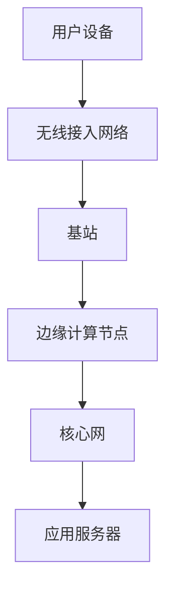

                 

关键词：5G技术、技术创业者、创新机遇、网络基础设施、市场前景、技术挑战、未来展望

> 摘要：本文深入探讨了5G技术的崛起如何为技术创业者带来了前所未有的机遇与挑战。通过分析5G网络的特点和优势，本文探讨了技术创业者可以抓住的市场机会，并探讨了在实现这些机会的过程中可能面临的技术障碍和策略。

## 1. 背景介绍

随着信息技术的迅猛发展，移动通信技术已经历了几次重大的变革。从1G模拟通信到2G数字通信，再到3G和4G的高速数据传输，每一次技术的进步都极大地推动了移动互联网的发展。然而，随着人们对数据传输速度、网络延迟和设备连接数量的需求不断增长，4G技术逐渐显露出其局限性。

为了满足这些日益增长的需求，5G技术应运而生。5G（第五代移动通信技术）在频谱效率、数据传输速度、网络延迟、设备连接数量和能效方面均实现了显著提升。5G网络的预期峰值下载速度可以达到20Gbps，比4G快100倍以上，同时可以实现毫秒级的网络延迟。

5G技术的这些特点使其在许多领域具有巨大的应用潜力，从智能家居到工业物联网（IIoT）、从自动驾驶汽车到虚拟现实（VR），5G将能够支持各种高带宽、低延迟的应用场景。因此，对于技术创业者来说，5G不仅是一个技术趋势，更是一个充满机遇的商业契机。

## 2. 核心概念与联系

### 2.1 5G网络的核心概念

5G网络的核心概念包括以下几个关键要素：

- **高速率**：5G网络的设计目标之一是实现更高的数据传输速率。这意味着用户可以在短时间内传输大量的数据，这对于高清视频流、虚拟现实和增强现实应用至关重要。

- **低延迟**：5G网络通过减少数据传输的延迟，提高了网络的实时响应能力。这对于自动驾驶、远程医疗和在线游戏等对延迟敏感的应用场景尤为重要。

- **高密度连接**：5G网络能够支持更多的设备同时连接到网络，这对于物联网应用中的大量设备连接非常重要。

- **网络切片**：5G网络引入了网络切片技术，允许运营商根据不同的应用需求，为不同的用户或服务提供定制化的网络资源。

- **边缘计算**：5G网络与边缘计算结合，可以在网络边缘处理数据，减少数据传输的延迟，提高系统的响应速度。

### 2.2 5G网络架构

5G网络的架构包括以下几个主要组成部分：

- **基站**：5G基站是网络的核心，负责无线信号的传输和接收。与4G相比，5G基站具有更高的密度，以支持更高的数据传输速率和更低的延迟。

- **核心网**：5G核心网是5G网络的神经中枢，负责处理数据传输、连接管理和网络资源分配。

- **无线接入网络**：包括基站和终端设备，如智能手机、平板电脑和物联网设备。

- **边缘计算节点**：分布在网络边缘，用于处理本地数据，降低延迟，提高系统的响应速度。

### 2.3 Mermaid流程图

以下是一个简化的5G网络架构的Mermaid流程图：



在这个流程图中，用户设备通过无线接入网络与基站连接，基站通过边缘计算节点与核心网交互，最终访问应用服务器。

## 3. 核心算法原理 & 具体操作步骤

### 3.1 算法原理概述

5G网络的核心算法主要涉及以下几个方面：

- **多连接传输**：通过在同一信道上同时传输多个数据流，提高网络带宽利用率。
- **MIMO（多输入多输出）技术**：利用多个天线发送和接收信号，提高数据传输速率和可靠性。
- **波束成形**：通过调整天线阵列的方向，将信号聚焦到目标用户，提高信号传输质量。
- **网络编码**：在网络层对多个数据流进行编码，提高网络的吞吐量和可靠性。

### 3.2 算法步骤详解

#### 3.2.1 多连接传输

1. **用户设备发送请求**：用户设备通过无线接入网络向基站发送连接请求。
2. **基站分配资源**：基站根据网络状况和用户需求，为用户设备分配不同的信道和传输资源。
3. **数据传输**：用户设备通过分配的信道，同时传输多个数据流到基站。

#### 3.2.2 MIMO技术

1. **基站发送信号**：基站利用多个天线发送信号，每个信号包含不同的信息。
2. **用户设备接收信号**：用户设备利用多个天线接收信号，通过解调和解码，提取出每个信号中的信息。

#### 3.2.3 波束成形

1. **基站测量信号强度**：基站通过测量用户设备的信号强度，确定最优的天线阵列方向。
2. **调整天线阵列**：基站根据测量的信号强度，调整天线阵列的方向，将信号聚焦到用户设备。

#### 3.2.4 网络编码

1. **编码数据流**：在发送端，将多个数据流编码成一个新的数据流。
2. **解码数据流**：在接收端，将编码的数据流解码成原始的数据流。

### 3.3 算法优缺点

#### 优点：

- **提高网络带宽**：多连接传输和MIMO技术显著提高了网络的带宽利用率。
- **增强信号传输质量**：波束成形技术提高了信号传输的稳定性和可靠性。
- **降低网络延迟**：网络编码技术减少了数据传输的延迟。

#### 缺点：

- **复杂度高**：5G网络的核心算法复杂度较高，对网络设备和算法设计提出了更高的要求。
- **能量消耗**：多天线和高频段信号传输可能会导致更高的能量消耗。

### 3.4 算法应用领域

5G网络的核心算法在多个领域具有广泛应用：

- **高清视频传输**：通过多连接传输和MIMO技术，实现高清视频的实时传输。
- **自动驾驶**：通过低延迟和高可靠性的网络连接，支持自动驾驶车辆的实时数据处理。
- **远程医疗**：通过边缘计算和低延迟网络，实现远程医疗的诊断和治疗。
- **工业物联网**：通过网络编码和波束成形，提高工业物联网设备的连接质量和数据传输速率。

## 4. 数学模型和公式 & 详细讲解 & 举例说明

### 4.1 数学模型构建

5G网络的数学模型主要包括以下几个方面：

- **频谱效率模型**：描述网络带宽和用户数量的关系。
- **网络容量模型**：描述网络的最大传输速率。
- **网络延迟模型**：描述数据传输的延迟。
- **设备连接模型**：描述网络支持的最大设备数量。

### 4.2 公式推导过程

#### 4.2.1 频谱效率模型

频谱效率（Spectral Efficiency）定义为单位频谱内的传输速率。其公式如下：

\[ \eta = \frac{R}{B} \]

其中，\( R \) 是传输速率，\( B \) 是频谱带宽。

#### 4.2.2 网络容量模型

网络容量（Capacity）定义为网络的最高传输速率。其公式如下：

\[ C = \log_2(1 + SNR) \]

其中，\( SNR \) 是信号噪声比。

#### 4.2.3 网络延迟模型

网络延迟（Latency）定义为数据传输的延迟时间。其公式如下：

\[ L = \frac{D}{R} \]

其中，\( D \) 是数据传输的距离，\( R \) 是数据传输速率。

#### 4.2.4 设备连接模型

设备连接数（Number of Connections）与网络的频谱效率和网络容量相关。其公式如下：

\[ N = \frac{C}{\eta} \]

### 4.3 案例分析与讲解

#### 案例一：频谱效率分析

假设一个5G网络的频谱带宽为100MHz，传输速率为4Gbps，计算其频谱效率。

\[ \eta = \frac{R}{B} = \frac{4 \times 10^9}{100 \times 10^6} = 40 \]

因此，该网络的频谱效率为40 bps/Hz。

#### 案例二：网络容量分析

假设一个5G网络的信号噪声比为30dB，计算其网络容量。

\[ SNR = 10^{30/10} = 1000 \]
\[ C = \log_2(1 + SNR) = \log_2(1001) \approx 9.97 \]

因此，该网络的容量约为10 Gbps。

#### 案例三：网络延迟分析

假设一个5G网络的数据传输距离为100km，传输速率为1Gbps，计算其网络延迟。

\[ L = \frac{D}{R} = \frac{100 \times 10^3}{1 \times 10^9} = 0.1 \]

因此，该网络的数据传输延迟为0.1秒。

#### 案例四：设备连接数分析

假设一个5G网络的容量为10 Gbps，频谱效率为40 bps/Hz，计算其最大设备连接数。

\[ N = \frac{C}{\eta} = \frac{10 \times 10^9}{40 \times 10^6} = 250 \]

因此，该网络最多可以支持250个设备同时连接。

## 5. 项目实践：代码实例和详细解释说明

### 5.1 开发环境搭建

在开始5G相关项目的开发之前，我们需要搭建一个合适的技术栈。以下是一个基本的开发环境搭建指南：

- **操作系统**：推荐使用Linux操作系统，如Ubuntu或CentOS。
- **编程语言**：选择适合项目需求的编程语言，如Python、Java或C++。
- **开发工具**：安装集成开发环境（IDE），如PyCharm、Eclipse或VS Code。
- **5G模拟工具**：使用如Mininet或ONOS等模拟工具进行5G网络的仿真。

### 5.2 源代码详细实现

以下是一个简单的5G网络仿真示例代码，使用Mininet进行网络仿真。

```python
from mininet.net import Mininet
from mininet.node import Controller, RemoteController
from mininet.node import Node, OVSKernelSwitch, UserSwitch
from mininet.link import TCLink
from mininet.topo import Topo

class Simple5GTopo(Topo):
    def build(self):
        # 创建控制器
        self.addController('c0', controller=RemoteController, protocol='ovs')

        # 创建基站节点
        base_station = self.addNode('base_station', cls=Node, switch=OVSKernelSwitch)

        # 创建用户设备节点
        user_device = self.addNode('user_device', cls=Node, switch=UserSwitch)

        # 创建基站和用户设备之间的链路
        self.addLink(base_station, user_device, cls=TCLink, bw=100, delay='1ms', loss=0.01, max_queue_size=1000, use_ip=True)

def main():
    topo = Simple5GTopo()
    net = Mininet(topo, controller=Controller('c0'))
    net.start()

    # 在用户设备节点上运行一个简单的TCP流量
    net.getNode('user_device').cmd('tcpdump -i any -nn -s0 -w tcpdump.pcap')

    # 运行一段时间后停止仿真
    time.sleep(10)
    net.stop()

if __name__ == '__main__':
    main()
```

### 5.3 代码解读与分析

这段代码定义了一个简单的5G网络仿真拓扑结构，包括一个基站节点和一个用户设备节点。通过Mininet工具创建和启动网络，并使用TCPdump工具在用户设备节点上捕获网络流量。

1. **拓扑结构定义**：`Simple5GTopo` 类定义了一个简单的5G网络拓扑，包括一个基站节点（`base_station`）和一个用户设备节点（`user_device`）。
2. **控制器设置**：使用远程控制器（`RemoteController`）来管理网络。
3. **节点创建**：创建基站节点和用户设备节点，并设置节点类型为`Node`和`UserSwitch`。
4. **链路创建**：创建基站和用户设备之间的链路，使用TCLink模拟5G网络的特性。
5. **网络启动**：启动网络，并启动TCPdump工具在用户设备节点上捕获网络流量。
6. **仿真运行**：运行一段时间后停止仿真。

### 5.4 运行结果展示

运行上述代码后，用户设备节点会捕获网络流量，并将流量记录在`tcpdump.pcap`文件中。通过分析这个文件，可以了解5G网络的实际性能，包括数据传输速率、网络延迟和丢包率等。

## 6. 实际应用场景

### 6.1 高清视频传输

5G技术的高速率和低延迟特性使得高清视频传输成为可能。通过5G网络，用户可以实时观看高清视频流，无需等待缓冲。这对于视频直播、视频会议和在线娱乐等应用场景具有重要意义。

### 6.2 自动驾驶

自动驾驶汽车需要实时获取道路信息和周围环境数据，并对这些数据进行分析和决策。5G网络的低延迟和高可靠性特性使得自动驾驶汽车能够实时响应，提高行驶安全性和效率。

### 6.3 远程医疗

远程医疗利用5G网络实现远程诊断和治疗，为偏远地区的患者提供高质量的医疗服务。5G网络的高速数据传输和低延迟特性使得医生能够实时访问患者的健康数据，并进行远程手术指导。

### 6.4 工业物联网

工业物联网（IIoT）通过5G网络实现设备之间的实时数据传输和远程监控。5G网络的高密度连接和边缘计算能力使得工业物联网能够实现大规模设备连接和实时数据处理，提高生产效率和自动化水平。

### 6.5 未来应用展望

随着5G技术的不断发展，未来将出现更多基于5G的应用场景。例如，增强现实（AR）、虚拟现实（VR）和远程教育等领域将受益于5G的高速数据传输和低延迟特性。此外，5G与人工智能、大数据等技术的结合，将推动智能城市、智慧农业等新兴领域的发展。

## 7. 工具和资源推荐

### 7.1 学习资源推荐

- **5G技术基础**：了解5G技术的基本概念、架构和核心技术。
- **网络仿真工具**：学习使用Mininet、ONOS等网络仿真工具。
- **编程语言**：掌握Python、Java等编程语言，用于开发5G相关应用。

### 7.2 开发工具推荐

- **集成开发环境**：选择适合项目的集成开发环境，如PyCharm、Eclipse或VS Code。
- **网络测试工具**：使用Wireshark、TCPdump等网络测试工具进行网络性能测试。

### 7.3 相关论文推荐

- **5G网络架构**：阅读相关论文了解5G网络的架构和核心技术。
- **5G应用场景**：研究5G在高清视频传输、自动驾驶、远程医疗等领域的应用。

## 8. 总结：未来发展趋势与挑战

### 8.1 研究成果总结

5G技术为技术创业者带来了丰富的机遇，从高清视频传输到自动驾驶、远程医疗和工业物联网，5G的高速率、低延迟和高密度连接特性使其在各种应用场景中具有巨大的潜力。

### 8.2 未来发展趋势

随着5G技术的不断演进，未来将出现更多基于5G的创新应用。5G与人工智能、大数据等新兴技术的结合，将推动智能城市、智慧农业等领域的发展。

### 8.3 面临的挑战

尽管5G技术具有巨大的潜力，但技术创业者仍需面对一系列挑战，包括网络基础设施建设、技术成熟度、法律法规和商业模式的探索等。

### 8.4 研究展望

未来，5G技术将在更多领域得到应用，推动社会经济的发展。同时，技术创业者应关注5G技术的演进，积极探索新的商业机会，并解决面临的技术挑战。

## 9. 附录：常见问题与解答

### 9.1 什么是5G？

5G（第五代移动通信技术）是一种全新的移动通信技术，具有更高的数据传输速率、更低的延迟和更高的设备连接数量。

### 9.2 5G的优势是什么？

5G的优势包括高速率、低延迟、高密度连接、网络切片和边缘计算。

### 9.3 5G网络的建设有哪些挑战？

5G网络的建设面临频谱资源分配、基站建设、网络维护和运营成本等方面的挑战。

### 9.4 5G技术有哪些应用场景？

5G技术的应用场景包括高清视频传输、自动驾驶、远程医疗、工业物联网和智慧城市等。

### 9.5 5G与4G的区别是什么？

5G与4G的主要区别在于数据传输速率、网络延迟、设备连接数量和网络架构等方面。

### 9.6 5G技术对创业者的意义是什么？

5G技术为创业者提供了丰富的商业机会，促进了创新和商业模式的变革。

---

作者：禅与计算机程序设计艺术 / Zen and the Art of Computer Programming

