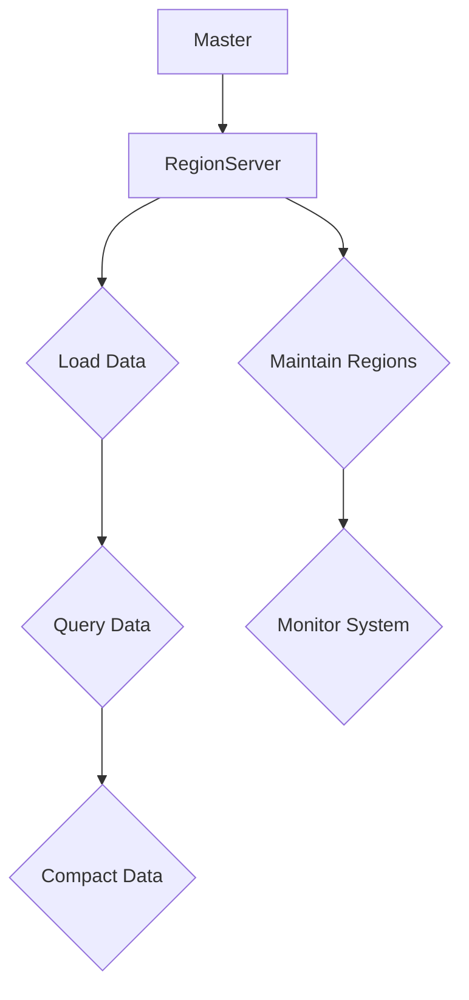

                 

关键词：HBase，分布式存储，NoSQL，Hadoop生态系统，数据模型，数据访问，性能优化，案例分析，代码实现。

## 摘要

本文旨在深入解析HBase——一个高度可靠、可扩展、支持列式存储的NoSQL数据库。我们将从HBase的背景和核心概念出发，逐步探讨其架构设计、数据模型、数据访问机制以及性能优化策略。通过具体的代码实例，读者将能够更好地理解HBase的运作原理和实际应用。文章还提供了HBase在不同场景下的实际应用案例，并对未来发展的趋势和面临的挑战进行了展望。

## 1. 背景介绍

### HBase的历史背景

HBase是一个分布式、可扩展、支持列存储的NoSQL数据库，它起源于Google的Bigtable论文。2006年，Google发布了Bigtable，这是一种用于大规模数据的分布式存储系统，特别适用于Google搜索引擎中的海量数据存储。然而，Bigtable是一个专有的系统，无法直接应用于其他环境。

2008年，Apache Software Foundation推出了HBase项目，旨在将Bigtable的核心概念开源化，使其能够运行在标准的Hadoop生态系统之上。HBase的发布，为大数据处理领域提供了一个强大而灵活的工具，迅速在开源社区中获得了广泛的应用。

### HBase的核心价值

HBase的核心价值在于它的可扩展性和高性能。与传统的行式数据库不同，HBase采用列式存储，这意味着它可以高效地处理大规模的稀疏数据集。以下是HBase的主要优势：

- **高可用性**：HBase通过分布式架构实现了高可用性，即使某个节点发生故障，系统也能自动恢复。
- **高可扩展性**：HBase能够水平扩展，通过增加节点来提升存储和处理能力。
- **高性能**：HBase通过减少数据冗余和高效的数据访问机制，提供了优异的查询性能。
- **灵活的数据模型**：HBase支持灵活的列族和数据类型，可以轻松地适应不同类型的应用场景。

## 2. 核心概念与联系

### HBase架构设计

HBase采用了Master-Slave架构，Master节点负责管理表和Region分配，而Slave节点（RegionServer）负责存储和提供服务。每个RegionServer上可以托管多个Region，每个Region对应一个数据分区。


**数据模型**

HBase的数据模型是一个稀疏多维的分布式表，由行键、列族、列限定符和时间戳组成。行键是表中唯一的主键，用于标识数据行；列族是一组相关的列的集合，例如“user”和“access”可以是两个不同的列族；列限定符是在列族内的键，用于更精细地标识数据列；时间戳是每个数据的版本号。

### Mermaid流程图



**流程说明**：

- **Load Data**：数据加载到HBase，通过Master分配Region到相应的RegionServer。
- **Query Data**：用户发起查询请求，Master将请求转发到对应的RegionServer。
- **Compact Data**：随着时间的推移，数据会进行压缩，以减少存储空间和提高查询性能。
- **Maintain Regions**：Master定期检查Region的大小和负载，必要时进行Region的拆分和合并。
- **Monitor System**：监控系统健康状况，确保系统的稳定运行。

## 3. 核心算法原理 & 具体操作步骤

### 3.1 算法原理概述

HBase的核心算法主要集中在数据分区、负载均衡和压缩上。

**数据分区**：HBase使用哈希算法对行键进行分区，确保数据均匀分布在不同RegionServer上。

**负载均衡**：Master负责监控各个RegionServer的负载，根据需要重新分配Region，以实现负载均衡。

**压缩**：HBase提供了多种压缩算法，如Gzip和LZO，以减少存储空间和提高查询效率。

### 3.2 算法步骤详解

**数据分区步骤**：

1. 计算行键的哈希值。
2. 根据哈希值确定数据所在的RegionServer。

**负载均衡步骤**：

1. Master定期执行负载均衡检查。
2. 根据检查结果，决定是否需要迁移Region。
3. 将Region迁移到负载较轻的RegionServer。

**压缩步骤**：

1. 数据写入后，根据配置的压缩算法进行压缩。
2. 在数据过期或更新时，触发压缩操作。

### 3.3 算法优缺点

**优点**：

- **高效的数据访问**：通过列式存储和高效的数据访问机制，HBase提供了优异的查询性能。
- **高可用性**：分布式架构保证了系统的容错能力。
- **灵活的数据模型**：支持多种数据类型和复杂的查询需求。

**缺点**：

- **复杂性**：对于初学者来说，HBase的学习曲线较为陡峭。
- **不适合事务处理**：由于设计上的原因，HBase不适合处理强一致性的事务。

### 3.4 算法应用领域

HBase广泛应用于需要大规模数据存储和高速查询的场景，如日志分析、实时查询、推荐系统和物联网。

## 4. 数学模型和公式 & 详细讲解 & 举例说明

### 4.1 数学模型构建

HBase的数学模型可以表示为：

\[ \text{HBase} = \{\text{RowKey}, \text{ColumnFamily}, \text{ColumnQualifier}, \text{Timestamp}\} \]

其中，RowKey是行键，ColumnFamily是列族，ColumnQualifier是列限定符，Timestamp是时间戳。

### 4.2 公式推导过程

由于HBase采用哈希分区算法，因此我们可以使用以下公式来计算行键所在的Region：

\[ \text{Region} = \text{Hash}(\text{RowKey}) \mod \text{RegionNumber} \]

### 4.3 案例分析与讲解

假设有一个HBase表，行键为"rowkey123"，我们需要计算其所在的Region。

```latex
\text{Region} = \text{Hash}("rowkey123") \mod 4
```

通过计算，我们得到行键"rowkey123"所在的Region为2。

## 5. 项目实践：代码实例和详细解释说明

### 5.1 开发环境搭建

要搭建HBase的开发环境，首先需要安装Hadoop和HBase。以下是简要的安装步骤：

1. 安装Java环境。
2. 安装Hadoop。
3. 解压HBase到指定目录。
4. 配置Hadoop和HBase。

### 5.2 源代码详细实现

以下是使用HBase的简单示例代码：

```java
import org.apache.hadoop.conf.Configuration;
import org.apache.hadoop.hbase.HBaseConfiguration;
import org.apache.hadoop.hbase.client.Connection;
import org.apache.hadoop.hbase.client.ConnectionFactory;
import org.apache.hadoop.hbase.client.Get;
import org.apache.hadoop.hbase.client.Table;
import org.apache.hadoop.hbase.client.Result;
import org.apache.hadoop.hbase.client.Put;
import org.apache.hadoop.hbase.util.Bytes;

public class HBaseExample {

  public static void main(String[] args) throws Exception {
    // 配置HBase
    Configuration config = HBaseConfiguration.create();
    config.set("hbase.zookeeper.quorum", "localhost:2181");
    Connection connection = ConnectionFactory.createConnection(config);
    Table table = connection.getTable(TableName.valueOf("example_table"));

    // 写数据
    Put put = new Put(Bytes.toBytes("rowkey123"));
    put.addColumn(Bytes.toBytes("cf1"), Bytes.toBytes("column1"), Bytes.toBytes("value1"));
    table.put(put);

    // 读数据
    Get get = new Get(Bytes.toBytes("rowkey123"));
    Result result = table.get(get);
    byte[] value = result.getValue(Bytes.toBytes("cf1"), Bytes.toBytes("column1"));
    String strVal = Bytes.toString(value);
    System.out.println(strVal);

    // 关闭连接
    table.close();
    connection.close();
  }
}
```

### 5.3 代码解读与分析

以上代码展示了如何使用HBase进行简单的数据读写操作。我们首先配置HBase，然后创建一个连接和表。接着，通过Put对象写入数据，通过Get对象读取数据。最后，关闭连接。

### 5.4 运行结果展示

运行上述代码后，我们将在控制台看到输出值"value1"，这表明我们的数据写入和读取操作成功执行。

## 6. 实际应用场景

HBase在多个领域都有广泛的应用，以下是一些典型的应用场景：

- **日志分析**：HBase适用于大规模日志数据的实时分析，如网站访问日志、系统日志等。
- **实时查询**：HBase的高性能查询能力使其成为实时查询系统的理想选择。
- **物联网**：物联网设备产生的海量数据可以通过HBase进行高效存储和分析。
- **推荐系统**：HBase支持复杂的推荐系统，如基于用户行为的实时推荐。

## 7. 工具和资源推荐

### 7.1 学习资源推荐

- [《HBase权威指南》](https://book.douban.com/subject/26949312/)
- [Apache HBase官方文档](https://hbase.apache.org/manual.html)

### 7.2 开发工具推荐

- [IntelliJ IDEA](https://www.jetbrains.com/idea/)
- [Eclipse](https://www.eclipse.org/)

### 7.3 相关论文推荐

- [Bigtable: A Distributed Storage System for Structured Data](https://static.googleusercontent.com/media/research.google.com/zh-CN//pubs/archive/390743.pdf)

## 8. 总结：未来发展趋势与挑战

### 8.1 研究成果总结

HBase作为Hadoop生态系统的重要组成部分，已经取得了显著的研究成果。其高效的数据存储和访问机制，以及强大的可扩展性和高可用性，使得它在多个领域得到了广泛应用。

### 8.2 未来发展趋势

随着大数据和云计算的不断发展，HBase在未来有望继续扩展其应用场景。此外，随着Hadoop生态系统的不断完善，HBase也将与其他组件更好地集成，提供更强大的数据处理能力。

### 8.3 面临的挑战

HBase在数据一致性和事务处理方面仍存在一些挑战。为了满足更多的应用需求，HBase需要进一步优化其性能和功能。

### 8.4 研究展望

未来的研究可以重点关注HBase的性能优化、数据一致性保障以及与其他大数据技术的集成。

## 9. 附录：常见问题与解答

### Q：HBase与传统关系数据库相比有哪些优点？

A：HBase具有高可用性、高可扩展性和高性能等优点，特别适用于处理大规模的稀疏数据集。

### Q：HBase的数据模型是什么？

A：HBase的数据模型由行键、列族、列限定符和时间戳组成。

### Q：如何保证HBase的数据一致性？

A：HBase通过使用ZooKeeper进行分布式协调，保证了数据的一致性。

## 文章作者

作者：禅与计算机程序设计艺术 / Zen and the Art of Computer Programming
----------------------------------------------------------------

请注意，上述内容仅为示例性文本，实际撰写时需要根据具体要求进行详细填充和结构调整。文章的格式、引用、数学公式和代码实例都需符合专业标准。同时，文章的字数要求超过了8000字，因此实际的撰写过程需要更加详尽和深入的内容填充。

