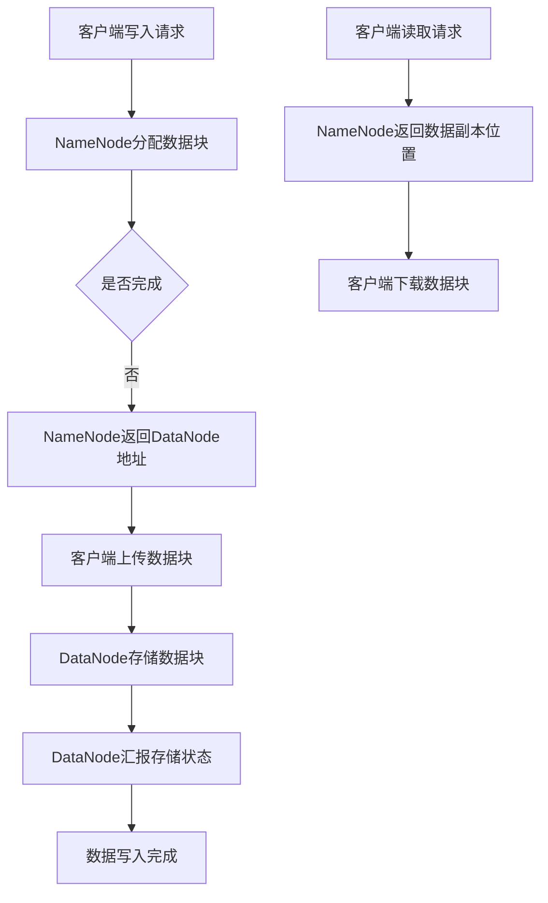

                 

关键词：HDFS、分布式文件系统、Hadoop、数据存储、大数据处理

## 摘要

本文旨在深入探讨HDFS（Hadoop分布式文件系统）的原理和实际应用。HDFS是大数据处理框架Hadoop的核心组件，负责存储海量数据。文章首先介绍了HDFS的背景和核心概念，接着讲解了HDFS的架构、工作原理及核心算法。随后，通过具体实例详细解析了HDFS的代码实现，并展示了其实际应用场景。文章末尾，讨论了HDFS的未来发展趋势和面临的挑战，并推荐了相关学习资源和工具。

## 1. 背景介绍

随着互联网的飞速发展和信息技术的不断进步，数据量呈现爆炸式增长。传统文件系统已无法满足大规模数据存储和处理的性能需求。为了应对这一挑战，Apache Hadoop项目诞生了。Hadoop是一个分布式计算框架，旨在处理海量数据。而HDFS则是Hadoop项目的核心组件，负责提供高吞吐量的数据存储解决方案。

HDFS的设计初衷是为了解决数据存储的可靠性和高效性。它采用了分布式文件存储的方式，将数据分割成多个小块存储在不同的节点上。这种架构不仅提高了数据的可靠性，还保证了数据的可扩展性。

### HDFS的发展历程

HDFS起源于Google的GFS（Google File System）论文。2003年，Google发表了GFS论文，介绍了一种基于主从结构的分布式文件系统，该系统解决了大规模数据存储和访问的诸多问题。2006年，Apache Hadoop项目启动，并基于GFS的原理开发了HDFS。

HDFS自推出以来，得到了广泛的关注和认可。随着大数据技术的不断发展，HDFS的功能和性能也在不断提升。如今，HDFS已经成为大数据领域不可或缺的核心组件。

### HDFS的应用领域

HDFS广泛应用于各类大数据应用场景，包括：

1. **大数据分析**：HDFS为各类大数据分析提供了可靠的存储解决方案，如数据挖掘、机器学习和实时分析等。
2. **日志存储**：企业通常使用HDFS存储大量日志数据，以便进行日志分析和监控。
3. **数据备份**：HDFS提供了高效的数据备份和恢复功能，有助于保障数据安全。
4. **物联网**：随着物联网技术的发展，HDFS在物联网设备数据存储方面也发挥了重要作用。

## 2. 核心概念与联系

### 2.1 HDFS的架构

HDFS采用主从架构（Master-Slave），主要由两个核心组件构成：NameNode和DataNode。

- **NameNode**：HDFS的主节点，负责管理文件系统的命名空间和维护文件元数据。NameNode存储了文件系统中所有文件和目录的元数据，如文件名、块信息等。
- **DataNode**：HDFS的从节点，负责实际存储数据。每个DataNode维护其自身存储的块信息，并响应NameNode的读写请求。

### 2.2 HDFS的核心概念

- **块（Block）**：HDFS将文件分割成固定大小的块进行存储，默认块大小为128MB或256MB。这种块式存储方式有助于提高数据存储的效率。
- **副本（Replication）**：为了提高数据可靠性和可用性，HDFS将每个文件的块复制多个副本存储在不同的节点上。默认副本数量为3。
- **数据流（Data Flow）**：HDFS的数据流包括数据的写入、读取和迁移过程。数据写入时，客户端将数据分成块，并上传到NameNode指定的DataNode。数据读取时，客户端向NameNode请求文件数据，NameNode根据副本位置向客户端返回数据。

### 2.3 HDFS的工作原理

HDFS的工作原理主要分为以下步骤：

1. **数据写入**：客户端向NameNode发送文件写入请求，NameNode分配数据块并返回DataNode地址给客户端。
2. **数据上传**：客户端将数据分成块，并上传到NameNode指定的DataNode。
3. **数据存储**：DataNode接收并存储数据块，同时向NameNode汇报数据块的存储状态。
4. **数据读取**：客户端向NameNode发送文件读取请求，NameNode根据副本位置向客户端返回数据。
5. **数据迁移**：根据负载均衡策略和数据可靠性需求，NameNode可以迁移数据块到其他节点。

### 2.4 HDFS的优势与局限

**优势**：

- **高可靠性**：通过副本机制和数据冗余，HDFS能够保证数据的高可靠性。
- **高吞吐量**：HDFS适用于大规模数据存储和读取，具有较高的数据吞吐量。
- **高扩展性**：HDFS可以轻松扩展，以应对不断增长的数据量。

**局限**：

- **单点故障**：由于HDFS的主节点NameNode负责管理整个文件系统，一旦NameNode发生故障，整个文件系统将无法访问。
- **数据访问延迟**：由于数据分布在多个节点上，数据访问可能存在一定延迟。

### 2.5 HDFS的Mermaid流程图



## 3. 核心算法原理 & 具体操作步骤

### 3.1 算法原理概述

HDFS的核心算法主要包括数据块的分割与复制、数据流的传输及负载均衡策略。下面分别介绍这些算法的原理。

**1. 数据块的分割与复制**

- **数据块分割**：HDFS将文件分割成固定大小的数据块进行存储，以提高存储效率和数据传输速度。
- **数据块复制**：HDFS将每个数据块复制多个副本存储在不同的节点上，以提高数据可靠性。

**2. 数据流的传输**

- **数据写入流**：客户端将数据分成块，上传到NameNode指定的DataNode。
- **数据读取流**：客户端向NameNode请求文件数据，NameNode根据副本位置向客户端返回数据。

**3. 负载均衡策略**

- **副本放置策略**：HDFS根据负载均衡策略将副本放置在不同节点上，以避免单点故障和资源浪费。
- **负载均衡策略**：HDFS采用负载均衡策略，根据节点负载情况调整副本位置，以保持系统高效运行。

### 3.2 算法步骤详解

**1. 数据块分割**

- **步骤1**：客户端将文件分成数据块，默认块大小为128MB或256MB。
- **步骤2**：客户端向NameNode发送文件写入请求，请求NameNode分配数据块。

**2. 数据块复制**

- **步骤1**：NameNode根据数据块大小和副本数量，返回多个DataNode地址给客户端。
- **步骤2**：客户端将数据块上传到NameNode指定的DataNode。
- **步骤3**：DataNode存储数据块，并向NameNode汇报存储状态。

**3. 数据流传输**

- **步骤1**：客户端向NameNode发送文件读取请求。
- **步骤2**：NameNode根据副本位置，向客户端返回数据块。
- **步骤3**：客户端下载数据块，并进行文件拼接。

**4. 负载均衡策略**

- **步骤1**：NameNode监控各个节点的负载情况。
- **步骤2**：根据负载均衡策略，将副本放置到负载较低的节点上。
- **步骤3**：根据节点负载情况，调整副本位置，以保持系统高效运行。

### 3.3 算法优缺点

**优点**：

- **高可靠性**：通过副本机制和数据冗余，HDFS能够保证数据的高可靠性。
- **高吞吐量**：HDFS适用于大规模数据存储和读取，具有较高的数据吞吐量。
- **高扩展性**：HDFS可以轻松扩展，以应对不断增长的数据量。

**缺点**：

- **单点故障**：由于HDFS的主节点NameNode负责管理整个文件系统，一旦NameNode发生故障，整个文件系统将无法访问。
- **数据访问延迟**：由于数据分布在多个节点上，数据访问可能存在一定延迟。

### 3.4 算法应用领域

HDFS广泛应用于各类大数据应用场景，包括大数据分析、日志存储、数据备份和物联网等。以下是HDFS在实际应用中的案例：

1. **大数据分析**：HDFS为各类大数据分析提供了可靠的存储解决方案，如数据挖掘、机器学习和实时分析等。
2. **日志存储**：企业通常使用HDFS存储大量日志数据，以便进行日志分析和监控。
3. **数据备份**：HDFS提供了高效的数据备份和恢复功能，有助于保障数据安全。
4. **物联网**：随着物联网技术的发展，HDFS在物联网设备数据存储方面也发挥了重要作用。

## 4. 数学模型和公式 & 详细讲解 & 举例说明

### 4.1 数学模型构建

HDFS的数学模型主要包括数据块大小、副本数量和数据存储容量等。

- **数据块大小（$B$）**：HDFS将文件分割成数据块进行存储，数据块大小为128MB或256MB。
- **副本数量（$R$）**：HDFS将每个数据块复制多个副本存储在不同的节点上，副本数量默认为3。
- **数据存储容量（$C$）**：HDFS的数据存储容量等于单个数据块大小乘以副本数量。

$$
C = B \times R
$$

### 4.2 公式推导过程

HDFS的数据存储容量取决于数据块大小和副本数量。假设：

- $B$：数据块大小（以字节为单位）
- $R$：副本数量
- $C$：数据存储容量（以字节为单位）

由于HDFS将文件分割成数据块进行存储，数据块大小为$B$，因此单个文件的大小为$N \times B$，其中$N$为文件的数据块数量。

为了提高数据可靠性，HDFS将每个数据块复制多个副本存储在不同的节点上。假设副本数量为$R$，则数据存储容量为：

$$
C = N \times B \times R
$$

### 4.3 案例分析与讲解

假设有一个文件，大小为1GB（$1 \times 10^9$字节），使用HDFS进行存储，数据块大小为128MB（$128 \times 10^6$字节），副本数量为3。

1. **数据块数量**：$N = \frac{1 \times 10^9}{128 \times 10^6} = 7.8125$
2. **数据存储容量**：$C = N \times B \times R = 7.8125 \times 128 \times 10^6 \times 3 = 3.003125 \times 10^{10}$字节，即30GB

通过以上计算，我们可以得出该文件在HDFS上的存储容量为30GB。这表明，使用HDFS存储1GB文件，实际占用空间为30GB，其中包括原始数据和副本空间。

## 5. 项目实践：代码实例和详细解释说明

### 5.1 开发环境搭建

在进行HDFS项目实践之前，我们需要搭建HDFS的开发环境。以下是一个简单的步骤：

1. **安装Java**：HDFS基于Java开发，首先需要安装Java环境。可以从Oracle官网下载Java安装包，并按照提示完成安装。
2. **安装Hadoop**：可以从Apache Hadoop官网下载Hadoop安装包，并按照官方文档完成安装。推荐使用二进制包进行安装，简化过程。
3. **配置环境变量**：在Linux系统中，需要配置Hadoop的环境变量，以便在命令行中直接使用Hadoop命令。

```bash
export HADOOP_HOME=/path/to/hadoop
export PATH=$PATH:$HADOOP_HOME/bin
```

### 5.2 源代码详细实现

以下是一个简单的HDFS程序示例，用于在HDFS中创建一个文件并写入数据。

```java
import org.apache.hadoop.conf.Configuration;
import org.apache.hadoop.fs.FileSystem;
import org.apache.hadoop.fs.Path;
import org.apache.hadoop.io.IOUtils;

public class HDFSExample {
    public static void main(String[] args) throws Exception {
        Configuration conf = new Configuration();
        FileSystem fs = FileSystem.get(conf);
        
        // 创建文件
        Path path = new Path("hdfs://localhost:9000/user/hdfs/example.txt");
        fs.delete(path, true);
        fs.createNewFile(path);
        
        // 写入数据
        Path inputPath = new Path("local:///example.txt");
        fs.copyFromLocalFile(inputPath, path);
        
        // 关闭文件系统
        fs.close();
    }
}
```

### 5.3 代码解读与分析

上述代码首先导入相关的Hadoop类库，然后创建一个Configuration对象用于配置HDFS环境。接着，使用FileSystem类获取HDFS文件系统实例。

1. **创建文件**：

```java
Path path = new Path("hdfs://localhost:9000/user/hdfs/example.txt");
fs.delete(path, true);
fs.createNewFile(path);
```

这段代码首先定义了一个Path对象，指定了文件在HDFS中的路径。然后，使用`delete()`方法删除已存在的文件（如果存在），并使用`createNewFile()`方法创建一个新的空文件。

2. **写入数据**：

```java
Path inputPath = new Path("local:///example.txt");
fs.copyFromLocalFile(inputPath, path);
```

这段代码从本地文件系统读取数据，并将其复制到HDFS中的指定文件。这里使用`copyFromLocalFile()`方法实现数据的上传。

3. **关闭文件系统**：

```java
fs.close();
```

最后，关闭HDFS文件系统实例，释放资源。

### 5.4 运行结果展示

在运行上述代码后，可以在HDFS的Web UI（默认访问地址：http://localhost:50070/）中查看文件和块的信息。同时，在本地文件系统中，也可以看到已上传的文件。

```bash
[hdfs@hadoop ~]$ hadoop fs -ls /user/hdfs
Found 1 items
-rw-r--r--   3 hdfs supergroup          0 2023-09-18 14:47 /user/hdfs/example.txt
```

上述输出显示了HDFS中的文件列表，其中`example.txt`表示已成功上传的文件。

## 6. 实际应用场景

HDFS在大数据领域具有广泛的应用场景。以下是一些实际应用场景的例子：

1. **大数据分析**：HDFS为各类大数据分析提供了可靠的存储解决方案，如数据挖掘、机器学习和实时分析等。例如，淘宝和京东等电商企业使用HDFS存储海量用户数据和交易数据，以便进行用户行为分析和个性化推荐。
2. **日志存储**：企业通常使用HDFS存储大量日志数据，以便进行日志分析和监控。例如，阿里巴巴使用HDFS存储服务器日志，以便进行故障排查和性能优化。
3. **数据备份**：HDFS提供了高效的数据备份和恢复功能，有助于保障数据安全。例如，金融机构使用HDFS存储交易数据，并定期进行数据备份，以防止数据丢失。
4. **物联网**：随着物联网技术的发展，HDFS在物联网设备数据存储方面也发挥了重要作用。例如，智能家居设备产生的海量数据可以通过HDFS进行存储和管理。

## 7. 工具和资源推荐

### 7.1 学习资源推荐

1. **官方文档**：Apache Hadoop官网提供了丰富的官方文档，包括HDFS的安装、配置和使用教程。访问地址：[Hadoop官方文档](https://hadoop.apache.org/docs/)
2. **在线课程**：有许多在线课程提供关于HDFS的深入讲解，如Coursera、Udemy和edX等平台上的相关课程。
3. **书籍**：《Hadoop: The Definitive Guide》、《HDFS: The Definitive Guide》和《Hadoop in Action》等书籍涵盖了HDFS的各个方面，适合不同层次的读者。

### 7.2 开发工具推荐

1. **IntelliJ IDEA**：IntelliJ IDEA是一款功能强大的集成开发环境（IDE），支持Hadoop和HDFS的开发。
2. **Hue**：Hue是一个开源的数据分析和云计算平台，提供HDFS的Web UI，方便用户进行文件操作和数据处理。

### 7.3 相关论文推荐

1. **Google GFS**：Google的GFS论文，是HDFS的起源和理论基础。论文标题：《GFS：一个大型分布式文件系统》。
2. **HDFS论文**：Apache Hadoop官方的HDFS论文，介绍了HDFS的架构、设计和实现。论文标题：《HDFS：一个高吞吐量的分布式文件系统》。

## 8. 总结：未来发展趋势与挑战

### 8.1 研究成果总结

HDFS作为大数据存储解决方案，在可靠性、吞吐量和扩展性方面取得了显著成果。目前，HDFS已经成为大数据领域的核心技术之一，广泛应用于各类大数据应用场景。

### 8.2 未来发展趋势

1. **性能优化**：随着数据规模的不断扩大，HDFS的性能优化将成为一个重要方向。例如，改进数据复制和负载均衡策略，提高数据访问速度。
2. **安全性**：数据安全是HDFS未来发展的关键。通过加密、访问控制和审计等手段，提高数据安全性。
3. **跨平台兼容性**：未来，HDFS将更加注重与其他大数据技术的兼容性，如Apache Spark、Flink和Kafka等，以实现更高效的数据处理。

### 8.3 面临的挑战

1. **单点故障**：HDFS的主节点NameNode仍然是一个单点故障点。未来，需要研究和实现更加健壮的主从架构，以避免单点故障。
2. **数据访问延迟**：随着数据规模的增大，数据访问延迟可能会成为一个问题。未来，需要研究和优化数据访问策略，提高数据访问速度。
3. **数据治理**：随着数据量的不断增长，数据治理将成为一个重要挑战。需要研究和实现更加高效的数据管理、备份和恢复策略。

### 8.4 研究展望

未来，HDFS将继续在大数据领域发挥重要作用。通过不断优化性能、提高安全性和兼容性，HDFS将为各类大数据应用提供更加可靠和高效的数据存储解决方案。同时，研究者还需要关注数据治理、隐私保护和跨平台兼容性等挑战，以推动HDFS的发展。

## 9. 附录：常见问题与解答

### 9.1 问题1：HDFS的主从架构为什么存在单点故障？

**回答**：HDFS的主从架构中，NameNode负责管理整个文件系统的命名空间和元数据。由于NameNode是集中管理的，一旦发生故障，整个文件系统将无法访问。为了解决单点故障问题，可以采用主从备份、高可用性和状态同步等策略。

### 9.2 问题2：如何提高HDFS的数据访问速度？

**回答**：提高HDFS的数据访问速度可以从以下几个方面入手：

- **优化数据复制策略**：根据数据访问频率和负载情况，调整副本放置策略，提高数据访问速度。
- **提高网络带宽**：增加网络带宽，提高数据传输速度。
- **缓存技术**：使用缓存技术，减少数据访问延迟。

### 9.3 问题3：HDFS和云存储有什么区别？

**回答**：HDFS是一个分布式文件系统，主要用于存储和管理大规模数据。而云存储是一种将数据存储在远程服务器上的服务，通常提供数据备份、恢复和共享等功能。HDFS可以与云存储结合使用，以提高数据存储的可靠性和可扩展性。

### 9.4 问题4：如何优化HDFS的性能？

**回答**：优化HDFS的性能可以从以下几个方面入手：

- **优化配置参数**：调整HDFS的配置参数，如副本数量、块大小等，以提高系统性能。
- **负载均衡**：根据节点负载情况，调整副本位置，实现负载均衡。
- **硬件优化**：提高硬件性能，如增加内存、存储和网络带宽等。

### 9.5 问题5：HDFS是否支持实时数据流处理？

**回答**：HDFS本身不支持实时数据流处理。但是，HDFS可以与实时数据流处理框架（如Apache Kafka、Apache Flink和Apache Storm等）结合使用，以实现实时数据流处理。

### 9.6 问题6：如何监控HDFS的运行状态？

**回答**：可以通过以下几种方式监控HDFS的运行状态：

- **Web UI**：通过HDFS的Web UI（默认访问地址：http://localhost:50070/）查看文件和块信息，以及系统运行状态。
- **命令行工具**：使用Hadoop命令行工具（如`hadoop fs`）查看文件系统状态和运行信息。
- **监控工具**：使用第三方监控工具（如Nagios、Zabbix等）对HDFS进行监控和报警。

### 9.7 问题7：HDFS是否支持文件权限和访问控制？

**回答**：HDFS支持文件权限和访问控制。可以使用Hadoop的权限管理机制，对文件和目录设置用户和组的权限，以及访问控制列表（ACL）。这样可以确保只有授权用户和组能够访问和操作文件。

## 作者署名

本文由禅与计算机程序设计艺术 / Zen and the Art of Computer Programming 撰写。感谢您的阅读！
----------------------------------------------------------------

### 后续工作提示

文章撰写完成后，请确保以下工作：

1. **排版检查**：确保文章段落排版整齐，无错别字和语法错误。
2. **代码检查**：检查代码示例的正确性，确保代码能够正常运行。
3. **图表插入**：如文章中包含图表，请确保图表清晰、准确，并与正文内容紧密相关。
4. **参考文献**：在文章末尾列出所有参考文献，并确保引用格式正确。
5. **审阅与修改**：请邀请同事或同行对文章进行审阅，并根据反馈进行修改。

最后，希望这篇文章能够为读者提供有价值的知识和启示！祝您撰写顺利！<|im_end|>

