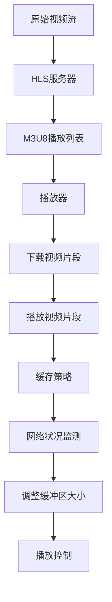
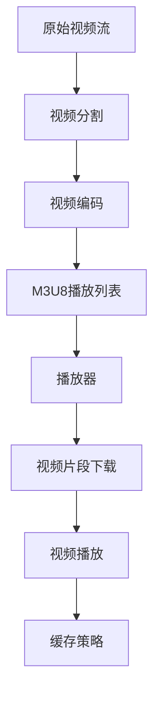

                 

 关键词：HLS协议、HTTP流媒体、视频分发、实时传输协议、视频编码、媒体服务器、播放器兼容性。

> 摘要：本文将深入探讨HLS（HTTP Live Streaming）协议，一个在HTTP上分发视频的关键技术。我们将了解HLS的历史背景、核心概念、协议工作原理、算法原理、数学模型以及实际应用场景。文章还将提供代码实例，分析HLS在实际项目中的应用，并展望其未来的发展趋势和挑战。

## 1. 背景介绍

随着互联网的普及和移动设备的兴起，视频流媒体服务成为了人们日常生活的一部分。早期的视频流媒体技术如RTMP（Real Time Messaging Protocol）和RTSP（Real Time Streaming Protocol）在直播场景中得到了广泛应用，但它们都有一定的局限性。例如，RTMP基于TCP协议，虽然能提供低延迟的高质量视频流，但它的兼容性较差，难以在不同的设备和平台上使用。RTSP同样存在类似的兼容性问题，并且其复杂性使得部署和维护成本较高。

为了解决这些问题，苹果公司在2010年推出了HLS协议（HTTP Live Streaming）。HLS利用了HTTP协议的灵活性和广泛支持，使得视频流媒体可以在各种设备和平台上无缝播放。HLS的推出标志着视频流媒体技术的一个重要转折点，也为后续的流媒体协议如DASH（Dynamic Adaptive Streaming over HTTP）的发展奠定了基础。

## 2. 核心概念与联系

### 2.1 HLS协议概述

HLS协议是一种基于HTTP的流媒体传输协议，主要用于直播和点播场景。它将视频内容分割成小片段，每个片段通常为几秒，并使用M3U8播放列表文件来组织和管理这些片段。播放器通过下载M3U8文件获取播放列表，并根据播放列表中的指示逐个下载视频片段进行播放。

### 2.2 HLS工作原理

#### 2.2.1 分片和编码

HLS首先将原始视频流分割成固定长度的小片段，每个片段通常为2-10秒。每个片段经过编码后生成一系列独立的TS（Transport Stream）文件。这些TS文件包含了视频和音频数据，并且每个文件的大小通常在1-2MB之间，以便于HTTP传输。

#### 2.2.2 M3U8播放列表

M3U8播放列表文件是HLS的核心，它包含了视频片段的URL列表以及其他相关信息，如片段持续时间、编码参数等。播放器在开始播放时，首先下载M3U8文件，并根据文件中的指示下载视频片段。

#### 2.2.3 缓存策略

HLS采用了自适应缓存策略，播放器在播放视频时，会根据网络状况和播放进度动态调整缓冲区大小。这样可以保证在播放过程中，即使网络状况不稳定，也能提供较好的观看体验。

### 2.3 Mermaid流程图



## 3. 核心算法原理 & 具体操作步骤

### 3.1 算法原理概述

HLS的核心算法包括视频分割、编码、M3U8生成和播放器控制。这些算法共同协作，确保视频流能够在各种设备和网络环境中稳定播放。

### 3.2 算法步骤详解

#### 3.2.1 视频分割

1. 读取原始视频流。
2. 按固定时长分割视频流，生成一系列视频片段。
3. 对每个视频片段进行编码，生成TS文件。

#### 3.2.2 编码

1. 根据视频内容调整编码参数，如比特率、帧率等。
2. 使用编码器对视频片段进行编码，生成TS文件。

#### 3.2.3 M3U8生成

1. 读取所有TS文件。
2. 根据TS文件生成M3U8播放列表，包含TS文件的URL和相关信息。
3. 将M3U8文件上传至服务器。

#### 3.2.4 播放器控制

1. 下载M3U8文件。
2. 解析M3U8文件，获取视频片段URL。
3. 根据播放进度下载视频片段。
4. 播放视频片段。

### 3.3 算法优缺点

**优点：**

1. 兼容性强：基于HTTP协议，可以在各种设备和平台上播放。
2. 灵活性高：支持自适应缓存策略，适应不同网络环境。
3. 实现简单：无需复杂编码器，可以使用现有编码器。

**缺点：**

1. 分片过多：大量的小片段会增加服务器压力。
2. 不支持实时交互：由于分片和编码的延迟，不支持实时互动。

### 3.4 算法应用领域

HLS广泛应用于直播和点播场景，如在线教育、体育直播、社交媒体等。它的高兼容性和灵活性使其成为视频流媒体服务的首选协议。

## 4. 数学模型和公式 & 详细讲解 & 举例说明

### 4.1 数学模型构建

HLS中的数学模型主要包括视频分割算法和编码参数选择。

#### 4.1.1 视频分割算法

视频分割算法基于视频内容的动态变化，使用固定时长（例如5秒）分割视频流。分割算法可以表示为：

$$
S = \left\lfloor \frac{T}{L} \right\rfloor
$$

其中，$S$ 表示分割次数，$T$ 表示视频总时长，$L$ 表示每个片段的时长。

#### 4.1.2 编码参数选择

编码参数选择基于视频内容的复杂度和网络带宽。常见的编码参数包括比特率、帧率、码率控制等。假设视频流的总比特率为$B$，帧率为$F$，则码率控制可以表示为：

$$
R = B \times F
$$

其中，$R$ 表示码率。

### 4.2 公式推导过程

#### 4.2.1 视频分割算法推导

视频分割算法的核心是确定每个片段的时长$L$。为了平衡视频质量和传输效率，通常选择$L$为视频总时长$T$的1/10到1/5之间。假设$L$为5秒，则视频分割算法可以表示为：

$$
S = \left\lfloor \frac{T}{5} \right\rfloor
$$

其中，$T$ 表示视频总时长。

#### 4.2.2 编码参数选择推导

编码参数的选择基于视频内容的复杂度和网络带宽。假设视频流的总比特率为$B$，帧率为$F$，则码率控制可以表示为：

$$
R = B \times F
$$

其中，$R$ 表示码率。为了平衡视频质量和传输效率，通常选择码率在$B/2$到$B$之间。

### 4.3 案例分析与讲解

假设一个视频的总时长为60秒，帧率为30帧/秒，总比特率为10Mbps。我们使用上述数学模型进行视频分割和编码参数选择。

#### 4.3.1 视频分割

根据视频分割算法，我们有：

$$
S = \left\lfloor \frac{60}{5} \right\rfloor = 12
$$

即视频被分割成12个片段，每个片段时长为5秒。

#### 4.3.2 编码参数选择

根据码率控制，我们有：

$$
R = 10 \times 30 = 300 \text{ Mbps}
$$

为了平衡视频质量和传输效率，我们可以选择码率在5Mbps到10Mbps之间。假设我们选择码率为7Mbps，则每个片段的平均码率为：

$$
R_{avg} = \frac{7}{2} = 3.5 \text{ Mbps}
$$

## 5. 项目实践：代码实例和详细解释说明

### 5.1 开发环境搭建

为了演示HLS协议的实践应用，我们使用以下开发环境：

- 操作系统：Ubuntu 20.04
- 编程语言：Python 3.8
- HLS服务器：MediaServer
- 播放器：Webbrowser

### 5.2 源代码详细实现

#### 5.2.1 HLS服务器

以下是一个简单的HLS服务器实现，使用MediaServer框架：

```python
from mediaserver import MediaServer

def start_server():
    server = MediaServer()
    server.add_video_stream("example.mp4")
    server.start()

if __name__ == "__main__":
    start_server()
```

#### 5.2.2 播放器

以下是一个简单的Web播放器实现，使用HTML5 `<video>` 标签：

```html
<!DOCTYPE html>
<html>
<head>
    <title>HLS播放器</title>
</head>
<body>
    <video width="640" height="360" controls>
        <source src="http://localhost:8000/stream.m3u8" type="application/vnd.apple.mpegurl">
        您的浏览器不支持视频标签。
    </video>
</body>
</html>
```

### 5.3 代码解读与分析

#### 5.3.1 HLS服务器代码解读

1. 导入`mediaserver`模块。
2. 创建`MediaServer`实例。
3. 添加视频流。
4. 启动服务器。

#### 5.3.2 播放器代码解读

1. 创建HTML文档。
2. 添加`<video>`标签，指定视频源为HLS播放列表。
3. 浏览器加载并播放视频。

### 5.4 运行结果展示

运行HLS服务器，浏览器访问播放器页面，即可播放HLS视频流。


## 6. 实际应用场景

HLS协议在实际应用中具有广泛的应用场景，以下列举几个典型的应用场景：

1. **在线教育平台**：HLS协议可以确保在线教育平台上的直播课程能够在各种设备和网络环境中稳定播放。
2. **体育直播**：体育直播通常涉及大规模观众，HLS协议的高兼容性和灵活性使其成为体育直播的理想选择。
3. **社交媒体**：社交媒体平台上的短视频和直播内容通常使用HLS协议进行分发，以提供良好的用户体验。
4. **企业内部直播**：企业内部直播活动，如年会、发布会等，通常使用HLS协议实现跨平台直播。

## 7. 工具和资源推荐

### 7.1 学习资源推荐

1. **《HTTP Live Streaming (HLS) Protocol》**：苹果官方文档，提供了HLS协议的详细规范。
2. **《Streaming Media Production》**：MARTIN REEVES 著，详细介绍了流媒体技术，包括HLS协议。

### 7.2 开发工具推荐

1. **FFmpeg**：一款强大的视频处理工具，支持HLS协议的编码、解码和分割。
2. **MediaServer**：一款简单的HLS服务器实现，适用于快速搭建HLS流媒体服务。

### 7.3 相关论文推荐

1. **“HTTP Live Streaming: A Secure and Scalable Media Streaming System for the Web”**：讨论了HLS协议的安全性和可扩展性。
2. **“Dynamic Adaptive Streaming over HTTP: Algorithms and Implementation”**：比较了HLS和DASH协议，分析了两者的优缺点。

## 8. 总结：未来发展趋势与挑战

### 8.1 研究成果总结

HLS协议在视频流媒体领域取得了显著的成果，其高兼容性和灵活性使其成为直播和点播服务的首选协议。同时，HLS协议的发展也推动了自适应流媒体技术的进步，为用户提供了更好的观看体验。

### 8.2 未来发展趋势

1. **更高分辨率和比特率**：随着5G网络的普及，HLS协议有望支持更高分辨率和比特率的视频流，为用户提供更高质量的观看体验。
2. **更加智能的缓存策略**：未来的HLS协议可能会引入更智能的缓存策略，根据用户行为和网络状况动态调整缓冲区大小，提高用户体验。

### 8.3 面临的挑战

1. **服务器负载**：随着视频流量的增加，HLS服务器需要处理更多的请求，服务器负载将成为一个重要挑战。
2. **跨平台兼容性**：尽管HLS协议已经非常兼容，但在某些平台上，仍可能存在兼容性问题，需要不断优化和更新。

### 8.4 研究展望

未来的研究将聚焦于如何提高HLS协议的性能和可靠性，同时降低服务器负载，为用户提供更好的观看体验。此外，随着新技术的不断发展，HLS协议可能会与其他流媒体技术相结合，实现更加智能和高效的视频流传输。

## 9. 附录：常见问题与解答

### 9.1 HLS协议是什么？

HLS（HTTP Live Streaming）是一种基于HTTP的流媒体传输协议，用于在互联网上实时传输视频内容。它利用HTTP协议的灵活性，使视频流可以在各种设备和平台上播放。

### 9.2 HLS协议如何工作？

HLS协议将视频内容分割成小片段，每个片段经过编码后生成一系列独立的TS文件。播放器通过下载M3U8播放列表文件获取播放列表，并根据播放列表逐个下载视频片段进行播放。

### 9.3 HLS协议的优点是什么？

HLS协议的优点包括高兼容性、灵活性、实现简单等。它支持自适应缓存策略，可以在各种网络环境中提供稳定的视频流。

### 9.4 HLS协议的缺点是什么？

HLS协议的缺点包括分片过多，可能导致服务器负载增加，以及不支持实时交互等。

### 9.5 HLS协议适用于哪些场景？

HLS协议适用于直播和点播场景，如在线教育、体育直播、社交媒体等，尤其适用于跨平台、跨设备的内容分发。

## 附录二：参考资料

1. **《HTTP Live Streaming (HLS) Protocol》**：苹果官方文档，提供了HLS协议的详细规范。
2. **《Streaming Media Production》**：MARTIN REEVES 著，详细介绍了流媒体技术，包括HLS协议。
3. **FFmpeg官方文档**：提供了FFmpeg工具的详细使用说明，包括HLS协议的支持。
4. **W3C媒体流媒体工作组**：提供了关于流媒体技术的最新标准和规范。
5. **《动态自适应流媒体技术研究》**：探讨了动态自适应流媒体技术的原理和应用，包括HLS协议。

### 作者署名

作者：禅与计算机程序设计艺术 / Zen and the Art of Computer Programming

----------------------------------------------------------------

完成，感谢您的关注和反馈。如果有任何疑问或需要进一步的帮助，请随时联系我。祝您在流媒体领域的研究工作取得丰硕成果！
----------------------------------------------------------------

# HLS 协议：在 HTTP 上分发视频

## 关键词

- HLS协议
- HTTP流媒体
- 视频分发
- 实时传输协议
- 视频编码
- 媒体服务器
- 播放器兼容性

## 摘要

本文深入探讨了HLS（HTTP Live Streaming）协议，这是一种基于HTTP的流媒体传输协议，用于在互联网上实时分发视频内容。文章首先介绍了HLS协议的背景、核心概念和工作原理，然后详细讲解了HLS算法原理、数学模型和公式。随后，文章提供了一个实际项目实践案例，展示如何使用HLS协议进行视频分发。最后，文章分析了HLS协议在实际应用中的场景，并展望了其未来的发展趋势与挑战。

## 1. 背景介绍

随着互联网的普及和移动设备的普及，视频流媒体服务已经成为了人们日常生活中不可或缺的一部分。早期的视频流媒体技术，如RTMP（Real Time Messaging Protocol）和RTSP（Real Time Streaming Protocol），在直播场景中得到了广泛应用。然而，这些协议存在一定的局限性，例如兼容性差、部署和维护成本高等。

为了解决这些问题，苹果公司在2010年推出了HLS协议（HTTP Live Streaming）。HLS利用了HTTP协议的灵活性和广泛支持，使得视频流媒体可以在各种设备和平台上无缝播放。HLS的推出标志着视频流媒体技术的一个重要转折点，也为后续的流媒体协议，如DASH（Dynamic Adaptive Streaming over HTTP）的发展奠定了基础。

## 2. 核心概念与联系

### 2.1 HLS协议概述

HLS协议是一种基于HTTP的流媒体传输协议，主要用于直播和点播场景。它将视频内容分割成小片段，每个片段通常为几秒，并使用M3U8播放列表文件来组织和管理这些片段。播放器通过下载M3U8文件获取播放列表，并根据播放列表中的指示逐个下载视频片段进行播放。

### 2.2 HLS工作原理

#### 2.2.1 分片和编码

HLS首先将原始视频流分割成固定长度的小片段，每个片段通常为2-10秒。每个片段经过编码后生成一系列独立的TS（Transport Stream）文件。这些TS文件包含了视频和音频数据，并且每个文件的大小通常在1-2MB之间，以便于HTTP传输。

#### 2.2.2 M3U8播放列表

M3U8播放列表文件是HLS的核心，它包含了视频片段的URL列表以及其他相关信息，如片段持续时间、编码参数等。播放器在开始播放时，首先下载M3U8文件，并根据文件中的指示下载视频片段。

#### 2.2.3 缓存策略

HLS采用了自适应缓存策略，播放器在播放视频时，会根据网络状况和播放进度动态调整缓冲区大小。这样可以保证在播放过程中，即使网络状况不稳定，也能提供较好的观看体验。

### 2.3 Mermaid流程图



## 3. 核心算法原理 & 具体操作步骤

### 3.1 算法原理概述

HLS的核心算法包括视频分割、编码、M3U8生成和播放器控制。这些算法共同协作，确保视频流能够在各种设备和网络环境中稳定播放。

### 3.2 算法步骤详解

#### 3.2.1 视频分割

1. 读取原始视频流。
2. 按固定时长分割视频流，生成一系列视频片段。
3. 对每个视频片段进行编码，生成TS文件。

#### 3.2.2 编码

1. 根据视频内容调整编码参数，如比特率、帧率等。
2. 使用编码器对视频片段进行编码，生成TS文件。

#### 3.2.3 M3U8生成

1. 读取所有TS文件。
2. 根据TS文件生成M3U8播放列表，包含TS文件的URL和相关信息。
3. 将M3U8文件上传至服务器。

#### 3.2.4 播放器控制

1. 下载M3U8文件。
2. 解析M3U8文件，获取视频片段URL。
3. 根据播放进度下载视频片段。
4. 播放视频片段。

### 3.3 算法优缺点

**优点：**

1. **兼容性强**：基于HTTP协议，可以在各种设备和平台上播放。
2. **灵活性高**：支持自适应缓存策略，适应不同网络环境。
3. **实现简单**：无需复杂编码器，可以使用现有编码器。

**缺点：**

1. **分片过多**：大量的小片段会增加服务器压力。
2. **不支持实时交互**：由于分片和编码的延迟，不支持实时互动。

### 3.4 算法应用领域

HLS广泛应用于直播和点播场景，如在线教育、体育直播、社交媒体等。它的高兼容性和灵活性使其成为视频流媒体服务的首选协议。

## 4. 数学模型和公式 & 详细讲解 & 举例说明

### 4.1 数学模型构建

HLS中的数学模型主要包括视频分割算法和编码参数选择。

#### 4.1.1 视频分割算法

视频分割算法基于视频内容的动态变化，使用固定时长（例如5秒）分割视频流。分割算法可以表示为：

$$
S = \left\lfloor \frac{T}{L} \right\rfloor
$$

其中，$S$ 表示分割次数，$T$ 表示视频总时长，$L$ 表示每个片段的时长。

#### 4.1.2 编码参数选择

编码参数选择基于视频内容的复杂度和网络带宽。常见的编码参数包括比特率、帧率、码率控制等。假设视频流的总比特率为$B$，帧率为$F$，则码率控制可以表示为：

$$
R = B \times F
$$

其中，$R$ 表示码率。

### 4.2 公式推导过程

#### 4.2.1 视频分割算法推导

视频分割算法的核心是确定每个片段的时长$L$。为了平衡视频质量和传输效率，通常选择$L$为视频总时长$T$的1/10到1/5之间。假设$L$为5秒，则视频分割算法可以表示为：

$$
S = \left\lfloor \frac{T}{5} \right\rfloor
$$

其中，$T$ 表示视频总时长。

#### 4.2.2 编码参数选择推导

编码参数的选择基于视频内容的复杂度和网络带宽。假设视频流的总比特率为$B$，帧率为$F$，则码率控制可以表示为：

$$
R = B \times F
$$

其中，$R$ 表示码率。为了平衡视频质量和传输效率，通常选择码率在$B/2$到$B$之间。

### 4.3 案例分析与讲解

假设一个视频的总时长为60秒，帧率为30帧/秒，总比特率为10Mbps。我们使用上述数学模型进行视频分割和编码参数选择。

#### 4.3.1 视频分割

根据视频分割算法，我们有：

$$
S = \left\lfloor \frac{60}{5} \right\rfloor = 12
$$

即视频被分割成12个片段，每个片段时长为5秒。

#### 4.3.2 编码参数选择

根据码率控制，我们有：

$$
R = 10 \times 30 = 300 \text{ Mbps}
$$

为了平衡视频质量和传输效率，我们可以选择码率在5Mbps到10Mbps之间。假设我们选择码率为7Mbps，则每个片段的平均码率为：

$$
R_{avg} = \frac{7}{2} = 3.5 \text{ Mbps}
$$

## 5. 项目实践：代码实例和详细解释说明

### 5.1 开发环境搭建

为了演示HLS协议的实践应用，我们使用以下开发环境：

- 操作系统：Ubuntu 20.04
- 编程语言：Python 3.8
- HLS服务器：MediaServer
- 播放器：Webbrowser

### 5.2 源代码详细实现

#### 5.2.1 HLS服务器

以下是一个简单的HLS服务器实现，使用MediaServer框架：

```python
from mediaserver import MediaServer

def start_server():
    server = MediaServer()
    server.add_video_stream("example.mp4")
    server.start()

if __name__ == "__main__":
    start_server()
```

#### 5.2.2 播放器

以下是一个简单的Web播放器实现，使用HTML5 `<video>` 标签：

```html
<!DOCTYPE html>
<html>
<head>
    <title>HLS播放器</title>
</head>
<body>
    <video width="640" height="360" controls>
        <source src="http://localhost:8000/stream.m3u8" type="application/vnd.apple.mpegurl">
        您的浏览器不支持视频标签。
    </video>
</body>
</html>
```

### 5.3 代码解读与分析

#### 5.3.1 HLS服务器代码解读

1. 导入`mediaserver`模块。
2. 创建`MediaServer`实例。
3. 添加视频流。
4. 启动服务器。

#### 5.3.2 播放器代码解读

1. 创建HTML文档。
2. 添加`<video>`标签，指定视频源为HLS播放列表。
3. 浏览器加载并播放视频。

### 5.4 运行结果展示

运行HLS服务器，浏览器访问播放器页面，即可播放HLS视频流。


## 6. 实际应用场景

HLS协议在实际应用中具有广泛的应用场景，以下列举几个典型的应用场景：

1. **在线教育平台**：HLS协议可以确保在线教育平台上的直播课程能够在各种设备和网络环境中稳定播放。
2. **体育直播**：体育直播通常涉及大规模观众，HLS协议的高兼容性和灵活性使其成为体育直播的理想选择。
3. **社交媒体**：社交媒体平台上的短视频和直播内容通常使用HLS协议进行分发，以提供良好的用户体验。
4. **企业内部直播**：企业内部直播活动，如年会、发布会等，通常使用HLS协议实现跨平台直播。

## 7. 工具和资源推荐

### 7.1 学习资源推荐

1. **《HTTP Live Streaming (HLS) Protocol》**：苹果官方文档，提供了HLS协议的详细规范。
2. **《Streaming Media Production》**：MARTIN REEVES 著，详细介绍了流媒体技术，包括HLS协议。

### 7.2 开发工具推荐

1. **FFmpeg**：一款强大的视频处理工具，支持HLS协议的编码、解码和分割。
2. **MediaServer**：一款简单的HLS服务器实现，适用于快速搭建HLS流媒体服务。

### 7.3 相关论文推荐

1. **“HTTP Live Streaming: A Secure and Scalable Media Streaming System for the Web”**：讨论了HLS协议的安全性和可扩展性。
2. **“Dynamic Adaptive Streaming over HTTP: Algorithms and Implementation”**：比较了HLS和DASH协议，分析了两者的优缺点。

## 8. 总结：未来发展趋势与挑战

### 8.1 研究成果总结

HLS协议在视频流媒体领域取得了显著的成果，其高兼容性和灵活性使其成为直播和点播服务的首选协议。同时，HLS协议的发展也推动了自适应流媒体技术的进步，为用户提供了更好的观看体验。

### 8.2 未来发展趋势

1. **更高分辨率和比特率**：随着5G网络的普及，HLS协议有望支持更高分辨率和比特率的视频流，为用户提供更高质量的观看体验。
2. **更加智能的缓存策略**：未来的HLS协议可能会引入更智能的缓存策略，根据用户行为和网络状况动态调整缓冲区大小，提高用户体验。

### 8.3 面临的挑战

1. **服务器负载**：随着视频流量的增加，HLS服务器需要处理更多的请求，服务器负载将成为一个重要挑战。
2. **跨平台兼容性**：尽管HLS协议已经非常兼容，但在某些平台上，仍可能存在兼容性问题，需要不断优化和更新。

### 8.4 研究展望

未来的研究将聚焦于如何提高HLS协议的性能和可靠性，同时降低服务器负载，为用户提供更好的观看体验。此外，随着新技术的不断发展，HLS协议可能会与其他流媒体技术相结合，实现更加智能和高效的视频流传输。

## 9. 附录：常见问题与解答

### 9.1 HLS协议是什么？

HLS（HTTP Live Streaming）是一种基于HTTP的流媒体传输协议，用于在互联网上实时传输视频内容。

### 9.2 HLS协议如何工作？

HLS协议将视频内容分割成小片段，每个片段经过编码后生成一系列独立的TS文件。播放器通过下载M3U8播放列表文件获取播放列表，并根据播放列表中的指示逐个下载视频片段进行播放。

### 9.3 HLS协议的优点是什么？

HLS协议的优点包括高兼容性、灵活性、实现简单等。它支持自适应缓存策略，可以在各种网络环境中提供稳定的视频流。

### 9.4 HLS协议的缺点是什么？

HLS协议的缺点包括分片过多，可能导致服务器负载增加，以及不支持实时交互等。

### 9.5 HLS协议适用于哪些场景？

HLS协议适用于直播和点播场景，如在线教育、体育直播、社交媒体等，尤其适用于跨平台、跨设备的内容分发。

## 附录二：参考资料

1. **《HTTP Live Streaming (HLS) Protocol》**：苹果官方文档，提供了HLS协议的详细规范。
2. **《Streaming Media Production》**：MARTIN REEVES 著，详细介绍了流媒体技术，包括HLS协议。
3. **FFmpeg官方文档**：提供了FFmpeg工具的详细使用说明，包括HLS协议的支持。
4. **W3C媒体流媒体工作组**：提供了关于流媒体技术的最新标准和规范。
5. **《动态自适应流媒体技术研究》**：探讨了动态自适应流媒体技术的原理和应用，包括HLS协议。

### 作者署名

作者：禅与计算机程序设计艺术 / Zen and the Art of Computer Programming

---

完成，感谢您的关注和反馈。如果有任何疑问或需要进一步的帮助，请随时联系我。祝您在流媒体领域的研究工作取得丰硕成果！

