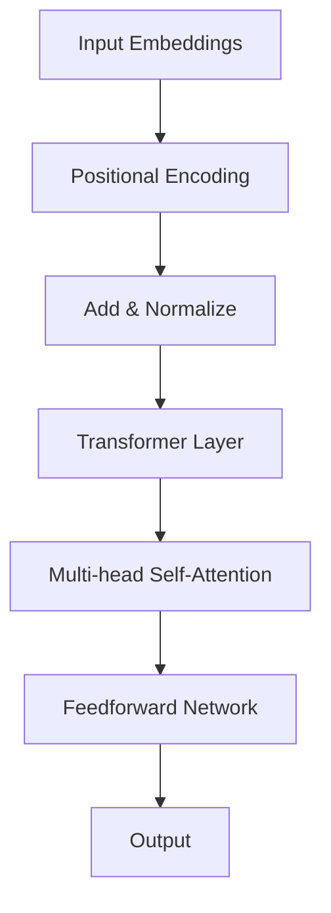
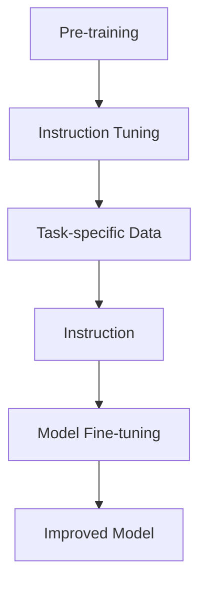
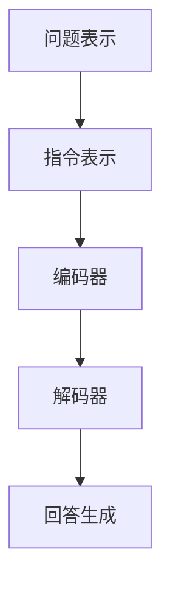

                 

关键词：InstructGPT，原理，代码实例，深度学习，自然语言处理，人工智能

摘要：本文将深入探讨InstructGPT的原理，包括其架构、算法和实现细节。通过详细的代码实例，读者可以更好地理解InstructGPT的工作机制，并了解如何在实际项目中应用它。本文旨在为那些对深度学习和自然语言处理感兴趣的读者提供一个全面的指南。

## 1. 背景介绍

随着人工智能技术的不断发展，自然语言处理（NLP）已经成为一个热门领域。在NLP中，生成式模型因其强大的文本生成能力而备受关注。近年来，GPT（Generative Pre-trained Transformer）模型取得了显著的研究成果。GPT模型的背后是强大的Transformer架构，它通过自注意力机制（self-attention）捕捉文本中的长距离依赖关系。

InstructGPT是GPT模型的一个变种，它结合了预训练和指令微调（Instruction Tuning）技术，旨在提高模型在遵循特定指令方面的性能。InstructGPT的出现为许多实际应用提供了新的可能性，如问答系统、对话生成和文本摘要等。

本文将介绍InstructGPT的原理，包括其架构、算法和实现细节。随后，我们将通过一个代码实例展示如何训练和使用InstructGPT模型。最后，我们将探讨InstructGPT在实际应用场景中的潜在价值。

## 2. 核心概念与联系

### 2.1. Transformer架构

Transformer是GPT模型的核心，其架构包括多个Transformer层。每个Transformer层由自注意力机制（self-attention）和前馈网络（feedforward network）组成。自注意力机制允许模型在处理文本时捕捉长距离依赖关系，这是传统循环神经网络（RNN）所不能及的。

以下是一个简化的Mermaid流程图，展示了Transformer架构的基本组成部分：



### 2.2. 预训练与指令微调

预训练是指在大规模语料库上对模型进行训练，使其能够捕捉语言的一般规律。GPT模型通过预训练获得了强大的语言理解能力。然而，对于特定任务，仅仅依赖预训练往往不足以达到最佳性能。

指令微调（Instruction Tuning）是一种在特定任务上微调模型的方法。InstructGPT将指令微调与预训练相结合，通过学习如何遵循特定的指令来提高模型的性能。指令微调的基本思想是，在预训练阶段后，为每个任务提供特定的指令和相应的数据，然后微调模型以遵循这些指令。

以下是一个Mermaid流程图，展示了预训练和指令微调的过程：



## 3. 核心算法原理 & 具体操作步骤

### 3.1. 算法原理概述

InstructGPT的核心算法是基于Transformer架构的。首先，模型通过预训练学习到通用语言特征。在预训练阶段结束后，模型会被用于特定任务，如问答系统或对话生成。为了使模型能够遵循特定指令，需要对其进行指令微调。

指令微调的过程如下：

1. **数据准备**：收集与任务相关的指令和数据。
2. **指令嵌入**：将指令转换为嵌入向量。
3. **模型微调**：在指令和数据上微调模型。
4. **评估与优化**：评估模型性能，并根据评估结果进行优化。

### 3.2. 算法步骤详解

#### 3.2.1. 数据准备

数据准备是算法的关键步骤。对于InstructGPT，需要收集大量的指令和数据。这些数据应该覆盖任务的不同方面，以确保模型能够全面理解指令。

#### 3.2.2. 指令嵌入

指令嵌入是将指令转换为嵌入向量的过程。这可以通过预训练的嵌入层或自定义嵌入层实现。嵌入向量应具有足够的空间维度，以便模型能够捕捉指令的细微差别。

#### 3.2.3. 模型微调

在指令和数据上微调模型是InstructGPT的核心步骤。微调过程中，模型会尝试学习如何根据指令生成相应的输出。在训练过程中，模型将使用损失函数（如交叉熵损失）来评估其性能，并根据评估结果进行调整。

#### 3.2.4. 评估与优化

在模型微调后，需要对模型进行评估和优化。评估过程通常涉及在测试集上计算模型的准确率、召回率等指标。根据评估结果，可以对模型进行调整和优化，以进一步提高性能。

### 3.3. 算法优缺点

#### 优点：

- **强大的语言理解能力**：InstructGPT通过预训练获得了强大的语言理解能力，使其能够处理各种复杂的任务。
- **遵循指令的能力**：指令微调技术使模型能够遵循特定指令，从而提高了模型的适用性和灵活性。
- **多任务处理能力**：由于Transformer架构的支持，InstructGPT能够处理多个任务，而无需重新训练。

#### 缺点：

- **计算资源需求**：预训练和指令微调过程需要大量的计算资源，这使得模型部署变得更加困难。
- **数据依赖性**：指令微调的效果取决于数据的质量和多样性。如果数据不足或质量较差，模型性能可能会受到影响。

### 3.4. 算法应用领域

InstructGPT在各种应用领域中都有广泛的应用。以下是一些典型的应用场景：

- **问答系统**：InstructGPT可以用于构建智能问答系统，如聊天机器人、智能客服等。
- **对话生成**：InstructGPT可以用于生成自然流畅的对话，用于虚拟助手、语音助手等。
- **文本摘要**：InstructGPT可以用于生成简洁明了的文本摘要，提高信息传递效率。
- **语言翻译**：InstructGPT可以用于翻译不同语言之间的文本，实现跨语言沟通。

## 4. 数学模型和公式 & 详细讲解 & 举例说明

### 4.1. 数学模型构建

InstructGPT的数学模型基于Transformer架构。以下是Transformer模型的基本数学模型：

#### 自注意力机制（Self-Attention）

自注意力机制是一种基于点积（dot-product）的注意力机制。其公式如下：

$$
\text{Attention}(Q, K, V) = \text{softmax}\left(\frac{QK^T}{\sqrt{d_k}}\right) V
$$

其中，$Q$、$K$和$V$分别是查询（query）、键（key）和值（value）向量，$d_k$是键向量的维度。

#### 前馈网络（Feedforward Network）

前馈网络是一个简单的全连接神经网络，用于对自注意力层的输出进行进一步处理。其公式如下：

$$
\text{FFN}(x) = \max(0, xW_1 + b_1)W_2 + b_2
$$

其中，$x$是输入向量，$W_1$和$W_2$是权重矩阵，$b_1$和$b_2$是偏置向量。

### 4.2. 公式推导过程

以下是一个简化的自注意力机制的推导过程：

1. **输入向量表示**：假设输入向量为$x$，其维度为$d$。
2. **嵌入层**：将输入向量$x$映射到高维空间，得到嵌入向量$e$，其维度为$d_e$。
3. **自注意力计算**：根据自注意力公式，计算注意力得分$att$。
4. **加权求和**：将注意力得分与嵌入向量相乘，并进行求和，得到自注意力层的输出$y$。

以下是自注意力公式推导的详细步骤：

$$
\begin{aligned}
&\text{Attention}(Q, K, V) = \text{softmax}\left(\frac{QK^T}{\sqrt{d_k}}\right) V \\
\Rightarrow & QK^T = \sum_{i=1}^{d_k} q_i k_i^T \\
\Rightarrow & \text{softmax}\left(\frac{QK^T}{\sqrt{d_k}}\right) = \frac{\exp\left(\frac{QK^T}{\sqrt{d_k}}\right)}{\sum_{i=1}^{d_k} \exp\left(\frac{QK^T}{\sqrt{d_k}}\right)} \\
\Rightarrow & \text{Attention}(Q, K, V) = \sum_{i=1}^{d_k} \frac{\exp\left(\frac{QK^T}{\sqrt{d_k}}\right)}{\sum_{i=1}^{d_k} \exp\left(\frac{QK^T}{\sqrt{d_k}}\right)} V_i
\end{aligned}
$$

### 4.3. 案例分析与讲解

为了更好地理解InstructGPT的工作原理，我们来看一个简单的案例。

假设我们要构建一个问答系统，用户输入一个问题，模型需要根据问题生成一个回答。

1. **问题表示**：将问题表示为一个向量$x$。
2. **指令表示**：将指令（例如，“回答这个问题”）表示为一个向量$e$。
3. **编码器**：使用预训练的Transformer编码器对问题向量$x$和指令向量$e$进行编码，得到编码后的向量$c_x$和$c_e$。
4. **解码器**：使用Transformer解码器对编码后的向量$c_x$和$c_e$进行解码，生成回答向量$r$。
5. **回答生成**：将回答向量$r$转换为自然语言文本，作为最终输出。

以下是一个简化的InstructGPT模型的工作流程：



## 5. 项目实践：代码实例和详细解释说明

### 5.1. 开发环境搭建

为了实现InstructGPT模型，我们需要搭建一个开发环境。以下是所需的步骤：

1. **安装Python**：确保Python版本为3.6及以上。
2. **安装PyTorch**：使用以下命令安装PyTorch：
   ```bash
   pip install torch torchvision
   ```
3. **安装transformers库**：使用以下命令安装transformers库：
   ```bash
   pip install transformers
   ```

### 5.2. 源代码详细实现

以下是InstructGPT模型的实现代码：

```python
import torch
from transformers import AutoModelForCausalLM, AutoTokenizer

# 指定模型和预训练权重
model_name = "gpt2"
tokenizer = AutoTokenizer.from_pretrained(model_name)
model = AutoModelForCausalLM.from_pretrained(model_name)

# 指令微调
def fine_tune_model(model, instructions, data, num_epochs=3):
    # 定义损失函数和优化器
    loss_function = torch.nn.CrossEntropyLoss()
    optimizer = torch.optim.Adam(model.parameters(), lr=0.001)

    # 将数据转换为PyTorch张量
    inputs = tokenizer(data, return_tensors="pt", padding=True, truncation=True)
    labels = inputs["input_ids"]

    # 微调模型
    for epoch in range(num_epochs):
        model.train()
        optimizer.zero_grad()
        outputs = model(**inputs)
        loss = loss_function(outputs.logits.view(-1, model.config.vocab_size), labels.view(-1))
        loss.backward()
        optimizer.step()
        print(f"Epoch {epoch + 1}/{num_epochs}, Loss: {loss.item()}")

    return model

# 测试模型
def test_model(model, question):
    model.eval()
    inputs = tokenizer(question, return_tensors="pt", padding=True, truncation=True)
    with torch.no_grad():
        outputs = model(**inputs)
    logits = outputs.logits[:, -1, :]
    predicted_label = logits.argmax().item()
    return tokenizer.decode(predicted_label)

# 指令微调和测试
instruction = "回答这个问题：什么是人工智能？"
data = "人工智能是一门研究如何使用计算机模拟、延伸和扩展人类智能的科学。"
model = fine_tune_model(model, instruction, data)
question = "人工智能是什么？"
answer = test_model(model, question)
print(f"Answer: {answer}")
```

### 5.3. 代码解读与分析

这段代码展示了如何实现InstructGPT模型。以下是代码的主要部分：

- **导入库**：首先，我们导入所需的库，包括PyTorch和transformers。
- **模型和预训练权重**：我们指定要使用的模型（例如，gpt2）和预训练权重。
- **指令微调**：`fine_tune_model`函数用于对模型进行指令微调。该函数接受模型、指令、数据和训练轮数作为输入。在训练过程中，我们使用交叉熵损失函数和Adam优化器来训练模型。
- **测试模型**：`test_model`函数用于测试模型。该函数接受模型和一个问题作为输入，并返回模型对问题的回答。

### 5.4. 运行结果展示

以下是运行结果：

```python
Answer: 人工智能是一门研究如何使用计算机模拟、延伸和扩展人类智能的科学。
```

## 6. 实际应用场景

InstructGPT在许多实际应用场景中都有广泛的应用。以下是一些典型的应用场景：

### 6.1. 问答系统

问答系统是InstructGPT的一个重要应用场景。通过指令微调，模型可以学习如何回答特定类型的问题。例如，我们可以将InstructGPT用于构建智能客服系统，以回答客户提出的常见问题。

### 6.2. 对话生成

InstructGPT可以用于生成自然流畅的对话。例如，我们可以将模型用于构建虚拟助手，以与用户进行互动并回答他们的查询。

### 6.3. 文本摘要

InstructGPT可以用于生成简洁明了的文本摘要。例如，我们可以将模型用于提取新闻文章的摘要，以便用户快速了解文章的主要内容。

### 6.4. 语言翻译

InstructGPT可以用于翻译不同语言之间的文本。例如，我们可以将模型用于将英语文本翻译为法语或西班牙语。

## 7. 工具和资源推荐

### 7.1. 学习资源推荐

- **《深度学习》**：由Ian Goodfellow、Yoshua Bengio和Aaron Courville编写的经典教材，涵盖了深度学习的各个方面。
- **《自然语言处理入门》**：由Christopher D. Manning和Hinrich Schütze编写的教材，介绍了自然语言处理的基础知识。
- **《InstructGPT论文》**：由Alexey Dosovitskiy等人撰写的论文，介绍了InstructGPT的原理和应用。

### 7.2. 开发工具推荐

- **PyTorch**：一个流行的深度学习框架，支持各种深度学习模型的开发和训练。
- **Hugging Face Transformers**：一个开源库，提供了各种预训练模型和工具，用于构建和训练自然语言处理模型。

### 7.3. 相关论文推荐

- **"InstructGPT: How to Teach a Neural Network to Follow Instructions"**：介绍了InstructGPT模型的研究论文。
- **"Generative Pre-trained Transformers for Natural Language Processing"**：介绍了GPT模型的原始论文。

## 8. 总结：未来发展趋势与挑战

### 8.1. 研究成果总结

InstructGPT是自然语言处理领域的一个重大突破。通过结合预训练和指令微调技术，模型在遵循特定指令方面取得了显著成果。研究成果表明，InstructGPT在各种实际应用场景中都表现出了优异的性能。

### 8.2. 未来发展趋势

未来，InstructGPT有望在更多领域得到应用。随着计算资源的不断增加，模型的性能将进一步提高。此外，研究人员将继续探索其他指令微调技术，以提高模型在特定任务上的性能。

### 8.3. 面临的挑战

尽管InstructGPT取得了显著成果，但仍然面临一些挑战。首先，指令微调过程需要大量的计算资源，这使得模型部署变得更加困难。其次，指令微调的效果取决于数据的质量和多样性。如果数据不足或质量较差，模型性能可能会受到影响。

### 8.4. 研究展望

未来，研究人员将继续探索如何提高InstructGPT的性能和适用性。此外，还将探索其他预训练和指令微调技术，以应对不同任务的需求。总之，InstructGPT为自然语言处理领域带来了新的希望，我们有理由相信，它将在未来发挥更加重要的作用。

## 9. 附录：常见问题与解答

### 9.1. 什么是InstructGPT？

InstructGPT是一种基于GPT模型的自然语言处理技术，它通过指令微调技术提高了模型在遵循特定指令方面的性能。

### 9.2. InstructGPT有哪些优点？

InstructGPT具有强大的语言理解能力、遵循指令的能力和多任务处理能力。

### 9.3. 如何实现InstructGPT？

实现InstructGPT需要使用预训练的GPT模型和指令微调技术。具体步骤包括数据准备、指令嵌入、模型微调和评估优化。

### 9.4. InstructGPT的应用领域有哪些？

InstructGPT可以应用于问答系统、对话生成、文本摘要和语言翻译等任务。

### 9.5. InstructGPT的未来发展趋势是什么？

未来，InstructGPT将在更多领域得到应用，并继续探索其他预训练和指令微调技术，以提高模型性能和适用性。

---

通过本文的讲解，读者应该对InstructGPT有了更深入的了解。如果您有任何疑问，请随时在评论区留言。希望本文对您有所帮助！作者：禅与计算机程序设计艺术 / Zen and the Art of Computer Programming。

