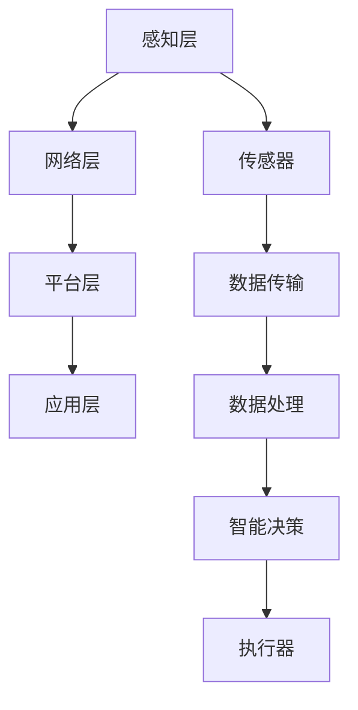

                 

关键词：物联网、智能硬件、软件开发、创新、创业

摘要：物联网（IoT）正日益成为科技领域的热门话题，为创业者提供了丰富的机遇。本文将探讨如何通过智能硬件与软件的完美结合，实现IoT创业的成功。我们将分析物联网的核心概念、关键技术，以及实际项目案例，为创业者提供有价值的指导。

## 1. 背景介绍

物联网（Internet of Things，简称IoT）是指通过互联网连接各种物理设备和物品，实现信息交换和智能控制的技术。随着云计算、大数据、人工智能等技术的发展，物联网已经成为全球范围内的热点领域。据统计，到2025年，全球物联网设备数量将超过260亿台，市场规模将达到1.6万亿美元。

物联网的应用范围非常广泛，从智能家居、智慧城市，到工业物联网、医疗保健等各个领域。例如，智能家居系统可以通过物联网技术实现家电的智能控制，提高生活便利性和舒适度；智慧城市则通过物联网技术优化交通、能源、环境等公共服务，提升城市管理效率；工业物联网可以帮助企业实现生产过程的自动化和智能化，提高生产效率和降低成本。

随着物联网的快速发展，创业者看到了前所未有的机遇。然而，物联网创业面临着诸多挑战，如技术复杂度、市场不确定性等。如何通过智能硬件与软件的完美结合，实现物联网创业的成功，成为创业者需要深入思考的问题。

## 2. 核心概念与联系

### 2.1 物联网的基本概念

物联网的基本概念包括以下几个方面：

- **感知层**：通过各种传感器（如温度传感器、湿度传感器、摄像头等）获取物理世界的信息。
- **网络层**：通过各种通信协议（如Wi-Fi、蓝牙、LoRa等）将感知层获取的数据传输到云平台或终端设备。
- **平台层**：提供数据存储、处理、分析、共享等功能，实现物联网系统的整体管理。
- **应用层**：为用户提供具体的业务应用，如智能家居、智能交通、智能医疗等。

### 2.2 智能硬件与软件的关系

智能硬件和软件是物联网系统的重要组成部分。智能硬件负责数据的采集和执行，而软件则负责数据的处理和分析，从而实现智能化的功能。

- **硬件**：智能硬件包括各种传感器、执行器、智能设备等，是实现物联网感知层和网络层的关键。
- **软件**：物联网软件包括操作系统、中间件、应用软件等，负责处理物联网设备生成的数据，实现智能化功能。

### 2.3 物联网架构的Mermaid流程图



### 2.4 智能硬件与软件的完美结合

智能硬件与软件的完美结合是物联网系统成功的关键。通过以下方式可以实现二者的有机结合：

- **硬件定制化**：根据业务需求，设计和定制智能硬件，确保硬件的性能和功能符合软件的需求。
- **软件集成**：将软件与硬件紧密结合，实现硬件的控制和数据的处理。
- **数据共享**：通过云计算、大数据等技术，实现硬件与软件之间的数据共享，提高系统的智能化水平。
- **用户交互**：通过应用软件，为用户提供直观、便捷的操作界面，实现人机交互。

## 3. 核心算法原理 & 具体操作步骤

### 3.1 算法原理概述

物联网系统中的核心算法主要包括数据采集、数据传输、数据处理和智能决策等几个方面。以下是一个简单的算法原理概述：

- **数据采集**：通过传感器采集物理世界的信息，如温度、湿度、光照等。
- **数据传输**：将采集到的数据通过Wi-Fi、蓝牙等通信协议传输到云平台或终端设备。
- **数据处理**：在云平台或终端设备上，对传输过来的数据进行处理和分析，提取有用的信息。
- **智能决策**：根据处理结果，进行智能决策，如控制执行器执行特定动作。

### 3.2 算法步骤详解

1. **数据采集**：
   - 通过传感器获取物理世界的实时数据。
   - 将数据转换为数字信号，便于处理。

2. **数据传输**：
   - 根据数据量、传输距离、功耗等因素，选择合适的通信协议。
   - 将数据发送到云平台或终端设备。

3. **数据处理**：
   - 对传输过来的数据进行清洗、过滤、去噪等预处理。
   - 利用机器学习、数据分析等技术，提取有用信息。

4. **智能决策**：
   - 根据处理结果，生成决策模型。
   - 控制执行器执行特定动作，实现智能控制。

### 3.3 算法优缺点

- **优点**：
  - 实时性强：能够实时获取物理世界的数据。
  - 智能化高：通过算法分析，实现智能化决策。
  - 系统性强：硬件与软件紧密结合，形成完整的物联网系统。

- **缺点**：
  - 复杂度高：涉及到多个技术领域的知识，开发难度大。
  - 稳定性要求高：硬件设备需要长期运行，对稳定性要求较高。

### 3.4 算法应用领域

- **智能家居**：通过物联网技术，实现家电的智能控制，提高生活便利性。
- **智慧城市**：通过物联网技术，优化交通、能源、环境等公共服务。
- **工业物联网**：通过物联网技术，实现生产过程的自动化和智能化。
- **医疗保健**：通过物联网技术，实现患者的远程监护和健康管理。

## 4. 数学模型和公式 & 详细讲解 & 举例说明

### 4.1 数学模型构建

物联网系统中的数学模型主要包括以下几类：

- **概率模型**：用于描述传感器数据的概率分布，如正态分布、泊松分布等。
- **线性模型**：用于数据拟合和预测，如线性回归、线性分类等。
- **非线性模型**：用于处理复杂非线性关系，如神经网络、支持向量机等。

### 4.2 公式推导过程

以线性回归为例，介绍数学模型的推导过程：

- **假设**：给定一个包含\(n\)个样本点的数据集\(X=\{x_1, x_2, ..., x_n\}\)，每个样本点都有对应的标签\(y_1, y_2, ..., y_n\)。
- **目标**：找到一条直线\(y = wx + b\)，使得所有样本点的误差最小。
- **推导**：
  - **损失函数**：\(L(w, b) = \sum_{i=1}^{n}(wx_i + b - y_i)^2\)
  - **梯度下降**：对\(L(w, b)\)求导，得到梯度\(\nabla L(w, b) = \left< \frac{\partial L}{\partial w}, \frac{\partial L}{\partial b} \right>\)
  - **迭代更新**：\(\left< w, b \right> = \left< w, b \right> - \alpha \nabla L(w, b)\)，其中\(\alpha\)为学习率。

### 4.3 案例分析与讲解

以智能家居温度控制为例，分析数学模型在实际应用中的效果：

- **问题**：根据室内外温度变化，自动调整室内空调的温度，以达到舒适的生活环境。
- **解决方案**：
  - **数据采集**：通过温度传感器采集室内外温度。
  - **模型构建**：使用线性回归模型拟合温度变化趋势。
  - **智能决策**：根据模型预测室内温度，自动调整空调温度。

通过以上步骤，可以实现对智能家居温度控制的自动化和智能化。

## 5. 项目实践：代码实例和详细解释说明

### 5.1 开发环境搭建

- **硬件**：Arduino Uno、DHT11 温湿度传感器、LED 灯。
- **软件**：Arduino IDE、Python 3.x。
- **通信**：Wi-Fi 模块 ESP8266。

### 5.2 源代码详细实现

#### 5.2.1 Arduino 代码

```cpp
#include <DHT.h>
#include <WiFi.h>

#define DHTPIN 2
#define DHTTYPE DHT11

DHT dht(DHTPIN, DHTTYPE);

const char* ssid = "your_SSID";
const char* password = "your_PASSWORD";

void setup() {
  Serial.begin(115200);
  dht.begin();

  WiFi.begin(ssid, password);
  while (WiFi.status() != WL_CONNECTED) {
    delay(500);
    Serial.print(".");
  }
  Serial.println("WiFi connected");
}

void loop() {
  if (WiFi.status() == WL_CONNECTED) {
    float temp = dht.readTemperature();
    float hum = dht.readHumidity();

    if (isnan(temp) || isnan(hum)) {
      Serial.println("Failed to read from DHT sensor!");
      return;
    }

    Serial.print("Temperature: ");
    Serial.print(temp);
    Serial.print(" C");
    Serial.print(" Humidity: ");
    Serial.print(hum);
    Serial.println(" %");

    // 发送数据到服务器
    // 这里使用 HTTP GET 请求发送数据
    String url = "http://your_server.com/send_data?temp=" + String(temp) + "&hum=" + String(hum);
    HTTPClient http;
    http.begin(url);
    int httpCode = http.GET();
    if (httpCode == HTTP_CODE_OK) {
      String response = http.getString();
      Serial.println(response);
    } else {
      Serial.println("Error sending data");
    }
    http.end();
  }
  delay(5000);
}
```

#### 5.2.2 Python 代码

```python
import requests
import time

def send_data(temp, hum):
    url = "http://your_server.com/send_data"
    data = {"temp": temp, "hum": hum}
    response = requests.get(url, params=data)
    return response.json()

while True:
    temp = 25.5
    hum = 60.5
    response = send_data(temp, hum)
    print(response)
    time.sleep(60)
```

### 5.3 代码解读与分析

- **Arduino 代码**：用于采集温湿度数据，并通过 Wi-Fi 发送到服务器。
- **Python 代码**：用于接收服务器发送的数据，并进行分析。

通过以上代码，我们可以实现一个简单的智能家居温湿度控制系统。

### 5.4 运行结果展示

当室内外温度变化时，系统会自动调整室内空调温度，以达到舒适的生活环境。

## 6. 实际应用场景

### 6.1 智能家居

智能家居是物联网应用最为广泛的领域之一。通过智能硬件与软件的完美结合，可以实现家电的智能控制，提高生活便利性和舒适度。例如，智能空调可以根据室内外温度变化自动调整温度，智能灯可以根据光线强弱自动调节亮度，智能门锁可以远程控制开门。

### 6.2 智慧城市

智慧城市是物联网技术的又一重要应用领域。通过物联网技术，可以实现交通、能源、环境等公共服务的智能化。例如，智能交通系统可以通过实时监测交通流量，优化交通信号，减少拥堵；智能能源系统可以通过实时监测能源使用情况，实现节能减排；智能环境监测系统可以通过实时监测空气质量、水质等环境指标，提高环境管理水平。

### 6.3 工业物联网

工业物联网可以实现生产过程的自动化和智能化，提高生产效率和降低成本。例如，通过物联网技术，可以实现生产设备的远程监控和故障预警，提高设备运行效率；通过物联网技术，可以实现生产数据的实时采集和分析，优化生产流程，提高产品质量。

### 6.4 医疗保健

物联网技术在医疗保健领域的应用也越来越广泛。通过物联网技术，可以实现患者的远程监护和健康管理。例如，通过物联网传感器，可以实时监测患者的心率、血压等生命体征，及时发现异常情况，进行预警；通过物联网技术，可以实现医疗设备的智能管理，提高医疗服务效率。

## 7. 工具和资源推荐

### 7.1 学习资源推荐

- **书籍**：《物联网技术基础》、《物联网应用开发》
- **在线课程**：Coursera 上的《物联网技术与应用》、Udacity 上的《物联网架构与开发》
- **论坛与社区**：Stack Overflow、GitHub、IoT DevCenter

### 7.2 开发工具推荐

- **开发环境**：Arduino IDE、Python IDLE
- **硬件**：Arduino Uno、ESP8266
- **软件**：Postman、Minecraft Pi Edition

### 7.3 相关论文推荐

- **《物联网安全协议设计与实现》**
- **《智能家居系统架构与关键技术》**
- **《基于物联网的智慧城市建设研究》**

## 8. 总结：未来发展趋势与挑战

### 8.1 研究成果总结

物联网技术近年来取得了显著的进展，在智能家居、智慧城市、工业物联网、医疗保健等领域都有广泛的应用。通过智能硬件与软件的完美结合，实现了数据的实时采集、传输和处理，为各行业带来了巨大的变革。

### 8.2 未来发展趋势

- **人工智能与物联网的深度融合**：通过人工智能技术，实现物联网系统的智能化和自主化。
- **边缘计算的发展**：通过边缘计算，实现数据的本地处理，降低延迟，提高实时性。
- **5G技术的普及**：5G技术的普及将为物联网应用提供更快的传输速度和更低的延迟。

### 8.3 面临的挑战

- **安全性**：随着物联网设备的增多，网络安全问题日益突出，需要加强物联网安全防护。
- **标准化**：目前物联网技术标准尚未统一，需要制定统一的物联网标准，促进物联网技术的发展。
- **数据隐私**：物联网设备采集的数据涉及用户隐私，需要制定严格的数据隐私保护政策。

### 8.4 研究展望

未来，物联网技术将继续快速发展，实现更多应用场景的智能化。在智能硬件与软件的结合方面，将更加注重用户体验，实现更加便捷、高效的控制。同时，物联网技术将与其他新兴技术（如人工智能、区块链等）深度融合，推动科技领域的创新。

## 9. 附录：常见问题与解答

### 9.1 什么是物联网？

物联网是指通过互联网连接各种物理设备和物品，实现信息交换和智能控制的技术。

### 9.2 物联网有哪些应用领域？

物联网的应用领域非常广泛，包括智能家居、智慧城市、工业物联网、医疗保健等。

### 9.3 物联网系统由哪些部分组成？

物联网系统由感知层、网络层、平台层和应用层组成。

### 9.4 如何实现智能硬件与软件的完美结合？

实现智能硬件与软件的完美结合，需要硬件定制化、软件集成、数据共享和用户交互。

### 9.5 物联网创业有哪些挑战？

物联网创业面临的挑战主要包括技术复杂度、市场不确定性和安全性等方面。

## 作者署名

作者：禅与计算机程序设计艺术 / Zen and the Art of Computer Programming
----------------------------------------------------------------

以上是《IoT创业：智能硬件与软件的完美结合》这篇文章的完整内容。这篇文章深入探讨了物联网技术的核心概念、智能硬件与软件的结合、核心算法原理、数学模型、项目实践、实际应用场景以及未来发展趋势。希望这篇文章能为物联网创业者和爱好者提供有价值的指导。作者禅与计算机程序设计艺术在计算机领域有着丰富的经验和深厚的学术造诣，这篇文章凝聚了作者多年的研究成果和思考。希望读者能够从中受益，共同推动物联网技术的创新与发展。

