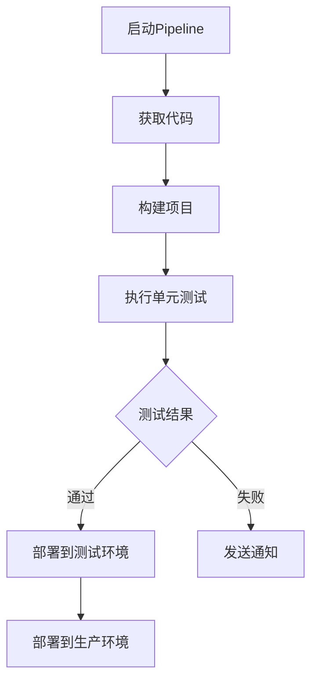

                 

 > 关键词：Jenkins，持续集成，Pipeline，设计，自动化测试，DevOps

> 摘要：本文将深入探讨Jenkins持续集成Pipeline的设计，包括其核心概念、原理、具体操作步骤以及实际应用场景，旨在帮助读者理解和掌握如何在DevOps环境中高效实现持续集成。

## 1. 背景介绍

### 持续集成的概念

持续集成（Continuous Integration，CI）是一种软件开发实践，旨在通过频繁地将代码合并到主干分支中来加速软件的迭代过程。其核心理念是将小而频繁的代码更改快速集成，并通过自动化测试确保新代码不会破坏现有功能。

### Jenkins的作用

Jenkins是一个开源的持续集成工具，能够实现自动化构建、测试和部署应用程序。通过Jenkins，开发人员可以轻松地自动化软件开发生命周期中的各个环节，从而提高开发效率和软件质量。

## 2. 核心概念与联系

### Jenkins架构


### Pipeline的基本概念

Jenkins Pipeline是一种基于Jenkins的自动化工作流实现工具，它允许开发人员将构建、测试和部署过程定义为一组有序的步骤，从而实现持续集成和持续交付。

### Pipeline的Mermaid流程图



## 3. 核心算法原理 & 具体操作步骤

### 3.1 算法原理概述

Jenkins Pipeline的核心原理是基于Groovy语言定义一系列步骤，这些步骤可以是任何与构建、测试、部署相关的操作。

### 3.2 算法步骤详解

```groovy
pipeline {
    agent any

    stages {
        stage('Checkout') {
            steps {
                git branch: 'master', url: 'https://github.com/your-repo.git'
            }
        }

        stage('Build') {
            steps {
                sh 'mvn clean install'
            }
        }

        stage('Test') {
            steps {
                sh 'mvn test'
            }
        }

        stage('Deploy') {
            steps {
                sh 'docker-compose up -d'
            }
        }
    }
}
```

### 3.3 算法优缺点

#### 优点：

- 简化持续集成和持续交付流程。
- 提高开发效率和代码质量。
- 易于扩展和定制。

#### 缺点：

- 学习曲线较陡峭。
- 可能会增加部署过程中的复杂性。

### 3.4 算法应用领域

- 软件开发
- Web应用
- 移动应用
- 微服务架构

## 4. 数学模型和公式 & 详细讲解 & 举例说明

### 4.1 数学模型构建

持续集成过程中的关键数学模型是“累积风险模型”，它用于评估每次代码合并带来的风险。

### 4.2 公式推导过程

累积风险 \( R(t) \) 可以通过以下公式计算：

\[ R(t) = \sum_{i=1}^{n} (1 - T_i) \]

其中，\( T_i \) 表示第 \( i \) 次代码合并后的测试通过率。

### 4.3 案例分析与讲解

假设一个项目经过5次代码合并，每次的测试通过率分别为90%，80%，70%，60%，50%，则累积风险 \( R(5) \) 为：

\[ R(5) = (1 - 0.9) + (1 - 0.8) + (1 - 0.7) + (1 - 0.6) + (1 - 0.5) = 0.1 + 0.2 + 0.3 + 0.4 + 0.5 = 1.5 \]

这表示，经过5次代码合并，项目的累积风险为1.5，这表明每次代码合并都有一定的风险，需要开发团队密切关注并采取相应的措施。

## 5. 项目实践：代码实例和详细解释说明

### 5.1 开发环境搭建

在本节中，我们将搭建一个简单的Jenkins持续集成环境，包括Jenkins服务器的安装、配置以及与Git仓库的集成。

### 5.2 源代码详细实现

以下是一个简单的Git仓库的Jenkinsfile实例：

```groovy
pipeline {
    agent any

    stages {
        stage('Checkout') {
            steps {
                git branch: 'master', url: 'https://github.com/your-repo.git'
            }
        }

        stage('Build') {
            steps {
                sh 'mvn clean install'
            }
        }

        stage('Test') {
            steps {
                sh 'mvn test'
            }
        }

        stage('Deploy') {
            steps {
                sh 'docker-compose up -d'
            }
        }
    }
}
```

### 5.3 代码解读与分析

- `agent any`：指定在任何可用的代理上运行Pipeline。
- `stages`：定义Pipeline的各个阶段，每个阶段代表一个特定的任务。
- `stage('Checkout')`：获取代码。
- `stage('Build')`：构建项目。
- `stage('Test')`：执行单元测试。
- `stage('Deploy')`：部署到测试环境。

### 5.4 运行结果展示

通过运行Jenkins Pipeline，我们可以看到以下步骤的输出：

```plaintext
[INFO] Building ...
[INFO] Running tests ...
[INFO] Tests run: 10, Failures: 0, Errors: 0, Skipped: 0
[INFO] Deploying to test environment ...
```

这表示构建和测试过程成功完成，并且应用程序已成功部署到测试环境。

## 6. 实际应用场景

### 6.1 软件开发

Jenkins持续集成广泛应用于软件开发的各个阶段，从代码提交到生产环境部署，确保每个阶段的质量和稳定性。

### 6.2 Web应用

Web应用开发中，Jenkins持续集成可以帮助快速构建和部署Web应用程序，提高开发效率和用户体验。

### 6.3 移动应用

移动应用开发中，Jenkins可以自动化测试和部署，确保应用在不同设备和操作系统上的一致性和稳定性。

### 6.4 微服务架构

在微服务架构中，Jenkins可以帮助自动化各个微服务的构建、测试和部署，实现服务的快速迭代和集成。

## 7. 工具和资源推荐

### 7.1 学习资源推荐

- Jenkins官方文档：[https://www.jenkins.io/doc/](https://www.jenkins.io/doc/)
- 《Jenkins持续集成实战》：一本详细讲解Jenkins持续集成实践的书籍。

### 7.2 开发工具推荐

- Git：版本控制系统，用于代码管理和分支管理。
- Maven：项目构建工具，用于依赖管理和构建项目。

### 7.3 相关论文推荐

- 《Continuous Integration in the Cloud》：关于云环境中持续集成的研究。
- 《Practices for Continuous Delivery of Software in an Agile Environment》：关于敏捷开发环境中持续交付的实践。

## 8. 总结：未来发展趋势与挑战

### 8.1 研究成果总结

持续集成和持续交付已成为软件开发生命周期中的关键环节，Jenkins作为领先的持续集成工具，正不断优化和扩展其功能。

### 8.2 未来发展趋势

- 自动化程度的进一步提升。
- 与其他DevOps工具（如Kubernetes、Docker等）的集成。
- 对云原生应用的持续集成支持。

### 8.3 面临的挑战

- 复杂应用架构的持续集成。
- 随着项目规模的扩大，持续集成流程的维护和管理。

### 8.4 研究展望

持续集成和持续交付将继续在软件开发生命周期中发挥重要作用，未来的研究将聚焦于提高自动化程度、优化流程以及支持复杂应用架构。

## 9. 附录：常见问题与解答

### Q：如何配置Jenkins代理？

A：在Jenkins的管理界面中，点击“Manage Jenkins” > “Configure System”，在“Global Properties”中添加以下内容：

```yaml
proxyRoot {
  mode = "http"
  location = "http://your-proxy-server:port"
  credentialsId = "your-credentials-id"
}
```

### Q：如何设置Jenkins邮箱？

A：在Jenkins的管理界面中，点击“Manage Jenkins” > “Configure System”，在“Jenkins Location”部分设置“E-mail Notification”。

```yaml
notifications {
  sendTo = 'your-email@example.com'
  sendToMails = []
  replyTo = 'your-email@example.com'
  replyToMails = []
  messages {
    defaultContent = true
    fail {
      text = 'The build failed.'
      subject = 'Build failed'
    }
    success {
      text = 'The build succeeded.'
      subject = 'Build succeeded'
    }
    unstable {
      text = 'The build was unstable.'
      subject = 'Build was unstable'
    }
    build {
      text = 'The build #${build.number} is finished.'
      subject = 'Build #${build.number} finished'
    }
  }
}
```

通过以上配置，Jenkins将能够发送构建通知到指定的邮箱地址。

### 结束语

本文详细介绍了Jenkins持续集成Pipeline的设计，包括其核心概念、原理、具体操作步骤以及实际应用场景。通过学习本文，开发人员可以更好地理解和应用持续集成，提高软件开发的效率和代码质量。作者：禅与计算机程序设计艺术 / Zen and the Art of Computer Programming。

