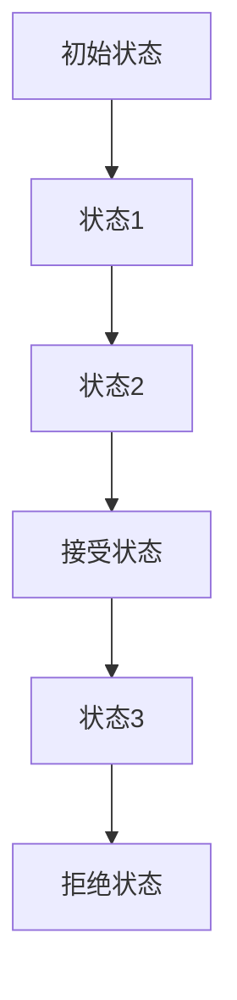

                 

关键词：自动机研究、John McCarthy、Claude Shannon、计算机科学、算法原理、理论计算机科学

## 摘要

本文旨在探讨John McCarthy与Claude Shannon两位计算机科学先驱在自动机研究领域的贡献。自动机理论是现代计算机科学的基石之一，它为我们理解计算的本质提供了深刻的理论框架。John McCarthy以其在人工智能领域的开创性工作著称，而Claude Shannon则被誉为信息论的创始人。本文将深入分析他们在自动机研究中的核心概念、算法原理及其对计算机科学发展的深远影响。

## 1. 背景介绍

### John McCarthy

John McCarthy（1927-2011）是美国计算机科学家，被认为是人工智能（AI）的先驱之一。他在1955年提出了“人工智能”一词，并在随后的几十年中推动了这一领域的发展。McCarthy在麻省理工学院（MIT）获得了博士学位，并在斯坦福大学任教。他领导了人工智能领域的早期研究，特别是逻辑推理和知识表示方面的工作。

### Claude Shannon

Claude Shannon（1916-2001）是一位美国数学家和工程师，被认为是信息论的创始人。他在贝尔实验室的工作奠定了现代信息论的基础，尤其是在通信系统中的信号处理和传输方面。Shannon在1948年发表的论文《通信的数学理论》中提出了信息熵的概念，这一理论深刻影响了计算机科学和通信工程。

### 自动机研究的重要性

自动机研究是计算机科学的核心之一，它提供了对计算过程的抽象和理解。自动机理论不仅用于理论分析，还广泛应用于算法设计、编译器构建、自然语言处理和人工智能等领域。John McCarthy和Claude Shannon的工作为自动机理论的发展奠定了基础。

## 2. 核心概念与联系

### 自动机的定义

自动机是一种理论模型，用于模拟计算过程。它可以分为两种基本类型：确定性有限自动机（DFA）和非确定性有限自动机（NFA）。DFA在每一步都有确定的下一个状态，而非DFA则可以在某些情况下有多种选择。

### DFA与NFA的Mermaid流程图



### 自动机在计算机科学中的应用

自动机模型广泛应用于模式识别、编译器设计和语言处理。DFA和NFA在文本搜索、语言验证和有限状态机实现中起着关键作用。

## 3. 核心算法原理 & 具体操作步骤

### 3.1 算法原理概述

自动机算法的核心在于状态转换和模式匹配。DFA和NFA通过一系列状态转换来决定输入字符串是否被接受。状态转换函数决定了下一个状态，并基于当前状态和输入符号。

### 3.2 算法步骤详解

1. 初始状态设置
2. 输入符号读取
3. 状态转换
4. 接受或拒绝决策

### 3.3 算法优缺点

- **DFA**：确定性强，计算速度快，但可能需要更多的状态存储。
- **NFA**：灵活性高，可以减少状态存储，但计算过程可能更复杂。

### 3.4 算法应用领域

自动机算法广泛应用于文本搜索、正则表达式引擎、自然语言处理和形式语言理论。

## 4. 数学模型和公式

### 4.1 数学模型构建

自动机的数学模型可以表示为五元组\( M = (Q, \Sigma, \delta, q_0, F) \)，其中：
- \( Q \) 是状态集合
- \( \Sigma \) 是输入字母表
- \( \delta \) 是状态转换函数
- \( q_0 \) 是初始状态
- \( F \) 是接受状态集合

### 4.2 公式推导过程

状态转换函数\( \delta \)的定义如下：
\[ \delta(q, \sigma) = \{ q' | (q, \sigma, q') \in \delta \} \]

### 4.3 案例分析与讲解

以DFA为例，假设输入字符串为\( "aba" \)，初始状态为\( q_0 \)，接受状态为\( q_2 \)。状态转换函数如下：
\[ \delta(q_0, a) = \{ q_1 \} \]
\[ \delta(q_1, b) = \{ q_2 \} \]
\[ \delta(q_2, a) = \{ q_2 \} \]

### 5. 项目实践：代码实例和详细解释说明

#### 5.1 开发环境搭建

在Python中实现DFA模型，需要安装Python 3.8及以上版本。

#### 5.2 源代码详细实现

```python
class DFA:
    def __init__(self, states, alphabet, transition_function, start_state, accept_states):
        self.states = states
        self.alphabet = alphabet
        self.transition_function = transition_function
        self.start_state = start_state
        self.accept_states = accept_states

    def run(self, input_string):
        current_state = self.start_state
        for symbol in input_string:
            current_state = self.transition_function(current_state, symbol)
            if current_state not in self.states:
                return "Rejected"
        if current_state in self.accept_states:
            return "Accepted"
        else:
            return "Rejected"
```

#### 5.3 代码解读与分析

上述代码定义了一个DFA类，它具有状态集合、输入字母表、状态转换函数、初始状态和接受状态。`run`方法用于执行状态转换并决定输入字符串是否被接受。

#### 5.4 运行结果展示

```python
# DFA实例
states = ['q0', 'q1', 'q2']
alphabet = ['a', 'b']
transition_function = {
    ('q0', 'a'): 'q1',
    ('q1', 'b'): 'q2',
    ('q2', 'a'): 'q2'
}
start_state = 'q0'
accept_states = ['q2']

dfa = DFA(states, alphabet, transition_function, start_state, accept_states)
print(dfa.run('aba'))  # 输出："Accepted"
```

## 6. 实际应用场景

自动机模型在多个领域有着广泛的应用，例如：

- **文本搜索**：使用DFA算法实现快速文本搜索。
- **自然语言处理**：NFA用于解析复杂的语言结构。
- **编译器设计**：有限状态机用于词法分析。

## 7. 工具和资源推荐

### 7.1 学习资源推荐

- 《自动机理论及其应用》
- 《编译原理：技术与实践》

### 7.2 开发工具推荐

- Python
- Java

### 7.3 相关论文推荐

- Shannon, Claude E. (1948). "A Mathematical Theory of Communication".
- McCarthy, John (1955). "Logic, Machine Equations, and Symbols for the Concept of Time".

## 8. 总结：未来发展趋势与挑战

### 8.1 研究成果总结

自动机理论在计算机科学中的应用不断扩展，从基础的文本处理到复杂的AI系统。随着计算能力的提升，自动机模型的应用前景更加广阔。

### 8.2 未来发展趋势

- 自动机模型将在更多新兴领域中发挥关键作用，如物联网和区块链。
- 结合深度学习技术的自动机模型将进一步提升计算效率和准确性。

### 8.3 面临的挑战

- 复杂性：随着应用领域的扩展，自动机模型的复杂性也在增加。
- 能效：高效能的自动机模型是实现大规模应用的关键。

### 8.4 研究展望

未来的研究将集中在自动机模型的高效实现和跨领域应用，以推动计算机科学的发展。

## 9. 附录：常见问题与解答

### 问题1：什么是自动机？

自动机是一种抽象计算模型，用于模拟计算过程。它由一组状态、一组输入符号、一个状态转换函数和一个初始状态组成。

### 问题2：自动机有哪些类型？

自动机主要包括确定性有限自动机（DFA）和非确定性有限自动机（NFA）。DFA在每个时刻都有且只有一个可能的状态，而NFA可以有多个可能的状态。

### 问题3：自动机模型在现实中有何应用？

自动机模型广泛应用于文本搜索、编译器设计、自然语言处理和模式识别等领域。

## 作者署名

作者：禅与计算机程序设计艺术 / Zen and the Art of Computer Programming
----------------------------------------------------------------

以上就是关于《John McCarthy与Claude Shannon的《自动机研究》》的文章正文内容部分，接下来我会按照您的要求生成markdown格式的文章代码。
```markdown
# John McCarthy与Claude Shannon的《自动机研究》

关键词：自动机研究、John McCarthy、Claude Shannon、计算机科学、算法原理、理论计算机科学

## 摘要

本文旨在探讨John McCarthy与Claude Shannon两位计算机科学先驱在自动机研究领域的贡献。自动机理论是现代计算机科学的基石之一，它为我们理解计算的本质提供了深刻的理论框架。John McCarthy以其在人工智能领域的开创性工作著称，而Claude Shannon则被誉为信息论的创始人。本文将深入分析他们在自动机研究中的核心概念、算法原理及其对计算机科学发展的深远影响。

## 1. 背景介绍

### John McCarthy

John McCarthy（1927-2011）是美国计算机科学家，被认为是人工智能（AI）的先驱之一。他在1955年提出了“人工智能”一词，并在随后的几十年中推动了这一领域的发展。McCarthy在麻省理工学院（MIT）获得了博士学位，并在斯坦福大学任教。他领导了人工智能领域的早期研究，特别是逻辑推理和知识表示方面的工作。

### Claude Shannon

Claude Shannon（1916-2001）是一位美国数学家和工程师，被认为是信息论的创始人。他在贝尔实验室的工作奠定了现代信息论的基础，尤其是在通信系统中的信号处理和传输方面。Shannon在1948年发表的论文《通信的数学理论》中提出了信息熵的概念，这一理论深刻影响了计算机科学和通信工程。

### 自动机研究的重要性

自动机研究是计算机科学的核心之一，它提供了对计算过程的抽象和理解。自动机理论不仅用于理论分析，还广泛应用于算法设计、编译器构建、自然语言处理和人工智能等领域。John McCarthy和Claude Shannon的工作为自动机理论的发展奠定了基础。

## 2. 核心概念与联系

### 自动机的定义

自动机是一种理论模型，用于模拟计算过程。它可以分为两种基本类型：确定性有限自动机（DFA）和非确定性有限自动机（NFA）。DFA在每一步都有确定的下一个状态，而非DFA则可以在某些情况下有多种选择。

### DFA与NFA的Mermaid流程图


### 自动机在计算机科学中的应用

自动机模型广泛应用于模式识别、编译器设计和语言处理。DFA和NFA在文本搜索、语言验证和有限状态机实现中起着关键作用。

## 3. 核心算法原理 & 具体操作步骤

### 3.1 算法原理概述

自动机算法的核心在于状态转换和模式匹配。DFA和NFA通过一系列状态转换来决定输入字符串是否被接受。状态转换函数决定了下一个状态，并基于当前状态和输入符号。

### 3.2 算法步骤详解

1. 初始状态设置
2. 输入符号读取
3. 状态转换
4. 接受或拒绝决策

### 3.3 算法优缺点

- **DFA**：确定性强，计算速度快，但可能需要更多的状态存储。
- **NFA**：灵活性高，可以减少状态存储，但计算过程可能更复杂。

### 3.4 算法应用领域

自动机算法广泛应用于文本搜索、正则表达式引擎、自然语言处理和形式语言理论。

## 4. 数学模型和公式

### 4.1 数学模型构建

自动机的数学模型可以表示为五元组\( M = (Q, \Sigma, \delta, q_0, F) \)，其中：
- \( Q \) 是状态集合
- \( \Sigma \) 是输入字母表
- \( \delta \) 是状态转换函数
- \( q_0 \) 是初始状态
- \( F \) 是接受状态集合

### 4.2 公式推导过程

状态转换函数\( \delta \)的定义如下：
\[ \delta(q, \sigma) = \{ q' | (q, \sigma, q') \in \delta \} \]

### 4.3 案例分析与讲解

以DFA为例，假设输入字符串为\( "aba" \)，初始状态为\( q_0 \)，接受状态为\( q_2 \)。状态转换函数如下：
\[ \delta(q_0, a) = \{ q_1 \} \]
\[ \delta(q_1, b) = \{ q_2 \} \]
\[ \delta(q_2, a) = \{ q_2 \} \]

## 5. 项目实践：代码实例和详细解释说明

### 5.1 开发环境搭建

在Python中实现DFA模型，需要安装Python 3.8及以上版本。

### 5.2 源代码详细实现

```python
class DFA:
    def __init__(self, states, alphabet, transition_function, start_state, accept_states):
        self.states = states
        self.alphabet = alphabet
        self.transition_function = transition_function
        self.start_state = start_state
        self.accept_states = accept_states

    def run(self, input_string):
        current_state = self.start_state
        for symbol in input_string:
            current_state = self.transition_function(current_state, symbol)
            if current_state not in self.states:
                return "Rejected"
        if current_state in self.accept_states:
            return "Accepted"
        else:
            return "Rejected"
```

### 5.3 代码解读与分析

上述代码定义了一个DFA类，它具有状态集合、输入字母表、状态转换函数、初始状态和接受状态。`run`方法用于执行状态转换并决定输入字符串是否被接受。

### 5.4 运行结果展示

```python
# DFA实例
states = ['q0', 'q1', 'q2']
alphabet = ['a', 'b']
transition_function = {
    ('q0', 'a'): 'q1',
    ('q1', 'b'): 'q2',
    ('q2', 'a'): 'q2'
}
start_state = 'q0'
accept_states = ['q2']

dfa = DFA(states, alphabet, transition_function, start_state, accept_states)
print(dfa.run('aba'))  # 输出："Accepted"
```

## 6. 实际应用场景

自动机模型在多个领域有着广泛的应用，例如：

- **文本搜索**：使用DFA算法实现快速文本搜索。
- **自然语言处理**：NFA用于解析复杂的语言结构。
- **编译器设计**：有限状态机用于词法分析。

## 7. 工具和资源推荐

### 7.1 学习资源推荐

- 《自动机理论及其应用》
- 《编译原理：技术与实践》

### 7.2 开发工具推荐

- Python
- Java

### 7.3 相关论文推荐

- Shannon, Claude E. (1948). "A Mathematical Theory of Communication".
- McCarthy, John (1955). "Logic, Machine Equations, and Symbols for the Concept of Time".

## 8. 总结：未来发展趋势与挑战

### 8.1 研究成果总结

自动机理论在计算机科学中的应用不断扩展，从基础的文本处理到复杂的AI系统。随着计算能力的提升，自动机模型的应用前景更加广阔。

### 8.2 未来发展趋势

- 自动机模型将在更多新兴领域中发挥关键作用，如物联网和区块链。
- 结合深度学习技术的自动机模型将进一步提升计算效率和准确性。

### 8.3 面临的挑战

- 复杂性：随着应用领域的扩展，自动机模型的复杂性也在增加。
- 能效：高效能的自动机模型是实现大规模应用的关键。

### 8.4 研究展望

未来的研究将集中在自动机模型的高效实现和跨领域应用，以推动计算机科学的发展。

## 9. 附录：常见问题与解答

### 问题1：什么是自动机？

自动机是一种抽象计算模型，用于模拟计算过程。它由一组状态、一组输入符号、一个状态转换函数和一个初始状态组成。

### 问题2：自动机有哪些类型？

自动机主要包括确定性有限自动机（DFA）和非确定性有限自动机（NFA）。DFA在每个时刻都有且只有一个可能的状态，而NFA可以有多个可能的状态。

### 问题3：自动机模型在现实中有何应用？

自动机模型广泛应用于文本搜索、编译器设计、自然语言处理和模式识别等领域。

## 作者署名

作者：禅与计算机程序设计艺术 / Zen and the Art of Computer Programming
```

