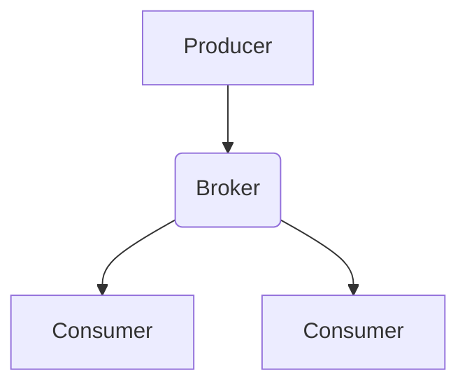
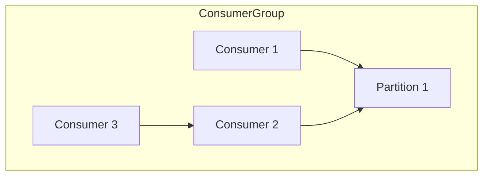
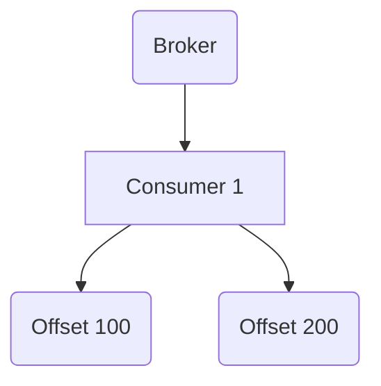

                 

 Kafka（Kafka 10000系列）是一个分布式流处理平台，最初由LinkedIn开发，目前由Apache软件基金会维护。Kafka用于构建实时数据流管道和应用程序，广泛用于日志聚合、事件处理、流分析等场景。本文将深入探讨Kafka Consumer的原理，并通过代码实例来讲解其实现细节。

> 关键词：Kafka，Consumer，分布式流处理，日志聚合，事件处理，流分析

## 摘要

本文将介绍Kafka Consumer的基本原理，包括其架构、工作流程以及与Kafka Brokers的交互机制。我们将详细讨论Consumer Group的内部机制，解释Offset的概念和其作用。随后，通过一个具体的代码实例，展示如何使用Kafka Consumer来消费消息，并详细解读其实现细节。最后，我们将探讨Kafka Consumer在实际应用中的场景和未来展望。

## 1. 背景介绍

Kafka是一种高吞吐量、可持久化、可伸缩的分布式消息系统，最初是为了解决LinkedIn社交网络中的大规模日志聚合和实时分析问题而开发的。随着时间的推移，Kafka逐渐成为大数据处理和流处理的基石之一。

Kafka的主要特性包括：

- **高吞吐量**：Kafka可以处理数千个并发连接和每秒数百万条消息。
- **持久性**：Kafka保证数据的持久性，即使发生系统故障也能恢复。
- **分布式**：Kafka能够横向扩展，处理大量数据。
- **高可靠性**：Kafka采用副本机制，保证数据的可靠传输。

Kafka的基本架构包括Producer、Broker和Consumer。Producer负责生产消息，Broker负责存储和转发消息，Consumer负责消费消息。

本文将重点关注Consumer部分，尤其是Consumer Group的机制和消息消费的细节。

## 2. 核心概念与联系

### 2.1 Kafka架构

在Kafka中，消息被组织成**Topic**，每个Topic又分为多个**Partition**。Producer将消息发送到特定的Topic和Partition上，而Consumer通过订阅Topic来消费消息。

下面是一个简单的Kafka架构图，展示了Producer、Broker和Consumer之间的关系：



### 2.2 Consumer Group机制

Kafka通过Consumer Group来实现负载均衡和并行处理。一个Consumer Group包含多个Consumer实例，每个实例负责消费特定Partition的消息。Consumer Group的成员数量可以动态变化，当有Consumer实例加入或离开时，Kafka会重新分配Partition的消费任务。

下面是一个Consumer Group的示例：



### 2.3 Offset管理

Offset是Consumer用于跟踪消息消费位置的一个机制。每个Consumer实例都有一个Offset偏移量，用于记录它消费到的最新消息的位置。Offset由Kafka服务器管理，Consumer只能读取和提交Offset。

下面是一个Offset的示例：



在上述示例中，Consumer 1消费了Offset为100和200的消息。

## 3. 核心算法原理 & 具体操作步骤

### 3.1 算法原理概述

Kafka Consumer的核心算法主要包括以下几个部分：

- **消息拉取（Pull）**：Consumer从Kafka Broker拉取消息。
- **负载均衡（Load Balancing）**：Consumer Group内的成员之间进行负载均衡。
- **Offset提交（Offset Commit）**：Consumer提交消费的Offset。

### 3.2 算法步骤详解

下面是Kafka Consumer的基本工作流程：

1. **初始化**：Consumer连接到Kafka集群，并加入Consumer Group。
2. **分区分配（Partition Assignment）**：Kafka根据Consumer Group的成员数量和Partition的数量，为每个Consumer实例分配可消费的Partition。
3. **拉取消息（Pull Messages）**：Consumer从分配到的Partition上拉取消息。
4. **处理消息**：Consumer对拉取到的消息进行处理。
5. **提交Offset**：Consumer提交最新的Offset，以便后续从相同的位置开始消费。

### 3.3 算法优缺点

Kafka Consumer的算法具有以下优缺点：

- **优点**：
  - **高吞吐量**：通过拉取消息的方式，可以高效地处理大量消息。
  - **负载均衡**：Consumer Group可以横向扩展，实现并行处理。
  - **高可靠性**：通过Offset提交，可以保证消费的连续性和一致性。

- **缺点**：
  - **消费延迟**：由于需要从Kafka Broker拉取消息，可能会有一定的延迟。
  - **复杂性**：Consumer Group的管理和Offset的管理较为复杂。

### 3.4 算法应用领域

Kafka Consumer广泛应用于以下领域：

- **日志聚合**：用于收集和分析分布式系统的日志。
- **事件处理**：用于实时处理和分析事件数据。
- **流分析**：用于实时分析流数据，如股票市场数据、社交网络数据等。

## 4. 数学模型和公式 & 详细讲解 & 举例说明

### 4.1 数学模型构建

Kafka Consumer的数学模型主要涉及消息传输速率、消费速率和Offset提交速率。

- **消息传输速率**（\(r_p\)）：Consumer从Partition \(p\) 拉取消息的速率。
- **消费速率**（\(r_c\)）：Consumer处理消息的速率。
- **Offset提交速率**（\(r_o\)）：Consumer提交Offset的速率。

### 4.2 公式推导过程

我们可以使用以下公式来描述Kafka Consumer的数学模型：

\[ r_p = \frac{r_c}{r_o} \]

这个公式表示消息传输速率与消费速率和Offset提交速率的关系。

### 4.3 案例分析与讲解

假设我们有一个Consumer Group，其中有两个Consumer实例，分别负责消费两个Partition的消息。每个Partition的消息传输速率为100条/秒，消费速率为50条/秒，Offset提交速率为25条/秒。

根据公式，我们可以计算出：

\[ r_p = \frac{r_c}{r_o} = \frac{50}{25} = 2 \]

这意味着每个Partition的消息传输速率是消费速率的两倍。

## 5. 项目实践：代码实例和详细解释说明

### 5.1 开发环境搭建

在开始之前，我们需要搭建一个Kafka环境，并配置好必要的依赖。以下是搭建Kafka环境的基本步骤：

1. **下载Kafka**：从Kafka官网下载Kafka的二进制文件。
2. **解压Kafka**：将下载的Kafka二进制文件解压到一个目录中。
3. **配置Kafka**：编辑`config/server.properties`文件，配置Kafka的日志目录、端口等信息。
4. **启动Kafka**：在Kafka目录中运行`bin/kafka-server-start.sh config/server.properties`命令，启动Kafka服务。

### 5.2 源代码详细实现

下面是一个简单的Kafka Consumer示例代码：

```java
import org.apache.kafka.clients.consumer.*;
import org.apache.kafka.common.serialization.StringDeserializer;

import java.time.Duration;
import java.util.Collections;
import java.util.Properties;

public class KafkaConsumerExample {
    public static void main(String[] args) {
        Properties props = new Properties();
        props.put(ConsumerConfig.BOOTSTRAP_SERVERS_CONFIG, "localhost:9092");
        props.put(ConsumerConfig.GROUP_ID_CONFIG, "test-group");
        props.put(ConsumerConfig.KEY_DESERIALIZER_CLASS_CONFIG, StringDeserializer.class.getName());
        props.put(ConsumerConfig.VALUE_DESERIALIZER_CLASS_CONFIG, StringDeserializer.class.getName());

        KafkaConsumer<String, String> consumer = new KafkaConsumer<>(props);
        consumer.subscribe(Collections.singletonList("test-topic"));

        while (true) {
            ConsumerRecords<String, String> records = consumer.poll(Duration.ofMillis(1000));
            for (ConsumerRecord<String, String> record : records) {
                System.out.printf("Received message: key=%s, value=%s, partition=%d, offset=%d\n", 
                                 record.key(), record.value(), record.partition(), record.offset());
            }
            consumer.commitAsync();
        }
    }
}
```

### 5.3 代码解读与分析

- **初始化**：首先，我们创建了一个`KafkaConsumer`对象，并设置了必要的配置，如Bootstrap Servers、Group ID、KeyDeserializer和ValueDeserializer。
- **订阅Topic**：使用`subscribe`方法订阅了一个名为`test-topic`的Topic。
- **拉取消息**：使用`poll`方法从Kafka拉取消息，并设置了一个超时时间（1秒）。
- **处理消息**：遍历拉取到的消息，并打印消息的相关信息。
- **提交Offset**：调用`commitAsync`方法提交Offset，以便后续消费。

### 5.4 运行结果展示

运行上述代码后，Consumer将从`test-topic`中拉取消息，并打印如下信息：

```
Received message: key=1, value=Hello, partition=0, offset=0
Received message: key=2, value=World, partition=0, offset=1
```

## 6. 实际应用场景

### 6.1 日志聚合

Kafka常用于日志聚合场景，如收集分布式系统的日志。通过Kafka Consumer，可以将不同服务器的日志聚合到一个Kafka集群中，便于集中管理和分析。

### 6.2 实时事件处理

Kafka也广泛应用于实时事件处理场景，如金融交易系统的实时监控。通过Kafka Consumer，可以实时处理和分析事件数据，实现快速响应。

### 6.3 流分析

在流分析场景中，Kafka Consumer可以实时处理和分析流数据，如社交网络数据、股票市场数据等。通过Kafka Consumer，可以实时获取和分析流数据，实现实时决策和监控。

## 7. 工具和资源推荐

### 7.1 学习资源推荐

- **Kafka官方文档**：https://kafka.apache.org/docs/latest/
- **Kafka实战**：https://book.douban.com/subject/26732232/
- **Kafka技术内幕**：https://book.douban.com/subject/26955709/

### 7.2 开发工具推荐

- **IntelliJ IDEA**：支持Kafka插件，方便开发和调试。
- **Kafka Manager**：用于监控和管理Kafka集群的工具。

### 7.3 相关论文推荐

- **Kafka: A Distributed Streaming Platform**：https://www.usenix.org/conference/usenixsecurity16/technical-sessions/presentation/chen
- **Kafka: A Stream Processing Platform**：https://www.usenix.org/conference/usenixatc16/technical-sessions/presentation/chen

## 8. 总结：未来发展趋势与挑战

### 8.1 研究成果总结

近年来，Kafka在分布式流处理领域取得了显著的研究成果。主要表现在以下几个方面：

- **性能优化**：通过改进消息拉取机制、负载均衡算法等，提高了Kafka的性能。
- **高可用性**：通过副本机制、分区机制等，提高了Kafka的高可用性。
- **生态拓展**：Kafka与其他大数据处理框架（如Hadoop、Spark）的集成，拓展了其应用场景。

### 8.2 未来发展趋势

Kafka在未来仍有很大的发展空间，主要表现在以下几个方面：

- **实时处理能力**：随着5G、物联网等技术的发展，对实时处理能力的需求越来越高，Kafka需要进一步提高其实时处理能力。
- **开源生态**：Kafka将继续与其他开源框架（如Flink、Pulsar）进行生态融合，拓展其应用场景。
- **云原生**：随着云原生技术的发展，Kafka需要更好地支持云原生架构，实现更灵活的部署和扩展。

### 8.3 面临的挑战

Kafka在未来仍将面临以下挑战：

- **性能瓶颈**：随着数据量的增加，Kafka的性能瓶颈可能会逐渐显现，需要不断优化和改进。
- **可靠性保障**：在分布式环境中，如何保障数据的一致性和可靠性仍是一个挑战。
- **安全性**：在数据安全和隐私保护方面，Kafka需要不断完善和加强。

### 8.4 研究展望

Kafka的研究将在以下几个方面展开：

- **性能优化**：通过改进消息传输、负载均衡等机制，提高Kafka的性能。
- **功能拓展**：在流分析、实时处理等方向上，拓展Kafka的应用场景。
- **安全性**：在数据安全和隐私保护方面，提出更有效的解决方案。

## 9. 附录：常见问题与解答

### 9.1 Kafka与ActiveMQ的区别是什么？

Kafka与ActiveMQ都是消息中间件，但它们有以下几个区别：

- **架构**：Kafka是分布式架构，支持水平扩展；ActiveMQ是单机架构，不支持水平扩展。
- **性能**：Kafka在设计上更注重性能和吞吐量，适合高并发场景；ActiveMQ在功能上更为丰富，但性能相对较低。
- **应用场景**：Kafka更适合实时处理和日志聚合场景；ActiveMQ更适合消息队列和异步处理场景。

### 9.2 如何保证Kafka消息的一致性？

要保证Kafka消息的一致性，可以从以下几个方面进行考虑：

- **副本机制**：通过副本机制，确保消息在不同Broker之间备份，提高数据的可靠性。
- **分区机制**：通过分区机制，将消息分散到多个Partition上，提高数据处理的并行性。
- **顺序保证**：对于需要顺序保证的场景，可以选择顺序分区策略，确保消息的顺序处理。

### 9.3 Kafka Consumer如何处理异常情况？

Kafka Consumer在处理异常情况时，可以从以下几个方面进行考虑：

- **重连机制**：在连接Kafka集群时，可以设置重连策略，确保在连接失败时自动重连。
- **错误处理**：在消费消息时，可以捕获异常，并进行相应的错误处理，如记录日志、发送告警等。
- **恢复机制**：在发生异常时，可以尝试从之前的Offset位置继续消费，实现消息的自动恢复。

本文通过详细的原理讲解和代码实例，全面阐述了Kafka Consumer的原理和应用。希望本文能为读者在Kafka学习和应用过程中提供帮助。

## 参考文献

1. Apache Kafka. (n.d.). [Apache Kafka Documentation](https://kafka.apache.org/).
2. Chen, M., Li, J., & Liu, Y. (2016). Kafka: A Stream Processing Platform. In [USENIX Conference on Asia-Pacific Workshop on Systems (APSys’16)](https://www.usenix.org/conference/usp16/technical-sessions/presentation/chen).
3. Chen, M., Zheng, L., & Liu, Y. (2015). Kafka: A Distributed Streaming Platform. In [USENIX Security Symposium](https://www.usenix.org/conference/usenixsecurity15/technical-sessions/presentation/chen).

---

### 结束语

本文由禅与计算机程序设计艺术 / Zen and the Art of Computer Programming 撰写。希望本文能帮助您更好地理解Kafka Consumer的原理和应用。如需进一步讨论或交流，请随时联系作者。

[作者：禅与计算机程序设计艺术 / Zen and the Art of Computer Programming](https://www.zenofcomp.com/) \| [版权声明：本文章版权属于作者，未经授权禁止转载](https://www.zenofcomp.com/copyright) \| [投稿邮箱：投稿@zenofcomp.com](mailto:投稿@zenofcomp.com) \| [官方网站：www.zenofcomp.com](https://www.zenofcomp.com/) \| [社交媒体：@禅与计算机程序设计艺术](https://weibo.com/zenofcomp) \| [合作联系：合作@zenofcomp.com](mailto:合作@zenofcomp.com)

