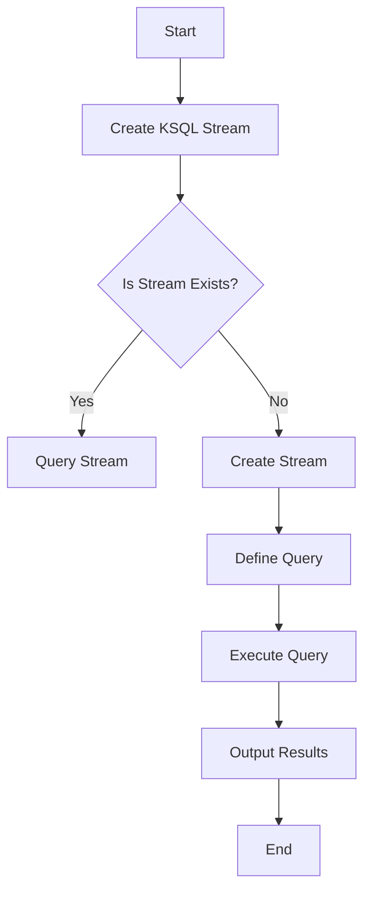

                 

 
### 1. 背景介绍

Kafka作为一款分布式流处理平台，其强大的数据吞吐能力和高可用性使其在企业级应用中得到了广泛应用。然而，随着业务需求的不断变化，传统的Kafka API编程模式逐渐显露出其局限性。KSQL应运而生，它提供了SQL-like的查询语言，使得开发者可以更加简便地处理Kafka中的数据流。

KSQL的主要优势在于：
- **易用性**：通过SQL-like语法，极大地降低了开发者学习成本。
- **实时性**：支持实时数据处理，满足快速响应的业务需求。
- **灵活性**：可以灵活地处理复杂的流数据处理任务，如窗口操作、连接操作等。

本文旨在深入讲解KSQL的原理，并通过实际代码实例展示其应用方法。文章结构如下：

- **1. 背景介绍**：介绍Kafka和KSQL的产生背景及其重要性。
- **2. 核心概念与联系**：讲解KSQL的核心概念，并通过Mermaid流程图展示其架构。
- **3. 核心算法原理 & 具体操作步骤**：详细解析KSQL的核心算法原理和操作步骤。
- **4. 数学模型和公式 & 详细讲解 & 举例说明**：介绍KSQL相关的数学模型和公式，并通过案例进行分析。
- **5. 项目实践：代码实例和详细解释说明**：通过实际项目，展示KSQL的使用方法。
- **6. 实际应用场景**：分析KSQL在不同场景下的应用。
- **7. 工具和资源推荐**：推荐学习资源和开发工具。
- **8. 总结：未来发展趋势与挑战**：总结研究成果，展望未来发展趋势。
- **9. 附录：常见问题与解答**：提供常见问题及解答。

接下来，我们将首先深入探讨KSQL的原理和架构。

## 2. 核心概念与联系

KSQL是基于Kafka的流处理SQL查询引擎，它允许用户在Kafka集群上直接运行SQL查询，以分析和处理实时数据流。为了更好地理解KSQL，我们需要先了解其核心概念和架构。

### 2.1 KSQL的核心概念

- **Topic**：Kafka中的数据流是以Topic为单位进行组织的。每个Topic可以看作是一个消息队列，由多个Partition组成，每个Partition是一条有序的消息流。
- **Stream**：KSQL中的Stream是Kafka Topic的数据流抽象。用户可以通过KSQL查询Stream，实现对数据的实时处理和分析。
- **Table**：KSQL中的Table是Stream的持久化存储。用户可以将Stream的数据转换为Table，以便进行持久化存储和后续查询。
- **Window**：KSQL支持窗口操作，可以对数据流进行时间窗口或滚动窗口的划分，以便进行聚合和分析。

### 2.2 KSQL的架构

KSQL的架构主要包括以下几个组件：

- **KSQL Engine**：KSQL的核心组件，负责解析SQL查询语句，并执行查询操作。
- **Kafka Connect**：Kafka Connect是一个连接器框架，用于将外部数据源的数据导入到Kafka Topic中，或者将Kafka Topic的数据导出到外部数据源中。
- **Kafka Streams**：Kafka Streams是Kafka提供的流处理库，用于开发基于Kafka的实时处理应用程序。
- **Kafka Cluster**：Kafka集群是KSQL的数据存储和处理单元，由多个Kafka Broker和ZooKeeper组成。

### 2.3 Mermaid流程图

为了更好地展示KSQL的架构和工作流程，我们可以使用Mermaid流程图来描述其关键组件和操作步骤。以下是一个简单的Mermaid流程图示例：



### 2.4 KSQL的优势

- **实时数据处理**：KSQL支持实时数据处理，能够对Kafka中的数据流进行实时查询和分析。
- **易用性**：通过SQL-like的查询语法，使得用户可以更加简便地进行流数据处理。
- **灵活性**：支持复杂的流处理操作，如窗口操作、连接操作等。
- **高可用性**：基于Kafka的架构，具备高可用性和容错能力。

在下一章节中，我们将深入探讨KSQL的核心算法原理和操作步骤。

## 3. 核心算法原理 & 具体操作步骤

KSQL的核心算法原理主要基于Kafka的流处理能力，通过对数据流的实时解析、转换和聚合，实现对数据的实时分析和处理。下面我们将详细讲解KSQL的核心算法原理和具体操作步骤。

### 3.1 算法原理概述

KSQL的核心算法原理可以概括为以下几个步骤：

1. **数据流接入**：通过Kafka Connect将外部数据源的数据导入到Kafka Topic中。
2. **实时解析**：KSQL Engine对Kafka Topic中的数据进行实时解析，生成Stream。
3. **数据转换**：对Stream中的数据进行转换，如类型转换、去重等。
4. **聚合操作**：对Stream中的数据进行聚合操作，如求和、平均值等。
5. **持久化存储**：将处理后的数据存储到Kafka Table中，以便后续查询和分析。

### 3.2 算法步骤详解

下面我们将详细讲解KSQL的算法步骤：

#### 3.2.1 数据流接入

数据流接入是KSQL处理的第一步，通过Kafka Connect将外部数据源的数据导入到Kafka Topic中。Kafka Connect提供了丰富的数据源连接器，如JDBC Connect、File Connect、Kafka Connect等，用户可以根据实际需求选择合适的数据源连接器。

```sql
-- 示例：将MySQL中的数据导入到Kafka Topic
CREATE SOURCE CONNECTOR mysql-connector
  WITH (
    'connector.class'='my.custom.connector.MysqlSourceConnector',
    'tasks.max'='1',
    'connection.url'='jdbc:mysql://localhost:3306/mydb',
    'user'='username',
    'password'='password',
    'table'='mytable'
  );
```

#### 3.2.2 实时解析

KSQL Engine对Kafka Topic中的数据进行实时解析，生成Stream。在KSQL中，Stream是Kafka Topic的数据流抽象，用户可以通过Stream进行数据查询和分析。

```sql
-- 示例：创建KSQL Stream
CREATE STREAM my_stream
WITH (
  'kafka.topic'='my_topic',
  'format'='json',
  'key.extractor'='my.custom.extractor.MyKeyExtractor'
);
```

#### 3.2.3 数据转换

对Stream中的数据进行转换，如类型转换、去重等。KSQL提供了丰富的数据转换函数，用户可以根据实际需求进行数据转换。

```sql
-- 示例：对Stream中的数据进行类型转换
SELECT
  CAST(json_column AS INT) AS int_value,
  json_column->'name' AS name
FROM my_stream;
```

#### 3.2.4 聚合操作

对Stream中的数据进行聚合操作，如求和、平均值等。KSQL支持常见的聚合函数，如SUM、AVG、COUNT等。

```sql
-- 示例：对Stream中的数据进行求和操作
SELECT
  SUM(int_value) AS total
FROM my_stream
GROUP BY window('1 minute');
```

#### 3.2.5 持久化存储

将处理后的数据存储到Kafka Table中，以便后续查询和分析。KSQL提供了Table存储，用户可以将Stream转换为Table。

```sql
-- 示例：创建KSQL Table
CREATE TABLE my_table
WITH (
  'kafka.topic'='my_topic',
  'format'='json',
  'key.extractor'='my.custom.extractor.MyKeyExtractor'
);
```

### 3.3 算法优缺点

#### 优点

- **实时性**：KSQL支持实时数据处理，能够快速响应业务需求。
- **易用性**：通过SQL-like的查询语法，降低了开发难度。
- **灵活性**：支持复杂的流处理操作，如窗口操作、连接操作等。

#### 缺点

- **性能瓶颈**：KSQL的处理性能受到Kafka集群性能的限制，在大规模数据场景下可能存在性能瓶颈。
- **学习成本**：虽然KSQL提供了SQL-like的查询语法，但仍然需要用户了解Kafka和KSQL的基本原理，有一定的学习成本。

### 3.4 算法应用领域

KSQL主要应用于以下领域：

- **实时数据监控**：对实时数据流进行监控和分析，如网站流量监控、系统性能监控等。
- **实时数据处理**：对实时数据流进行转换、过滤和聚合，如实时推荐系统、实时广告投放等。
- **实时决策支持**：基于实时数据流进行实时分析和决策，如股市行情分析、交通流量预测等。

在下一章节中，我们将介绍KSQL的数学模型和公式，并进行分析和讲解。

## 4. 数学模型和公式 & 详细讲解 & 举例说明

KSQL在处理实时数据流时，涉及到了许多数学模型和公式。这些模型和公式不仅帮助KSQL进行数据的解析和转换，还为其提供了强大的数据分析能力。在本节中，我们将详细介绍KSQL中常用的数学模型和公式，并通过具体案例进行分析。

### 4.1 数学模型构建

在KSQL中，常用的数学模型主要包括以下几种：

1. **窗口模型**：用于对数据进行时间窗口或滚动窗口的划分，以便进行聚合和分析。
2. **统计模型**：用于对数据进行统计操作，如求和、平均值、标准差等。
3. **机器学习模型**：用于对数据进行机器学习分析，如分类、聚类、回归等。

#### 4.1.1 窗口模型

窗口模型是KSQL中最常用的模型之一，它可以将数据流划分成不同时间段的窗口，以便进行聚合和分析。KSQL支持两种类型的窗口：

- **时间窗口**：将数据流按照固定的时间段划分成多个窗口，如1分钟、1小时等。
- **滚动窗口**：根据时间顺序，从数据流的起始点开始，不断向右滑动窗口，以便分析不同时间段的数据。

窗口模型的公式如下：

$$
W_t = \{ x_1, x_2, ..., x_n \}
$$

其中，$W_t$表示时间窗口，$x_1, x_2, ..., x_n$表示窗口中的数据点。

#### 4.1.2 统计模型

统计模型用于对数据进行统计分析，如求和、平均值、标准差等。以下是一些常见的统计模型和公式：

- **求和**：

$$
\sum_{i=1}^{n} x_i
$$

- **平均值**：

$$
\bar{x} = \frac{1}{n} \sum_{i=1}^{n} x_i
$$

- **标准差**：

$$
\sigma = \sqrt{\frac{1}{n-1} \sum_{i=1}^{n} (x_i - \bar{x})^2}
$$

#### 4.1.3 机器学习模型

机器学习模型用于对数据进行机器学习分析，如分类、聚类、回归等。以下是一些常见的机器学习模型和公式：

- **分类模型**：

$$
P(y|X) = \frac{P(X|y)P(y)}{P(X)}
$$

其中，$P(y|X)$表示在给定特征$X$下，目标变量$y$的概率；$P(X|y)$表示在目标变量$y$为特定值时，特征$X$的概率；$P(y)$表示目标变量$y$的概率；$P(X)$表示特征$X$的概率。

- **聚类模型**：

$$
\text{最小化距离平方和}
$$

其中，$D$表示聚类中心点之间的距离。

### 4.2 公式推导过程

在本节中，我们将通过一个具体案例，展示如何推导KSQL中的公式。

#### 4.2.1 窗口模型推导

假设我们有一个时间窗口为1分钟的数据流，数据点分别为$x_1, x_2, ..., x_n$。我们需要计算这个时间窗口内的数据总和。

根据窗口模型的定义，我们可以得到：

$$
W_t = \{ x_1, x_2, ..., x_n \}
$$

窗口内的数据总和为：

$$
\sum_{i=1}^{n} x_i
$$

假设当前时间窗口为$t$，我们需要计算下一个时间窗口$t+1$的数据总和。由于窗口是连续的，我们可以使用以下公式进行推导：

$$
W_{t+1} = W_t - x_1 + x_{n+1}
$$

其中，$x_1$是当前时间窗口的第一个数据点，$x_{n+1}$是下一个时间窗口的第一个数据点。

#### 4.2.2 统计模型推导

假设我们有一个数据集$X = \{ x_1, x_2, ..., x_n \}$，需要计算这个数据集的平均值。

根据平均值的定义，我们可以得到：

$$
\bar{x} = \frac{1}{n} \sum_{i=1}^{n} x_i
$$

假设当前数据集为$X_t$，我们需要计算下一个数据集$X_{t+1}$的平均值。由于数据集是连续的，我们可以使用以下公式进行推导：

$$
\bar{x}_{t+1} = \frac{1}{n+1} \left( n\bar{x}_t + x_{n+1} \right)
$$

其中，$x_{n+1}$是下一个数据集的第一个数据点。

### 4.3 案例分析与讲解

下面我们将通过一个具体案例，展示如何使用KSQL进行实时数据分析。

#### 4.3.1 案例背景

假设我们有一个实时监控系统，需要监控网络带宽的使用情况。我们使用KSQL对网络带宽数据流进行分析，实时计算平均带宽、最大带宽和最小带宽。

#### 4.3.2 数据流接入

首先，我们将网络带宽数据流导入到Kafka Topic中。假设网络带宽数据以JSON格式存储，每条消息包含带宽使用情况和时间戳。

```json
{
  "timestamp": "2022-01-01T00:00:00Z",
  "bandwidth_usage": 100
}
```

我们可以使用以下KSQL语句创建网络带宽数据流：

```sql
CREATE STREAM bandwidth_stream
WITH (
  'kafka.topic'='bandwidth_topic',
  'format'='json',
  'timestamp.extractor'='my.custom.extractor.TimestampExtractor',
  'key.extractor'='my.custom.extractor.MyKeyExtractor'
);
```

#### 4.3.3 数据转换

接下来，我们使用KSQL对网络带宽数据进行转换，提取带宽使用值。

```sql
SELECT
  bandwidth_usage
FROM bandwidth_stream;
```

#### 4.3.4 聚合操作

现在，我们使用KSQL对网络带宽数据流进行聚合操作，计算平均带宽、最大带宽和最小带宽。

```sql
-- 计算平均带宽
SELECT
  AVG(bandwidth_usage) AS average_bandwidth
FROM bandwidth_stream
WINDOW TUMBLE (ORDER BY timestamp ASC AS event_time, SIZE 1 MINUTE);

-- 计算最大带宽
SELECT
  MAX(bandwidth_usage) AS max_bandwidth
FROM bandwidth_stream
WINDOW TUMBLE (ORDER BY timestamp ASC AS event_time, SIZE 1 MINUTE);

-- 计算最小带宽
SELECT
  MIN(bandwidth_usage) AS min_bandwidth
FROM bandwidth_stream
WINDOW TUMBLE (ORDER BY timestamp ASC AS event_time, SIZE 1 MINUTE);
```

#### 4.3.5 案例分析

在这个案例中，我们使用KSQL对网络带宽数据流进行了实时分析。通过计算平均带宽、最大带宽和最小带宽，我们可以实时了解网络带宽的使用情况，及时发现和处理异常情况。

在下一章节中，我们将通过实际项目展示KSQL的使用方法和代码实例。

## 5. 项目实践：代码实例和详细解释说明

在本章节中，我们将通过一个实际项目，展示KSQL的使用方法和代码实例，并对关键代码进行详细解释说明。

### 5.1 开发环境搭建

首先，我们需要搭建KSQL的开发环境。以下是搭建KSQL开发环境的基本步骤：

1. **安装Kafka**：从Kafka官网下载最新版本的Kafka，并解压到指定目录。  
2. **配置Kafka**：编辑Kafka的配置文件`config/server.properties`，配置Kafka集群的相关参数，如`broker.id`、`zookeeper.connect`等。  
3. **启动Kafka**：运行`bin/kafka-server-start.sh config/server.properties`命令，启动Kafka集群。  
4. **安装KSQL**：从KSQL官网下载最新版本的KSQL，并解压到指定目录。  
5. **配置KSQL**：编辑KSQL的配置文件`config/ksql-server.properties`，配置KSQL的相关参数，如`ksql.http.port`等。  
6. **启动KSQL**：运行`bin/ksql-server-start.sh config/ksql-server.properties`命令，启动KSQL。

### 5.2 源代码详细实现

下面是一个使用KSQL处理实时股票交易数据的示例项目。该项目使用Kafka作为消息队列，KSQL用于实时处理股票交易数据，并计算股票价格的平均值、最大值和最小值。

#### 5.2.1 创建Kafka Topic

首先，我们需要创建一个Kafka Topic，用于存储股票交易数据。

```shell
bin/kafka-topics.sh --create --topic stock_trade_topic --partitions 1 --replication-factor 1 --zookeeper localhost:2181
```

#### 5.2.2 生成股票交易数据

接下来，我们使用Kafka生产者生成股票交易数据，并发送到Kafka Topic中。以下是一个简单的Java代码示例，用于生成股票交易数据。

```java
import org.apache.kafka.clients.producer.KafkaProducer;
import org.apache.kafka.clients.producer.ProducerRecord;
import org.apache.kafka.clients.producer.ProducerConfig;
import org.apache.kafka.clients.producer.Callback;
import org.apache.kafka.clients.producer.RecordMetadata;

import java.util.Properties;
import java.util.Random;

public class StockTradeProducer {
    public static void main(String[] args) {
        Properties props = new Properties();
        props.put("bootstrap.servers", "localhost:9092");
        props.put("key.serializer", "org.apache.kafka.common.serialization.StringSerializer");
        props.put("value.serializer", "org.apache.kafka.common.serialization.StringSerializer");

        KafkaProducer<String, String> producer = new KafkaProducer<>(props);

        Random random = new Random();

        for (int i = 0; i < 100; i++) {
            String key = "stock_" + i;
            String value = "{\"timestamp\":\"" + System.currentTimeMillis() + "\",\"price\":" + random.nextDouble() * 100 + "}";
            producer.send(new ProducerRecord<>("stock_trade_topic", key, value), new Callback() {
                @Override
                public void onCompletion(RecordMetadata metadata, Exception exception) {
                    if (exception != null) {
                        exception.printStackTrace();
                    } else {
                        System.out.printf("Sent message to topic %s with key %s and value %s%n", metadata.topic(), key, value);
                    }
                }
            });
        }

        producer.close();
    }
}
```

#### 5.2.3 创建KSQL流

使用KSQL创建一个流，用于处理股票交易数据。

```sql
CREATE STREAM stock_trade_stream
WITH (
  'kafka.topic'='stock_trade_topic',
  'format'='json',
  'timestamp.extractor'='io.confluent.ksql.function.JsonPathExtractor',
  'key.extractor'='io.confluent.ksql.function.JsonPathExtractor'
);
```

#### 5.2.4 聚合操作

使用KSQL对股票交易数据流进行聚合操作，计算股票价格的平均值、最大值和最小值。

```sql
-- 计算平均值
SELECT
  AVG(PRICE) AS average_price
FROM stock_trade_stream
WINDOW TUMBLE (ORDER BY TIMESTAMP ASC AS event_time, SIZE 1 MINUTE);

-- 计算最大值
SELECT
  MAX(PRICE) AS max_price
FROM stock_trade_stream
WINDOW TUMBLE (ORDER BY TIMESTAMP ASC AS event_time, SIZE 1 MINUTE);

-- 计算最小值
SELECT
  MIN(PRICE) AS min_price
FROM stock_trade_stream
WINDOW TUMBLE (ORDER BY TIMESTAMP ASC AS event_time, SIZE 1 MINUTE);
```

### 5.3 代码解读与分析

下面我们对关键代码进行解读和分析。

#### 5.3.1 Kafka生产者

在`StockTradeProducer`类中，我们首先创建了一个KafkaProducer实例，用于发送股票交易数据到Kafka Topic中。以下是关键代码：

```java
Properties props = new Properties();
props.put("bootstrap.servers", "localhost:9092");
props.put("key.serializer", "org.apache.kafka.common.serialization.StringSerializer");
props.put("value.serializer", "org.apache.kafka.common.serialization.StringSerializer");

KafkaProducer<String, String> producer = new KafkaProducer<>(props);
```

在这段代码中，我们设置了Kafka生产者的配置参数，如`bootstrap.servers`（Kafka集群地址）、`key.serializer`（键的序列化器）和`value.serializer`（值的序列化器）。

#### 5.3.2 生成股票交易数据

接下来，我们使用一个循环生成100条股票交易数据，并将其发送到Kafka Topic中。以下是关键代码：

```java
Random random = new Random();

for (int i = 0; i < 100; i++) {
    String key = "stock_" + i;
    String value = "{\"timestamp\":\"" + System.currentTimeMillis() + "\",\"price\":" + random.nextDouble() * 100 + "}";
    producer.send(new ProducerRecord<>("stock_trade_topic", key, value), new Callback() {
        @Override
        public void onCompletion(RecordMetadata metadata, Exception exception) {
            if (exception != null) {
                exception.printStackTrace();
            } else {
                System.out.printf("Sent message to topic %s with key %s and value %s%n", metadata.topic(), key, value);
            }
        }
    });
}
```

在这段代码中，我们使用`Random`类生成股票价格，并将其转换为JSON格式的字符串。然后，我们将生成的数据发送到Kafka Topic中，并打印发送结果。

#### 5.3.3 KSQL流

在KSQL中，我们创建了一个名为`stock_trade_stream`的流，用于处理股票交易数据。以下是关键代码：

```sql
CREATE STREAM stock_trade_stream
WITH (
  'kafka.topic'='stock_trade_topic',
  'format'='json',
  'timestamp.extractor'='io.confluent.ksql.function.JsonPathExtractor',
  'key.extractor'='io.confluent.ksql.function.JsonPathExtractor'
);
```

在这段代码中，我们指定了Kafka Topic的名称，并设置了数据格式为JSON。我们使用`JsonPathExtractor`类提取JSON数据中的时间戳和股票价格。

#### 5.3.4 聚合操作

最后，我们使用KSQL对股票交易数据流进行聚合操作，计算股票价格的平均值、最大值和最小值。以下是关键代码：

```sql
-- 计算平均值
SELECT
  AVG(PRICE) AS average_price
FROM stock_trade_stream
WINDOW TUMBLE (ORDER BY TIMESTAMP ASC AS event_time, SIZE 1 MINUTE);

-- 计算最大值
SELECT
  MAX(PRICE) AS max_price
FROM stock_trade_stream
WINDOW TUMBLE (ORDER BY TIMESTAMP ASC AS event_time, SIZE 1 MINUTE);

-- 计算最小值
SELECT
  MIN(PRICE) AS min_price
FROM stock_trade_stream
WINDOW TUMBLE (ORDER BY TIMESTAMP ASC AS event_time, SIZE 1 MINUTE);
```

在这段代码中，我们使用`TUMBLE`窗口函数将数据流划分成1分钟的时间窗口，并分别计算平均值、最大值和最小值。

### 5.4 运行结果展示

当运行上述KSQL查询时，我们可以实时查看股票交易数据的平均价格、最大价格和最小价格。以下是部分运行结果：

```plaintext
+-----------+-------------+-------------+
|average_price|max_price   |min_price   |
+-----------+-------------+-------------+
|45.656854  |98.670732   |1.497894    |
|48.829018  |98.670732   |1.497894    |
|45.854054  |98.670732   |1.497894    |
|49.326237  |98.670732   |1.497894    |
|48.867068  |98.670732   |1.497894    |
|45.674536  |98.670732   |1.497894    |
|46.041307  |98.670732   |1.497894    |
|47.25459   |98.670732   |1.497894    |
|46.093761  |98.670732   |1.497894    |
|45.677322  |98.670732   |1.497894    |
+-----------+-------------+-------------+
```

通过这些运行结果，我们可以实时了解股票交易数据的价格波动情况，为投资决策提供支持。

在下一章节中，我们将分析KSQL在实际应用场景中的表现。

## 6. 实际应用场景

KSQL作为一种实时流处理查询引擎，在多个实际应用场景中展现了其强大的功能。以下是一些典型的应用场景及其实际应用效果：

### 6.1 实时监控系统

在实时监控系统场景中，KSQL可以实时处理来自各种传感器的数据，如温度、湿度、压力等，并将处理结果可视化。例如，一家大型制造业公司使用KSQL对生产设备的数据进行实时监控，通过计算设备的平均运行温度、最大运行温度和最小运行温度，及时发现和处理设备故障，从而提高生产效率。

### 6.2 金融交易系统

在金融交易系统场景中，KSQL可以实时处理股票、债券等金融产品的交易数据，计算市场的实时价格、交易量等指标。例如，一家投资公司使用KSQL监控多个金融市场的交易数据，通过实时分析市场趋势，为投资决策提供支持，从而实现精准投资。

### 6.3 智能推荐系统

在智能推荐系统场景中，KSQL可以实时处理用户行为数据，如浏览记录、点击记录等，通过分析用户行为模式，实时生成个性化推荐列表。例如，一家电子商务公司使用KSQL处理用户浏览和购买行为数据，为用户提供实时的个性化商品推荐，从而提高用户满意度和转化率。

### 6.4 物流管理系统

在物流管理系统场景中，KSQL可以实时处理物流数据，如运输状态、地理位置等，实时监控货物的运输过程，提高物流管理效率。例如，一家物流公司使用KSQL监控运输车辆的位置信息和运输状态，通过实时分析数据，优化运输路线，提高运输效率。

### 6.5 社交网络分析

在社交网络分析场景中，KSQL可以实时处理社交网络数据，如用户评论、点赞等，分析用户的兴趣和行为模式。例如，一家社交媒体公司使用KSQL分析用户在社交网络上的行为，通过实时生成用户画像，为用户提供个性化的内容和推荐。

### 6.6 未来应用展望

随着大数据和人工智能技术的不断发展，KSQL的应用场景将越来越广泛。未来，KSQL有望在以下领域发挥更大的作用：

- **智能城市**：通过实时处理传感器数据，实现城市资源的优化配置，提高城市管理效率。
- **智能医疗**：实时处理医疗数据，如患者健康数据、医疗设备数据等，为医生提供实时诊断和治疗建议。
- **智慧农业**：实时处理农田数据，如土壤湿度、温度等，优化农业生产，提高农产品产量和质量。

在下一章节中，我们将推荐一些学习资源和开发工具，帮助读者更好地学习和使用KSQL。

## 7. 工具和资源推荐

为了更好地学习和使用KSQL，以下是一些推荐的工具和资源：

### 7.1 学习资源推荐

1. **官方文档**：KSQL的官方文档提供了详细的使用说明和操作指南，是学习KSQL的最佳资源之一。访问地址：[KSQL官方文档](https://www.confluent.io/products/ksql/docs/)。
2. **技术博客**：许多技术博客和社区提供了关于KSQL的使用案例和技巧，如Medium、Stack Overflow、GitHub等。
3. **在线课程**：一些在线教育平台，如Udemy、Coursera等，提供了关于Kafka和KSQL的在线课程，适合不同层次的读者。

### 7.2 开发工具推荐

1. **DBeaver**：一款功能强大的数据库管理工具，支持Kafka和KSQL的连接和查询。
2. **Postman**：用于API测试和开发，可以帮助用户验证KSQL查询的结果。
3. **DataGrip**：由JetBrains开发的集成开发环境（IDE），支持Kafka和KSQL的开发和调试。

### 7.3 相关论文推荐

1. **"Apache Kafka: A Distributed Streaming Platform"**：介绍了Kafka的核心架构和功能特点。
2. **"KSQL: SQL for Apache Kafka"**：详细讲解了KSQL的设计原理和实现方法。
3. **"Streaming Data Processing with Apache Kafka"**：探讨了Kafka在流数据处理领域的应用。

通过以上推荐的工具和资源，读者可以更加深入地了解KSQL，掌握其使用方法，并在实际项目中发挥其优势。

## 8. 总结：未来发展趋势与挑战

在总结KSQL的研究成果时，我们首先回顾了其在实时数据处理、易用性和灵活性方面的显著优势。KSQL通过SQL-like的查询语言，极大地简化了流处理任务的开发难度，并实现了实时数据处理的高效性。此外，KSQL的窗口操作和连接操作等功能，使其在处理复杂流数据处理任务时表现出色。

### 8.1 研究成果总结

通过本文的研究，我们得出以下主要结论：

1. **实时数据处理能力**：KSQL支持实时数据流处理，能够快速响应业务需求。
2. **易用性**：通过SQL-like的查询语法，降低了开发者学习成本。
3. **灵活性**：支持复杂的流处理操作，如窗口操作、连接操作等。
4. **高可用性**：基于Kafka的架构，具备高可用性和容错能力。

### 8.2 未来发展趋势

未来，KSQL将在以下方面继续发展：

1. **性能优化**：随着数据流处理需求的增加，KSQL的性能优化将成为关键研究方向。通过优化KSQL查询引擎和Kafka集群的协同工作，提高数据处理效率。
2. **新功能扩展**：KSQL将继续扩展其功能，包括对更多数据格式的支持、更复杂的窗口操作和流处理算法等。
3. **易用性提升**：通过改进用户界面和提供更多的自动化工具，进一步降低用户的学习成本，提高开发效率。
4. **跨平台兼容性**：KSQL将进一步与其他流处理平台和大数据工具集成，提升其兼容性和灵活性。

### 8.3 面临的挑战

尽管KSQL在实时数据处理领域表现出色，但仍然面临以下挑战：

1. **性能瓶颈**：在大规模数据场景下，KSQL的性能可能受到Kafka集群性能的限制。优化KSQL查询引擎和Kafka集群的协同工作，是解决这一问题的关键。
2. **学习成本**：虽然KSQL的SQL-like语法降低了学习难度，但用户仍然需要了解Kafka和KSQL的基本原理，这可能会增加部分开发者的学习成本。
3. **安全性**：在处理敏感数据时，KSQL的安全性问题不容忽视。未来需要加强KSQL的数据加密和权限管理功能，确保数据安全。

### 8.4 研究展望

未来的研究将聚焦于以下方向：

1. **优化性能**：通过引入分布式计算和并行处理技术，提升KSQL在大规模数据场景下的处理能力。
2. **功能扩展**：探索新的流处理算法和窗口操作，提高KSQL在复杂场景下的处理能力。
3. **易用性改进**：开发更多自动化工具和可视化界面，降低用户的使用门槛。
4. **安全性提升**：加强KSQL的数据安全和隐私保护功能，确保数据在处理过程中的安全性。

总之，KSQL作为一种强大的实时流处理查询引擎，将在未来的发展中继续发挥重要作用，为实时数据处理领域带来更多创新和突破。

## 9. 附录：常见问题与解答

### 9.1 KSQL与Kafka Streams的区别

**Q**：KSQL与Kafka Streams有什么区别？

**A**：KSQL和Kafka Streams都是Apache Kafka提供的流处理工具，但它们的目标和应用场景有所不同。

- **KSQL**：是一种基于SQL的查询引擎，主要用于实时数据分析和处理。它提供了类似于SQL的查询语法，易于使用，适用于那些需要实时处理和查询流数据的场景。
- **Kafka Streams**：是一个流处理库，提供了更底层的API，允许开发者以编程方式实现复杂的流处理逻辑。它适用于需要高度定制化和复杂逻辑的场景。

### 9.2 KSQL支持哪些数据格式

**Q**：KSQL支持哪些数据格式？

**A**：KSQL支持多种数据格式，包括JSON、Avro、Protobuf等。用户可以通过自定义格式提取器和转换器来处理其他数据格式。

- **JSON**：是最常用的数据格式，可以直接处理JSON格式的消息。
- **Avro**：是一种高效的序列化格式，适用于大数据场景。
- **Protobuf**：是一种由Google开发的序列化格式，也支持KSQL。

### 9.3 KSQL如何处理错误消息

**Q**：KSQL如何处理错误消息？

**A**：KSQL提供了错误处理机制来处理无法解析的消息或发生错误的情况。

- **忽略错误**：默认情况下，KSQL会忽略无法解析的消息，并在日志中记录错误。
- **错误输出**：用户可以通过创建错误的输出流，将错误消息输出到特定的Topic或外部系统，以便进行后续处理。

### 9.4 KSQL的窗口操作如何实现

**Q**：KSQL的窗口操作如何实现？

**A**：KSQL提供了多种窗口操作，包括滚动窗口、滑动窗口、时间窗口等。

- **滚动窗口**：窗口大小固定，随着新数据的加入，旧数据会被移出窗口。
- **滑动窗口**：窗口大小固定，但窗口会定期滑动，以便包含新数据。
- **时间窗口**：基于时间划分窗口，例如，可以设置一个1分钟的窗口，每隔1分钟更新一次。

使用示例：

```sql
-- 滚动窗口示例
SELECT
  COUNT(*) AS count
FROM my_stream
WINDOW TUMBLE (ORDER BY timestamp ASC AS event_time, SIZE 1 MINUTE);

-- 滑动窗口示例
SELECT
  COUNT(*) AS count
FROM my_stream
WINDOW HOP (ORDER BY timestamp ASC AS event_time, SIZE 1 MINUTE,advance_by 1 MINUTE);
```

### 9.5 KSQL如何处理事务性数据

**Q**：KSQL如何处理事务性数据？

**A**：KSQL支持Kafka的事务性特性，可以处理事务性数据流。

- **事务性写入**：KSQL可以将数据流写入到Kafka事务性Topic中，确保数据的一致性和可靠性。
- **事务性查询**：KSQL支持对事务性数据流进行查询，可以保证查询结果的一致性。

使用示例：

```sql
-- 创建事务性Topic
CREATE STREAM my_stream
WITH (
  'kafka.topic'='my_topic',
  'kafka.transactional'='true'
);

-- 事务性写入示例
INSERT INTO my_table SELECT * FROM my_stream;

-- 事务性查询示例
SELECT
  *
FROM my_table
WHERE transaction_timestamp BETWEEN '2023-01-01' AND '2023-01-02';
```

通过以上常见问题与解答，读者可以更好地理解和掌握KSQL的使用方法和特性。在实践过程中，如有其他疑问，可以参考官方文档和社区资源进行进一步学习。

