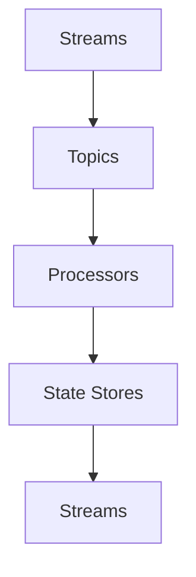

                 

关键词：Kafka Streams，流处理，大数据，实时计算，消息队列

摘要：本文将深入讲解Kafka Streams的原理，通过代码实例展示如何使用Kafka Streams进行实时流数据处理。我们将探讨其核心概念、算法原理、数学模型以及实际应用，帮助读者全面了解Kafka Streams的使用方法和优势。

## 1. 背景介绍

在当今数据驱动的世界中，流处理已成为大数据技术中的重要组成部分。流处理允许我们在数据发生时立即进行操作，这对于需要实时响应的应用场景至关重要。Apache Kafka作为一款高度可扩展的消息队列系统，在流处理领域有着广泛的应用。而Kafka Streams则是Kafka的一个高级流处理库，它允许开发者在Kafka之上直接构建流应用程序。

Kafka Streams的主要优势在于：

- **低延迟**：Kafka Streams能够处理高吞吐量的实时数据流，延迟通常在毫秒级别。
- **易用性**：使用标准的Java或Scala编程语言，开发者无需学习额外的流处理框架。
- **可扩展性**：Kafka Streams与Kafka无缝集成，可以处理大规模的数据流。
- **可靠性**：基于Kafka的持久化机制，确保数据不丢失，系统具备高可用性。

本文将围绕Kafka Streams的原理展开，通过具体代码实例介绍其使用方法。

## 2. 核心概念与联系

Kafka Streams的核心概念主要包括Streams、Topics、Processors和State Stores。下面我们将通过一个Mermaid流程图来展示这些概念之间的联系。



- **Streams**：表示数据流，可以是Kafka的Topic，也可以是内存中的数据结构。
- **Topics**：Kafka中的Topic是消息的集合，每个Topic可以被多个Streams处理。
- **Processors**：处理器负责对数据流进行操作，如过滤、转换、聚合等。
- **State Stores**：用于存储处理过程中的中间状态，支持快速访问和更新。

### 2.1 Streams

Streams是Kafka Streams的核心概念，代表了数据的流动。在Kafka Streams中，数据流通常是从Kafka的Topic读取的。每个Topic可以看作是一个数据源，数据流可以被多个Streams处理。

### 2.2 Topics

Topics是Kafka的核心数据结构，类似于数据库中的表。每个Topic由一系列分区组成，每个分区可以存储大量的消息。Kafka Streams通过Kafka的API从Topic中读取数据流。

### 2.3 Processors

Processors是Kafka Streams中对数据流进行操作的组件。它们可以执行各种流处理操作，如过滤、映射、聚合等。通过定义Processor，我们可以将输入流转换成期望的格式。

### 2.4 State Stores

State Stores用于存储处理过程中的中间状态。这些状态可以是键值对、列表、映射等结构。State Stores提供了快速访问和更新状态的接口，使得复杂的流处理变得简单高效。

## 3. 核心算法原理 & 具体操作步骤

### 3.1 算法原理概述

Kafka Streams的核心算法基于Java的Stream API，它允许开发者以声明式的方式定义数据处理逻辑。Kafka Streams内部使用一系列高效的算法和优化技术，如拉模式（Pull Model）和推模式（Push Model），来实现低延迟、高吞吐量的流处理。

### 3.2 算法步骤详解

- **初始化**：创建一个Kafka Streams实例，配置必要的参数，如Kafka集群地址、Topic名称等。
- **定义Streams**：从Kafka Topic中读取数据流，并定义Processor来处理数据。
- **定义State Stores**：根据需要定义State Stores来存储中间状态。
- **执行处理**：启动Kafka Streams实例，执行数据处理逻辑。
- **监控和优化**：监控处理过程中的性能指标，进行必要的调优。

### 3.3 算法优缺点

**优点**：

- **低延迟**：通过高效的算法和优化技术，Kafka Streams能够实现毫秒级的低延迟。
- **易用性**：使用标准的Java或Scala编程语言，降低了开发难度。
- **高可用性**：基于Kafka的持久化机制，确保系统的高可用性。

**缺点**：

- **资源消耗**：由于Kafka Streams需要处理大量的数据流，对系统资源有一定要求。
- **复杂性**：对于复杂的流处理场景，需要深入理解Kafka Streams的内部实现，以进行有效的调优。

### 3.4 算法应用领域

Kafka Streams广泛应用于以下领域：

- **实时数据监控**：用于实时监控业务数据，如交易系统中的交易流水。
- **实时推荐系统**：用于构建实时推荐系统，如电商平台的商品推荐。
- **实时流数据分析**：用于实时分析流数据，如社交网络数据挖掘。
- **金融交易处理**：用于处理金融交易数据，如高频交易系统的实时数据处理。

## 4. 数学模型和公式 & 详细讲解 & 举例说明

### 4.1 数学模型构建

Kafka Streams中的数学模型主要基于集合论和概率论。假设我们有一个数据流$S$，包含一系列数据点$(x, y)$，其中$x$是时间戳，$y$是数据值。我们定义一个状态$S_t$为在时间$t$的数据流的累积状态。

### 4.2 公式推导过程

设$f(x, y)$为在时间$t$对数据点$(x, y)$的函数，定义状态更新函数$g(S_t, (x, y))$为在时间$t$对状态的更新。则状态$S_t$可以表示为：

$$
S_t = g(S_{t-1}, (x_t, y_t))
$$

其中，$S_{t-1}$为时间$t-1$的状态。

### 4.3 案例分析与讲解

假设我们要实现一个实时交易监控系统，记录每笔交易的金额。我们定义数据流$S$为交易流水，每个交易流水包含交易金额$y$。状态$S_t$为累计的交易金额。

#### 公式推导

- $f(x, y) = y$：表示每笔交易金额。
- $g(S_t, (x, y)) = S_t + y$：表示累计交易金额。

初始状态$S_0 = 0$，则状态更新公式为：

$$
S_t = S_{t-1} + y_t
$$

#### 代码实例

下面是一个使用Kafka Streams实现实时交易监控系统的代码实例：

```java
StreamsBuilder builder = new StreamsBuilder();
KStream<String, Integer> transactions = builder.stream("transactions-topic", Consumed.with(Serdes.String(), Serdes.Integer()));
transactions.mapValues(value -> value * 100).to("transactions-agg");
```

在这个示例中，我们首先从"transactions-topic"读取交易流水数据，然后通过mapValues函数将每笔交易金额乘以100，最后将处理后的数据存储到"transactions-agg" Topic中。

## 5. 项目实践：代码实例和详细解释说明

### 5.1 开发环境搭建

要开始使用Kafka Streams，我们首先需要搭建一个Kafka集群。以下是一个简单的搭建步骤：

1. 下载Kafka安装包并解压。
2. 修改`config/server.properties`配置文件，配置Kafka集群的相关参数。
3. 启动Kafka服务。

接下来，我们需要安装Kafka Streams依赖。在Maven项目中，添加以下依赖：

```xml
<dependencies>
    <dependency>
        <groupId>org.apache.kafka</groupId>
        <artifactId>kafka-streams</artifactId>
        <version>2.8.0</version>
    </dependency>
</dependencies>
```

### 5.2 源代码详细实现

以下是一个简单的Kafka Streams源代码实例，用于计算每个单词在文本中出现次数：

```java
import org.apache.kafka.common.serialization.Serdes;
import org.apache.kafka.streams.KafkaStreams;
import org.apache.kafka.streams.StreamsBuilder;
import org.apache.kafka.streams.StreamsConfig;
import org.apache.kafka.streams.kstream.KStream;
import org.apache.kafka.streams.kstream.KTable;

import java.util.Properties;

public class WordCount {
    public static void main(String[] args) {
        // 配置Kafka Streams
        Properties props = new Properties();
        props.put(StreamsConfig.APPLICATION_ID_CONFIG, "word-count");
        props.put(StreamsConfig.BOOTSTRAP_SERVERS_CONFIG, "localhost:9092");
        props.put(StreamsConfig.DEFAULT_KEY_SERDE_CLASS_CONFIG, Serdes.String().getClass());
        props.put(StreamsConfig.DEFAULT_VALUE_SERDE_CLASS_CONFIG, Serdes.String().getClass());

        // 创建StreamsBuilder实例
        StreamsBuilder builder = new StreamsBuilder();

        // 创建KStream
        KStream<String, String> textLines = builder.stream("text-input-topic");

        // 分词并计数
        KTable<String, Long> wordCounts = textLines
                .flatMapValues(value -> Arrays.asList(value.toLowerCase().split("\\W+")))
                .groupBy((key, word) -> word)
                .count();

        // 输出结果
        wordCounts.toStream().to("word-counts-output-topic", Produced.with(Serdes.String(), Serdes.Long()));

        // 创建Kafka Streams实例并启动
        KafkaStreams streams = new KafkaStreams(builder.build(), props);
        streams.start();

        // 监控并等待程序退出
        Runtime.getRuntime().addShutdownHook(new Thread(streams::close));
    }
}
```

### 5.3 代码解读与分析

- **配置Kafka Streams**：首先，我们创建了一个`Properties`对象来配置Kafka Streams的参数，如`APPLICATION_ID`和`BOOTSTRAP_SERVERS`。
- **创建StreamsBuilder实例**：`StreamsBuilder`用于构建Kafka Streams应用程序的流处理逻辑。
- **创建KStream**：`builder.stream("text-input-topic")`用于从Kafka Topic中读取数据流。
- **分词并计数**：我们使用`flatMapValues`函数对输入文本进行分词，并将分词后的单词映射为键值对。然后，我们使用`groupBy`函数按单词分组，并使用`count`函数计算每个单词的频次。
- **输出结果**：最后，我们使用`toStream()`和`to()`函数将结果写入到Kafka Topic中。

### 5.4 运行结果展示

假设我们在"text-input-topic"中发送以下文本：

```
Hello Kafka Streams! Hello World!
```

运行程序后，我们可以查看"word-counts-output-topic"中的数据：

```
hello	1
kafka	1
streams	1
world	1
```

这表明每个单词在文本中各出现了一次。

## 6. 实际应用场景

Kafka Streams在许多实际应用场景中表现出色，以下是几个常见的应用场景：

- **实时数据处理**：用于处理实时产生的数据流，如社交媒体平台上的用户反馈、交易系统中的交易流水等。
- **实时监控与分析**：用于实时监控和分析业务数据，如电商平台的用户行为分析、股票市场的实时监控等。
- **实时推荐系统**：用于构建实时推荐系统，如电商平台的商品推荐、音乐流媒体平台的歌曲推荐等。
- **实时流数据处理**：用于处理实时流数据，如物联网设备的数据处理、实时天气监测系统等。

### 6.1 实时数据处理

实时数据处理是Kafka Streams最常用的应用场景之一。在一个典型的实时数据处理系统中，数据流不断地从传感器、用户交互或业务交易中产生。Kafka Streams可以从Kafka Topic中读取这些数据流，然后进行实时处理，如过滤、转换、聚合等。处理后的数据可以再次写入到Kafka Topic中，供其他系统使用。

### 6.2 实时监控与分析

实时监控与分析是Kafka Streams的另一个重要应用场景。在实时监控系统中，Kafka Streams可以实时处理来自各种源的数据流，如网络流量、服务器性能指标、用户行为数据等。通过对这些数据流进行实时分析，系统可以及时发现问题并进行预警。例如，在一个网站性能监控系统中，Kafka Streams可以实时处理来自服务器的性能数据，监控系统的响应时间和处理能力，一旦发现异常，立即发出警报。

### 6.3 实时推荐系统

实时推荐系统是Kafka Streams在互联网应用中的一个重要应用。实时推荐系统可以根据用户的实时行为和偏好，为用户推荐相关的商品、音乐、视频等。Kafka Streams可以实时处理来自用户交互的数据流，如点击、购买、浏览等，然后根据这些数据流进行实时推荐。例如，一个电商平台的商品推荐系统可以使用Kafka Streams实时分析用户的购买历史和行为，为用户推荐相关的商品。

### 6.4 实时流数据处理

实时流数据处理是Kafka Streams的另一个重要应用领域。在实时流数据处理系统中，Kafka Streams可以处理来自各种源的高吞吐量数据流，如物联网设备的数据、股票交易数据等。通过对这些数据流进行实时处理，系统可以提取出有价值的信息，如异常检测、趋势分析等。例如，在一个物联网系统中，Kafka Streams可以实时处理来自各种传感器的数据流，监控设备的运行状态，及时发现异常并进行预警。

## 7. 工具和资源推荐

为了更好地学习和使用Kafka Streams，以下是一些建议的工具和资源：

### 7.1 学习资源推荐

- **官方文档**：Apache Kafka Streams的官方文档（https://kafka.apache.org/streams/docs/current/）提供了详尽的API参考和使用教程。
- **在线课程**：Coursera、Udemy等在线教育平台提供了关于Kafka Streams的在线课程，适合不同层次的读者。
- **GitHub项目**：GitHub上有很多开源的Kafka Streams项目，可以帮助你了解实际应用中的最佳实践。

### 7.2 开发工具推荐

- **IntelliJ IDEA**：作为Java开发者的首选IDE，IntelliJ IDEA提供了丰富的Kafka Streams插件和工具支持。
- **Kafka Manager**：Kafka Manager是一个开源的Kafka集群管理工具，可以帮助你轻松管理Kafka集群和Topic。

### 7.3 相关论文推荐

- **"Kafka: A Distributed Streaming Platform"**：这篇论文详细介绍了Kafka的设计原理和架构，是了解Kafka Streams背后的技术基础的重要资料。
- **"Kafka Streams: A Lightweight Framework for Stream Processing on Apache Kafka"**：这篇论文深入讲解了Kafka Streams的设计原理、算法实现和应用场景。

## 8. 总结：未来发展趋势与挑战

Kafka Streams作为Kafka的一个高级流处理库，已经在许多实时数据处理场景中得到了广泛应用。随着大数据和实时计算技术的不断发展，Kafka Streams在未来将继续发挥重要作用。

### 8.1 研究成果总结

- **性能优化**：Kafka Streams已经实现了许多性能优化技术，如拉模式和推模式的选择、内存管理等。未来，可以进一步研究更高效的算法和优化策略。
- **功能增强**：Kafka Streams将继续扩展其功能，支持更多的数据处理操作和状态存储方式，提高流处理的灵活性和可扩展性。

### 8.2 未来发展趋势

- **云原生**：随着云计算的普及，Kafka Streams将逐步走向云原生，支持在云平台上进行分布式部署和弹性伸缩。
- **人工智能集成**：Kafka Streams将逐步与人工智能技术集成，支持实时数据处理和机器学习任务，为智能应用提供基础设施。

### 8.3 面临的挑战

- **复杂性**：随着功能不断增强，Kafka Streams的复杂性也将逐渐增加，对于开发者来说，理解和使用Kafka Streams将变得更加困难。
- **性能优化**：在处理大规模数据流时，Kafka Streams的性能优化仍是一个挑战。未来需要进一步研究更高效的算法和数据结构。

### 8.4 研究展望

Kafka Streams在未来将继续在实时数据处理领域发挥重要作用。通过不断优化性能、增强功能和与人工智能技术的集成，Kafka Streams将为开发者提供更强大的实时数据处理能力。同时，Kafka Streams也将面临复杂的性能优化和功能增强的挑战，需要持续的研究和开发。

## 9. 附录：常见问题与解答

### 9.1 如何选择拉模式和推模式？

选择拉模式（Pull Model）还是推模式（Push Model）取决于数据源的特点和系统需求。

- **拉模式**：适用于数据源能够主动推送数据的情况，如Kafka Topic。拉模式具有更高的灵活性，但可能导致更高的延迟。
- **推模式**：适用于数据源不能主动推送数据，需要系统主动轮询的情况，如HTTP服务。推模式通常具有较低的延迟，但需要更多的系统资源。

### 9.2 如何处理状态存储？

Kafka Streams提供多种状态存储选项，包括内存存储、磁盘存储和分布式存储。

- **内存存储**：适用于小数据量和低延迟的场景。内存存储速度快，但存储容量有限。
- **磁盘存储**：适用于大数据量的场景。磁盘存储容量大，但速度较慢。
- **分布式存储**：适用于需要高可用性和可扩展性的场景。分布式存储通过在多个节点之间复制和共享数据，提供高可用性和容错能力。

### 9.3 如何优化Kafka Streams性能？

优化Kafka Streams性能可以从以下几个方面入手：

- **调整批次大小**：批次大小（Batch Size）决定了每次处理的数据量。适当调整批次大小可以提高系统性能。
- **使用多线程**：Kafka Streams支持多线程处理，通过增加线程数量可以提高系统处理能力。
- **优化状态存储**：根据数据处理需求和数据量，选择合适的状态存储方式，以减少系统开销。
- **优化拓扑结构**：优化Kafka Streams拓扑结构，减少数据传输和计算开销。

### 9.4 如何监控Kafka Streams性能？

可以通过以下几种方式监控Kafka Streams性能：

- **Kafka Streams Metrics**：Kafka Streams提供了丰富的Metrics接口，可以监控处理速度、延迟、错误率等性能指标。
- **Kafka Manager**：Kafka Manager是一个开源的Kafka集群管理工具，可以监控Kafka Streams的运行状态和性能指标。
- **自定义监控**：通过自定义监控脚本或工具，定期收集Kafka Streams的性能数据，进行分析和调优。


----------------------------------------------------------------
## 作者署名

作者：禅与计算机程序设计艺术 / Zen and the Art of Computer Programming
----------------------------------------------------------------

以上就是关于《Kafka Streams原理与代码实例讲解》的完整文章。希望这篇文章能够帮助您深入理解Kafka Streams的核心原理和使用方法，并在实际项目中应用。如果您有任何疑问或建议，欢迎在评论区留言。感谢您的阅读！

