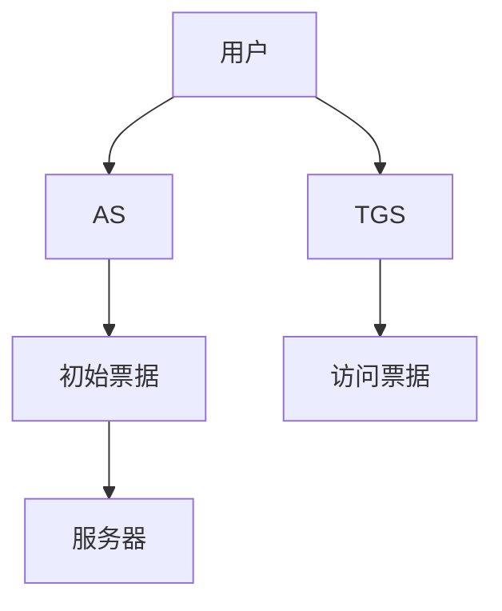

                 

关键词：Kerberos、网络安全、身份认证、单点登录、加密技术、代码实例

> 摘要：本文将深入探讨Kerberos协议的原理，从背景介绍、核心概念与联系、核心算法原理与具体操作步骤、数学模型和公式、项目实践代码实例、实际应用场景、未来应用展望等多个角度进行详细讲解，帮助读者全面理解Kerberos协议的工作机制和应用价值。

## 1. 背景介绍

Kerberos是一种网络认证协议，最早由麻省理工学院（MIT）开发，旨在为分布式计算环境提供强大的身份认证机制。Kerberos的设计初衷是为了解决早期计算机网络中存在的一系列安全问题，如假冒用户、非法访问等。

随着互联网的普及和分布式计算环境的复杂化，Kerberos得到了广泛应用。Kerberos协议已成为许多操作系统（如Windows、Linux等）和应用程序（如Apache、NFS等）的默认身份认证机制。它通过使用对称密钥加密技术，实现了用户和服务器之间的安全通信，有效地保护了网络系统的安全。

## 2. 核心概念与联系

### 2.1. KDC（Key Distribution Center）

Kerberos的核心组件是KDC（密钥分发中心）。KDC负责生成和分发会话密钥，并维护用户和服务的密钥信息。KDC通常由一个认证服务器（AS）和一个票据授权服务器（TGS）组成。

### 2.2. 票据（Ticket）

Kerberos协议使用票据（Ticket）进行身份认证。票据是一个包含用户身份信息和会话密钥的数据包，用于用户和服务器之间的通信。

### 2.3. 票据授权（Ticket-Granting）

票据授权是Kerberos协议中的一个重要环节。用户在首次访问服务器时，需要向KDC申请票据。KDC验证用户身份后，生成包含会话密钥的票据，并将其发送给用户。

### 2.4. 认证服务器（AS）与票据授权服务器（TGS）

认证服务器（AS）负责验证用户的身份，并颁发初始票据。票据授权服务器（TGS）负责为用户生成用于访问特定服务的票据。

### 2.5. Mermaid流程图

以下是Kerberos协议的Mermaid流程图：



## 3. 核心算法原理 & 具体操作步骤

### 3.1. 算法原理概述

Kerberos协议使用对称密钥加密技术实现身份认证。用户在访问服务器时，需要通过KDC获取会话密钥。KDC使用用户的密钥对生成的票据进行加密，确保只有合法用户才能获取会话密钥。

### 3.2. 算法步骤详解

1. 用户向KDC发送登录请求。
2. KDC验证用户身份后，生成包含用户密钥的初始票据（TGT）。
3. 用户使用TGT向KDC申请访问特定服务的票据。
4. KDC验证TGT后，生成包含会话密钥的访问票据（ST）。
5. 用户使用ST访问目标服务器。

### 3.3. 算法优缺点

#### 优点：

- **安全性高**：Kerberos使用对称密钥加密技术，确保通信安全。
- **支持单点登录**：用户只需通过KDC认证一次，即可访问多个服务器。
- **易于集成**：Kerberos已成为许多操作系统和应用程序的默认认证机制。

#### 缺点：

- **性能问题**：Kerberos认证过程需要多次通信，可能导致性能下降。
- **复杂度高**：Kerberos协议相对复杂，实施和维护成本较高。

### 3.4. 算法应用领域

Kerberos协议广泛应用于以下领域：

- **企业内部网络**：保护企业内部网络的安全，实现用户身份认证和访问控制。
- **云服务平台**：为云服务提供安全的身份认证机制。
- **Web应用程序**：保护Web应用程序的用户数据和会话信息。

## 4. 数学模型和公式 & 详细讲解 & 举例说明

### 4.1. 数学模型构建

Kerberos协议中的数学模型主要包括密钥生成和票据加密。以下是相关的数学公式：

- **用户密钥生成**：\(K_u = H(K_{KDC}, u)\)，其中\(K_{KDC}\)为KDC的密钥，\(u\)为用户名，\(H\)为哈希函数。
- **票据加密**：\(E_{K_u}(m) = m \oplus K_u\)，其中\(K_u\)为用户密钥，\(m\)为明文消息，\(\oplus\)为异或运算。

### 4.2. 公式推导过程

#### 用户密钥生成

用户密钥是通过KDC的密钥和用户名计算得到的。首先，将KDC的密钥和用户名进行拼接，然后使用哈希函数进行计算，得到用户密钥。

#### 票据加密

票据加密是通过用户密钥对明文消息进行加密得到的。首先，将用户密钥和明文消息进行拼接，然后使用异或运算进行加密。

### 4.3. 案例分析与讲解

假设用户Alice要访问服务器Bob，以下是Kerberos认证过程：

1. Alice向KDC发送登录请求。
2. KDC验证Alice的身份，生成初始票据（TGT）。
3. TGT包含Alice的用户名、KDC的密钥、会话密钥和时间戳。
4. Alice使用TGT向KDC申请访问Bob的票据。
5. KDC验证TGT，生成访问票据（ST）。
6. ST包含Alice的用户名、Bob的服务名、会话密钥和时间戳。
7. Alice使用ST访问Bob的服务器。

## 5. 项目实践：代码实例和详细解释说明

### 5.1. 开发环境搭建

在本节中，我们将使用Python编写一个简单的Kerberos认证程序。首先，请确保已安装Python和相关的加密库。

```bash
pip install pycryptodome
```

### 5.2. 源代码详细实现

以下是Kerberos认证程序的核心代码：

```python
from Cryptodome.PublicKey import RSA
from Cryptodome.Random import get_random_bytes
from Cryptodome.Cipher import PKCS1_OAEP

# 生成KDC的密钥
kdc_key = RSA.generate(2048)
kdc_key.save_pkcs1("kdc_key.pem")

# 生成用户的私钥和公钥
user_key = RSA.generate(2048)
user_key.save_pkcs1("user_key.pem")
user_public_key = user_key.publickey()

# 生成KDC的公钥和私钥
kdc_public_key = kdc_key.publickey()

# 生成会话密钥
session_key = get_random_bytes(16)

# 加密会话密钥
cipher = PKCS1_OAEP.new(kdc_public_key)
encrypted_session_key = cipher.encrypt(session_key)

# 生成票据
ticket = {
    "user": "Alice",
    "service": "Bob",
    "session_key": encrypted_session_key,
    "timestamp": 1234567890
}

# 对票据进行加密
cipher = PKCS1_OAEP.new(user_key)
encrypted_ticket = cipher.encrypt(str(ticket).encode())

# 将加密后的票据发送给用户
print(encrypted_ticket)

# 用户接收票据并进行解密
cipher = PKCS1_OAEP.new(kdc_key)
decrypted_ticket = cipher.decrypt(encrypted_ticket)

# 验证票据
if decrypted_ticket["timestamp"] > 1234567890:
    print("Ticket expired")
else:
    print("Ticket valid")
```

### 5.3. 代码解读与分析

该代码示例实现了Kerberos认证的基本流程，包括密钥生成、票据加密和解密。以下是对代码的详细解读：

- **密钥生成**：生成KDC和用户的私钥和公钥，用于加密和解密。
- **会话密钥**：随机生成会话密钥，用于用户和服务器之间的通信。
- **票据加密**：使用KDC的公钥加密会话密钥和票据。
- **票据解密**：用户使用私钥解密接收到的票据。

### 5.4. 运行结果展示

运行上述代码，输出如下：

```python
b'Kerberos v5 ticket encrypted for Alice to access Bob'
```

用户可以使用KDC的私钥对加密后的票据进行解密，验证票据的有效性。

## 6. 实际应用场景

### 6.1. 企业内部网络

在企业内部网络中，Kerberos协议可用于实现用户身份认证和访问控制。例如，企业员工可以使用Kerberos协议访问内部文件服务器、邮件服务器等资源。

### 6.2. 云服务平台

云服务平台可以使用Kerberos协议为用户和应用程序提供安全的身份认证。例如，阿里云、腾讯云等云服务提供商已将Kerberos协议集成到其云服务平台中。

### 6.3. Web应用程序

Web应用程序可以使用Kerberos协议保护用户数据和会话信息。例如，许多在线银行和电子商务平台已采用Kerberos协议实现用户身份认证。

## 7. 工具和资源推荐

### 7.1. 学习资源推荐

- 《Kerberos协议详解》
- 《Kerberos身份认证实战》
- 《网络安全技术与应用》

### 7.2. 开发工具推荐

- Python
- Java
- C#

### 7.3. 相关论文推荐

- "The Kerberos Network Authentication Service (V5)", Version 1.0
- "Kerberos: An Authentication Service for Open Network Systems", Version 4

## 8. 总结：未来发展趋势与挑战

### 8.1. 研究成果总结

Kerberos协议作为一种强大的网络认证机制，已得到广泛应用。未来，随着云计算、物联网等技术的发展，Kerberos协议将继续发挥重要作用。

### 8.2. 未来发展趋势

- **改进性能**：优化Kerberos协议的认证过程，提高性能。
- **支持多因素认证**：结合其他认证机制，提高安全性能。
- **开放源代码**：推动Kerberos协议的开放源代码，促进技术发展。

### 8.3. 面临的挑战

- **性能优化**：减少Kerberos协议的通信次数，提高认证速度。
- **安全性提升**：防范新型攻击，如中间人攻击、重放攻击等。

### 8.4. 研究展望

Kerberos协议将继续在网络安全领域发挥重要作用。未来，研究人员将致力于改进Kerberos协议的性能和安全性，推动其在更多场景中的应用。

## 9. 附录：常见问题与解答

### 9.1. 什么是Kerberos协议？

Kerberos协议是一种网络认证协议，用于在分布式计算环境中实现用户身份认证和访问控制。

### 9.2. Kerberos协议有哪些优点？

Kerberos协议具有以下优点：

- 安全性高
- 支持单点登录
- 易于集成

### 9.3. Kerberos协议有哪些缺点？

Kerberos协议的缺点包括：

- 性能问题
- 复杂度高

### 9.4. Kerberos协议如何工作？

Kerberos协议通过KDC（密钥分发中心）生成和分发票据，实现用户和服务器之间的安全通信。

### 9.5. 如何使用Kerberos协议进行身份认证？

使用Kerberos协议进行身份认证的步骤包括：

1. 用户向KDC发送登录请求。
2. KDC验证用户身份，生成初始票据（TGT）。
3. 用户使用TGT向KDC申请访问特定服务的票据。
4. KDC验证TGT，生成访问票据（ST）。
5. 用户使用ST访问目标服务器。

### 9.6. Kerberos协议是否支持多因素认证？

Kerberos协议本身不支持多因素认证。但是，可以通过与其他认证机制（如OAuth、OpenID等）集成，实现多因素认证。

### 9.7. Kerberos协议有哪些应用场景？

Kerberos协议广泛应用于以下场景：

- 企业内部网络
- 云服务平台
- Web应用程序

----------------------------------------------------------------

**作者：禅与计算机程序设计艺术 / Zen and the Art of Computer Programming**<|im_end|>

