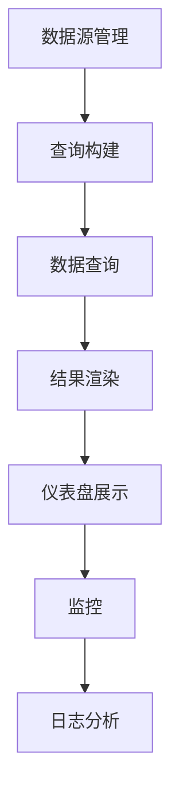

                 

关键词：Kibana、Elasticsearch、日志分析、数据可视化、监控工具

> 摘要：本文将深入探讨Kibana的核心原理，并通过代码实例详细讲解其实现方法。我们将从Kibana的基本概念开始，逐步深入其架构和功能，最终展示如何通过Kibana进行日志分析及数据可视化。

## 1. 背景介绍

Kibana是一款开源的数据可视化工具，与Elasticsearch紧密结合，用于日志分析和监控。其设计理念是帮助用户从大量的数据中提取有价值的信息，并直观地展示出来。Kibana的诞生背景是解决大规模分布式系统中日志管理和监控的需求。随着互联网应用的复杂性不断增加，如何有效地收集、存储和分析日志已成为一项重要挑战。Kibana通过将Elasticsearch的强大搜索和分析功能与直观的UI相结合，为用户提供了高效的日志分析解决方案。

## 2. 核心概念与联系

### 2.1 Kibana与Elasticsearch的关系

Kibana与Elasticsearch的关系类似于仪表盘与数据库的关系。Elasticsearch负责存储和检索数据，而Kibana则负责将Elasticsearch中的数据以直观的方式展示出来。两者通过REST API进行通信，Kibana发送查询请求到Elasticsearch，然后接收并渲染结果。

### 2.2 Kibana的架构

Kibana的架构相对简单，主要分为以下几个部分：

- **数据源管理**：用户可以通过Kibana配置各种数据源，如Elasticsearch集群、文件系统、InfluxDB等。
- **仪表盘**：用户可以在仪表盘中创建各种可视化组件，如折线图、柱状图、饼图等。
- **可视化**：Kibana提供了丰富的可视化选项，包括自定义SQL、MapReduce等。
- **监控**：Kibana可以监控Elasticsearch集群的健康状况和性能。

下面是一个Mermaid流程图，展示Kibana的核心组件和流程：



## 3. 核心算法原理 & 具体操作步骤

### 3.1 算法原理概述

Kibana的核心算法原理主要围绕数据可视化。其核心步骤包括：

- **数据查询**：从Elasticsearch中检索数据。
- **数据转换**：将检索到的数据转换为可视化组件需要的格式。
- **数据渲染**：使用D3.js等前端库将数据可视化。

### 3.2 算法步骤详解

#### 3.2.1 数据查询

数据查询是Kibana的核心步骤之一。用户可以通过Kibana的查询界面构建查询语句，然后发送到Elasticsearch。查询语句通常包含以下几个部分：

- **查询类型**：如match、range、term等。
- **查询条件**：如关键词匹配、范围查询等。
- **聚合**：对查询结果进行聚合分析。

#### 3.2.2 数据转换

查询结果通常是一个JSON格式的数据结构。Kibana需要将这些数据转换为可视化组件需要的格式。例如，对于一个时间序列数据，Kibana会将其转换为时间戳和值的形式。

#### 3.2.3 数据渲染

数据渲染是Kibana的核心功能。Kibana使用D3.js等前端库将转换后的数据进行可视化。D3.js是一个强大的前端库，可以创建各种复杂的可视化图表。

### 3.3 算法优缺点

#### 优点

- **高效**：Kibana利用Elasticsearch的强大搜索和分析能力，可以快速处理海量数据。
- **直观**：Kibana提供了丰富的可视化选项，用户可以轻松创建复杂的可视化图表。
- **灵活**：Kibana支持自定义查询和可视化组件，用户可以根据需求进行定制。

#### 缺点

- **依赖Elasticsearch**：Kibana需要与Elasticsearch紧密配合使用，不能独立工作。
- **学习曲线**：对于新手来说，Kibana的学习曲线可能相对较陡峭。

### 3.4 算法应用领域

Kibana广泛应用于各种领域，包括：

- **日志分析**：企业可以通过Kibana分析系统日志，快速定位故障点。
- **监控**：Kibana可以实时监控Elasticsearch集群的性能和健康状况。
- **数据分析**：Kibana提供了强大的数据分析和可视化功能，可以帮助企业从数据中提取有价值的信息。

## 4. 数学模型和公式 & 详细讲解 & 举例说明

### 4.1 数学模型构建

Kibana中的数学模型主要包括：

- **线性回归**：用于预测趋势。
- **时间序列分析**：用于分析时间序列数据。

### 4.2 公式推导过程

#### 4.2.1 线性回归

线性回归模型的基本公式为：

$$ y = ax + b $$

其中，$y$ 是因变量，$x$ 是自变量，$a$ 和 $b$ 是模型参数。

#### 4.2.2 时间序列分析

时间序列分析的基本模型为ARIMA模型，其公式为：

$$ X_t = c + \phi_1X_{t-1} + \phi_2X_{t-2} + ... + \phi_pX_{t-p} + \theta_1\epsilon_{t-1} + \theta_2\epsilon_{t-2} + ... + \theta_q\epsilon_{t-q} + \epsilon_t $$

其中，$X_t$ 是时间序列的当前值，$\epsilon_t$ 是随机误差项。

### 4.3 案例分析与讲解

假设我们有一个时间序列数据，如下表所示：

| 时间戳 | 值 |
|--------|----|
| 1      | 10 |
| 2      | 12 |
| 3      | 15 |
| 4      | 18 |
| 5      | 22 |

我们可以使用Kibana中的时间序列分析功能，构建一个ARIMA模型，并预测未来5个时间点的值。

## 5. 项目实践：代码实例和详细解释说明

### 5.1 开发环境搭建

首先，我们需要搭建一个Kibana和Elasticsearch的开发环境。以下是搭建步骤：

1. 安装Elasticsearch。
2. 启动Elasticsearch服务。
3. 安装Kibana。
4. 启动Kibana服务。

### 5.2 源代码详细实现

在这个示例中，我们将创建一个简单的Kibana仪表盘，用于展示Elasticsearch中的日志数据。

1. **配置Elasticsearch索引**：首先，我们需要在Elasticsearch中创建一个索引，用于存储日志数据。

```json
PUT /log-index
{
  "settings": {
    "number_of_shards": 1,
    "number_of_replicas": 0
  },
  "mappings": {
    "properties": {
      "@timestamp": {
        "type": "date"
      },
      "level": {
        "type": "keyword"
      },
      "message": {
        "type": "text"
      }
    }
  }
}
```

2. **导入日志数据**：接下来，我们将一些示例日志数据导入到Elasticsearch中。

```json
POST /log-index/_doc
{
  "@timestamp": "2023-03-01T00:00:00Z",
  "level": "INFO",
  "message": "Application started."
}

POST /log-index/_doc
{
  "@timestamp": "2023-03-01T00:10:00Z",
  "level": "WARN",
  "message": "Configuration error."
}
```

3. **创建Kibana仪表盘**：最后，我们将在Kibana中创建一个仪表盘，用于展示这些日志数据。

- 登录Kibana。
- 单击“创建仪表板”按钮。
- 添加一个“时间范围”可视化组件。
- 添加一个“条形图”可视化组件，用于显示不同级别的日志数量。
- 配置数据源，选择Elasticsearch集群和之前创建的索引。

### 5.3 代码解读与分析

以下是创建Kibana仪表盘的主要代码部分：

```javascript
// 创建时间范围可视化组件
const timeRangeVis = {
  type: "timegrain",
  title: "Time Range",
  timeGrain: {
    field: "@timestamp",
    grains: ["day", "week", "month"]
  }
};

// 创建条形图可视化组件
const barChartVis = {
  type: "bar",
  title: "Log Level Distribution",
  data: {
    index: "log-index",
    search: {
      query: {
        term: {
          "level": "*"
        }
      }
    },
    aggs: {
      levels: {
        terms: {
          field: "level",
          size: 5
        }
      }
    }
  },
  style: {
    type: "color",
    fields: ["level"]
  }
};

// 添加可视化组件到仪表盘
const dashboard = {
  title: "Log Analysis",
  rows: [
    {
      panels: [
        {
          ...timeRangeVis,
          width: 12,
          height: 250
        }
      ]
    },
    {
      panels: [
        {
          ...barChartVis,
          width: 12,
          height: 250
        }
      ]
    }
  ]
};

// 保存仪表盘
saveDashboard(dashboard);
```

这段代码首先定义了两个可视化组件：时间范围组件和条形图组件。时间范围组件用于显示日志的时间范围，条形图组件用于显示不同级别的日志数量。最后，将这两个组件添加到仪表盘中，并保存仪表盘。

### 5.4 运行结果展示

保存仪表盘后，我们可以在Kibana中看到以下运行结果：

- **时间范围组件**：显示日志的时间范围，可以调整时间范围查看不同时间段的数据。
- **条形图组件**：显示不同级别的日志数量，可以直观地了解日志的分布情况。

## 6. 实际应用场景

Kibana在实际应用中有着广泛的应用场景，以下是一些典型的应用场景：

- **日志分析**：企业可以使用Kibana对系统日志进行分析，快速定位故障点和异常情况。
- **性能监控**：Kibana可以实时监控Elasticsearch集群的性能和健康状况，帮助企业及时发现和解决问题。
- **业务分析**：Kibana提供了强大的数据分析和可视化功能，可以帮助企业从数据中提取有价值的信息，支持业务决策。

## 7. 工具和资源推荐

### 7.1 学习资源推荐

- **官方文档**：Kibana和Elasticsearch的官方文档是学习Kibana的绝佳资源。
- **在线教程**：一些在线教程和视频可以帮助新手快速入门Kibana。
- **社区论坛**：Elastic社区论坛是一个交流和学习的好地方，可以解决你在使用Kibana时遇到的问题。

### 7.2 开发工具推荐

- **Visual Studio Code**：一款强大的代码编辑器，支持Kibana和Elasticsearch的插件。
- **Kibana Dev Tools**：Kibana内置的开发工具，可以方便地调试和测试Kibana应用。

### 7.3 相关论文推荐

- **"Kibana: The Elastic Stack’s Data Visualization Tool"**：一篇介绍Kibana的综述论文。
- **"Elasticsearch: The Definitive Guide"**：Elasticsearch的官方指南，包含Kibana的相关内容。

## 8. 总结：未来发展趋势与挑战

### 8.1 研究成果总结

Kibana作为Elastic Stack的核心组件之一，已经在数据可视化和日志分析领域取得了显著的成果。其高效的可视化性能和灵活的定制能力使其成为企业首选的日志分析和监控工具。

### 8.2 未来发展趋势

随着大数据和人工智能技术的发展，Kibana的未来将更加光明。其发展趋势包括：

- **增强人工智能分析能力**：结合机器学习算法，提供更智能的数据分析功能。
- **跨平台支持**：提供更多平台的支持，如移动端和云计算环境。
- **社区和生态建设**：加强社区建设和生态建设，吸引更多的开发者和用户。

### 8.3 面临的挑战

尽管Kibana取得了显著的成果，但也面临一些挑战：

- **性能优化**：随着数据量的增加，如何优化Kibana的性能是一个重要的挑战。
- **用户界面设计**：如何设计更直观、更易用的用户界面，是Kibana需要持续关注的问题。
- **生态建设**：如何构建一个健康的生态圈，吸引更多的第三方插件和工具，是Kibana需要面对的挑战。

### 8.4 研究展望

未来，Kibana有望在以下几个方面取得突破：

- **智能数据分析**：结合人工智能和大数据技术，提供更智能、更高效的数据分析解决方案。
- **跨平台支持**：加强跨平台支持，为用户提供更灵活的使用方式。
- **社区建设**：加强与社区的互动，构建一个强大的Kibana生态系统。

## 9. 附录：常见问题与解答

### 9.1 Kibana与Elasticsearch的区别是什么？

Kibana和Elasticsearch是两个不同的工具，但它们紧密集成。Elasticsearch是一个强大的全文搜索引擎，用于存储和检索数据。Kibana则是用于数据可视化和日志分析的工具，通过Elasticsearch的API获取数据并展示出来。

### 9.2 Kibana支持哪些数据源？

Kibana支持多种数据源，包括Elasticsearch、InfluxDB、文件系统、MongoDB等。用户可以根据需求选择合适的数据源。

### 9.3 如何安装Kibana？

安装Kibana的步骤如下：

1. 下载Kibana安装包。
2. 解压安装包。
3. 运行Kibana服务器。

### 9.4 Kibana如何进行日志分析？

Kibana可以进行日志分析的具体步骤如下：

1. 在Kibana中创建一个数据源，选择Elasticsearch作为数据存储。
2. 配置Elasticsearch索引，指定日志数据的存储位置。
3. 创建一个仪表盘，添加可视化组件，如时间范围组件和条形图组件。
4. 配置数据源，选择Elasticsearch集群和索引。
5. 保存并运行仪表盘。

---

本文由禅与计算机程序设计艺术 / Zen and the Art of Computer Programming 撰写，旨在为读者提供关于Kibana原理和应用的全景介绍。希望通过本文，读者可以深入了解Kibana的核心原理，并学会如何使用Kibana进行日志分析及数据可视化。未来，Kibana将继续发展，为企业和开发者提供更强大的数据分析和可视化工具。|

