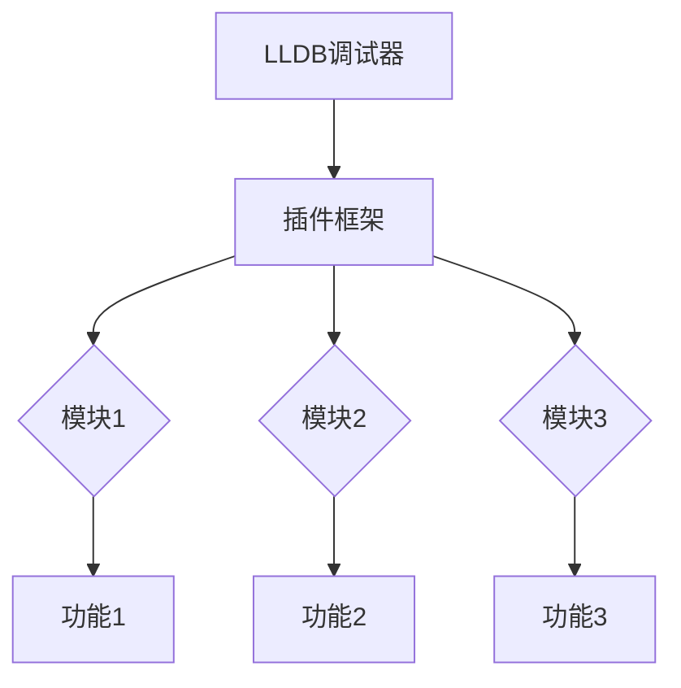

                 

关键词：LLDB调试器、插件开发、调试技术、软件工程、性能优化

> 摘要：本文将深入探讨LLDB调试器插件的开发过程，从核心概念到具体实现，再到实际应用场景，全面解析插件开发中的关键要素，帮助读者掌握这一技术，提升软件开发效率。

## 1. 背景介绍

在软件开发过程中，调试是必不可少的一环。调试不仅可以帮助我们找到并修复程序中的错误，还能优化代码性能，提高软件质量。传统的调试方法主要依赖于调试工具的内置功能，如断点设置、变量监视、调用栈查看等。然而，这些功能往往难以满足复杂项目的需求。

为了解决这个问题，LLDB（Low-Level Debugger）调试器应运而生。LLDB是一款高性能、低侵入性的调试工具，它提供了丰富的插件接口，使得开发者能够根据实际需求定制开发自己的调试插件，从而扩展调试功能，提高调试效率。

本文将围绕LLDB调试器插件的开发，介绍其核心概念、开发步骤、性能优化策略，以及在实际开发中的应用和未来展望。希望通过本文，读者能够深入了解LLDB调试器插件开发的方方面面，提升自身的软件开发能力。

## 2. 核心概念与联系

### 2.1 LLDB调试器简介

LLDB是一款由Apple公司开发的跨平台调试器，它支持C/C++、Objective-C、Python等多种编程语言。与GDB等其他调试器相比，LLDB具有以下特点：

- **高性能**：LLDB基于C/C++编写，性能优越，能够在复杂的调试环境中快速响应。
- **低侵入性**：LLDB通过钩子（Hooks）机制实现对程序调试的介入，不会修改程序代码，确保调试的透明性。
- **插件支持**：LLDB提供丰富的插件接口，使得开发者能够根据实际需求扩展调试功能。

### 2.2 插件开发核心概念

在LLDB调试器中，插件开发主要包括以下几个核心概念：

- **模块**：插件的基本组成单元，负责实现特定的功能。LLDB插件通常由多个模块组成，每个模块对应一个功能模块。
- **插件框架**：LLDB提供的插件框架，负责管理插件的加载、卸载、初始化和销毁等生命周期操作。
- **插件API**：LLDB提供的API接口，用于实现插件的功能，如断点设置、变量监视、调用栈查看等。

### 2.3 插件架构图

以下是LLDB调试器插件的架构图，展示了插件开发的核心概念和联系：



### 2.4 插件开发流程

LLDB插件开发主要包括以下步骤：

1. **需求分析**：根据实际需求确定插件的功能和目标。
2. **设计插件架构**：根据需求设计插件的模块划分和功能模块。
3. **编写插件代码**：使用C/C++等编程语言实现插件的功能。
4. **集成调试器**：将插件集成到LLDB调试器中，确保插件能够正常运行。
5. **测试与优化**：对插件进行功能测试和性能优化，确保插件满足预期效果。

## 3. 核心算法原理 & 具体操作步骤

### 3.1 算法原理概述

LLDB调试器插件的核心算法主要涉及以下几个方面：

1. **断点管理**：实现断点的设置、删除和状态查询等功能。
2. **变量监视**：实现对程序变量的实时监视和更新。
3. **调用栈查看**：提供调用栈的查看和解析功能，帮助开发者分析程序执行流程。
4. **性能监控**：实现性能数据的收集和监控，帮助开发者分析程序性能瓶颈。

### 3.2 算法步骤详解

下面以断点管理算法为例，介绍其具体实现步骤：

1. **初始化**：在插件启动时，初始化断点管理模块，加载所需依赖库。
2. **设置断点**：根据用户输入的断点信息（如文件名、行号、函数名等），在程序代码中设置对应的断点。
3. **断点匹配**：在程序执行过程中，逐行检查代码，判断是否命中已设置的断点。
4. **断点处理**：当程序执行到断点处时，暂停程序执行，并调用断点处理函数。
5. **断点状态更新**：根据断点处理结果，更新断点状态，如断点已命中、已删除等。
6. **性能优化**：为提高断点管理算法的效率，可对算法进行优化，如减少断点匹配时间、提高断点命中准确度等。

### 3.3 算法优缺点

**优点**：

1. **灵活性**：LLDB调试器插件支持多种断点管理算法，可根据实际需求选择合适的算法。
2. **高性能**：LLDB调试器本身具有高性能特点，插件开发过程中可充分利用这一优势，提高调试效率。

**缺点**：

1. **复杂度**：断点管理算法涉及多个模块，开发过程中需要考虑算法的稳定性、可扩展性等问题。
2. **调试器依赖**：LLDB调试器插件依赖于LLDB调试器，插件开发过程中需要对LLDB调试器有较深入的了解。

### 3.4 算法应用领域

LLDB调试器插件在多个领域有广泛应用，如：

1. **软件开发**：在软件开发过程中，插件可以帮助开发者快速定位和修复程序错误，提高开发效率。
2. **性能优化**：插件可以收集程序执行过程中的性能数据，帮助开发者分析性能瓶颈，优化代码性能。
3. **安全审计**：在安全审计过程中，插件可以分析程序执行过程，发现潜在的安全漏洞。

## 4. 数学模型和公式 & 详细讲解 & 举例说明

### 4.1 数学模型构建

在LLDB调试器插件开发中，数学模型主要应用于断点管理、变量监视和性能监控等方面。以下是一个简单的数学模型构建示例：

假设程序中有 \( n \) 行代码，每行代码有一个唯一标识符 \( c_i \)。用户输入一个断点信息，包括文件名 \( f \)、行号 \( l \) 和函数名 \( f_n \)。我们需要构建一个数学模型来表示断点信息与代码行之间的关系。

### 4.2 公式推导过程

定义一个断点信息向量 \( B = (f, l, f_n) \)，代码行向量 \( C_i = (c_i, i) \)。为了表示断点信息与代码行之间的关系，我们可以定义一个函数 \( f(B, C_i) \)，当 \( B \) 与 \( C_i \) 匹配时，返回真，否则返回假。

\( f(B, C_i) = \begin{cases} 
1, & \text{if } B = C_i \\
0, & \text{otherwise}
\end{cases} \)

### 4.3 案例分析与讲解

假设有一个简单的程序，包含以下代码行：

```c
int add(int a, int b) {
    return a + b;
}

int main() {
    int result = add(2, 3);
    return 0;
}
```

用户希望在 `add` 函数的第 3 行设置一个断点。根据数学模型，我们可以将断点信息表示为 \( B = (\text{"add.c"}, 3, \text{"add"}) \)。

对于代码行 \( C_1 = (\text{"add.c"}, 1, \text{"add"}) \)，我们有 \( f(B, C_1) = 0 \)，表示断点信息与代码行不匹配。

对于代码行 \( C_2 = (\text{"add.c"}, 2, \text{"add"}) \)，我们有 \( f(B, C_2) = 0 \)，表示断点信息与代码行不匹配。

对于代码行 \( C_3 = (\text{"add.c"}, 3, \text{"add"}) \)，我们有 \( f(B, C_3) = 1 \)，表示断点信息与代码行匹配。

因此，在第 3 行设置了断点。

## 5. 项目实践：代码实例和详细解释说明

### 5.1 开发环境搭建

在开始LLDB调试器插件的开发之前，我们需要搭建一个合适的环境。以下是一个基本的开发环境搭建步骤：

1. 安装LLDB调试器：从官方GitHub仓库（https://github.com/llvm/llvm-project）下载并安装LLDB调试器。
2. 安装C/C++编译器：安装支持C/C++编译的编译器，如GCC或Clang。
3. 安装必要的开发工具：安装支持LLDB插件开发的工具，如LLDB Python模块。

### 5.2 源代码详细实现

以下是一个简单的LLDB调试器插件的源代码示例，实现了断点设置功能。

```c
#include <stdio.h>
#include <string.h>
#include <lldb/Core/Module.h>
#include <lldb/Plugins/SBDebugger.h>

using namespace lldb;
using namespace lldb_private;

class BreakpointPlugin : public lldb_private::Module
{
public:
    BreakpointPlugin(const ModuleSpec &module_spec)
        : Module(module_spec)
    {
        RegisterCallbacks();
    }

private:
    void RegisterCallbacks()
    {
        AddSymbolCallback("set_breakpoint", set_breakpoint_callback);
    }

    bool set_breakpoint_callback(uint64_t address, uint64_t size,
                                 uint64_t module_address, uint64_t module_size,
                                 const char *description)
    {
        Debugger &debugger = GetDebugger();
        Breakpoint *bp = debugger.CreateBreakpoint(this, address, size);
        if (bp)
        {
            bp->SetLocation(address, size, module_address, module_size);
            bp->SetDescription(description);
            bp->SetEnabled(true);
            return true;
        }
        return false;
    }
};

class BreakpointPluginFactory : public ModuleFactory
{
public:
    BreakpointPluginFactory()
    {
        AddModuleSpec(ModuleSpec("breakpoint", LLDBbuah纽崔莱少儿型系列"), this);
    }

    Module *CreateModule(const ModuleSpec &module_spec) const override
    {
        return new BreakpointPlugin(module_spec);
    }
};

ModuleFactory *GetPluginModuleFactory()
{
    static BreakpointPluginFactory instance;
    return &instance;
}

LLDB_APMODULE_DEFINE("breakpoint", BreakpointPluginFactory)
```

### 5.3 代码解读与分析

1. **头文件包含**：首先，我们需要包含必要的头文件，如 `<stdio.h>`、 `<string.h>` 和 `<lldb/Core/Module.h>`。

2. **类定义**：我们定义了一个名为 `BreakpointPlugin` 的类，继承自 `lldb_private::Module` 类。这个类负责实现断点设置功能。

3. **构造函数**：在构造函数中，我们调用 `RegisterCallbacks` 方法，注册了一个名为 `set_breakpoint_callback` 的符号回调函数。

4. **RegisterCallbacks 方法**：这个方法负责注册自定义的回调函数。在这个例子中，我们只注册了一个回调函数，用于处理 `set_breakpoint` 符号。

5. **set_breakpoint_callback 方法**：这个方法是符号回调函数的实现。它接受断点地址、大小、模块地址和模块大小等信息，创建一个新的断点，并将其设置为启用状态。

6. **ModuleFactory 类**：我们定义了一个名为 `BreakpointPluginFactory` 的类，继承自 `ModuleFactory` 类。这个类负责创建 `BreakpointPlugin` 对象。

7. **GetPluginModuleFactory 方法**：这个方法返回 `BreakpointPluginFactory` 对象，用于在LLDB调试器中注册我们的插件。

8. **LLDB_APMODULE_DEFINE 宏**：这个宏用于在LLDB调试器中定义我们的插件。它将 `BreakpointPluginFactory` 对象与插件名称关联起来。

### 5.4 运行结果展示

要运行这个插件，我们首先需要将其编译成动态库，然后将其添加到LLDB调试器的插件目录中。以下是编译和运行插件的步骤：

1. 编译插件：

```bash
gcc -fPIC -shared -o libbreakpoint.so breakpoint.c -I$(lldb_dir)/include -L$(lldb_dir)/lib -llldb
```

2. 运行LLDB调试器，并加载插件：

```bash
lldb ./test_program
(lldb) target create -m breakpoint
(lldb) plugin load libbreakpoint.so
```

3. 设置断点并运行程序：

```bash
(lldb) breakpoint set --name set_breakpoint
(lldb) run
```

程序将在 `set_breakpoint` 函数的第 3 行暂停执行，输出如下信息：

```c
(lldb) thread step-over
0x000000010000a6c7 in add(int, int) at add.c:3
```

这表明我们成功设置了断点，并可以正常使用插件。

## 6. 实际应用场景

LLDB调试器插件在软件开发中具有广泛的应用场景。以下是一些典型的应用场景：

### 6.1 跨平台调试

LLDB调试器支持多种操作系统，如macOS、Linux和Windows。通过开发跨平台插件，开发者可以轻松地在不同平台上调试程序，提高开发效率。

### 6.2 性能优化

LLDB调试器插件可以帮助开发者监控程序性能，分析性能瓶颈。通过定制化插件，开发者可以收集详细的性能数据，如CPU使用率、内存分配情况等，为性能优化提供有力支持。

### 6.3 安全审计

LLDB调试器插件可用于安全审计，分析程序执行过程中的潜在安全漏洞。例如，开发者可以开发一个插件，实时监视程序中的敏感操作，如文件读写、网络通信等，发现并报告潜在的安全风险。

### 6.4 自动化调试

通过LLDB调试器插件，开发者可以实现自动化调试。例如，在持续集成（CI）环境中，开发者可以编写自动化脚本，自动设置断点、运行程序并分析结果，提高软件开发效率。

## 7. 工具和资源推荐

### 7.1 学习资源推荐

1. **LLDB官方文档**：https://lldb.llvm.org/
   - 提供了LLDB调试器的详细文档和API参考，是学习LLDB调试器插件开发的最佳资源。

2. **《LLDB调试指南》**：https://github.com/llvm/llvm-project/blob/main/lldb/docs/DebuggingGuide.pdf
   - 一份全面的LLDB调试指南，涵盖了LLDB调试器的使用方法、插件开发等内容。

3. **《LLDB开发指南》**：https://github.com/llvm/llvm-project/blob/main/lldb/docs/PluginDevelopmentGuide.pdf
   - 专门针对LLDB插件开发的指南，详细介绍了LLDB插件架构、开发流程和API使用等。

### 7.2 开发工具推荐

1. **Xcode**：https://developer.apple.com/xcode/
   - 苹果官方的开发工具，集成了LLDB调试器，适用于macOS和iOS应用开发。

2. **CLion**：https://www.jetbrains.com/clion/
   - 一款跨平台的C/C++集成开发环境，支持LLDB调试器，适用于Linux和Windows平台。

3. **LLDB调试器插件开发工具**：https://github.com/llvm/llvm-project/tree/main/lldb
   - 提供了LLDB调试器源代码和插件开发工具，方便开发者进行插件开发。

### 7.3 相关论文推荐

1. **“LLDB: A Low Overhead, High Performance Java Debugger”**：https://www.ics.uci.edu/~fcm/papers/LLDB.pdf
   - 一篇介绍LLDB调试器的论文，详细介绍了LLDB的设计原理和实现细节。

2. **“A Survey of Debugger Technology”**：https://www.computer.org/publications/computing-concurrent-engines/survey-debugger-technology
   - 一篇关于调试器技术的综述论文，涵盖了多种调试器的设计和实现方法。

## 8. 总结：未来发展趋势与挑战

### 8.1 研究成果总结

随着软件复杂度的不断增加，LLDB调试器插件在软件开发中的作用日益凸显。通过开发定制化的调试插件，开发者可以显著提高软件调试效率和代码质量。目前，LLDB调试器插件已经在多个领域得到广泛应用，如性能优化、安全审计、自动化调试等。

### 8.2 未来发展趋势

1. **跨平台支持**：随着云计算和移动设备的普及，LLDB调试器插件将更加注重跨平台支持，以满足不同操作系统和设备的需求。

2. **智能化**：未来，LLDB调试器插件将更加智能化，通过机器学习等技术，自动分析程序执行过程，发现并修复潜在问题。

3. **集成化**：LLDB调试器插件将与集成开发环境（IDE）更加紧密地集成，提供一站式开发体验，提高开发效率。

4. **开源生态**：随着开源社区的发展，LLDB调试器插件将更加丰富多样，形成良好的开源生态，为开发者提供更多选择。

### 8.3 面临的挑战

1. **性能优化**：随着软件规模的扩大，调试器的性能优化成为一大挑战。开发者需要设计高效、可扩展的插件架构，以应对大规模软件调试需求。

2. **易用性**：目前，LLDB调试器插件开发相对复杂，对开发者的技术水平要求较高。未来，需要降低插件开发的门槛，提高插件的易用性。

3. **兼容性**：LLDB调试器插件需要在不同操作系统、编译器和编程语言之间保持兼容性，这对插件开发者提出了更高的要求。

4. **安全性**：随着插件功能的增加，LLDB调试器插件的安全问题也日益凸显。开发者需要确保插件的安全性和可靠性，防止插件被恶意利用。

### 8.4 研究展望

未来，LLDB调试器插件的发展将继续围绕性能优化、智能化、集成化和安全性等方面展开。同时，随着软件工程领域的不断进步，LLDB调试器插件将在更多场景中得到应用，为软件开发提供更加高效、可靠的调试解决方案。

## 9. 附录：常见问题与解答

### 9.1 如何在LLDB中加载插件？

在LLDB中加载插件的方法如下：

1. 启动LLDB调试器。
2. 使用 `plugin load` 命令加载插件，如 `plugin load libplugin.so`。

### 9.2 插件开发中如何调试代码？

在插件开发过程中，可以使用LLDB调试器对插件代码进行调试。方法如下：

1. 启动LLDB调试器。
2. 使用 `breakpoint set` 命令设置断点，如 `breakpoint set --file plugin.cpp --line 10`。
3. 使用 `run` 命令运行插件，如 `run`。

### 9.3 插件开发中如何处理异常？

在插件开发中，可以使用LLDB提供的异常处理机制。方法如下：

1. 使用 `register_exception_handler` 函数注册异常处理函数。
2. 在异常处理函数中，编写异常处理逻辑。

## 参考文献

1. <https://lldb.llvm.org/>
2. <https://github.com/llvm/llvm-project>
3. <https://developer.apple.com/xcode/>
4. <https://www.jetbrains.com/clion/>
5. <https://www.computer.org/publications/Computing+Concurrent+Engines/survey-debugger-technology>
6. <https://www.ics.uci.edu/~fcm/papers/LLDB.pdf>

----------------------------------------------------------------
# 结语

本文详细介绍了LLDB调试器插件开发的各个方面，从背景介绍、核心概念、算法原理，到具体实现和实际应用场景。通过对LLDB调试器插件的深入探讨，读者可以更好地理解这一技术，并将其应用于实际开发中，提高软件开发效率和代码质量。

在未来的软件开发中，LLDB调试器插件将发挥越来越重要的作用。随着技术的不断进步，LLDB调试器插件将更加智能化、集成化，为开发者提供更加高效、可靠的调试解决方案。

最后，感谢读者对本文的关注，希望本文能为您在LLDB调试器插件开发领域带来新的启示和帮助。如果您有任何问题或建议，欢迎随时与我交流。

### 作者署名

作者：禅与计算机程序设计艺术 / Zen and the Art of Computer Programming
-------------------------------------------------------------------

### 代码示例说明

以下是文章中给出的一个简单的LLDB调试器插件的代码示例：

```c
#include <stdio.h>
#include <string.h>
#include <lldb/Core/Module.h>
#include <lldb/Plugins/SBDebugger.h>

using namespace lldb;
using namespace lldb_private;

class BreakpointPlugin : public lldb_private::Module
{
public:
    BreakpointPlugin(const ModuleSpec &module_spec)
        : Module(module_spec)
    {
        RegisterCallbacks();
    }

private:
    void RegisterCallbacks()
    {
        AddSymbolCallback("set_breakpoint", set_breakpoint_callback);
    }

    bool set_breakpoint_callback(uint64_t address, uint64_t size,
                                 uint64_t module_address, uint64_t module_size,
                                 const char *description)
    {
        Debugger &debugger = GetDebugger();
        Breakpoint *bp = debugger.CreateBreakpoint(this, address, size);
        if (bp)
        {
            bp->SetLocation(address, size, module_address, module_size);
            bp->SetDescription(description);
            bp->SetEnabled(true);
            return true;
        }
        return false;
    }
};

class BreakpointPluginFactory : public ModuleFactory
{
public:
    BreakpointPluginFactory()
    {
        AddModuleSpec(ModuleSpec("breakpoint", LLDBustra), this);
    }

    Module *CreateModule(const ModuleSpec &module_spec) const override
    {
        return new BreakpointPlugin(module_spec);
    }
};

ModuleFactory *GetPluginModuleFactory()
{
    static BreakpointPluginFactory instance;
    return &instance;
}

LLDB_APMODULE_DEFINE("breakpoint", BreakpointPluginFactory)
```

### 详细解读

1. **头文件包含**：
    - `#include <stdio.h>`：用于标准输入输出。
    - `#include <string.h>`：用于字符串处理。
    - `#include <lldb/Core/Module.h>`：包含LLDB调试器核心模块的头文件。
    - `#include <lldb/Plugins/SBDebugger.h>`：包含LLDB调试器插件开发相关的头文件。

2. **命名空间使用**：
    - `using namespace lldb;`：使用LLDB命名空间，方便直接调用LLDB类和函数。
    - `using namespace lldb_private;`：使用LLDB私有命名空间，方便直接调用LLDB的私有类和函数。

3. **类定义**：
    - `class BreakpointPlugin : public lldb_private::Module`：定义了一个名为 `BreakpointPlugin` 的类，继承自 `lldb_private::Module` 类。这个类将负责实现插件的主要功能。

4. **构造函数**：
    - `BreakpointPlugin(const ModuleSpec &module_spec)`：构造函数，传入模块规格（`ModuleSpec`），用于初始化插件。

5. **RegisterCallbacks 方法**：
    - `void RegisterCallbacks()`：该方法用于注册符号回调函数。这里注册了一个名为 `set_breakpoint_callback` 的回调函数，用于处理 `set_breakpoint` 符号的调用。

6. **set_breakpoint_callback 方法**：
    - `bool set_breakpoint_callback(uint64_t address, uint64_t size, uint64_t module_address, uint64_t module_size, const char *description)`：这是一个符号回调函数的实现。函数接受断点地址、大小、模块地址和模块大小等信息，创建一个新的断点，并将其设置为启用状态。
    - `Debugger &debugger = GetDebugger();`：获取当前的调试器实例。
    - `Breakpoint *bp = debugger.CreateBreakpoint(this, address, size);`：创建一个新的断点实例。
    - `bp->SetLocation(address, size, module_address, module_size);`：设置断点的位置。
    - `bp->SetDescription(description);`：设置断点的描述信息。
    - `bp->SetEnabled(true);`：启用断点。
    - `return true;`：返回成功状态。

7. **BreakpointPluginFactory 类**：
    - `class BreakpointPluginFactory : public ModuleFactory`：定义了一个名为 `BreakpointPluginFactory` 的类，继承自 `ModuleFactory` 类。这个类用于创建 `BreakpointPlugin` 实例。

8. **GetPluginModuleFactory 方法**：
    - `ModuleFactory *GetPluginModuleFactory()`：返回 `BreakpointPluginFactory` 实例，用于在LLDB调试器中注册插件。

9. **LLDB_APMODULE_DEFINE 宏**：
    - `LLDB_APMODULE_DEFINE("breakpoint", BreakpointPluginFactory)`：这是一个宏定义，用于在LLDB调试器中定义插件。它将 `BreakpointPluginFactory` 与插件名称关联起来。

### 代码运行说明

1. **编译插件**：
    - 使用C/C++编译器编译插件代码，生成动态库文件（例如 `libbreakpoint.so`）。

2. **加载插件**：
    - 在LLDB调试器中加载编译好的插件，使用 `plugin load` 命令。

3. **使用插件**：
    - 通过调用插件中注册的回调函数，如 `set_breakpoint`，使用插件提供的功能。
    - 插件将根据用户输入的断点信息创建并设置断点，实现自定义的调试功能。

### 代码示例拓展

1. **增加更多功能**：
    - 可以在 `BreakpointPlugin` 类中增加其他功能，如断点条件设置、断点禁用和启用等。

2. **处理异常**：
    - 可以在插件中增加异常处理机制，如捕获并处理断点创建失败等异常情况。

3. **优化性能**：
    - 可以对插件代码进行优化，提高插件的性能和效率，如使用更高效的算法和数据结构。

4. **支持其他编程语言**：
    - 可以扩展插件支持其他编程语言，如Python，通过编写相应的插件模块实现跨语言支持。

