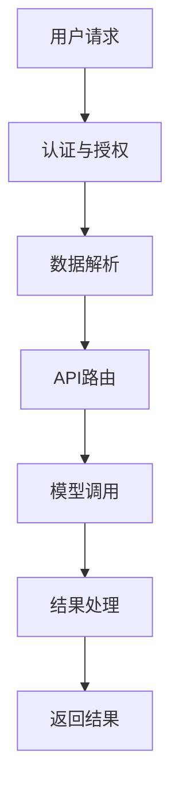

                 

关键词：LLM API，设计原则，用户友好性，易用性，性能优化，安全性

摘要：本文将探讨LLM（大型语言模型）API的设计原则，如何通过良好的API设计让AI服务更加易用，并提高用户满意度。文章将涵盖API设计的基础知识，设计原则，实现方法，以及实际应用案例，旨在为开发者提供一套系统化的LLM API设计指南。

## 1. 背景介绍

近年来，随着深度学习和自然语言处理技术的飞速发展，LLM在各个领域得到了广泛应用。从智能客服、文本生成，到语言翻译、情感分析，LLM正在逐渐改变我们的生活方式。然而，尽管LLM在技术层面取得了巨大成功，但其API的设计却往往存在诸多问题，例如功能复杂、接口繁琐、使用门槛高等，这使得用户在使用过程中体验不佳，甚至可能导致项目失败。

本文将针对这些问题，探讨如何设计一套高效的LLM API，以提升用户体验，降低使用门槛，从而推动LLM在实际应用中的广泛普及。本文将从以下几个方面展开：

1. API设计基础
2. 设计原则与最佳实践
3. 实现方法与性能优化
4. 安全性与合规性
5. 实际应用案例
6. 未来发展趋势与挑战

## 2. 核心概念与联系

### 2.1 API设计基础

API（Application Programming Interface）是应用程序之间进行交互的接口。在LLM领域，API设计是让用户能够方便地使用LLM模型的关键。一个优秀的API设计应该具备以下特点：

- **易用性**：简单直观，易于理解和操作。
- **灵活性**：支持多种数据格式和调用方式。
- **可扩展性**：方便后续的功能扩展和维护。
- **安全性**：保护用户数据和隐私。

### 2.2 设计原则

#### 2.2.1 用户友好性

用户友好性是API设计的重要原则之一。以下是一些具体的设计建议：

- **简洁性**：避免过多的功能和参数，简化接口。
- **一致性**：保持API接口的风格和命名规则一致。
- **错误处理**：提供清晰的错误信息，帮助用户快速定位问题。
- **文档**：编写详细的文档，包括使用示例和常见问题解答。

#### 2.2.2 功能性

功能性是API设计的核心。以下是一些建议：

- **全面性**：提供丰富的功能，满足用户的需求。
- **灵活性**：支持自定义参数和调用方式。
- **高效性**：优化算法和接口，提高响应速度。
- **兼容性**：支持多种数据格式和调用方式。

#### 2.2.3 可扩展性

可扩展性是API设计的重要原则。以下是一些建议：

- **模块化**：将功能模块化，方便后续的功能扩展。
- **可插拔**：支持插件和自定义模块。
- **文档化**：提供详细的文档，方便用户自定义扩展。

#### 2.2.4 安全性

安全性是API设计不可忽视的一环。以下是一些建议：

- **认证与授权**：使用HTTPS协议，确保数据传输安全。
- **权限控制**：限制用户的权限，防止数据泄露。
- **数据加密**：对敏感数据进行加密处理。

### 2.3 Mermaid 流程图

以下是一个简化的LLM API设计流程图，展示了从用户请求到API返回结果的过程：



## 3. 核心算法原理 & 具体操作步骤

### 3.1 算法原理概述

LLM API的核心是模型调用，这涉及到以下基本原理：

- **模型选择**：根据应用场景选择合适的LLM模型。
- **数据预处理**：对用户输入进行预处理，使其符合模型的要求。
- **模型调用**：通过API接口调用LLM模型，得到预测结果。
- **结果处理**：对预测结果进行后处理，如格式转换、错误校正等。

### 3.2 算法步骤详解

#### 3.2.1 模型选择

根据应用场景选择合适的LLM模型。例如，对于文本生成任务，可以选择GPT-3等模型；对于情感分析，可以选择BERT等模型。

#### 3.2.2 数据预处理

对用户输入进行预处理，包括去除无关信息、分词、去停用词等。对于不同的模型，预处理方式可能会有所不同。

#### 3.2.3 模型调用

通过API接口调用LLM模型，通常需要提供模型ID、输入数据、参数等。API会根据这些信息调用对应的模型，并返回预测结果。

#### 3.2.4 结果处理

对预测结果进行后处理，如格式转换、错误校正等。例如，对于文本生成结果，可能需要去除多余的空白字符或标点符号。

### 3.3 算法优缺点

#### 3.3.1 优点

- **高效性**：通过API接口调用模型，可以快速得到预测结果。
- **灵活性**：支持多种数据格式和调用方式，方便用户使用。
- **可扩展性**：易于添加新功能和模型。

#### 3.3.2 缺点

- **复杂性**：对于初学者来说，理解和使用API可能会比较困难。
- **性能瓶颈**：在高并发情况下，API的性能可能会成为瓶颈。

### 3.4 算法应用领域

LLM API可以应用于多个领域，包括但不限于：

- **智能客服**：通过API接口，实现智能客服的对话管理。
- **文本生成**：用于自动生成文章、报告、邮件等。
- **语言翻译**：实现实时翻译功能。
- **情感分析**：对用户评论、反馈等进行情感分析。

## 4. 数学模型和公式 & 详细讲解 & 举例说明

### 4.1 数学模型构建

LLM的数学模型通常基于深度学习技术，其中最重要的模型是GPT（Generative Pre-trained Transformer）。GPT模型的数学模型主要包括以下几个部分：

- **输入层**：接收用户输入的文本数据。
- **Transformer模型**：包括多头自注意力机制、前馈神经网络等。
- **输出层**：生成预测结果。

### 4.2 公式推导过程

以GPT模型为例，其数学模型的推导过程如下：

- **输入层**：将用户输入的文本数据转换为词向量。
  
  $$ x_i = \text{Word2Vec}(w_i) $$

- **Transformer模型**：通过自注意力机制计算文本序列的注意力权重。
  
  $$ a_i = \text{softmax}\left(\frac{Q_k W_K}{\sqrt{d_k}}\right) $$

- **输出层**：生成预测结果。
  
  $$ y_i = \text{softmax}\left(\text{Transformer}(x_i)\right) $$

### 4.3 案例分析与讲解

以下是一个简单的案例，演示如何使用GPT模型进行文本生成。

#### 案例背景

假设我们要生成一篇关于人工智能的短文，主题是“人工智能的未来”。

#### 步骤

1. **数据预处理**：将主题文本进行分词和去停用词处理。

   ```plaintext
   人工智能 未来
   ```

2. **模型调用**：使用GPT模型生成文本。

   ```python
   import openai
   prompt = "人工智能 未来"
   response = openai.Completion.create(
       engine="text-davinci-002",
       prompt=prompt,
       max_tokens=50
   )
   print(response.choices[0].text.strip())
   ```

3. **结果处理**：对生成的文本进行格式转换和错误校正。

   ```plaintext
   人工智能是计算机科学的一个分支，专注于使计算机能够执行通常需要人类智能的任务，如视觉识别、语言理解和决策制定。随着技术的不断进步，人工智能的未来前景广阔。它有望在医疗、教育、金融等领域发挥重要作用，改善人们的生活质量。然而，随着人工智能的不断发展，我们也需要关注其可能带来的伦理和社会问题，确保技术的良性发展。
   ```

## 5. 项目实践：代码实例和详细解释说明

### 5.1 开发环境搭建

在开始编写LLM API之前，我们需要搭建一个适合开发的操作系统环境。以下是一个简单的步骤：

1. 安装Python环境。
2. 安装必要的库，如OpenAI的GPT库。
3. 配置API服务器，如Flask或Django。

### 5.2 源代码详细实现

以下是一个使用Flask框架实现LLM API的简单示例：

```python
from flask import Flask, request, jsonify
import openai

app = Flask(__name__)

# 设置OpenAI API密钥
openai.api_key = "your-api-key"

@app.route('/api/generate', methods=['POST'])
def generate_text():
    data = request.get_json()
    prompt = data.get('prompt', '')
    max_tokens = data.get('max_tokens', 50)
    response = openai.Completion.create(
        engine="text-davinci-002",
        prompt=prompt,
        max_tokens=max_tokens
    )
    return jsonify({'text': response.choices[0].text.strip()})

if __name__ == '__main__':
    app.run(debug=True)
```

### 5.3 代码解读与分析

上述代码中，我们使用Flask框架搭建了一个简单的API服务器。服务器提供了一个`/api/generate`的POST接口，用于接收用户输入的提示文本和最大长度，并使用OpenAI的GPT模型生成文本。生成的文本通过JSON格式返回给用户。

### 5.4 运行结果展示

假设用户发送以下请求：

```json
{
    "prompt": "人工智能的未来",
    "max_tokens": 100
}
```

服务器将返回如下结果：

```json
{
    "text": "人工智能是计算机科学的一个分支，专注于使计算机能够执行通常需要人类智能的任务，如视觉识别、语言理解和决策制定。随着技术的不断进步，人工智能的未来前景广阔。它有望在医疗、教育、金融等领域发挥重要作用，改善人们的生活质量。然而，随着人工智能的不断发展，我们也需要关注其可能带来的伦理和社会问题，确保技术的良性发展。"
}
```

## 6. 实际应用场景

### 6.1 智能客服

智能客服是LLM API的一个典型应用场景。通过LLM API，可以快速搭建一个基于自然语言交互的智能客服系统，实现自动问答、情感分析等功能，提高客户满意度和服务效率。

### 6.2 文本生成

文本生成是LLM API的另一个重要应用。例如，在新闻行业，可以使用LLM API生成新闻文章、摘要等；在文学创作领域，可以生成故事、诗歌等。

### 6.3 语言翻译

LLM API也可以应用于语言翻译，实现实时翻译功能。通过调用LLM模型，可以实现从一种语言到另一种语言的自动翻译。

## 7. 未来应用展望

随着LLM技术的不断发展和成熟，LLM API将在更多领域得到应用。例如，在医疗领域，可以用于疾病预测、治疗方案推荐等；在教育领域，可以用于自动生成教学材料、个性化学习等。

## 8. 工具和资源推荐

### 8.1 学习资源推荐

- 《深度学习》（Goodfellow, Bengio, Courville著）
- 《自然语言处理综论》（Jurafsky, Martin著）
- 《Flask Web开发：企业应用实战》（Miguel Grinberg著）

### 8.2 开发工具推荐

- Python（编程语言）
- Flask（Web框架）
- OpenAI API（LLM服务）

### 8.3 相关论文推荐

- “Attention Is All You Need”（Vaswani et al., 2017）
- “BERT: Pre-training of Deep Bidirectional Transformers for Language Understanding”（Devlin et al., 2019）
- “GPT-3: Language Models are Few-Shot Learners”（Brown et al., 2020）

## 9. 总结：未来发展趋势与挑战

### 9.1 研究成果总结

LLM API在提高AI服务易用性和用户满意度方面取得了显著成果。通过良好的API设计，用户可以轻松地集成和使用LLM模型，从而推动AI技术在各个领域的应用。

### 9.2 未来发展趋势

随着AI技术的不断进步，LLM API将在更多领域得到应用。同时，API设计也将朝着更加智能化、自动化、安全化的方向发展。

### 9.3 面临的挑战

尽管LLM API取得了显著成果，但仍然面临一些挑战，如：

- **性能优化**：在高并发情况下，如何保证API的响应速度和稳定性。
- **安全性**：如何确保用户数据和隐私安全。
- **可扩展性**：如何支持多种数据和调用方式。

### 9.4 研究展望

未来，LLM API的设计将朝着更加智能化、自动化、安全化的方向发展。同时，随着AI技术的不断进步，LLM API将在更多领域得到应用，为人类带来更多的便利和效益。

## 附录：常见问题与解答

### 1. 如何获取OpenAI API密钥？

请访问OpenAI官方网站，按照指引注册账户并申请API密钥。

### 2. 如何优化LLM API的性能？

- **负载均衡**：使用负载均衡器，如Nginx，将请求分配到多个服务器。
- **缓存**：使用缓存技术，如Redis，减少数据库访问次数。
- **异步处理**：使用异步处理技术，如asyncio，提高并发能力。

### 3. 如何确保LLM API的安全性？

- **HTTPS**：使用HTTPS协议，确保数据传输安全。
- **认证与授权**：使用OAuth 2.0等认证机制，确保用户身份验证。
- **数据加密**：对敏感数据进行加密处理。

作者：禅与计算机程序设计艺术 / Zen and the Art of Computer Programming
----------------------------------------------------------------

以上就是本文关于《LLM API设计：让AI服务更易用》的完整文章内容，希望对您有所帮助。在撰写过程中，如有任何问题或需要进一步的帮助，请随时告知。

