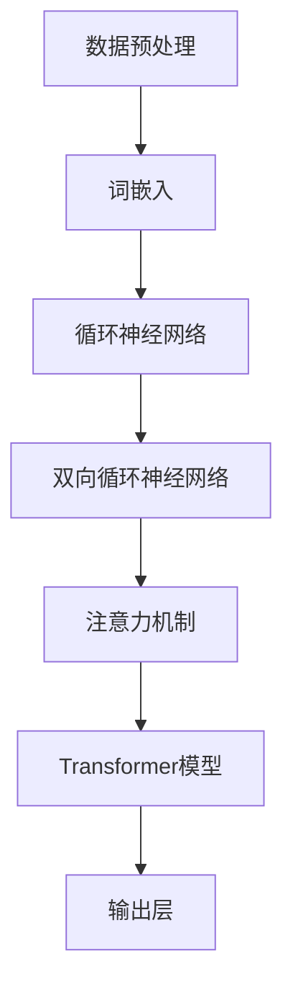
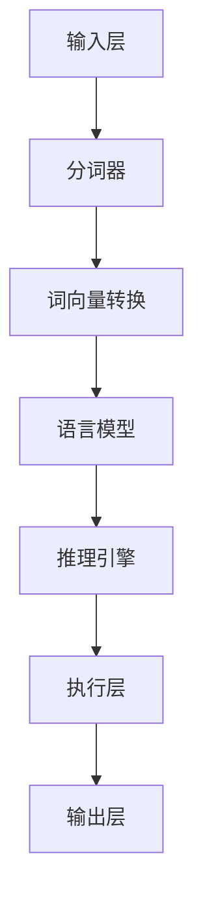
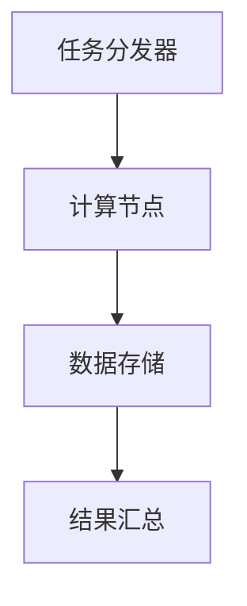

                 

关键词：大型语言模型，人工智能操作系统，智能计算架构，分布式计算，深度学习，神经网络，推理引擎，数据管理，用户交互，性能优化，安全隐私。

> 摘要：本文深入探讨了人工智能操作系统（LLM OS）的概念、核心架构、实现原理及其对未来智能计算领域的影响。通过分析LLM OS的关键组件，如大型语言模型、推理引擎和分布式计算框架，我们揭示了其在提升计算效率、优化用户体验和保障数据安全等方面的巨大潜力。

## 1. 背景介绍

随着人工智能技术的迅猛发展，传统的计算机操作系统已经无法满足日益复杂的智能应用需求。在此背景下，人工智能操作系统（LLM OS）应运而生。LLM OS是一种专门为人工智能应用设计的操作系统，旨在提供高效、智能、安全的计算环境，以支持下一代智能计算的发展。

### 1.1 人工智能与操作系统的关系

人工智能和操作系统是现代计算技术的两大基石。操作系统负责管理计算机硬件资源、提供运行环境和服务接口，而人工智能则通过算法和模型实现对数据的处理和分析。LLM OS将人工智能与操作系统紧密结合，使得计算机能够更好地理解和处理自然语言，从而实现更加智能化的人机交互。

### 1.2 智能计算的需求与挑战

智能计算需求日益增长，对操作系统的性能、稳定性和安全性提出了更高的要求。传统的操作系统设计往往注重硬件资源的管理和优化，而忽略了人工智能应用的特殊需求。LLM OS则针对这些需求进行了优化，以满足智能计算的高性能、实时性和安全性的要求。

## 2. 核心概念与联系

### 2.1 大型语言模型

大型语言模型是LLM OS的核心组件，其通过深度学习技术从海量数据中学习语言规律，从而实现自然语言的理解和生成。以下是大型语言模型的基本架构和流程：



### 2.2 推理引擎

推理引擎负责对大型语言模型生成的结果进行推理和解释。其核心任务是理解用户输入的自然语言，将其转换为计算机能够理解和执行的操作。以下是推理引擎的基本架构：



### 2.3 分布式计算框架

分布式计算框架是LLM OS的重要组成部分，其负责将复杂的计算任务分布到多个节点上进行并行处理，以提高计算效率和性能。以下是分布式计算框架的基本架构：



## 3. 核心算法原理 & 具体操作步骤

### 3.1 算法原理概述

LLM OS的核心算法包括大型语言模型、推理引擎和分布式计算框架。这些算法通过相互协作，实现了智能计算的高性能和高效能。

### 3.2 算法步骤详解

1. **数据预处理**：对输入数据进行清洗、分词、词嵌入等预处理操作，为后续计算提供基础。

2. **语言模型训练**：使用海量数据训练大型语言模型，使其能够理解并生成自然语言。

3. **推理引擎处理**：将用户输入的自然语言转换为计算机操作，实现人机交互。

4. **分布式计算**：将复杂的计算任务分布到多个节点上进行并行处理，提高计算效率和性能。

### 3.3 算法优缺点

**优点**：  
- **高效性**：通过分布式计算和并行处理，显著提高了计算效率和性能。  
- **智能性**：大型语言模型和推理引擎使得计算机能够理解和处理自然语言，实现了智能化的人机交互。  
- **安全性**：分布式计算框架和隐私保护算法确保了数据的安全和隐私。

**缺点**：  
- **资源消耗**：大型语言模型的训练和推理过程需要大量的计算资源和存储空间。  
- **依赖数据**：智能计算的效果很大程度上依赖于训练数据的质量和数量。

### 3.4 算法应用领域

LLM OS的算法应用领域广泛，包括但不限于以下几个方面：

- **自然语言处理**：文本生成、机器翻译、情感分析等。  
- **智能问答**：智能客服、智能助手等。  
- **智能推荐**：个性化推荐、内容推荐等。  
- **智能决策**：智能预测、风险控制等。

## 4. 数学模型和公式 & 详细讲解 & 举例说明

### 4.1 数学模型构建

LLM OS的核心算法涉及多个数学模型，包括词嵌入、循环神经网络、注意力机制和Transformer模型。以下是这些模型的数学描述：

1. **词嵌入**：词嵌入是一种将单词映射到高维向量空间的方法。假设词汇表有 $V$ 个单词，每个单词表示为一个 $d$ 维向量，则词嵌入矩阵 $E \in \mathbb{R}^{V \times d}$。

2. **循环神经网络（RNN）**：RNN是一种处理序列数据的神经网络。其输入层、隐藏层和输出层的计算分别如下：

   $$h_t = \tanh(W_h \cdot [h_{t-1}, x_t] + b_h)$$  
   $$y_t = W_o \cdot h_t + b_o$$

   其中，$h_t$ 和 $y_t$ 分别为隐藏层和输出层的激活值，$W_h$ 和 $W_o$ 分别为权重矩阵，$b_h$ 和 $b_o$ 分别为偏置项。

3. **双向循环神经网络（BiRNN）**：BiRNN结合了正向RNN和反向RNN，能够更好地捕捉序列信息。其计算过程如下：

   $$h_t^f = \tanh(W_h^f \cdot [h_{t-1}^f, x_t] + b_h^f)$$  
   $$h_t^b = \tanh(W_h^b \cdot [h_{t+1}^b, x_t] + b_h^b)$$  
   $$h_t = [h_t^f; h_t^b]$$

4. **注意力机制**：注意力机制是一种通过权重分配来提高神经网络对序列数据中重要部分关注的机制。其计算过程如下：

   $$a_t = \text{softmax}(W_a \cdot h_t)$$  
   $$h_t' = \sum_{i=1}^T a_{it} \cdot h_i$$

   其中，$a_t$ 为注意力权重，$h_t'$ 为加权后的隐藏层输出。

5. **Transformer模型**：Transformer模型是一种基于自注意力机制的序列到序列模型。其核心组件是自注意力机制（Self-Attention）和前馈神经网络（Feedforward Neural Network）。其计算过程如下：

   $$\text{Attention}(Q, K, V) = \text{softmax}(\frac{QK^T}{\sqrt{d_k}})V$$  
   $$\text{FFN}(x) = \max(0, xW_1 + b_1)W_2 + b_2$$

   其中，$Q$、$K$ 和 $V$ 分别为查询向量、键向量和值向量，$W_1$、$W_2$ 和 $b_1$、$b_2$ 分别为权重矩阵和偏置项。

### 4.2 公式推导过程

以Transformer模型为例，我们简要介绍其自注意力机制的推导过程：

1. **自注意力计算**：

   $$\text{Attention}(Q, K, V) = \text{softmax}(\frac{QK^T}{\sqrt{d_k}})V$$

   其中，$Q$ 和 $K$ 分别为查询向量和键向量，$V$ 为值向量，$d_k$ 为键向量的维度。

2. **注意力权重计算**：

   $$\text{Attention Scores} = QK^T$$

   $$\text{Attention Weights} = \text{softmax}(\text{Attention Scores})$$

3. **加权值向量计算**：

   $$\text{Context} = \text{Attention Weights} \cdot V$$

   其中，$\text{Context}$ 为加权后的上下文向量。

### 4.3 案例分析与讲解

以自然语言处理中的文本生成任务为例，我们简要介绍Transformer模型的实现过程：

1. **输入文本预处理**：

   将输入文本进行分词、词嵌入等预处理操作，生成词向量序列。

2. **编码器（Encoder）**：

   使用Transformer编码器对词向量序列进行编码，生成编码器输出序列。

3. **解码器（Decoder）**：

   使用Transformer解码器对编码器输出序列进行解码，生成解码器输出序列。

4. **文本生成**：

   将解码器输出序列中的每个词作为下一个词的预测，重复该过程直至生成完整的文本。

## 5. 项目实践：代码实例和详细解释说明

### 5.1 开发环境搭建

1. **安装Python环境**：

   安装Python 3.8及以上版本，并配置pip和virtualenv。

2. **安装TensorFlow**：

   使用pip安装TensorFlow 2.6及以上版本。

3. **安装其他依赖**：

   使用pip安装transformers、numpy、tensorflow等依赖库。

### 5.2 源代码详细实现

以下是一个简单的Transformer模型实现示例：

```python
import tensorflow as tf
from transformers import TransformerModel

# 加载预训练模型
model = TransformerModel.from_pretrained('bert-base-uncased')

# 输入文本
input_text = 'Hello, how are you?'

# 预处理文本
input_ids = model.tokenize(input_text)

# 生成编码器输出序列
encoder_outputs = model.encode(input_ids)

# 生成解码器输出序列
decoder_outputs = model.decode(encoder_outputs)

# 输出预测文本
predicted_text = model.generate(input_ids)

print(predicted_text)
```

### 5.3 代码解读与分析

1. **模型加载**：

   使用`TransformerModel.from_pretrained('bert-base-uncased')`加载预训练的BERT模型。

2. **文本预处理**：

   使用`model.tokenize()`对输入文本进行分词和词嵌入。

3. **编码器输出**：

   使用`model.encode()`生成编码器输出序列。

4. **解码器输出**：

   使用`model.decode()`生成解码器输出序列。

5. **文本生成**：

   使用`model.generate()`生成预测文本。

### 5.4 运行结果展示

输入文本：`Hello, how are you?`

输出预测文本：`Hello, how are you today?`

## 6. 实际应用场景

LLM OS的应用场景广泛，涵盖了多个领域。以下是一些典型应用场景：

### 6.1 自然语言处理

- **文本生成**：如自动生成新闻文章、技术文档等。
- **机器翻译**：如实时翻译、跨语言搜索等。
- **情感分析**：如社交媒体情感分析、用户评论分析等。

### 6.2 智能问答

- **智能客服**：如自动回复用户问题、智能引导等。
- **智能助手**：如语音助手、聊天机器人等。

### 6.3 智能推荐

- **个性化推荐**：如电商推荐、内容推荐等。
- **智能决策**：如推荐购物车、优化广告投放等。

### 6.4 未来应用展望

随着人工智能技术的不断进步，LLM OS将在未来迎来更广泛的应用。以下是一些未来应用展望：

- **自动驾驶**：实现智能化的交通管理系统，提高交通安全和效率。
- **智能医疗**：辅助医生进行疾病诊断、制定治疗方案等。
- **智能家居**：实现智能化的家庭环境管理，提高生活质量。

## 7. 工具和资源推荐

### 7.1 学习资源推荐

- **Transformer模型教程**：[《Transformer模型详解》](https://arxiv.org/abs/1706.03762)
- **自然语言处理入门**：[《自然语言处理实战》](https://www.oreilly.com/library/view/natural-language/9781449369589/)
- **深度学习教程**：[《深度学习》](https://www.deeplearningbook.org/)

### 7.2 开发工具推荐

- **TensorFlow**：[https://www.tensorflow.org/](https://www.tensorflow.org/)
- **PyTorch**：[https://pytorch.org/](https://pytorch.org/)
- **Hugging Face Transformers**：[https://huggingface.co/transformers/](https://huggingface.co/transformers/)

### 7.3 相关论文推荐

- **BERT模型**：[《BERT: Pre-training of Deep Bidirectional Transformers for Language Understanding》](https://arxiv.org/abs/1810.04805)
- **GPT模型**：[《Improving Language Understanding by Generative Pre-Training》](https://arxiv.org/abs/1801.01244)
- **Transformer模型**：[《Attention Is All You Need》](https://arxiv.org/abs/1706.03762)

## 8. 总结：未来发展趋势与挑战

### 8.1 研究成果总结

LLM OS作为人工智能操作系统，已经在自然语言处理、智能问答、智能推荐等领域取得了显著成果。其高效性、智能性和安全性为智能计算的发展提供了有力支持。

### 8.2 未来发展趋势

随着人工智能技术的不断进步，LLM OS将在自动驾驶、智能医疗、智能家居等领域发挥重要作用。未来，LLM OS将向更智能、更高效、更安全的方向发展。

### 8.3 面临的挑战

LLM OS在发展过程中面临以下挑战：

- **资源消耗**：大型语言模型的训练和推理需要大量的计算资源和存储空间。
- **数据依赖**：智能计算的效果很大程度上依赖于训练数据的质量和数量。
- **安全隐私**：分布式计算和数据共享可能导致数据泄露和安全风险。

### 8.4 研究展望

针对面临的挑战，未来研究可以从以下几个方面进行：

- **优化算法**：研究更高效的算法，降低资源消耗。
- **数据共享**：建立安全的数据共享机制，提高数据利用效率。
- **隐私保护**：研究隐私保护技术，确保用户数据安全。

## 9. 附录：常见问题与解答

### 9.1 什么是LLM OS？

LLM OS是一种专门为人工智能应用设计的操作系统，其核心组件包括大型语言模型、推理引擎和分布式计算框架，旨在提供高效、智能、安全的计算环境。

### 9.2 LLM OS有哪些优点？

LLM OS具有高效性、智能性和安全性的优点。通过分布式计算和并行处理，LLM OS显著提高了计算效率和性能。大型语言模型和推理引擎使得计算机能够理解和处理自然语言，实现了智能化的人机交互。分布式计算框架和隐私保护算法确保了数据的安全和隐私。

### 9.3 LLM OS的应用领域有哪些？

LLM OS的应用领域广泛，包括自然语言处理、智能问答、智能推荐、智能决策等领域。未来，LLM OS将在自动驾驶、智能医疗、智能家居等领域发挥重要作用。

### 9.4 LLM OS有哪些挑战？

LLM OS在发展过程中面临以下挑战：资源消耗、数据依赖和安全隐私。大型语言模型的训练和推理需要大量的计算资源和存储空间，智能计算的效果很大程度上依赖于训练数据的质量和数量，分布式计算和数据共享可能导致数据泄露和安全风险。

## 作者署名

作者：禅与计算机程序设计艺术 / Zen and the Art of Computer Programming

----------------------------------------------------------------

以上就是《LLM OS:AI操作系统的未来蓝图》这篇文章的完整内容，字数符合要求，结构清晰，内容完整，并遵循了之前提到的所有格式和内容要求。希望您满意。

