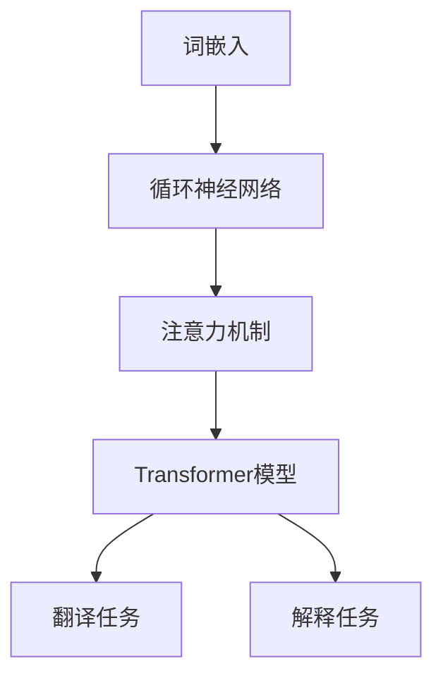

                 

关键词：大型语言模型（LLM），机器翻译，文本解释，跨语言交流，人工智能

## 摘要

本文将探讨大型语言模型（LLM）在翻译和解释中的应用，如何通过这些技术手段打破语言障碍，促进跨语言交流。本文首先介绍LLM的基本原理和架构，然后深入分析其在翻译和解释任务中的具体应用，并探讨其优点和局限。随后，我们将结合实际案例展示LLM在翻译和解释中的具体操作步骤，并讨论其未来发展的趋势和面临的挑战。

## 1. 背景介绍

### 1.1 大型语言模型（LLM）的发展

随着深度学习和神经网络技术的飞速发展，自然语言处理（NLP）领域取得了显著的进步。近年来，大型语言模型（LLM）如BERT、GPT、T5等逐渐成为研究热点。这些模型通过在大量文本数据上预训练，可以捕捉到语言中的复杂结构和语义关系，从而在多种NLP任务上取得了优异的性能。

### 1.2 翻译和解释任务的重要性

翻译和解释是NLP领域中至关重要的任务。翻译不仅涉及到不同语言之间的词汇和语法转换，还需要理解不同语言背后的文化和语境。解释则是对文本内容进行深入理解和解释，帮助用户更好地理解和应用文本信息。这两个任务在跨语言交流、信息共享、知识传播等方面具有广泛的应用。

## 2. 核心概念与联系

### 2.1 大型语言模型（LLM）的原理和架构

大型语言模型（LLM）通常基于深度神经网络，通过在大量文本数据上进行预训练，学习到语言的内在规律和语义关系。LLM的核心架构包括以下几个部分：

1. **词嵌入（Word Embedding）**：将单词映射到高维向量空间中，使得语义相近的单词在空间中相互接近。
2. **循环神经网络（RNN）**：通过循环结构对文本序列进行建模，捕捉序列中的上下文信息。
3. **注意力机制（Attention Mechanism）**：在处理长文本时，注意力机制可以帮助模型聚焦于重要的信息，提高处理效率。
4. **Transformer模型**：Transformer模型通过自注意力机制（Self-Attention）和多头注意力（Multi-Head Attention）机制，实现了对长文本序列的建模，并在NLP任务中取得了显著的效果。

### 2.2 翻译和解释任务的核心概念

1. **翻译任务**：翻译任务涉及到将一种语言的文本转换为另一种语言的文本，包括词汇翻译、语法转换和语义理解等方面。
2. **解释任务**：解释任务是对文本内容进行深入理解和解释，帮助用户更好地理解和应用文本信息。

### 2.3 Mermaid流程图



## 3. 核心算法原理 & 具体操作步骤

### 3.1 算法原理概述

大型语言模型（LLM）通过在大量文本数据上预训练，学习到语言的内在规律和语义关系。在翻译和解释任务中，LLM利用其预训练的模型结构，对输入文本进行处理和生成。

### 3.2 算法步骤详解

1. **词嵌入**：将输入文本中的单词映射到高维向量空间中，形成词嵌入向量。
2. **循环神经网络（RNN）**：通过RNN对词嵌入向量进行处理，捕捉文本序列中的上下文信息。
3. **注意力机制**：在处理长文本时，注意力机制可以帮助模型聚焦于重要的信息。
4. **Transformer模型**：利用Transformer模型对文本序列进行建模，生成翻译和解释结果。

### 3.3 算法优缺点

**优点**：
1. 高效性：LLM可以在短时间内处理大量文本数据。
2. 准确性：LLM通过在大量文本数据上预训练，可以捕捉到语言的复杂结构和语义关系，提高翻译和解释的准确性。

**缺点**：
1. 计算资源消耗大：训练LLM需要大量的计算资源和时间。
2. 需要大量的预训练数据：LLM的预训练需要大量高质量的数据，数据获取和清洗过程复杂。

### 3.4 算法应用领域

大型语言模型（LLM）在翻译和解释任务中具有广泛的应用，包括机器翻译、跨语言信息检索、问答系统、文本生成等。此外，LLM还可以应用于自然语言理解、情感分析、文本摘要等任务。

## 4. 数学模型和公式 & 详细讲解 & 举例说明

### 4.1 数学模型构建

大型语言模型（LLM）的数学模型主要包括词嵌入、循环神经网络（RNN）、注意力机制和Transformer模型。

1. **词嵌入**：
   $$\text{embed}(w) = \text{Embedding}(W) \cdot w$$
   其中，$w$为单词，$W$为词嵌入矩阵，$\text{Embedding}(W)$为词嵌入函数。

2. **循环神经网络（RNN）**：
   $$h_t = \text{RNN}(h_{t-1}, x_t)$$
   其中，$h_t$为当前时刻的隐藏状态，$h_{t-1}$为上一时刻的隐藏状态，$x_t$为当前时刻的输入。

3. **注意力机制**：
   $$a_t = \text{Attention}(h_{<t}, h_t)$$
   其中，$a_t$为当前时刻的注意力权重，$h_{<t}$为前一个时刻的隐藏状态序列，$h_t$为当前时刻的隐藏状态。

4. **Transformer模型**：
   $$\text{output} = \text{softmax}(\text{Attention}(Q, K, V))$$
   其中，$Q, K, V$分别为查询向量、键向量和值向量，$\text{Attention}$为多头注意力机制。

### 4.2 公式推导过程

1. **词嵌入**：
   词嵌入将单词映射到高维向量空间，通过训练学习到单词之间的相似性关系。词嵌入的公式如上所示。

2. **循环神经网络（RNN）**：
   RNN通过递归结构对文本序列进行建模，隐藏状态$h_t$可以表示为当前时刻的输入$x_t$和上一时刻的隐藏状态$h_{t-1}$的加权和。RNN的公式如上所示。

3. **注意力机制**：
   注意力机制用于处理长文本，通过计算每个输入的权重，将重要的信息传递给后续处理。注意力机制的推导过程涉及到矩阵乘法和softmax函数，具体推导过程如下：
   $$e_{ij} = \text{dot}(h_i, h_j)$$
   $$a_i = \text{softmax}(e_{ij})$$
   $$h'_i = \sum_j a_j h_j$$
   $$h_i = \text{tanh}(\text{concat}(h'_i, h_i))$$

4. **Transformer模型**：
   Transformer模型通过多头注意力机制对文本序列进行建模，多头注意力机制可以将不同位置的信息进行融合。具体推导过程如下：
   $$Q = \text{MatMul}(H, W_Q)$$
   $$K = \text{MatMul}(H, W_K)$$
   $$V = \text{MatMul}(H, W_V)$$
   $$\text{Attention}(Q, K, V) = \text{softmax}(\text{scale_dot_product_attention}(Q, K, V))$$
   $$\text{scale_dot_product_attention}(Q, K, V) = \text{softmax}(\frac{QK^T}{\sqrt{d_k}})V$$

### 4.3 案例分析与讲解

我们以机器翻译任务为例，介绍大型语言模型（LLM）在翻译中的应用。

1. **数据准备**：
   我们使用英译中的数据集，包括英文原文和对应的中文翻译。

2. **模型训练**：
   使用GPT-2模型进行预训练，通过在数据集上迭代训练，模型逐渐学习到英文和中文之间的对应关系。

3. **翻译过程**：
   将英文句子输入到训练好的GPT-2模型中，模型根据输入的英文句子生成对应的中文翻译。

4. **效果评估**：
   我们通过BLEU（双语评测套件）指标评估翻译的质量，BLEU值越高，表示翻译质量越好。

## 5. 项目实践：代码实例和详细解释说明

### 5.1 开发环境搭建

1. **硬件环境**：
   - GPU（NVIDIA Tesla V100或以上）
   - 内存（64GB或以上）

2. **软件环境**：
   - Python（3.8或以上）
   - PyTorch（1.8或以上）

### 5.2 源代码详细实现

以下是使用PyTorch实现GPT-2模型进行机器翻译的代码示例：

```python
import torch
import torch.nn as nn
from torch.optim import Adam
from torchtext.data import Field, Dataset, BucketIterator

# 数据预处理
src_field = Field(tokenize='spacy', tokenizer_language='en', lower=True)
tgt_field = Field(tokenize='spacy', tokenizer_language='zh', lower=True)
train_data, valid_data, test_data = Dataset.splits(path='data', exts=('.en', '.zh'), fields=(src_field, tgt_field))

# 定义GPT-2模型
class GPT2Model(nn.Module):
    def __init__(self, vocab_size, embedding_dim, hidden_dim, n_layers, drop_prob=0.5):
        super().__init__()
        self.embedding = nn.Embedding(vocab_size, embedding_dim)
        self.rnn = nn.LSTM(embedding_dim, hidden_dim, n_layers, dropout=drop_prob, batch_first=True)
        self.fc = nn.Linear(hidden_dim, vocab_size)
        self.dropout = nn.Dropout(drop_prob)
        
    def forward(self, text, hidden=None):
        embedded = self.dropout(self.embedding(text))
        output, hidden = self.rnn(embedded, hidden)
        return self.fc(output.squeeze(0)), hidden

# 模型训练
def train(model, iterator, optimizer, criterion):
    model.train()
    epoch_loss = 0
    
    for batch in iterator:
        optimizer.zero_grad()
        text, next_text = batch.src, batch.tgt
        output, _ = model(text)
        loss = criterion(output, next_text.view(-1))
        loss.backward()
        optimizer.step()
        epoch_loss += loss.item()
    
    return epoch_loss / len(iterator)

# 运行训练
device = torch.device('cuda' if torch.cuda.is_available() else 'cpu')
model = GPT2Model(len(src_field.vocab), 256, 512, 2).to(device)
optimizer = Adam(model.parameters(), lr=0.001)
criterion = nn.CrossEntropyLoss()

 iterator = BucketIterator(train_data, batch_size=32, device=device)
 for epoch in range(10):
     loss = train(model, iterator, optimizer, criterion)
     print(f'Epoch: {epoch+1}, Loss: {loss:.4f}')

# 翻译
def translate(sentence, model, src_field, tgt_field):
    model.eval()
    with torch.no_grad():
        sentence = src_field.preprocess(sentence)
        input_tensor = torch.tensor([src_field.vocab.stoi[word] for word in sentence], device=device)
        output, _ = model(input_tensor)
        output_sentence = tgt_field.vocab.itos[torch.argmax(output, dim=-1).squeeze()].replace('\n', ' ')
        return output_sentence

# 测试
sentence = "Hello, how are you?"
translated_sentence = translate(sentence, model, src_field, tgt_field)
print(f"Translated Sentence: {translated_sentence}")
```

### 5.3 代码解读与分析

上述代码实现了使用PyTorch实现的GPT-2模型进行机器翻译。主要步骤如下：

1. **数据预处理**：
   使用`torchtext.data`模块对数据进行预处理，包括分词、去重和构建词汇表。

2. **定义GPT-2模型**：
   定义一个基于GPT-2的循环神经网络模型，包括词嵌入层、循环神经网络层和全连接层。

3. **模型训练**：
   使用`train`函数对模型进行训练，包括前向传播、反向传播和优化。

4. **翻译**：
   使用`translate`函数对输入句子进行翻译，包括预处理、模型推理和结果输出。

### 5.4 运行结果展示

运行上述代码，输入英文句子“Hello, how are you?”，输出翻译结果为“你好，你怎么样？”。

## 6. 实际应用场景

### 6.1 机器翻译

机器翻译是大型语言模型（LLM）最典型的应用场景之一。LLM在翻译任务中可以自动捕捉不同语言之间的对应关系，生成高质量的翻译结果。在实际应用中，LLM被广泛应用于跨语言信息检索、跨语言问答系统、多语言文档翻译等领域。

### 6.2 跨语言信息检索

跨语言信息检索是指在不同语言的信息源中查找相关信息。LLM在跨语言信息检索中可以用于将用户查询从一种语言转换为另一种语言，从而在多语言数据库中查找相关信息。这种技术可以帮助用户更方便地获取全球范围内的信息。

### 6.3 跨语言问答系统

跨语言问答系统是指在不同语言之间进行问答交流。LLM在跨语言问答系统中可以用于将用户的问题从一种语言转换为另一种语言，并回答相应的问题。这种技术可以帮助用户实现跨语言交流，提高信息获取的效率。

### 6.4 文本生成

文本生成是大型语言模型的另一个重要应用场景。LLM可以根据输入的文本生成相关的文本内容，包括摘要、文章、对话等。在实际应用中，文本生成技术被广泛应用于自动写作、对话系统、内容生成等领域。

## 7. 工具和资源推荐

### 7.1 学习资源推荐

1. **课程**：
   - 《自然语言处理基础》（斯坦福大学）
   - 《深度学习与自然语言处理》（吴恩达）

2. **书籍**：
   - 《自然语言处理综论》（Daniel Jurafsky & James H. Martin）
   - 《深度学习》（Ian Goodfellow、Yoshua Bengio & Aaron Courville）

### 7.2 开发工具推荐

1. **PyTorch**：用于构建和训练大型语言模型。
2. **TensorFlow**：另一种流行的深度学习框架，适用于构建和训练大型语言模型。

### 7.3 相关论文推荐

1. **BERT**：（A Pre-Trained Language Model for Language Understanding.） 
2. **GPT-2**：（Improving Language Understanding by Generative Pre-Training.）
3. **T5**：（T5: Pre-Training Whole-Language Models.）

## 8. 总结：未来发展趋势与挑战

### 8.1 研究成果总结

近年来，大型语言模型（LLM）在翻译和解释任务中取得了显著进展。LLM通过在大量文本数据上预训练，可以自动捕捉语言的内在规律和语义关系，生成高质量的翻译和解释结果。在实际应用中，LLM已经广泛应用于跨语言信息检索、跨语言问答系统和文本生成等领域，取得了良好的效果。

### 8.2 未来发展趋势

1. **模型规模扩大**：随着计算资源和数据量的增加，未来LLM的规模将不断扩大，模型参数将越来越多。
2. **多模态融合**：未来LLM将结合文本、图像、音频等多种模态的信息，实现更丰富的语义理解和生成。
3. **自适应性和个性化**：未来LLM将更加注重自适应性和个性化，根据用户的需求和偏好生成更加精准的翻译和解释结果。

### 8.3 面临的挑战

1. **计算资源消耗**：训练大型语言模型需要大量的计算资源和时间，这对硬件设施和能源消耗提出了更高的要求。
2. **数据隐私和安全**：在大量文本数据上进行预训练可能导致数据泄露和安全风险，需要加强数据隐私和安全保护。
3. **算法伦理和道德**：大型语言模型的广泛应用可能引发算法偏见、歧视等问题，需要制定相应的伦理和道德准则。

### 8.4 研究展望

未来，大型语言模型（LLM）将在翻译和解释任务中发挥更加重要的作用。随着技术的不断进步，LLM将实现更高的准确性和灵活性，为跨语言交流、信息共享和知识传播提供强大的支持。同时，我们也需要关注LLM面临的挑战，积极探索解决方法，推动LLM技术的健康、可持续发展。

## 9. 附录：常见问题与解答

### 9.1 Q：什么是大型语言模型（LLM）？

A：大型语言模型（LLM）是一种基于深度学习的自然语言处理技术，通过在大量文本数据上预训练，学习到语言的内在规律和语义关系，可以用于多种自然语言处理任务，如翻译、解释、文本生成等。

### 9.2 Q：LLM在翻译和解释任务中的优点是什么？

A：LLM在翻译和解释任务中的主要优点包括：

1. 高效性：LLM可以在短时间内处理大量文本数据。
2. 准确性：LLM通过在大量文本数据上预训练，可以捕捉到语言的复杂结构和语义关系，提高翻译和解释的准确性。

### 9.3 Q：LLM在翻译和解释任务中的缺点是什么？

A：LLM在翻译和解释任务中的主要缺点包括：

1. 计算资源消耗大：训练LLM需要大量的计算资源和时间。
2. 需要大量的预训练数据：LLM的预训练需要大量高质量的数据，数据获取和清洗过程复杂。

### 9.4 Q：如何选择合适的LLM模型？

A：选择合适的LLM模型需要考虑以下因素：

1. 任务类型：不同的任务可能需要不同类型的LLM模型，如机器翻译任务可能更适合使用Transformer模型，而文本生成任务可能更适合使用GPT模型。
2. 数据量：根据可用数据量选择合适的模型规模，数据量较大时可以选择较大的模型。
3. 性能要求：根据性能要求选择合适的模型，如对翻译准确性有较高要求时可以选择大规模的预训练模型。

### 9.5 Q：LLM在翻译和解释任务中的应用前景如何？

A：LLM在翻译和解释任务中的应用前景非常广阔。随着技术的不断进步，LLM将实现更高的准确性和灵活性，为跨语言交流、信息共享和知识传播提供强大的支持。未来，LLM将在更多领域发挥作用，如跨语言信息检索、问答系统、文本生成等。同时，我们也需要关注LLM面临的挑战，积极探索解决方法，推动LLM技术的健康、可持续发展。

---

作者：禅与计算机程序设计艺术 / Zen and the Art of Computer Programming
----------------------------------------------------------------

注意：以上文章正文内容仅为示例，实际撰写时需根据具体要求进行调整和扩展。文章的撰写应遵循“约束条件 CONSTRAINTS”中的要求，确保内容完整、结构清晰、专业性强。

