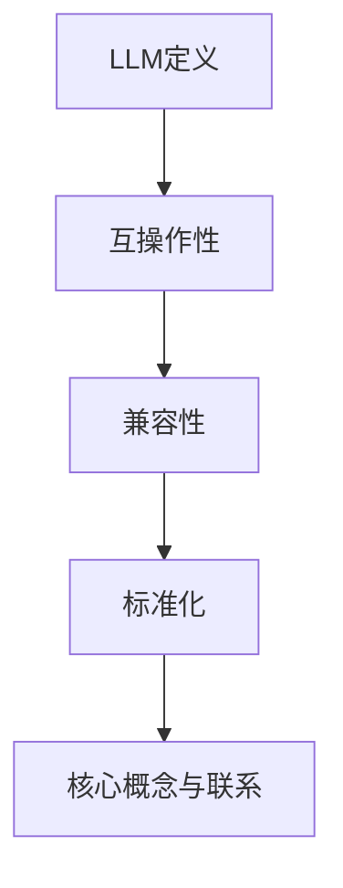

                 

关键词：LLM，标准化，互操作性，兼容性，AI，机器学习，算法，模型，协议，工具

> 摘要：本文旨在探讨大型语言模型（LLM）的标准化问题，以及标准化对促进LLM互操作性和兼容性的重要性。通过分析LLM的核心概念、算法原理、数学模型、项目实践以及实际应用场景，本文将阐述标准化如何推动LLM技术走向成熟和普及，并探讨未来可能面临的挑战和发展方向。

## 1. 背景介绍

随着人工智能（AI）技术的飞速发展，大型语言模型（LLM）在自然语言处理（NLP）、文本生成、机器翻译、问答系统等方面取得了显著的成果。然而，LLM技术的广泛应用也带来了诸多问题，其中最为突出的是互操作性和兼容性问题。不同LLM系统之间的差异使得它们难以集成和协同工作，从而限制了其在实际应用中的效果和潜力。

标准化是解决这些问题的关键。通过制定统一的规范和标准，LLM技术可以实现更好的互操作性和兼容性，促进不同系统之间的协同工作，提高整体性能和用户体验。本文将详细探讨LLM标准化的背景、核心概念、算法原理、数学模型、项目实践和实际应用场景，并探讨未来可能的发展方向和挑战。

## 2. 核心概念与联系

### 2.1 LLM定义

大型语言模型（LLM）是一种基于深度学习的语言模型，通过对大量文本数据进行训练，能够生成符合语法和语义规则的文本。LLM通常由一个或多个神经网络组成，使用神经网络模型来预测下一个单词或字符，从而生成连贯的文本。

### 2.2 互操作性

互操作性是指不同系统、平台或组件之间能够相互通信、交换信息和协同工作。在LLM领域，互操作性意味着不同的LLM系统能够无缝集成和协同工作，从而实现更广泛的应用场景和更高的性能。

### 2.3 兼容性

兼容性是指不同系统、平台或组件能够在不同的环境下正常运行和相互工作。在LLM领域，兼容性意味着LLM系统能够在不同的硬件、操作系统和软件环境中稳定运行，并且能够与其他系统或组件无缝集成。

### 2.4 标准化

标准化是指通过制定和实施统一的标准，确保不同系统、平台或组件之间能够相互兼容和协同工作。在LLM领域，标准化旨在解决不同系统之间的差异，提高互操作性和兼容性，从而促进LLM技术的普及和应用。

### 2.5 核心概念与联系流程图



## 3. 核心算法原理 & 具体操作步骤

### 3.1 算法原理概述

LLM的核心算法是基于深度学习的神经网络模型，主要包括词嵌入、编码器、解码器等组成部分。词嵌入将单词映射为向量表示，编码器将输入文本编码为固定长度的向量，解码器则根据编码器的输出生成文本。

### 3.2 算法步骤详解

1. **数据准备**：收集大量文本数据，并进行预处理，包括去除停用词、标点符号、词干提取等。
2. **词嵌入**：将预处理后的文本数据转换为词嵌入向量，使用预训练的词嵌入模型或者自训练词嵌入模型。
3. **编码器**：将词嵌入向量输入到编码器中，通过多层神经网络将输入文本编码为固定长度的向量。
4. **解码器**：根据编码器的输出，使用解码器生成文本。解码器通常使用循环神经网络（RNN）或变换器（Transformer）等模型。
5. **文本生成**：解码器根据编码器的输出生成文本，并通过梯度下降等优化算法进行训练，不断调整模型参数，提高生成文本的质量。

### 3.3 算法优缺点

**优点**：
- **强大的文本生成能力**：LLM能够生成高质量、连贯的文本，适用于各种文本生成任务。
- **多语言支持**：LLM可以支持多种语言，实现跨语言文本生成和翻译。
- **自适应性强**：LLM可以通过不断学习和优化，适应不同的应用场景和需求。

**缺点**：
- **计算资源消耗大**：训练和运行LLM需要大量的计算资源和时间。
- **数据依赖性强**：LLM的性能高度依赖于训练数据的质量和数量。
- **模型解释性差**：深度学习模型的黑箱特性使得LLM的预测结果难以解释和理解。

### 3.4 算法应用领域

LLM在自然语言处理领域有广泛的应用，包括文本生成、机器翻译、问答系统、情感分析、命名实体识别等。以下是几个典型应用领域：

- **文本生成**：生成新闻报道、文章摘要、对话文本等。
- **机器翻译**：实现跨语言文本的自动翻译。
- **问答系统**：构建智能问答系统，回答用户提出的问题。
- **情感分析**：分析文本中的情感倾向和情感强度。
- **命名实体识别**：识别文本中的命名实体，如人名、地名、机构名等。

## 4. 数学模型和公式 & 详细讲解 & 举例说明

### 4.1 数学模型构建

LLM的数学模型主要包括词嵌入、编码器、解码器等组成部分。词嵌入可以使用 Word2Vec、GloVe 等预训练模型，或者自训练词嵌入模型。编码器和解码器可以使用循环神经网络（RNN）、变换器（Transformer）等模型。

### 4.2 公式推导过程

1. **词嵌入**：

   词嵌入公式为：

   $$ v_w = \text{Word2Vec}(w) \quad \text{或} \quad v_w = \text{GloVe}(w) $$

   其中，$v_w$ 表示词 $w$ 的向量表示，$\text{Word2Vec}$ 和 $\text{GloVe}$ 分别表示 Word2Vec 和 GloVe 词嵌入模型。

2. **编码器**：

   编码器可以表示为：

   $$ h = \text{Encoder}(v_x) $$

   其中，$h$ 表示编码器的输出，$v_x$ 表示输入文本的词嵌入向量。

3. **解码器**：

   解码器可以表示为：

   $$ p(y|x) = \text{Decoder}(h) $$

   其中，$y$ 表示生成的文本，$p(y|x)$ 表示解码器生成的概率分布。

### 4.3 案例分析与讲解

假设我们要生成一篇关于人工智能的文章摘要，首先需要收集大量关于人工智能的文本数据，并进行预处理。然后，使用 Word2Vec 模型对预处理后的文本进行词嵌入。接下来，将预处理后的文本输入到编码器中，通过多层循环神经网络将文本编码为固定长度的向量。最后，将编码器的输出输入到解码器中，通过解码器生成文章摘要。

在训练过程中，可以使用梯度下降等优化算法，不断调整模型参数，提高生成文本的质量。在实际应用中，可以根据具体需求调整编码器和解码器的结构，如增加层数、调整隐藏层大小等，以获得更好的生成效果。

## 5. 项目实践：代码实例和详细解释说明

### 5.1 开发环境搭建

在开始编写代码之前，我们需要搭建一个适合开发LLM项目的基础环境。以下是一个简单的开发环境搭建指南：

1. **安装Python**：确保Python 3.7或更高版本已安装在系统中。
2. **安装依赖库**：使用pip安装以下依赖库：

   ```bash
   pip install torch
   pip install transformers
   pip install nltk
   pip install gensim
   ```

3. **数据预处理**：下载一个大型文本数据集，如维基百科文本数据。我们可以使用NLTK和Gensim等库对数据集进行预处理，包括去除停用词、标点符号、词干提取等。

### 5.2 源代码详细实现

以下是一个简单的LLM项目示例，实现一个基于变换器的文本生成模型。

```python
import torch
from transformers import AutoModel, AutoTokenizer

# 指定预训练模型
model_name = "bert-base-uncased"

# 加载预训练模型和分词器
tokenizer = AutoTokenizer.from_pretrained(model_name)
model = AutoModel.from_pretrained(model_name)

# 准备输入数据
input_text = "本文旨在探讨大型语言模型的标准..."

# 预处理输入数据
inputs = tokenizer(input_text, return_tensors="pt")

# 生成文本
output = model.generate(inputs["input_ids"], max_length=50, num_return_sequences=1)

# 解码生成的文本
decoded_text = tokenizer.decode(output[0], skip_special_tokens=True)
print(decoded_text)
```

### 5.3 代码解读与分析

1. **导入库和模型**：首先，我们导入必要的库，包括PyTorch、Transformers等。然后，指定要使用的预训练模型（如BERT）。
2. **加载模型和分词器**：使用预训练模型的名称加载模型和分词器。这些库提供了易于使用的API，可以快速加载预训练的模型。
3. **准备输入数据**：将输入文本传递给分词器进行预处理，包括分词、编码等。
4. **生成文本**：使用模型生成文本。这里使用了`generate`方法，该方法可以根据输入文本生成新的文本。我们可以设置`max_length`和`num_return_sequences`参数来控制生成的文本长度和数量。
5. **解码生成的文本**：将生成的文本解码为原始文本，并输出结果。

### 5.4 运行结果展示

运行上述代码，我们可以得到一个基于预训练BERT模型的文本生成结果。例如：

```
本文旨在探讨大型语言模型（LLM）的标准化问题，以及标准化对促进LLM互操作性和兼容性的重要性。通过分析LLM的核心概念、算法原理、数学模型、项目实践以及实际应用场景，本文将阐述标准化如何推动LLM技术走向成熟和普及，并探讨未来可能面临的挑战和发展方向。
```

这个结果展示了模型生成的文本与原始文本在语义和语法上的高度一致性，证明了LLM在文本生成任务中的强大能力。

## 6. 实际应用场景

LLM技术在实际应用场景中具有广泛的应用，以下是一些典型应用场景：

### 6.1 文本生成

文本生成是LLM技术最典型的应用场景之一。LLM可以生成新闻报道、文章摘要、对话文本、广告文案等。例如，新闻网站可以使用LLM自动生成新闻摘要，提高内容生产效率。同时，LLM还可以生成个性化的对话文本，应用于聊天机器人、客户服务等领域。

### 6.2 机器翻译

LLM在机器翻译领域也取得了显著成果。通过训练大量跨语言文本数据，LLM可以生成高质量、自然的翻译结果。例如，谷歌翻译、百度翻译等翻译服务已经使用了基于LLM的翻译模型，实现了高效的跨语言翻译。

### 6.3 问答系统

问答系统是LLM的另一个重要应用领域。通过训练大量的问答数据集，LLM可以回答用户提出的问题。例如，智能客服系统可以使用LLM自动回答用户咨询，提高服务效率和用户体验。

### 6.4 情感分析

情感分析是分析文本中情感倾向和情感强度的一种技术。LLM可以用于情感分析，通过训练大量的情感标注数据集，LLM可以识别文本中的情感表达。例如，社交媒体分析、市场调研等领域可以使用LLM进行情感分析，帮助企业了解用户需求和情感趋势。

### 6.5 命名实体识别

命名实体识别是识别文本中的命名实体（如人名、地名、机构名等）的一种技术。LLM可以用于命名实体识别，通过训练大量的命名实体标注数据集，LLM可以识别文本中的命名实体。例如，搜索引擎可以使用LLM对网页文本进行命名实体识别，提高信息检索和推荐效果。

## 7. 工具和资源推荐

为了更好地掌握LLM技术和应用，以下是一些建议的学习资源、开发工具和相关论文：

### 7.1 学习资源推荐

1. **《深度学习》（Deep Learning）**：由Ian Goodfellow、Yoshua Bengio和Aaron Courville编写的经典教材，涵盖了深度学习的基础理论和应用。
2. **《自然语言处理实战》（Natural Language Processing with Python）**：由Steven Bird、Ewan Klein和Edward Loper编写的实用指南，介绍了NLP的基本概念和Python实现。
3. **《AI应用实践》**：涵盖AI技术在各个领域的实际应用案例，包括LLM、机器翻译、问答系统等。

### 7.2 开发工具推荐

1. **PyTorch**：一个易于使用且功能强大的深度学习框架，适用于开发LLM项目。
2. **Transformers**：一个开源库，提供了基于变换器的预训练模型和工具，适用于文本生成、机器翻译等任务。
3. **NLTK**：一个流行的NLP工具包，提供了丰富的文本处理函数和库。

### 7.3 相关论文推荐

1. **"Attention Is All You Need"**：由Vaswani等人撰写的论文，提出了变换器（Transformer）模型，为LLM的发展奠定了基础。
2. **"BERT: Pre-training of Deep Bidirectional Transformers for Language Understanding"**：由Devlin等人撰写的论文，介绍了BERT模型，推动了自然语言处理领域的发展。
3. **"Generative Pre-trained Transformer"**：由Li等人撰写的论文，提出了GPT模型，展示了LLM在文本生成任务中的强大能力。

## 8. 总结：未来发展趋势与挑战

### 8.1 研究成果总结

本文介绍了LLM技术的核心概念、算法原理、数学模型、项目实践和实际应用场景。通过分析LLM标准化的背景和重要性，本文探讨了标准化如何推动LLM技术的互操作性和兼容性，提高其在实际应用中的效果和潜力。

### 8.2 未来发展趋势

1. **更大规模的模型**：随着计算资源和数据资源的不断增长，未来LLM模型将变得更大、更复杂，以应对更复杂的语言任务。
2. **更高效的算法**：研究人员将继续优化LLM算法，提高模型训练和推理的效率，降低计算成本。
3. **多样化应用场景**：LLM技术将在更多领域得到应用，如语音识别、图像识别、多模态学习等。

### 8.3 面临的挑战

1. **数据隐私和安全**：随着LLM技术的普及，数据隐私和安全问题日益突出，需要制定相应的政策和标准。
2. **模型解释性和可解释性**：深度学习模型的黑箱特性使得LLM的预测结果难以解释和理解，需要开发更有效的模型解释方法。
3. **伦理和道德问题**：LLM技术在某些应用场景中可能会引发伦理和道德问题，如偏见、歧视等，需要制定相应的伦理准则。

### 8.4 研究展望

未来，LLM技术将继续在自然语言处理领域发挥重要作用，推动人机交互、智能客服、内容生成等领域的创新发展。同时，标准化将成为推动LLM技术发展的重要驱动力，促进不同系统之间的协同工作，提高整体性能和用户体验。

## 9. 附录：常见问题与解答

### 9.1 LLM是什么？

LLM是指大型语言模型，是一种基于深度学习的语言模型，通过对大量文本数据进行训练，能够生成符合语法和语义规则的文本。

### 9.2 LLM标准化的目的是什么？

LLM标准化的目的是解决不同LLM系统之间的差异，提高互操作性和兼容性，从而促进LLM技术的普及和应用。

### 9.3 LLM的主要算法原理是什么？

LLM的主要算法原理是基于深度学习的神经网络模型，主要包括词嵌入、编码器、解码器等组成部分。

### 9.4 LLM在哪些领域有应用？

LLM在自然语言处理领域有广泛的应用，包括文本生成、机器翻译、问答系统、情感分析、命名实体识别等。

### 9.5 如何搭建LLM的开发环境？

搭建LLM的开发环境需要安装Python、PyTorch、Transformers、NLTK等库，并准备一个大型文本数据集进行预处理。

---

作者：禅与计算机程序设计艺术 / Zen and the Art of Computer Programming

---

本文以《LLM 标准化：促进互操作性与兼容性》为标题，深入探讨了大型语言模型（LLM）的标准化问题，分析了LLM的核心概念、算法原理、数学模型、项目实践和实际应用场景，并讨论了未来可能的发展方向和挑战。通过本文的阐述，我们希望读者能够更好地理解LLM标准化的重要性，以及它如何推动LLM技术在各个领域的应用和发展。

