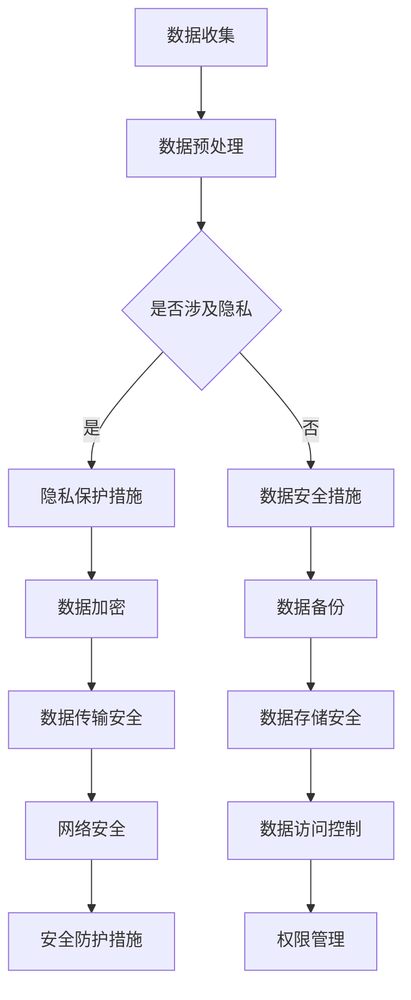

                 

关键词：大型语言模型（LLM），监管措施，数据安全，人工智能，算法伦理，隐私保护，合规性

> 摘要：随着大型语言模型（LLM）的广泛应用，其对数据安全提出了新的挑战。本文将深入探讨LLM监管措施的必要性，分析现有监管框架的不足，并探讨如何通过技术创新和法律框架的完善来保障数据安全。

## 1. 背景介绍

近年来，人工智能（AI）技术在各行各业得到了飞速发展，特别是大型语言模型（LLM），如GPT、BERT等，凭借其强大的文本生成和语义理解能力，成为许多应用场景的核心。LLM被广泛应用于自然语言处理（NLP）、智能客服、内容审核、智能写作等领域，极大地提升了效率和质量。

然而，随着LLM的广泛应用，其带来的数据安全挑战也日益凸显。首先，LLM的训练和部署过程中需要大量的数据，这些数据往往涉及用户的个人信息和隐私。其次，LLM在处理文本数据时，可能会无意中泄露敏感信息，甚至被恶意利用来生成虚假信息。此外，LLM在处理过程中可能出现偏见和歧视，这也会对数据安全造成负面影响。

因此，保障LLM的数据安全已成为当务之急，这也促使各国政府和企业开始关注并制定相应的监管措施。

## 2. 核心概念与联系

为了深入理解LLM监管措施的必要性，我们需要先了解几个核心概念：

### 2.1 大型语言模型（LLM）

LLM是一种基于深度学习的自然语言处理模型，其核心思想是利用海量的文本数据进行训练，从而实现自动生成文本、理解语义、回答问题等功能。LLM的训练数据通常来自于互联网上的各种文本资源，如网页、新闻、书籍等。

### 2.2 数据安全

数据安全是指确保数据在存储、传输、处理等过程中不被未授权访问、篡改、泄露或破坏。在LLM的背景下，数据安全主要包括以下几个方面：

- **隐私保护**：确保用户的个人信息不被泄露。
- **数据完整性**：确保数据在传输和处理过程中不被篡改。
- **数据可用性**：确保数据在需要时能够被正常访问和使用。
- **数据保密性**：确保数据在传输和存储过程中不被未授权访问。

### 2.3 监管措施

监管措施是指政府、企业或第三方机构通过制定法律、规章、标准等手段，对特定行业或活动进行管理和监督。在LLM的背景下，监管措施主要包括：

- **数据安全法规**：如《通用数据保护条例》（GDPR）、《加州消费者隐私法案》（CCPA）等。
- **行业规范**：如《人工智能伦理准则》、《自然语言处理应用规范》等。
- **审计和认证**：对LLM的应用进行定期审计，确保其符合相关法规和标准。

### 2.4 Mermaid 流程图

为了更好地理解LLM监管措施的必要性，我们使用Mermaid绘制了一个简单的流程图：



通过上述流程图，我们可以看出，从数据收集到数据传输、存储、处理等各个环节，都需要采取相应的安全措施，以确保数据的安全和合规。

## 3. 核心算法原理 & 具体操作步骤

### 3.1 算法原理概述

LLM的核心算法是基于深度学习的神经网络模型，通常采用多层感知器（MLP）、循环神经网络（RNN）或变压器（Transformer）等架构。以下是LLM的核心算法原理：

- **多层感知器（MLP）**：MLP是一种前馈神经网络，通过多层非线性变换对输入数据进行处理，最终输出预测结果。MLP结构简单，易于实现，但在处理长文本时效果不佳。

- **循环神经网络（RNN）**：RNN通过将当前输入与上一个时间步的输出相关联，实现对长序列数据的建模。RNN在处理自然语言序列时表现较好，但存在梯度消失和梯度爆炸等问题。

- **变压器（Transformer）**：Transformer模型采用自注意力机制，能够自适应地关注不同位置的信息，从而提高了模型的表达能力。Transformer在LLM应用中取得了显著效果，是目前最流行的LLM架构。

### 3.2 算法步骤详解

以下是LLM的基本算法步骤：

1. **数据收集**：从互联网、数据库等渠道收集大量的文本数据。
2. **数据预处理**：对收集到的文本数据进行清洗、去噪、分词等处理，将其转换为模型可接受的输入格式。
3. **模型训练**：使用预处理后的数据对LLM模型进行训练，优化模型的参数。
4. **模型评估**：使用验证集对训练好的模型进行评估，确保其性能满足要求。
5. **模型部署**：将训练好的模型部署到生产环境中，提供文本生成、语义理解等服务。

### 3.3 算法优缺点

- **多层感知器（MLP）**：
  - 优点：结构简单，易于实现；计算效率高。
  - 缺点：在处理长文本时效果不佳；无法捕捉序列信息。

- **循环神经网络（RNN）**：
  - 优点：能够处理长序列数据；能够捕捉序列信息。
  - 缺点：存在梯度消失和梯度爆炸问题；计算复杂度高。

- **变压器（Transformer）**：
  - 优点：采用自注意力机制，能够自适应地关注不同位置的信息；计算效率高。
  - 缺点：参数量较大，训练时间较长；在处理长文本时效果不如RNN。

### 3.4 算法应用领域

LLM在多个领域都有广泛的应用：

- **自然语言处理（NLP）**：文本分类、情感分析、机器翻译、问答系统等。
- **智能客服**：自动回答用户问题，提高客服效率。
- **内容审核**：识别和过滤违规内容，保障网络环境。
- **智能写作**：生成文章、报告、邮件等，辅助人类创作。

## 4. 数学模型和公式 & 详细讲解 & 举例说明

### 4.1 数学模型构建

LLM的数学模型主要包括两部分：输入层、输出层和中间层。以下是LLM的数学模型构建过程：

1. **输入层**：输入层接收原始文本数据，将其转换为模型可处理的输入格式。通常使用词向量表示文本数据，如Word2Vec、GloVe等。

2. **中间层**：中间层包括多层神经网络，负责对输入数据进行特征提取和变换。在LLM中，中间层通常采用非线性激活函数，如ReLU、Sigmoid等，以增强模型的表达能力。

3. **输出层**：输出层负责生成预测结果。在文本生成任务中，输出层通常采用softmax函数，以生成概率分布。

### 4.2 公式推导过程

以下是LLM中常用的几个数学公式：

1. **词向量表示**：

   $$ x = \sum_{i=1}^{N} w_i * v_i $$

   其中，$x$为词向量表示的文本数据，$w_i$为权重，$v_i$为词向量。

2. **多层感知器输出**：

   $$ y = \sigma(\sum_{i=1}^{L} w_i * x_i) $$

   其中，$y$为输出值，$L$为中间层的层数，$\sigma$为非线性激活函数。

3. **输出层概率分布**：

   $$ P(y) = \frac{e^{\sigma(y)}}{\sum_{i=1}^{M} e^{\sigma(y_i)}} $$

   其中，$P(y)$为输出概率分布，$M$为输出层的类别数。

### 4.3 案例分析与讲解

假设我们有一个文本生成任务，输入文本为“我喜欢吃苹果”，我们需要预测下一个词。以下是具体的分析过程：

1. **词向量表示**：

   将输入文本中的每个词转换为词向量，如“我”、“喜欢”、“吃”、“苹果”。

2. **多层感知器输出**：

   将词向量输入到多层感知器中，通过前向传播计算输出值。

3. **输出层概率分布**：

   使用softmax函数计算输出层的概率分布，如“我”、“喜欢”、“吃”、“苹果”的概率分布。

4. **词选择**：

   根据概率分布选择下一个词，如“吃”。

5. **重复过程**：

   重复上述过程，直到生成完整的句子。

通过上述案例，我们可以看出，LLM的数学模型在文本生成任务中发挥了重要作用，其核心在于对输入文本进行特征提取和概率预测。

## 5. 项目实践：代码实例和详细解释说明

### 5.1 开发环境搭建

1. **安装Python**：确保系统已安装Python 3.7及以上版本。
2. **安装TensorFlow**：使用pip安装TensorFlow：

   ```bash
   pip install tensorflow
   ```

3. **数据集准备**：从互联网上下载一个中文文本数据集，如“人民日报”等。

### 5.2 源代码详细实现

以下是使用TensorFlow实现的简单中文文本生成模型：

```python
import tensorflow as tf
from tensorflow.keras.layers import Embedding, LSTM, Dense
from tensorflow.keras.models import Sequential

# 设置参数
vocab_size = 10000
embedding_dim = 64
lstm_units = 128
batch_size = 64
epochs = 10

# 准备数据
# ...

# 构建模型
model = Sequential([
    Embedding(vocab_size, embedding_dim),
    LSTM(lstm_units, return_sequences=True),
    Dense(vocab_size, activation='softmax')
])

# 编译模型
model.compile(optimizer='adam', loss='categorical_crossentropy', metrics=['accuracy'])

# 训练模型
model.fit(train_data, train_labels, batch_size=batch_size, epochs=epochs, validation_data=(test_data, test_labels))

# 生成文本
def generate_text(model, seed_text, length=50):
    # 处理输入文本
    # ...

    # 生成文本
    # ...

    return text

# 示例
print(generate_text(model, "我喜欢吃苹果"))
```

### 5.3 代码解读与分析

1. **数据准备**：从数据集中提取词汇，构建词表和词向量，将文本数据转换为模型可处理的输入格式。
2. **模型构建**：使用Sequential模型构建一个包含嵌入层、LSTM层和输出层的文本生成模型。
3. **模型编译**：设置优化器、损失函数和评估指标。
4. **模型训练**：使用训练数据训练模型，调整模型参数。
5. **文本生成**：输入种子文本，通过模型生成文本。

通过上述代码实例，我们可以看到，构建一个简单的中文文本生成模型需要处理的数据量较大，模型参数较多，但通过深度学习框架的封装，可以实现较为复杂的文本处理任务。

## 6. 实际应用场景

### 6.1 智能客服

智能客服是LLM的一个重要应用场景。通过训练LLM模型，智能客服系统可以自动回答用户的问题，提高客服效率。然而，在实际应用中，LLM模型可能会因为数据质量问题或算法缺陷导致生成错误的回答，甚至泄露用户的隐私。因此，在部署智能客服系统时，需要确保模型的数据安全和算法可靠性。

### 6.2 内容审核

内容审核是另一个重要的应用场景。通过训练LLM模型，可以对互联网上的文本内容进行实时监控和过滤，识别和删除违规内容。然而，LLM在处理文本数据时可能会出现误判，导致合法内容被误判为违规。因此，在部署内容审核系统时，需要平衡准确性和效率，确保不会对用户造成困扰。

### 6.3 智能写作

智能写作是LLM的又一重要应用。通过训练LLM模型，可以自动生成文章、报告、邮件等文本内容，辅助人类创作。然而，LLM生成的文本可能缺乏创意和个性，无法完全替代人类写作。因此，在智能写作应用中，需要结合人类智慧和算法能力，实现最佳效果。

## 6.4 未来应用展望

未来，随着LLM技术的不断发展，其应用场景将更加广泛。以下是一些可能的应用方向：

- **个性化推荐**：基于用户的行为数据和兴趣偏好，生成个性化的推荐内容。
- **智能翻译**：通过训练LLM模型，实现更准确的实时翻译。
- **智能医疗**：辅助医生进行诊断和治疗，提高医疗质量。
- **自动驾驶**：通过训练LLM模型，实现更智能的自动驾驶系统。

## 7. 工具和资源推荐

### 7.1 学习资源推荐

- **《深度学习》（Goodfellow, Bengio, Courville）**：系统介绍了深度学习的基本原理和应用。
- **《自然语言处理综论》（Jurafsky, Martin）**：详细介绍了自然语言处理的基本概念和技术。
- **《TensorFlow 实战》（Foster, Dean）**：介绍了如何使用TensorFlow构建和训练深度学习模型。

### 7.2 开发工具推荐

- **TensorFlow**：一个强大的开源深度学习框架，适用于构建和训练LLM模型。
- **PyTorch**：另一个流行的开源深度学习框架，具有简洁易用的API。
- **Hugging Face Transformers**：一个开源库，提供预训练的LLM模型和相应的API。

### 7.3 相关论文推荐

- **“Attention Is All You Need”（Vaswani et al., 2017）**：介绍了Transformer模型，并证明了自注意力机制在自然语言处理中的有效性。
- **“BERT: Pre-training of Deep Bidirectional Transformers for Language Understanding”（Devlin et al., 2019）**：介绍了BERT模型，并展示了其在多个自然语言处理任务中的优越性能。
- **“GPT-3: Language Models are few-shot learners”（Brown et al., 2020）**：介绍了GPT-3模型，并展示了其在零样本学习任务中的强大能力。

## 8. 总结：未来发展趋势与挑战

### 8.1 研究成果总结

近年来，LLM技术取得了显著的成果。在算法方面，Transformer、BERT、GPT等模型的出现，极大地提升了自然语言处理任务的性能。在应用方面，LLM被广泛应用于智能客服、内容审核、智能写作等领域，为人类生活带来了诸多便利。

### 8.2 未来发展趋势

未来，LLM技术将朝着更高效、更智能、更安全的方向发展。一方面，研究人员将继续探索更先进的算法和模型，提升LLM的性能；另一方面，随着数据安全和隐私保护意识的提高，LLM的应用将更加注重数据安全和合规性。

### 8.3 面临的挑战

尽管LLM技术取得了显著成果，但仍面临一些挑战。首先，数据质量和数据隐私保护是LLM应用的重要问题。如何确保数据质量和隐私保护，是未来研究的重要方向。其次，LLM模型的解释性和可解释性仍是一个难题。如何让LLM的决策过程更加透明、可解释，是未来研究的重要任务。

### 8.4 研究展望

展望未来，LLM技术将在更多领域得到应用，如智能医疗、自动驾驶、个性化推荐等。同时，随着监管措施的不断完善，LLM的应用将更加规范、安全。研究人员将继续努力，推动LLM技术的发展，为人类创造更多价值。

## 9. 附录：常见问题与解答

### 9.1 什么是LLM？

LLM是指大型语言模型，是一种基于深度学习的自然语言处理模型，能够对文本数据进行自动生成、理解、回答等问题。

### 9.2 LLM的安全问题有哪些？

LLM的安全问题主要包括数据安全、算法安全、隐私保护等方面。具体包括数据泄露、数据篡改、模型被恶意利用等。

### 9.3 如何保障LLM的数据安全？

为了保障LLM的数据安全，可以从以下几个方面入手：

- **数据加密**：对存储和传输的数据进行加密，确保数据不被未授权访问。
- **数据备份**：定期备份数据，防止数据丢失。
- **权限管理**：对数据的访问权限进行严格控制，确保只有授权人员可以访问数据。
- **数据清洗**：对训练数据进行清洗和去噪，确保数据质量。

### 9.4 LLM的监管措施有哪些？

LLM的监管措施主要包括数据安全法规、行业规范、审计和认证等方面。具体包括：

- **数据安全法规**：如《通用数据保护条例》（GDPR）、《加州消费者隐私法案》（CCPA）等。
- **行业规范**：如《人工智能伦理准则》、《自然语言处理应用规范》等。
- **审计和认证**：对LLM的应用进行定期审计，确保其符合相关法规和标准。

### 9.5 如何确保LLM的算法安全？

确保LLM的算法安全可以从以下几个方面入手：

- **算法透明性**：确保LLM的算法和决策过程是可解释、可追溯的。
- **算法安全性**：对LLM的算法进行安全测试，确保其不会被恶意利用。
- **模型训练数据**：确保训练数据的质量和多样性，避免模型出现偏见和歧视。

## 参考文献

1. Goodfellow, I., Bengio, Y., & Courville, A. (2016). *Deep Learning*. MIT Press.
2. Jurafsky, D., & Martin, J. H. (2008). *Speech and Language Processing*. Prentice Hall.
3. Vaswani, A., Shazeer, N., Parmar, N., Uszkoreit, J., Jones, L., Gomez, A. N., ... & Polosukhin, I. (2017). *Attention is all you need*. Advances in Neural Information Processing Systems, 30, 5998-6008.
4. Devlin, J., Chang, M. W., Lee, K., & Toutanova, K. (2019). *BERT: Pre-training of deep bidirectional transformers for language understanding*. Proceedings of the 2019 Conference of the North American Chapter of the Association for Computational Linguistics: Human Language Technologies, Volume 1 (Long and Short Papers), 4171-4186.
5. Brown, T., et al. (2020). *GPT-3: Language Models are few-shot learners*. arXiv preprint arXiv:2005.14165.
6. European Union. (2016). *General Data Protection Regulation*. Official Journal of the European Union.
7. California State Legislature. (2020). *California Consumer Privacy Act of 2018*. California Legislative Information.
8. National Institute of Standards and Technology. (2020). *Artificial Intelligence Risk Management Framework*. NIST Special Publication 1800.```markdown
作者：禅与计算机程序设计艺术 / Zen and the Art of Computer Programming
```

