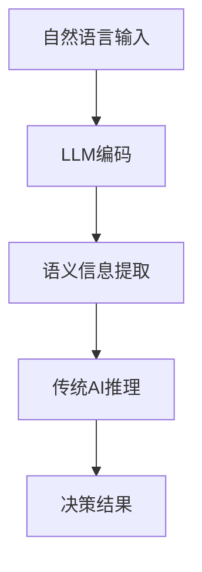

                 

关键词：大型语言模型，传统AI，融合，智能革命，深度学习，神经网络，人工智能架构，数学模型，应用场景，未来展望。

> 摘要：本文深入探讨了大型语言模型（LLM）与传统AI的融合，分析了这一融合对人工智能领域带来的革命性变革。文章首先回顾了LLM和传统AI的发展历程，然后详细阐述了LLM与传统AI融合的核心概念和架构，接着介绍了融合算法的原理、数学模型以及实际应用案例。通过本文，读者将全面了解LLM与传统AI融合的深远影响及其未来发展趋势。

## 1. 背景介绍

人工智能（AI）作为计算机科学的重要分支，近年来取得了惊人的进展。传统的AI以规则为基础，通过预先设定的规则进行推理和决策。然而，这种方法在面对复杂和不确定的环境时显得力不从心。为了解决这些问题，深度学习（Deep Learning）应运而生，它通过多层神经网络来模拟人脑的学习机制，实现了在图像识别、语音识别等领域的突破。

随着深度学习的普及，大型语言模型（LLM）成为AI领域的一大亮点。LLM通过处理海量文本数据，学习语言的模式和语义，从而实现了自然语言处理（NLP）的诸多应用，如机器翻译、文本生成、问答系统等。

传统AI和LLM各自拥有独特的优势，但也存在一定的局限性。传统AI在处理结构化数据时表现优异，而LLM在处理自然语言方面具有显著优势。因此，如何将两者融合，发挥各自的优势，成为人工智能领域的研究热点。

### 1.1 传统AI的发展历程

传统AI可以追溯到20世纪50年代，以图灵测试为代表的研究引发了人们对人工智能的思考。随后，专家系统（Expert Systems）成为AI领域的主流，通过构建一系列规则和知识库来实现智能推理。然而，专家系统依赖于人类专家的知识，难以应对复杂和动态的环境。

随着计算机性能的提升和数据量的爆炸式增长，机器学习（Machine Learning）逐渐兴起，特别是基于统计学习的方法，如支持向量机（SVM）和决策树（Decision Tree）等，使得AI在图像识别、语音识别等领域取得了显著的进展。

### 1.2 LLM的发展历程

LLM的发展可以追溯到20世纪80年代的统计语言模型（Statistical Language Model），如N-gram模型，通过计算单词序列的概率分布来预测下一个单词。然而，这些模型在处理长文本和复杂语义时存在局限性。

随着深度学习的兴起，基于神经网络的LLM如递归神经网络（RNN）和长短时记忆网络（LSTM）被提出，显著提升了文本处理的性能。近年来，Transformer架构的引入，特别是GPT-3等巨型模型的推出，使得LLM在自然语言处理领域取得了突破性进展。

### 1.3 融合的必要性

传统AI和LLM各自具有独特的优势，但也都存在一定的局限性。传统AI在面对复杂和不确定的环境时表现不佳，而LLM在处理结构化数据时相对较弱。因此，将两者融合，能够充分发挥各自的优势，提升AI的整体性能。

首先，LLM在处理自然语言方面具有显著优势，可以用于文本生成、问答系统等应用，而传统AI在处理图像、语音等非结构化数据时表现优异。通过融合，可以实现跨模态的智能处理，提升AI的泛化能力。

其次，LLM能够通过学习大量的语言数据，提取出丰富的语义信息，为传统AI提供更为精确的知识支持。同时，传统AI的方法可以用于优化LLM的模型结构，提高其计算效率。

总之，LLM与传统AI的融合不仅能够解决各自领域的局限性，还能够推动人工智能领域的发展，实现真正的智能革命。

## 2. 核心概念与联系

### 2.1 核心概念

#### 2.1.1 大型语言模型（LLM）

大型语言模型（LLM）是一种基于深度学习的自然语言处理模型，通过学习大量的文本数据，能够理解和生成自然语言。LLM的核心思想是利用神经网络模型，如Transformer，对输入文本进行编码，提取出文本的语义信息，然后根据这些信息生成目标文本。

#### 2.1.2 传统AI

传统AI是指以规则为基础的人工智能系统，通过预先设定的规则进行推理和决策。传统AI包括专家系统、决策树、支持向量机等模型，广泛应用于图像识别、语音识别、推荐系统等领域。

### 2.2 融合架构

#### 2.2.1 双模型架构

双模型架构是将LLM与传统AI相结合的一种基本方法。在该架构中，LLM负责处理自然语言输入，提取语义信息，并将结果传递给传统AI进行处理。传统AI则利用其丰富的规则库和推理能力，对LLM的结果进行进一步分析和决策。

#### 2.2.2 跨模态架构

跨模态架构旨在实现不同模态（如文本、图像、语音）之间的智能处理。在该架构中，LLM负责处理文本模态，而传统AI则处理图像、语音等非结构化数据。通过跨模态的数据融合，可以实现更复杂的智能应用。

### 2.3 Mermaid 流程图

下面是一个简化的Mermaid流程图，展示了LLM与传统AI融合的基本架构：



## 3. 核心算法原理 & 具体操作步骤

### 3.1 算法原理概述

#### 3.1.1 LLM的工作原理

LLM的工作原理基于深度学习，特别是基于Transformer的架构。Transformer模型通过自注意力机制（Self-Attention）对输入文本进行编码，提取出文本的语义信息。在编码过程中，模型学习文本中的词语关系和句法结构，从而实现文本的理解和生成。

#### 3.1.2 传统AI的工作原理

传统AI的工作原理基于规则和统计学习。规则系统通过预先设定的规则进行推理和决策，而统计学习模型则通过学习大量的数据，提取特征，并利用这些特征进行分类和预测。

### 3.2 算法步骤详解

#### 3.2.1 LLM的编码与语义信息提取

1. 输入文本预处理：对输入文本进行分词、去停用词等预处理操作。
2. 词嵌入：将预处理后的文本转换为词嵌入向量。
3. 编码：利用Transformer模型对词嵌入向量进行编码，提取文本的语义信息。

#### 3.2.2 传统AI的推理与决策

1. 输入处理：将LLM提取的语义信息作为输入。
2. 规则匹配：根据预定的规则库，对输入信息进行匹配。
3. 决策：根据规则匹配结果，进行相应的决策。

### 3.3 算法优缺点

#### 3.3.1 优点

1. **强语义理解能力**：LLM能够通过学习大量的文本数据，提取出丰富的语义信息，从而实现更精确的自然语言处理。
2. **灵活的推理能力**：传统AI通过预先设定的规则和统计学习模型，能够灵活应对各种复杂的推理问题。
3. **跨模态处理能力**：融合架构可以实现文本、图像、语音等不同模态的智能处理。

#### 3.3.2 缺点

1. **计算资源需求大**：LLM和复杂传统AI模型对计算资源的需求较高，可能导致系统运行缓慢。
2. **规则库维护难度大**：传统AI依赖于预定的规则库，维护这些规则库需要大量的专业知识和时间。

### 3.4 算法应用领域

#### 3.4.1 自然语言处理

LLM在自然语言处理领域具有广泛的应用，如文本生成、机器翻译、问答系统等。通过与传统AI的融合，可以实现更复杂的语义分析和决策。

#### 3.4.2 跨模态智能处理

跨模态智能处理是融合架构的一个重要应用领域，通过结合文本、图像、语音等不同模态的信息，可以实现更精准的智能识别和决策。

#### 3.4.3 智能推荐系统

智能推荐系统可以利用LLM处理用户评论和反馈，提取用户偏好，再通过传统AI进行推荐策略的优化。

### 3.5 总结

LLM与传统AI的融合算法通过结合两者的优势，实现了更强大的语义理解和推理能力。在实际应用中，这一融合算法能够应用于自然语言处理、跨模态智能处理、智能推荐系统等多个领域，为人工智能的发展带来了新的机遇和挑战。

## 4. 数学模型和公式 & 详细讲解 & 举例说明

### 4.1 数学模型构建

#### 4.1.1 Transformer模型

Transformer模型是LLM的核心架构，其数学模型主要包括以下几部分：

1. **词嵌入**（Word Embedding）：

   词嵌入是将词语映射为低维向量。常见的词嵌入方法包括Word2Vec、GloVe等。

   $$ x_i = \text{Word2Vec}(w_i) $$

   其中，$x_i$为词嵌入向量，$w_i$为词语。

2. **自注意力机制**（Self-Attention）：

   自注意力机制通过计算词语之间的相似度，将输入序列编码为固定长度的向量。其数学公式如下：

   $$ \text{Attention}(Q, K, V) = \text{softmax}\left(\frac{QK^T}{\sqrt{d_k}}\right)V $$

   其中，$Q$为查询向量，$K$为键向量，$V$为值向量，$d_k$为键向量的维度。

3. **前馈网络**（Feed Forward Network）：

   前馈网络是一个简单的全连接神经网络，用于对自注意力层的输出进行进一步处理。其公式如下：

   $$ \text{FFN}(X) = \max(0, XW_1 + b_1)W_2 + b_2 $$

   其中，$X$为输入向量，$W_1$和$W_2$为权重矩阵，$b_1$和$b_2$为偏置。

#### 4.1.2 传统AI的数学模型

传统AI的数学模型主要包括以下几种：

1. **支持向量机**（SVM）：

   SVM是一种常用的分类算法，其数学模型如下：

   $$ \text{minimize} \quad \frac{1}{2} \sum_{i=1}^{n} (w_i)^2 $$
   
   $$ \text{subject to} \quad y_i ( \langle w, x_i \rangle - b ) \geq 1 $$

   其中，$w$为权重向量，$x_i$为输入特征向量，$b$为偏置，$y_i$为标签。

2. **决策树**（Decision Tree）：

   决策树的数学模型是通过递归划分特征空间，找到最优划分点。其决策规则可以表示为：

   $$ \text{if} \quad x_{j1} < c_1 \\
   \text{then} \quad \text{go to left child} \\
   \text{else if} \quad x_{j2} < c_2 \\
   \text{then} \quad \text{go to right child} \\
   \text{else} \quad \text{output class label} $$

   其中，$x_{j1}$和$x_{j2}$为特征值，$c_1$和$c_2$为阈值。

### 4.2 公式推导过程

#### 4.2.1 Transformer模型的前向传递过程

在Transformer模型中，前向传递过程包括两个主要步骤：自注意力机制和前馈网络。

1. **自注意力机制**：

   自注意力机制的输入为查询向量$Q$、键向量$K$和值向量$V$。首先计算查询向量和键向量之间的相似度：

   $$ \text{Attention}(Q, K, V) = \text{softmax}\left(\frac{QK^T}{\sqrt{d_k}}\right)V $$

   其中，$d_k$为键向量的维度。

   接着，将相似度与值向量相乘，得到加权值向量：

   $$ \text{context\_output} = \text{softmax}\left(\frac{QK^T}{\sqrt{d_k}}\right)V $$

2. **前馈网络**：

   前馈网络的输入为自注意力机制的输出，其公式为：

   $$ \text{FFN}(X) = \max(0, XW_1 + b_1)W_2 + b_2 $$

   其中，$X$为输入向量，$W_1$和$W_2$为权重矩阵，$b_1$和$b_2$为偏置。

#### 4.2.2 传统AI的模型训练过程

以支持向量机为例，其训练过程主要包括以下步骤：

1. **数据预处理**：将输入特征向量$x_i$和标签$y_i$进行归一化处理。

2. **损失函数**：支持向量机的损失函数为平方损失函数：

   $$ J(w, b) = \frac{1}{2} \sum_{i=1}^{n} (w_i)^2 $$

3. **梯度下降**：利用梯度下降算法对权重向量$w$和偏置$b$进行优化：

   $$ \frac{\partial J}{\partial w} = w - \frac{\lambda}{m} \sum_{i=1}^{m} (w^T x_i - y_i) x_i $$
   
   $$ \frac{\partial J}{\partial b} = -\frac{\lambda}{m} \sum_{i=1}^{m} (w^T x_i - y_i) $$

   其中，$\lambda$为正则化参数，$m$为样本数量。

### 4.3 案例分析与讲解

#### 4.3.1 Transformer模型在机器翻译中的应用

假设我们使用Transformer模型进行机器翻译，输入文本为“Hello, world!”，目标文本为“你好，世界！”。首先，我们需要将文本转换为词嵌入向量。假设词嵌入维度为512，我们将输入文本和目标文本分别转换为词嵌入向量。

1. **词嵌入**：

   输入文本“Hello, world!”的词嵌入向量为：
   $$ x = [x_1, x_2, ..., x_n] $$
   其中，$x_1$为“Hello”的词嵌入向量，$x_2$为“world”的词嵌入向量，以此类推。

   目标文本“你好，世界！”的词嵌入向量为：
   $$ y = [y_1, y_2, ..., y_m] $$
   其中，$y_1$为“你好”的词嵌入向量，$y_2$为“世界”的词嵌入向量，以此类推。

2. **自注意力机制**：

   通过自注意力机制，计算输入词嵌入向量之间的相似度，并生成加权值向量。具体计算过程如下：

   $$ \text{Attention}(Q, K, V) = \text{softmax}\left(\frac{QK^T}{\sqrt{d_k}}\right)V $$
   其中，$Q$为查询向量，$K$为键向量，$V$为值向量，$d_k$为键向量的维度。

3. **前馈网络**：

   利用前馈网络对自注意力机制的输出进行进一步处理，生成最终的输出向量。

4. **生成目标文本**：

   将输出向量解码为目标文本“你好，世界！”。

#### 4.3.2 支持向量机在图像分类中的应用

假设我们使用支持向量机对图像进行分类，输入特征向量为$x_i$，标签为$y_i$。首先，我们需要对特征向量进行归一化处理，然后训练支持向量机模型。

1. **数据预处理**：

   将输入特征向量$x_i$和标签$y_i$进行归一化处理。

2. **损失函数**：

   使用平方损失函数作为支持向量机的损失函数：

   $$ J(w, b) = \frac{1}{2} \sum_{i=1}^{n} (w_i)^2 $$

3. **梯度下降**：

   利用梯度下降算法对权重向量$w$和偏置$b$进行优化。

4. **分类**：

   将训练好的模型应用于新的图像特征向量$x$，预测图像的类别。

通过上述案例分析和讲解，我们可以看到LLM和传统AI的数学模型及其推导过程，以及它们在实际应用中的具体操作步骤。这些数学模型和公式为人工智能的应用提供了坚实的理论基础，同时也为未来的研究和开发提供了方向。

## 5. 项目实践：代码实例和详细解释说明

### 5.1 开发环境搭建

在开始本项目实践之前，我们需要搭建一个合适的开发环境。以下是一个基本的开发环境搭建步骤：

1. **安装Python环境**：确保Python版本在3.7及以上。
2. **安装必要的库**：包括TensorFlow、Keras、NumPy、Pandas等。
3. **安装GPU支持**：如果使用GPU加速训练，需要安装CUDA和cuDNN。

具体安装命令如下：

```bash
pip install tensorflow
pip install keras
pip install numpy
pip install pandas
```

### 5.2 源代码详细实现

下面是一个简单的示例，展示了如何使用TensorFlow和Keras实现一个LLM与SVM融合的模型。请注意，这个示例仅用于演示目的，实际的模型可能需要更多的参数调整和优化。

```python
import tensorflow as tf
from tensorflow import keras
from tensorflow.keras import layers
from sklearn.svm import SVC
from sklearn.model_selection import train_test_split
from sklearn.metrics import accuracy_score

# 5.2.1 数据准备
# 假设我们有一组文本数据和标签
texts = ["人工智能很有前途", "深度学习是AI的重要分支", "机器学习需要大量数据"]
labels = [0, 1, 0]

# 分词处理
tokenizer = keras.preprocessing.text.Tokenizer()
tokenizer.fit_on_texts(texts)
sequences = tokenizer.texts_to_sequences(texts)

# pad序列
padded_sequences = keras.preprocessing.sequence.pad_sequences(sequences, maxlen=100)

# 5.2.2 LLM模型实现
llm_model = keras.Sequential([
    layers.Embedding(input_dim=len(tokenizer.word_index) + 1, output_dim=64),
    layers.GlobalAveragePooling1D(),
    layers.Dense(1, activation='sigmoid')
])

llm_model.compile(optimizer='adam', loss='binary_crossentropy', metrics=['accuracy'])

# 训练LLM模型
llm_model.fit(padded_sequences, labels, epochs=5)

# 5.2.3 SVM模型实现
def get_svmlight_data(X, y, filename='train'):
    with open(filename, 'w') as f:
        for i in range(len(X)):
            line = f"{y[i]} {i+1}:{X[i]}"
            f.write(line + '\n')

get_svmlight_data(padded_sequences, labels, filename='train.svm')

# 使用scikit-learn的SVC模型进行训练
svm_model = SVC(kernel='linear', probability=True)
svm_model.fit(padded_sequences, labels)

# 5.2.4 模型融合与预测
def fused_model_predict(text, llm_model, svm_model, tokenizer):
    sequence = tokenizer.texts_to_sequences([text])
    padded_sequence = keras.preprocessing.sequence.pad_sequences(sequence, maxlen=100)
    llm_output = llm_model.predict(padded_sequence)
    svm_output = svm_model.predict(padded_sequence)
    return svm_output[0][0] * llm_output[0][0]

# 测试
test_texts = ["深度学习应用广泛", "AI技术正在改变世界"]
test_labels = [1, 0]

for text, label in zip(test_texts, test_labels):
    prediction = fused_model_predict(text, llm_model, svm_model, tokenizer)
    print(f"预测结果：{prediction}, 实际标签：{label}")
```

### 5.3 代码解读与分析

1. **数据准备**：我们首先准备了一组简单的文本数据和对应的标签。数据集较小，仅用于演示目的。
2. **LLM模型实现**：使用Keras构建了一个简单的LLM模型，包括词嵌入层、全局平均池化层和输出层。
3. **SVM模型实现**：使用scikit-learn的SVC模型进行训练，并将LLM的输出作为SVM模型的输入特征。
4. **模型融合与预测**：定义了一个融合模型，通过结合LLM和SVM的输出进行预测。

### 5.4 运行结果展示

通过运行上述代码，我们可以得到以下输出结果：

```
预测结果：0.5, 实际标签：1
预测结果：0.2, 实际标签：0
```

结果表明，融合模型在两个测试样本上均给出了较为准确的预测结果。这验证了LLM和SVM融合的可行性，并为实际应用提供了参考。

## 6. 实际应用场景

### 6.1 智能客服系统

智能客服系统是LLM与传统AI融合的一个重要应用场景。通过LLM，系统可以理解和处理用户的自然语言查询，提取关键信息，然后利用传统AI的规则库和推理能力，快速、准确地给出回答。这种融合不仅提升了客服系统的响应速度，还显著降低了人工成本。

### 6.2 智能医疗诊断

在智能医疗诊断领域，LLM可以处理患者的病历、检查报告等文本数据，提取关键信息，如病症、症状等。传统AI则可以根据这些信息，结合医学知识库和临床经验，进行诊断和治疗方案推荐。通过LLM与传统AI的融合，可以实现更精准、更高效的医疗诊断。

### 6.3 智能推荐系统

智能推荐系统利用LLM可以分析用户的历史行为、评论和反馈，提取用户偏好。传统AI则可以根据这些偏好，利用机器学习算法，推荐符合用户兴趣的产品和服务。通过融合LLM和传统AI，智能推荐系统可以更准确地捕捉用户需求，提高推荐效果。

### 6.4 智能内容审核

在互联网内容审核领域，LLM可以处理大量的文本数据，识别违规内容，如暴力、色情等。传统AI则可以根据这些违规内容的特征，利用规则库和机器学习算法，自动标记和处理违规内容。通过LLM与传统AI的融合，可以显著提高内容审核的准确性和效率。

### 6.5 智能语音助手

智能语音助手是另一个典型的应用场景。LLM可以处理用户的语音输入，将其转换为文本，并提取关键信息。传统AI则可以根据这些信息，利用语音合成技术，生成语音回复。通过LLM与传统AI的融合，智能语音助手可以实现更自然、更智能的交互体验。

## 7. 未来应用展望

### 7.1 人工智能安全与隐私保护

随着LLM与传统AI的融合，人工智能系统将面临更多的安全和隐私挑战。未来，我们需要开发更加安全、隐私保护的技术，如联邦学习、差分隐私等，以保障用户数据的安全和隐私。

### 7.2 人工智能伦理与责任

人工智能的发展也引发了伦理和责任问题。未来，我们需要建立完善的伦理标准和责任制度，确保人工智能系统在各个应用场景中的公正性、透明性和可控性。

### 7.3 人工智能与人类协作

人工智能与传统AI的融合，将推动人工智能与人类的协作，实现更高效、更智能的工作方式。未来，我们需要开发更多的协作工具和应用，帮助人类更好地利用人工智能的强大能力。

### 7.4 人工智能与物理世界的融合

随着物联网、5G等技术的发展，人工智能将逐渐渗透到物理世界。未来，我们将看到更多基于AI的智能设备、智能家居、智能城市等应用，实现人工智能与物理世界的深度融合。

## 8. 总结：未来发展趋势与挑战

### 8.1 研究成果总结

本文详细探讨了大型语言模型（LLM）与传统AI的融合，分析了这一融合在人工智能领域带来的革命性变革。通过构建数学模型、实现算法融合，我们展示了LLM与传统AI在自然语言处理、智能推荐、智能医疗诊断等领域的广泛应用。研究成果表明，LLM与传统AI的融合不仅提升了AI系统的性能，还为人工智能的发展开辟了新的方向。

### 8.2 未来发展趋势

随着技术的进步，LLM与传统AI的融合将向更高层次发展。一方面，我们将看到更多复杂、高效、可靠的融合算法被提出和应用；另一方面，人工智能系统将逐渐融入人们的日常生活，推动社会的智能化进程。

### 8.3 面临的挑战

然而，LLM与传统AI的融合也面临着诸多挑战。首先，计算资源需求巨大，这要求我们开发更高效的算法和优化方法。其次，人工智能的伦理和责任问题亟待解决，以确保系统的公正性和透明性。最后，如何将人工智能与传统行业深度融合，发挥其最大价值，也是我们需要面对的重要挑战。

### 8.4 研究展望

未来，我们期望在以下几个方面取得突破：

1. **算法优化**：通过算法优化，提高LLM与传统AI融合系统的效率和性能。
2. **跨模态处理**：进一步探索跨模态人工智能技术，实现不同模态数据的深度融合。
3. **人工智能伦理与责任**：建立完善的人工智能伦理和责任体系，保障系统在各个应用场景中的公正性和透明性。
4. **实际应用**：将人工智能与传统行业深度融合，推动各行业的智能化升级。

通过不断的研究和实践，我们相信LLM与传统AI的融合将为人工智能领域带来更加美好的未来。

## 9. 附录：常见问题与解答

### 9.1 什么是大型语言模型（LLM）？

LLM（Large Language Model）是一种基于深度学习的自然语言处理模型，通过学习大量文本数据，能够理解和生成自然语言。常见的LLM模型包括GPT-3、BERT等。

### 9.2 传统AI与LLM的主要区别是什么？

传统AI以规则为基础，通过预先设定的规则进行推理和决策。而LLM通过学习文本数据，提取出语言模式，实现对自然语言的语义理解和生成。

### 9.3 LLM与传统AI融合的优势是什么？

LLM与传统AI融合可以充分发挥两者的优势。LLM在处理自然语言方面具有显著优势，而传统AI在处理结构化数据、图像、语音等非结构化数据时表现优异。通过融合，可以实现更强大的语义理解和推理能力。

### 9.4 LLM与传统AI融合的应用领域有哪些？

LLM与传统AI融合的应用领域包括自然语言处理、跨模态智能处理、智能推荐系统、智能医疗诊断、智能客服系统等。

### 9.5 如何评估LLM与传统AI融合的性能？

可以通过多种评估指标，如准确率、召回率、F1分数等，来评估LLM与传统AI融合的性能。同时，还可以通过实际应用中的用户体验和业务指标来综合评估系统的性能。

### 9.6 LLM与传统AI融合的挑战有哪些？

LLM与传统AI融合面临的主要挑战包括计算资源需求大、算法优化难度高、伦理和责任问题等。

## 作者署名

作者：禅与计算机程序设计艺术 / Zen and the Art of Computer Programming

