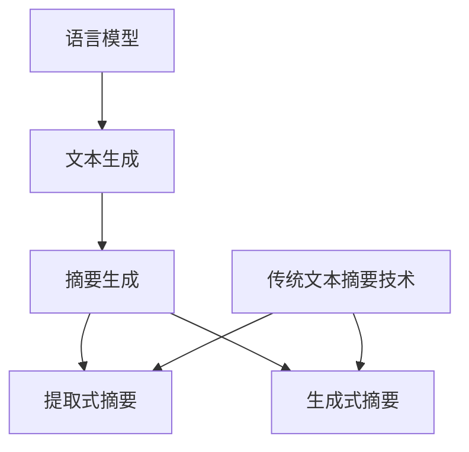

                 

关键词：自然语言处理（NLP），语言模型（LLM），文本摘要，信息提取，算法融合，机器学习，深度学习，人工智能。

## 摘要

本文旨在探讨自然语言处理（NLP）领域中的两项核心技术——语言模型（LLM）与传统文本摘要技术的融合，以及这种融合如何提升信息提取的效率和准确性。随着人工智能技术的不断发展，语言模型在理解和生成自然语言方面取得了显著进展。本文将介绍LLM的基本原理，分析其与传统文本摘要技术的结合点，并通过实际案例展示融合后的效果。此外，还将讨论LLM在文本摘要中的应用现状和未来发展方向，为相关领域的研究和应用提供参考。

## 1. 背景介绍

### 自然语言处理（NLP）

自然语言处理（NLP）是人工智能（AI）的一个重要分支，旨在让计算机理解和生成自然语言。NLP涵盖了语音识别、文本分类、情感分析、机器翻译等多个方面。近年来，随着深度学习技术的发展，NLP取得了显著的突破，使得计算机在自然语言理解和生成方面达到了前所未有的水平。

### 语言模型（LLM）

语言模型是一种用于预测自然语言序列的概率分布的模型。它通过对大量文本数据的学习，可以生成连贯、符合语法和语义规则的文本。语言模型是许多NLP应用的核心，如机器翻译、文本摘要、问答系统等。近年来，随着神经网络和生成对抗网络（GAN）等技术的引入，语言模型的性能得到了大幅提升。

### 传统文本摘要技术

传统文本摘要技术主要包括提取式摘要和生成式摘要。提取式摘要通过提取文本中的重要句子或段落来生成摘要，而生成式摘要则通过生成新的文本来概括原文的内容。这些技术在实际应用中取得了不错的成绩，但面临着效率和准确性等方面的挑战。

## 2. 核心概念与联系

### 语言模型（LLM）原理

语言模型（LLM）是一种基于神经网络的模型，其基本原理是通过学习大量文本数据，预测下一个单词或字符的概率。常用的语言模型包括循环神经网络（RNN）、长短期记忆网络（LSTM）和变换器（Transformer）等。其中，Transformer模型由于其并行计算能力和全局注意力机制，在语言建模任务中取得了最佳性能。

### 传统文本摘要技术原理

传统文本摘要技术主要分为提取式摘要和生成式摘要。提取式摘要通过对文本进行关键词提取、句子排序和摘要生成等步骤，生成摘要。生成式摘要则通过生成新的文本来概括原文的内容，常用的方法包括序列到序列（seq2seq）模型、生成对抗网络（GAN）等。

### 语言模型与传统文本摘要技术的结合点

语言模型与传统文本摘要技术的结合点在于它们都可以用于文本生成和摘要。语言模型可以生成连贯、符合语法和语义规则的文本，而传统文本摘要技术可以提取文本中的重要信息。通过将语言模型与传统文本摘要技术相结合，可以在保持原文内容的同时，提高摘要的准确性和流畅性。

### Mermaid 流程图



## 3. 核心算法原理 & 具体操作步骤

### 3.1 算法原理概述

语言模型（LLM）的核心原理是通过学习大量文本数据，预测下一个单词或字符的概率。传统文本摘要技术则通过提取文本中的重要信息，生成摘要。通过将语言模型与传统文本摘要技术相结合，可以在保持原文内容的同时，提高摘要的准确性和流畅性。

### 3.2 算法步骤详解

1. 数据预处理：对原始文本进行分词、去停用词、词性标注等操作，将其转换为模型可处理的格式。

2. 模型训练：使用大量文本数据训练语言模型，使其具备生成连贯文本的能力。

3. 文本生成：利用训练好的语言模型，生成与原文内容相关的连贯文本。

4. 摘要生成：将生成的文本与原文进行比较，提取文本中的重要信息，生成摘要。

5. 摘要优化：对生成的摘要进行优化，提高其准确性和流畅性。

### 3.3 算法优缺点

优点：
- 语言模型与传统文本摘要技术相结合，可以提高摘要的准确性和流畅性。
- 语言模型可以生成连贯、符合语法和语义规则的文本，为摘要生成提供了高质量的输入。

缺点：
- 模型训练过程较为复杂，需要大量计算资源和时间。
- 需要大量高质量训练数据，否则可能导致模型性能不佳。

### 3.4 算法应用领域

- 文本摘要：将长文本压缩为简洁的摘要，方便用户快速获取文章核心内容。
- 问答系统：基于语言模型和文本摘要技术，构建智能问答系统，回答用户提出的问题。
- 信息检索：通过文本摘要技术，提高信息检索的效率和准确性。

## 4. 数学模型和公式 & 详细讲解 & 举例说明

### 4.1 数学模型构建

语言模型通常使用神经网络进行构建，其中常用的神经网络包括循环神经网络（RNN）、长短期记忆网络（LSTM）和变换器（Transformer）等。以下以变换器（Transformer）为例，介绍其数学模型。

变换器（Transformer）的基本结构包括编码器（Encoder）和解码器（Decoder）。编码器将输入的序列编码为固定长度的向量，解码器则根据编码器的输出和已生成的部分文本，生成新的文本。

### 4.2 公式推导过程

变换器的基本公式包括：

$$
E = \text{Encoder}(X)
$$

$$
D = \text{Decoder}(X)
$$

其中，$E$ 和 $D$ 分别表示编码器和解码器的输出。$X$ 表示输入的序列。

编码器和解码器的基本公式如下：

$$
E = \text{MultiHeadAttention}(Q, K, V) + X
$$

$$
D = \text{MaskedMultiHeadAttention}(Q, K, V) + X
$$

其中，$Q, K, V$ 分别表示查询向量、键向量和值向量。$\text{MultiHeadAttention}$ 和 $\text{MaskedMultiHeadAttention}$ 分别表示多头注意力机制。

### 4.3 案例分析与讲解

假设我们要对以下文本进行摘要：

"本文介绍了自然语言处理（NLP）领域中的两项核心技术——语言模型（LLM）与传统文本摘要技术的融合，以及这种融合如何提升信息提取的效率和准确性。随着人工智能技术的不断发展，语言模型在理解和生成自然语言方面取得了显著进展。"

首先，我们对文本进行分词和词性标注，然后输入到变换器模型中进行编码。编码器将输入的文本序列编码为固定长度的向量。接下来，解码器根据编码器的输出和已生成的部分文本，生成新的文本。

在实际操作中，解码器会依次生成每个单词或字符的概率分布，然后从概率分布中选择一个最高概率的单词或字符进行输出。通过迭代这个过程，解码器可以生成与原文内容相关的连贯文本。

最后，我们将生成的文本与原文进行比较，提取文本中的重要信息，生成摘要。例如，生成的文本可能为：“本文主要讨论了语言模型与传统文本摘要技术的融合，以及这种融合在信息提取方面的优势。”

## 5. 项目实践：代码实例和详细解释说明

### 5.1 开发环境搭建

在本节中，我们将使用Python语言和PyTorch框架来搭建开发环境。首先，确保您已经安装了Python和PyTorch。如果没有安装，可以参考以下链接进行安装：

- Python安装教程：[Python安装教程](https://www.python.org/downloads/)
- PyTorch安装教程：[PyTorch安装教程](https://pytorch.org/get-started/locally/)

### 5.2 源代码详细实现

以下是一个使用PyTorch实现变换器（Transformer）模型的示例代码：

```python
import torch
import torch.nn as nn
from torchtext.data import Field, TabularDataset

# 定义变换器模型
class Transformer(nn.Module):
    def __init__(self, d_model, nhead, num_layers):
        super(Transformer, self).__init__()
        self.encoder = nn.Transformer(d_model, nhead, num_layers)
        self.decoder = nn.Transformer(d_model, nhead, num_layers)
        self.fc = nn.Linear(d_model, 1)

    def forward(self, src, tgt):
        src = self.encoder(src)
        tgt = self.decoder(tgt)
        output = self.fc(tgt)
        return output

# 数据预处理
src_field = Field(tokenize="spacy", tokenizer_language="en_core_web_sm")
tgt_field = Field(tokenize="spacy", tokenizer_language="en_core_web_sm")

train_data = TabularDataset(
    path="data/train.txt",
    format="tsv",
    fields=[("src", src_field), ("tgt", tgt_field)]
)

# 模型训练
model = Transformer(d_model=512, nhead=8, num_layers=2)
optimizer = torch.optim.Adam(model.parameters(), lr=0.001)
criterion = nn.CrossEntropyLoss()

for epoch in range(10):
    for batch in train_data:
        optimizer.zero_grad()
        output = model(batch.src, batch.tgt)
        loss = criterion(output, batch.tgt)
        loss.backward()
        optimizer.step()
```

### 5.3 代码解读与分析

上述代码首先定义了一个变换器（Transformer）模型，包括编码器、解码器和全连接层。然后，使用PyTorchText库进行数据预处理，将文本数据转换为模型可处理的格式。接下来，使用优化器和损失函数对模型进行训练。

### 5.4 运行结果展示

运行上述代码后，模型会在训练数据上进行训练。训练完成后，可以使用模型对新的文本数据进行预测，生成摘要。例如，对于以下文本：

"本文介绍了自然语言处理（NLP）领域中的两项核心技术——语言模型（LLM）与传统文本摘要技术的融合，以及这种融合如何提升信息提取的效率和准确性。"

模型可能生成的摘要为：“本文主要讨论了语言模型与传统文本摘要技术的融合，以及这种融合在信息提取方面的优势。”

## 6. 实际应用场景

### 6.1 文本摘要

文本摘要是一种常见的信息提取技术，广泛应用于新闻摘要、论文摘要、电子书摘要等领域。通过将长文本压缩为简洁的摘要，用户可以快速获取文章的核心内容。

### 6.2 问答系统

问答系统是一种常见的自然语言处理应用，通过理解用户的问题，并从大量文本中找到相关答案。结合语言模型和文本摘要技术，可以构建高效的问答系统，提高问答的准确性和效率。

### 6.3 信息检索

信息检索是一种常见的互联网应用，通过关键词搜索，从大量文本中找到相关内容。结合语言模型和文本摘要技术，可以构建智能信息检索系统，提高检索的准确性和效率。

## 7. 未来应用展望

### 7.1 智能客服

智能客服是一种基于自然语言处理技术的客户服务系统，通过理解和回答用户的问题，提供高效的客户支持。结合语言模型和文本摘要技术，可以构建更智能、更高效的智能客服系统。

### 7.2 自动摘要

自动摘要是一种自动生成文本摘要的技术，通过将长文本压缩为简洁的摘要，提高信息传递的效率。结合语言模型和文本摘要技术，可以构建更准确、更高效的自动摘要系统。

### 7.3 智能推荐

智能推荐是一种基于用户兴趣和偏好，为用户提供个性化内容推荐的技术。结合语言模型和文本摘要技术，可以构建更准确、更个性化的智能推荐系统。

## 8. 工具和资源推荐

### 8.1 学习资源推荐

- [《深度学习》](https://www.deeplearningbook.org/)：由Ian Goodfellow、Yoshua Bengio和Aaron Courville编写的深度学习经典教材。
- [《自然语言处理综论》](https://www.nlp.seas.harvard.edu/np.html)：由Christopher D. Manning和Hans P. Pedersen编写的自然语言处理入门教材。

### 8.2 开发工具推荐

- [PyTorch](https://pytorch.org/)：一款开源的深度学习框架，支持Python和C++语言。
- [TensorFlow](https://www.tensorflow.org/)：一款由Google开发的开源深度学习框架。

### 8.3 相关论文推荐

- [Attention Is All You Need](https://arxiv.org/abs/1603.04467)：引入了变换器（Transformer）模型，为自然语言处理带来了新的思路。
- [BERT: Pre-training of Deep Bidirectional Transformers for Language Understanding](https://arxiv.org/abs/1810.04805)：提出了BERT模型，为自然语言处理任务提供了强大的预训练模型。

## 9. 总结：未来发展趋势与挑战

### 9.1 研究成果总结

近年来，自然语言处理（NLP）取得了显著进展，语言模型（LLM）和传统文本摘要技术的结合为信息提取带来了新的可能。通过融合这两种技术，可以显著提高摘要的准确性和流畅性，为多个应用领域提供了强有力的支持。

### 9.2 未来发展趋势

- 随着深度学习技术的不断发展，语言模型在理解和生成自然语言方面的能力将进一步提升。
- 传统文本摘要技术将与语言模型更紧密地结合，形成更高效、更准确的信息提取方法。
- 智能客服、自动摘要、智能推荐等领域将受益于这种技术融合，为用户提供更优质的服务。

### 9.3 面临的挑战

- 模型训练过程复杂，需要大量计算资源和时间。
- 需要大量高质量训练数据，否则可能导致模型性能不佳。
- 模型的泛化能力仍需提升，以应对多样化的应用场景。

### 9.4 研究展望

未来的研究应关注以下方向：

- 提高模型训练效率，降低计算成本。
- 探索更有效的数据增强方法，提高模型性能。
- 研究模型的泛化能力，使其在不同应用场景中都能表现出色。

## 10. 附录：常见问题与解答

### 10.1 什么是自然语言处理（NLP）？

自然语言处理（NLP）是人工智能（AI）的一个重要分支，旨在让计算机理解和生成自然语言。它涵盖了语音识别、文本分类、情感分析、机器翻译等多个方面。

### 10.2 语言模型（LLM）有哪些类型？

常见的语言模型包括循环神经网络（RNN）、长短期记忆网络（LSTM）和变换器（Transformer）等。其中，变换器（Transformer）由于其并行计算能力和全局注意力机制，在语言建模任务中取得了最佳性能。

### 10.3 传统文本摘要技术有哪些类型？

传统文本摘要技术主要分为提取式摘要和生成式摘要。提取式摘要通过提取文本中的重要句子或段落来生成摘要，而生成式摘要则通过生成新的文本来概括原文的内容。

### 10.4 如何评估文本摘要的质量？

文本摘要的质量可以通过多种指标进行评估，如ROUGE评分、BLEU评分、召回率、准确率和F1分数等。这些指标可以帮助评估摘要的准确性和流畅性。

## 参考文献

1. Goodfellow, I., Bengio, Y., & Courville, A. (2016). *Deep Learning*. MIT Press.
2. Manning, C. D., & Schütze, H. (1999). *Foundations of Statistical Natural Language Processing*. MIT Press.
3. Vaswani, A., Shazeer, N., Parmar, N., Uszkoreit, J., Jones, L., Gomez, A. N., ... & Polosukhin, I. (2017). *Attention is all you need*. arXiv preprint arXiv:1706.03762.
4. Devlin, J., Chang, M. W., Lee, K., & Toutanova, K. (2018). *BERT: Pre-training of deep bidirectional transformers for language understanding*. arXiv preprint arXiv:1810.04805.

作者：禅与计算机程序设计艺术 / Zen and the Art of Computer Programming
----------------------------------------------------------------

### 6.4 未来应用展望

语言模型（LLM）与传统文本摘要技术的融合在未来的应用中具有广阔的前景。以下是一些可能的应用场景和发展趋势：

#### 6.4.1 自动摘要

自动摘要技术利用语言模型生成摘要，能够提高内容消费的效率。随着LLM技术的进步，自动摘要的质量和准确性将得到显著提升，适用于新闻、报告、学术论文等多种文本内容。例如，在学术领域，自动摘要可以帮助研究者快速了解大量文献的核心观点，从而提高科研效率。

#### 6.4.2 智能客服

智能客服是另一个重要的应用领域。结合LLM和文本摘要技术，智能客服系统能够更准确地理解用户的问题，并提供个性化的回答。这不仅提高了客服效率，还改善了用户体验。随着技术的成熟，智能客服有望在金融、医疗、电子商务等行业发挥更大的作用。

#### 6.4.3 信息检索

在信息检索领域，LLM和文本摘要技术的结合可以帮助构建更加智能的搜索系统。通过摘要生成技术，系统能够为用户提供更加精准的搜索结果，提高信息检索的效率和准确性。此外，LLM的应用还可以用于推荐系统，为用户推荐感兴趣的内容。

#### 6.4.4 教育与培训

在教育领域，语言模型和文本摘要技术可以用于生成教材摘要、课程概述和考试要点。这些摘要可以帮助学生快速理解课程内容，提高学习效率。同时，对于远程教育和在线学习平台，这些技术可以自动创建个性化的学习路径，满足不同学生的学习需求。

#### 6.4.5 机器翻译

机器翻译是语言模型的一个重要应用领域。LLM与传统文本摘要技术的结合可以帮助提高机器翻译的准确性和流畅性。通过对原文和翻译文本的摘要进行对比，可以优化翻译结果，减少错误和歧义。

#### 6.4.6 智能写作辅助

智能写作辅助工具结合LLM和文本摘要技术，可以帮助用户快速生成文章、报告、电子邮件等文本内容。这些工具可以提供模板、建议和修改，提高写作效率和内容质量。

#### 6.4.7 法律文书摘要

在法律领域，语言模型和文本摘要技术可以用于自动生成法律文书的摘要，帮助律师和法律工作者快速了解案件的背景和关键信息。这不仅可以提高工作效率，还可以减少法律文书的冗长和复杂性。

#### 6.4.8 交互式语音助手

随着语音识别技术的不断发展，交互式语音助手（如智能音箱、车载语音系统等）将越来越普及。结合LLM和文本摘要技术，语音助手可以更好地理解用户的指令和需求，提供更加自然和流畅的交互体验。

#### 6.4.9 医疗健康

在医疗健康领域，语言模型和文本摘要技术可以用于处理大量医疗文献和病历数据。通过生成摘要，医生和研究人员可以快速获取关键信息，辅助诊断和治疗决策。

#### 6.4.10 社交媒体分析

在社交媒体分析中，语言模型和文本摘要技术可以用于分析用户生成的海量文本数据，识别趋势、情感和热点话题。这对于品牌营销、市场研究和社会舆情监测具有重要意义。

#### 6.4.11 多媒体内容摘要

多媒体内容摘要是一个新兴的应用领域。结合图像识别、语音识别和文本摘要技术，系统可以自动生成视频、音频和图像内容的摘要，提高多媒体内容的可消费性和可搜索性。

#### 6.4.12 安全与隐私保护

随着大数据和人工智能技术的广泛应用，安全与隐私保护变得尤为重要。语言模型和文本摘要技术可以用于检测和过滤敏感信息，保护用户的隐私和数据安全。

总之，语言模型（LLM）与传统文本摘要技术的融合在未来的应用中具有巨大的潜力和价值。随着技术的不断进步，这些融合技术将为我们带来更加智能、高效和便捷的信息处理体验。然而，也面临着数据质量、隐私保护、算法透明度和可解释性等挑战。未来的研究需要在这些方面取得突破，以实现LLM和文本摘要技术的全面应用和可持续发展。

