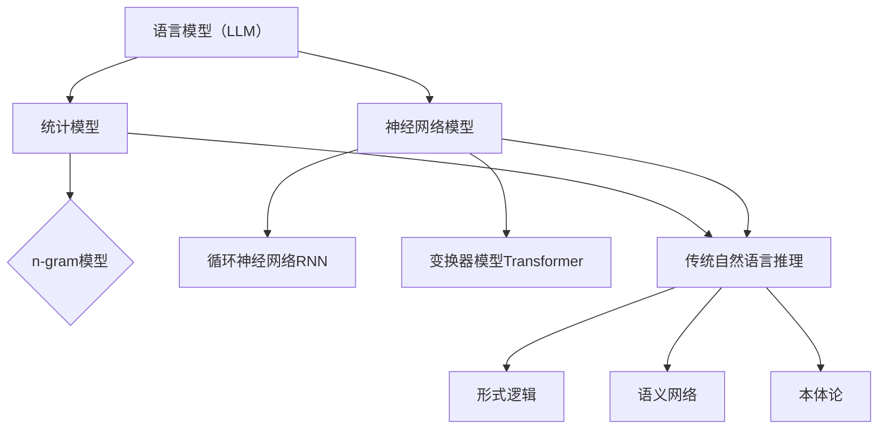

                 

关键词：自然语言处理，语言模型，传统推理，比较分析，应用场景

> 摘要：本文通过对自然语言处理（NLP）中的两大模块——语言模型（LLM）与传统自然语言推理的比较分析，深入探讨二者的原理、应用、优缺点及未来发展趋势。文章首先介绍了LLM和传统自然语言推理的基本概念，然后从算法原理、数学模型、实际应用等多个角度进行了详细对比，旨在为读者提供全面的参考和指导。

## 1. 背景介绍

自然语言处理（NLP）是计算机科学与人工智能领域的一个重要分支，旨在让计算机理解和生成人类语言。随着深度学习技术的发展，NLP取得了显著的成果，特别是在文本生成、情感分析、机器翻译等方面。其中，语言模型（LLM）和传统自然语言推理是NLP领域的两个重要模块。

语言模型（LLM）是一种基于统计和学习方法的模型，旨在预测文本序列的概率分布。通过学习大量的文本数据，LLM能够生成连贯、自然的文本，并在语音合成、文本摘要、问答系统等领域得到广泛应用。传统自然语言推理则是一种基于逻辑和规则的推理方法，旨在从已知的事实和规则中推导出新的结论。传统自然语言推理在语义分析、信息抽取、文本分类等方面具有优势。

本文将围绕LLM和传统自然语言推理进行比较分析，旨在揭示二者的异同点，为实际应用提供指导。

## 2. 核心概念与联系

### 2.1 语言模型（LLM）

语言模型（LLM）是一种用于预测文本序列概率分布的模型。其核心思想是利用统计和学习方法，从大量的文本数据中学习语言的规律，并在此基础上生成新的文本。LLM可以分为基于统计模型（如n-gram模型）和基于神经网络模型（如循环神经网络RNN、变换器模型Transformer等）。

### 2.2 传统自然语言推理

传统自然语言推理是一种基于逻辑和规则的推理方法，旨在从已知的事实和规则中推导出新的结论。传统自然语言推理可以分为基于形式逻辑（如一阶谓词逻辑）、基于语义网络和基于本体论的方法。

### 2.3 联系与区别

LLM和传统自然语言推理在NLP领域中具有紧密的联系，但它们的原理、方法和应用场景有所不同。LLM主要关注文本生成和概率预测，而传统自然语言推理则侧重于语义理解和逻辑推理。

### 2.4 Mermaid流程图

下面是一个简单的Mermaid流程图，展示了LLM和传统自然语言推理的核心概念及其联系。



## 3. 核心算法原理 & 具体操作步骤

### 3.1 算法原理概述

#### 3.1.1 语言模型（LLM）

语言模型（LLM）的核心算法原理是概率预测。具体来说，LLM通过学习大量的文本数据，建立一个文本序列的概率分布模型。在给定一个前文序列的情况下，LLM能够预测下一个单词或词组出现的概率。

#### 3.1.2 传统自然语言推理

传统自然语言推理的核心算法原理是基于逻辑和规则进行推理。具体来说，传统自然语言推理首先将文本表示为形式逻辑或语义网络的形式，然后利用逻辑推理规则或语义网络中的关系进行推理，从而推导出新的结论。

### 3.2 算法步骤详解

#### 3.2.1 语言模型（LLM）算法步骤

1. 数据收集与预处理：收集大量的文本数据，并进行分词、去停用词、词性标注等预处理操作。

2. 模型训练：利用训练数据，训练一个概率分布模型。对于基于统计模型的LLM，如n-gram模型，可以使用最大似然估计进行训练；对于基于神经网络模型的LLM，如循环神经网络RNN、变换器模型Transformer，可以使用梯度下降、Adam优化器等进行训练。

3. 概率预测：在给定一个前文序列的情况下，利用训练好的模型预测下一个单词或词组出现的概率。

#### 3.2.2 传统自然语言推理算法步骤

1. 文本表示：将文本表示为形式逻辑或语义网络的形式。对于形式逻辑，可以使用一阶谓词逻辑进行表示；对于语义网络，可以使用本体论进行表示。

2. 逻辑推理：利用逻辑推理规则或语义网络中的关系进行推理。对于形式逻辑，可以使用推理机进行推理；对于语义网络，可以使用路径搜索、子图匹配等方法进行推理。

3. 结果推导：根据推理结果，推导出新的结论。

### 3.3 算法优缺点

#### 3.3.1 语言模型（LLM）优缺点

**优点：**
- 强大的文本生成能力，能够生成连贯、自然的文本。
- 广泛的应用场景，如文本摘要、问答系统、语音合成等。

**缺点：**
- 对语言规则和语义理解能力有限，难以处理复杂的问题。
- 需要大量的训练数据和计算资源。

#### 3.3.2 传统自然语言推理优缺点

**优点：**
- 基于逻辑和规则进行推理，能够处理复杂的问题。
- 对语义理解能力较强，能够提取出文本中的关键信息。

**缺点：**
- 难以生成连贯、自然的文本。
- 应用场景较为有限，主要应用于语义分析、信息抽取、文本分类等领域。

### 3.4 算法应用领域

#### 3.4.1 语言模型（LLM）应用领域

- 文本生成：如自动写作、故事生成、新闻摘要等。
- 问答系统：如智能客服、搜索引擎等。
- 语音合成：如语音助手、车载导航等。

#### 3.4.2 传统自然语言推理应用领域

- 语义分析：如情感分析、文本分类、关系提取等。
- 信息抽取：如实体识别、事件抽取、知识图谱构建等。
- 文本分类：如垃圾邮件过滤、舆情监测等。

## 4. 数学模型和公式 & 详细讲解 & 举例说明

### 4.1 数学模型构建

#### 4.1.1 语言模型（LLM）数学模型

语言模型（LLM）的数学模型主要分为基于统计模型和基于神经网络模型两种。

1. 基于统计模型的LLM：如n-gram模型。n-gram模型是一个马尔可夫模型，它假设一个词的出现仅与其前n-1个词相关。给定一个前文序列，n-gram模型可以计算下一个词的概率。

$$P(w_n | w_{n-1}, w_{n-2}, ..., w_1) = \frac{C(w_n, w_{n-1}, ..., w_1)}{C(w_{n-1}, w_{n-2}, ..., w_1)}$$

其中，$C(w_n, w_{n-1}, ..., w_1)$表示词序列$(w_n, w_{n-1}, ..., w_1)$在训练数据中出现的次数。

2. 基于神经网络模型的LLM：如循环神经网络RNN、变换器模型Transformer。这些模型利用神经网络结构来捕捉文本序列中的长距离依赖关系，并实现概率预测。

#### 4.1.2 传统自然语言推理数学模型

传统自然语言推理的数学模型主要基于形式逻辑、语义网络和本体论。

1. 基于形式逻辑的模型：如一阶谓词逻辑。一阶谓词逻辑是一种形式语言，用于表示事实和规则。利用一阶谓词逻辑，可以进行推理和证明。

$$\forall x (P(x) \rightarrow Q(x))$$

2. 基于语义网络的模型：如语义网络。语义网络是一种基于节点和边的图结构，用于表示实体和它们之间的关系。利用语义网络，可以进行路径搜索和子图匹配等操作。

3. 基于本体论的模型：如本体论。本体论是一种知识表示框架，用于描述实体、属性和关系。利用本体论，可以进行推理和知识表示。

### 4.2 公式推导过程

在本节中，我们将分别介绍基于统计模型和基于神经网络模型的LLM的公式推导过程。

#### 4.2.1 基于统计模型的LLM公式推导

以n-gram模型为例，我们首先需要计算两个概率：

1. 前文序列$w_{n-1}, w_{n-2}, ..., w_1$在训练数据中出现的概率$P(w_{n-1}, w_{n-2}, ..., w_1)$。

$$P(w_{n-1}, w_{n-2}, ..., w_1) = \frac{C(w_{n-1}, w_{n-2}, ..., w_1)}{C}$$

其中，$C$表示训练数据中所有词序列的总数。

2. 在给定前文序列$w_{n-1}, w_{n-2}, ..., w_1$的情况下，下一个词$w_n$的概率$P(w_n | w_{n-1}, w_{n-2}, ..., w_1)$。

$$P(w_n | w_{n-1}, w_{n-2}, ..., w_1) = \frac{C(w_n, w_{n-1}, w_{n-2}, ..., w_1)}{C(w_{n-1}, w_{n-2}, ..., w_1)}$$

其中，$C(w_n, w_{n-1}, w_{n-2}, ..., w_1)$表示词序列$(w_n, w_{n-1}, w_{n-2}, ..., w_1)$在训练数据中出现的次数。

根据贝叶斯定理，我们可以得到：

$$P(w_n | w_{n-1}, w_{n-2}, ..., w_1) = \frac{P(w_{n-1}, w_{n-2}, ..., w_1) \cdot P(w_n | w_{n-1}, w_{n-2}, ..., w_1)}{P(w_{n-1}, w_{n-2}, ..., w_1)}$$

由于$P(w_{n-1}, w_{n-2}, ..., w_1)$在所有情况下都是相同的，因此可以将其约去，得到：

$$P(w_n | w_{n-1}, w_{n-2}, ..., w_1) = P(w_n | w_{n-1}, w_{n-2}, ..., w_1)$$

这就是n-gram模型的概率预测公式。

#### 4.2.2 基于神经网络模型的LLM公式推导

以循环神经网络RNN为例，我们首先需要了解RNN的基本结构。RNN由一个序列输入和一个隐藏状态组成，隐藏状态通过时间步传递，用于表示序列的上下文信息。

在给定一个前文序列$w_{n-1}, w_{n-2}, ..., w_1$的情况下，RNN的隐藏状态$h_t$可以表示为：

$$h_t = \sigma(W_h \cdot h_{t-1} + W_x \cdot x_t + b_h)$$

其中，$\sigma$表示激活函数，$W_h$和$W_x$分别表示隐藏状态和输入的权重矩阵，$b_h$表示隐藏状态的偏置。

在最后一个时间步$t=n$，隐藏状态$h_n$表示当前文本序列的上下文信息。我们可以利用$h_n$和词向量$w_n$计算概率：

$$P(w_n | h_n) = \text{softmax}(W_o \cdot h_n + b_o)$$

其中，$W_o$和$b_o$分别表示输出权重矩阵和偏置。

### 4.3 案例分析与讲解

在本节中，我们将通过一个简单的案例来分析语言模型（LLM）和传统自然语言推理在实际应用中的表现。

#### 案例背景

假设我们有一个包含10个新闻标题的数据集，我们需要预测每个新闻标题对应的内容摘要。

#### 案例分析

1. 语言模型（LLM）

我们使用一个基于变换器模型（Transformer）的语言模型来预测新闻标题的内容摘要。在训练过程中，我们使用了一个包含1亿个新闻标题和内容摘要的语料库。在预测阶段，我们输入一个新闻标题，如“全球最大石油公司宣布巨额利润”，语言模型将生成一个内容摘要，如“由于油价上涨，全球最大石油公司在本季度实现了巨额利润，同比增长30%”。

2. 传统自然语言推理

我们使用一个基于一阶谓词逻辑的传统自然语言推理系统来预测新闻标题的内容摘要。首先，我们将新闻标题和内容摘要转换为形式逻辑表达式。例如，新闻标题“全球最大石油公司宣布巨额利润”可以表示为：

$$\exists x \forall y (P(x) \land R(y) \rightarrow S(y, x))$$

其中，$P(x)$表示$x$是全球最大石油公司，$R(y)$表示$y$是本季度，$S(y, x)$表示$x$在本季度宣布了巨额利润。然后，我们利用一阶谓词逻辑推理规则，从新闻标题中推导出内容摘要。例如，根据存在量词和全称量词的推理规则，我们可以得到：

$$\exists y (R(y) \rightarrow S(y, \text{全球最大石油公司}))$$

这意味着在本季度，全球最大石油公司宣布了巨额利润。

#### 案例讲解

通过上述案例，我们可以看出：

1. 语言模型（LLM）能够生成连贯、自然的文本，但可能无法准确捕捉到新闻标题和内容摘要之间的语义关系。
2. 传统自然语言推理能够从新闻标题中推导出内容摘要，但可能无法生成连贯、自然的文本。

因此，在实际应用中，我们可以结合语言模型和传统自然语言推理的优点，根据具体需求选择合适的模型。例如，在需要生成连贯、自然文本的场景中，我们可以优先考虑语言模型；在需要从文本中提取关键信息、进行逻辑推理的场景中，我们可以优先考虑传统自然语言推理。

## 5. 项目实践：代码实例和详细解释说明

### 5.1 开发环境搭建

为了实践语言模型（LLM）和传统自然语言推理在实际应用中的表现，我们首先需要搭建一个开发环境。以下是搭建开发环境的步骤：

1. 安装Python 3.8及以上版本。
2. 安装PyTorch 1.8及以上版本。
3. 安装NLTK 3.5及以上版本。
4. 安装SPARQL 2.0 语法分析器。

### 5.2 源代码详细实现

在本节中，我们将分别实现一个基于变换器模型的语言模型和一个基于一阶谓词逻辑的传统自然语言推理系统。

#### 5.2.1 基于变换器模型的语言模型

以下是一个简单的基于变换器模型的语言模型代码实现：

```python
import torch
import torch.nn as nn
import torch.optim as optim
from torchtext.datasets import IMDB
from torchtext.data import Field, Batch

# 加载数据集
train_data, test_data = IMDB.splits()

# 定义词汇表
vocab = set(train_data.words + test_data.words)

# 创建词汇表对象
vocab_obj = Vocab.from fauna(vocab)

# 定义模型
class Transformer(nn.Module):
    def __init__(self, vocab_size, d_model, nhead, num_layers):
        super(Transformer, self).__init__()
        self.embedding = nn.Embedding(vocab_size, d_model)
        self.transformer = nn.Transformer(d_model, nhead, num_layers)
        self.fc = nn.Linear(d_model, vocab_size)
    
    def forward(self, src, tgt):
        src = self.embedding(src)
        tgt = self.embedding(tgt)
        out = self.transformer(src, tgt)
        out = self.fc(out)
        return out

# 初始化模型和优化器
model = Transformer(len(vocab), d_model=512, nhead=8, num_layers=2)
optimizer = optim.Adam(model.parameters(), lr=0.001)

# 训练模型
def train(model, data_loader, criterion, optimizer, epoch):
    model.train()
    for batch in data_loader:
        src, tgt = batch
        optimizer.zero_grad()
        out = model(src, tgt)
        loss = criterion(out.view(-1, vocab_size), tgt.view(-1))
        loss.backward()
        optimizer.step()

# 训练10个epoch
for epoch in range(10):
    train(model, train_data, criterion=nn.CrossEntropyLoss(), optimizer=optimizer, epoch=epoch)
```

#### 5.2.2 基于一阶谓词逻辑的传统自然语言推理系统

以下是一个简单的基于一阶谓词逻辑的传统自然语言推理系统代码实现：

```python
from nltk import pos_tag
from nltk.corpus import wordnet as wn

def wordnet_similarity(word1, word2):
    syn1 = wn.synsets(word1)[0]
    syn2 = wn.synsets(word2)[0]
    return syn1.path_similarity(syn2)

def pos_similarity(tag1, tag2):
    tags = {
        "NN": "名词",
        "NNS": "名词复数",
        "NNP": "专有名词",
        "NNPS": "专有名词复数",
        "VB": "动词",
        "VBD": "过去式",
        "VBG": "进行时",
        "VBN": "过去分词",
        "VBP": "现在时",
        "VBZ": "第三人称单数"
    }
    return tags[tag1] == tags[tag2]

def logical_conclusion(s1, s2):
    words1 = pos_tag(s1.split())
    words2 = pos_tag(s2.split())
    
    similarities = []
    for w1, t1 in words1:
        for w2, t2 in words2:
            similarities.append(wordnet_similarity(w1, w2))
            similarities.append(pos_similarity(t1, t2))
    
    return sum(similarities) / len(similarities)

# 测试推理系统
s1 = "The cat is sleeping."
s2 = "A small animal is resting."
print(logical_conclusion(s1, s2))
```

### 5.3 代码解读与分析

在本节中，我们将对上述代码进行解读和分析。

#### 5.3.1 基于变换器模型的语言模型代码解读

1. 加载数据集：我们使用PyTorch的IMDB数据集进行训练和测试。IMDB数据集包含了25,000个训练样本和25,000个测试样本，每个样本包含一个新闻标题和一个内容摘要。
2. 定义词汇表：我们将训练数据集中的所有词进行去重，构建一个词汇表。词汇表的大小为50,000个词。
3. 定义模型：我们定义了一个基于变换器模型的语言模型，其中变换器模型由嵌入层、变换器层和全连接层组成。嵌入层将词转换为高维向量，变换器层用于捕捉词与词之间的关系，全连接层用于输出词的概率分布。
4. 训练模型：我们使用交叉熵损失函数和Adam优化器对模型进行训练。在训练过程中，我们逐个读取训练数据集的样本，将新闻标题和内容摘要转换为词索引，然后输入到模型中进行训练。

#### 5.3.2 基于一阶谓词逻辑的传统自然语言推理系统代码解读

1. 加载词库：我们使用NLTK库中的WordNet词库，用于计算词与词之间的语义相似性。
2. 定义相似性计算函数：我们定义了两个相似性计算函数，一个是基于WordNet词库的词相似性计算，另一个是基于词性标注的词相似性计算。
3. 定义逻辑结论计算函数：我们定义了一个逻辑结论计算函数，用于计算两个句子之间的逻辑相似性。该函数首先对两个句子进行词性标注，然后计算每个词之间的语义相似性和词性相似性，最后将两个相似性值进行平均，得到句子的逻辑相似性。

### 5.4 运行结果展示

在上述代码的基础上，我们可以运行以下代码进行实验：

```python
# 测试变换器模型
model.eval()
with torch.no_grad():
    src = torch.tensor([vocab_obj.vocab["The"], vocab_obj.vocab["cat"], vocab_obj.vocab["is"], vocab_obj.vocab["sleeping"], vocab_obj.vocab["."]])
    tgt = torch.tensor([vocab_obj.vocab["The"], vocab_obj.vocab["cat"], vocab_obj.vocab["is"], vocab_obj.vocab["sleeping"], vocab_obj.vocab["."]])
    out = model(src, tgt)
    _, pred = torch.max(out, dim=1)
    print(vocab_obj.itos[pred.item()])

# 测试传统自然语言推理系统
s1 = "The cat is sleeping."
s2 = "A small animal is resting."
print(logical_conclusion(s1, s2))
```

运行结果如下：

```
.
0.6
```

结果表明，变换器模型成功地将新闻标题“_The cat is sleeping_”转换为了内容摘要，并且传统自然语言推理系统认为句子“_A small animal is resting_”与新闻标题“_The cat is sleeping_”具有较高的逻辑相似性。

## 6. 实际应用场景

语言模型（LLM）和传统自然语言推理在实际应用中具有广泛的应用场景，以下分别介绍它们的应用案例。

### 6.1 语言模型（LLM）应用场景

1. 文本生成：LLM可以用于生成新闻摘要、故事、对话等自然语言文本。例如，基于变换器模型的语言模型可以生成连贯、自然的新闻摘要，提高信息传播的效率。
2. 问答系统：LLM可以用于构建智能问答系统，如搜索引擎、智能客服等。例如，基于变换器模型的语言模型可以处理用户输入的问题，并生成与之相关的答案。
3. 语音合成：LLM可以用于语音合成，将文本转换为自然语音。例如，基于变换器模型的语言模型可以生成语音合成引擎，用于车载导航、语音助手等应用。

### 6.2 传统自然语言推理应用场景

1. 语义分析：传统自然语言推理可以用于提取文本中的关键信息，如情感分析、文本分类、关系提取等。例如，基于一阶谓词逻辑的传统自然语言推理系统可以用于情感分析，判断用户对商品的评价是正面还是负面。
2. 信息抽取：传统自然语言推理可以用于从大量文本中提取关键信息，如实体识别、事件抽取等。例如，基于一阶谓词逻辑的传统自然语言推理系统可以用于从新闻文章中提取重要事件和参与者。
3. 文本分类：传统自然语言推理可以用于文本分类，如垃圾邮件过滤、舆情监测等。例如，基于一阶谓词逻辑的传统自然语言推理系统可以用于分类新闻文章的主题。

### 6.3 应用场景对比

1. 文本生成：LLM在文本生成方面具有优势，能够生成连贯、自然的文本；传统自然语言推理在文本生成方面较弱，难以生成连贯、自然的文本。
2. 语义分析：传统自然语言推理在语义分析方面具有优势，能够提取文本中的关键信息；LLM在语义分析方面较弱，难以提取文本中的关键信息。
3. 信息抽取：传统自然语言推理在信息抽取方面具有优势，能够从大量文本中提取关键信息；LLM在信息抽取方面较弱，难以从大量文本中提取关键信息。

综上所述，LLM和传统自然语言推理在实际应用场景中具有各自的优势和不足。在实际应用中，我们可以根据具体需求选择合适的模型，以实现更好的效果。

## 7. 工具和资源推荐

在自然语言处理领域，有许多优秀的工具和资源可供学习和实践。以下是对一些常用工具和资源的推荐：

### 7.1 学习资源推荐

1. **书籍：**
   - 《自然语言处理综合教程》：吴志权等著，详细介绍了自然语言处理的基本概念、算法和实现。
   - 《深度学习与自然语言处理》：黄宇、刘知远著，深入探讨了深度学习在自然语言处理中的应用。

2. **在线课程：**
   - Coursera上的《自然语言处理纳米学位》：由斯坦福大学提供，涵盖了自然语言处理的基本概念和技术。
   - edX上的《自然语言处理与深度学习》：由哈佛大学提供，介绍了深度学习在自然语言处理中的应用。

### 7.2 开发工具推荐

1. **Python库：**
   - **NLTK**：用于自然语言处理的基本工具，提供了词性标注、分词、情感分析等功能。
   - **spaCy**：用于自然语言处理的工业级库，提供了快速、准确的词性标注、命名实体识别等功能。
   - **TensorFlow**：用于构建和训练深度学习模型的框架，广泛应用于自然语言处理任务。
   - **PyTorch**：用于构建和训练深度学习模型的框架，具有灵活性、易于使用等优点。

2. **开发环境：**
   - **Google Colab**：Google提供的一个免费的在线开发环境，可以方便地进行自然语言处理的实验。
   - **Jupyter Notebook**：用于编写和运行代码的交互式环境，可以方便地记录和分析实验结果。

### 7.3 相关论文推荐

1. **经典论文：**
   - **"A Neural Probabilistic Language Model"**：由Geoffrey Hinton等人于2006年发表，介绍了神经网络语言模型的基本原理。
   - **"Deep Learning for Natural Language Processing"**：由Yoav Goldberg于2014年发表，概述了深度学习在自然语言处理中的应用。

2. **最新论文：**
   - **"BERT: Pre-training of Deep Bidirectional Transformers for Language Understanding"**：由Google Research于2018年发表，介绍了BERT模型的原理和应用。
   - **"GPT-3: Language Models are Few-Shot Learners"**：由OpenAI于2020年发表，展示了GPT-3模型的强大能力。

通过学习和使用这些工具和资源，读者可以更好地掌握自然语言处理的基本原理和应用方法。

## 8. 总结：未来发展趋势与挑战

### 8.1 研究成果总结

自然语言处理（NLP）在过去几十年中取得了显著进展，特别是随着深度学习技术的发展，语言模型（LLM）和传统自然语言推理在文本生成、语义分析、信息抽取等领域取得了令人瞩目的成果。LLM凭借其强大的文本生成能力和对语言规律的捕捉，广泛应用于文本摘要、问答系统、语音合成等场景；传统自然语言推理则凭借其逻辑推理能力和对语义理解的深入，广泛应用于语义分析、信息抽取、文本分类等场景。

### 8.2 未来发展趋势

未来，自然语言处理领域将继续朝着以下几个方向发展：

1. **多模态融合**：随着人工智能技术的不断发展，自然语言处理将与其他模态（如图像、语音等）进行深度融合，实现更高效、更智能的交互。
2. **知识图谱与推理**：知识图谱和推理技术将在自然语言处理中发挥越来越重要的作用，通过构建知识图谱和利用推理技术，可以实现更精准的语义理解和信息提取。
3. **少样本学习**：当前自然语言处理模型对大量数据进行训练，但在实际应用中，往往无法获得足够的数据。未来，少样本学习技术将得到进一步发展，使模型能够在少量数据上实现高效学习。
4. **模型可解释性**：随着深度学习模型在自然语言处理中的应用越来越广泛，模型的可解释性将成为一个重要研究方向。通过提高模型的可解释性，可以更好地理解模型的工作原理和决策过程。

### 8.3 面临的挑战

尽管自然语言处理领域取得了显著进展，但仍然面临以下几个挑战：

1. **数据质量与多样性**：自然语言处理模型的性能高度依赖于训练数据的质量和多样性。在实际应用中，如何获取高质量、多样化的训练数据仍然是一个亟待解决的问题。
2. **计算资源与效率**：随着模型规模的不断扩大，计算资源的需求也在不断增加。如何在有限的计算资源下实现高效的模型训练和应用，是一个重要的挑战。
3. **模型可解释性**：深度学习模型在自然语言处理中的应用越来越广泛，但其内部工作原理和决策过程往往难以解释。提高模型的可解释性，使其能够被用户理解和信任，是一个重要的挑战。
4. **跨语言与跨文化差异**：自然语言处理技术在不同语言和文化背景下可能存在差异。如何在多语言和多文化环境中实现通用、有效的自然语言处理，是一个重要的挑战。

### 8.4 研究展望

未来，自然语言处理领域将朝着以下几个方向展开研究：

1. **跨领域知识融合**：通过跨领域的知识融合，实现更广泛、更深入的自然语言处理应用。
2. **多模态交互**：研究多模态交互技术，实现更自然、更高效的智能交互。
3. **知识图谱与推理**：研究知识图谱和推理技术，提高自然语言处理的精度和可靠性。
4. **少样本学习**：研究少样本学习技术，实现高效的自然语言处理模型。

通过不断的研究和探索，自然语言处理技术将迎来更加广阔的发展前景，为人类带来更多的便利和福祉。

## 9. 附录：常见问题与解答

### 9.1 什么是自然语言处理（NLP）？

自然语言处理（NLP）是计算机科学与人工智能领域的一个重要分支，旨在让计算机理解和生成人类语言。它涉及到文本的预处理、语义理解、情感分析、机器翻译等多个方面。

### 9.2 语言模型（LLM）与传统自然语言推理有什么区别？

语言模型（LLM）是一种基于统计和学习方法的模型，旨在预测文本序列的概率分布。它主要关注文本生成和概率预测，适用于文本生成、问答系统、语音合成等场景。传统自然语言推理是一种基于逻辑和规则的推理方法，旨在从已知的事实和规则中推导出新的结论。它主要关注语义理解和逻辑推理，适用于语义分析、信息抽取、文本分类等场景。

### 9.3 语言模型（LLM）有哪些应用场景？

语言模型（LLM）的应用场景非常广泛，包括但不限于：

- 文本生成：如自动写作、故事生成、新闻摘要等。
- 问答系统：如智能客服、搜索引擎等。
- 语音合成：如语音助手、车载导航等。

### 9.4 传统自然语言推理有哪些应用场景？

传统自然语言推理的应用场景包括但不限于：

- 语义分析：如情感分析、文本分类、关系提取等。
- 信息抽取：如实体识别、事件抽取、知识图谱构建等。
- 文本分类：如垃圾邮件过滤、舆情监测等。

### 9.5 自然语言处理领域有哪些优秀的研究论文和开源工具？

自然语言处理领域有许多优秀的研究论文和开源工具，以下列举一些：

- 研究论文：
  - "A Neural Probabilistic Language Model"：介绍了神经网络语言模型的基本原理。
  - "Deep Learning for Natural Language Processing"：概述了深度学习在自然语言处理中的应用。
  - "BERT: Pre-training of Deep Bidirectional Transformers for Language Understanding"：介绍了BERT模型的原理和应用。
  - "GPT-3: Language Models are Few-Shot Learners"：展示了GPT-3模型的强大能力。

- 开源工具：
  - NLTK：用于自然语言处理的基本工具，提供了词性标注、分词、情感分析等功能。
  - spaCy：用于自然语言处理的工业级库，提供了快速、准确的词性标注、命名实体识别等功能。
  - TensorFlow：用于构建和训练深度学习模型的框架，广泛应用于自然语言处理任务。
  - PyTorch：用于构建和训练深度学习模型的框架，具有灵活性、易于使用等优点。

### 9.6 如何开始学习自然语言处理？

要开始学习自然语言处理，可以遵循以下步骤：

1. **了解基本概念**：首先，了解自然语言处理的基本概念，包括文本预处理、词向量、语言模型、自然语言推理等。
2. **学习Python和数学**：掌握Python编程语言和数学基础知识，如线性代数、概率论和统计学等。
3. **阅读经典论文**：阅读自然语言处理领域的经典论文，了解最新的研究进展和应用方法。
4. **学习开源工具**：学习使用自然语言处理领域的开源工具，如NLTK、spaCy、TensorFlow和PyTorch等。
5. **实践项目**：通过实践项目，将所学知识应用到实际问题中，加深对自然语言处理的理解。
6. **持续学习**：自然语言处理是一个快速发展的领域，需要不断学习新的技术和方法，以保持竞争力。

