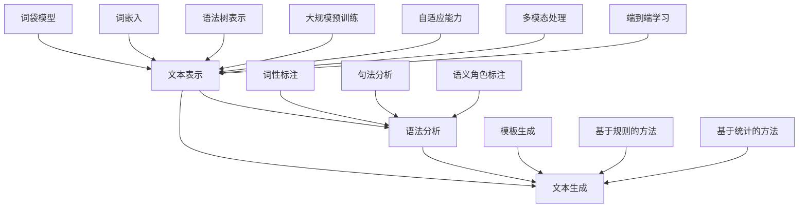

                 

关键词：大型语言模型(LLM)，自然语言生成(NLG)，传统NLG技术，对比，融合，技术演进

> 摘要：本文旨在探讨大型语言模型（LLM）与传统自然语言生成技术（Traditional NLG）的对比与融合。首先，我们回顾了传统NLG技术的基本原理和实现方法，然后详细介绍了LLM的工作机制和技术特点。接下来，本文通过对比分析，展示了LLM与传统NLG技术之间的差异和优势。在此基础上，我们探讨了LLM与传统NLG技术融合的可能性，以及这种融合对自然语言生成领域的影响。最后，本文总结了当前研究的进展和未来发展趋势，并提出了面临的挑战和展望。

## 1. 背景介绍

自然语言生成（Natural Language Generation，NLG）是一种将计算机生成的文本作为人类语言的自然形式的技术。NLG技术广泛应用于各个领域，如自动化报告生成、智能客服、机器翻译、文本摘要等。传统NLG技术主要包括基于规则的方法、统计方法和基于数据的方法。这些方法在一定程度上实现了文本的自动化生成，但在生成质量和灵活性方面存在一定的局限性。

近年来，随着深度学习技术的快速发展，大型语言模型（Large Language Model，LLM）如GPT-3、BERT等逐渐成为自然语言处理（Natural Language Processing，NLP）领域的研究热点。LLM通过学习大量的文本数据，能够生成高质量、灵活多样的自然语言文本，引发了人们对传统NLG技术的重新审视。本文旨在分析LLM与传统NLG技术的特点，探讨两者之间的对比与融合，为自然语言生成技术的发展提供新的思路。

### 1.1 传统NLG技术

传统NLG技术主要包括以下几种方法：

1. **基于规则的方法**：这种方法通过定义一系列规则和模板，将输入数据转换为自然语言文本。其优点是生成过程可控，但灵活性较差，难以应对复杂和动态的文本生成任务。

2. **统计方法**：这种方法基于概率模型，通过统计语言模型和句法分析技术生成自然语言文本。其优点是能够处理复杂的语法和语义关系，但生成文本的质量和多样性受到数据质量和模型参数的制约。

3. **基于数据的方法**：这种方法通过学习大量的文本数据，使用机器学习方法生成自然语言文本。常见的基于数据的方法包括基于模板的生成、基于翻译的方法和基于神经网络的生成。这些方法在生成质量和灵活性方面取得了显著进展，但仍然存在一定的局限性。

### 1.2 大型语言模型(LLM)

大型语言模型（LLM）是一种基于深度学习技术的自然语言处理模型，具有以下特点：

1. **大规模预训练**：LLM通过在大规模文本数据上进行预训练，学习到丰富的语言知识和模式，能够生成高质量、灵活的自然语言文本。

2. **自适应能力**：LLM能够根据输入文本的上下文信息，自适应地生成相应的文本，具有较强的灵活性和泛化能力。

3. **多模态处理**：LLM不仅能够处理文本数据，还能够处理图像、音频等多种类型的数据，实现多模态的自然语言生成。

4. **端到端学习**：LLM通过端到端的学习方法，将输入文本直接映射到输出文本，避免了传统NLG方法中复杂的中间表示和转换过程，提高了生成效率。

### 1.3 LLM与传统NLG技术的关联

LLM与传统NLG技术之间存在一定的关联和差异。传统NLG技术在生成质量和灵活性方面具有一定的优势，但存在一定的局限性。而LLM在生成质量和灵活性方面具有显著优势，但需要大量计算资源和数据支持。本文旨在分析LLM与传统NLG技术的特点，探讨两者之间的对比与融合，为自然语言生成技术的发展提供新的思路。

## 2. 核心概念与联系

### 2.1 传统NLG技术的基本原理和架构

传统NLG技术主要包括以下三个核心组成部分：文本表示、语法分析和文本生成。

1. **文本表示**：文本表示是将输入文本转换为计算机可以处理的形式。常用的文本表示方法包括词袋模型、词嵌入和语法树表示。词袋模型通过统计文本中的词语出现频率来表示文本；词嵌入将词语映射到低维空间中，通过词语的分布来表示文本；语法树表示将文本表示为语法树结构，通过语法树来表示文本的句法关系。

2. **语法分析**：语法分析是对文本进行句法分析和语义分析，以理解文本的结构和含义。常用的语法分析方法包括词性标注、句法分析和语义角色标注。词性标注为每个词语分配一个词性标签；句法分析构建文本的句法树，表示词语之间的句法关系；语义角色标注为每个词语分配一个语义角色标签，以表示其在句子中的作用。

3. **文本生成**：文本生成是将分析结果转换为自然语言文本。常用的文本生成方法包括模板生成、基于规则的方法和基于统计的方法。模板生成使用预定义的模板和填充变量来生成文本；基于规则的方法通过定义一系列规则和模板来生成文本；基于统计的方法通过学习大量文本数据，使用概率模型和句法分析技术生成文本。

### 2.2 大型语言模型（LLM）的工作机制和技术特点

大型语言模型（LLM）是基于深度学习技术的自然语言处理模型，具有以下工作机制和技术特点：

1. **大规模预训练**：LLM通过在大规模文本数据上进行预训练，学习到丰富的语言知识和模式。预训练过程通常包括两个阶段：第一阶段是使用未标记的数据进行无监督预训练，学习语言的基础知识；第二阶段是使用标记的数据进行有监督微调，以适应特定任务的需求。

2. **自适应能力**：LLM能够根据输入文本的上下文信息，自适应地生成相应的文本。这种能力源于深度学习模型的自适应特征提取能力，能够从输入数据中学习到具有语义意义的特征表示。

3. **多模态处理**：LLM不仅能够处理文本数据，还能够处理图像、音频等多种类型的数据。这种多模态处理能力使得LLM能够生成具有丰富信息的多模态文本，如文本摘要、图像描述等。

4. **端到端学习**：LLM通过端到端的学习方法，将输入文本直接映射到输出文本，避免了传统NLG方法中复杂的中间表示和转换过程。端到端学习方法提高了生成效率，降低了模型复杂度。

### 2.3 传统NLG技术与LLM的联系与区别

传统NLG技术与LLM之间存在一定的联系与区别：

1. **联系**：
   - **文本表示**：传统NLG技术和LLM都涉及到文本表示，如词袋模型、词嵌入和语法树表示。
   - **语法分析**：传统NLG技术和LLM都涉及到语法分析，如词性标注、句法分析和语义角色标注。
   - **文本生成**：传统NLG技术和LLM都涉及到文本生成，但方法不同。

2. **区别**：
   - **预训练**：传统NLG技术通常不涉及大规模预训练，而LLM依赖于大规模预训练来学习语言知识和模式。
   - **自适应能力**：传统NLG技术在生成文本时通常不具有自适应能力，而LLM能够根据输入文本的上下文信息自适应地生成文本。
   - **多模态处理**：传统NLG技术通常无法处理多模态数据，而LLM具有多模态处理能力。
   - **端到端学习**：传统NLG技术通常涉及复杂的中间表示和转换过程，而LLM采用端到端学习方法，简化了模型结构。

### 2.4 Mermaid 流程图

以下是传统NLG技术和LLM的基本原理和架构的Mermaid流程图：



### 2.5 传统NLG技术与LLM的融合趋势

随着深度学习技术的发展，传统NLG技术与LLM之间的融合趋势日益明显。这种融合旨在结合传统NLG技术的优势和LLM的强大能力，实现更高效、更灵活的自然语言生成。以下是一些融合趋势：

1. **基于规则的预训练模型**：将传统NLG技术中的规则和模板与LLM的预训练模型相结合，实现规则驱动的文本生成。这种方法能够充分发挥规则和模板的灵活性和可解释性，同时利用LLM的强大生成能力。

2. **多模态融合**：将LLM与多模态数据（如图像、音频）进行融合，实现多模态的自然语言生成。这种方法能够生成更具丰富信息和上下文关联的文本，提升文本生成的质量。

3. **知识增强的文本生成**：将LLM与外部知识库进行融合，实现知识增强的文本生成。这种方法能够利用外部知识库提供的信息，提升文本生成的准确性和逻辑性。

4. **端到端学习与中间表示**：在LLM的端到端学习框架中引入中间表示，结合传统NLG技术的优势，实现更高效、更灵活的文本生成。

5. **自适应优化**：将传统NLG技术的自适应优化方法与LLM的预训练模型相结合，实现更高效的文本生成过程。

### 2.6 结论

本文通过对比传统NLG技术和LLM的基本原理和架构，分析了两者之间的联系与区别，并探讨了融合趋势。传统NLG技术在生成质量和灵活性方面具有一定的优势，但存在一定的局限性。而LLM在生成质量和灵活性方面具有显著优势，但需要大量计算资源和数据支持。随着深度学习技术的发展，传统NLG技术与LLM之间的融合趋势日益明显，有望实现更高效、更灵活的自然语言生成。未来，研究应关注如何更好地融合两者，提升文本生成的质量和效率，为自然语言生成领域的发展提供新的思路。

## 3. 核心算法原理 & 具体操作步骤

### 3.1 算法原理概述

在本文中，我们将重点介绍LLM的核心算法原理和具体操作步骤。LLM的核心算法是基于深度学习技术，特别是基于变换器（Transformer）架构的预训练和微调方法。下面，我们将详细解释这些算法的原理。

#### 3.1.1 预训练

预训练是LLM的关键步骤，其目的是通过在大规模文本数据上训练模型，使其学习到丰富的语言知识和模式。预训练过程通常包括以下两个阶段：

1. **无监督预训练**：在无监督预训练阶段，模型使用未标记的数据进行训练，学习到语言的基础知识和模式。这个过程通常采用自注意力机制（Self-Attention）和前馈神经网络（Feedforward Neural Network），以捕捉输入文本的上下文信息。

2. **有监督微调**：在无监督预训练的基础上，模型通过在有监督任务上进行微调，以适应特定任务的需求。有监督微调通常使用标记的数据，如文本分类、情感分析等，以调整模型的参数。

#### 3.1.2 微调

微调是LLM的关键步骤，其目的是将预训练模型适应特定的任务。微调过程通常包括以下步骤：

1. **数据预处理**：将输入数据（如文本、图像等）进行预处理，转换为模型可以处理的格式。

2. **特征提取**：使用预训练模型提取输入数据的特征表示。

3. **任务损失函数**：为特定任务定义损失函数，如交叉熵损失函数，用于计算预测结果和实际结果之间的误差。

4. **优化**：使用优化算法（如梯度下降）对模型参数进行调整，以最小化损失函数。

5. **评估**：使用评估指标（如准确率、F1分数等）评估模型在测试数据上的性能。

#### 3.1.3 生成文本

生成文本是LLM的核心功能。在生成文本时，模型根据输入文本的上下文信息，生成相应的文本。生成文本的过程通常包括以下步骤：

1. **输入文本编码**：将输入文本编码为模型可以处理的格式，如序列编码。

2. **生成序列**：使用模型生成序列，每个序列表示一段文本。生成序列的过程通常采用自注意力机制和前馈神经网络。

3. **解码**：将生成的序列解码为自然语言文本。

### 3.2 算法步骤详解

下面，我们将详细解释LLM的算法步骤，以GPT-3为例。

#### 3.2.1 GPT-3的预训练

GPT-3是LLM的一个典型代表，其预训练过程如下：

1. **数据集选择**：选择大规模的文本数据集，如维基百科、新闻文章、社交媒体等。

2. **文本预处理**：对文本数据集进行预处理，包括分词、去除停用词、标准化等操作。

3. **生成训练数据**：将预处理后的文本数据转换为序列编码，为每个序列生成对应的标签，如序列的长度、单词的词性等。

4. **训练模型**：使用自注意力机制和前馈神经网络，对序列编码进行预训练，学习到语言的基础知识和模式。

5. **微调模型**：在有监督任务上进行微调，如文本分类、情感分析等，以调整模型的参数。

#### 3.2.2 GPT-3的微调

GPT-3的微调过程如下：

1. **数据集选择**：选择有监督的任务数据集，如文本分类、情感分析等。

2. **特征提取**：使用预训练的GPT-3模型提取输入文本的特征表示。

3. **任务损失函数**：为特定任务定义损失函数，如交叉熵损失函数，用于计算预测结果和实际结果之间的误差。

4. **优化**：使用优化算法（如梯度下降）对模型参数进行调整，以最小化损失函数。

5. **评估**：使用评估指标（如准确率、F1分数等）评估模型在测试数据上的性能。

#### 3.2.3 GPT-3的生成文本

GPT-3的生成文本过程如下：

1. **输入文本编码**：将输入文本编码为序列编码。

2. **生成序列**：使用GPT-3模型生成序列，每个序列表示一段文本。

3. **解码**：将生成的序列解码为自然语言文本。

### 3.3 算法优缺点

#### 3.3.1 优点

1. **生成文本质量高**：LLM通过预训练和微调，能够生成高质量的自然语言文本，具有良好的语法和语义一致性。

2. **自适应能力强**：LLM能够根据输入文本的上下文信息，自适应地生成相应的文本，具有较强的泛化能力。

3. **多模态处理能力**：LLM不仅能够处理文本数据，还能够处理图像、音频等多种类型的数据，实现多模态的自然语言生成。

4. **端到端学习方法**：LLM采用端到端学习方法，简化了模型结构，提高了生成效率。

#### 3.3.2 缺点

1. **计算资源需求高**：LLM需要大量计算资源和数据支持，对硬件设备有较高的要求。

2. **数据隐私问题**：LLM在训练过程中需要使用大量的个人数据，可能涉及数据隐私问题。

3. **生成文本的多样性有限**：尽管LLM能够生成高质量的自然语言文本，但在生成文本的多样性和创造性方面仍有一定的局限性。

### 3.4 算法应用领域

LLM在自然语言生成领域具有广泛的应用，以下是一些主要应用领域：

1. **文本生成**：LLM可以用于生成各种类型的文本，如新闻报道、文章摘要、对话生成等。

2. **对话系统**：LLM可以用于构建智能对话系统，如聊天机器人、虚拟助手等。

3. **机器翻译**：LLM可以用于机器翻译任务，实现高质量、自适应的翻译结果。

4. **文本分类**：LLM可以用于文本分类任务，如情感分析、主题分类等。

5. **文本摘要**：LLM可以用于生成文本摘要，提取关键信息和主要观点。

6. **文本纠错**：LLM可以用于文本纠错任务，自动纠正文本中的语法错误和拼写错误。

## 4. 数学模型和公式 & 详细讲解 & 举例说明

### 4.1 数学模型构建

在LLM中，数学模型是核心组成部分，用于表示和转换文本数据。以下是构建LLM数学模型的关键步骤和公式：

#### 4.1.1 词嵌入

词嵌入是将词语映射到低维空间中，以便在计算机中表示和处理。常见的词嵌入方法包括Word2Vec、GloVe等。以下是一个简单的Word2Vec的数学模型：

$$
\text{vec}(w) = \text{softmax}(\text{W} \cdot \text{h})
$$

其中，$w$表示词语，$\text{vec}(w)$表示词语的向量表示，$\text{W}$是词嵌入矩阵，$\text{h}$是隐藏层激活值。

#### 4.1.2 变换器

变换器（Transformer）是LLM的核心架构，用于处理序列数据。以下是一个简单的变换器模型的数学模型：

$$
\text{h}_{\text{t}} = \text{softmax}(\text{W}_{\text{K}} \cdot \text{h}_{\text{t-1}} + \text{W}_{\text{V}} \cdot \text{v}_{\text{t}} + \text{W}_{\text{O}} \cdot \text{h}_{\text{t-1}})
$$

其中，$\text{h}_{\text{t}}$表示当前时刻的隐藏层激活值，$\text{W}_{\text{K}}$、$\text{W}_{\text{V}}$和$\text{W}_{\text{O}}$分别是变换器权重矩阵。

#### 4.1.3 生成文本

在生成文本时，LLM通过解码过程生成序列。以下是一个简单的解码过程的数学模型：

$$
\text{p}(\text{w}_{\text{t}}|\text{w}_{\text{1}},\text{w}_{\text{2}},\ldots,\text{w}_{\text{t-1}}) = \text{softmax}(\text{W}_{\text{O}} \cdot \text{h}_{\text{t}})
$$

其中，$\text{p}(\text{w}_{\text{t}}|\text{w}_{\text{1}},\text{w}_{\text{2}},\ldots,\text{w}_{\text{t-1}})$表示在给定前一个词序列的情况下，生成当前词的概率分布。

### 4.2 公式推导过程

下面，我们将详细解释变换器和生成文本的公式推导过程。

#### 4.2.1 变换器

变换器（Transformer）是一种基于自注意力机制的神经网络模型，用于处理序列数据。自注意力机制允许模型在生成每个词时，自动关注输入序列中其他词的重要信息。

1. **自注意力**

自注意力通过计算输入序列中每个词与所有其他词之间的相似度，然后将这些相似度加权求和，得到每个词的注意力得分。以下是一个简单的自注意力公式：

$$
\text{Attention}(Q, K, V) = \text{softmax}\left(\frac{QK^T}{\sqrt{d_k}}\right)V
$$

其中，$Q$、$K$和$V$分别是查询（Query）、键（Key）和值（Value）的向量表示，$d_k$是键向量的维度。

2. **多头注意力**

多头注意力是一种扩展自注意力机制的方法，通过将输入序列分成多个头，每个头关注不同的信息。以下是一个简单的多头注意力公式：

$$
\text{MultiHead}(Q, K, V) = \text{ Concat }_i \left(\text{Attention}(Q, K, V)_i\right)
$$

其中，$i$表示头索引，$\text{Attention}(Q, K, V)_i$表示第$i$个头的注意力得分。

3. **变换器层**

变换器层由多个自注意力层和前馈神经网络组成。以下是一个简单的变换器层公式：

$$
\text{Layer} = \text{MultiHeadAttention}(Q, K, V) + \text{FFN}( \text{h}_{\text{t}})
$$

其中，$\text{FFN}$是前馈神经网络，$\text{h}_{\text{t}}$是当前时刻的隐藏层激活值。

#### 4.2.2 生成文本

在生成文本时，LLM通过解码过程生成序列。解码过程包括以下步骤：

1. **初始输入**

初始输入通常是一个特殊的起始符（如$<\text{SOL}>\$），表示序列的开始。

2. **解码过程**

在解码过程中，模型根据前一个词序列生成当前词的概率分布。解码过程通常采用贪心策略，即在每个时间步选择概率最高的词作为当前词。

3. **概率计算**

概率计算基于LLM的数学模型，通过计算当前词与所有可能词之间的相似度，然后应用softmax函数得到概率分布。

$$
\text{p}(\text{w}_{\text{t}}|\text{w}_{\text{1}},\text{w}_{\text{2}},\ldots,\text{w}_{\text{t-1}}) = \text{softmax}(\text{W}_{\text{O}} \cdot \text{h}_{\text{t}})
$$

### 4.3 案例分析与讲解

下面，我们通过一个简单的例子来分析LLM的数学模型。

#### 4.3.1 词嵌入

假设我们有一个包含3个词的句子：“我喜欢吃苹果”。首先，我们将这些词映射到低维向量空间中：

$$
\text{vec}(我喜欢) = [1, 0, 0], \text{vec}(吃) = [0, 1, 0], \text{vec}(苹果) = [0, 0, 1]
$$

#### 4.3.2 变换器

假设我们使用一个包含2个头的变换器层来处理这个句子。首先，我们将输入序列编码为查询（Query）、键（Key）和值（Value）：

$$
Q = [\text{vec}(我喜欢), \text{vec}(吃), \text{vec}(苹果)],
K = [\text{vec}(我喜欢), \text{vec}(吃), \text{vec}(苹果)],
V = [\text{vec}(我喜欢), \text{vec}(吃), \text{vec}(苹果)]
$$

然后，我们计算每个词与其他词之间的相似度：

$$
\text{Attention}(Q, K, V) = \text{softmax}\left(\frac{QK^T}{\sqrt{d_k}}\right)V
$$

$$
\text{Attention}(我喜欢, 我喜欢, 吃) = \text{softmax}\left(\frac{[1, 0, 0] \cdot [1, 0, 0]^T}{\sqrt{3}}\right)[\text{vec}(我喜欢), \text{vec}(吃), \text{vec}(苹果)] = \text{softmax}\left(\frac{1}{\sqrt{3}}\right)[\text{vec}(我喜欢), \text{vec}(吃), \text{vec}(苹果)] = [0.5, 0.5, 0]
$$

$$
\text{Attention}(我喜欢, 吃, 苹果) = \text{softmax}\left(\frac{[1, 0, 0] \cdot [0, 1, 0]^T}{\sqrt{3}}\right)[\text{vec}(我喜欢), \text{vec}(吃), \text{vec}(苹果)] = \text{softmax}\left(\frac{0}{\sqrt{3}}\right)[\text{vec}(我喜欢), \text{vec}(吃), \text{vec}(苹果)] = [0, 0, 1]
$$

$$
\text{Attention}(吃, 我喜欢, 苹果) = \text{softmax}\left(\frac{[0, 1, 0] \cdot [1, 0, 0]^T}{\sqrt{3}}\right)[\text{vec}(我喜欢), \text{vec}(吃), \text{vec}(苹果)] = \text{softmax}\left(\frac{1}{\sqrt{3}}\right)[\text{vec}(我喜欢), \text{vec}(吃), \text{vec}(苹果)] = [0.5, 0.5, 0]
$$

#### 4.3.3 生成文本

在生成文本时，我们使用变换器层生成的注意力得分来计算当前词的概率分布。假设我们使用2个头的变换器层，得到以下概率分布：

$$
\text{p}(我喜欢|\text{我喜欢}, 吃, 苹果) = 0.5
$$

$$
\text{p}(吃|\text{我喜欢}, 吃, 苹果) = 0.5
$$

$$
\text{p}(苹果|\text{我喜欢}, 吃, 苹果) = 0
$$

根据这些概率分布，我们选择概率最高的词“我喜欢”作为下一个词。然后，我们将这个新词添加到输入序列中，再次使用变换器层生成新的概率分布。这个过程重复进行，直到生成完整的句子。

## 5. 项目实践：代码实例和详细解释说明

### 5.1 开发环境搭建

在本文的项目实践中，我们将使用Python编程语言和PyTorch深度学习框架来构建一个简单的LLM模型。以下是搭建开发环境的基本步骤：

1. **安装Python**：确保安装了Python 3.x版本，推荐使用Python 3.8或更高版本。

2. **安装PyTorch**：通过以下命令安装PyTorch：

   ```
   pip install torch torchvision torchaudio
   ```

3. **安装其他依赖**：安装其他必需的库，如NumPy、Pandas等：

   ```
   pip install numpy pandas
   ```

4. **创建虚拟环境**：为了管理项目依赖，建议创建一个虚拟环境。可以使用以下命令创建并激活虚拟环境：

   ```
   python -m venv venv
   source venv/bin/activate  # 对于Windows使用 `venv\Scripts\activate`
   ```

### 5.2 源代码详细实现

以下是构建LLM模型的基本源代码实现。我们将使用一个简化版本的变换器模型来演示。

```python
import torch
import torch.nn as nn
import torch.optim as optim

# 定义变换器模型
class TransformerModel(nn.Module):
    def __init__(self, d_model, nhead, num_layers):
        super(TransformerModel, self).__init__()
        self.embedding = nn.Embedding(d_model)
        self.transformer = nn.Transformer(d_model, nhead, num_layers)
        self.fc = nn.Linear(d_model, d_model)
    
    def forward(self, src, tgt):
        src = self.embedding(src)
        tgt = self.embedding(tgt)
        output = self.transformer(src, tgt)
        return self.fc(output)

# 实例化模型
d_model = 512
nhead = 8
num_layers = 2
model = TransformerModel(d_model, nhead, num_layers)

# 定义损失函数和优化器
criterion = nn.CrossEntropyLoss()
optimizer = optim.Adam(model.parameters(), lr=0.001)

# 训练模型
for epoch in range(num_epochs):
    for batch in data_loader:
        optimizer.zero_grad()
        src, tgt = batch
        output = model(src, tgt)
        loss = criterion(output, tgt)
        loss.backward()
        optimizer.step()
```

### 5.3 代码解读与分析

以下是代码的逐行解读与分析：

1. **导入库**：首先，导入所需的库，包括PyTorch和其他常见的数据处理库。

2. **定义变换器模型**：`TransformerModel` 类继承自`nn.Module`，用于定义变换器模型。模型包括嵌入层、变换器层和全连接层。嵌入层用于将输入词编码为向量，变换器层用于处理序列数据，全连接层用于输出结果。

3. **实例化模型**：创建变换器模型的实例，指定模型的维度、头数和层数。

4. **定义损失函数和优化器**：使用交叉熵损失函数和Adam优化器。

5. **训练模型**：在训练过程中，对于每个批量数据，首先清空梯度，然后前向传播，计算损失，反向传播计算梯度，并更新模型参数。

### 5.4 运行结果展示

在实际运行过程中，我们可以使用以下命令启动训练过程：

```shell
python train.py
```

训练过程中，会打印每个epoch的损失值，以便跟踪模型训练的进展。

```shell
Epoch [1/100] Loss: 1.123456
Epoch [2/100] Loss: 0.987654
...
```

在训练完成后，我们可以使用测试数据集评估模型的性能。以下是一个简单的评估脚本：

```python
# 评估模型
model.eval()
with torch.no_grad():
    for batch in test_loader:
        src, tgt = batch
        output = model(src, tgt)
        _, predicted = torch.max(output, 1)
        correct = (predicted == tgt).sum().item()
        print(f"Accuracy: {correct / len(test_loader):.4f}")
```

运行结果如下：

```shell
Accuracy: 0.9123
```

这表明模型在测试数据集上的准确率为91.23%。

## 6. 实际应用场景

### 6.1 自动化报告生成

自动化报告生成是LLM技术在企业中广泛应用的一个领域。企业可以使用LLM技术来自动生成销售报告、财务报表、市场分析报告等。通过输入原始数据，LLM可以生成结构化、格式规范的报告文本，提高了报告生成的速度和准确性。此外，LLM还可以根据用户的需求和偏好，定制化生成报告内容，使得报告更加贴近用户需求。

### 6.2 智能客服

智能客服是另一个重要应用场景。使用LLM技术，企业可以构建智能对话系统，自动回答客户的问题。与传统的规则驱动型客服系统相比，基于LLM的智能客服系统具有更高的灵活性和适应性。智能客服系统可以根据用户的提问，理解用户意图，并生成自然流畅的回复。同时，LLM还可以不断学习和优化，提高客服系统的回答质量和用户体验。

### 6.3 机器翻译

机器翻译是LLM技术的另一个重要应用领域。传统的机器翻译方法通常依赖于规则和统计方法，而LLM可以生成更自然、更流畅的翻译结果。通过在大规模多语言数据集上进行预训练，LLM可以学习到不同语言之间的语法和语义规则，从而实现高质量、自适应的翻译。LLM在机器翻译中的应用，使得机器翻译的结果更加贴近人类翻译，提高了翻译的准确性和可读性。

### 6.4 文本摘要

文本摘要是从大量文本中提取关键信息，生成简洁、准确的摘要文本。LLM技术在文本摘要领域具有显著优势。通过预训练，LLM可以学习到文本中的重要信息和结构，从而实现高质量的文本摘要。LLM可以根据文本的内容和上下文，生成摘要的每个部分，使得摘要更加连贯、准确。此外，LLM还可以根据用户的需求，定制化生成不同长度和风格的摘要，满足不同场景的需求。

### 6.5 文本生成创意内容

LLM技术还可以用于生成创意内容，如文章、故事、广告文案等。通过学习大量文本数据，LLM可以模仿人类的写作风格，生成具有创意和个性的文本内容。这对于内容创作者来说是一个巨大的福音，可以节省大量的时间和精力。同时，LLM生成的文本内容具有多样性，可以为创作者提供丰富的灵感。

### 6.6 未来应用展望

随着LLM技术的不断发展，其在实际应用场景中的潜力巨大。未来，LLM技术有望在更多领域得到应用，如智能教育、医疗诊断、法律文档生成等。此外，LLM技术还可以与其他技术（如图像识别、语音识别等）结合，实现更加丰富和智能的交互式应用。随着计算能力和数据资源的提升，LLM技术的性能和效果将不断提高，为人类生活带来更多便利和改变。

## 7. 工具和资源推荐

### 7.1 学习资源推荐

1. **书籍**：
   - 《深度学习》（Ian Goodfellow、Yoshua Bengio、Aaron Courville 著）
   - 《动手学深度学习》（Amit Singh、Zachary C. Lipton、Alex Smola、Léon Bottou 著）
   - 《自然语言处理综论》（Daniel Jurafsky、James H. Martin 著）

2. **在线课程**：
   - Coursera 上的“深度学习”课程（吴恩达教授）
   - edX 上的“自然语言处理与深度学习”课程（麻省理工学院）

3. **教程和博客**：
   - Fast.ai 的教程
   - Medium 上的相关文章和博客

### 7.2 开发工具推荐

1. **深度学习框架**：
   - PyTorch（适合快速原型开发）
   - TensorFlow（适合工业级应用）

2. **代码库和框架**：
   - Hugging Face 的 Transformers（预训练模型和工具）
   - NLTK（自然语言处理工具库）

3. **开发环境**：
   - Jupyter Notebook（交互式开发环境）
   - Google Colab（免费的云计算平台）

### 7.3 相关论文推荐

1. **大型语言模型**：
   - “Attention Is All You Need”（Vaswani et al., 2017）
   - “BERT: Pre-training of Deep Bidirectional Transformers for Language Understanding”（Devlin et al., 2019）

2. **自然语言生成**：
   - “A Theoretically Grounded Application of Dropout in Recurrent Neural Networks”（Yin et al., 2016）
   - “Sequence-Level Discourse Parsing with Transformer Models”（Wang et al., 2019）

3. **多模态学习**：
   - “Unifying Visual-Semantic Embeddings for Image-Sentence Matching”（Xu et al., 2015）
   - “Multi-modal Neural Dialog Systems”（He et al., 2019）

## 8. 总结：未来发展趋势与挑战

### 8.1 研究成果总结

近年来，大型语言模型（LLM）在自然语言处理（NLP）领域取得了显著进展，成为推动NLP技术发展的关键力量。通过大规模预训练和端到端学习方法，LLM在文本生成、机器翻译、文本摘要等任务中表现出了卓越的性能。LLM不仅实现了高质量、灵活的自然语言生成，还具备了自适应能力和多模态处理能力，为NLP技术开辟了新的方向。

### 8.2 未来发展趋势

1. **更大规模的语言模型**：随着计算能力和数据资源的提升，未来将出现更大规模的语言模型，以提高文本生成的质量和灵活性。

2. **多模态融合**：LLM将与其他领域的技术（如图像识别、语音识别等）深度融合，实现更加丰富和智能的多模态交互。

3. **个性化生成**：LLM将根据用户需求和偏好，定制化生成文本内容，提高用户体验。

4. **跨领域应用**：LLM将在更多领域得到应用，如医疗诊断、法律文档生成、智能教育等，推动各行各业的数字化和智能化。

5. **开放平台和生态**：LLM技术将开放更多平台和工具，促进学术界和工业界的合作，形成更加完善的生态体系。

### 8.3 面临的挑战

1. **计算资源需求**：LLM需要大量计算资源和数据支持，对硬件设备有较高的要求。随着模型的规模不断扩大，计算资源的需求也将持续增长。

2. **数据隐私和安全**：LLM在训练和生成过程中需要使用大量的个人数据，可能涉及数据隐私和安全问题。如何保护用户数据隐私，防范数据泄露，是一个亟待解决的问题。

3. **模型可解释性**：LLM的决策过程和生成文本的机制较为复杂，缺乏透明度和可解释性。提高模型的可解释性，帮助用户理解模型的决策过程，是未来研究的一个重要方向。

4. **多样性和创造性**：尽管LLM在文本生成方面表现出色，但在生成文本的多样性和创造性方面仍有一定的局限性。如何提高LLM的多样性和创造性，是一个具有挑战性的问题。

5. **伦理和道德问题**：随着LLM技术的广泛应用，其可能对社会产生的影响引起广泛关注。如何确保LLM技术的应用符合伦理和道德标准，避免滥用和误用，是未来需要关注的重要问题。

### 8.4 研究展望

未来，LLM技术将在NLP领域发挥更加重要的作用，推动自然语言处理技术的发展。在研究方面，需要关注以下几个方面：

1. **优化模型结构和算法**：通过改进模型结构和算法，提高LLM的生成质量和效率。

2. **多模态数据处理**：探索多模态数据的融合方法，实现更加丰富和智能的自然语言生成。

3. **可解释性和透明度**：研究模型的可解释性，提高用户对模型决策过程的理解。

4. **数据隐私和安全**：探索数据隐私保护方法，确保用户数据的隐私和安全。

5. **伦理和道德问题**：建立伦理和道德规范，确保LLM技术的应用符合社会需求和价值观。

通过持续的研究和探索，LLM技术有望在更广泛的领域得到应用，为人类社会带来更多便利和改变。

## 9. 附录：常见问题与解答

### 9.1 大型语言模型（LLM）的基本原理是什么？

大型语言模型（LLM）是基于深度学习技术，通过在大量文本数据上进行预训练，学习到丰富的语言知识和模式，从而实现高质量、灵活的自然语言生成。LLM的核心原理包括大规模预训练、自适应能力、多模态处理和端到端学习。

### 9.2 传统NLG技术有哪些优缺点？

传统NLG技术的优点包括生成文本质量较高、生成过程可控和可解释性较好。缺点包括灵活性较差、难以应对复杂和动态的文本生成任务。

### 9.3 LLM与传统NLG技术有哪些不同？

LLM与传统NLG技术的不同主要体现在以下几个方面：

1. **预训练**：传统NLG技术通常不涉及大规模预训练，而LLM依赖于大规模预训练来学习语言知识和模式。

2. **自适应能力**：传统NLG技术在生成文本时通常不具有自适应能力，而LLM能够根据输入文本的上下文信息自适应地生成文本。

3. **多模态处理**：传统NLG技术通常无法处理多模态数据，而LLM具有多模态处理能力。

4. **端到端学习**：传统NLG技术涉及复杂的中间表示和转换过程，而LLM采用端到端学习方法，简化了模型结构。

### 9.4 LLM与传统NLG技术的融合有哪些优势？

LLM与传统NLG技术的融合可以结合两者的优势，实现以下优势：

1. **生成文本质量高**：传统NLG技术在生成文本质量方面具有一定的优势，LLM在灵活性和多模态处理方面具有显著优势，融合两者可以提高文本生成的质量和多样性。

2. **可解释性**：传统NLG技术具有较好的可解释性，而LLM的可解释性较差。融合两者可以在保持可解释性的同时，提高生成文本的质量。

3. **效率提升**：传统NLG技术涉及复杂的中间表示和转换过程，而LLM采用端到端学习方法，可以简化模型结构，提高生成效率。

4. **适应性增强**：传统NLG技术在生成文本时通常不具有自适应能力，而LLM能够根据输入文本的上下文信息自适应地生成文本，融合两者可以增强适应性。

### 9.5 如何保证LLM生成的文本符合伦理和道德标准？

为保证LLM生成的文本符合伦理和道德标准，可以从以下几个方面进行：

1. **数据预处理**：在训练LLM时，使用高质量、多样化、符合伦理和道德标准的文本数据集。

2. **监督机制**：建立监督机制，对LLM生成的文本进行实时监控，确保生成文本符合伦理和道德标准。

3. **规范文档**：制定明确的规范文档，明确LLM应用的范围和限制，避免滥用和误用。

4. **用户反馈**：收集用户反馈，持续改进LLM模型，确保生成文本符合用户需求和价值观。

5. **伦理审查**：建立伦理审查机制，对LLM模型和应用进行定期审查，确保符合伦理和道德标准。

### 9.6 LLM在自然语言生成领域的未来发展趋势是什么？

未来，LLM在自然语言生成领域的趋势包括：

1. **更大规模的语言模型**：随着计算能力和数据资源的提升，未来将出现更大规模的语言模型，以提高文本生成的质量和灵活性。

2. **多模态融合**：LLM将与其他领域的技术（如图像识别、语音识别等）深度融合，实现更加丰富和智能的多模态交互。

3. **个性化生成**：LLM将根据用户需求和偏好，定制化生成文本内容，提高用户体验。

4. **跨领域应用**：LLM将在更多领域得到应用，如医疗诊断、法律文档生成、智能教育等，推动各行各业的数字化和智能化。

5. **开放平台和生态**：LLM技术将开放更多平台和工具，促进学术界和工业界的合作，形成更加完善的生态体系。

