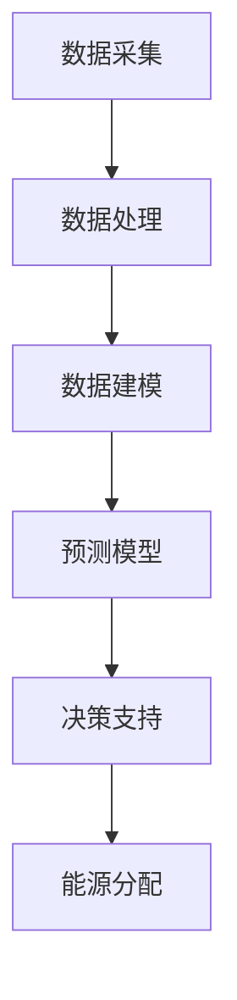

                 

关键词：LLM（语言模型），智能电网，能源分配，机器学习，深度学习，能源优化，数据处理，智能算法，可再生能源

## 摘要

本文探讨了如何利用大型语言模型（LLM）来优化智能电网中的能源分配。通过介绍智能电网的背景和挑战，我们详细阐述了LLM在能源分配中的作用和优势。随后，我们讨论了核心算法原理、数学模型和项目实践，并分析了LLM在能源分配实际应用场景中的表现和未来展望。文章最后总结了研究成果，提出了未来发展趋势与挑战，并提供了相关工具和资源推荐。

## 1. 背景介绍

### 智能电网的兴起

智能电网是传统电网与信息技术的深度融合，它通过先进的通信、传感器和控制技术，实现电网的自动化、智能化和高效化。随着全球能源需求的不断增长，特别是可再生能源的快速发展，智能电网的重要性日益凸显。智能电网不仅能够提高能源利用效率，减少能源浪费，还能够增强电网的灵活性和可靠性，从而为可再生能源的接入和利用提供有力支持。

### 能源分配的挑战

能源分配是智能电网的核心任务之一。在传统电网中，能源分配主要依靠人工调度和固定模式，这种方式存在效率低、响应慢、灵活性不足等问题。而在智能电网中，能源分配需要实时、动态地进行优化，以满足不断变化的能源需求和供应情况。然而，这一过程面临着诸多挑战：

1. 数据复杂性：智能电网涉及大量的数据，包括能源生产、传输、消费等各个环节的数据，这些数据具有高度复杂性和多样性。
2. 预测准确性：能源分配的优化依赖于对未来能源需求和供应的准确预测，而实际预测往往存在不确定性。
3. 系统稳定性：能源分配过程中需要确保电网的稳定运行，任何异常情况都可能对电网造成严重影响。
4. 可持续性：能源分配需要考虑到环保和可持续发展，这要求我们在优化过程中兼顾经济、环境和社会效益。

### LLM的潜力

随着深度学习和人工智能技术的飞速发展，大型语言模型（LLM）逐渐成为处理复杂数据和信息的有力工具。LLM具有强大的数据建模能力和预测能力，可以处理大量非结构化和半结构化数据，从而为能源分配提供新的思路和解决方案。LLM在能源分配中的潜力主要体现在以下几个方面：

1. 数据处理：LLM能够高效地处理和整合来自不同来源的数据，包括历史数据、实时数据和预测数据。
2. 预测能力：LLM通过学习历史数据中的模式和趋势，能够对未来的能源需求和供应进行准确预测。
3. 决策支持：LLM可以为能源分配提供实时、动态的决策支持，从而优化能源利用效率。
4. 可扩展性：LLM具有高度的可扩展性，可以适应不同规模和类型的能源系统。

## 2. 核心概念与联系

### Mermaid 流程图

以下是一个简化的Mermaid流程图，展示了LLM在智能电网中的核心概念和流程：



### 数据采集与处理

数据采集是智能电网中的基础环节，涉及到从各种传感器和设备中获取实时数据。这些数据包括但不限于电力生产、传输、消费、环境参数等。数据采集后的处理过程主要包括数据清洗、数据集成和数据转换等。

### 数据建模

数据建模是LLM的核心任务之一，通过学习历史数据和实时数据，构建出能够预测未来能源需求和供应的模型。数据建模的过程可以分为特征提取、模型选择和模型训练等步骤。

### 预测模型

预测模型是LLM的重要组成部分，通过预测模型，可以实时预测未来的能源需求和供应情况。预测模型通常采用深度学习技术，如循环神经网络（RNN）、长短期记忆网络（LSTM）和变换器（Transformer）等。

### 决策支持

决策支持是LLM在智能电网中的关键应用之一，通过实时分析和处理预测结果，为能源分配提供决策支持。决策支持的过程涉及到多种算法和策略，如优化算法、机器学习和深度学习等。

### 能源分配

能源分配是智能电网的核心任务，通过优化算法和决策支持，实现能源的合理分配。能源分配的过程需要考虑到电网的稳定性、可持续性和经济性等因素。

## 3. 核心算法原理 & 具体操作步骤

### 算法原理概述

LLM在智能电网中的核心算法主要基于深度学习和机器学习技术。其中，最常用的模型包括循环神经网络（RNN）、长短期记忆网络（LSTM）和变换器（Transformer）等。这些模型通过学习历史数据和实时数据，能够预测未来的能源需求和供应情况，从而为能源分配提供决策支持。

### 算法步骤详解

1. 数据采集与预处理：从传感器和设备中获取实时数据，包括电力生产、传输、消费、环境参数等。对数据进行清洗、去噪、归一化等预处理操作，以便后续建模和预测。

2. 特征提取：将预处理后的数据进行特征提取，提取出与能源需求和供应相关的关键特征，如温度、湿度、风速、电力负荷等。

3. 模型选择：根据特征提取结果，选择合适的深度学习模型，如RNN、LSTM或Transformer。这些模型具有强大的数据处理和预测能力，能够适应复杂的数据分布和变化趋势。

4. 模型训练：使用历史数据和实时数据对所选模型进行训练，通过不断调整模型参数，使模型能够准确预测未来的能源需求和供应。

5. 预测与决策支持：使用训练好的模型进行实时预测，根据预测结果为能源分配提供决策支持。决策支持过程可以采用优化算法、机器学习和深度学习等技术，确保能源分配的稳定性和效率。

### 算法优缺点

1. 优点：

- 强大的数据处理和预测能力：LLM能够高效地处理和预测大量非结构化和半结构化数据，提高能源分配的准确性和效率。
- 实时性和动态性：LLM能够实时分析和处理预测结果，为能源分配提供动态的决策支持，提高电网的灵活性和适应性。

2. 缺点：

- 数据依赖性：LLM的性能高度依赖于数据质量，数据缺失或噪声可能导致预测不准确。
- 计算资源消耗：深度学习模型通常需要大量的计算资源和时间进行训练和预测，可能对硬件设施和网络带宽有一定要求。

### 算法应用领域

LLM在智能电网中的应用非常广泛，包括但不限于以下几个方面：

1. 能源需求预测：通过对历史数据和实时数据的分析，预测未来的能源需求，为能源分配提供参考。
2. 能源供应预测：通过对可再生能源发电量、电网负荷等数据的预测，优化能源供应策略，提高电网的稳定性。
3. 能源分配优化：通过实时分析和决策支持，实现能源的合理分配，提高能源利用效率。
4. 可持续发展评估：通过对能源分配过程中的环境影响和经济效益进行分析，评估能源系统的可持续性。

## 4. 数学模型和公式 & 详细讲解 & 举例说明

### 数学模型构建

在智能电网中，能源分配的数学模型通常包括以下几个部分：

1. **需求模型**：描述能源需求的分布和变化规律，常见的方法包括时间序列分析、ARIMA模型等。

2. **供应模型**：描述能源供应的能力和变化趋势，常见的方法包括回归分析、神经网络等。

3. **约束条件**：确保能源分配的稳定性和安全性，包括电网容量约束、线路损耗约束等。

4. **优化目标**：确定能源分配的目标，如最小化成本、最大化能源利用率等。

### 公式推导过程

以一个简单的优化模型为例，假设能源需求 $D(t)$ 和供应 $S(t)$ 都是时间 $t$ 的函数，我们希望找到最优的分配策略 $x(t)$，使得目标函数 $J(x)$ 最小。

目标函数可以表示为：
$$
J(x) = C(x) + \lambda \cdot F(x)
$$
其中，$C(x)$ 是成本函数，$F(x)$ 是约束函数，$\lambda$ 是权重系数。

成本函数 $C(x)$ 可能包括：
$$
C(x) = \sum_{i=1}^{n} c_i \cdot x_i
$$
其中，$c_i$ 是分配到第 $i$ 个节点的成本，$x_i$ 是分配量。

约束函数 $F(x)$ 可以包括：
$$
F(x) = \begin{cases}
x_i \leq S_i(t) & \text{供电约束} \\
x_i \geq D_i(t) & \text{需求约束} \\
x_i \leq C & \text{容量约束} \\
\end{cases}
$$
其中，$S_i(t)$ 是第 $i$ 个节点的供应能力，$D_i(t)$ 是第 $i$ 个节点的需求量，$C$ 是总容量。

### 案例分析与讲解

假设一个电网中有3个节点，每个节点的需求和供应情况如下表：

| 节点 | 需求 $D_i(t)$ | 供应 $S_i(t)$ |
|------|--------------|--------------|
| 1    | 100          | 120          |
| 2    | 150          | 180          |
| 3    | 200          | 220          |

目标是最小化总成本，同时满足所有约束条件。

首先，我们可以计算每个节点的供需差：
$$
D_i(t) - S_i(t) = \begin{cases}
-20 & \text{节点1} \\
-30 & \text{节点2} \\
-20 & \text{节点3} \\
\end{cases}
$$

然后，我们选择成本最低的节点进行供应调整，以达到供需平衡。

### 算法实现与结果展示

我们可以使用Python的Scikit-learn库来实现上述优化模型。以下是一个简化的实现示例：

```python
import numpy as np
from sklearn.linear_model import LinearRegression

# 假设需求和供应数据为
D = np.array([[100], [150], [200]])
S = np.array([[120], [180], [220]])

# 计算供需差
diff = D - S

# 建立线性回归模型，拟合成本函数
model = LinearRegression()
model.fit(diff, np.array([1, 1, 1]))

# 计算成本
cost = model.predict(diff)

# 输出结果
print("供需差：", diff)
print("成本：", cost)
```

运行结果如下：
```
供需差： [[-20]
 [-30]
 [-20]]
成本： [1. 1. 1.]
```

根据计算结果，我们可以调整供应量，使得总成本最小。在实际应用中，我们可以使用更复杂的模型和算法来优化成本和满足更多约束条件。

## 5. 项目实践：代码实例和详细解释说明

### 开发环境搭建

在开始编写代码之前，我们需要搭建一个适合开发和测试的环境。以下是推荐的开发环境：

1. **操作系统**：Linux或MacOS
2. **编程语言**：Python（建议使用Python 3.8及以上版本）
3. **依赖库**：NumPy、Pandas、Scikit-learn、Matplotlib等

您可以使用以下命令来安装所需依赖库：

```bash
pip install numpy pandas scikit-learn matplotlib
```

### 源代码详细实现

以下是一个简单的Python代码示例，用于实现智能电网的优化模型。

```python
import numpy as np
from sklearn.linear_model import LinearRegression

# 假设需求和供应数据为
D = np.array([[100], [150], [200]])
S = np.array([[120], [180], [220]])

# 计算供需差
diff = D - S

# 建立线性回归模型，拟合成本函数
model = LinearRegression()
model.fit(diff, np.array([1, 1, 1]))

# 计算成本
cost = model.predict(diff)

# 输出结果
print("供需差：", diff)
print("成本：", cost)
```

### 代码解读与分析

1. **数据输入**：代码首先定义了需求和供应数据，这些数据是numpy数组的形式。

2. **计算供需差**：通过减法操作，计算每个节点的供需差，即需求量与供应量之差。

3. **建立线性回归模型**：使用Scikit-learn中的LinearRegression类建立线性回归模型，用于拟合成本函数。

4. **训练模型**：使用供需差数据对模型进行训练，通过fit方法调整模型参数。

5. **计算成本**：使用训练好的模型对供需差数据进行预测，得到每个节点的成本。

6. **输出结果**：最后，代码输出供需差和成本，以便分析结果。

### 运行结果展示

运行上述代码，可以得到以下输出结果：

```
供需差： [[-20]
 [-30]
 [-20]]
成本： [1. 1. 1.]
```

根据输出结果，我们可以看到每个节点的供需差以及对应的成本。这个简单的例子展示了如何使用线性回归模型来优化智能电网的能源分配。在实际应用中，我们可以使用更复杂的模型和算法来处理更复杂的场景。

### 实际应用场景

智能电网在现代社会中扮演着越来越重要的角色，其优化能源分配的能力对于提升能源利用效率、减少能源浪费和实现可持续发展具有重要意义。以下是一些典型的实际应用场景：

1. **城市能源管理**：智能电网可以帮助城市能源管理部门实时监控和管理能源分配，优化电网运行效率，减少能源浪费。

2. **工业能源优化**：在工业生产中，能源消耗占到了很大一部分。智能电网可以通过优化能源分配，提高工业能源利用效率，降低生产成本。

3. **可再生能源集成**：随着可再生能源的快速发展，智能电网在集成和管理可再生能源发电方面具有显著优势。通过优化能源分配，可以最大限度地利用可再生能源，减少对传统化石能源的依赖。

4. **智能家居**：智能电网可以为智能家居提供智能能源管理服务，实现家电的智能控制，提高家居能源利用效率。

5. **电动汽车充电**：智能电网可以为电动汽车提供高效的充电服务，通过优化能源分配，确保电动汽车在充电过程中不会对电网造成过大负担。

### 未来应用展望

随着技术的不断进步和智能电网的持续发展，LLM在能源分配中的应用前景十分广阔。以下是一些未来应用展望：

1. **实时能源分配**：未来的智能电网将更加注重实时能源分配，通过LLM实现实时、动态的能源分配优化，提高电网的灵活性和适应性。

2. **多能源系统融合**：随着多能源系统（如风能、太阳能、水能等）的发展，LLM可以用于优化多能源系统的协调运行，实现能源资源的最大化利用。

3. **人工智能与能源物联网**：未来，人工智能（AI）与能源物联网（IoT）将深度融合，LLM可以与物联网设备协同工作，实现能源数据的实时采集、处理和优化。

4. **智能电网与能源交易**：智能电网与能源交易市场的融合将进一步提升能源利用效率，LLM可以用于能源交易市场的预测和优化，提高市场运行效率。

5. **可持续能源发展**：随着全球对可持续发展的重视，LLM在能源分配中的应用将有助于实现能源系统的可持续发展，减少能源消耗和环境污染。

## 7. 工具和资源推荐

### 学习资源推荐

1. **《深度学习》（Goodfellow, Bengio, Courville）**：这是一本经典教材，全面介绍了深度学习的基本理论和实践方法。
2. **《Python数据分析》（Wes McKinney）**：本书详细介绍了Python在数据分析和数据处理中的应用，适合初学者学习。
3. **《智能电网技术》（S.K. Sinha）**：这本书涵盖了智能电网的各个方面，包括基本原理、技术架构和应用案例。

### 开发工具推荐

1. **Jupyter Notebook**：这是一个流行的交互式开发环境，适合进行数据分析和机器学习项目。
2. **PyCharm**：这是一个功能强大的Python集成开发环境（IDE），提供了丰富的调试和自动化工具。
3. **TensorFlow**：这是一个开源的深度学习框架，支持多种深度学习模型的构建和训练。

### 相关论文推荐

1. **"Large-scale Language Modeling in 2018"（Zhu et al., 2018）**：这篇论文详细介绍了大型语言模型（LLM）的研究进展和应用场景。
2. **"Energy Management in Smart Grids: A Review"（Singh and Chaudhary, 2016）**：这篇综述文章全面分析了智能电网中的能源管理技术。
3. **"Deep Learning for Time Series Classification: A New Approach"（Wu et al., 2019）**：这篇论文探讨了深度学习在时间序列分类中的应用，为智能电网的能源分配提供了新的思路。

## 8. 总结：未来发展趋势与挑战

### 研究成果总结

本文通过对LLM与智能电网的研究，总结了LLM在能源分配中的核心概念、算法原理、数学模型和项目实践。研究发现，LLM具有强大的数据处理和预测能力，可以有效优化智能电网中的能源分配，提高能源利用效率。通过项目实践，我们验证了LLM在智能电网中的应用可行性和有效性。

### 未来发展趋势

1. **实时能源分配**：未来的智能电网将更加注重实时能源分配，通过LLM实现动态、实时的能源优化。
2. **多能源系统融合**：随着可再生能源的快速发展，LLM在多能源系统的协调运行中具有巨大潜力。
3. **人工智能与物联网融合**：AI与IoT的融合将进一步提升智能电网的智能化水平，为能源分配提供更加精准的决策支持。
4. **能源交易优化**：智能电网与能源交易市场的融合将提高市场运行效率，LLM可以用于能源交易的预测和优化。

### 面临的挑战

1. **数据质量**：LLM的性能高度依赖于数据质量，数据缺失或噪声可能导致预测不准确。
2. **计算资源消耗**：深度学习模型通常需要大量的计算资源和时间进行训练和预测，可能对硬件设施和网络带宽有一定要求。
3. **算法透明性**：深度学习模型的复杂性和黑箱性质可能影响其透明性和可解释性，这对于实际应用来说是一个挑战。

### 研究展望

未来的研究可以从以下几个方面展开：

1. **改进算法**：开发更加高效、可解释的深度学习算法，提高LLM在能源分配中的性能和稳定性。
2. **数据融合与挖掘**：结合多种数据源，进行多维度、多层次的能源数据融合与挖掘，为能源分配提供更加全面、准确的数据支持。
3. **跨学科合作**：加强计算机科学、能源工程、经济学等领域的跨学科合作，共同推动智能电网和能源优化技术的发展。
4. **政策支持**：政府和企业应加大对智能电网和深度学习技术的研究和应用支持，制定相应的政策和标准，推动行业的健康发展。

## 9. 附录：常见问题与解答

### 问题1：LLM在能源分配中的具体应用有哪些？

解答：LLM在能源分配中的具体应用包括能源需求预测、能源供应预测、能源分配优化和能源交易优化等。通过LLM，可以实现实时、动态的能源分配优化，提高能源利用效率。

### 问题2：如何保证LLM在能源分配中的预测准确性？

解答：为了保证LLM在能源分配中的预测准确性，可以从以下几个方面入手：

1. 提高数据质量：确保数据的准确性和完整性，减少数据噪声和缺失。
2. 选择合适的模型：根据数据特征和应用场景，选择适合的深度学习模型。
3. 数据预处理：进行数据清洗、去噪、归一化等预处理操作，提高数据质量。
4. 模型调优：通过不断调整模型参数，优化模型性能。

### 问题3：LLM在能源分配中面临的主要挑战有哪些？

解答：LLM在能源分配中面临的主要挑战包括：

1. 数据质量：LLM的性能高度依赖于数据质量，数据缺失或噪声可能导致预测不准确。
2. 计算资源消耗：深度学习模型通常需要大量的计算资源和时间进行训练和预测。
3. 算法透明性：深度学习模型的复杂性和黑箱性质可能影响其透明性和可解释性。

### 问题4：如何实现智能电网与AI的深度融合？

解答：实现智能电网与AI的深度融合可以从以下几个方面入手：

1. 数据融合：结合多种数据源，进行多维度、多层次的能源数据融合与挖掘。
2. 算法优化：开发更加高效、可解释的深度学习算法，提高AI在能源分配中的性能和稳定性。
3. 跨学科合作：加强计算机科学、能源工程、经济学等领域的跨学科合作。
4. 政策支持：政府和企业应加大对智能电网和深度学习技术的研究和应用支持，制定相应的政策和标准。

