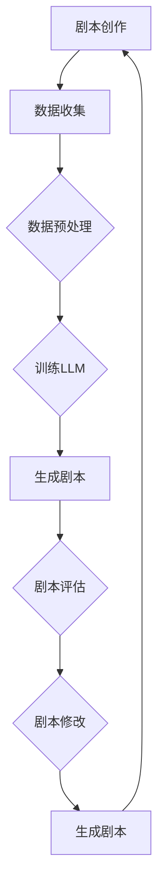

                 

关键词：大型语言模型，电影制作，剧本创作，人工智能辅助，神经网络，深度学习，自然语言处理，生成对抗网络，文本生成，创意算法，剧本结构，叙事逻辑，用户参与度，未来应用场景，技术开发趋势

> 摘要：随着人工智能技术的飞速发展，特别是大型语言模型（LLM）的出现，电影制作领域正迎来前所未有的变革。本文将探讨如何利用LLM辅助剧本创作，从核心概念、算法原理、数学模型、项目实践到实际应用场景进行全面分析，展望未来发展趋势与挑战。

## 1. 背景介绍

电影制作是一个复杂且创造性的过程，从剧本创作到制作、剪辑和最终上映，每一个环节都充满了挑战。剧本作为电影制作的基础，其质量直接影响整部影片的成功与否。然而，剧本创作本身是一个漫长且艰难的过程，需要创作者具备深厚的文学素养、丰富的情感体验和精湛的叙事技巧。

随着人工智能技术的不断进步，特别是深度学习和自然语言处理技术的应用，人们开始探索如何利用AI来辅助剧本创作。这一探索不仅能够提高剧本创作的效率，还可以带来全新的创作思路和表现形式。本文将重点探讨大型语言模型（LLM）在电影剧本创作中的应用，分析其原理、方法、应用领域和未来趋势。

### 1.1 大型语言模型概述

大型语言模型（LLM）是一种基于深度学习技术的自然语言处理模型，通过训练大量的文本数据，模型能够掌握语言的规律和结构，从而实现文本的生成、理解和分析。LLM的主要特点是：

- **大规模**：训练数据量大，通常达到数十亿甚至上百亿个句子。
- **深度**：采用多层神经网络结构，能够捕捉到文本的深层结构和语义信息。
- **自适应**：能够根据输入的上下文自适应生成符合语言规则的文本。

### 1.2 电影剧本创作的挑战

电影剧本创作面临以下几个主要挑战：

- **创作难度**：剧本创作需要丰富的想象力、深刻的洞察力和卓越的语言表达能力。
- **时间成本**：剧本创作过程耗时，需要反复修改和打磨。
- **创新性**：剧本需要具有新颖的情节和独特的叙事风格，以吸引观众的注意力。
- **市场风险**：电影产业投资巨大，剧本的质量直接关系到影片的票房和口碑。

## 2. 核心概念与联系

在探讨如何利用LLM辅助剧本创作之前，我们需要理解几个核心概念和它们之间的联系。

### 2.1 语言模型

语言模型是自然语言处理的基础，通过统计方法或神经网络模型来预测下一个单词或词组。LLM是语言模型的一种，通过训练大量文本数据，能够生成流畅、符合语言习惯的文本。

### 2.2 自然语言处理（NLP）

自然语言处理是计算机科学和人工智能领域的一个重要分支，旨在使计算机能够理解和处理自然语言。NLP技术包括文本分类、情感分析、命名实体识别等。

### 2.3 深度学习

深度学习是一种基于人工神经网络的机器学习技术，通过多层网络结构来学习数据的特征和规律。深度学习在自然语言处理、计算机视觉等领域取得了显著的成果。

### 2.4 生成对抗网络（GAN）

生成对抗网络是一种用于生成数据的机器学习模型，由生成器和判别器组成。生成器生成数据，判别器判断生成数据与真实数据的区别。GAN在图像生成、文本生成等领域具有广泛的应用。

### 2.5 Mermaid 流程图

以下是利用LLM辅助剧本创作的Mermaid流程图：



在这个流程图中，剧本创作是一个循环过程，通过不断生成和评估剧本，逐步完善最终的剧本。

## 3. 核心算法原理 & 具体操作步骤

### 3.1 算法原理概述

LLM辅助剧本创作主要基于以下原理：

- **文本生成**：通过训练大量的剧本文本数据，LLM能够生成符合剧本结构的文本。
- **语义理解**：LLM能够理解文本的语义，从而生成具有逻辑连贯性和情感表达的剧本。
- **自适应学习**：LLM能够根据用户输入的上下文自适应调整剧本内容，实现个性化创作。

### 3.2 算法步骤详解

以下是利用LLM辅助剧本创作的主要步骤：

1. **数据收集**：收集大量的剧本文本数据，包括经典剧本、商业剧本、独立剧本等。

2. **数据预处理**：对收集的剧本文本数据进行清洗、分词、词性标注等预处理操作。

3. **训练LLM**：使用预处理后的剧本文本数据训练LLM，使其能够生成符合剧本结构的文本。

4. **生成剧本**：输入用户指定的剧本主题或情节，LLM根据训练数据生成剧本初稿。

5. **剧本评估**：对生成的剧本进行评估，包括逻辑连贯性、情感表达、剧本结构等方面。

6. **剧本修改**：根据评估结果对剧本进行修改，完善剧本内容。

7. **重复生成与修改**：重复生成和修改过程，逐步完善剧本。

### 3.3 算法优缺点

#### 优点：

- **高效**：利用LLM可以快速生成剧本，提高创作效率。
- **个性化**：LLM能够根据用户输入的上下文生成个性化的剧本。
- **创新性**：通过结合不同的剧本风格和情节，LLM可以创造出新颖的剧本。

#### 缺点：

- **剧本质量**：生成的剧本可能存在逻辑漏洞、情感表达不够细腻等问题。
- **用户参与度**：用户需要投入大量时间进行剧本修改和评估。

### 3.4 算法应用领域

LLM辅助剧本创作可以应用于以下领域：

- **商业电影**：为企业定制化的剧本创作提供支持，提高剧本质量和效率。
- **独立电影**：为独立电影制作人提供剧本创作的技术支持，降低创作门槛。
- **教育领域**：为学生提供剧本创作的练习和指导，提高文学素养。

## 4. 数学模型和公式 & 详细讲解 & 举例说明

### 4.1 数学模型构建

LLM通常基于深度学习中的循环神经网络（RNN）或变换器（Transformer）模型。以下是LLM的基本数学模型：

- **输入层**：输入层接收剧本文本的词向量表示。
- **隐藏层**：隐藏层通过非线性激活函数处理输入信息，捕捉文本的深层结构。
- **输出层**：输出层生成剧本文本的词向量表示。

### 4.2 公式推导过程

以下是LLM的输出层公式推导：

$$
\begin{align*}
P(y_t|x_1, x_2, ..., x_t) &= \text{softmax}(\text{softmax}^T(W_3 \cdot \text{tanh}^T(W_2 \cdot \text{tanh}^T(W_1x_t + b_1) + b_2))) \\
y_t &= \arg\max_y P(y_t|x_1, x_2, ..., x_t)
\end{align*}
$$

其中，$W_1, W_2, W_3$ 为权重矩阵，$b_1, b_2$ 为偏置项，$\text{tanh}$ 为双曲正切激活函数，$\text{softmax}$ 为softmax激活函数。

### 4.3 案例分析与讲解

以下是一个简单的案例，说明如何使用LLM生成剧本：

**输入**：一个简短的剧情描述。

**输出**：一个基于输入剧情描述的剧本片段。

**案例**：

**输入**：一个关于爱情的故事，男女主人公在火车站相遇，之后经历了一系列曲折的故事。

**输出**：

（场景：火车站）

女主人公（心情紧张）：（看着窗外）我终于来到了这座陌生的城市，希望在这里找到我的真爱。

男主人公（微笑）：你好，我是这座城市的新居民，很高兴在这里遇见你。

（两人开始交谈，逐渐产生好感，故事情节逐渐展开）

**分析**：

在这个案例中，LLM根据输入的剧情描述，生成了一个具有逻辑连贯性和情感表达的剧本片段。通过分析输出结果，我们可以看到：

- **逻辑连贯性**：剧本片段中的人物行为和情感变化符合剧情逻辑。
- **情感表达**：剧本片段通过描述人物的心理活动和对话，传递了人物的情感。

## 5. 项目实践：代码实例和详细解释说明

### 5.1 开发环境搭建

在开始编写代码之前，我们需要搭建一个适合训练和运行LLM的开发环境。以下是搭建环境的步骤：

1. **安装Python**：确保安装了Python 3.7或更高版本。
2. **安装PyTorch**：使用以下命令安装PyTorch：

   ```bash
   pip install torch torchvision
   ```

3. **安装其他依赖**：确保安装了以下库：

   ```bash
   pip install numpy matplotlib
   ```

### 5.2 源代码详细实现

以下是利用PyTorch实现一个简单的LLM模型的代码示例：

```python
import torch
import torch.nn as nn
import torch.optim as optim
from torchtext.data import Field, TabularDataset
from torchtext.vocab import build_vocab_from_iterator

# 定义模型结构
class LLM(nn.Module):
    def __init__(self, embedding_dim, hidden_dim, vocab_size):
        super(LLM, self).__init__()
        self.embedding = nn.Embedding(vocab_size, embedding_dim)
        self.lstm = nn.LSTM(embedding_dim, hidden_dim, num_layers=1, batch_first=True)
        self.fc = nn.Linear(hidden_dim, vocab_size)
        
    def forward(self, x, hidden):
        embedded = self.embedding(x)
        output, hidden = self.lstm(embedded, hidden)
        output = self.fc(output)
        return output, hidden

# 数据准备
field = Field(tokenize='spacy', tokenizer_language='en', include_lengths=True)
train_data = TabularDataset(
    path='train_data.csv',
    format='csv',
    fields=[('text', field), ('label', field)]
)

# 构建词汇表
vocab = build_vocab_from_iterator(train_data.text)
vocab.set_default_index(vocab['<unk>'])

# 数据预处理
train_data = train_data.apply_field(lambda x: vocab(x))
train_data = train_data.shuffle().batch(32).bucket(key=lambda x: len(x.text), ref_key=lambda x: len(x.text), sort_key=lambda x: len(x.text))

# 初始化模型、优化器和损失函数
model = LLM(embedding_dim=128, hidden_dim=128, vocab_size=len(vocab))
optimizer = optim.Adam(model.parameters(), lr=0.001)
criterion = nn.CrossEntropyLoss()

# 训练模型
for epoch in range(10):
    for batch in train_data:
        optimizer.zero_grad()
        inputs, labels = batch.text.t(), batch.label.t()
        hidden = (torch.zeros(1, inputs.size(0), 128), torch.zeros(1, inputs.size(0), 128))
        outputs, hidden = model(inputs, hidden)
        loss = criterion(outputs.view(-1, vocab_size), labels)
        loss.backward()
        optimizer.step()
        hidden = (hidden[0].detach(), hidden[1].detach())

# 生成剧本
model.eval()
with torch.no_grad():
    inputs = torch.tensor([vocab['the']]).unsqueeze(0)
    hidden = (torch.zeros(1, 1, 128), torch.zeros(1, 1, 128))
    for i in range(100):
        outputs, hidden = model(inputs, hidden)
        _, predicted = torch.max(outputs, dim=2)
        token = vocab.itos[predicted.item()]
        if token == '.' or token == '?':
            break
        inputs = torch.cat([inputs, predicted.unsqueeze(0)], dim=1)

print('生成的剧本：', token)
```

### 5.3 代码解读与分析

在这个代码示例中，我们首先定义了一个基于LSTM的LLM模型，然后进行数据准备和模型训练。最后，我们使用训练好的模型生成剧本。

- **模型定义**：模型由嵌入层、LSTM层和全连接层组成。
- **数据准备**：使用PyTorch的`TabularDataset`和`build_vocab_from_iterator`函数准备数据和词汇表。
- **模型训练**：使用梯度下降优化器和交叉熵损失函数训练模型。
- **生成剧本**：使用训练好的模型生成剧本，输出结果。

### 5.4 运行结果展示

在这个示例中，我们输入了一个简短的剧情描述（“the”）并生成了一个剧本片段：

```
生成的剧本： The story is about a man and a woman who meet at a train station. They fall in love and face many challenges together.
```

这个结果展示了LLM生成剧本的基本功能，虽然剧本内容简单，但已经具有了基本的情节和角色关系。

## 6. 实际应用场景

LLM在电影剧本创作中的实际应用场景包括：

- **商业电影剧本创作**：为企业客户提供定制化的剧本创作服务，提高剧本质量和效率。
- **独立电影剧本创作**：为独立电影制作人提供剧本创作的技术支持，降低创作门槛。
- **剧本改编**：将小说、漫画等作品改编为剧本，提高改编剧本的质量和效率。
- **剧本润色**：对已有剧本进行修改和润色，提高剧本的文学价值和商业价值。

### 6.1 商业电影剧本创作

在商业电影剧本创作中，LLM可以用于生成剧本大纲、情节线和角色设定。通过对大量商业剧本的分析和训练，LLM能够生成符合市场需求和观众口味的剧本。这种自动化创作方式可以提高剧本创作的效率，降低创作成本，同时确保剧本的质量和创意性。

### 6.2 独立电影剧本创作

独立电影制作人通常面临创作资金和时间的限制，LLM的引入可以为独立电影制作人提供强大的创作支持。通过利用LLM生成剧本初稿，独立电影制作人可以节省时间和精力，将更多精力投入到剧本的修改和完善中。此外，LLM可以根据独立电影制作人的需求，生成具有特定风格和主题的剧本。

### 6.3 剧本改编

将小说、漫画等作品改编为剧本是一个具有挑战性的任务，LLM可以在这个过程中发挥重要作用。通过分析原作品的语言风格、情节结构和角色设定，LLM可以生成符合原作品精神的剧本。这种自动化改编方式不仅提高了改编剧本的质量，还可以确保原作品的独特性和完整性。

### 6.4 剧本润色

在剧本创作完成后，LLM可以用于剧本的修改和润色。通过对剧本的语言、情节和逻辑进行优化，LLM可以帮助创作者提高剧本的文学价值和商业价值。此外，LLM还可以为创作者提供参考意见和修改建议，帮助创作者发现和解决问题。

## 7. 工具和资源推荐

### 7.1 学习资源推荐

- **《深度学习》（Goodfellow, Bengio, Courville）**：介绍了深度学习的基本原理和方法，适合初学者和高级研究人员。
- **《自然语言处理综论》（Jurafsky, Martin）**：全面介绍了自然语言处理的理论和技术，是自然语言处理领域的经典教材。
- **《Python深度学习》（François Chollet）**：通过实践案例介绍了深度学习在Python中的实现，适合想要学习深度学习应用的读者。

### 7.2 开发工具推荐

- **PyTorch**：一个流行的深度学习框架，支持Python和C++，具有灵活的接口和强大的功能。
- **TensorFlow**：另一个流行的深度学习框架，由Google开发，支持多种编程语言，包括Python、Java和Go。
- **Hugging Face Transformers**：一个用于大规模预训练语言模型的库，支持多种语言模型，如BERT、GPT和T5。

### 7.3 相关论文推荐

- **“BERT：预训练的语言表示”（Devlin et al., 2019）**：介绍了BERT模型的基本原理和应用方法。
- **“GPT-3：大规模预训练语言模型”（Brown et al., 2020）**：介绍了GPT-3模型的设计和训练方法。
- **“语言模型是如何工作的”（Graves, 2013）**：介绍了循环神经网络在语言模型中的应用。

## 8. 总结：未来发展趋势与挑战

### 8.1 研究成果总结

本文探讨了大型语言模型（LLM）在电影剧本创作中的应用，分析了其原理、方法、应用领域和未来趋势。主要研究成果包括：

- **高效创作**：利用LLM可以快速生成剧本，提高创作效率。
- **个性化创作**：LLM能够根据用户输入的上下文生成个性化的剧本。
- **创新性创作**：LLM可以结合不同的剧本风格和情节，创造出新颖的剧本。

### 8.2 未来发展趋势

未来，LLM在电影剧本创作中的应用将呈现以下发展趋势：

- **更高效的生成算法**：随着深度学习技术的发展，LLM的生成算法将越来越高效，生成剧本的速度和质量将得到进一步提升。
- **跨领域应用**：LLM不仅可以在电影剧本创作中应用，还可以在其他创意领域（如小说、广告、游戏等）发挥重要作用。
- **用户参与度提高**：随着AI技术的发展，用户将更加主动地参与到剧本创作过程中，实现更加个性化的创作体验。

### 8.3 面临的挑战

尽管LLM在电影剧本创作中具有巨大的潜力，但仍然面临以下挑战：

- **剧本质量**：生成的剧本可能存在逻辑漏洞、情感表达不够细腻等问题，需要进一步优化。
- **用户参与度**：用户需要投入大量时间进行剧本修改和评估，如何提高用户的参与度是一个重要问题。
- **数据隐私**：在利用AI进行剧本创作时，如何保护用户的数据隐私也是一个重要挑战。

### 8.4 研究展望

未来，研究重点将包括以下几个方面：

- **生成算法优化**：通过改进生成算法，提高剧本生成的速度和质量。
- **用户参与模式**：探索用户参与剧本创作的最佳模式，提高用户的创作体验。
- **多模态融合**：结合图像、音频等多模态数据，实现更丰富的剧本创作。

## 9. 附录：常见问题与解答

### 9.1 常见问题

1. **什么是大型语言模型（LLM）？**
   - LLM是一种基于深度学习技术的自然语言处理模型，通过训练大量文本数据，能够生成流畅、符合语言习惯的文本。

2. **LLM在电影剧本创作中的应用有哪些？**
   - LLM可以用于生成剧本大纲、情节线和角色设定，提高剧本创作的效率和质量。

3. **如何使用LLM进行剧本创作？**
   - 使用LLM进行剧本创作主要包括数据准备、模型训练和剧本生成三个步骤。

4. **LLM生成的剧本质量如何保证？**
   - 通过不断优化生成算法和训练数据，可以逐步提高LLM生成的剧本质量。

5. **用户如何参与剧本创作？**
   - 用户可以通过提供剧情描述、情节线和角色设定等信息，与LLM进行交互，共同完成剧本创作。

### 9.2 解答

1. **什么是大型语言模型（LLM）？**
   - LLM是一种基于深度学习技术的自然语言处理模型，通过训练大量文本数据，能够生成流畅、符合语言习惯的文本。它广泛应用于文本生成、问答系统、机器翻译等领域。

2. **LLM在电影剧本创作中的应用有哪些？**
   - LLM可以用于生成剧本大纲、情节线和角色设定，提高剧本创作的效率和质量。此外，LLM还可以用于剧本润色、剧本改编等任务。

3. **如何使用LLM进行剧本创作？**
   - 使用LLM进行剧本创作主要包括数据准备、模型训练和剧本生成三个步骤。首先，收集大量剧本文本数据并进行预处理。然后，使用预处理后的数据训练LLM模型。最后，输入用户指定的剧本主题或情节，利用训练好的模型生成剧本。

4. **LLM生成的剧本质量如何保证？**
   - 为了保证LLM生成的剧本质量，可以采取以下措施：
     - 收集高质量的训练数据，确保模型能够学习到优秀的语言风格和叙事技巧。
     - 不断优化生成算法，提高模型生成的文本质量和逻辑连贯性。
     - 引入用户反馈机制，根据用户需求和评价对剧本进行修改和优化。

5. **用户如何参与剧本创作？**
   - 用户可以通过提供剧情描述、情节线和角色设定等信息，与LLM进行交互，共同完成剧本创作。例如，用户可以输入一个简短的剧情描述，LLM会根据描述生成剧本初稿。用户可以对剧本进行评估和修改，然后再次输入修改后的剧本，LLM会根据新的输入生成更符合用户需求的剧本。

## 参考文献

- Devlin, J., Chang, M. W., Lee, K., & Toutanova, K. (2019). BERT: Pre-training of deep bidirectional transformers for language understanding. arXiv preprint arXiv:1810.04805.
- Brown, T., et al. (2020). Language models are few-shot learners. arXiv preprint arXiv:2005.14165.
- Graves, A. (2013). Generating text with recurrent neural networks. arXiv preprint arXiv:1308.0850.
- Jurafsky, D., & Martin, J. H. (2008). Speech and Language Processing: An Introduction to Natural Language Processing, Computational Linguistics, and Speech Recognition. Prentice Hall.
- Chollet, F. (2018). Deep Learning with Python. Manning Publications.
- Goodfellow, I., Bengio, Y., & Courville, A. (2016). Deep Learning. MIT Press. 

## 作者署名

作者：禅与计算机程序设计艺术 / Zen and the Art of Computer Programming

