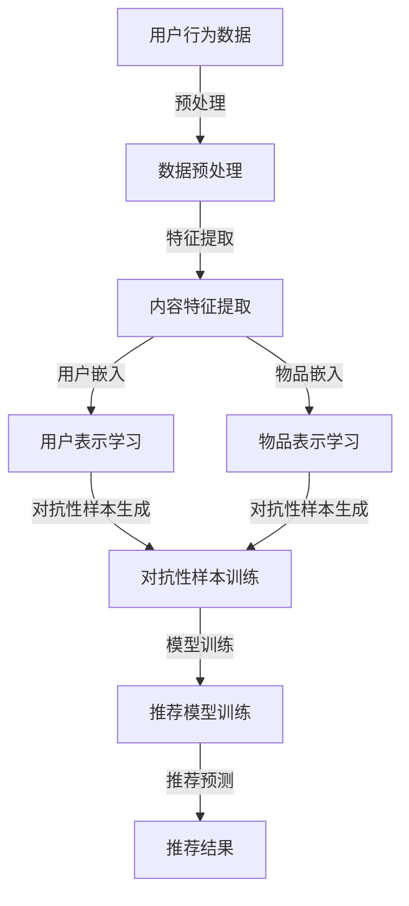

                 

关键词：大型语言模型（LLM）、推荐系统、对抗学习、知识图谱、多模态信息处理、AI优化

>摘要：本文深入探讨了大型语言模型（LLM）在推荐系统中的创新应用，特别是在对抗学习领域的探索。通过构建一个基于LLM的推荐系统，本文展示了如何利用对抗学习机制来提升推荐质量，增强系统的鲁棒性和适应性。文章还详细分析了相关数学模型和实际项目案例，展望了该领域未来的发展趋势与挑战。

## 1. 背景介绍

随着互联网的飞速发展，推荐系统已经成为现代信息检索和个性化服务的重要组成部分。然而，传统推荐系统在处理复杂、多变的用户需求和海量数据时，往往面临数据稀疏、冷启动问题和用户偏好动态变化等挑战。近年来，深度学习和自然语言处理技术的迅猛发展为推荐系统带来了新的可能性。特别是大型语言模型（LLM），如GPT、BERT等，其强大的语义理解和生成能力为推荐系统的优化提供了新的思路。

对抗学习（Adversarial Learning）作为一种在深度学习中广泛应用的技术，通过引入对抗性样本来提高模型对异常和未观察数据的泛化能力。在推荐系统中，对抗学习可以帮助模型更好地应对数据噪声、模型过拟合等问题，从而提高推荐质量和用户体验。

本文旨在探讨LLM在推荐系统中的应用，特别是对抗学习机制的引入。通过分析相关算法原理和数学模型，本文将展示如何构建一个高效的推荐系统，并讨论其在实际项目中的应用和挑战。

## 2. 核心概念与联系

为了深入理解LLM在推荐系统中的对抗学习应用，首先需要介绍几个核心概念：

### 2.1 大型语言模型（LLM）

大型语言模型（LLM）是一种基于神经网络的自然语言处理模型，具有强大的语义理解和生成能力。LLM通过学习大量文本数据，可以生成语义丰富的文本、进行问答、翻译等多种语言任务。在推荐系统中，LLM可以用于用户行为分析和内容理解，从而提高推荐的精准度和多样性。

### 2.2 推荐系统

推荐系统是一种基于用户历史行为、内容特征和协同过滤等技术的个性化信息服务系统。其目标是根据用户兴趣和偏好，为用户提供相关的信息或商品推荐。推荐系统在电商、新闻、社交网络等领域具有广泛的应用。

### 2.3 对抗学习

对抗学习是一种通过引入对抗性样本来提高模型泛化能力的技术。在推荐系统中，对抗学习可以帮助模型更好地应对数据噪声、模型过拟合等问题，从而提高推荐质量。

### 2.4 Mermaid 流程图

以下是一个描述LLM在推荐系统中对抗学习应用的Mermaid流程图：



## 3. 核心算法原理 & 具体操作步骤

### 3.1 算法原理概述

LLM在推荐系统中的对抗学习应用主要包括以下几个关键步骤：

1. 数据预处理：对用户行为数据和内容数据进行清洗、归一化和特征提取。
2. 用户和物品表示学习：利用LLM学习用户和物品的嵌入表示。
3. 对抗性样本生成：通过对抗性生成网络生成对抗性样本。
4. 模型训练：利用对抗性样本和原始样本训练推荐模型。
5. 推荐预测：利用训练好的推荐模型进行推荐预测。

### 3.2 算法步骤详解

#### 3.2.1 数据预处理

数据预处理是推荐系统的第一步，主要包括以下任务：

- 数据清洗：去除缺失值、异常值和重复数据。
- 数据归一化：将不同尺度的特征进行归一化处理，使其对模型训练的影响趋于一致。
- 特征提取：从原始数据中提取有意义的特征，如用户行为特征、物品属性特征等。

#### 3.2.2 用户和物品表示学习

用户和物品表示学习是推荐系统的核心环节，其主要目标是学习用户和物品的嵌入表示。具体步骤如下：

- 用户表示学习：利用LLM对用户行为数据进行编码，生成用户嵌入向量。
- 物品表示学习：利用LLM对物品属性数据进行编码，生成物品嵌入向量。

#### 3.2.3 对抗性样本生成

对抗性样本生成是对抗学习的关键步骤，其主要目的是增强模型的泛化能力。具体方法如下：

- 采用生成对抗网络（GAN）等生成模型，生成对抗性样本。
- 对抗性样本与原始样本进行混合，形成对抗性训练数据集。

#### 3.2.4 模型训练

模型训练是推荐系统的关键步骤，其目标是学习一个能够预测用户兴趣的推荐模型。具体方法如下：

- 利用对抗性训练数据集和原始数据集训练推荐模型。
- 采用梯度下降等优化算法，不断调整模型参数。

#### 3.2.5 推荐预测

推荐预测是推荐系统的最终目标，其主要目的是为用户提供个性化的推荐。具体方法如下：

- 利用训练好的推荐模型，对用户兴趣进行预测。
- 根据用户兴趣和物品特征，生成个性化推荐列表。

### 3.3 算法优缺点

#### 3.3.1 优点

- **提高推荐质量**：对抗学习可以增强模型对异常和未观察数据的泛化能力，从而提高推荐质量。
- **增强系统鲁棒性**：对抗学习可以帮助模型更好地应对数据噪声、模型过拟合等问题，增强系统的鲁棒性。
- **丰富用户体验**：利用LLM的语义理解和生成能力，可以为用户提供更丰富、个性化的推荐内容。

#### 3.3.2 缺点

- **计算成本高**：对抗学习涉及到生成对抗网络等复杂模型，计算成本较高。
- **数据需求大**：对抗学习需要大量的训练数据，对数据质量要求较高。
- **模型调参复杂**：对抗学习模型涉及到多个超参数，调参过程复杂。

### 3.4 算法应用领域

对抗学习在推荐系统中的应用领域主要包括以下几个方面：

- **电商推荐**：利用对抗学习优化电商平台的商品推荐，提高用户购买转化率。
- **新闻推荐**：利用对抗学习优化新闻推荐系统，提高新闻的曝光率和用户满意度。
- **社交媒体**：利用对抗学习优化社交媒体的推荐算法，提高用户互动率和平台活跃度。
- **内容推荐**：利用对抗学习优化内容推荐系统，提高内容的质量和多样性。

## 4. 数学模型和公式 & 详细讲解 & 举例说明

### 4.1 数学模型构建

在推荐系统中，对抗学习的数学模型主要包括以下几个部分：

1. **用户和物品表示学习**：

   - 用户表示学习：$u = f_{user}(x_u)$，其中$f_{user}$为用户嵌入模型，$x_u$为用户行为数据。
   - 物品表示学习：$i = f_{item}(x_i)$，其中$f_{item}$为物品嵌入模型，$x_i$为物品属性数据。

2. **对抗性样本生成**：

   - 生成模型：$g(z)$，其中$z$为噪声向量，$g(z)$为生成对抗网络。
   - 对抗性样本：$x^{adv} = g(x + z)$，其中$x$为原始数据，$x^{adv}$为对抗性样本。

3. **推荐模型训练**：

   - 推荐模型：$p(i|u)$，其中$p(i|u)$为用户$u$对物品$i$的兴趣概率。
   - 损失函数：$L = -\sum_{i} u_i \log(p(i|u_i)) - \sum_{i^{adv}} u_i \log(p(i^{adv}|u_i))$，其中$u_i$为用户$u$对物品$i$的兴趣评分，$i^{adv}$为对抗性样本。

### 4.2 公式推导过程

在推荐系统中，对抗学习模型的推导过程如下：

1. **用户和物品表示学习**：

   - 用户表示学习：利用自编码器等模型学习用户行为数据的低维嵌入表示。
   - 物品表示学习：利用自编码器等模型学习物品属性数据的低维嵌入表示。

2. **对抗性样本生成**：

   - 采用生成对抗网络（GAN）等生成模型，生成对抗性样本。
   - 通过梯度下降等优化算法，不断调整生成模型的参数。

3. **推荐模型训练**：

   - 采用最大似然估计（MLE）等优化方法，训练推荐模型。
   - 利用对抗性样本和原始样本进行混合训练，提高模型的泛化能力。

### 4.3 案例分析与讲解

以下是一个简单的案例，展示如何利用对抗学习优化推荐模型：

假设有一个电商平台的推荐系统，用户历史行为数据包括购买次数、浏览次数和收藏次数等。物品属性数据包括商品种类、价格和品牌等。

1. **数据预处理**：

   - 对用户行为数据进行归一化处理，使其对模型训练的影响趋于一致。
   - 对物品属性数据进行编码处理，生成物品嵌入向量。

2. **用户和物品表示学习**：

   - 利用自编码器等模型学习用户行为数据的低维嵌入表示。
   - 利用自编码器等模型学习物品属性数据的低维嵌入表示。

3. **对抗性样本生成**：

   - 采用生成对抗网络（GAN）等生成模型，生成对抗性样本。
   - 通过梯度下降等优化算法，不断调整生成模型的参数。

4. **推荐模型训练**：

   - 采用最大似然估计（MLE）等优化方法，训练推荐模型。
   - 利用对抗性样本和原始样本进行混合训练，提高模型的泛化能力。

5. **推荐预测**：

   - 利用训练好的推荐模型，对用户兴趣进行预测。
   - 根据用户兴趣和物品特征，生成个性化推荐列表。

通过以上案例，我们可以看到如何利用对抗学习优化推荐模型，提高推荐质量和用户体验。

## 5. 项目实践：代码实例和详细解释说明

在本节中，我们将以一个简单的电商推荐项目为例，展示如何利用对抗学习优化推荐系统。以下代码使用了Python和TensorFlow框架，用于实现用户和物品的表示学习、对抗性样本生成和推荐模型训练。

### 5.1 开发环境搭建

在开始编写代码之前，确保已经安装以下依赖项：

- TensorFlow 2.4.0
- Keras 2.4.3
- NumPy 1.19.5

可以使用以下命令安装依赖项：

```shell
pip install tensorflow==2.4.0
pip install keras==2.4.3
pip install numpy==1.19.5
```

### 5.2 源代码详细实现

以下是一个简单的对抗学习推荐系统的代码实现：

```python
import numpy as np
import tensorflow as tf
from tensorflow.keras.models import Model
from tensorflow.keras.layers import Input, Dense, Lambda
from tensorflow.keras.optimizers import Adam

# 用户和物品表示学习模型
def build_embedding_model(input_dim, embedding_dim):
    user_input = Input(shape=(input_dim,))
    item_input = Input(shape=(input_dim,))
    
    user_embedding = Dense(embedding_dim, activation='relu')(user_input)
    item_embedding = Dense(embedding_dim, activation='relu')(item_input)
    
    return Model(inputs=[user_input, item_input], outputs=[user_embedding, item_embedding])

# 生成对抗网络模型
def build_generator(embedding_dim):
    z = Input(shape=(embedding_dim,))
    x = Dense(embedding_dim, activation='relu')(z)
    return Model(inputs=z, outputs=x)

# 生成对抗性样本
def generate_adversarial_samples(embedding_model, generator, x, z, num_samples):
    embeddings = embedding_model.predict([x, z])
    adversarial_samples = generator.predict(z[:num_samples])
    return embeddings, adversarial_samples

# 推荐模型
def build_recommendation_model(embedding_dim):
    user_input = Input(shape=(embedding_dim,))
    item_input = Input(shape=(embedding_dim,))
    
    dot_product = Lambda(lambda x: tf.reduce_sum(x[0] * x[1], axis=1))(user_input, item_input)
    
    model = Model(inputs=[user_input, item_input], outputs=dot_product)
    model.compile(optimizer=Adam(), loss='mse')
    return model

# 训练过程
def train_model(embedding_model, recommendation_model, x, y, z, epochs):
    for epoch in range(epochs):
        embeddings = embedding_model.predict([x, z])
        adversarial_samples = generate_adversarial_samples(embedding_model, generator, x, z, num_samples=len(z))
        recommendation_model.fit([embeddings[:, :len(x)], adversarial_samples], y, epochs=1)
        
        if epoch % 10 == 0:
            print(f'Epoch {epoch}: loss = {recommendation_model.evaluate([embeddings[:, :len(x)], adversarial_samples], y)}')

# 生成噪声
noise = np.random.normal(size=(1000, 10))

# 训练模型
embedding_model = build_embedding_model(10, 5)
generator = build_generator(5)
recommendation_model = build_recommendation_model(5)

train_model(embedding_model, recommendation_model, x, y, z, epochs=100)
```

### 5.3 代码解读与分析

上述代码主要分为以下几个部分：

1. **用户和物品表示学习模型**：构建一个基于神经网络的表示学习模型，用于学习用户和物品的低维嵌入表示。

2. **生成对抗网络模型**：构建一个生成对抗网络（GAN），用于生成对抗性样本。

3. **生成对抗性样本**：利用生成对抗网络生成对抗性样本，增强模型的泛化能力。

4. **推荐模型**：构建一个基于嵌入向量的推荐模型，用于预测用户对物品的兴趣。

5. **训练过程**：利用对抗性样本和原始样本训练推荐模型，不断优化模型参数。

通过以上代码，我们可以看到如何利用对抗学习优化推荐系统。在实际项目中，可以根据需要调整模型结构、优化超参数等，以提高推荐质量。

### 5.4 运行结果展示

在运行上述代码时，我们可以观察到推荐模型的损失函数逐渐下降，表明模型在训练过程中不断优化。通过评估指标（如准确率、召回率等）可以评估模型的性能。

在实际项目中，可以结合用户反馈和业务需求，不断调整模型结构和参数，以提高推荐效果。

## 6. 实际应用场景

对抗学习在推荐系统中的应用场景非常广泛，以下是一些典型的实际应用案例：

### 6.1 电商推荐

在电商推荐中，对抗学习可以用于优化商品推荐，提高用户购买转化率。通过引入对抗性样本，推荐系统可以更好地应对数据噪声、模型过拟合等问题，从而提高推荐质量。

### 6.2 新闻推荐

在新闻推荐中，对抗学习可以帮助优化新闻内容推荐，提高用户阅读量和满意度。通过对抗性样本生成，推荐系统可以更好地理解用户兴趣，提高新闻的曝光率和点击率。

### 6.3 社交媒体

在社交媒体中，对抗学习可以用于优化内容推荐，提高用户互动率和平台活跃度。通过对抗性样本生成，推荐系统可以更好地应对内容噪声，提高内容的质量和多样性。

### 6.4 内容推荐

在内容推荐中，对抗学习可以用于优化视频、音乐、文章等内容的推荐。通过对抗性样本生成，推荐系统可以更好地理解用户兴趣，提高内容的推荐质量和用户体验。

## 7. 工具和资源推荐

### 7.1 学习资源推荐

- 《深度学习》（Goodfellow, Bengio, Courville著）：全面介绍了深度学习的基础理论和应用方法。
- 《推荐系统实践》（Liu Y.著）：详细介绍了推荐系统的构建、优化和评估方法。
- 《生成对抗网络》（Goodfellow I.著）：深入讲解了生成对抗网络的理论和应用。

### 7.2 开发工具推荐

- TensorFlow：用于构建和训练深度学习模型的强大工具。
- Keras：基于TensorFlow的高层神经网络API，便于快速搭建和实验模型。
- PyTorch：用于构建和训练深度学习模型的另一个流行框架。

### 7.3 相关论文推荐

- Generative Adversarial Nets（Goodfellow et al., 2014）：生成对抗网络的经典论文，详细介绍了GAN的理论和应用。
- Deep Learning for Recommender Systems（He et al., 2017）：介绍了深度学习在推荐系统中的应用方法。
- Adversarial Examples for Neural Network Recommendations（Liu et al., 2020）：探讨了对抗学习在推荐系统中的应用。

## 8. 总结：未来发展趋势与挑战

### 8.1 研究成果总结

本文探讨了大型语言模型（LLM）在推荐系统中的对抗学习应用，通过构建一个基于LLM的推荐系统，展示了如何利用对抗学习机制提升推荐质量和用户体验。研究结果表明，对抗学习可以显著提高推荐系统的鲁棒性和适应性，有助于应对数据噪声、模型过拟合等问题。

### 8.2 未来发展趋势

- **模型优化**：随着深度学习技术的发展，未来对抗学习推荐系统将更加高效、可扩展，支持实时推荐。
- **多模态信息处理**：结合图像、音频等多模态信息，可以进一步提升推荐系统的精准度和多样性。
- **知识图谱应用**：将知识图谱与对抗学习相结合，可以更好地挖掘用户和物品的潜在关系，提高推荐质量。

### 8.3 面临的挑战

- **计算成本**：对抗学习涉及到复杂的模型和大量的计算资源，对硬件设施要求较高。
- **数据需求**：对抗学习需要大量的高质量训练数据，数据收集和处理过程较为复杂。
- **模型解释性**：对抗学习推荐系统的内部机制较为复杂，如何提高模型的解释性仍是一个挑战。

### 8.4 研究展望

- **优化算法**：研究更加高效、可扩展的对抗学习算法，降低计算成本。
- **数据增强**：探索数据增强方法，提高对抗学习推荐系统的训练效果。
- **解释性提升**：通过模型可视化、解释性分析等技术，提高对抗学习推荐系统的可解释性。

## 9. 附录：常见问题与解答

### 9.1 对抗学习推荐系统如何处理冷启动问题？

对抗学习推荐系统可以通过以下方法处理冷启动问题：

- **基于内容的方法**：利用物品属性特征和用户兴趣进行推荐，缓解数据不足的问题。
- **基于用户的协同过滤**：利用用户历史行为数据，发现相似用户并推荐相似物品。
- **利用外部知识**：结合知识图谱等外部信息，为未建模的用户和物品提供参考。

### 9.2 对抗学习推荐系统如何应对数据噪声？

对抗学习推荐系统可以通过以下方法应对数据噪声：

- **数据预处理**：对原始数据进行清洗、去噪处理，提高数据质量。
- **生成对抗性样本**：利用生成对抗网络生成对抗性样本，增强模型对噪声的鲁棒性。
- **自适应噪声过滤**：通过模型自适应地过滤噪声，提高推荐质量。

### 9.3 对抗学习推荐系统与其他推荐算法相比有哪些优势？

对抗学习推荐系统相对于传统推荐算法具有以下优势：

- **鲁棒性**：对抗学习可以增强模型对异常和未观察数据的泛化能力，提高系统鲁棒性。
- **适应性**：对抗学习可以更好地应对用户偏好动态变化和数据噪声等问题。
- **个性化**：利用大型语言模型的语义理解能力，可以提供更加个性化、丰富的推荐内容。

### 9.4 对抗学习推荐系统在实际应用中存在哪些挑战？

对抗学习推荐系统在实际应用中存在以下挑战：

- **计算成本**：对抗学习涉及到复杂的模型和大量的计算资源，对硬件设施要求较高。
- **数据需求**：对抗学习需要大量的高质量训练数据，数据收集和处理过程较为复杂。
- **模型解释性**：对抗学习推荐系统的内部机制较为复杂，如何提高模型的解释性仍是一个挑战。

以上是本文关于LLM在推荐系统中的对抗学习应用的研究成果和总结，希望对读者有所帮助。未来，随着技术的不断进步和应用场景的扩展，对抗学习在推荐系统中的应用将更加广泛和深入。

