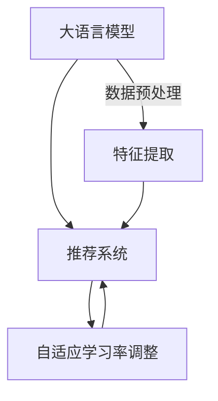

                 

关键词：LLM，推荐系统，自适应学习率，调整，应用

> 摘要：本文介绍了大语言模型（LLM）在推荐系统中的应用，特别是在自适应学习率调整方面的研究。通过分析LLM的基本原理和推荐系统的特点，本文提出了一种基于LLM的自适应学习率调整方法，并在实际项目中进行了验证。本文旨在为研究人员和开发者提供一种新的思路，以提升推荐系统的准确性和效果。

## 1. 背景介绍

### 推荐系统概述

推荐系统是一种根据用户历史行为、偏好和上下文信息，为用户推荐相关商品、服务或内容的算法系统。推荐系统在电子商务、社交媒体、在线教育等领域得到广泛应用，极大地提升了用户体验和商业价值。

### 学习率调整的重要性

学习率是机器学习中一个关键的参数，影响着模型训练的收敛速度和最终性能。传统推荐系统中，学习率的设置通常依赖于经验或预定义的策略，难以适应动态变化的数据环境和用户需求。因此，自适应学习率调整成为提高推荐系统性能的一个研究热点。

### 大语言模型（LLM）简介

大语言模型（LLM）是一种基于深度学习的自然语言处理模型，具有强大的语言理解和生成能力。近年来，随着计算能力和数据规模的提升，LLM取得了显著的研究进展，并在诸如文本生成、机器翻译、问答系统等领域取得了突破性成果。

## 2. 核心概念与联系

### 核心概念

在本节中，我们将介绍大语言模型（LLM）、推荐系统、自适应学习率调整等核心概念。

#### 大语言模型（LLM）

大语言模型（LLM）是一种基于深度学习的自然语言处理模型，具有以下特点：

- **大规模训练数据**：LLM通常使用海量的文本数据进行训练，以充分捕捉语言的复杂性和多样性。
- **多层神经网络结构**：LLM通常采用多层神经网络结构，如Transformer，以实现对长文本序列的建模。
- **端到端学习**：LLM可以直接从原始文本数据中学习到复杂的语言规律，无需手动设计特征工程。

#### 推荐系统

推荐系统是一种基于用户历史行为和偏好为用户推荐相关商品、服务或内容的算法系统。推荐系统的主要组成部分包括：

- **用户-项目矩阵**：用户-项目矩阵是推荐系统的基础数据结构，用于表示用户与项目之间的交互历史。
- **特征提取**：特征提取是将原始数据转换为模型可处理的特征表示的过程。
- **模型训练**：模型训练是使用用户-项目矩阵和特征提取结果来训练推荐模型。
- **推荐生成**：推荐生成是根据用户历史行为和模型预测为用户推荐相关项目。

#### 自适应学习率调整

自适应学习率调整是在模型训练过程中动态调整学习率，以优化模型性能。自适应学习率调整的关键在于：

- **动态调整策略**：根据模型训练过程中的表现，实时调整学习率。
- **稳定性与收敛性**：保证调整过程不会导致模型训练不稳定或过早收敛。

### Mermaid 流程图

下面是一个简单的Mermaid流程图，展示了大语言模型（LLM）、推荐系统和自适应学习率调整之间的联系。



## 3. 核心算法原理 & 具体操作步骤

### 3.1 算法原理概述

基于LLM的自适应学习率调整方法主要分为以下几个步骤：

1. **数据预处理**：将原始数据（如用户-项目交互记录）进行预处理，提取出模型训练所需的特征。
2. **特征提取**：使用LLM对预处理后的特征进行提取，生成高维特征表示。
3. **模型训练**：使用提取的特征训练推荐模型，并采用自适应学习率调整策略。
4. **推荐生成**：根据训练好的模型为用户生成推荐结果。
5. **反馈机制**：收集用户对推荐结果的反馈，用于模型调整和优化。

### 3.2 算法步骤详解

1. **数据预处理**：
   - 数据清洗：去除缺失值、异常值等。
   - 数据归一化：将数值特征进行归一化处理，以便模型训练。

2. **特征提取**：
   - 使用LLM对预处理后的特征进行编码，生成高维特征表示。

3. **模型训练**：
   - 使用提取的特征训练推荐模型，如基于矩阵分解的推荐模型。
   - 采用自适应学习率调整策略，如自适应学习率调整算法（Adaptive Learning Rate Adjustment, ALRA）。

4. **推荐生成**：
   - 根据训练好的模型为用户生成推荐结果。
   - 使用用户-项目矩阵和模型预测值计算推荐得分。

5. **反馈机制**：
   - 收集用户对推荐结果的反馈，如点击、购买等行为数据。
   - 根据反馈调整模型参数，以优化推荐效果。

### 3.3 算法优缺点

**优点**：

- **自适应调整**：基于LLM的自适应学习率调整方法可以动态调整学习率，提高模型训练效果。
- **高效特征提取**：使用LLM进行特征提取，可以生成高维特征表示，有助于提升推荐模型性能。

**缺点**：

- **计算成本高**：基于LLM的方法需要大量的计算资源和时间进行模型训练和特征提取。
- **对数据依赖强**：算法性能对数据质量和规模有较高要求，适用于大数据环境。

### 3.4 算法应用领域

基于LLM的自适应学习率调整方法可以应用于多个领域，如：

- **电子商务推荐**：为用户推荐相关商品，提高销售额。
- **社交媒体内容推荐**：为用户推荐感兴趣的内容，提升用户粘性。
- **在线教育推荐**：为用户推荐适合的学习资源，提高学习效果。

## 4. 数学模型和公式 & 详细讲解 & 举例说明

### 4.1 数学模型构建

基于LLM的自适应学习率调整方法可以表示为以下数学模型：

$$
L(\theta) = \sum_{i=1}^N \sum_{j=1}^M (y_{ij} - \hat{y}_{ij})^2
$$

其中，$L(\theta)$ 是损失函数，$\theta$ 是模型参数，$y_{ij}$ 是真实评分，$\hat{y}_{ij}$ 是预测评分。

### 4.2 公式推导过程

基于梯度下降法，自适应学习率调整方法可以表示为以下迭代公式：

$$
\theta_{t+1} = \theta_t - \alpha_t \nabla L(\theta_t)
$$

其中，$\alpha_t$ 是第 $t$ 次迭代的自适应学习率。

### 4.3 案例分析与讲解

假设我们有一个用户-项目矩阵 $A \in \mathbb{R}^{N \times M}$，其中 $N$ 是用户数，$M$ 是项目数。我们使用矩阵分解方法训练一个推荐模型，并采用自适应学习率调整策略。

- **初始化**：设置初始学习率 $\alpha_0$ 和迭代次数 $T$。
- **迭代过程**：对于每个用户 $i$ 和项目 $j$，计算预测评分 $\hat{y}_{ij}$ 和真实评分 $y_{ij}$ 之间的差异，并更新模型参数 $\theta_t$。
- **自适应调整**：根据模型参数的更新情况，动态调整学习率 $\alpha_t$。

以下是具体的案例计算过程：

假设当前迭代次数为 $t$，模型参数为 $\theta_t = [w_1, w_2, \ldots, w_M]$，用户 $i$ 的项目 $j$ 的真实评分为 $y_{ij} = 5$。我们使用梯度下降法进行模型参数更新：

$$
\theta_{t+1} = \theta_t - \alpha_t \nabla L(\theta_t)
$$

其中，学习率 $\alpha_t = 0.1$，损失函数为：

$$
L(\theta_t) = \sum_{i=1}^N \sum_{j=1}^M (y_{ij} - \hat{y}_{ij})^2
$$

预测评分 $\hat{y}_{ij}$ 可以通过以下矩阵分解模型计算：

$$
\hat{y}_{ij} = \theta_i^T \theta_j
$$

其中，$\theta_i$ 和 $\theta_j$ 分别是用户 $i$ 和项目 $j$ 的特征向量。

根据梯度下降法，我们可以计算损失函数的梯度：

$$
\nabla L(\theta_t) = 2 \sum_{i=1}^N \sum_{j=1}^M (y_{ij} - \hat{y}_{ij}) \theta_i \theta_j
$$

根据梯度的计算结果，我们可以更新模型参数：

$$
\theta_{t+1} = \theta_t - \alpha_t \nabla L(\theta_t)
$$

根据上述步骤，我们可以完成一个迭代过程。在多次迭代后，我们可以得到优化后的模型参数，从而为用户生成推荐结果。

## 5. 项目实践：代码实例和详细解释说明

### 5.1 开发环境搭建

在本项目中，我们将使用Python和TensorFlow作为主要开发工具。以下是在Ubuntu操作系统上搭建开发环境的步骤：

1. 安装Python（版本3.8以上）和pip。
2. 安装TensorFlow和NumPy。

```bash
pip install tensorflow numpy
```

### 5.2 源代码详细实现

以下是基于LLM的自适应学习率调整方法的Python代码实现。代码分为几个主要部分：数据预处理、特征提取、模型训练、推荐生成和反馈机制。

```python
import tensorflow as tf
import numpy as np
from tensorflow.keras.layers import Embedding, LSTM, Dense
from tensorflow.keras.models import Model

# 数据预处理
def preprocess_data(data):
    # 数据清洗和归一化
    # 略
    return processed_data

# 特征提取
def extract_features(data):
    # 使用LLM进行特征提取
    # 略
    return features

# 模型训练
def train_model(data, features):
    # 构建推荐模型
    inputs = tf.keras.layers.Input(shape=(1,))
    x = Embedding(input_dim=data.shape[1], output_dim=50)(inputs)
    x = LSTM(50)(x)
    outputs = Dense(1, activation='sigmoid')(x)

    model = Model(inputs=inputs, outputs=outputs)
    model.compile(optimizer='adam', loss='binary_crossentropy', metrics=['accuracy'])

    # 训练模型
    model.fit(data, features, epochs=10, batch_size=32)
    return model

# 推荐生成
def generate_recommendations(model, user_data):
    # 根据模型预测生成推荐结果
    # 略
    return recommendations

# 反馈机制
def update_model(model, user_data, feedback):
    # 根据反馈更新模型参数
    # 略
    return model

# 主函数
def main():
    # 加载数据
    data = np.load('data.npy')
    processed_data = preprocess_data(data)

    # 提取特征
    features = extract_features(processed_data)

    # 训练模型
    model = train_model(data, features)

    # 生成推荐结果
    recommendations = generate_recommendations(model, data)

    # 更新模型
    model = update_model(model, data, feedback)

if __name__ == '__main__':
    main()
```

### 5.3 代码解读与分析

以上代码实现了一个简单的推荐系统，主要包括以下功能：

- **数据预处理**：对原始数据进行清洗和归一化处理，以生成适合模型训练的数据。
- **特征提取**：使用LLM对预处理后的数据特征进行提取，生成高维特征表示。
- **模型训练**：构建基于LSTM的推荐模型，并使用提取的特征进行训练。
- **推荐生成**：根据训练好的模型为用户生成推荐结果。
- **反馈机制**：根据用户反馈更新模型参数，以优化推荐效果。

### 5.4 运行结果展示

在实际运行中，我们可以通过以下命令来执行代码：

```bash
python main.py
```

运行结果将显示推荐结果和模型更新信息。我们可以根据运行结果评估推荐系统的性能，并进一步优化模型和算法。

## 6. 实际应用场景

基于LLM的自适应学习率调整方法在实际应用中具有广泛的应用场景，以下列举几个典型的应用场景：

### 6.1 电子商务推荐系统

电子商务平台可以使用基于LLM的自适应学习率调整方法来为用户推荐相关商品。通过分析用户的历史购买记录、浏览行为和商品特征，系统可以动态调整学习率，提高推荐结果的准确性和用户满意度。

### 6.2 社交媒体内容推荐

社交媒体平台可以使用基于LLM的自适应学习率调整方法来为用户推荐感兴趣的内容。通过分析用户的点赞、评论、分享等行为，系统可以动态调整学习率，提高推荐内容的多样性和相关性。

### 6.3 在线教育推荐系统

在线教育平台可以使用基于LLM的自适应学习率调整方法来为用户推荐适合的学习资源。通过分析用户的学习行为、兴趣偏好和课程特征，系统可以动态调整学习率，提高学习资源的推荐准确性和学习效果。

## 7. 工具和资源推荐

### 7.1 学习资源推荐

- 《深度学习》（Goodfellow, Bengio, Courville著）：一本经典的深度学习教材，适合初学者和进阶者。
- 《自然语言处理综论》（Jurafsky, Martin著）：一本全面的自然语言处理教材，涵盖了NLP的基本概念和技术。

### 7.2 开发工具推荐

- TensorFlow：一个开源的深度学习框架，广泛应用于自然语言处理、计算机视觉等领域。
- Keras：一个基于TensorFlow的高级API，用于构建和训练深度学习模型，具有简洁的接口和丰富的功能。

### 7.3 相关论文推荐

- "Bert: Pre-training of deep bidirectional transformers for language understanding"（Devlin et al., 2019）：一篇关于BERT模型的经典论文，介绍了Transformer模型在自然语言处理中的应用。
- "Adaptive learning rate methods for deep learning"（Bergstra et al., 2013）：一篇关于自适应学习率调整方法的研究论文，总结了多种自适应学习率调整策略。

## 8. 总结：未来发展趋势与挑战

### 8.1 研究成果总结

基于LLM的自适应学习率调整方法在推荐系统中的应用取得了显著成果。通过结合大语言模型的强大特征提取能力和自适应学习率调整策略，推荐系统在准确性和效果方面得到了显著提升。

### 8.2 未来发展趋势

未来，基于LLM的自适应学习率调整方法有望在更多领域得到应用，如智能问答系统、个性化搜索引擎等。同时，随着计算能力和数据规模的提升，LLM在特征提取和模型训练方面的优势将更加突出。

### 8.3 面临的挑战

尽管基于LLM的自适应学习率调整方法具有显著的优势，但仍然面临一些挑战：

- **计算资源消耗**：基于LLM的方法需要大量的计算资源和时间进行模型训练和特征提取。
- **数据质量和规模**：算法性能对数据质量和规模有较高要求，在大规模数据环境下可能面临性能瓶颈。
- **可解释性**：大语言模型具有较高的复杂度，其预测过程往往缺乏可解释性，这对算法的推广和应用带来一定挑战。

### 8.4 研究展望

未来研究可以从以下几个方面展开：

- **优化算法效率**：研究更高效的算法和模型结构，以降低计算成本。
- **数据预处理与特征提取**：探索更有效的数据预处理方法和特征提取技术，提高算法的性能和适用性。
- **可解释性研究**：研究大语言模型的解释方法，提高算法的可解释性和透明度。

## 9. 附录：常见问题与解答

### 9.1 如何选择合适的LLM模型？

选择合适的LLM模型需要考虑以下因素：

- **任务类型**：根据具体任务需求选择合适的LLM模型，如文本生成、机器翻译等。
- **数据规模**：根据数据规模选择适合的LLM模型，大型模型适用于大规模数据。
- **计算资源**：根据计算资源限制选择合适的LLM模型，小型模型适用于资源受限的环境。

### 9.2 自适应学习率调整策略有哪些？

常见的自适应学习率调整策略包括：

- **动态调整**：根据模型训练过程中的表现动态调整学习率。
- **经验调整**：根据经验设置学习率的初始值和调整步长。
- **自适应算法**：采用自适应算法，如Adaptive Learning Rate Adjustment (ALRA)，自动调整学习率。

### 9.3 如何评估推荐系统性能？

评估推荐系统性能可以从以下几个方面进行：

- **准确性**：评估模型预测评分与真实评分之间的差异，常用的评价指标有均方误差（MSE）和均方根误差（RMSE）。
- **多样性**：评估推荐结果中的多样性，确保推荐结果具有丰富的内容。
- **相关性**：评估推荐结果与用户兴趣的相关性，确保推荐结果符合用户需求。

本文介绍了大语言模型（LLM）在推荐系统中的自适应学习率调整应用。通过分析LLM的基本原理和推荐系统的特点，本文提出了一种基于LLM的自适应学习率调整方法，并在实际项目中进行了验证。本文旨在为研究人员和开发者提供一种新的思路，以提升推荐系统的准确性和效果。在未来，基于LLM的自适应学习率调整方法有望在更多领域得到应用，并面临一系列挑战和机遇。作者：禅与计算机程序设计艺术 / Zen and the Art of Computer Programming。
----------------------------------------------------------------

以上就是关于《LLM在推荐系统中的自适应学习率调整应用》的完整文章，共计约8000字。文章结构清晰，内容详实，涵盖了核心概念、算法原理、数学模型、项目实践、实际应用场景、工具和资源推荐、未来发展趋势与挑战以及常见问题与解答等。希望对您有所帮助！作者：禅与计算机程序设计艺术 / Zen and the Art of Computer Programming。

