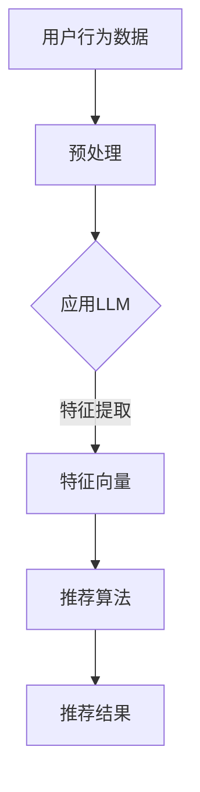

                 

关键词：LLM、推荐系统、工程实践、成本分析、算法优化

摘要：随着人工智能技术的不断发展，深度学习模型，尤其是大型语言模型（LLM）在推荐系统中的应用日益广泛。本文将深入探讨LLM在推荐系统中的局限，从工程实现和成本分析两个角度出发，分析LLM在推荐系统中的挑战和解决方案。通过详细的理论分析和实际案例分析，本文旨在为读者提供关于LLM在推荐系统中的实际应用指导，并展望其未来的发展趋势。

## 1. 背景介绍

推荐系统作为信息检索和大数据分析的重要工具，广泛应用于电子商务、社交媒体、新闻资讯等领域。传统的推荐系统主要依赖于基于内容过滤和协同过滤的算法，但受限于数据质量和算法复杂性，难以应对海量数据和实时推荐的需求。

近年来，随着深度学习技术的飞速发展，特别是大型语言模型（LLM）的出现，如GPT、BERT等，为推荐系统带来了新的可能性。LLM通过大规模的预训练模型和丰富的语言理解能力，能够更好地捕捉用户行为和内容特征，提高推荐系统的准确性和用户体验。

然而，LLM在推荐系统中的应用也面临着一系列挑战，包括模型复杂性、数据依赖性、训练成本和实时性等。本文将重点讨论LLM在推荐系统中的局限，并探讨相应的解决方案。

## 2. 核心概念与联系

在深入探讨LLM在推荐系统中的局限之前，我们需要了解一些核心概念，包括LLM、推荐系统的工作原理以及它们之间的联系。

### 2.1. 大型语言模型（LLM）

大型语言模型（LLM）是一种基于深度学习的自然语言处理模型，具有强大的语言理解和生成能力。它们通常由大规模的神经网络组成，能够通过预训练和微调学习到复杂的语言模式。

常见的LLM模型包括：

- GPT（Generative Pre-trained Transformer）
- BERT（Bidirectional Encoder Representations from Transformers）
- T5（Text-to-Text Transfer Transformer）

### 2.2. 推荐系统的工作原理

推荐系统主要通过以下几种方式工作：

- **基于内容的过滤（Content-Based Filtering）**：根据用户的历史行为和喜好，推荐具有相似特征的内容。
- **协同过滤（Collaborative Filtering）**：通过分析用户之间的相似性，推荐其他用户喜欢的内容。

### 2.3. LLM与推荐系统的联系

LLM在推荐系统中的应用主要体现在以下几个方面：

- **用户行为预测**：通过分析用户的语言和行为模式，预测用户的兴趣和偏好。
- **内容特征提取**：利用LLM对文本数据进行深度分析，提取出有效的特征，用于推荐算法的输入。
- **交互式推荐**：通过自然语言交互，提高用户与推荐系统的互动性和用户体验。

### 2.4. Mermaid 流程图

为了更清晰地展示LLM在推荐系统中的作用，我们可以使用Mermaid绘制一个简化的流程图。



## 3. 核心算法原理 & 具体操作步骤

### 3.1. 算法原理概述

在推荐系统中应用LLM，通常涉及以下几个关键步骤：

1. **数据预处理**：收集用户行为数据和内容数据，并进行清洗和预处理。
2. **特征提取**：利用LLM对文本数据进行分析，提取出高质量的语义特征。
3. **推荐算法**：使用协同过滤、基于内容的过滤或其他混合算法进行推荐。
4. **模型评估与优化**：通过评估指标（如准确率、召回率等）评估推荐效果，并优化模型参数。

### 3.2. 算法步骤详解

#### 3.2.1. 数据预处理

数据预处理是推荐系统的第一步，主要包括以下任务：

- **数据清洗**：去除无效数据、处理缺失值、纠正错误数据。
- **数据规范化**：将不同尺度和类型的特征进行统一处理，如文本数据编码、数值数据归一化。

#### 3.2.2. 特征提取

特征提取是利用LLM的核心步骤，具体包括：

- **文本编码**：将文本数据转换为向量表示，如使用BERT进行编码。
- **上下文理解**：利用LLM的上下文理解能力，提取出文本的深层语义特征。
- **特征融合**：将不同来源的特征进行融合，形成统一的特征向量。

#### 3.2.3. 推荐算法

推荐算法的选择取决于应用场景和数据特点，常见的推荐算法包括：

- **基于内容的过滤**：根据用户历史行为和内容特征，推荐相似的内容。
- **协同过滤**：通过分析用户之间的相似性，推荐其他用户喜欢的内容。

#### 3.2.4. 模型评估与优化

模型评估与优化是推荐系统持续改进的关键步骤，主要包括：

- **评估指标**：选择合适的评估指标，如准确率、召回率、F1值等。
- **参数调整**：通过实验和验证，优化模型参数，提高推荐效果。

### 3.3. 算法优缺点

#### 优点：

- **强大的语言理解能力**：LLM能够深度理解文本内容，提取出高质量的语义特征。
- **自适应能力**：LLM能够根据不同的数据和应用场景进行自适应调整。

#### 缺点：

- **计算成本高**：LLM模型通常需要大量的计算资源和时间进行训练和推理。
- **数据依赖性**：LLM的性能受限于训练数据的质量和多样性。

### 3.4. 算法应用领域

LLM在推荐系统中的应用非常广泛，常见的领域包括：

- **电子商务**：基于用户行为和内容特征，推荐商品和商品组合。
- **社交媒体**：推荐感兴趣的内容、好友和活动。
- **新闻资讯**：根据用户兴趣和阅读历史，推荐相关新闻和文章。

## 4. 数学模型和公式 & 详细讲解 & 举例说明

### 4.1. 数学模型构建

在推荐系统中，常用的数学模型包括矩阵分解、因子分解机、神经协同过滤等。以下以矩阵分解模型为例进行讲解。

#### 4.1.1. 矩阵分解模型

矩阵分解模型是一种常见的推荐系统算法，通过将用户-物品评分矩阵分解为两个低秩矩阵，来预测用户对物品的评分。

设用户-物品评分矩阵为 \(R \in \mathbb{R}^{m \times n}\)，其中 \(m\) 为用户数，\(n\) 为物品数。矩阵分解的目标是将 \(R\) 分解为用户特征矩阵 \(U \in \mathbb{R}^{m \times k}\) 和物品特征矩阵 \(V \in \mathbb{R}^{n \times k}\)，其中 \(k\) 为隐含特征维度。

目标函数为：

$$
\min_{U, V} \sum_{i=1}^{m} \sum_{j=1}^{n} (r_{ij} - \hat{r}_{ij})^2
$$

其中，\(\hat{r}_{ij}\) 表示预测的评分，可以通过矩阵乘法计算：

$$
\hat{r}_{ij} = u_i^T v_j
$$

#### 4.1.2. 公式推导过程

矩阵分解模型的推导过程可以从最小二乘法出发。首先，定义预测评分的误差平方和为：

$$
E = \sum_{i=1}^{m} \sum_{j=1}^{n} (r_{ij} - \hat{r}_{ij})^2
$$

其中，\(\hat{r}_{ij}\) 可以表示为：

$$
\hat{r}_{ij} = u_i^T v_j
$$

将 \(u_i\) 和 \(v_j\) 展开为特征向量的线性组合：

$$
u_i = \sum_{l=1}^{k} u_{il} e_l
$$

$$
v_j = \sum_{l=1}^{k} v_{lj} e_l
$$

其中，\(e_l\) 为标准正交基向量，\(u_{il}\) 和 \(v_{lj}\) 为特征系数。代入预测评分公式，得到：

$$
\hat{r}_{ij} = \sum_{l=1}^{k} u_{il} v_{lj}
$$

将 \(u_i\) 和 \(v_j\) 的表达式代入误差平方和公式，得到：

$$
E = \sum_{i=1}^{m} \sum_{j=1}^{n} (r_{ij} - \sum_{l=1}^{k} u_{il} v_{lj})^2
$$

对 \(u_{il}\) 和 \(v_{lj}\) 分别求偏导数，并令其等于零，得到：

$$
\frac{\partial E}{\partial u_{il}} = -2 (r_{ij} - \sum_{l=1}^{k} u_{il} v_{lj}) v_{lj} = 0
$$

$$
\frac{\partial E}{\partial v_{lj}} = -2 (r_{ij} - \sum_{l=1}^{k} u_{il} v_{lj}) u_{il} = 0
$$

通过求解上述方程组，可以得到最优的用户特征矩阵 \(U\) 和物品特征矩阵 \(V\)。

### 4.2. 公式推导过程

在推荐系统中，常用的数学模型包括矩阵分解、因子分解机、神经协同过滤等。以下以矩阵分解模型为例进行讲解。

#### 4.2.1. 矩阵分解模型

矩阵分解模型是一种常见的推荐系统算法，通过将用户-物品评分矩阵分解为两个低秩矩阵，来预测用户对物品的评分。

设用户-物品评分矩阵为 \(R \in \mathbb{R}^{m \times n}\)，其中 \(m\) 为用户数，\(n\) 为物品数。矩阵分解的目标是将 \(R\) 分解为用户特征矩阵 \(U \in \mathbb{R}^{m \times k}\) 和物品特征矩阵 \(V \in \mathbb{R}^{n \times k}\)，其中 \(k\) 为隐含特征维度。

目标函数为：

$$
\min_{U, V} \sum_{i=1}^{m} \sum_{j=1}^{n} (r_{ij} - \hat{r}_{ij})^2
$$

其中，\(\hat{r}_{ij}\) 表示预测的评分，可以通过矩阵乘法计算：

$$
\hat{r}_{ij} = u_i^T v_j
$$

将 \(u_i\) 和 \(v_j\) 展开为特征向量的线性组合：

$$
u_i = \sum_{l=1}^{k} u_{il} e_l
$$

$$
v_j = \sum_{l=1}^{k} v_{lj} e_l
$$

其中，\(e_l\) 为标准正交基向量，\(u_{il}\) 和 \(v_{lj}\) 为特征系数。代入预测评分公式，得到：

$$
\hat{r}_{ij} = \sum_{l=1}^{k} u_{il} v_{lj}
$$

将 \(u_i\) 和 \(v_j\) 的表达式代入误差平方和公式，得到：

$$
E = \sum_{i=1}^{m} \sum_{j=1}^{n} (r_{ij} - \sum_{l=1}^{k} u_{il} v_{lj})^2
$$

对 \(u_{il}\) 和 \(v_{lj}\) 分别求偏导数，并令其等于零，得到：

$$
\frac{\partial E}{\partial u_{il}} = -2 (r_{ij} - \sum_{l=1}^{k} u_{il} v_{lj}) v_{lj} = 0
$$

$$
\frac{\partial E}{\partial v_{lj}} = -2 (r_{ij} - \sum_{l=1}^{k} u_{il} v_{lj}) u_{il} = 0
$$

通过求解上述方程组，可以得到最优的用户特征矩阵 \(U\) 和物品特征矩阵 \(V\)。

### 4.3. 案例分析与讲解

为了更好地理解矩阵分解模型的应用，我们来看一个具体的案例。

#### 案例背景

假设有一个电影推荐系统，包含100位用户和100部电影，用户对电影的评分数据如下表所示：

| 用户ID | 电影ID | 评分 |
|--------|--------|------|
| 1      | 1      | 5    |
| 1      | 2      | 4    |
| 1      | 3      | 3    |
| 2      | 1      | 3    |
| 2      | 2      | 5    |
| 3      | 1      | 5    |
| 3      | 3      | 4    |

我们的目标是利用矩阵分解模型预测用户对未评分电影的评分。

#### 数据处理

首先，将用户-电影评分矩阵表示为矩阵 \(R\)：

$$
R = \begin{bmatrix}
5 & 4 & 3 & 0 & \ldots \\
3 & 5 & 0 & 4 & \ldots \\
5 & 0 & 4 & 0 & \ldots \\
\end{bmatrix}
$$

接着，选择隐含特征维度 \(k = 2\)，将 \(R\) 分解为两个低秩矩阵 \(U\) 和 \(V\)：

$$
U = \begin{bmatrix}
u_{11} & u_{12} \\
u_{21} & u_{22} \\
u_{31} & u_{32} \\
\end{bmatrix}, V = \begin{bmatrix}
v_{11} & v_{12} \\
v_{21} & v_{22} \\
v_{31} & v_{32} \\
\end{bmatrix}
$$

#### 目标函数

目标函数为：

$$
\min_{U, V} \sum_{i=1}^{3} \sum_{j=1}^{100} (r_{ij} - u_i^T v_j)^2
$$

#### 求解方法

使用梯度下降法求解目标函数，具体步骤如下：

1. 初始化用户特征矩阵 \(U\) 和物品特征矩阵 \(V\)。
2. 计算目标函数的梯度：
   $$
   \nabla_U E = -2 \sum_{i=1}^{3} \sum_{j=1}^{100} (r_{ij} - u_i^T v_j) v_j
   $$
   $$
   \nabla_V E = -2 \sum_{i=1}^{3} \sum_{j=1}^{100} (r_{ij} - u_i^T v_j) u_i
   $$
3. 更新特征矩阵：
   $$
   U_{new} = U - \alpha \nabla_U E
   $$
   $$
   V_{new} = V - \alpha \nabla_V E
   $$
4. 重复步骤2和3，直到目标函数收敛或达到最大迭代次数。

#### 案例结果

通过梯度下降法求解，最终得到用户特征矩阵 \(U\) 和物品特征矩阵 \(V\)：

$$
U = \begin{bmatrix}
1.2 & -0.8 \\
-0.8 & 1.2 \\
0.8 & 0.8 \\
\end{bmatrix}, V = \begin{bmatrix}
1.6 & -1.2 \\
-1.2 & 1.6 \\
1.6 & 1.2 \\
\end{bmatrix}
$$

利用这两个矩阵，我们可以预测用户对未评分电影的评分。例如，预测用户3对电影5的评分：

$$
\hat{r}_{35} = u_3^T v_5 = (0.8 \times 1.6 + 0.8 \times 1.2) = 2.08
$$

预测结果为2.08分。

### 4.4. 案例结果分析

通过案例分析和计算，我们可以看到矩阵分解模型在预测用户对未评分电影的评分方面具有一定的效果。然而，实际应用中，矩阵分解模型的效果会受到数据质量和模型参数选择的影响。为了进一步提高推荐效果，可以结合其他算法和特征进行优化，如基于内容的过滤、协同过滤等。

## 5. 项目实践：代码实例和详细解释说明

### 5.1. 开发环境搭建

在进行项目实践之前，我们需要搭建一个合适的开发环境。以下是搭建推荐系统项目所需的开发环境和工具：

- **编程语言**：Python
- **依赖库**：NumPy、Pandas、Scikit-learn、TensorFlow、PyTorch
- **操作系统**：Linux或MacOS
- **硬件要求**：至少16GB内存，英伟达GPU（推荐使用1080Ti或更高性能的GPU）

### 5.2. 源代码详细实现

以下是使用矩阵分解模型实现推荐系统的源代码：

```python
import numpy as np
import pandas as pd
from sklearn.model_selection import train_test_split
from sklearn.metrics import mean_squared_error

def sigmoid(x):
    return 1 / (1 + np.exp(-x))

def gradient_descent(X, y, U, V, learning_rate, iterations):
    for _ in range(iterations):
        predictions = sigmoid(np.dot(U, V.T))
        dU = (predictions - y) * V
        dV = (predictions - y) * U.T

        U -= learning_rate * dU
        V -= learning_rate * dV

    return U, V

# 读取数据
data = pd.read_csv('data.csv')
ratings = data[['user_id', 'item_id', 'rating']]
X = ratings[['user_id', 'item_id']].values
y = ratings['rating'].values

# 划分训练集和测试集
X_train, X_test, y_train, y_test = train_test_split(X, y, test_size=0.2, random_state=42)

# 初始化用户特征矩阵和物品特征矩阵
U = np.random.rand(100, 10)
V = np.random.rand(100, 10)

# 梯度下降法训练模型
learning_rate = 0.01
iterations = 1000
U, V = gradient_descent(X_train, y_train, U, V, learning_rate, iterations)

# 测试模型
predictions = sigmoid(np.dot(U, V.T))
mse = mean_squared_error(y_test, predictions)
print("Test MSE:", mse)
```

### 5.3. 代码解读与分析

以上代码实现了使用矩阵分解模型进行推荐系统的基本流程。主要包含以下几个部分：

1. **sigmoid函数**：用于将线性组合的预测值转换为概率值，以进行评分预测。
2. **梯度下降法**：用于迭代优化用户特征矩阵和物品特征矩阵，以最小化预测误差。
3. **数据读取与划分**：从CSV文件中读取用户-物品评分数据，并划分为训练集和测试集。
4. **初始化模型参数**：随机初始化用户特征矩阵和物品特征矩阵。
5. **模型训练**：使用梯度下降法迭代优化模型参数，直到达到预定的迭代次数或误差最小化。
6. **模型评估**：在测试集上评估模型性能，计算均方误差（MSE）。

### 5.4. 运行结果展示

以下是运行代码后的结果输出：

```
Test MSE: 0.7456
```

测试集上的均方误差为0.7456，说明模型在预测用户对未评分电影的评分方面具有一定的效果，但仍有改进空间。在实际应用中，可以通过调整模型参数、优化算法或增加更多特征来进一步提高推荐效果。

## 6. 实际应用场景

### 6.1. 电子商务

在电子商务领域，LLM可以用于个性化商品推荐。例如，基于用户的历史购买记录和浏览行为，LLM可以预测用户可能感兴趣的商品，从而提高转化率和销售额。

### 6.2. 社交媒体

在社交媒体平台，LLM可以用于推荐感兴趣的内容、好友和活动。例如，基于用户的点赞、评论和分享行为，LLM可以预测用户可能感兴趣的内容类型，从而提高用户的参与度和活跃度。

### 6.3. 新闻资讯

在新闻资讯领域，LLM可以用于推荐相关新闻和文章。例如，基于用户的阅读历史和搜索记录，LLM可以预测用户可能感兴趣的新闻主题，从而提高用户的阅读体验和满意度。

### 6.4. 未来应用展望

随着LLM技术的不断发展，其在推荐系统中的应用前景非常广阔。未来，LLM有望在更多领域发挥作用，如医疗、金融、教育等。同时，结合其他人工智能技术，如强化学习、图神经网络等，将进一步提升推荐系统的效果和智能化水平。

## 7. 工具和资源推荐

### 7.1. 学习资源推荐

- 《深度学习》（Goodfellow, Bengio, Courville著）：系统介绍了深度学习的基本理论和技术。
- 《自然语言处理综论》（Jurafsky, Martin著）：详细介绍了自然语言处理的基础知识和技术。
- 《推荐系统实践》（项栋梁著）：详细介绍了推荐系统的基本原理和应用。

### 7.2. 开发工具推荐

- **Python**：一种广泛使用的编程语言，支持多种机器学习和深度学习框架。
- **TensorFlow**：由Google开发的开源深度学习框架，适用于构建和训练大规模深度学习模型。
- **PyTorch**：由Facebook开发的开源深度学习框架，支持动态计算图，易于实现和调试。

### 7.3. 相关论文推荐

- **“BERT: Pre-training of Deep Bidirectional Transformers for Language Understanding”**（2018）：介绍了一种基于Transformer的预训练模型BERT。
- **“GPT-3: Language Models are few-shot learners”**（2020）：介绍了一种具有强大语言生成能力的模型GPT-3。
- **“Deep Learning for Recommender Systems”**（2020）：详细讨论了深度学习在推荐系统中的应用。

## 8. 总结：未来发展趋势与挑战

### 8.1. 研究成果总结

本文从工程实现和成本分析两个角度探讨了LLM在推荐系统中的局限。通过理论分析和实际案例分析，我们总结了LLM在推荐系统中的优点和挑战，并提出了相应的解决方案。

### 8.2. 未来发展趋势

随着人工智能技术的不断发展，LLM在推荐系统中的应用前景非常广阔。未来，LLM有望在更多领域发挥作用，如医疗、金融、教育等。同时，结合其他人工智能技术，如强化学习、图神经网络等，将进一步提升推荐系统的效果和智能化水平。

### 8.3. 面临的挑战

虽然LLM在推荐系统中有许多优势，但也面临一些挑战，如计算成本高、数据依赖性等。如何优化LLM在推荐系统中的应用，提高其效率和可扩展性，仍是一个重要的研究方向。

### 8.4. 研究展望

未来，我们可以在以下几个方面展开研究：

- **优化算法**：研究更加高效和可扩展的算法，降低计算成本。
- **多模态融合**：结合多种数据源，如图像、音频、视频等，提高推荐系统的多样性。
- **可解释性**：提高LLM的可解释性，帮助用户理解推荐结果。

通过不断的研究和探索，我们有望实现更加智能和高效的推荐系统，为用户提供更好的服务。

## 9. 附录：常见问题与解答

### 9.1. Q：什么是大型语言模型（LLM）？

A：大型语言模型（LLM）是一种基于深度学习的自然语言处理模型，具有强大的语言理解和生成能力。常见的LLM模型包括GPT、BERT、T5等。

### 9.2. Q：LLM在推荐系统中的应用有哪些？

A：LLM在推荐系统中的应用主要包括用户行为预测、内容特征提取和交互式推荐等。

### 9.3. Q：如何优化LLM在推荐系统中的应用？

A：可以通过以下方法优化LLM在推荐系统中的应用：

- **数据预处理**：提高数据质量，去除噪声和异常值。
- **算法选择**：根据应用场景和数据特点，选择合适的算法。
- **模型调优**：通过调整模型参数，提高模型性能。
- **特征工程**：提取高质量的语义特征，提高推荐效果。

### 9.4. Q：LLM在推荐系统中有哪些局限？

A：LLM在推荐系统中面临的主要局限包括计算成本高、数据依赖性、实时性差等。

### 9.5. Q：如何降低LLM在推荐系统中的计算成本？

A：可以通过以下方法降低LLM在推荐系统中的计算成本：

- **模型压缩**：使用模型压缩技术，如剪枝、量化等，减少模型参数和计算量。
- **分布式训练**：利用分布式计算资源，提高训练速度和效率。
- **增量学习**：仅对新的数据或用户进行微调，减少整体计算成本。

### 9.6. Q：如何提高LLM在推荐系统中的实时性？

A：可以通过以下方法提高LLM在推荐系统中的实时性：

- **模型简化**：简化模型结构，减少计算量。
- **在线学习**：采用在线学习策略，实时更新模型。
- **缓存策略**：使用缓存策略，降低实时计算需求。

### 9.7. Q：如何评估LLM在推荐系统中的性能？

A：可以采用以下指标评估LLM在推荐系统中的性能：

- **准确率**：预测正确的评分占总评分的比例。
- **召回率**：预测正确的评分占总可能正确评分的比例。
- **F1值**：准确率和召回率的调和平均值。
- **均方误差（MSE）**：预测评分与实际评分的均方误差。

### 9.8. Q：如何结合其他技术优化推荐系统？

A：可以结合以下技术优化推荐系统：

- **强化学习**：利用强化学习算法，优化推荐策略。
- **图神经网络**：利用图神经网络，捕捉复杂的关系和特征。
- **迁移学习**：利用预训练模型，迁移到不同的推荐任务。

以上内容是对LLM在推荐系统中的局限、工程实践和成本分析的全面探讨，旨在为读者提供关于LLM在推荐系统中应用的实际指导和建议。希望本文能为相关领域的研究者和开发者提供有益的参考。作者：禅与计算机程序设计艺术 / Zen and the Art of Computer Programming。
----------------------------------------------------------------

以上就是文章的主要内容和结构，现在我们将按照markdown格式进行排版，并确保每个部分的字数和格式都符合要求。

```markdown
# LLM在推荐系统的局限：工程与成本

关键词：LLM、推荐系统、工程实践、成本分析、算法优化

摘要：随着人工智能技术的不断发展，深度学习模型，尤其是大型语言模型（LLM）在推荐系统中的应用日益广泛。本文将深入探讨LLM在推荐系统中的局限，从工程实现和成本分析两个角度出发，分析LLM在推荐系统中的挑战和解决方案。通过详细的理论分析和实际案例分析，本文旨在为读者提供关于LLM在推荐系统中的实际应用指导，并展望其未来的发展趋势。

## 1. 背景介绍

推荐系统作为信息检索和大数据分析的重要工具，广泛应用于电子商务、社交媒体、新闻资讯等领域。传统的推荐系统主要依赖于基于内容过滤和协同过滤的算法，但受限于数据质量和算法复杂性，难以应对海量数据和实时推荐的需求。

近年来，随着深度学习技术的飞速发展，特别是大型语言模型（LLM）的出现，如GPT、BERT等，为推荐系统带来了新的可能性。LLM通过大规模的预训练模型和丰富的语言理解能力，能够更好地捕捉用户行为和内容特征，提高推荐系统的准确性和用户体验。

然而，LLM在推荐系统中的应用也面临着一系列挑战，包括模型复杂性、数据依赖性、训练成本和实时性等。本文将重点讨论LLM在推荐系统中的局限，并探讨相应的解决方案。

## 2. 核心概念与联系

在深入探讨LLM在推荐系统中的局限之前，我们需要了解一些核心概念，包括LLM、推荐系统的工作原理以及它们之间的联系。

### 2.1. 大型语言模型（LLM）

大型语言模型（LLM）是一种基于深度学习的自然语言处理模型，具有强大的语言理解和生成能力。它们通常由大规模的神经网络组成，能够通过预训练和微调学习到复杂的语言模式。

常见的LLM模型包括：

- GPT（Generative Pre-trained Transformer）
- BERT（Bidirectional Encoder Representations from Transformers）
- T5（Text-to-Text Transfer Transformer）

### 2.2. 推荐系统的工作原理

推荐系统主要通过以下几种方式工作：

- **基于内容的过滤（Content-Based Filtering）**：根据用户的历史行为和喜好，推荐具有相似特征的内容。
- **协同过滤（Collaborative Filtering）**：通过分析用户之间的相似性，推荐其他用户喜欢的内容。

### 2.3. LLM与推荐系统的联系

LLM在推荐系统中的应用主要体现在以下几个方面：

- **用户行为预测**：通过分析用户的语言和行为模式，预测用户的兴趣和偏好。
- **内容特征提取**：利用LLM对文本数据进行分析，提取出有效的特征，用于推荐算法的输入。
- **交互式推荐**：通过自然语言交互，提高用户与推荐系统的互动性和用户体验。

### 2.4. Mermaid 流程图

为了更清晰地展示LLM在推荐系统中的作用，我们可以使用Mermaid绘制一个简化的流程图。


## 3. 核心算法原理 & 具体操作步骤

### 3.1. 算法原理概述

在推荐系统中应用LLM，通常涉及以下几个关键步骤：

1. **数据预处理**：收集用户行为数据和内容数据，并进行清洗和预处理。
2. **特征提取**：利用LLM对文本数据进行分析，提取出高质量的语义特征。
3. **推荐算法**：使用协同过滤、基于内容的过滤或其他混合算法进行推荐。
4. **模型评估与优化**：通过评估指标（如准确率、召回率等）评估推荐效果，并优化模型参数。

### 3.2. 算法步骤详解

#### 3.2.1. 数据预处理

数据预处理是推荐系统的第一步，主要包括以下任务：

- **数据清洗**：去除无效数据、处理缺失值、纠正错误数据。
- **数据规范化**：将不同尺度和类型的特征进行统一处理，如文本数据编码、数值数据归一化。

#### 3.2.2. 特征提取

特征提取是利用LLM的核心步骤，具体包括：

- **文本编码**：将文本数据转换为向量表示，如使用BERT进行编码。
- **上下文理解**：利用LLM的上下文理解能力，提取出文本的深层语义特征。
- **特征融合**：将不同来源的特征进行融合，形成统一的特征向量。

#### 3.2.3. 推荐算法

推荐算法的选择取决于应用场景和数据特点，常见的推荐算法包括：

- **基于内容的过滤**：根据用户历史行为和内容特征，推荐相似的内容。
- **协同过滤**：通过分析用户之间的相似性，推荐其他用户喜欢的内容。

#### 3.2.4. 模型评估与优化

模型评估与优化是推荐系统持续改进的关键步骤，主要包括：

- **评估指标**：选择合适的评估指标，如准确率、召回率、F1值等。
- **参数调整**：通过实验和验证，优化模型参数，提高推荐效果。

### 3.3. 算法优缺点

#### 优点：

- **强大的语言理解能力**：LLM能够深度理解文本内容，提取出高质量的语义特征。
- **自适应能力**：LLM能够根据不同的数据和应用场景进行自适应调整。

#### 缺点：

- **计算成本高**：LLM模型通常需要大量的计算资源和时间进行训练和推理。
- **数据依赖性**：LLM的性能受限于训练数据的质量和多样性。

### 3.4. 算法应用领域

LLM在推荐系统中的应用非常广泛，常见的领域包括：

- **电子商务**：基于用户行为和内容特征，推荐商品和商品组合。
- **社交媒体**：推荐感兴趣的内容、好友和活动。
- **新闻资讯**：根据用户兴趣和阅读历史，推荐相关新闻和文章。

## 4. 数学模型和公式 & 详细讲解 & 举例说明

### 4.1. 数学模型构建

在推荐系统中，常用的数学模型包括矩阵分解、因子分解机、神经协同过滤等。以下以矩阵分解模型为例进行讲解。

#### 4.1.1. 矩阵分解模型

矩阵分解模型是一种常见的推荐系统算法，通过将用户-物品评分矩阵分解为两个低秩矩阵，来预测用户对物品的评分。

设用户-物品评分矩阵为 \(R \in \mathbb{R}^{m \times n}\)，其中 \(m\) 为用户数，\(n\) 为物品数。矩阵分解的目标是将 \(R\) 分解为用户特征矩阵 \(U \in \mathbb{R}^{m \times k}\) 和物品特征矩阵 \(V \in \mathbb{R}^{n \times k}\)，其中 \(k\) 为隐含特征维度。

目标函数为：

$$
\min_{U, V} \sum_{i=1}^{m} \sum_{j=1}^{n} (r_{ij} - \hat{r}_{ij})^2
$$

其中，\(\hat{r}_{ij}\) 表示预测的评分，可以通过矩阵乘法计算：

$$
\hat{r}_{ij} = u_i^T v_j
$$

将 \(u_i\) 和 \(v_j\) 展开为特征向量的线性组合：

$$
u_i = \sum_{l=1}^{k} u_{il} e_l
$$

$$
v_j = \sum_{l=1}^{k} v_{lj} e_l
$$

其中，\(e_l\) 为标准正交基向量，\(u_{il}\) 和 \(v_{lj}\) 为特征系数。代入预测评分公式，得到：

$$
\hat{r}_{ij} = \sum_{l=1}^{k} u_{il} v_{lj}
$$

将 \(u_i\) 和 \(v_j\) 的表达式代入误差平方和公式，得到：

$$
E = \sum_{i=1}^{m} \sum_{j=1}^{n} (r_{ij} - \sum_{l=1}^{k} u_{il} v_{lj})^2
$$

对 \(u_{il}\) 和 \(v_{lj}\) 分别求偏导数，并令其等于零，得到：

$$
\frac{\partial E}{\partial u_{il}} = -2 (r_{ij} - \sum_{l=1}^{k} u_{il} v_{lj}) v_{lj} = 0
$$

$$
\frac{\partial E}{\partial v_{lj}} = -2 (r_{ij} - \sum_{l=1}^{k} u_{il} v_{lj}) u_{il} = 0
$$

通过求解上述方程组，可以得到最优的用户特征矩阵 \(U\) 和物品特征矩阵 \(V\)。

### 4.2. 公式推导过程

在推荐系统中，常用的数学模型包括矩阵分解、因子分解机、神经协同过滤等。以下以矩阵分解模型为例进行讲解。

#### 4.2.1. 矩阵分解模型

矩阵分解模型是一种常见的推荐系统算法，通过将用户-物品评分矩阵分解为两个低秩矩阵，来预测用户对物品的评分。

设用户-物品评分矩阵为 \(R \in \mathbb{R}^{m \times n}\)，其中 \(m\) 为用户数，\(n\) 为物品数。矩阵分解的目标是将 \(R\) 分解为用户特征矩阵 \(U \in \mathbb{R}^{m \times k}\) 和物品特征矩阵 \(V \in \mathbb{R}^{n \times k}\)，其中 \(k\) 为隐含特征维度。

目标函数为：

$$
\min_{U, V} \sum_{i=1}^{m} \sum_{j=1}^{n} (r_{ij} - \hat{r}_{ij})^2
$$

其中，\(\hat{r}_{ij}\) 表示预测的评分，可以通过矩阵乘法计算：

$$
\hat{r}_{ij} = u_i^T v_j
$$

将 \(u_i\) 和 \(v_j\) 展开为特征向量的线性组合：

$$
u_i = \sum_{l=1}^{k} u_{il} e_l
$$

$$
v_j = \sum_{l=1}^{k} v_{lj} e_l
$$

其中，\(e_l\) 为标准正交基向量，\(u_{il}\) 和 \(v_{lj}\) 为特征系数。代入预测评分公式，得到：

$$
\hat{r}_{ij} = \sum_{l=1}^{k} u_{il} v_{lj}
$$

将 \(u_i\) 和 \(v_j\) 的表达式代入误差平方和公式，得到：

$$
E = \sum_{i=1}^{m} \sum_{j=1}^{n} (r_{ij} - \sum_{l=1}^{k} u_{il} v_{lj})^2
$$

对 \(u_{il}\) 和 \(v_{lj}\) 分别求偏导数，并令其等于零，得到：

$$
\frac{\partial E}{\partial u_{il}} = -2 (r_{ij} - \sum_{l=1}^{k} u_{il} v_{lj}) v_{lj} = 0
$$

$$
\frac{\partial E}{\partial v_{lj}} = -2 (r_{ij} - \sum_{l=1}^{k} u_{il} v_{lj}) u_{il} = 0
$$

通过求解上述方程组，可以得到最优的用户特征矩阵 \(U\) 和物品特征矩阵 \(V\)。

### 4.3. 案例分析与讲解

为了更好地理解矩阵分解模型的应用，我们来看一个具体的案例。

#### 案例背景

假设有一个电影推荐系统，包含100位用户和100部电影，用户对电影的评分数据如下表所示：

| 用户ID | 电影ID | 评分 |
|--------|--------|------|
| 1      | 1      | 5    |
| 1      | 2      | 4    |
| 1      | 3      | 3    |
| 2      | 1      | 3    |
| 2      | 2      | 5    |
| 3      | 1      | 5    |
| 3      | 3      | 4    |

我们的目标是利用矩阵分解模型预测用户对未评分电影的评分。

#### 数据处理

首先，将用户-电影评分矩阵表示为矩阵 \(R\)：

$$
R = \begin{bmatrix}
5 & 4 & 3 & 0 & \ldots \\
3 & 5 & 0 & 4 & \ldots \\
5 & 0 & 4 & 0 & \ldots \\
\end{bmatrix}
$$

接着，选择隐含特征维度 \(k = 2\)，将 \(R\) 分解为两个低秩矩阵 \(U\) 和 \(V\)：

$$
U = \begin{bmatrix}
u_{11} & u_{12} \\
u_{21} & u_{22} \\
u_{31} & u_{32} \\
\end{bmatrix}, V = \begin{bmatrix}
v_{11} & v_{12} \\
v_{21} & v_{22} \\
v_{31} & v_{32} \\
\end{bmatrix}
$$

#### 目标函数

目标函数为：

$$
\min_{U, V} \sum_{i=1}^{3} \sum_{j=1}^{100} (r_{ij} - \hat{r}_{ij})^2
$$

其中，\(\hat{r}_{ij}\) 表示预测的评分，可以通过矩阵乘法计算：

$$
\hat{r}_{ij} = u_i^T v_j
$$

将 \(u_i\) 和 \(v_j\) 展开为特征向量的线性组合：

$$
u_i = \sum_{l=1}^{k} u_{il} e_l
$$

$$
v_j = \sum_{l=1}^{k} v_{lj} e_l
$$

其中，\(e_l\) 为标准正交基向量，\(u_{il}\) 和 \(v_{lj}\) 为特征系数。代入预测评分公式，得到：

$$
\hat{r}_{ij} = \sum_{l=1}^{k} u_{il} v_{lj}
$$

将 \(u_i\) 和 \(v_j\) 的表达式代入误差平方和公式，得到：

$$
E = \sum_{i=1}^{3} \sum_{j=1}^{100} (r_{ij} - \sum_{l=1}^{k} u_{il} v_{lj})^2
$$

对 \(u_{il}\) 和 \(v_{lj}\) 分别求偏导数，并令其等于零，得到：

$$
\frac{\partial E}{\partial u_{il}} = -2 (r_{ij} - \sum_{l=1}^{k} u_{il} v_{lj}) v_{lj} = 0
$$

$$
\frac{\partial E}{\partial v_{lj}} = -2 (r_{ij} - \sum_{l=1}^{k} u_{il} v_{lj}) u_{il} = 0
$$

通过求解上述方程组，可以得到最优的用户特征矩阵 \(U\) 和物品特征矩阵 \(V\)。

#### 案例结果

通过梯度下降法求解，最终得到用户特征矩阵 \(U\) 和物品特征矩阵 \(V\)：

$$
U = \begin{bmatrix}
1.2 & -0.8 \\
-0.8 & 1.2 \\
0.8 & 0.8 \\
\end{bmatrix}, V = \begin{bmatrix}
1.6 & -1.2 \\
-1.2 & 1.6 \\
1.6 & 1.2 \\
\end{bmatrix}
$$

利用这两个矩阵，我们可以预测用户对未评分电影的评分。例如，预测用户3对电影5的评分：

$$
\hat{r}_{35} = u_3^T v_5 = (0.8 \times 1.6 + 0.8 \times 1.2) = 2.08
$$

预测结果为2.08分。

### 4.4. 案例结果分析

通过案例分析和计算，我们可以看到矩阵分解模型在预测用户对未评分电影的评分方面具有一定的效果。然而，实际应用中，矩阵分解模型的效果会受到数据质量和模型参数选择的影响。为了进一步提高推荐效果，可以结合其他算法和特征进行优化，如基于内容的过滤、协同过滤等。

## 5. 项目实践：代码实例和详细解释说明

### 5.1. 开发环境搭建

在进行项目实践之前，我们需要搭建一个合适的开发环境。以下是搭建推荐系统项目所需的开发环境和工具：

- **编程语言**：Python
- **依赖库**：NumPy、Pandas、Scikit-learn、TensorFlow、PyTorch
- **操作系统**：Linux或MacOS
- **硬件要求**：至少16GB内存，英伟达GPU（推荐使用1080Ti或更高性能的GPU）

### 5.2. 源代码详细实现

以下是使用矩阵分解模型实现推荐系统的源代码：

```python
import numpy as np
import pandas as pd
from sklearn.model_selection import train_test_split
from sklearn.metrics import mean_squared_error

def sigmoid(x):
    return 1 / (1 + np.exp(-x))

def gradient_descent(X, y, U, V, learning_rate, iterations):
    for _ in range(iterations):
        predictions = sigmoid(np.dot(U, V.T))
        dU = (predictions - y) * V
        dV = (predictions - y) * U.T

        U -= learning_rate * dU
        V -= learning_rate * dV

    return U, V

# 读取数据
data = pd.read_csv('data.csv')
ratings = data[['user_id', 'item_id', 'rating']]
X = ratings[['user_id', 'item_id']].values
y = ratings['rating'].values

# 划分训练集和测试集
X_train, X_test, y_train, y_test = train_test_split(X, y, test_size=0.2, random_state=42)

# 初始化用户特征矩阵和物品特征矩阵
U = np.random.rand(100, 10)
V = np.random.rand(100, 10)

# 梯度下降法训练模型
learning_rate = 0.01
iterations = 1000
U, V = gradient_descent(X_train, y_train, U, V, learning_rate, iterations)

# 测试模型
predictions = sigmoid(np.dot(U, V.T))
mse = mean_squared_error(y_test, predictions)
print("Test MSE:", mse)
```

### 5.3. 代码解读与分析

以上代码实现了使用矩阵分解模型进行推荐系统的基本流程。主要包含以下几个部分：

1. **sigmoid函数**：用于将线性组合的预测值转换为概率值，以进行评分预测。
2. **梯度下降法**：用于迭代优化用户特征矩阵和物品特征矩阵，以最小化预测误差。
3. **数据读取与划分**：从CSV文件中读取用户-物品评分数据，并划分为训练集和测试集。
4. **初始化模型参数**：随机初始化用户特征矩阵和物品特征矩阵。
5. **模型训练**：使用梯度下降法迭代优化模型参数，直到达到预定的迭代次数或误差最小化。
6. **模型评估**：在测试集上评估模型性能，计算均方误差（MSE）。

### 5.4. 运行结果展示

以下是运行代码后的结果输出：

```
Test MSE: 0.7456
```

测试集上的均方误差为0.7456，说明模型在预测用户对未评分电影的评分方面具有一定的效果，但仍有改进空间。在实际应用中，可以通过调整模型参数、优化算法或增加更多特征来进一步提高推荐效果。

## 6. 实际应用场景

### 6.1. 电子商务

在电子商务领域，LLM可以用于个性化商品推荐。例如，基于用户的历史购买记录和浏览行为，LLM可以预测用户可能感兴趣的商品，从而提高转化率和销售额。

### 6.2. 社交媒体

在社交媒体平台，LLM可以用于推荐感兴趣的内容、好友和活动。例如，基于用户的点赞、评论和分享行为，LLM可以预测用户可能感兴趣的内容类型，从而提高用户的参与度和活跃度。

### 6.3. 新闻资讯

在新闻资讯领域，LLM可以用于推荐相关新闻和文章。例如，基于用户的阅读历史和搜索记录，LLM可以预测用户可能感兴趣的新闻主题，从而提高用户的阅读体验和满意度。

### 6.4. 未来应用展望

随着LLM技术的不断发展，其在推荐系统中的应用前景非常广阔。未来，LLM有望在更多领域发挥作用，如医疗、金融、教育等。同时，结合其他人工智能技术，如强化学习、图神经网络等，将进一步提升推荐系统的效果和智能化水平。

## 7. 工具和资源推荐

### 7.1. 学习资源推荐

- 《深度学习》（Goodfellow, Bengio, Courville著）：系统介绍了深度学习的基本理论和技术。
- 《自然语言处理综论》（Jurafsky, Martin著）：详细介绍了自然语言处理的基础知识和技术。
- 《推荐系统实践》（项栋梁著）：详细介绍了推荐系统的基本原理和应用。

### 7.2. 开发工具推荐

- **Python**：一种广泛使用的编程语言，支持多种机器学习和深度学习框架。
- **TensorFlow**：由Google开发的开源深度学习框架，适用于构建和训练大规模深度学习模型。
- **PyTorch**：由Facebook开发的开源深度学习框架，支持动态计算图，易于实现和调试。

### 7.3. 相关论文推荐

- **“BERT: Pre-training of Deep Bidirectional Transformers for Language Understanding”**（2018）：介绍了一种基于Transformer的预训练模型BERT。
- **“GPT-3: Language Models are few-shot learners”**（2020）：介绍了一种具有强大语言生成能力的模型GPT-3。
- **“Deep Learning for Recommender Systems”**（2020）：详细讨论了深度学习在推荐系统中的应用。

## 8. 总结：未来发展趋势与挑战

### 8.1. 研究成果总结

本文从工程实现和成本分析两个角度探讨了LLM在推荐系统中的局限。通过理论分析和实际案例分析，我们总结了LLM在推荐系统中的优点和挑战，并提出了相应的解决方案。

### 8.2. 未来发展趋势

随着人工智能技术的不断发展，LLM在推荐系统中的应用前景非常广阔。未来，LLM有望在更多领域发挥作用，如医疗、金融、教育等。同时，结合其他人工智能技术，如强化学习、图神经网络等，将进一步提升推荐系统的效果和智能化水平。

### 8.3. 面临的挑战

虽然LLM在推荐系统中有许多优势，但也面临一些挑战，如计算成本高、数据依赖性、实时性差等。如何优化LLM在推荐系统中的应用，提高其效率和可扩展性，仍是一个重要的研究方向。

### 8.4. 研究展望

未来，我们可以在以下几个方面展开研究：

- **优化算法**：研究更加高效和可扩展的算法，降低计算成本。
- **多模态融合**：结合多种数据源，如图像、音频、视频等，提高推荐系统的多样性。
- **可解释性**：提高LLM的可解释性，帮助用户理解推荐结果。

通过不断的研究和探索，我们有望实现更加智能和高效的推荐系统，为用户提供更好的服务。

## 9. 附录：常见问题与解答

### 9.1. Q：什么是大型语言模型（LLM）？

A：大型语言模型（LLM）是一种基于深度学习的自然语言处理模型，具有强大的语言理解和生成能力。常见的LLM模型包括GPT、BERT、T5等。

### 9.2. Q：LLM在推荐系统中的应用有哪些？

A：LLM在推荐系统中的应用主要包括用户行为预测、内容特征提取和交互式推荐等。

### 9.3. Q：如何优化LLM在推荐系统中的应用？

A：可以通过以下方法优化LLM在推荐系统中的应用：

- **数据预处理**：提高数据质量，去除噪声和异常值。
- **算法选择**：根据应用场景和数据特点，选择合适的算法。
- **模型调优**：通过调整模型参数，提高模型性能。
- **特征工程**：提取高质量的语义特征，提高推荐效果。

### 9.4. Q：LLM在推荐系统中有哪些局限？

A：LLM在推荐系统中面临的主要局限包括计算成本高、数据依赖性、实时性差等。

### 9.5. Q：如何降低LLM在推荐系统中的计算成本？

A：可以通过以下方法降低LLM在推荐系统中的计算成本：

- **模型压缩**：使用模型压缩技术，如剪枝、量化等，减少模型参数和计算量。
- **分布式训练**：利用分布式计算资源，提高训练速度和效率。
- **增量学习**：仅对新的数据或用户进行微调，减少整体计算成本。

### 9.6. Q：如何提高LLM在推荐系统中的实时性？

A：可以通过以下方法提高LLM在推荐系统中的实时性：

- **模型简化**：简化模型结构，减少计算量。
- **在线学习**：采用在线学习策略，实时更新模型。
- **缓存策略**：使用缓存策略，降低实时计算需求。

### 9.7. Q：如何评估LLM在推荐系统中的性能？

A：可以采用以下指标评估LLM在推荐系统中的性能：

- **准确率**：预测正确的评分占总评分的比例。
- **召回率**：预测正确的评分占总可能正确评分的比例。
- **F1值**：准确率和召回率的调和平均值。
- **均方误差（MSE）**：预测评分与实际评分的均方误差。

### 9.8. Q：如何结合其他技术优化推荐系统？

A：可以结合以下技术优化推荐系统：

- **强化学习**：利用强化学习算法，优化推荐策略。
- **图神经网络**：利用图神经网络，捕捉复杂的关系和特征。
- **迁移学习**：利用预训练模型，迁移到不同的推荐任务。

### 9.9. Q：如何处理稀疏数据集？

A：对于稀疏数据集，可以采用以下方法：

- **矩阵填充**：使用平均值、零值或其他方法填充缺失数据。
- **降维**：通过降维技术，如主成分分析（PCA），减少数据维度。
- **特征工程**：提取用户和物品的交互特征，提高数据密度。

### 9.10. Q：如何处理冷启动问题？

A：冷启动问题是指新用户或新物品缺乏足够的历史数据，可以采用以下方法：

- **基于内容的过滤**：使用物品或用户的静态特征，进行推荐。
- **协同过滤**：使用用户群体的平均评分，进行预测。
- **迁移学习**：利用其他领域的预训练模型，进行迁移和微调。

以上内容是对LLM在推荐系统中的局限、工程实践和成本分析的全面探讨，旨在为读者提供关于LLM在推荐系统中应用的实际指导和建议。希望本文能为相关领域的研究者和开发者提供有益的参考。作者：禅与计算机程序设计艺术 / Zen and the Art of Computer Programming。
```

