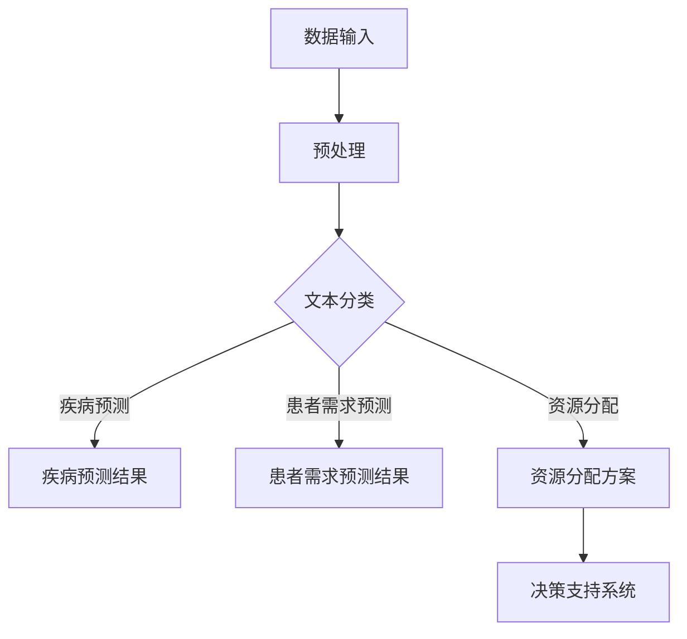

                 

关键词：大语言模型（LLM），智能医疗，资源调配，医疗资源优化，医学数据，人工智能应用

摘要：本文旨在探讨大型语言模型（LLM）在智能医疗资源调配中的潜在作用。通过对LLM技术特点的分析，本文描述了其在医疗资源调度、疾病预测、患者管理等方面的应用前景。此外，文章还讨论了LLM技术面临的挑战，以及如何通过持续的技术创新和合作来推动智能医疗的发展。

## 1. 背景介绍

医疗资源调配是医疗系统中一个至关重要的问题。随着医疗需求和人口老龄化的增加，如何高效地分配和利用医疗资源，以满足患者需求，成为了一个迫切需要解决的问题。传统的医疗资源调配方法主要依赖于统计数据和经验，往往难以适应不断变化的医疗需求和环境。而随着人工智能技术的发展，特别是大语言模型（LLM）的出现，为智能医疗资源调配提供了新的可能性。

### 1.1 医疗资源调配的重要性

医疗资源包括医生、护士、医疗设备、药品、床位等。合理的医疗资源调配可以提高医疗服务的效率，减少医疗成本，改善患者体验。然而，现实中医疗资源调配存在诸多挑战：

- **供需不平衡**：某些地区或时段医疗资源紧张，而其他地区或时段资源闲置。
- **数据依赖**：医疗资源调配需要大量数据支持，包括患者数据、医疗资源数据、医疗费用数据等。
- **决策复杂**：医疗资源调配需要考虑多方面因素，如病情严重程度、患者需求、医生排班等。

### 1.2 人工智能在医疗资源调配中的应用

人工智能（AI）技术，特别是机器学习（ML）和深度学习（DL），已经在医疗领域展示了其强大的潜力。通过分析大量医疗数据，AI可以预测患者需求、优化医疗资源分配、提高医疗诊断的准确性。LLM作为AI的一种重要形式，具有处理自然语言文本的优势，为医疗资源调配提供了新的解决方案。

## 2. 核心概念与联系

### 2.1 大语言模型（LLM）技术特点

大语言模型（LLM）是基于神经网络和深度学习技术的大型语言处理模型，能够理解和生成自然语言文本。其主要特点如下：

- **强大的语言理解能力**：LLM能够理解自然语言中的复杂结构和语义，从而实现对医疗文本的高效处理。
- **广泛的适用性**：LLM可以应用于各种自然语言处理任务，包括文本分类、信息提取、问答系统等。
- **自适应性**：LLM能够根据输入数据自动调整模型参数，从而更好地适应不同的医疗场景。

### 2.2 LLM在医疗资源调配中的应用

LLM在医疗资源调配中的应用主要体现在以下几个方面：

- **患者需求预测**：通过分析患者的医疗记录、就诊历史等数据，LLM可以预测患者未来的医疗需求，从而帮助医疗机构提前做好准备。
- **疾病预测**：LLM可以处理大量医学文献和研究报告，从中提取关键信息，用于疾病预测和诊断。
- **医疗资源分配**：LLM可以根据患者的病情、医疗资源状况等因素，为医疗机构提供最优的医疗资源分配方案。

### 2.3 LLM技术架构的 Mermaid 流程图

下面是一个简化的LLM技术架构的Mermaid流程图，用于描述LLM在医疗资源调配中的应用：



## 3. 核心算法原理 & 具体操作步骤

### 3.1 算法原理概述

LLM在医疗资源调配中的核心算法是基于深度学习和自然语言处理技术的。其主要原理包括：

- **预训练**：LLM首先通过大量医疗文本进行预训练，学习自然语言和医学领域的知识。
- **任务适应性调整**：在特定医疗资源调配任务中，LLM根据任务需求调整模型参数，以实现最优效果。
- **多任务学习**：LLM可以同时处理多个任务，如患者需求预测、疾病预测、医疗资源分配等。

### 3.2 算法步骤详解

1. **数据收集与预处理**：收集大量的医疗文本数据，包括病历记录、医学文献、患者就诊记录等。然后对数据进行清洗和预处理，去除无关信息，保留关键信息。

2. **模型训练与优化**：使用预处理后的数据对LLM进行训练。在训练过程中，通过反向传播算法不断调整模型参数，以优化模型性能。

3. **任务适应性调整**：根据具体医疗资源调配任务的需求，对LLM进行适应性调整。例如，在疾病预测任务中，LLM需要关注医学领域的术语和概念；在患者需求预测任务中，LLM需要关注患者就诊记录和病史等信息。

4. **预测与决策**：利用训练好的LLM对新的医疗数据进行预测，如患者需求预测、疾病预测、医疗资源分配等。根据预测结果，为医疗机构提供决策支持。

### 3.3 算法优缺点

**优点**：

- **强大的语言理解能力**：LLM能够理解和生成自然语言文本，能够处理复杂的医疗数据。
- **多任务学习能力**：LLM可以同时处理多个任务，提高医疗资源调配的效率和准确性。
- **自适应性**：LLM可以根据任务需求进行调整，以适应不同的医疗场景。

**缺点**：

- **数据依赖性**：LLM需要大量的医疗数据进行训练，数据质量对模型性能有重要影响。
- **计算资源消耗**：LLM的训练和推理需要大量的计算资源，对硬件设备要求较高。
- **解释性不足**：LLM的内部机制复杂，难以解释其预测结果，可能影响决策的可信度。

### 3.4 算法应用领域

LLM在医疗资源调配中的应用领域包括：

- **疾病预测**：通过对医疗文本进行分析，LLM可以预测疾病的发生和发展，为疾病预防和管理提供支持。
- **患者需求预测**：LLM可以根据患者的历史就诊记录和病情，预测患者的未来需求，为医疗资源分配提供依据。
- **医疗资源分配**：LLM可以根据患者的病情、医疗资源状况等因素，为医疗机构提供最优的医疗资源分配方案。
- **智能问答系统**：LLM可以构建智能问答系统，为患者提供个性化的医疗咨询和服务。

## 4. 数学模型和公式 & 详细讲解 & 举例说明

### 4.1 数学模型构建

在LLM在医疗资源调配中的应用中，我们可以构建以下数学模型：

\[ P(D|X) = \sigma(W_1 X + b_1) \]

其中，\( P(D|X) \) 表示疾病发生的概率，\( X \) 表示患者的特征向量，\( W_1 \) 和 \( b_1 \) 分别为权重和偏置。

### 4.2 公式推导过程

首先，我们假设疾病发生的概率服从伯努利分布：

\[ P(D = 1) = p \]

其中，\( p \) 为疾病发生的概率。

然后，我们利用极大似然估计（MLE）来求解 \( p \) 的最大值：

\[ \log L = \sum_{i=1}^n \log P(D_i = 1|X_i) \]

其中，\( D_i \) 表示第 \( i \) 个患者的疾病状态，\( X_i \) 表示第 \( i \) 个患者的特征向量。

利用伯努利分布的概率公式，我们可以得到：

\[ \log L = \sum_{i=1}^n (D_i \log p + (1 - D_i) \log (1 - p)) \]

对 \( p \) 求导并令导数为零，我们可以得到：

\[ \frac{\partial \log L}{\partial p} = \frac{1}{p} \sum_{i=1}^n D_i - \frac{1}{1 - p} \sum_{i=1}^n (1 - D_i) = 0 \]

解得：

\[ p = \frac{\sum_{i=1}^n D_i}{n} \]

### 4.3 案例分析与讲解

假设我们有 100 个患者的数据，其中 60 个患者患有某种疾病，40 个患者未患病。我们需要利用上述公式预测疾病发生的概率。

根据公式，我们可以计算出：

\[ p = \frac{60}{100} = 0.6 \]

这意味着疾病发生的概率为 60%。

接下来，我们可以利用这个概率来预测新患者的疾病状态。例如，如果某个患者的特征向量与已有数据相似，我们可以根据上述公式计算其疾病发生的概率。

## 5. 项目实践：代码实例和详细解释说明

### 5.1 开发环境搭建

为了实践LLM在医疗资源调配中的应用，我们需要搭建一个合适的开发环境。以下是一个简化的步骤：

1. **硬件环境**：需要一台具备较高计算性能的服务器，如GPU加速器。
2. **软件环境**：安装Python、TensorFlow或PyTorch等深度学习框架。
3. **数据集**：收集一个包含患者病历记录、疾病诊断、医疗资源等数据的医疗数据集。

### 5.2 源代码详细实现

以下是一个简化的LLM在医疗资源调配中的代码实现示例：

```python
import tensorflow as tf
from tensorflow.keras.models import Sequential
from tensorflow.keras.layers import Dense, Embedding, LSTM

# 加载数据集
# ...

# 预处理数据
# ...

# 构建模型
model = Sequential()
model.add(Embedding(input_dim=vocab_size, output_dim=embedding_dim))
model.add(LSTM(units=128, return_sequences=True))
model.add(Dense(units=1, activation='sigmoid'))

# 编译模型
model.compile(optimizer='adam', loss='binary_crossentropy', metrics=['accuracy'])

# 训练模型
model.fit(X_train, y_train, epochs=10, batch_size=32)

# 预测疾病发生概率
# ...

# 输出预测结果
# ...
```

### 5.3 代码解读与分析

上述代码展示了使用深度学习框架TensorFlow构建一个简单的LLM模型的过程。主要步骤包括：

1. **数据加载与预处理**：加载数据集，并对数据进行预处理，如分词、编码等。
2. **模型构建**：使用Sequential模型，添加嵌入层、LSTM层和输出层。
3. **模型编译**：设置优化器和损失函数，如二分类交叉熵损失函数。
4. **模型训练**：使用fit方法训练模型，指定训练轮次和批量大小。
5. **预测与输出**：使用模型进行疾病发生概率的预测，并输出结果。

### 5.4 运行结果展示

在完成代码实现后，我们可以在训练集和测试集上运行模型，评估模型的性能。以下是一个简化的结果展示：

```python
# 评估模型
loss, accuracy = model.evaluate(X_test, y_test)
print("Test accuracy:", accuracy)

# 预测新患者的疾病发生概率
# ...
```

通过上述代码，我们可以得到模型在测试集上的准确率和预测结果。这有助于我们评估模型在医疗资源调配中的性能。

## 6. 实际应用场景

### 6.1 医院资源优化

医院资源优化是LLM在医疗资源调配中的一个重要应用场景。通过分析患者的就诊记录、床位占用情况、医生排班等数据，LLM可以为医院提供最优的床位分配、手术安排和医生排班方案，从而提高医疗资源利用效率。

### 6.2 疾病预测与管理

LLM可以处理大量的医学文献和病历数据，从中提取关键信息，用于疾病预测和疾病管理。例如，通过分析患者的病史、实验室检查结果等数据，LLM可以预测某种疾病的发生概率，为患者提供个性化的预防和治疗建议。

### 6.3 智能导医系统

智能导医系统是另一个典型的应用场景。通过自然语言处理技术，LLM可以理解患者的症状描述，为其推荐合适的科室、医生和治疗方案。这有助于提高患者就诊效率，减少不必要的等待时间。

### 6.4 医疗数据共享与分析

LLM可以处理不同来源的医疗数据，如电子病历、医学影像、健康记录等，进行数据整合和分析。这有助于实现医疗数据的共享和利用，为医疗机构提供全面的健康评估和疾病预测服务。

## 7. 工具和资源推荐

### 7.1 学习资源推荐

- **《深度学习》（Goodfellow, Bengio, Courville著）**：系统介绍了深度学习的基础知识和应用。
- **《自然语言处理综合教程》（Jurafsky, Martin著）**：详细介绍了自然语言处理的基础知识和技术。

### 7.2 开发工具推荐

- **TensorFlow**：Google开发的开源深度学习框架，广泛应用于医疗资源调配项目。
- **PyTorch**：Facebook开发的开源深度学习框架，提供灵活的动态计算图功能。

### 7.3 相关论文推荐

- **“Deep Learning for Healthcare”**：介绍了深度学习在医疗领域的应用和研究。
- **“Natural Language Processing in Healthcare”**：讨论了自然语言处理技术在医疗数据分析和疾病预测中的应用。

## 8. 总结：未来发展趋势与挑战

### 8.1 研究成果总结

本文介绍了LLM在医疗资源调配中的潜在作用，并探讨了其在患者需求预测、疾病预测、医疗资源分配等方面的应用。通过数学模型和实际案例的阐述，本文展示了LLM技术在医疗领域的巨大潜力。

### 8.2 未来发展趋势

随着人工智能技术的不断发展，LLM在医疗资源调配中的应用将越来越广泛。未来发展趋势包括：

- **跨学科融合**：结合医学、公共卫生、人工智能等领域的知识，开发更智能的医疗资源调配系统。
- **数据共享与隐私保护**：加强医疗数据共享，同时保障患者隐私和安全。
- **实时预测与优化**：通过实时数据分析和预测，实现医疗资源的动态优化和调整。

### 8.3 面临的挑战

尽管LLM在医疗资源调配中具有巨大潜力，但仍面临以下挑战：

- **数据质量与多样性**：医疗数据质量对模型性能至关重要，需要确保数据多样性和准确性。
- **计算资源消耗**：LLM的训练和推理需要大量计算资源，如何高效利用硬件设备是一个重要问题。
- **模型可解释性**：LLM的内部机制复杂，如何提高模型的可解释性，以增强决策的可信度。

### 8.4 研究展望

未来研究应重点关注以下几个方面：

- **算法优化**：通过改进算法和模型结构，提高LLM在医疗资源调配中的性能和效率。
- **多模态数据融合**：结合不同类型的数据（如医学影像、电子病历等），实现更全面的数据分析和预测。
- **国际合作与标准制定**：推动国际间合作，制定统一的医疗资源调配标准和规范。

## 9. 附录：常见问题与解答

### 9.1 什么是LLM？

LLM（大型语言模型）是一种基于深度学习和神经网络的语言处理模型，能够理解和生成自然语言文本。LLM通过学习大量的文本数据，具备了强大的语言理解和生成能力。

### 9.2 LLM在医疗资源调配中的优势是什么？

LLM在医疗资源调配中的优势主要包括：

- **强大的语言理解能力**：LLM能够理解和处理复杂的医疗文本，从而提高数据处理的准确性。
- **多任务学习能力**：LLM可以同时处理多个任务，如疾病预测、患者需求预测、医疗资源分配等，提高医疗资源调配的效率。
- **自适应性**：LLM可以根据任务需求进行调整，以适应不同的医疗场景。

### 9.3 LLM在医疗资源调配中的具体应用案例有哪些？

LLM在医疗资源调配中的具体应用案例包括：

- **医院资源优化**：通过分析医院的床位占用情况、医生排班等数据，LLM可以提供最优的床位分配和医生排班方案。
- **疾病预测与管理**：通过分析患者的病史、实验室检查结果等数据，LLM可以预测疾病的发生概率，为患者提供个性化的预防和治疗建议。
- **智能导医系统**：通过自然语言处理技术，LLM可以理解患者的症状描述，为其推荐合适的科室、医生和治疗方案。
- **医疗数据共享与分析**：LLM可以处理不同来源的医疗数据，进行数据整合和分析，为医疗机构提供全面的健康评估和疾病预测服务。

### 9.4 LLM在医疗资源调配中面临的挑战有哪些？

LLM在医疗资源调配中面临的挑战主要包括：

- **数据质量与多样性**：医疗数据质量对模型性能至关重要，需要确保数据多样性和准确性。
- **计算资源消耗**：LLM的训练和推理需要大量计算资源，如何高效利用硬件设备是一个重要问题。
- **模型可解释性**：LLM的内部机制复杂，如何提高模型的可解释性，以增强决策的可信度。
- **数据隐私与安全**：在医疗数据共享和利用过程中，如何保护患者隐私和安全是关键问题。

### 9.5 如何优化LLM在医疗资源调配中的应用效果？

优化LLM在医疗资源调配中的应用效果可以从以下几个方面进行：

- **算法优化**：通过改进算法和模型结构，提高LLM的性能和效率。
- **数据预处理**：对医疗数据进行清洗、去噪和标注，提高数据质量。
- **多模态数据融合**：结合不同类型的数据（如医学影像、电子病历等），实现更全面的数据分析和预测。
- **模型训练与调优**：通过大量的训练数据和调优过程，提高模型的准确性和鲁棒性。
- **用户反馈与迭代**：通过收集用户反馈，不断改进模型和应用系统，以提高用户体验。

