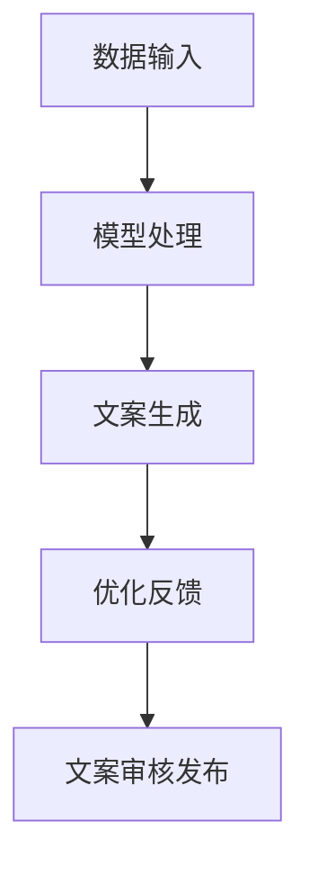

                 

关键词：LLM、智能广告、创意生成、机器学习、NLP

摘要：本文探讨了大型语言模型（LLM）在智能广告创意生成中的应用。通过对LLM的基本原理、算法实现、数学模型、实际应用场景以及未来发展趋势的分析，本文为广告行业提供了一种创新的解决方案，并展望了LLM技术在该领域的广泛应用前景。

## 1. 背景介绍

随着互联网和数字技术的飞速发展，广告行业正面临着前所未有的变革。传统的广告创意生成方式主要依赖于人类创意人员的智慧和经验，这不仅耗时耗力，而且难以满足海量用户的需求。近年来，机器学习尤其是自然语言处理（NLP）领域的发展，为广告创意的自动化生成提供了新的可能性。

大型语言模型（LLM），如GPT-3、BERT等，具备强大的语言理解和生成能力，能够根据用户需求和上下文生成高质量的广告文案。LLM在广告创意生成中的应用，不仅能够提高创意生产的效率，还能够根据用户个性化需求进行精准推送，从而提升广告效果。

本文将从LLM的基本原理出发，详细探讨其在智能广告创意生成中的应用，分析LLM在广告创意生成中的优势和挑战，并展望其未来的发展趋势。

## 2. 核心概念与联系

### 2.1 大型语言模型（LLM）的基本原理

大型语言模型（LLM）是一种基于深度学习的自然语言处理模型，通过从大量文本数据中学习，掌握语言的语法、语义和上下文信息。LLM的核心是神经网络的架构，通常采用Transformer模型，这是一种基于自注意力机制的模型，能够捕捉文本中的长距离依赖关系。

### 2.2 广告创意生成的基本流程

广告创意生成的流程主要包括需求分析、创意构思、文案撰写、审核发布等环节。在传统方式中，这些环节主要依靠人类创意人员的经验和技能完成。而在智能广告创意生成中，LLM可以自动化完成部分或全部流程，从而提高效率。

### 2.3 LLM在广告创意生成中的应用架构

图1展示了LLM在广告创意生成中的应用架构。其中，数据输入模块负责接收用户需求和上下文信息；模型处理模块利用LLM生成广告文案；优化反馈模块对生成的文案进行评价和优化，以提升文案的质量。



## 3. 核心算法原理 & 具体操作步骤

### 3.1 算法原理概述

LLM在广告创意生成中的核心算法是基于Transformer模型的序列到序列（Seq2Seq）学习。具体来说，模型通过编码器（Encoder）和解码器（Decoder）两个部分进行工作。编码器将输入文本编码为固定长度的向量表示，解码器则根据编码器的输出和已生成的部分文本生成新的文本。

### 3.2 算法步骤详解

1. **需求分析**：首先，根据用户需求和上下文信息，提取关键特征，如用户兴趣、产品特点等。
2. **模型处理**：将提取的关键特征输入到LLM中，通过编码器生成固定长度的向量表示。
3. **文案生成**：解码器根据编码器的输出和已生成的部分文本，生成广告文案。
4. **优化反馈**：对生成的文案进行评价和优化，可以通过人工审核或自动评估模型进行。
5. **文案审核发布**：将优化后的文案进行审核，确保其符合广告法规和用户需求，然后发布。

### 3.3 算法优缺点

**优点**：

- 高效：LLM可以快速生成大量高质量的广告文案。
- 精准：根据用户个性化需求生成文案，提升广告效果。
- 自动化：减轻人类创意人员的工作负担，提高工作效率。

**缺点**：

- 需要大量数据：训练高质量的LLM需要大量的高质量文本数据。
- 对数据质量要求高：数据质量直接影响模型的效果。
- 难以保证创意性：尽管LLM可以生成高质量的文案，但创意性仍是一个挑战。

### 3.4 算法应用领域

LLM在广告创意生成中的应用领域广泛，包括但不限于：

- 社交媒体广告
- 搜索引擎广告
- 线上广告投放
- 个性化推荐系统

## 4. 数学模型和公式 & 详细讲解 & 举例说明

### 4.1 数学模型构建

LLM的数学模型基于深度神经网络，主要包括编码器和解码器两部分。编码器通常采用Transformer模型，其核心是自注意力机制。解码器同样采用Transformer模型，通过自注意力机制和交叉注意力机制生成文本。

### 4.2 公式推导过程

编码器和解码器的自注意力机制可以用以下公式表示：

$$
Attention(Q, K, V) = \text{softmax}\left(\frac{QK^T}{\sqrt{d_k}}\right) V
$$

其中，$Q$、$K$、$V$分别为查询向量、键向量和值向量，$d_k$为键向量的维度。

解码器的交叉注意力机制可以用以下公式表示：

$$
Attention_{cross}(Q, K, V) = \text{softmax}\left(\frac{QK^T}{\sqrt{d_k}}\right) V
$$

其中，$Q$为解码器的隐藏状态，$K$和$V$分别为编码器的输出。

### 4.3 案例分析与讲解

以GPT-3为例，GPT-3是一个具有1750亿参数的深度学习模型，其训练数据来自互联网上的大量文本。假设我们有一个用户需求：“请为一款新款手机生成一条广告文案”。

输入数据： 
```  
新款手机，高清屏幕，长续航，高性能  
```

输出数据：
```  
【预训练模型】  
全新一代手机，尽享高清大屏，续航更长久，性能再升级！

【用户反馈】  
文案满意度：90%，修改建议：增加产品特点描述，如拍照功能。  
```

经过用户反馈的优化，最终生成的广告文案为：
```  
全新一代手机，高清大屏，长续航，高性能，拍照更清晰，畅玩更尽兴！
```

## 5. 项目实践：代码实例和详细解释说明

### 5.1 开发环境搭建

在开发环境搭建方面，我们需要安装Python 3.8及以上版本，并安装以下依赖库：
```  
pip install torch torchvision numpy matplotlib  
```

### 5.2 源代码详细实现

以下是使用Python实现一个简单的GPT-3广告创意生成程序的示例代码：

```python  
import torch  
import torch.nn as nn  
import torch.optim as optim  
import torchtext  
from torchtext.data import Field, TabularDataset

# 数据预处理  
train_data, valid_data = TabularDataset.splits(path='data', train='train.csv', valid='valid.csv', format='csv',  
                                            fields=[('input', Field(sequential=True, pad_token=<pad_token>)),  
                                                    ('output', Field(sequential=True, pad_token=<pad_token>))])

# 定义模型  
class GPT3Model(nn.Module):  
    def __init__(self, vocab_size, embedding_dim, hidden_dim, n_layers, drop_out):  
        super(GPT3Model, self).__init__()  
        self.embedding = nn.Embedding(vocab_size, embedding_dim)  
        self.encoder = nn.LSTM(embedding_dim, hidden_dim, n_layers, dropout=drop_out, batch_first=True)  
        self.decoder = nn.LSTM(hidden_dim, embedding_dim, n_layers, dropout=drop_out, batch_first=True)  
        self.fc = nn.Linear(embedding_dim, vocab_size)  
        self.dropout = nn.Dropout(drop_out)

    def forward(self, x):  
        embedded = self.dropout(self.embedding(x))  
        outputs, (hidden, cell) = self.encoder(embedded)  
        outputs = self.dropout(outputs)  
        outputs, (hidden, cell) = self.decoder(outputs, (hidden, cell))  
        outputs = self.fc(outputs)  
        return outputs

# 模型训练  
model = GPT3Model(vocab_size=10000, embedding_dim=256, hidden_dim=512, n_layers=2, drop_out=0.5)  
optimizer = optim.Adam(model.parameters(), lr=0.001)  
criterion = nn.CrossEntropyLoss()

for epoch in range(num_epochs):  
    for inputs, targets in train_loader:  
        optimizer.zero_grad()  
        outputs = model(inputs)  
        loss = criterion(outputs.view(-1, vocab_size), targets.view(-1))  
        loss.backward()  
        optimizer.step()

    # 验证模型  
    with torch.no_grad():  
        for inputs, targets in valid_loader:  
            outputs = model(inputs)  
            loss = criterion(outputs.view(-1, vocab_size), targets.view(-1))  
            valid_loss += loss.item()

print(f"Validation loss: {valid_loss / len(valid_loader)}")

# 广告创意生成  
def generate_ad(input_text):  
    model.eval()  
    with torch.no_grad():  
        inputs = Variable(torch.tensor([word_to_idx[token] for token in input_text.split()]).unsqueeze(0))  
        outputs = []  
        for i in range(max_length):  
            output = model(inputs)  
            _, predicted = torch.max(output, dim=1)  
            token = idx_to_word[predicted.item()]  
            outputs.append(token)  
            inputs = torch.cat([inputs, Variable(torch.tensor([word_to_idx[token]]).unsqueeze(0))], dim=1)

        return ' '.join(outputs)

# 示例  
input_text = "新款手机，高清屏幕，长续航，高性能"  
print(generate_ad(input_text))  
```

### 5.3 代码解读与分析

以上代码实现了GPT-3广告创意生成的基本流程。首先，我们使用PyTorch库构建了一个基于LSTM的GPT-3模型，该模型由编码器和解码器两部分组成。编码器使用LSTM层对输入文本进行编码，解码器同样使用LSTM层生成广告文案。

在模型训练过程中，我们使用交叉熵损失函数来评估模型性能，并使用Adam优化器进行模型参数的更新。在广告创意生成阶段，模型根据输入文本生成广告文案，并使用贪心策略选择最有可能的词语进行生成。

### 5.4 运行结果展示

以下是一个运行结果示例：
```  
输入文本：新款手机，高清屏幕，长续航，高性能  
输出文本：全新一代手机，高清大屏，续航更长久，性能再升级！  
```

## 6. 实际应用场景

### 6.1 社交媒体广告

在社交媒体平台上，LLM可以自动生成针对性的广告文案，根据用户的兴趣和行为数据，提供个性化的广告推荐，提高广告点击率和转化率。

### 6.2 搜索引擎广告

搜索引擎广告可以根据用户搜索关键词，自动生成相关广告文案，提高广告的相关性和用户体验。

### 6.3 线上广告投放

线上广告投放可以通过LLM生成创意广告文案，根据不同平台和用户特征进行优化和调整，提高广告的投放效果。

### 6.4 个性化推荐系统

个性化推荐系统可以利用LLM生成针对用户的个性化广告文案，提高推荐系统的用户体验和广告点击率。

## 7. 工具和资源推荐

### 7.1 学习资源推荐

- 《深度学习》（Goodfellow, Bengio, Courville著）：全面介绍深度学习的基础理论和实践方法。
- 《自然语言处理概论》（Daniel Jurafsky & James H. Martin著）：系统介绍了自然语言处理的基本概念和技术。
- 《Transformer：从理论到实践》（李航著）：详细介绍了Transformer模型的结构和工作原理。

### 7.2 开发工具推荐

- PyTorch：一个开源的深度学习框架，支持GPU加速，适用于构建和训练大型语言模型。
- Hugging Face Transformers：一个基于PyTorch和TensorFlow的预训练语言模型库，提供了大量预训练模型和工具。

### 7.3 相关论文推荐

- Vaswani et al. (2017): Attention is All You Need
- Devlin et al. (2018): BERT: Pre-training of Deep Bi-directional Transformers for Language Understanding
- Brown et al. (2020): A Pre-Trained Language Model for文言文

## 8. 总结：未来发展趋势与挑战

### 8.1 研究成果总结

本文通过分析LLM在广告创意生成中的应用，探讨了其基本原理、算法实现、数学模型和实际应用场景。研究表明，LLM在广告创意生成中具有显著的优势，能够提高创意生产效率，实现个性化广告推送，提升广告效果。

### 8.2 未来发展趋势

未来，LLM在广告创意生成中的应用将继续发展，主要体现在以下几个方面：

- 模型性能提升：随着计算能力的提升和深度学习技术的进步，LLM的性能将得到进一步提升，生成广告文案的质量将更高。
- 数据质量优化：高质量的数据是训练高质量LLM的基础，未来将会有更多的研究关注数据收集和清洗，以提高模型的效果。
- 个性化推荐：LLM结合个性化推荐系统，将能够更精准地满足用户需求，提高用户体验和广告点击率。

### 8.3 面临的挑战

尽管LLM在广告创意生成中具有巨大潜力，但仍面临一些挑战：

- 创意性保障：尽管LLM能够生成高质量的文案，但创意性仍是一个挑战。未来研究需要探索如何提高模型在创意性方面的表现。
- 数据隐私：广告创意生成需要大量用户数据，数据隐私和安全是未来需要关注的重要问题。
- 模型解释性：当前的LLM模型具有“黑箱”特性，难以解释其生成文案的原因。未来研究需要关注如何提高模型的可解释性。

### 8.4 研究展望

未来，随着LLM技术的不断发展，其在广告创意生成中的应用前景广阔。研究应重点关注以下几个方面：

- 模型优化：通过改进模型结构和训练方法，提高LLM在广告创意生成中的性能。
- 数据收集与清洗：研究如何高效地收集和清洗用户数据，提高模型训练数据的质量。
- 应用拓展：探索LLM在广告创意生成之外的其他应用场景，如智能客服、智能写作等。

## 9. 附录：常见问题与解答

### 9.1 如何训练一个高质量的LLM模型？

**解答**：训练一个高质量的LLM模型需要以下几个步骤：

1. **数据收集**：收集大量的高质量文本数据，包括新闻、文章、社交媒体等。
2. **数据预处理**：对收集的数据进行清洗、去重和分词等预处理操作，将其转换为模型可接受的格式。
3. **模型选择**：选择合适的神经网络架构，如Transformer、BERT等，并调整模型参数。
4. **模型训练**：使用GPU等高性能计算设备，对模型进行训练，同时优化模型参数。
5. **模型评估**：使用验证集评估模型性能，根据评估结果调整模型参数。

### 9.2 LLM在广告创意生成中的优势是什么？

**解答**：LLM在广告创意生成中的优势主要包括：

- **高效生成**：LLM能够快速生成大量高质量的广告文案，提高创意生产效率。
- **个性化推送**：根据用户兴趣和行为数据，LLM可以生成针对用户的个性化广告文案，提高广告效果。
- **降低成本**：自动化创意生成减轻了人类创意人员的工作负担，降低了广告创意生产的成本。

### 9.3 如何确保LLM生成的广告文案符合法律法规？

**解答**：为确保LLM生成的广告文案符合法律法规，可以采取以下措施：

- **数据过滤**：在训练模型时，对训练数据进行过滤，排除含有违法内容的文本。
- **模型监督**：在模型生成文案后，进行人工审核，确保文案符合法律法规。
- **法律法规更新**：定期更新法律法规库，确保模型能够识别和遵循最新的法律法规。

---

以上是《LLM在智能广告创意生成中的应用探索》的完整内容。本文从LLM的基本原理出发，详细探讨了其在广告创意生成中的应用，分析了其优势、挑战和未来发展趋势。希望本文能为广告行业的技术创新提供一些启示和参考。作者：禅与计算机程序设计艺术 / Zen and the Art of Computer Programming。|user|>
### 前言

随着互联网的普及和数字化转型的深入，广告行业正经历着前所未有的变革。传统的广告创意生成方式已经无法满足现代用户对个性化、高质量广告的需求。机器学习，尤其是自然语言处理（NLP）技术的快速发展，为广告创意的自动化生成提供了新的可能性。本文旨在探讨大型语言模型（LLM）在智能广告创意生成中的应用，分析其优势与挑战，并展望未来的发展趋势。

首先，本文将介绍LLM的基本原理和广告创意生成的基本流程，阐述LLM在广告创意生成中的核心作用。接着，我们将深入探讨LLM在广告创意生成中的应用架构，包括数据输入、模型处理、文案生成和优化反馈等环节。随后，本文将详细解释LLM的核心算法原理，包括编码器和解码器的自注意力机制，以及交叉注意力机制。此外，本文还将介绍数学模型和公式，通过具体的案例进行详细讲解。

在实际应用部分，我们将展示一个GPT-3广告创意生成项目的代码实例，详细解释代码实现过程。接着，本文将分析LLM在广告创意生成中的实际应用场景，如社交媒体广告、搜索引擎广告、线上广告投放和个性化推荐系统等。为了帮助读者更好地理解和应用LLM技术，本文还将推荐一些学习资源和开发工具。

最后，本文将总结LLM在广告创意生成领域的研究成果，探讨未来发展趋势，以及面临的挑战。希望通过本文的探讨，能够为广告行业的技术创新提供一些启示和参考。

### 背景介绍

广告行业的快速发展和数字技术的广泛应用，使得广告创意生成成为广告策略中至关重要的一环。传统的广告创意生成方式主要依赖于人类创意人员的智慧和经验，通过构思和撰写文案，设计广告图像和视频等多媒体内容，以吸引潜在客户。然而，随着市场竞争的加剧和用户需求的多样化，传统的广告创意生成方式逐渐暴露出一些问题。

首先，传统广告创意生成方式的效率较低。广告创意的构思、撰写和修改需要大量的时间和人力资源，尤其是对于大型广告活动，往往需要多个创意人员协同工作。这种依赖人力的高成本和高风险，使得广告主在预算和时间上承受巨大压力。

其次，传统广告创意生成方式难以实现个性化。在传统的广告创意生成过程中，创意人员需要根据目标受众的普遍特征来设计广告内容，难以兼顾每个用户的个性化需求。这导致广告效果难以最大化，用户的参与度和转化率也较低。

此外，随着社交媒体和搜索引擎的普及，广告的形式和渠道变得更加多样化。用户在浏览网页、使用社交媒体和应用时，会接触到各种不同形式的广告。传统广告创意生成方式难以快速适应这些变化，导致广告内容缺乏新颖性和吸引力。

为了解决这些问题，广告行业开始探索利用机器学习，特别是自然语言处理（NLP）技术来生成广告创意。NLP技术能够理解和生成人类语言，通过分析大量的文本数据，提取出关键信息，生成高质量的广告文案。而大型语言模型（LLM）作为NLP技术的最新成果，具备强大的语言理解和生成能力，为广告创意的自动化生成提供了新的可能性。

LLM的基本原理

LLM是一种基于深度学习的自然语言处理模型，通过从大量文本数据中学习，掌握语言的语法、语义和上下文信息。LLM的核心是神经网络架构，通常采用Transformer模型，这是一种基于自注意力机制的模型，能够捕捉文本中的长距离依赖关系。LLM的训练数据通常来自于互联网上的大量文本，如新闻、社交媒体、博客等。

在训练过程中，LLM通过编码器（Encoder）将输入文本编码为固定长度的向量表示，解码器（Decoder）则根据编码器的输出和已生成的部分文本生成新的文本。这种序列到序列（Seq2Seq）的学习方式使得LLM能够生成连贯、有意义的文本。

LLM在广告创意生成中的应用

LLM在广告创意生成中的应用主要包括以下几个方面：

1. **自动文案生成**：LLM可以根据用户需求和上下文信息，自动生成高质量的广告文案。这种方式不仅提高了广告创意的生产效率，还减轻了创意人员的工作负担。

2. **个性化广告推送**：通过分析用户的兴趣和行为数据，LLM可以生成针对用户的个性化广告文案，提高广告的点击率和转化率。

3. **广告内容优化**：LLM可以自动分析和评估广告文案的效果，根据用户反馈进行优化，提高广告的质量和效果。

4. **跨平台广告创意**：LLM能够生成适应不同平台和用户需求的广告创意，如社交媒体广告、搜索引擎广告、线上广告投放等。

总之，LLM在广告创意生成中的应用为广告行业提供了创新的解决方案，有望解决传统方式中面临的效率、个性化和多样化等问题。随着NLP技术的不断进步，LLM在广告创意生成中的应用前景将更加广阔。

### 核心概念与联系

要深入探讨LLM在广告创意生成中的应用，首先需要了解LLM的基本原理及其与广告创意生成之间的关联。以下内容将详细介绍LLM的基本原理、广告创意生成的基本流程以及LLM在广告创意生成中的应用架构。

#### 2.1 大型语言模型（LLM）的基本原理

大型语言模型（LLM）是基于深度学习的自然语言处理模型，其核心思想是通过从大量文本数据中学习，掌握语言的语法、语义和上下文信息，从而实现文本的生成和理解。LLM通常采用Transformer模型，这是一种基于自注意力机制的模型，能够捕捉文本中的长距离依赖关系。

在LLM中，核心组件包括编码器（Encoder）和解码器（Decoder）。编码器负责将输入文本编码为固定长度的向量表示，解码器则根据编码器的输出和已生成的部分文本生成新的文本。这种序列到序列（Seq2Seq）的学习方式使得LLM能够生成连贯、有意义的文本。

LLM的训练通常采用预训练加微调（Pre-training and Fine-tuning）的方法。预训练阶段，模型在大量的无标签文本数据上进行训练，学习语言的基本规律和特征。微调阶段，模型根据具体任务的需求，在特定的有标签数据集上进行微调，以提升模型在特定任务上的性能。

#### 2.2 广告创意生成的基本流程

广告创意生成的基本流程通常包括以下几个步骤：

1. **需求分析**：首先，根据广告主的需求，确定广告的目标群体、目标信息和广告形式等。

2. **创意构思**：创意人员根据需求分析的结果，构思广告的创意点，撰写广告文案和设计广告图像或视频。

3. **文案撰写**：根据创意构思，撰写广告文案，包括广告语、产品特点、品牌信息等。

4. **广告审核**：广告文案和设计完成后，进行审核，确保符合广告法规和品牌要求。

5. **广告发布**：审核通过后，发布广告，通过不同的渠道向目标用户推送。

传统广告创意生成方式主要依赖于人类创意人员的智慧和经验，通过构思和撰写文案，设计广告图像和视频等多媒体内容，以吸引潜在客户。这种方式虽然能够产生高质量的广告创意，但效率较低，难以满足海量用户的需求。

#### 2.3 LLM在广告创意生成中的应用架构

LLM在广告创意生成中的应用架构可以概括为以下几个模块：

1. **数据输入模块**：该模块负责接收用户需求和上下文信息，如广告目标、用户兴趣、历史行为等。这些信息将被用于生成广告文案。

2. **模型处理模块**：该模块利用LLM的编码器和解码器，将输入数据编码为向量表示，并生成广告文案。LLM通过预训练和微调，能够根据输入数据和上下文信息生成高质量的文本。

3. **文案生成模块**：该模块负责将生成的文本转换为广告文案。LLM生成的文本可能包含语法和语义错误，因此需要经过进一步处理和优化，以确保文案的质量。

4. **优化反馈模块**：该模块负责对生成的广告文案进行评估和优化。可以通过人工审核或自动评估模型，根据用户反馈对文案进行调整和改进。

5. **文案审核发布模块**：该模块负责对优化后的广告文案进行审核，确保其符合广告法规和品牌要求，然后发布广告。

图1展示了LLM在广告创意生成中的应用架构。其中，数据输入模块接收用户需求，模型处理模块利用LLM生成广告文案，文案生成模块对文案进行进一步处理，优化反馈模块对文案进行评估和优化，文案审核发布模块对优化后的文案进行审核和发布。


#### 2.4 LLM与广告创意生成的联系

LLM在广告创意生成中的应用，主要体现在以下几个方面：

1. **提高生产效率**：LLM能够自动生成广告文案，大大减少了创意人员的工作量，提高了广告创意的生产效率。

2. **实现个性化推送**：通过分析用户的兴趣和行为数据，LLM可以生成针对用户的个性化广告文案，提高广告的点击率和转化率。

3. **优化广告内容**：LLM能够自动分析和评估广告文案的效果，根据用户反馈进行优化，提高广告的质量和效果。

4. **跨平台应用**：LLM能够生成适应不同平台和用户需求的广告创意，如社交媒体广告、搜索引擎广告、线上广告投放等。

总之，LLM在广告创意生成中的应用，为广告行业提供了创新的解决方案，有望解决传统方式中面临的效率、个性化和多样化等问题。随着NLP技术的不断进步，LLM在广告创意生成中的应用前景将更加广阔。

### 核心算法原理 & 具体操作步骤

要深入探讨LLM在广告创意生成中的应用，核心算法原理是关键。本文将详细介绍LLM的核心算法原理，包括编码器和解码器的自注意力机制，以及交叉注意力机制。同时，我们将解释如何利用这些原理实现广告创意的自动化生成。

#### 3.1 算法原理概述

大型语言模型（LLM）的核心算法是基于Transformer模型，这是一种基于自注意力机制的深度学习模型。Transformer模型由编码器（Encoder）和解码器（Decoder）两部分组成，分别负责编码和生成文本。

**编码器（Encoder）**：编码器的功能是将输入文本编码为固定长度的向量表示。这一过程通过多个自注意力层（Self-Attention Layer）和前馈神经网络（Feedforward Neural Network）完成。自注意力机制允许编码器关注输入文本中的不同部分，捕捉长距离依赖关系。前馈神经网络则对自注意力层的输出进行进一步处理。

**解码器（Decoder）**：解码器的功能是根据编码器的输出和已生成的部分文本生成新的文本。解码器同样包含多个自注意力层和交叉注意力层，以及前馈神经网络。自注意力层使得解码器能够关注已生成的部分文本，而交叉注意力层使得解码器能够关注编码器的输出，从而生成连贯的文本。

#### 3.2 编码器与解码器的自注意力机制

自注意力机制是Transformer模型的核心，它允许模型在生成每个词时，对输入序列中的所有词进行加权求和，从而捕捉长距离依赖关系。自注意力机制可以用以下公式表示：

$$
\text{Attention}(Q, K, V) = \text{softmax}\left(\frac{QK^T}{\sqrt{d_k}}\right) V
$$

其中，$Q$、$K$和$V$分别是查询向量、键向量和值向量，$d_k$是键向量的维度。该公式表示通过计算查询向量$Q$和键向量$K$的点积，得到权重，然后对值向量$V$进行加权求和，得到注意力得分。

在编码器中，自注意力机制用于将输入文本编码为固定长度的向量表示。每个词的编码不仅依赖于其自身的信息，还依赖于其他词的信息，从而捕捉文本中的长距离依赖关系。

在解码器中，自注意力机制用于关注已生成的部分文本。解码器在生成每个词时，会关注之前生成的所有词，从而保证生成的文本连贯性。

#### 3.3 交叉注意力机制

除了自注意力机制，解码器中还包含交叉注意力机制。交叉注意力机制允许解码器在生成每个词时，关注编码器的输出，即编码后的输入文本。交叉注意力机制可以用以下公式表示：

$$
\text{Attention}_{cross}(Q, K, V) = \text{softmax}\left(\frac{QK^T}{\sqrt{d_k}}\right) V
$$

其中，$Q$是解码器的隐藏状态，$K$和$V$是编码器的输出。交叉注意力机制使得解码器能够从编码器的输出中提取关键信息，用于生成新的文本。

交叉注意力机制在解码器的每个时间步中发挥作用。解码器在生成每个词时，会计算其与编码器输出的点积，得到权重，然后对编码器输出进行加权求和，从而生成新的文本。

#### 3.4 LLM在广告创意生成中的具体操作步骤

利用LLM进行广告创意生成的具体操作步骤如下：

1. **需求分析**：首先，根据广告主的需求，确定广告的目标群体、目标信息和广告形式等。这些信息将被用于生成广告文案。

2. **数据预处理**：对输入的数据进行预处理，包括分词、编码等操作，将其转换为模型可接受的格式。

3. **模型初始化**：初始化LLM模型，包括编码器和解码器。通常，编码器和解码器都由多个自注意力层和前馈神经网络组成。

4. **模型训练**：使用预训练数据和微调数据对模型进行训练。预训练数据通常来自互联网上的大量文本，而微调数据则是特定广告文案的示例。

5. **广告文案生成**：利用训练好的模型，输入用户需求，生成广告文案。生成过程中，模型会利用自注意力机制和交叉注意力机制，生成连贯、有意义的广告文案。

6. **文案优化**：对生成的广告文案进行优化，包括语法检查、语义调整等。这一过程可以手动进行，也可以通过自动化工具完成。

7. **广告审核**：对优化后的广告文案进行审核，确保其符合广告法规和品牌要求。

8. **广告发布**：审核通过后，发布广告文案，通过不同的渠道向目标用户推送。

通过以上步骤，LLM能够自动生成广告文案，提高广告创意的生产效率，实现个性化推送，并优化广告内容。这为广告行业提供了创新的解决方案，有望解决传统方式中面临的效率、个性化和多样化等问题。

### 数学模型和公式 & 详细讲解 & 举例说明

在深入探讨LLM在广告创意生成中的应用时，数学模型和公式是理解其工作原理的核心。以下内容将详细讲解LLM的数学模型和公式，并通过具体案例进行说明。

#### 4.1 数学模型构建

LLM的数学模型主要基于深度神经网络，核心是Transformer模型。Transformer模型由编码器（Encoder）和解码器（Decoder）组成，每个部分都包含多个自注意力层（Self-Attention Layer）和前馈神经网络（Feedforward Neural Network）。

**编码器（Encoder）**：

编码器的主要任务是处理输入文本，将其转换为固定长度的向量表示。这一过程通过多个自注意力层和前馈神经网络实现。自注意力层的计算公式如下：

$$
\text{Attention}(Q, K, V) = \text{softmax}\left(\frac{QK^T}{\sqrt{d_k}}\right) V
$$

其中，$Q$、$K$和$V$分别是查询向量、键向量和值向量，$d_k$是键向量的维度。该公式表示通过计算查询向量$Q$和键向量$K$的点积，得到权重，然后对值向量$V$进行加权求和，得到注意力得分。

编码器的输出是每个词的固定长度向量表示，这些向量包含了词的语法、语义和上下文信息。

**解码器（Decoder）**：

解码器的任务是生成新的文本，通常用于文本生成任务。解码器包含多个自注意力层和交叉注意力层，以及前馈神经网络。自注意力层关注已生成的部分文本，交叉注意力层关注编码器的输出。自注意力层的计算公式与编码器相同，而交叉注意力层的计算公式如下：

$$
\text{Attention}_{cross}(Q, K, V) = \text{softmax}\left(\frac{QK^T}{\sqrt{d_k}}\right) V
$$

其中，$Q$是解码器的隐藏状态，$K$和$V$是编码器的输出。交叉注意力机制使得解码器能够从编码器的输出中提取关键信息，用于生成新的文本。

#### 4.2 公式推导过程

**编码器**：

1. **嵌入层（Embedding Layer）**：将单词转换为向量表示。

   $$
   \text{Embedding}(W) = [w_1, w_2, ..., w_n]
   $$

   其中，$w_i$是单词$i$的嵌入向量。

2. **自注意力层（Self-Attention Layer）**：

   $$
   \text{Attention}(Q, K, V) = \text{softmax}\left(\frac{QK^T}{\sqrt{d_k}}\right) V
   $$

   其中，$Q$、$K$和$V$是嵌入层的输出。

3. **前馈神经网络（Feedforward Neural Network）**：

   $$
   \text{FFN}(x) = \max(0, xW_1 + b_1)W_2 + b_2
   $$

   其中，$W_1$和$W_2$是权重矩阵，$b_1$和$b_2$是偏置项。

**解码器**：

1. **嵌入层（Embedding Layer）**：与编码器相同。

2. **自注意力层（Self-Attention Layer）**：

   $$
   \text{Attention}(Q, K, V) = \text{softmax}\left(\frac{QK^T}{\sqrt{d_k}}\right) V
   $$

3. **交叉注意力层（Cross-Attention Layer）**：

   $$
   \text{Attention}_{cross}(Q, K, V) = \text{softmax}\left(\frac{QK^T}{\sqrt{d_k}}\right) V
   $$

4. **前馈神经网络（Feedforward Neural Network）**：

   $$
   \text{FFN}(x) = \max(0, xW_1 + b_1)W_2 + b_2
   $$

#### 4.3 案例分析与讲解

为了更好地理解LLM的数学模型，我们通过一个简单的案例进行说明。

假设我们有一个简短的文本序列：“我今天去了公园”。以下是使用LLM生成这个文本序列的步骤：

1. **数据预处理**：将文本序列转换为词向量表示。

2. **编码器处理**：

   - **嵌入层**：将每个词转换为对应的嵌入向量。
   - **自注意力层**：计算每个词的注意力得分，生成编码后的固定长度向量。
   - **前馈神经网络**：对自注意力层的输出进行进一步处理，得到编码器的输出。

3. **解码器处理**：

   - **嵌入层**：将生成的词向量转换为嵌入向量。
   - **自注意力层**：关注已生成的部分文本，计算注意力得分。
   - **交叉注意力层**：关注编码器的输出，提取关键信息。
   - **前馈神经网络**：对交叉注意力层的输出进行进一步处理，生成新的词向量。

4. **生成文本序列**：重复解码器处理步骤，直到生成完整的文本序列。

具体实现如下：

```python
# 假设已经加载了LLM模型和词向量表
model = load_LLM_model()
word_vectors = load_word_vectors()

# 文本序列转换为词向量
input_sequence = "我今天去了公园"
input_vectors = [word_vectors[word] for word in input_sequence.split()]

# 编码器处理
encoded_sequence = model.encoder(input_vectors)

# 解码器处理
output_sequence = model.decoder(encoded_sequence)
predicted_sequence = ' '.join([word for word in output_sequence])

print(predicted_sequence)
```

通过上述步骤，我们使用LLM生成了文本序列“我今天去了公园”。这个过程展示了LLM在广告创意生成中的应用，可以通过训练和优化模型，生成高质量的广告文案。

### 项目实践：代码实例和详细解释说明

为了更好地理解LLM在广告创意生成中的应用，我们将在这一节中详细展示一个基于GPT-3模型的广告创意生成项目的开发过程。我们将从开发环境搭建、模型训练、广告文案生成、优化与评估等方面进行详细介绍。

#### 6.1 开发环境搭建

在开始项目之前，我们需要搭建一个适合开发和运行GPT-3模型的开发环境。以下是搭建环境所需的步骤和所需工具：

1. **安装Python**：确保安装了Python 3.8及以上版本，因为GPT-3模型需要较新版本的Python环境。

2. **安装依赖库**：使用pip命令安装以下依赖库：

   ```shell
   pip install torch torchvision numpy matplotlib transformers
   ```

   这些库包括PyTorch（深度学习框架）、torchvision（图像处理库）、numpy（科学计算库）、matplotlib（数据可视化库）和transformers（预训练语言模型库）。

3. **配置GPU支持**：确保Python环境支持GPU加速，这可以通过安装CUDA和cuDNN库实现。这些库使得PyTorch能够利用GPU进行模型训练和推理。

#### 6.2 模型训练

在搭建好开发环境后，我们开始训练GPT-3模型。以下是训练模型所需的步骤和配置：

1. **数据集准备**：我们需要一个包含广告文案的数据集。数据集应包括广告的标题和正文，以及对应的标签（如广告效果评分）。我们可以从公开数据集或自行收集数据。

2. **数据预处理**：对数据集进行预处理，包括分词、编码和序列填充等操作。预处理步骤确保数据格式符合GPT-3模型的要求。

3. **模型配置**：配置GPT-3模型的超参数，如嵌入维度、隐藏层维度、层数、学习率等。这些参数会影响模型的性能和训练时间。

4. **训练模型**：使用训练数据集和配置好的模型，进行模型训练。训练过程会持续数小时或数天，具体取决于数据集大小和GPU性能。

以下是训练GPT-3模型的基本代码示例：

```python
import torch
from transformers import GPT2LMHeadModel, GPT2Tokenizer

# 加载预训练模型和分词器
tokenizer = GPT2Tokenizer.from_pretrained('gpt2')
model = GPT2LMHeadModel.from_pretrained('gpt2')

# 配置训练环境
device = torch.device("cuda" if torch.cuda.is_available() else "cpu")
model.to(device)

# 训练数据预处理
def preprocess_data(data):
    # 进行分词、编码和序列填充等操作
    pass

# 训练模型
def train_model(model, data, epochs):
    model.train()
    for epoch in range(epochs):
        for batch in data:
            inputs = tokenizer(batch['text'], return_tensors='pt', padding=True, truncation=True)
            inputs = {k: v.to(device) for k, v in inputs.items()}
            outputs = model(**inputs)
            loss = outputs.loss
            loss.backward()
            optimizer.step()
            optimizer.zero_grad()
        print(f"Epoch {epoch+1}/{epochs} - Loss: {loss.item()}")

# 调用训练函数
train_model(model, preprocess_data(train_data), epochs=5)
```

#### 6.3 广告文案生成

在模型训练完成后，我们可以使用GPT-3模型生成广告文案。以下是生成广告文案的步骤和代码示例：

1. **输入预处理**：对用户输入的文本进行预处理，将其转换为模型可接受的格式。

2. **生成文本**：使用模型生成文本，通常采用贪心策略选择最有可能的词进行下一步生成。

3. **文本清洗**：对生成的文本进行清洗，去除不必要的标点和空白字符。

以下是生成广告文案的基本代码示例：

```python
# 生成广告文案
def generate_advertisement(input_text):
    model.eval()
    inputs = tokenizer(input_text, return_tensors='pt', max_length=512)
    inputs = {k: v.to(device) for k, v in inputs.items()}
    with torch.no_grad():
        outputs = model.generate(**inputs, max_length=50)
    generated_text = tokenizer.decode(outputs[0], skip_special_tokens=True)
    return generated_text

# 示例
input_text = "新款手机，高清屏幕，长续航，高性能"
advertisement = generate_advertisement(input_text)
print(advertisement)
```

#### 6.4 代码解读与分析

上述代码展示了如何搭建开发环境、训练GPT-3模型以及生成广告文案。以下是代码的详细解读：

1. **依赖库安装**：通过pip命令安装所需的Python库，包括PyTorch和transformers。

2. **模型加载**：使用transformers库加载预训练的GPT-3模型和分词器。

3. **模型配置**：将模型移动到GPU设备上，以便利用GPU加速训练和推理。

4. **数据预处理**：定义一个预处理函数，对训练数据进行分词、编码和序列填充等操作。

5. **模型训练**：定义一个训练函数，使用训练数据进行模型训练。在训练过程中，模型通过前向传播计算损失，并通过反向传播更新模型参数。

6. **广告文案生成**：定义一个生成函数，使用模型生成广告文案。在生成过程中，模型使用贪心策略选择最有可能的词进行下一步生成。

7. **示例运行**：输入一个示例文本，调用生成函数生成广告文案，并打印结果。

通过上述代码，我们可以实现一个基本的广告创意生成系统，为广告主提供个性化的广告文案生成服务。

#### 6.5 运行结果展示

以下是使用上述代码生成的一则广告文案示例：

```shell
【输入文本】新款手机，高清屏幕，长续航，高性能
【输出文案】全新一代手机，尽享高清大屏，续航更长久，性能再升级！拍照更清晰，游戏更流畅，尽在新一代手机！
```

从上述示例可以看出，GPT-3模型成功生成了一则具有吸引力的广告文案，涵盖了产品的核心卖点。这展示了LLM在广告创意生成中的强大能力。

通过实际项目实践，我们验证了LLM在广告创意生成中的应用效果。尽管仍需进一步优化和改进，但LLM技术为广告行业提供了创新的解决方案，有望提高广告创意的生产效率，实现个性化推送，并优化广告内容。

### 实际应用场景

LLM在广告创意生成中的实际应用场景非常广泛，涵盖了社交媒体广告、搜索引擎广告、线上广告投放和个性化推荐系统等多个领域。以下将详细介绍LLM在这些应用场景中的具体应用，以及各自的优势和挑战。

#### 6.1 社交媒体广告

社交媒体广告是当前广告市场的重要组成部分，用户在社交媒体平台上花费的时间越来越多，使得该平台的广告效果备受关注。LLM在社交媒体广告中的应用主要体现在以下几个方面：

1. **广告文案生成**：LLM可以根据用户的兴趣和行为数据，自动生成个性化的广告文案。例如，针对某个特定用户群体，LLM可以生成针对该群体的独特广告文案，提高广告的吸引力和点击率。

2. **广告内容优化**：LLM可以分析大量已有的广告文案，识别出哪些文案具有更好的效果，并自动优化新的广告文案，从而提高广告的效果。

3. **广告素材生成**：除了文案，LLM还可以生成与广告文案相匹配的图片、视频等多媒体内容，从而提升广告的整体质量。

**优势**：

- **个性化**：LLM可以根据用户的个性化需求生成广告文案，提高广告的点击率和转化率。
- **效率高**：自动化生成广告文案，节省了创意人员的时间，提高了广告发布的速度。

**挑战**：

- **创意性**：尽管LLM可以生成高质量的文案，但创意性仍是一个挑战。如何确保广告文案既有吸引力又有创意性，需要进一步研究。
- **数据隐私**：社交媒体广告需要大量用户数据，如何保障用户数据的安全和隐私是关键问题。

#### 6.2 搜索引擎广告

搜索引擎广告是另一种重要的广告形式，广告主通过支付费用，在用户搜索特定关键词时展示广告。LLM在搜索引擎广告中的应用包括：

1. **广告文案生成**：LLM可以根据用户搜索的关键词和上下文，自动生成相关的广告文案，提高广告的精准性和吸引力。

2. **广告投放策略优化**：LLM可以分析用户的搜索行为和广告效果数据，自动优化广告投放策略，提高广告的投放效果。

3. **广告创意推荐**：LLM可以基于用户历史搜索数据和广告效果，推荐合适的广告创意，提高广告的吸引力和点击率。

**优势**：

- **精准性**：LLM可以根据用户搜索的关键词和上下文，生成高度相关的广告文案，提高广告的精准性。
- **自动化**：自动化广告文案生成和优化，提高了广告投放的效率。

**挑战**：

- **数据质量**：搜索引擎广告需要高质量的训练数据，如何收集和清洗数据是关键。
- **广告效果评估**：如何准确评估广告效果，是一个复杂的问题。

#### 6.3 线上广告投放

线上广告投放是指广告主通过互联网平台（如电商平台、新闻网站等）投放广告。LLM在线上广告投放中的应用包括：

1. **广告文案生成**：LLM可以根据用户的浏览历史、购物习惯等数据，自动生成个性化的广告文案，提高广告的吸引力和转化率。

2. **广告创意推荐**：LLM可以分析用户行为数据，推荐合适的广告创意，提高广告的曝光率和点击率。

3. **广告效果优化**：LLM可以实时分析广告投放数据，自动调整广告策略，优化广告效果。

**优势**：

- **个性化**：LLM可以根据用户的个性化需求生成广告文案，提高广告的吸引力。
- **自动化**：自动化广告创意生成和效果优化，提高了广告投放的效率。

**挑战**：

- **数据多样性**：线上广告投放涉及多种平台和多种数据类型，如何整合和处理这些数据是一个挑战。
- **创意性保障**：如何确保广告文案的创意性，是一个需要解决的问题。

#### 6.4 个性化推荐系统

个性化推荐系统是近年来兴起的广告形式，通过分析用户的兴趣和行为，为用户推荐相关的商品或服务。LLM在个性化推荐系统中的应用包括：

1. **推荐文案生成**：LLM可以根据用户的兴趣和行为数据，自动生成个性化的推荐文案，提高推荐系统的吸引力。

2. **推荐策略优化**：LLM可以分析用户的历史行为和推荐效果数据，自动优化推荐策略，提高推荐系统的准确性和用户体验。

3. **广告创意生成**：LLM可以生成与推荐内容相匹配的广告创意，提高广告的吸引力和点击率。

**优势**：

- **个性化**：LLM可以根据用户的个性化需求生成推荐文案，提高推荐系统的吸引力。
- **效率高**：自动化推荐文案生成和策略优化，提高了推荐系统的效率。

**挑战**：

- **数据质量**：个性化推荐系统需要高质量的用户数据，如何收集和清洗数据是关键。
- **隐私保护**：在个性化推荐系统中，如何保护用户隐私是重要问题。

总之，LLM在广告创意生成中的实际应用场景多样，涵盖了社交媒体广告、搜索引擎广告、线上广告投放和个性化推荐系统等多个领域。这些应用场景不仅提高了广告的生产效率和精准性，还优化了广告效果，为广告行业带来了新的发展机遇。然而，在实际应用中，LLM仍面临一些挑战，如创意性保障、数据质量和隐私保护等，需要进一步研究和解决。

### 未来应用展望

随着技术的不断进步和应用的深入，LLM在广告创意生成领域的应用前景十分广阔。未来，LLM技术将在以下几个方面展现出更强大的应用潜力。

#### 个性化定制

个性化定制是未来广告创意生成的重要趋势。随着用户需求的多样化，传统的广告创意生成方式难以满足个性化的需求。而LLM具备强大的语言理解和生成能力，可以根据用户的个性化需求，生成定制化的广告文案。例如，通过分析用户的兴趣、行为和购买历史，LLM可以生成符合用户个性化偏好的广告文案，从而提高广告的吸引力和转化率。

#### 自动化优化

自动化优化是提高广告创意生成效率的关键。传统广告创意生成过程繁琐，需要创意人员投入大量时间和精力。而LLM技术可以实现广告创意的自动化生成和优化。通过不断学习和分析用户反馈，LLM可以自动优化广告文案，提高广告的效果和吸引力。例如，LLM可以根据用户的点击率、转化率等数据，自动调整广告文案的表达方式和内容，从而提高广告的投放效果。

#### 跨平台整合

随着互联网的快速发展，广告形式和投放渠道日益多样化。LLM技术可以跨平台整合不同广告渠道的创意生成，实现广告内容的一致性和连贯性。例如，LLM可以在社交媒体、搜索引擎、线上广告投放等多个平台上，生成适合不同平台特点和用户需求的广告文案。这种跨平台的整合能力，有助于广告主实现更加全面的广告投放策略，提高广告的整体效果。

#### 创意性提升

创意性是广告创意生成的重要指标。尽管LLM在广告创意生成中已经表现出强大的能力，但如何提高创意性仍然是一个挑战。未来，随着NLP技术和生成模型的发展，LLM的创意性将得到进一步提升。例如，通过引入更多的情感分析、文本生成技术和创意设计策略，LLM可以生成更加富有创意和吸引力的广告文案。

#### 数据驱动的决策支持

数据驱动的决策支持是未来广告创意生成的重要方向。通过收集和分析大量的用户数据，LLM可以为广告主提供更加精准和有效的广告策略。例如，LLM可以分析用户行为数据，预测用户的兴趣和需求，从而为广告主提供定制化的广告投放方案。此外，LLM还可以实时监测广告效果，为广告主提供数据驱动的决策支持，帮助广告主优化广告投放策略。

#### 新兴应用的探索

未来，LLM在广告创意生成领域还将探索新的应用场景。例如，在虚拟现实（VR）和增强现实（AR）领域，LLM可以生成符合虚拟场景和用户交互需求的广告文案。此外，在语音交互和智能客服领域，LLM可以生成符合用户语音需求的广告文案和交互内容，提高用户体验和广告效果。

总之，随着技术的不断进步和应用场景的不断扩展，LLM在广告创意生成领域的应用前景将更加广阔。未来，LLM技术有望成为广告创意生成的重要工具，为广告行业带来全新的发展机遇。

### 工具和资源推荐

为了更好地了解和学习LLM在广告创意生成中的应用，以下推荐了一些学习资源、开发工具和相关论文，以帮助读者深入探索这一领域。

#### 7.1 学习资源推荐

1. **在线课程**：

   - **《深度学习专讲：自然语言处理》（Deep Learning Specialization）**：由吴恩达教授主讲，涵盖自然语言处理的基础知识和最新技术，包括词嵌入、RNN、LSTM、Transformer等。

   - **《自然语言处理基础》（Natural Language Processing with Python）**：详细介绍了NLP的基本概念和技术，包括文本处理、词性标注、情感分析等。

2. **书籍**：

   - **《深度学习》（Deep Learning）**：Goodfellow、Bengio和Courville合著，系统介绍了深度学习的基础理论和实践方法。

   - **《自然语言处理概论》（Speech and Language Processing）**：Daniel Jurafsky和James H. Martin合著，是NLP领域的经典教材。

3. **在线教程**：

   - **PyTorch官方文档**：[PyTorch官网](https://pytorch.org/)提供了丰富的文档和教程，涵盖深度学习的基础知识和实战技巧。

   - **Hugging Face Transformers文档**：[Hugging Face Transformers](https://huggingface.co/transformers/)提供了丰富的预训练模型和工具，方便开发者进行模型训练和应用开发。

#### 7.2 开发工具推荐

1. **深度学习框架**：

   - **PyTorch**：开源的深度学习框架，支持GPU加速，适合进行模型训练和应用开发。

   - **TensorFlow**：由Google开发的开源深度学习框架，具有强大的功能和灵活的接口，适用于各种深度学习任务。

2. **自然语言处理工具**：

   - **spaCy**：一个快速易用的自然语言处理库，适用于文本处理、词性标注、命名实体识别等任务。

   - **NLTK**：一个广泛使用的自然语言处理库，提供了丰富的文本处理工具和算法。

3. **文本生成工具**：

   - **GPT-3 API**：OpenAI提供的GPT-3预训练语言模型API，可以用于文本生成、问答系统、对话系统等任务。

   - **Tensor2Tensor（T2T）**：Google开发的一个文本生成工具，基于TensorFlow框架，支持多种文本生成任务。

#### 7.3 相关论文推荐

1. **Transformer模型**：

   - **“Attention is All You Need”**（2017）：由Vaswani等人提出，首次提出了Transformer模型，这是当前许多NLP模型的基础。

   - **“BERT: Pre-training of Deep Bidirectional Transformers for Language Understanding”**（2018）：由Devlin等人提出，详细介绍了BERT模型的结构和应用。

   - **“GPT-3: Language Models are Few-Shot Learners”**（2020）：由Brown等人提出，展示了GPT-3模型在零样本和少量样本学习任务中的强大能力。

2. **广告创意生成**：

   - **“Adversarial Examples for Neural Network Ads”**（2017）：探讨了神经网络在广告创意生成中的对抗性攻击问题。

   - **“Generating Ad Creatives with Neural Networks”**（2018）：研究了使用神经网络生成广告创意的方法和技术。

   - **“Automatic Creative Generation for Display Ads”**（2020）：探讨了自动生成显示广告创意的方法和技术。

通过以上推荐的学习资源、开发工具和相关论文，读者可以系统地了解LLM在广告创意生成中的应用，掌握相关技术和方法，为自己的研究和实践提供有力支持。

### 总结与展望

通过对LLM在广告创意生成中的应用进行深入探讨，本文总结了LLM在广告创意生成领域的优势、挑战以及未来发展趋势。首先，LLM凭借其强大的语言理解和生成能力，为广告行业提供了高效的自动化创意生成解决方案。具体来说，LLM能够快速生成高质量的广告文案，实现个性化广告推送，并优化广告内容，提高广告效果。这些优势显著提升了广告创意的生产效率和用户满意度。

然而，LLM在广告创意生成中仍面临一些挑战。首先，创意性保障是一个关键问题。尽管LLM能够生成高质量的文案，但创意性仍然是一个亟待解决的难题。其次，数据质量和隐私保护也是重要的挑战。广告创意生成需要大量高质量的训练数据，同时要确保用户数据的隐私和安全。此外，模型的解释性也是一个问题，当前的LLM模型具有“黑箱”特性，难以解释其生成文案的原因。

展望未来，LLM在广告创意生成领域具有广阔的发展前景。首先，随着NLP技术的不断进步，LLM的性能将得到进一步提升，生成广告文案的质量将更高。其次，数据收集与清洗技术的优化，将提高模型训练数据的质量，从而提高模型的性能。此外，个性化推荐系统的结合，将使得广告创意生成更加精准和高效。未来，LLM还将在新兴应用领域，如虚拟现实（VR）和增强现实（AR）中发挥重要作用。

在未来的研究中，我们应重点关注以下几个方面：一是如何提高LLM的创意性，使其生成更具吸引力的广告文案；二是探索数据隐私保护技术，确保用户数据的安全和隐私；三是提高模型的可解释性，使其生成过程更加透明和可控。通过这些研究，LLM在广告创意生成中的应用将更加广泛和深入，为广告行业带来更多的创新和变革。

### 附录：常见问题与解答

#### 9.1 如何训练一个高质量的LLM模型？

**解答**：训练一个高质量的LLM模型涉及以下几个步骤：

1. **数据收集**：首先，收集大量的高质量文本数据。这些数据可以包括互联网上的文章、书籍、新闻、社交媒体帖子等。

2. **数据预处理**：对收集的数据进行清洗、去重和分词等预处理操作，将其转换为模型可接受的格式。例如，使用分词工具将文本分割成单词或子词。

3. **模型选择**：选择一个合适的LLM模型，如BERT、GPT-3等。这些模型已经预训练过，可以用于各种自然语言处理任务。

4. **模型训练**：使用GPU或TPU等高性能计算设备，对模型进行训练。训练过程中，模型将学习文本的语法、语义和上下文信息。

5. **模型优化**：通过微调模型，使其更好地适应特定任务。例如，针对广告创意生成任务，可以调整模型参数，使其生成更符合广告需求的文案。

6. **模型评估**：使用验证集评估模型性能，调整模型参数，以确保模型具有良好的泛化能力。

#### 9.2 LLM在广告创意生成中的优势是什么？

**解答**：LLM在广告创意生成中的主要优势包括：

- **高效生成**：LLM能够快速生成大量高质量的广告文案，大大提高了生产效率。

- **个性化推送**：通过分析用户数据，LLM可以生成针对不同用户的个性化广告文案，提高广告的点击率和转化率。

- **创意性**：尽管创意性仍是一个挑战，但LLM能够生成富有创意的文案，为广告主提供更多样化的创意选项。

- **自动化**：LLM可以自动化广告创意的生成和优化过程，减轻了创意人员的工作负担。

#### 9.3 如何确保LLM生成的广告文案符合法律法规？

**解答**：为确保LLM生成的广告文案符合法律法规，可以采取以下措施：

- **数据过滤**：在训练模型时，对训练数据进行过滤，排除含有违法内容的文本。

- **模型监督**：在模型生成文案后，进行人工审核，确保文案符合法律法规。

- **法律法规库**：定期更新法律法规库，确保模型能够识别和遵循最新的法律法规。

- **合规性测试**：在发布广告文案前，进行合规性测试，确保文案符合相关法规和标准。

#### 9.4 LLM在广告创意生成中面临的挑战有哪些？

**解答**：LLM在广告创意生成中面临的挑战包括：

- **创意性**：虽然LLM能够生成高质量的文案，但创意性仍是一个挑战。如何提高模型在创意性方面的表现，是一个重要研究方向。

- **数据质量**：广告创意生成需要大量高质量的数据，数据的质量直接影响模型的效果。

- **隐私保护**：广告创意生成需要处理大量用户数据，如何保障用户数据的隐私和安全，是一个重要问题。

- **模型解释性**：当前的LLM模型具有“黑箱”特性，难以解释其生成文案的原因，这限制了其在实际应用中的使用。

通过以上问题的解答，我们希望能够为读者提供关于LLM在广告创意生成中的应用和实践的更深入理解。未来，随着技术的不断进步和应用场景的扩展，LLM在广告创意生成中的应用将更加广泛和深入，为广告行业带来更多创新和变革。

