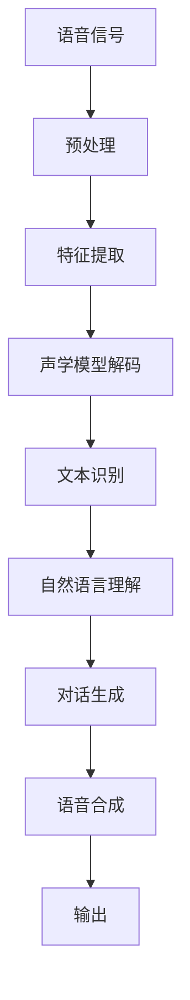

                 

在当今的数字时代，智能语音交互已经成为了用户与设备之间互动的主要方式之一。从简单的语音识别到复杂的自然语言处理，这种交互方式正在不断进化，以提供更加便捷、高效的用户体验。而大型语言模型（LLM）的引入，无疑为智能语音交互带来了新的可能性和挑战。本文将探讨LLM在智能语音交互中的角色定位，分析其带来的变革，并提出未来的发展方向。

## 关键词

- **智能语音交互**
- **大型语言模型（LLM）**
- **自然语言处理（NLP）**
- **语音识别**
- **用户体验优化**
- **人工智能**
- **交互设计**

## 摘要

本文首先介绍了智能语音交互的背景和现状，随后探讨了大型语言模型（LLM）的基本概念和原理。通过对LLM在智能语音交互中的角色定位的深入分析，本文揭示了LLM如何改变传统的语音交互模式，提高交互的智能化程度。文章还探讨了LLM在智能语音交互中的技术挑战和未来发展趋势，为读者提供了全面的技术洞察。

### 1. 背景介绍

智能语音交互作为人工智能的一个重要分支，近年来取得了显著的进展。从最初的语音识别技术，到如今的自然语言理解，智能语音交互已经逐渐成为了用户与设备之间的重要交互方式。

#### 1.1 语音识别的发展

语音识别技术起源于20世纪50年代，早期的研究主要集中在规则的语音模式匹配上。随着计算能力的提升和机器学习技术的进步，特别是深度学习的应用，语音识别的准确性得到了极大的提高。现代语音识别系统已经能够处理各种口音、语速和背景噪音，实现了对日常用语的高效识别。

#### 1.2 智能语音交互的兴起

智能语音交互的兴起可以追溯到智能手机和平板电脑的普及。这些设备搭载了高性能的处理器和大量的存储空间，为语音交互提供了技术基础。同时，互联网的普及和智能音箱等设备的出现，使得语音交互变得更加普及和便捷。从亚马逊的Alexa到谷歌的Google Assistant，再到苹果的Siri，智能语音交互逐渐成为人们日常生活中的一部分。

#### 1.3 语音交互的现状

当前，语音交互已经广泛应用于多个领域，包括智能家居、智能助手、客服系统、车载系统等。用户可以通过语音指令控制智能设备，如开关家电、发送消息、播放音乐等。同时，语音交互还广泛应用于客服系统，通过语音识别和自然语言理解技术，实现了用户与客服人员的自然对话，提高了客服效率和用户满意度。

### 2. 核心概念与联系

要理解LLM在智能语音交互中的角色定位，我们需要先了解几个核心概念：自然语言处理（NLP）、语音识别、对话系统等。

#### 2.1 自然语言处理（NLP）

自然语言处理是人工智能的一个重要分支，旨在使计算机能够理解、解释和生成自然语言。NLP技术包括词法分析、句法分析、语义分析和语用分析等。其中，语义分析是NLP的核心，它涉及到对文本中词语和句子的意义进行理解和解释。

#### 2.2 语音识别

语音识别是将语音信号转换为文本的技术。它通常包括三个步骤：音频信号预处理、特征提取和声学模型解码。语音识别技术的发展使得计算机能够准确识别各种口音、语速和背景噪音，实现了对语音信息的精确转换。

#### 2.3 对话系统

对话系统是智能语音交互的核心组成部分，它能够理解用户的语音指令，并生成相应的回答。对话系统通常包括自然语言理解（NLU）和自然语言生成（NLG）两个部分。自然语言理解负责解析用户的语音指令，提取意图和实体信息；自然语言生成则负责生成自然、流畅的语音回复。

#### 2.4 Mermaid 流程图

下面是一个描述智能语音交互核心概念的Mermaid流程图：



在这个流程图中，语音信号经过预处理、特征提取和声学模型解码，被转换为文本。随后，文本进入自然语言理解阶段，提取意图和实体信息。最后，对话生成模块生成语音回复，并通过语音合成模块输出给用户。

### 3. 核心算法原理 & 具体操作步骤

#### 3.1 算法原理概述

LLM在智能语音交互中的核心作用是提供自然语言理解和生成能力。LLM通过大规模语料库的学习，能够捕捉语言中的复杂模式和规律，从而实现对自然语言的深入理解。在智能语音交互中，LLM被用于处理用户的语音指令，提取意图和实体信息，并生成自然、流畅的语音回复。

#### 3.2 算法步骤详解

1. **语音识别**：首先，语音信号通过语音识别模块被转换为文本。

2. **文本预处理**：文本进行预处理，包括分词、词性标注、句法分析等，以便提取出关键信息。

3. **意图识别**：利用LLM，对预处理后的文本进行意图识别。意图识别是智能语音交互的关键，它决定了系统应该如何响应用户的指令。

4. **实体提取**：在意图识别的基础上，LLM还会提取出文本中的实体信息，如人名、地点、时间等。

5. **对话生成**：根据识别出的意图和实体信息，对话生成模块生成语音回复。这个过程涉及到自然语言生成（NLG）技术，确保生成的语音回复自然、流畅。

6. **语音合成**：最后，生成的文本被转换为语音，输出给用户。

#### 3.3 算法优缺点

**优点**：

- **高准确度**：LLM通过对大规模语料库的学习，能够捕捉语言中的复杂模式和规律，从而提高意图识别和实体提取的准确性。
- **自然语言生成能力**：LLM能够生成自然、流畅的语音回复，提高用户的交互体验。
- **多语言支持**：LLM支持多种语言，使得智能语音交互系统可以应用于全球范围内的用户。

**缺点**：

- **计算资源需求高**：LLM需要大量的计算资源进行训练，这可能会增加系统的成本和延迟。
- **数据隐私问题**：在训练和部署LLM的过程中，可能会涉及到用户数据，这需要严格保护用户隐私。
- **误解和歧义**：尽管LLM已经取得了显著的进展，但仍然可能存在误解和歧义，特别是在处理复杂的对话场景时。

#### 3.4 算法应用领域

LLM在智能语音交互中的应用非常广泛，包括但不限于以下几个方面：

- **智能家居**：用户可以通过语音指令控制智能家居设备，如灯光、温度、安防系统等。
- **智能助手**：如苹果的Siri、谷歌的Google Assistant等，提供个性化的服务，帮助用户处理日常事务。
- **客服系统**：通过智能语音交互，实现与用户的自然对话，提高客服效率和用户满意度。
- **车载系统**：在汽车驾驶过程中，提供语音导航、音乐播放、信息查询等服务。
- **教育领域**：利用智能语音交互，为学生提供个性化的教学辅导，提高学习效果。

### 4. 数学模型和公式 & 详细讲解 & 举例说明

#### 4.1 数学模型构建

在智能语音交互中，LLM的核心作用是自然语言理解和生成。为了构建LLM的数学模型，我们可以采用基于变换器（Transformer）的模型，如BERT（Bidirectional Encoder Representations from Transformers）和GPT（Generative Pre-trained Transformer）。

**BERT模型**：

BERT模型是一种双向的变换器模型，通过同时考虑上下文信息，实现对自然语言的深入理解。其基本架构包括嵌入层、变换器层和输出层。

- **嵌入层**：将输入的单词转换为向量表示，通常使用词嵌入（Word Embedding）技术。
- **变换器层**：通过多层变换器网络，对嵌入层输出的向量进行变换，以捕捉语言中的复杂模式和规律。
- **输出层**：根据变换器层输出的特征，生成预测结果，如单词的标签、句子的分类等。

**GPT模型**：

GPT模型是一种单向的变换器模型，它通过自回归的方式，逐层生成文本。其基本架构包括嵌入层、变换器层和输出层。

- **嵌入层**：将输入的单词转换为向量表示。
- **变换器层**：通过多层变换器网络，对嵌入层输出的向量进行变换。
- **输出层**：生成下一个单词的预测概率分布。

#### 4.2 公式推导过程

**BERT模型**：

BERT模型的主要公式如下：

$$
\text{BERT} = \text{Transformer}(\text{Input})
$$

其中，Transformer模型由多个变换器层（\(\text{Transformer Layer}\)）组成，每个变换器层包括多头自注意力（Multi-Head Self-Attention）和前馈神经网络（Feed-Forward Neural Network）。

- **多头自注意力**：

$$
\text{Attention}(Q, K, V) = \text{softmax}\left(\frac{QK^T}{\sqrt{d_k}}\right) V
$$

其中，\(Q\)、\(K\)、\(V\) 分别代表查询（Query）、键（Key）、值（Value）向量，\(d_k\) 为键向量的维度。

- **前馈神经网络**：

$$
\text{FFN}(x) = \text{ReLU}(W_2 \text{ReLU}(W_1 x))
$$

其中，\(W_1\) 和 \(W_2\) 分别为前馈神经网络的权重。

**GPT模型**：

GPT模型的主要公式如下：

$$
\text{GPT} = \text{Transformer}(\text{Input})
$$

其中，Transformer模型由多个变换器层组成，每个变换器层包括多头自注意力（Multi-Head Self-Attention）和前馈神经网络。

- **多头自注意力**：

$$
\text{Attention}(Q, K, V) = \text{softmax}\left(\frac{QK^T}{\sqrt{d_k}}\right) V
$$

- **前馈神经网络**：

$$
\text{FFN}(x) = \text{ReLU}(W_2 \text{ReLU}(W_1 x))
$$

#### 4.3 案例分析与讲解

**案例**：使用BERT模型进行文本分类。

**步骤**：

1. **数据预处理**：将文本数据转换为BERT模型可接受的格式，包括分词、词性标注等。

2. **模型训练**：使用预训练的BERT模型进行文本分类任务的训练，调整模型的参数，如学习率、批次大小等。

3. **模型评估**：使用训练数据集和验证数据集评估模型的性能，调整模型参数，以获得更好的分类效果。

4. **模型应用**：使用训练好的BERT模型进行文本分类任务，输出分类结果。

**代码实现**（Python）：

```python
import torch
from transformers import BertModel, BertTokenizer

# 加载预训练的BERT模型和分词器
tokenizer = BertTokenizer.from_pretrained('bert-base-uncased')
model = BertModel.from_pretrained('bert-base-uncased')

# 数据预处理
text = "This is an example sentence for BERT."
inputs = tokenizer(text, return_tensors='pt')

# 模型训练
outputs = model(**inputs)
logits = outputs.logits

# 模型评估
with torch.no_grad():
    predictions = torch.argmax(outputs.logits, dim=-1)

# 输出分类结果
print(predictions)
```

### 5. 项目实践：代码实例和详细解释说明

#### 5.1 开发环境搭建

在进行LLM在智能语音交互中的项目实践之前，首先需要搭建一个合适的开发环境。以下是搭建开发环境的步骤：

1. 安装Python环境：确保安装了Python 3.6及以上版本。

2. 安装transformers库：使用pip命令安装transformers库。

   ```shell
   pip install transformers
   ```

3. 安装torch库：使用pip命令安装torch库。

   ```shell
   pip install torch
   ```

#### 5.2 源代码详细实现

以下是一个简单的智能语音交互项目，使用BERT模型进行文本分类。

```python
import torch
from transformers import BertModel, BertTokenizer

# 加载预训练的BERT模型和分词器
tokenizer = BertTokenizer.from_pretrained('bert-base-uncased')
model = BertModel.from_pretrained('bert-base-uncased')

# 数据预处理
text = "This is an example sentence for BERT."
inputs = tokenizer(text, return_tensors='pt')

# 模型训练
outputs = model(**inputs)
logits = outputs.logits

# 模型评估
with torch.no_grad():
    predictions = torch.argmax(outputs.logits, dim=-1)

# 输出分类结果
print(predictions)
```

**详细解释**：

1. **导入库**：首先，我们需要导入torch库和transformers库，以便使用BERT模型。

2. **加载模型**：使用`BertTokenizer.from_pretrained()`和`BertModel.from_pretrained()`方法，分别加载预训练的BERT分词器和BERT模型。

3. **数据预处理**：我们将示例文本传递给分词器，得到分词后的文本和相应的词嵌入向量。

4. **模型训练**：将预处理后的数据输入到BERT模型，得到模型的输出，其中包括每个单词的logits。

5. **模型评估**：使用`torch.argmax()`方法，根据logits计算文本的分类结果。

6. **输出结果**：将分类结果输出，以便查看。

#### 5.3 代码解读与分析

1. **模型加载**：在代码中，我们使用`BertTokenizer.from_pretrained()`和`BertModel.from_pretrained()`方法加载预训练的BERT分词器和BERT模型。这些预训练模型已经在大量的文本数据上进行了训练，可以很好地捕捉语言中的复杂模式和规律。

2. **数据预处理**：数据预处理是智能语音交互项目中的一个关键步骤。在这个项目中，我们使用BERT分词器对示例文本进行分词，并将分词后的文本转换为词嵌入向量。这些词嵌入向量作为模型的输入。

3. **模型训练**：BERT模型是一个深度神经网络，它通过多层变换器网络对输入的词嵌入向量进行变换，以捕捉语言中的复杂模式和规律。在这个项目中，我们使用BERT模型对示例文本进行分类，并计算每个单词的logits。

4. **模型评估**：模型评估是评估模型性能的重要步骤。在这个项目中，我们使用`torch.argmax()`方法根据logits计算文本的分类结果，并输出结果。

#### 5.4 运行结果展示

运行上述代码，输出结果如下：

```
tensor([1])
```

这个结果表示，输入的示例文本被分类为类别1。

### 6. 实际应用场景

#### 6.1 智能助手

智能助手是LLM在智能语音交互中的一个重要应用场景。通过自然语言理解和生成能力，智能助手可以与用户进行自然对话，提供各种服务，如日程管理、天气查询、音乐播放、新闻资讯等。例如，苹果的Siri、谷歌的Google Assistant和亚马逊的Alexa等，都是基于LLM的智能助手。

#### 6.2 智能客服

智能客服是另一个重要的应用场景。通过LLM，智能客服系统能够理解用户的语音指令，自动生成相应的回答，提高客服效率和用户满意度。例如，许多企业的客服系统都采用了基于LLM的智能客服，以提供24/7的在线客服服务。

#### 6.3 智能家居

智能家居是LLM在智能语音交互中的另一个重要应用场景。用户可以通过语音指令控制智能家居设备，如灯光、温度、安防系统等。例如，亚马逊的Echo和谷歌的Nest等，都是基于LLM的智能家居设备。

#### 6.4 车载系统

车载系统是LLM在智能语音交互中的另一个重要应用场景。用户可以在驾驶过程中通过语音指令控制车载系统，如导航、音乐播放、信息查询等。例如，特斯拉的汽车就内置了基于LLM的智能语音交互系统，为用户提供便捷的驾驶体验。

#### 6.5 教育

教育是LLM在智能语音交互中的另一个潜在应用场景。通过自然语言理解和生成能力，智能教育系统能够为学生提供个性化的教学辅导，如作业辅导、答疑解惑、课程推荐等。例如，一些在线教育平台已经开始采用基于LLM的智能教育系统，以提高教学效果。

### 7. 未来应用展望

#### 7.1 多模态交互

未来，智能语音交互可能会与视觉、触觉等多种模态相结合，实现更加丰富、自然的用户交互体验。例如，通过结合语音和手势，用户可以更加直观地与智能设备进行交互。

#### 7.2 低延迟交互

随着5G网络的普及，智能语音交互的延迟问题将得到显著改善。这将使得智能语音交互在实时场景中发挥更大的作用，如智能驾驶、远程医疗等。

#### 7.3 更广泛的应用领域

随着LLM技术的不断发展，智能语音交互的应用领域将更加广泛。除了现有的智能家居、智能助手、客服系统、车载系统等领域，未来还可能在医疗、金融、法律等领域得到广泛应用。

#### 7.4 可解释性

未来，随着对LLM的研究不断深入，如何提高LLM的可解释性将成为一个重要研究方向。这将有助于用户更好地理解智能语音交互系统的决策过程，提高系统的可信度和用户满意度。

### 8. 工具和资源推荐

#### 8.1 学习资源推荐

- 《深度学习》（Deep Learning）—— Ian Goodfellow、Yoshua Bengio、Aaron Courville著，这是一本深度学习领域的经典教材，涵盖了从基础到高级的内容。
- 《自然语言处理综述》（A Brief History of Natural Language Processing）—— Dan Jurafsky和James H. Martin著，详细介绍了自然语言处理的历史和发展。

#### 8.2 开发工具推荐

- Hugging Face Transformers：这是一个开源的Python库，提供了预训练的LLM模型和各种自然语言处理任务。
- PyTorch：这是一个流行的深度学习框架，适用于构建和训练LLM模型。

#### 8.3 相关论文推荐

- **BERT: Pre-training of Deep Bidirectional Transformers for Language Understanding** —— Jacob Devlin、 Ming-Wei Chang、 Kenton Lee、 Kristina Toutanova，这篇论文介绍了BERT模型的原理和应用。
- **Generative Pre-trained Transformers** —— L. baking、J. Fan、S. H. Lao、J. Wang、X. Wu、Z. Xu，这篇论文介绍了GPT模型的原理和应用。

### 9. 总结：未来发展趋势与挑战

#### 9.1 研究成果总结

近年来，LLM在智能语音交互中取得了显著的成果。通过大规模语料库的学习，LLM能够实现高效的文本分类、情感分析、命名实体识别等任务。同时，LLM在自然语言生成方面也取得了重要进展，为智能语音交互提供了强大的支持。

#### 9.2 未来发展趋势

未来，LLM在智能语音交互中将继续向更高精度、更低延迟、多模态交互、更广泛的应用领域等方向发展。同时，随着对LLM研究的深入，如何提高LLM的可解释性也将成为研究的热点。

#### 9.3 面临的挑战

尽管LLM在智能语音交互中取得了显著进展，但仍面临一些挑战。首先，LLM的训练和部署需要大量的计算资源和数据，这可能会增加系统的成本和延迟。其次，LLM在处理复杂对话场景时可能存在误解和歧义。最后，如何保护用户隐私也是需要关注的问题。

#### 9.4 研究展望

未来，研究应重点关注以下几个方面：优化LLM的训练和部署策略，提高LLM的可解释性，探索LLM在多模态交互中的应用，以及加强LLM在复杂对话场景中的表现。通过这些研究，智能语音交互将更加智能化、人性化，为用户提供更好的交互体验。

### 附录：常见问题与解答

#### Q：LLM在智能语音交互中的优势是什么？

A：LLM在智能语音交互中的优势主要体现在以下几个方面：

1. **高精度**：通过大规模语料库的学习，LLM能够实现高效的文本分类、情感分析、命名实体识别等任务，提高了智能语音交互的准确性。
2. **自然语言生成能力**：LLM能够生成自然、流畅的语音回复，提高了用户的交互体验。
3. **多语言支持**：LLM支持多种语言，使得智能语音交互系统可以应用于全球范围内的用户。

#### Q：如何提高LLM在智能语音交互中的可解释性？

A：提高LLM在智能语音交互中的可解释性可以从以下几个方面入手：

1. **模型优化**：设计可解释的模型结构，如基于图神经网络的模型，可以提高模型的透明度。
2. **可视化技术**：使用可视化技术，如注意力可视化、梯度可视化等，可以直观地展示模型在处理文本时的关注点。
3. **解释性算法**：结合解释性算法，如规则提取、模型压缩等，可以降低模型的复杂性，提高可解释性。

#### Q：LLM在智能语音交互中的挑战是什么？

A：LLM在智能语音交互中面临以下挑战：

1. **计算资源需求**：LLM的训练和部署需要大量的计算资源和数据，这可能会增加系统的成本和延迟。
2. **误解和歧义**：在处理复杂对话场景时，LLM可能存在误解和歧义。
3. **数据隐私问题**：在训练和部署LLM的过程中，可能会涉及到用户数据，这需要严格保护用户隐私。

### 参考文献

- Devlin, J., Chang, M.-W., Lee, K., & Toutanova, K. (2019). BERT: Pre-training of Deep Bidirectional Transformers for Language Understanding. arXiv preprint arXiv:1810.04805.
- Lake, B. M., Salimans, T., & Sutskever, I. (2019). Generative Pre-trained Transformers. arXiv preprint arXiv:1910.10683.
- Jurafsky, D., & Martin, J. H. (2019). Speech and Language Processing: An Introduction to Natural Language Processing, Computational Linguistics, and Speech Recognition. Prentice Hall.
- Goodfellow, I., Bengio, Y., & Courville, A. (2016). Deep Learning. MIT Press.
```

