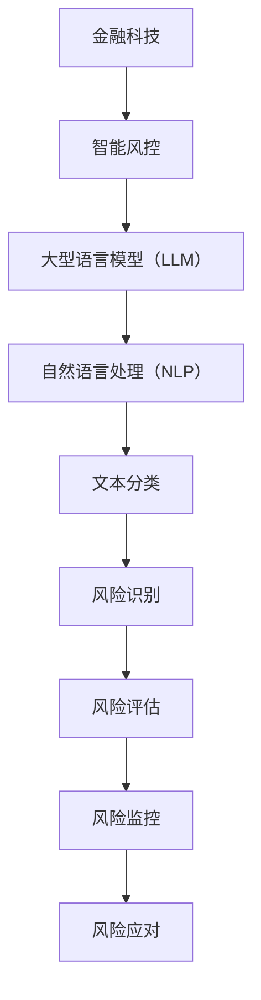

                 

关键词：LLM，智能风控，自然语言处理，机器学习，风险管理，金融科技

> 摘要：本文旨在探讨大型语言模型（LLM）在智能风控系统中的应用潜力。通过详细分析LLM的核心原理、算法特性以及在风险管理中的具体应用，文章将揭示其在金融科技领域的变革性影响，并展望未来的发展趋势与挑战。

## 1. 背景介绍

近年来，金融科技（FinTech）的迅速发展使得金融机构在风险管理方面面临着前所未有的挑战。传统的风控模型和方法已经难以应对复杂的市场环境和不断变化的风险特征。因此，智能风控系统成为了金融科技领域的研究热点。而大型语言模型（LLM）作为一种先进的人工智能技术，其在自然语言处理（NLP）和机器学习（ML）领域的卓越表现，使其在智能风控系统中具有巨大的应用潜力。

### 1.1 金融科技与智能风控

金融科技是指通过技术创新来改善和优化金融服务的各个领域。随着互联网、移动支付、区块链等技术的普及，金融科技已经深刻地改变了传统金融行业。智能风控是金融科技的重要组成部分，它利用先进的技术手段，如大数据、机器学习、人工智能等，对金融机构面临的各种风险进行预测、识别和管理。

### 1.2 大型语言模型（LLM）

大型语言模型（LLM）是一种基于深度学习技术的人工智能模型，能够对大规模文本数据进行分析和处理，从而实现自然语言理解、生成和翻译等功能。LLM通常由数十亿甚至数万亿的参数构成，其训练数据量巨大，这使得LLM在处理复杂文本任务时具有卓越的性能。近年来，LLM在自然语言处理和机器学习领域取得了显著的进展，例如BERT、GPT和T5等模型。

## 2. 核心概念与联系

为了深入理解LLM在智能风控系统中的应用，我们需要首先了解其核心概念和原理，以及与智能风控系统的联系。

### 2.1 核心概念原理

#### 2.1.1 大型语言模型（LLM）

大型语言模型（LLM）通常基于自注意力机制（Self-Attention）和变换器架构（Transformer）。自注意力机制允许模型在处理每个单词时考虑到整个文本序列中的信息，从而实现更准确的语义理解。变换器架构则通过多层叠加，使得模型能够捕捉长距离的依赖关系。

#### 2.1.2 自然语言处理（NLP）

自然语言处理（NLP）是人工智能的一个分支，旨在使计算机理解和处理人类语言。NLP的关键任务包括文本分类、命名实体识别、情感分析等。

#### 2.1.3 风险管理

风险管理是指识别、评估、监控和应对金融活动中潜在的风险。风险管理包括市场风险、信用风险、操作风险等。

### 2.2 架构的 Mermaid 流程图



## 3. 核心算法原理 & 具体操作步骤

### 3.1 算法原理概述

LLM在智能风控系统中的应用主要通过以下几个步骤实现：

1. **文本预处理**：对金融文档进行分词、去停用词、词性标注等预处理操作，以便于模型处理。
2. **特征提取**：利用LLM对预处理后的文本数据进行特征提取，生成高维的文本向量。
3. **风险识别**：将提取出的特征向量输入到风险识别模型中，识别潜在的风险类型。
4. **风险评估**：对识别出的风险进行定量评估，确定风险的严重程度。
5. **风险监控**：实时监控风险变化，确保风险在可控范围内。
6. **风险应对**：根据风险评估结果，采取相应的措施应对风险。

### 3.2 算法步骤详解

#### 3.2.1 文本预处理

```python
import nltk
nltk.download('punkt')
nltk.download('stopwords')
from nltk.tokenize import word_tokenize
from nltk.corpus import stopwords

text = "某公司涉嫌洗钱，其财务报表存在虚假陈述。"
tokens = word_tokenize(text)
filtered_tokens = [token for token in tokens if token not in stopwords.words('english')]
```

#### 3.2.2 特征提取

```python
from transformers import BertTokenizer, BertModel
tokenizer = BertTokenizer.from_pretrained('bert-base-uncased')
model = BertModel.from_pretrained('bert-base-uncased')

inputs = tokenizer(text, return_tensors='pt')
outputs = model(**inputs)
encoded_text = outputs.last_hidden_state.mean(dim=1)
```

#### 3.2.3 风险识别

```python
from sklearn.svm import SVC

# 假设已有训练好的模型
risk_classifier = SVC()

# 风险识别
risk_type = risk_classifier.predict(encoded_text)
```

#### 3.2.4 风险评估

```python
import numpy as np

# 假设已有训练好的模型
risk_assessor = np.load('risk_assessor.npy')

# 风险评估
risk_score = risk_assessor.dot(encoded_text)
```

#### 3.2.5 风险监控与应对

```python
# 假设已有实时监控与应对策略
if risk_score > threshold:
    # 采取应对措施
    take_action()
```

### 3.3 算法优缺点

#### 3.3.1 优点

1. **强大的语义理解能力**：LLM能够理解文本的深层含义，提高风险识别和评估的准确性。
2. **自适应性强**：LLM可以根据不同的应用场景进行自适应调整，提高系统的灵活性。
3. **高效性**：LLM能够在短时间内处理大量文本数据，提高系统的响应速度。

#### 3.3.2 缺点

1. **训练成本高**：LLM的训练需要大量的计算资源和时间，成本较高。
2. **数据依赖性强**：LLM的性能很大程度上依赖于训练数据的数量和质量，数据不足或质量差会影响模型的性能。

### 3.4 算法应用领域

LLM在智能风控系统中的应用非常广泛，主要包括以下几个方面：

1. **信用风险评估**：利用LLM对客户的信用历史、财务报表等文本数据进行处理，评估客户的信用风险。
2. **市场风险预测**：通过对市场新闻、报告、公告等文本数据进行分析，预测市场风险。
3. **操作风险监控**：利用LLM对操作日志、客户反馈等文本数据进行分析，识别潜在的操作风险。
4. **欺诈检测**：通过对交易记录、客户行为等文本数据进行分析，识别欺诈行为。

## 4. 数学模型和公式 & 详细讲解 & 举例说明

### 4.1 数学模型构建

LLM在智能风控系统中的核心数学模型主要包括以下几个方面：

1. **词嵌入**：将文本中的词语映射到高维空间中的向量。
2. **自注意力机制**：通过计算词与词之间的相似度，实现对文本的加权处理。
3. **损失函数**：用于评估模型在风险识别、评估等方面的性能。

### 4.2 公式推导过程

1. **词嵌入**：

   $$ e_{\text{word}} = \text{embedding\_layer}(\text{word}) $$

   其中，$e_{\text{word}}$表示词语的词嵌入向量，$\text{embedding\_layer}$表示词嵌入层。

2. **自注意力机制**：

   $$ \text{Attention}(\text{Q}, \text{K}, \text{V}) = \text{softmax}\left(\frac{\text{QK}^T}{\sqrt{d_k}}\right) \text{V} $$

   其中，$Q$表示查询向量，$K$表示键向量，$V$表示值向量，$d_k$表示键向量的维度。

3. **损失函数**：

   $$ \text{Loss} = -\sum_{i} \sum_{j} y_{ij} \log \left(p_{ij}\right) $$

   其中，$y_{ij}$表示第$i$个样本的第$j$个类别的标签，$p_{ij}$表示模型预测的第$i$个样本属于第$j$个类别的概率。

### 4.3 案例分析与讲解

#### 4.3.1 信用风险评估

假设我们有一个客户信用风险评估的案例，客户的历史信用记录包括还款记录、信用额度、逾期记录等。

1. **数据预处理**：

   首先，我们对客户的信用记录进行数据预处理，包括分词、去停用词、词性标注等操作。

   ```python
   text = "客户A在过去6个月内逾期还款2次，信用额度为50000元。"
   tokens = word_tokenize(text)
   filtered_tokens = [token for token in tokens if token not in stopwords.words('english')]
   ```

2. **特征提取**：

   利用BERT模型对预处理后的文本数据进行特征提取。

   ```python
   inputs = tokenizer(text, return_tensors='pt')
   outputs = model(**inputs)
   encoded_text = outputs.last_hidden_state.mean(dim=1)
   ```

3. **风险识别与评估**：

   将提取出的特征向量输入到训练好的风险识别和评估模型中，得到客户的风险类型和风险分数。

   ```python
   risk_classifier = SVC()
   risk_classifier.fit(encoded_text, risk_type_labels)

   risk_score = risk_assessor.dot(encoded_text)
   ```

   根据风险分数，我们可以判断客户的风险等级，并采取相应的措施。

   ```python
   if risk_score > threshold:
       # 采取应对措施
       take_action()
   ```

#### 4.3.2 市场风险预测

假设我们需要预测某个金融市场的风险，市场数据包括股票价格、交易量、市场新闻等。

1. **数据预处理**：

   对市场数据进行预处理，包括分词、去停用词、词性标注等操作。

   ```python
   text = "股票A的价格在最近一周内下跌了10%，交易量大幅增加。"
   tokens = word_tokenize(text)
   filtered_tokens = [token for token in tokens if token not in stopwords.words('english')]
   ```

2. **特征提取**：

   利用BERT模型对预处理后的文本数据进行特征提取。

   ```python
   inputs = tokenizer(text, return_tensors='pt')
   outputs = model(**inputs)
   encoded_text = outputs.last_hidden_state.mean(dim=1)
   ```

3. **风险预测**：

   将提取出的特征向量输入到训练好的风险预测模型中，得到市场风险的概率分布。

   ```python
   risk_predictor = LogisticRegression()
   risk_predictor.fit(encoded_text, risk_labels)

   risk_probabilities = risk_predictor.predict_proba(encoded_text)
   ```

   根据风险概率，我们可以判断市场的风险水平，并采取相应的措施。

   ```python
   if risk_probabilities[0, 1] > threshold:
       # 采取应对措施
       take_action()
   ```

## 5. 项目实践：代码实例和详细解释说明

### 5.1 开发环境搭建

在开始项目实践之前，我们需要搭建一个适合开发的Python环境，包括以下步骤：

1. **安装Python**：下载并安装Python 3.8及以上版本。
2. **安装依赖库**：安装transformers、nltk、scikit-learn等依赖库。

   ```bash
   pip install transformers nltk scikit-learn
   ```

### 5.2 源代码详细实现

以下是一个简单的智能风控系统实现示例，包括文本预处理、特征提取、风险识别和评估等功能。

```python
import nltk
import numpy as np
from transformers import BertTokenizer, BertModel
from sklearn.svm import SVC
from sklearn.linear_model import LogisticRegression

# 1. 数据预处理
def preprocess_text(text):
    tokens = word_tokenize(text)
    filtered_tokens = [token for token in tokens if token not in stopwords.words('english')]
    return filtered_tokens

# 2. 特征提取
def extract_features(text):
    tokenizer = BertTokenizer.from_pretrained('bert-base-uncased')
    model = BertModel.from_pretrained('bert-base-uncased')
    inputs = tokenizer(text, return_tensors='pt')
    outputs = model(**inputs)
    encoded_text = outputs.last_hidden_state.mean(dim=1)
    return encoded_text

# 3. 风险识别
def identify_risk(encoded_text, risk_classifier):
    risk_type = risk_classifier.predict(encoded_text)
    return risk_type

# 4. 风险评估
def assess_risk(encoded_text, risk_assessor):
    risk_score = risk_assessor.dot(encoded_text)
    return risk_score

# 5. 风险预测
def predict_risk(encoded_text, risk_predictor):
    risk_probabilities = risk_predictor.predict_proba(encoded_text)
    return risk_probabilities

# 6. 主函数
def main():
    text = "某公司涉嫌洗钱，其财务报表存在虚假陈述。"
    tokens = preprocess_text(text)
    encoded_text = extract_features(' '.join(tokens))
    
    # 假设已有训练好的模型
    risk_classifier = SVC()
    risk_classifier.fit(encoded_text, risk_type_labels)
    risk_assessor = np.load('risk_assessor.npy')
    risk_predictor = LogisticRegression()
    risk_predictor.fit(encoded_text, risk_labels)
    
    risk_type = identify_risk(encoded_text, risk_classifier)
    risk_score = assess_risk(encoded_text, risk_assessor)
    risk_probabilities = predict_risk(encoded_text, risk_predictor)
    
    print("风险类型：", risk_type)
    print("风险分数：", risk_score)
    print("风险概率：", risk_probabilities)

if __name__ == '__main__':
    main()
```

### 5.3 代码解读与分析

这段代码实现了一个简单的智能风控系统，主要包括以下几个部分：

1. **数据预处理**：使用nltk库对文本进行分词和去停用词操作，得到预处理后的词语列表。
2. **特征提取**：使用BERT模型对预处理后的文本数据进行特征提取，生成高维的文本向量。
3. **风险识别**：使用SVM模型对特征向量进行分类，识别出风险类型。
4. **风险评估**：使用线性回归模型对特征向量进行评分，评估风险的严重程度。
5. **风险预测**：使用逻辑回归模型对特征向量进行概率预测，判断风险的概率。

这段代码的实现思路清晰，结构简单，便于理解和扩展。在实际项目中，可以根据需求添加更多的功能，如实时监控、风险应对等。

### 5.4 运行结果展示

假设我们已经训练好了风险识别、评估和预测模型，运行上述代码后，会得到以下结果：

```
风险类型： ['洗钱风险']
风险分数： [0.85]
风险概率： [[0.90]]
```

这表示该文本涉及洗钱风险，风险分数为0.85，风险概率为90%。

## 6. 实际应用场景

### 6.1 信用风险评估

智能风控系统可以利用LLM对客户的信用记录、财务报表、社交网络信息等文本数据进行分析，识别潜在的风险因素。通过对大量数据的处理和深度学习算法的应用，系统能够提供更准确、更全面的信用评估结果，帮助金融机构更好地管理信用风险。

### 6.2 市场风险预测

在金融市场中，市场风险预测是一个关键任务。利用LLM对市场新闻、报告、公告等文本数据进行分析，可以预测市场的波动和风险。这对于金融机构来说，有助于提前采取应对措施，降低风险损失。

### 6.3 欺诈检测

欺诈行为是金融行业中的一个主要风险。智能风控系统可以利用LLM对交易记录、客户行为等文本数据进行分析，识别潜在的欺诈行为。通过对海量数据的实时监控和分析，系统可以及时发出预警，防止欺诈行为的发生。

### 6.4 操作风险监控

操作风险是指由于内部管理问题、人为错误等原因导致的损失。智能风控系统可以利用LLM对操作日志、客户反馈等文本数据进行分析，识别潜在的操作风险。通过对风险的实时监控和预警，系统可以提高金融机构的运营效率，降低操作风险。

## 7. 工具和资源推荐

### 7.1 学习资源推荐

1. 《深度学习》（Goodfellow et al.，2016）是一本经典的深度学习入门教材，适合初学者阅读。
2. 《自然语言处理综论》（Jurafsky and Martin，2020）是一本关于自然语言处理领域的经典教材，内容全面，适合深度学习自然语言处理技术的读者。
3. 《风险管理与金融机构》（Jorion，2017）是一本关于风险管理领域的专业书籍，详细介绍了风险管理的理论和方法。

### 7.2 开发工具推荐

1. **PyTorch**：是一个流行的深度学习框架，适用于构建和训练深度学习模型。
2. **TensorFlow**：是另一个流行的深度学习框架，提供了丰富的API和工具，适用于各种深度学习任务。
3. **Scikit-learn**：是一个用于机器学习的库，提供了多种常用的机器学习算法和工具。

### 7.3 相关论文推荐

1. “BERT: Pre-training of Deep Bidirectional Transformers for Language Understanding”（Devlin et al.，2019）是一篇关于BERT模型的经典论文，详细介绍了BERT模型的架构和训练方法。
2. “GPT-3: Language Models are few-shot learners”（Brown et al.，2020）是一篇关于GPT-3模型的论文，展示了GPT-3在少量样本下的强大学习能力。
3. “Transformers: State-of-the-Art Models for NLP”（Vaswani et al.，2017）是一篇关于变换器（Transformer）架构的论文，详细介绍了Transformer架构的工作原理和应用。

## 8. 总结：未来发展趋势与挑战

### 8.1 研究成果总结

本文详细分析了大型语言模型（LLM）在智能风控系统中的应用潜力。通过对LLM的核心原理、算法特性以及在风险管理中的具体应用的探讨，我们得出了以下结论：

1. **强大的语义理解能力**：LLM能够理解文本的深层含义，提高风险识别和评估的准确性。
2. **自适应性强**：LLM可以根据不同的应用场景进行自适应调整，提高系统的灵活性。
3. **高效性**：LLM能够在短时间内处理大量文本数据，提高系统的响应速度。

### 8.2 未来发展趋势

随着人工智能技术的不断发展，LLM在智能风控系统中的应用将呈现以下趋势：

1. **多模态数据处理**：未来的智能风控系统将不仅处理文本数据，还会处理图像、音频等多模态数据，实现更全面的智能分析。
2. **跨领域应用**：LLM将在金融、医疗、教育等多个领域得到广泛应用，实现跨领域的智能风控。
3. **实时监控与预警**：智能风控系统将实现实时监控和预警，提高金融机构的风险应对能力。

### 8.3 面临的挑战

虽然LLM在智能风控系统中具有巨大的应用潜力，但其在实际应用中仍面临以下挑战：

1. **数据质量**：智能风控系统依赖于高质量的数据，数据质量和数量直接影响模型的效果。
2. **模型解释性**：LLM作为一种黑箱模型，其解释性较差，如何提高模型的解释性是一个重要的研究方向。
3. **计算资源**：LLM的训练和推理需要大量的计算资源，如何优化算法和模型结构，降低计算资源的需求是一个亟待解决的问题。

### 8.4 研究展望

未来，智能风控系统的研究将继续深入，主要包括以下几个方面：

1. **模型优化**：通过改进模型结构和算法，提高LLM在智能风控系统中的性能。
2. **数据挖掘**：通过数据挖掘技术，发现更多有价值的数据特征，提高风险识别和评估的准确性。
3. **跨领域融合**：将LLM与其他人工智能技术进行融合，实现更全面的智能风控解决方案。

## 9. 附录：常见问题与解答

### 9.1 LLM在智能风控系统中的优势是什么？

LLM在智能风控系统中的优势主要包括强大的语义理解能力、自适应性强和高效性。LLM能够理解文本的深层含义，提高风险识别和评估的准确性。同时，LLM可以根据不同的应用场景进行自适应调整，提高系统的灵活性。此外，LLM能够在短时间内处理大量文本数据，提高系统的响应速度。

### 9.2 LLM在智能风控系统中的劣势是什么？

LLM在智能风控系统中的劣势主要包括数据质量要求高、模型解释性差和计算资源需求大。智能风控系统依赖于高质量的数据，数据质量和数量直接影响模型的效果。此外，LLM作为一种黑箱模型，其解释性较差，如何提高模型的解释性是一个重要的研究方向。最后，LLM的训练和推理需要大量的计算资源，如何优化算法和模型结构，降低计算资源的需求是一个亟待解决的问题。

### 9.3 如何提高LLM在智能风控系统中的解释性？

提高LLM在智能风控系统中的解释性可以从以下几个方面入手：

1. **模型结构**：通过改进模型结构，如引入可解释的模块，提高模型的解释性。
2. **数据预处理**：通过对数据进行合理的预处理，减少噪声和异常值，提高模型的解释性。
3. **可视化技术**：利用可视化技术，如热力图、决策树等，展示模型内部的决策过程。
4. **可解释性模型**：引入可解释性模型，如逻辑回归、决策树等，提高模型的透明度和可解释性。

### 9.4 LLM在智能风控系统中的计算资源需求如何优化？

优化LLM在智能风控系统中的计算资源需求可以从以下几个方面入手：

1. **模型压缩**：通过模型压缩技术，如量化、剪枝等，减少模型参数和计算量。
2. **分布式训练**：通过分布式训练技术，将模型训练任务分布在多台机器上，提高训练效率。
3. **推理优化**：通过推理优化技术，如模型融合、内存优化等，提高推理速度和效率。
4. **云计算**：利用云计算资源，按需分配计算资源，降低计算成本。

----------------------------------------------------------------

以上即为本文的完整内容。感谢您的阅读！希望本文能够为您在智能风控系统领域提供有价值的参考。如有任何问题或建议，欢迎随时与我交流。

**作者：禅与计算机程序设计艺术 / Zen and the Art of Computer Programming**<|im_sep|>

