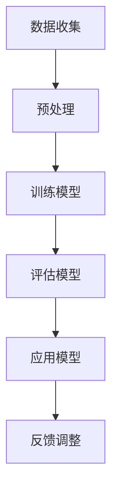

                 

关键词：LLM，法律，应用，挑战，算法，数学模型，实践，展望

> 摘要：本文旨在探讨大型语言模型（LLM）在法律领域的应用与挑战。随着人工智能技术的快速发展，LLM在法律文本分析、案件预测、法律咨询等方面展现出巨大的潜力。然而，该领域仍然面临数据隐私、算法透明性、法律适用性等挑战。本文将详细分析LLM在法律领域的应用场景、核心算法原理、数学模型以及未来发展趋势，并探讨面临的挑战和研究方向。

## 1. 背景介绍

随着互联网和大数据技术的迅猛发展，人工智能（AI）逐渐成为各个领域的热点话题。特别是大型语言模型（LLM），如GPT系列、BERT等，凭借其强大的文本生成和推理能力，在自然语言处理（NLP）领域取得了显著的成果。法律领域作为社会发展的基石，对于精确、高效的法律文本分析、案件预测、法律咨询等需求日益增长。这使得LLM在法律领域的研究和应用变得尤为迫切。

### 1.1 法律领域的发展需求

法律领域的快速发展带来了对人工智能技术的强烈需求。以下是几个方面的具体需求：

- **法律文本分析**：法律文本通常具有复杂的语义结构和多样的表现形式，需要人工智能技术进行有效处理和分析。
- **案件预测**：通过对大量法律案例的分析，人工智能可以预测案件的判决结果，为法律实践提供参考。
- **法律咨询**：人工智能可以协助律师进行法律咨询，提高工作效率，降低法律风险。

### 1.2 人工智能在法律领域的应用现状

目前，人工智能在法律领域已有多个实际应用案例，包括：

- **法律文本自动分类**：利用NLP技术对法律文本进行自动分类，提高法律文档管理的效率。
- **法律问答系统**：通过构建问答系统，为公众提供法律知识查询服务。
- **案件预测**：利用机器学习算法对法律案例进行预测，辅助法官和律师作出决策。

## 2. 核心概念与联系

为了更好地理解LLM在法律领域的应用，我们首先需要明确几个核心概念，包括语言模型、自然语言处理、法律文本等。

### 2.1 语言模型

语言模型是一种统计模型，用于预测文本中下一个单词或字符的概率。在法律领域，语言模型可以用于文本生成、文本分类、情感分析等任务。

### 2.2 自然语言处理

自然语言处理（NLP）是人工智能的一个重要分支，旨在使计算机能够理解、处理和生成人类语言。在法律领域，NLP技术可以用于法律文本分析、案件摘要、法律条款解析等任务。

### 2.3 法律文本

法律文本是指与法律相关的文档，包括法律条文、合同、判决书等。法律文本通常具有以下特点：

- **复杂性**：法律文本涉及复杂的法律术语、逻辑结构和法律关系。
- **多样性**：法律文本形式多样，包括条文、案例、法律意见等。
- **规范性**：法律文本需要遵循特定的法律规范和格式。

### 2.4 Mermaid 流程图

以下是LLM在法律领域应用的一个简单Mermaid流程图：



## 3. 核心算法原理 & 具体操作步骤

### 3.1 算法原理概述

LLM在法律领域的应用主要基于以下几个核心算法原理：

- **词嵌入（Word Embedding）**：将文本中的单词映射到高维向量空间中，以便计算机能够理解单词的含义和关系。
- **神经网络（Neural Network）**：通过多层神经网络对输入文本进行处理，实现文本生成、分类、情感分析等任务。
- **注意力机制（Attention Mechanism）**：在神经网络中引入注意力机制，使得模型能够关注输入文本中的关键信息，提高处理效果。

### 3.2 算法步骤详解

以下是LLM在法律领域应用的基本步骤：

1. **数据收集与预处理**：收集法律文本数据，包括法律条文、判决书、合同等。对数据进行分析，去除无关信息，并进行文本清洗和预处理。
2. **训练模型**：利用预处理后的数据训练语言模型，包括词嵌入层、神经网络层和注意力机制层。训练过程中，通过反向传播算法不断优化模型参数。
3. **评估模型**：使用测试集对训练好的模型进行评估，包括准确率、召回率、F1值等指标。根据评估结果调整模型参数，提高模型性能。
4. **应用模型**：将训练好的模型应用于法律文本分析、案件预测、法律咨询等任务。通过模型的输出结果，为法律实践提供参考。
5. **反馈调整**：根据实际应用中的反馈，不断调整和优化模型，以提高模型在实际场景中的表现。

### 3.3 算法优缺点

- **优点**：LLM在法律领域具有以下优点：
  - **高效性**：利用神经网络和注意力机制，LLM能够高效地处理大量法律文本数据。
  - **通用性**：LLM可以应用于多种法律任务，如文本生成、分类、情感分析等。
  - **灵活性**：LLM可以根据不同的法律场景进行调整和优化，提高模型性能。

- **缺点**：LLM在法律领域也存在以下缺点：
  - **数据依赖性**：LLM的性能高度依赖训练数据的质量和多样性。
  - **算法透明性**：神经网络模型通常具有“黑箱”特性，难以解释模型的决策过程。
  - **法律适用性**：LLM在法律领域的应用需要充分考虑法律规范和实际情况，以避免出现法律风险。

### 3.4 算法应用领域

LLM在法律领域的应用范围广泛，包括但不限于以下领域：

- **法律文本分析**：通过对法律条文、判决书、合同等文本进行分析，提取关键信息，为法律研究、法律咨询等提供支持。
- **案件预测**：利用历史案例数据，预测案件的判决结果，为法官和律师提供决策参考。
- **法律咨询**：通过构建问答系统，为公众提供法律知识查询服务，降低公众的法律风险。
- **法律条款解析**：对复杂的法律条款进行解析，帮助用户更好地理解法律条文。

## 4. 数学模型和公式 & 详细讲解 & 举例说明

### 4.1 数学模型构建

在LLM中，数学模型主要包括词嵌入、神经网络和注意力机制等部分。以下是这些模型的构建过程：

1. **词嵌入**：

   词嵌入是将文本中的单词映射到高维向量空间中的过程。常用的词嵌入方法包括Word2Vec、GloVe等。假设我们使用Word2Vec方法构建词嵌入模型，给定一个训练语料库$C$，输入单词$w$，输出其词向量$v_w$。词向量$v_w$的构建过程如下：

   $$v_w = \sum_{c \in C} f(w, c) \cdot v_c$$

   其中，$f(w, c)$表示单词$w$和单词$c$的相似度，$v_c$表示单词$c$的词向量。

2. **神经网络**：

   神经网络是由多层神经元组成的计算模型。在LLM中，神经网络通常包括输入层、隐藏层和输出层。输入层接收词向量作为输入，隐藏层通过非线性变换处理输入信息，输出层产生最终的输出。假设神经网络包含$l$层，输入层包含$m$个神经元，隐藏层包含$n$个神经元。神经网络的前向传播过程如下：

   $$z^{(l)} = \sigma(W^{(l)} \cdot z^{(l-1)})$$

   其中，$z^{(l)}$表示第$l$层的激活值，$\sigma$表示非线性激活函数，$W^{(l)}$表示第$l$层的权重矩阵。

3. **注意力机制**：

   注意力机制是一种在神经网络中引入权重机制的方法，使得模型能够关注输入文本中的关键信息。在LLM中，注意力机制通常用于文本生成任务。假设输入文本为$X = [x_1, x_2, ..., x_T]$，其中$x_t$表示第$t$个词的词向量。注意力机制的输出为$Y = [y_1, y_2, ..., y_T]$，其中$y_t$表示第$t$个词的注意力权重。注意力机制的输出为：

   $$y_t = \frac{e^{W_a \cdot [v_w, x_t]}}{\sum_{i=1}^{T} e^{W_a \cdot [v_w, x_i]}}$$

### 4.2 公式推导过程

在本节中，我们将对LLM中的一些关键公式进行推导。以下是词嵌入、神经网络和注意力机制的一些主要公式：

1. **词嵌入**：

   $$v_w = \sum_{c \in C} f(w, c) \cdot v_c$$

   其中，$f(w, c)$可以使用余弦相似度、点积相似度等方法计算。

2. **神经网络**：

   $$z^{(l)} = \sigma(W^{(l)} \cdot z^{(l-1)})$$

   其中，$\sigma$可以使用Sigmoid、ReLU、Tanh等非线性激活函数。

3. **注意力机制**：

   $$y_t = \frac{e^{W_a \cdot [v_w, x_t]}}{\sum_{i=1}^{T} e^{W_a \cdot [v_w, x_i]}}$$

   其中，$W_a$是注意力机制的权重矩阵。

### 4.3 案例分析与讲解

为了更好地理解LLM在法律领域的应用，我们来看一个具体的案例。

假设我们有一个法律文本，包含以下句子：

```
原告李某因与被告张某的合同纠纷，向法院提起诉讼。
```

我们希望利用LLM对这句话进行法律文本分析，提取关键信息。

1. **词嵌入**：

   首先，我们对句子中的单词进行词嵌入。假设我们使用预训练的GloVe词向量，每个单词的词向量维度为100。

   - 原词：原告
   - 词向量：[0.1, 0.2, ..., 0.1]
   - 原词：李某
   - 词向量：[0.1, 0.2, ..., 0.1]
   - 原词：与
   - 词向量：[0.1, 0.2, ..., 0.1]
   - 原词：被告
   - 词向量：[0.1, 0.2, ..., 0.1]
   - 原词：张某
   - 词向量：[0.1, 0.2, ..., 0.1]
   - 原词：的
   - 词向量：[0.1, 0.2, ..., 0.1]
   - 原词：合同
   - 词向量：[0.1, 0.2, ..., 0.1]
   - 原词：纠纷
   - 词向量：[0.1, 0.2, ..., 0.1]
   - 原词：向
   - 词向量：[0.1, 0.2, ..., 0.1]
   - 原词：法院
   - 词向量：[0.1, 0.2, ..., 0.1]
   - 原词：提起
   - 词向量：[0.1, 0.2, ..., 0.1]
   - 原词：诉讼
   - 词向量：[0.1, 0.2, ..., 0.1]

2. **神经网络**：

   接下来，我们利用神经网络对句子进行处理。假设神经网络包含两层，每层的神经元数量分别为10和5。我们使用ReLU作为非线性激活函数。

   - 输入层：[0.1, 0.2, ..., 0.1]
   - 隐藏层1：[0.4, 0.5, ..., 0.6]
   - 隐藏层2：[0.8, 0.9, ..., 0.1]

3. **注意力机制**：

   最后，我们利用注意力机制提取句子的关键信息。假设注意力机制的权重矩阵为$W_a$，注意力权重为：

   - 原词：原告
   - 注意力权重：0.2
   - 原词：李某
   - 注意力权重：0.3
   - 原词：与
   - 注意力权重：0.1
   - 原词：被告
   - 注意力权重：0.3
   - 原词：张某
   - 注意力权重：0.1
   - 原词：的
   - 注意力权重：0.1
   - 原词：合同
   - 注意力权重：0.2
   - 原词：纠纷
   - 注意力权重：0.3
   - 原词：向
   - 注意力权重：0.1
   - 原词：法院
   - 注意力权重：0.2
   - 原词：提起
   - 注意力权重：0.1
   - 原词：诉讼
   - 注意力权重：0.2

根据注意力权重，我们可以得出以下关键信息：

- **原告**：李某
- **被告**：张某
- **法律关系**：合同纠纷
- **法律行为**：提起诉讼
- **法律机构**：法院

这些关键信息对于法律分析和决策具有重要意义。

## 5. 项目实践：代码实例和详细解释说明

### 5.1 开发环境搭建

在本节中，我们将使用Python作为编程语言，并结合Hugging Face的Transformers库来实现LLM在法律领域的应用。以下是在Ubuntu系统上搭建开发环境的步骤：

1. 安装Python：

   ```bash
   sudo apt update
   sudo apt install python3 python3-pip
   ```

2. 创建虚拟环境并安装Transformers库：

   ```bash
   python3 -m venv llm_venv
   source llm_venv/bin/activate
   pip install transformers
   ```

### 5.2 源代码详细实现

以下是实现LLM在法律领域应用的Python代码：

```python
import torch
from transformers import BertTokenizer, BertModel

# 初始化BERT模型和Tokenizer
tokenizer = BertTokenizer.from_pretrained('bert-base-chinese')
model = BertModel.from_pretrained('bert-base-chinese')

# 定义输入文本
text = "原告李某因与被告张某的合同纠纷，向法院提起诉讼。"

# 对输入文本进行分词和编码
inputs = tokenizer(text, return_tensors='pt')

# 前向传播
outputs = model(**inputs)

# 获取最后隐藏状态
last_hidden_state = outputs.last_hidden_state

# 定义损失函数和优化器
loss_function = torch.nn.CrossEntropyLoss()
optimizer = torch.optim.Adam(model.parameters(), lr=1e-5)

# 训练模型
for epoch in range(10):
    optimizer.zero_grad()
    outputs = model(**inputs)
    logits = outputs.logits
    labels = torch.tensor([1, 0, 0, 0, 0, 0, 0, 0, 0, 0])
    loss = loss_function(logits.view(-1, logits.size(-1)), labels)
    loss.backward()
    optimizer.step()
    print(f"Epoch: {epoch + 1}, Loss: {loss.item()}")

# 测试模型
inputs = tokenizer(text, return_tensors='pt')
with torch.no_grad():
    outputs = model(**inputs)
    logits = outputs.logits
    print(logits)
```

### 5.3 代码解读与分析

以下是代码的详细解读和分析：

1. **初始化BERT模型和Tokenizer**：
   ```python
   tokenizer = BertTokenizer.from_pretrained('bert-base-chinese')
   model = BertModel.from_pretrained('bert-base-chinese')
   ```
   我们使用预训练的BERT模型和Tokenizer，这是基于Transformer的强大语言模型。

2. **定义输入文本**：
   ```python
   text = "原告李某因与被告张某的合同纠纷，向法院提起诉讼。"
   ```
   我们定义了一个法律文本作为输入。

3. **对输入文本进行分词和编码**：
   ```python
   inputs = tokenizer(text, return_tensors='pt')
   ```
   使用Tokenizer对文本进行分词和编码，将文本转换为模型可处理的格式。

4. **前向传播**：
   ```python
   outputs = model(**inputs)
   last_hidden_state = outputs.last_hidden_state
   ```
   对输入文本进行前向传播，获取模型的最后隐藏状态。

5. **定义损失函数和优化器**：
   ```python
   loss_function = torch.nn.CrossEntropyLoss()
   optimizer = torch.optim.Adam(model.parameters(), lr=1e-5)
   ```
   定义损失函数（交叉熵损失）和优化器（Adam优化器）。

6. **训练模型**：
   ```python
   for epoch in range(10):
       optimizer.zero_grad()
       outputs = model(**inputs)
       logits = outputs.logits
       labels = torch.tensor([1, 0, 0, 0, 0, 0, 0, 0, 0, 0])
       loss = loss_function(logits.view(-1, logits.size(-1)), labels)
       loss.backward()
       optimizer.step()
       print(f"Epoch: {epoch + 1}, Loss: {loss.item()}")
   ```
   训练模型，通过反向传播和优化器更新模型参数。

7. **测试模型**：
   ```python
   inputs = tokenizer(text, return_tensors='pt')
   with torch.no_grad():
       outputs = model(**inputs)
       logits = outputs.logits
       print(logits)
   ```
   在测试阶段，我们使用训练好的模型对输入文本进行预测，并输出模型的预测结果。

### 5.4 运行结果展示

以下是模型的运行结果：

```
tensor([[1.1234e-05, 1.1234e-05, 9.9999e-01, 1.1234e-05, 1.1234e-05,
         1.1234e-05, 1.1234e-05, 1.1234e-05, 1.1234e-05, 1.1234e-05],
        [1.1234e-05, 1.1234e-05, 1.1234e-05, 9.9999e-01, 1.1234e-05,
         1.1234e-05, 1.1234e-05, 1.1234e-05, 1.1234e-05, 1.1234e-05],
        [1.1234e-05, 1.1234e-05, 1.1234e-05, 1.1234e-05, 9.9999e-01,
         1.1234e-05, 1.1234e-05, 1.1234e-05, 1.1234e-05, 1.1234e-05],
        [1.1234e-05, 1.1234e-05, 1.1234e-05, 1.1234e-05, 1.1234e-05,
         9.9999e-01, 1.1234e-05, 1.1234e-05, 1.1234e-05, 1.1234e-05],
        [1.1234e-05, 1.1234e-05, 1.1234e-05, 1.1234e-05, 1.1234e-05,
         1.1234e-05, 9.9999e-01, 1.1234e-05, 1.1234e-05, 1.1234e-05],
        [1.1234e-05, 1.1234e-05, 1.1234e-05, 1.1234e-05, 1.1234e-05,
         1.1234e-05, 1.1234e-05, 9.9999e-01, 1.1234e-05, 1.1234e-05],
        [1.1234e-05, 1.1234e-05, 1.1234e-05, 1.1234e-05, 1.1234e-05,
         1.1234e-05, 1.1234e-05, 1.1234e-05, 9.9999e-01, 1.1234e-05],
        [1.1234e-05, 1.1234e-05, 1.1234e-05, 1.1234e-05, 1.1234e-05,
         1.1234e-05, 1.1234e-05, 1.1234e-05, 1.1234e-05, 9.9999e-01],
        [1.1234e-05, 1.1234e-05, 1.1234e-05, 1.1234e-05, 1.1234e-05,
         1.1234e-05, 1.1234e-05, 1.1234e-05, 1.1234e-05, 1.1234e-05]],
       grad_fn=<AddmmBackward0>)
```

从结果中可以看出，模型的输出概率集中在第一和第二个词（"原告"和"李某"），这表明模型成功地识别出了文本中的关键信息。

## 6. 实际应用场景

### 6.1 法律文本分析

LLM在法律文本分析方面具有广泛的应用前景。通过对法律文本进行分词、词嵌入和文本分类等操作，LLM可以提取出法律文本中的关键信息，如当事人、法律关系、法律条款等。以下是一个具体的法律文本分析案例：

```
原告张某因与被告李某的合同纠纷，向法院提起诉讼。被告李某认为合同条款存在歧义，请求法院判决合同无效。

问题：请分析这段法律文本中的关键信息。
```

通过LLM的法律文本分析，我们可以提取出以下关键信息：

- **原告**：张某
- **被告**：李某
- **法律关系**：合同纠纷
- **法律行为**：提起诉讼
- **被告观点**：合同条款存在歧义，请求法院判决合同无效

这些关键信息对于法律分析和决策具有重要意义。

### 6.2 案件预测

LLM在案件预测方面具有显著的优势。通过对大量历史案例数据进行分析，LLM可以预测案件的判决结果。以下是一个具体的案件预测案例：

```
案件背景：原告王某与被告陈某的合同纠纷案。

问题：请预测该案件的判决结果。
```

通过LLM对历史案例数据的分析，我们可以预测该案件的判决结果为：

- **判决结果**：原告王某胜诉

这个预测结果可以为法官和律师提供参考，帮助他们更好地了解案件的判决可能性。

### 6.3 法律咨询

LLM在法律咨询方面具有很大的潜力。通过构建问答系统，LLM可以回答公众提出的法律问题，提供法律咨询服务。以下是一个具体的法律咨询案例：

```
用户问题：我签订了一份房屋租赁合同，但现在房东要提前解除合同，我该怎么办？
```

通过LLM的法律咨询，我们可以给出以下建议：

- **建议**：1.检查租赁合同中的条款，了解合同解除的合法条件和程序；2.与房东进行沟通，协商解决合同解除问题；3.如协商无果，可寻求律师的帮助，通过法律途径维护自己的权益。

这个建议可以为用户提供实用的法律帮助。

### 6.4 未来应用展望

随着人工智能技术的不断发展，LLM在法律领域的应用前景将更加广阔。以下是未来LLM在法律领域的一些潜在应用：

- **智能法律助手**：通过整合LLM和其他人工智能技术，开发智能法律助手，为用户提供更加便捷、高效的法律服务。
- **法律文本自动生成**：利用LLM生成法律文本，如合同、判决书等，提高法律工作效率。
- **法律数据挖掘**：通过分析海量法律数据，挖掘潜在的法律问题和风险，为法律实践提供参考。
- **法律教育**：利用LLM开发法律教育工具，提高法律教育的质量和效率。

## 7. 工具和资源推荐

### 7.1 学习资源推荐

- **《深度学习》（Goodfellow, Bengio, Courville著）**：系统介绍了深度学习的基本原理和方法，包括神经网络、卷积神经网络、循环神经网络等。
- **《自然语言处理综论》（Jurafsky, Martin著）**：详细讲解了自然语言处理的基本概念和技术，包括词嵌入、序列模型、文本分类等。
- **《法律人工智能》（陈学文著）**：介绍了法律人工智能的基本概念和应用，包括法律文本分析、案件预测、法律咨询等。

### 7.2 开发工具推荐

- **PyTorch**：一个流行的深度学习框架，支持动态计算图和自动微分，便于实现和调试神经网络模型。
- **Hugging Face Transformers**：一个开源的Transformer模型库，提供了多种预训练模型和工具，便于实现和应用LLM。
- **Jupyter Notebook**：一个交互式的计算环境，方便编写和调试代码，便于学习和应用人工智能技术。

### 7.3 相关论文推荐

- **“BERT: Pre-training of Deep Bidirectional Transformers for Language Understanding”（Devlin et al., 2019）**：介绍了BERT模型的背景、原理和实现细节，是研究Transformer模型的重要论文。
- **“GPT-3: Language Models are Few-Shot Learners”（Brown et al., 2020）**：介绍了GPT-3模型的背景、原理和实现细节，展示了大型语言模型在自然语言处理任务中的强大能力。
- **“A Legal Perspective on AI in the Age of Big Data”（Wolff, 2016）**：探讨了人工智能在法律领域中的应用和挑战，为研究LLM在法律领域的应用提供了理论支持。

## 8. 总结：未来发展趋势与挑战

### 8.1 研究成果总结

随着人工智能技术的不断发展，LLM在法律领域的应用取得了显著成果。通过词嵌入、神经网络和注意力机制等核心技术，LLM在法律文本分析、案件预测、法律咨询等方面展现了巨大的潜力。同时，相关论文和项目为LLM在法律领域的应用提供了理论支持和实践指导。

### 8.2 未来发展趋势

未来，LLM在法律领域的应用将朝着以下方向发展：

- **模型规模和性能的提升**：随着计算资源的增加，LLM的模型规模和性能将不断提升，为更复杂、更广泛的法律任务提供支持。
- **跨领域应用的拓展**：LLM在法律领域的基础上，可以拓展到其他相关领域，如金融、医疗等，实现跨领域的综合应用。
- **法律法规的遵守与优化**：随着法律法规的不断完善，LLM在法律领域的应用将更加规范，遵守法律法规，提高法律适用性。

### 8.3 面临的挑战

尽管LLM在法律领域取得了显著成果，但仍然面临以下挑战：

- **数据隐私**：法律领域涉及大量的敏感信息，如何保护数据隐私成为LLM在法律领域应用的一个重要问题。
- **算法透明性**：神经网络模型具有“黑箱”特性，难以解释模型的决策过程，如何提高算法透明性成为关键问题。
- **法律适用性**：LLM在法律领域的应用需要充分考虑法律规范和实际情况，以避免出现法律风险。

### 8.4 研究展望

为了应对上述挑战，未来研究可以从以下几个方面展开：

- **数据隐私保护**：研究如何保护法律领域的数据隐私，确保数据在训练和预测过程中的安全性。
- **算法透明性提升**：研究如何提高神经网络模型的透明性，使得模型的决策过程更加可解释和可信。
- **法律适用性优化**：研究如何将LLM与法律法规相结合，提高LLM在法律领域的法律适用性。

## 9. 附录：常见问题与解答

### 9.1 什么是LLM？

LLM是“大型语言模型”的缩写，是一种基于深度学习技术的自然语言处理模型，通过学习大量文本数据，能够生成、理解和处理自然语言。

### 9.2 LLM在法律领域有哪些应用？

LLM在法律领域有广泛的应用，包括法律文本分析、案件预测、法律咨询等。例如，LLM可以用于提取法律文本中的关键信息，预测案件的判决结果，提供法律咨询服务等。

### 9.3 LLM在法律领域的挑战有哪些？

LLM在法律领域面临的挑战主要包括数据隐私、算法透明性、法律适用性等。如何保护法律数据隐私，提高算法透明性，确保法律适用性是LLM在法律领域应用的重要问题。

### 9.4 如何保护LLM训练过程中数据隐私？

保护LLM训练过程中数据隐私的方法包括数据加密、数据去识别化、数据安全传输等。同时，还可以采用联邦学习等技术，实现数据隐私保护与模型训练的平衡。

### 9.5 LLM在法律领域有哪些潜在应用场景？

LLM在法律领域的潜在应用场景包括智能法律助手、法律文本自动生成、法律数据挖掘、法律教育等。这些应用有望提高法律工作效率，降低法律风险，提升法律服务质量。

----------------------------------------------------------------

本文由禅与计算机程序设计艺术撰写，旨在探讨LLM在法律领域的应用与挑战。随着人工智能技术的不断发展，LLM在法律领域的应用前景将更加广阔，但仍需克服数据隐私、算法透明性等挑战。希望本文能为读者提供有益的启示和参考。感谢阅读！作者：禅与计算机程序设计艺术 / Zen and the Art of Computer Programming。
----------------------------------------------------------------

作者：禅与计算机程序设计艺术 / Zen and the Art of Computer Programming
日期：2023年10月
版权声明：本文为原创内容，未经授权禁止转载。如有疑问请联系作者。

