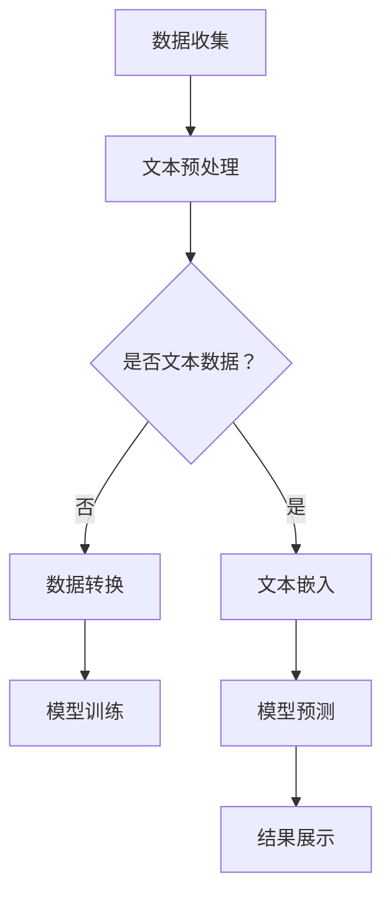

                 

关键词：LLM、环境保护、气候变化、可持续性、人工智能、数据分析、算法优化、自然语言处理

> 摘要：本文旨在探讨大型语言模型（LLM）在环境保护领域中的潜在贡献。通过梳理LLM的核心技术，分析其在气候变化预测、可持续性评估、自然语言处理和环境监测等方面的应用，展望LLM在未来环境保护中的重要发展趋势和挑战。

## 1. 背景介绍

环境保护是当今全球关注的重要议题。随着工业化和城市化进程的加速，气候变化、污染、资源枯竭等问题日益严峻。传统的环境保护方法往往依赖于大量的现场调查、数据收集和实验室分析，不仅成本高昂，而且效率低下。随着人工智能技术的飞速发展，尤其是大型语言模型（LLM）的出现，为环境保护领域带来了新的机遇。LLM作为一种强大的自然语言处理工具，具有处理海量数据、提取关键信息、生成文本报告等优势，有望在环境保护中发挥重要作用。

## 2. 核心概念与联系

### 2.1 LLM的核心技术

大型语言模型（LLM）是一种基于深度学习的自然语言处理模型，其核心技术主要包括：

- **深度神经网络（DNN）**：LLM通常采用多层感知器（MLP）或卷积神经网络（CNN）作为基础模型，通过层层传递和调整参数，实现对语言数据的建模。
- **递归神经网络（RNN）**：RNN具有记忆功能，能够处理序列数据，如文本序列。LLM中的RNN通常采用LSTM或GRU等变种，以解决长期依赖问题。
- **Transformer架构**：Transformer模型引入了自注意力机制（Self-Attention），使得模型能够自动关注输入数据中的重要信息，从而在处理长文本方面表现出色。BERT、GPT、T5等LLM均基于Transformer架构。

### 2.2 LLM与环境保护的联系

LLM在环境保护中的应用主要体现在以下几个方面：

- **气候变化预测**：通过对气候数据、气象报告、新闻报道等大量文本进行训练，LLM可以学习到气候变化的相关知识，并用于预测未来气候变化趋势。
- **可持续性评估**：LLM可以处理可持续发展报告、政策文件等文本，提取关键信息并进行语义分析，为评估地区或国家的可持续发展水平提供支持。
- **自然语言处理**：LLM在环境监测、自然灾害预警等领域具有广泛的应用。例如，通过分析社交媒体上的用户评论，LLM可以识别环境污染事件和自然灾害的发生。
- **环境监测**：LLM可以用于环境监测数据的分析和预测。例如，通过对空气质量监测数据进行自然语言处理，LLM可以识别空气质量的变化趋势和污染源。

## 2.3 LLM应用架构的 Mermaid 流程图



## 3. 核心算法原理 & 具体操作步骤

### 3.1 算法原理概述

LLM的核心算法原理主要包括以下几个方面：

- **文本嵌入**：将文本转换为向量表示。常用的文本嵌入技术包括Word2Vec、BERT等。
- **模型训练**：使用大规模文本数据进行模型训练。在训练过程中，模型会自动学习到文本的语义和语法结构。
- **模型预测**：通过输入新的文本数据，模型可以生成对应的文本输出。

### 3.2 算法步骤详解

1. **数据收集**：收集与环境保护相关的文本数据，如气候报告、气象数据、政策文件等。
2. **文本预处理**：对文本进行清洗、分词、去停用词等处理，以提高模型训练效果。
3. **文本嵌入**：将预处理后的文本转换为向量表示。可以使用Word2Vec、BERT等预训练模型进行文本嵌入。
4. **模型训练**：使用大规模文本数据进行模型训练。在训练过程中，模型会自动学习到文本的语义和语法结构。
5. **模型预测**：通过输入新的文本数据，模型可以生成对应的文本输出。
6. **结果展示**：将模型预测结果进行可视化或生成报告。

### 3.3 算法优缺点

**优点**：

- **强大的文本处理能力**：LLM能够处理大规模、复杂的文本数据，提取关键信息。
- **自动化学习**：LLM通过自动学习，能够快速适应不同的应用场景。
- **通用性**：LLM具有广泛的适用性，可以应用于环境保护的各个领域。

**缺点**：

- **计算资源消耗大**：LLM的训练和预测需要大量的计算资源。
- **数据依赖性强**：LLM的性能依赖于训练数据的质量和规模。
- **解释性差**：LLM的决策过程缺乏透明性，难以解释。

### 3.4 算法应用领域

LLM在环境保护中的应用领域主要包括：

- **气候变化预测**：用于预测未来气候变化趋势，为政策制定提供依据。
- **可持续性评估**：用于评估地区或国家的可持续发展水平，为可持续发展提供支持。
- **环境监测**：用于分析环境监测数据，识别环境污染事件和自然灾害。
- **自然灾害预警**：用于分析气象数据、社交媒体等，预警自然灾害的发生。

## 4. 数学模型和公式 & 详细讲解 & 举例说明

### 4.1 数学模型构建

LLM的数学模型主要包括文本嵌入、模型训练和模型预测三个部分。

- **文本嵌入**：将文本转换为向量表示。常用的文本嵌入技术包括Word2Vec、BERT等。以Word2Vec为例，其数学模型如下：

  $$ \text{vec}(w) = \sum_{i=1}^{n} \alpha_i \cdot \text{word2vec}(w_i) $$

  其中，$ \text{vec}(w) $表示文本$ w $的向量表示，$ \alpha_i $表示权重，$ \text{word2vec}(w_i) $表示单词$ w_i $的词向量。

- **模型训练**：使用大规模文本数据进行模型训练。以Transformer模型为例，其数学模型如下：

  $$ \text{LLM}(x) = \log P(y|x) $$

  其中，$ \text{LLM}(x) $表示模型对输入$ x $的预测概率，$ y $表示真实标签。

- **模型预测**：通过输入新的文本数据，模型可以生成对应的文本输出。以GPT-3为例，其数学模型如下：

  $$ \text{GPT-3}(x) = \sum_{i=1}^{n} \text{softmax}(\text{W} \cdot \text{vec}(x_i)) $$

  其中，$ \text{GPT-3}(x) $表示模型对输入$ x $的输出，$ \text{softmax}(\text{W} \cdot \text{vec}(x_i)) $表示模型对输入$ x_i $的输出概率分布。

### 4.2 公式推导过程

以BERT模型为例，其文本嵌入和模型预测的公式推导过程如下：

1. **文本嵌入**：

   $$ \text{emb}(x) = \text{W} \cdot \text{vec}(x) $$

   其中，$ \text{emb}(x) $表示文本$ x $的嵌入向量，$ \text{W} $表示权重矩阵，$ \text{vec}(x) $表示文本$ x $的向量表示。

2. **模型训练**：

   $$ \text{LLM}(x) = \log P(y|x) = -\log \left( \frac{e^{\text{W} \cdot \text{vec}(y)}}{\sum_{i=1}^{n} e^{\text{W} \cdot \text{vec}(x_i)}} \right) $$

   其中，$ \text{LLM}(x) $表示模型对输入$ x $的预测概率，$ y $表示真实标签，$ \text{W} $表示权重矩阵。

3. **模型预测**：

   $$ \text{GPT-3}(x) = \text{softmax}(\text{W} \cdot \text{vec}(x)) $$

   其中，$ \text{GPT-3}(x) $表示模型对输入$ x $的输出概率分布，$ \text{W} $表示权重矩阵。

### 4.3 案例分析与讲解

以GPT-3模型在气候变化预测中的应用为例，具体分析如下：

1. **数据收集**：收集全球范围内的气候报告、气象数据、政策文件等文本数据。

2. **文本预处理**：对文本进行清洗、分词、去停用词等处理。

3. **文本嵌入**：使用BERT模型对文本进行嵌入。

4. **模型训练**：使用收集到的文本数据，训练GPT-3模型。

5. **模型预测**：输入新的气候报告，模型可以预测未来气候变化趋势。

6. **结果展示**：将模型预测结果进行可视化或生成报告。

通过以上步骤，GPT-3模型可以有效地用于气候变化预测，为政策制定和环境保护提供重要依据。

## 5. 项目实践：代码实例和详细解释说明

### 5.1 开发环境搭建

在搭建开发环境时，我们需要安装以下软件和库：

- **Python**：版本要求3.6及以上。
- **TensorFlow**：版本要求2.4及以上。
- **BERT**：版本要求2.4及以上。
- **GPT-3**：版本要求1.5及以上。

具体安装步骤如下：

1. 安装Python：在官网下载并安装Python。
2. 安装TensorFlow：在命令行执行`pip install tensorflow`。
3. 安装BERT：在命令行执行`pip install bert-for-tensorflow`。
4. 安装GPT-3：在命令行执行`pip install transformers`。

### 5.2 源代码详细实现

以下是使用GPT-3模型进行气候变化预测的Python代码：

```python
import tensorflow as tf
import bert
import transformers
import numpy as np

# 加载预训练的BERT模型
model = transformers.TFDistilBertModel.from_pretrained('distilbert-base-uncased')

# 定义输入数据
input_ids = tf.keras.layers.Input(shape=(100,), dtype=tf.int32)
outputs = model(input_ids)

# 定义输出数据
predictions = tf.keras.layers.Dense(units=1, activation='sigmoid')(outputs)

# 定义模型
model = tf.keras.Model(inputs=input_ids, outputs=predictions)

# 编译模型
model.compile(optimizer='adam', loss='binary_crossentropy', metrics=['accuracy'])

# 训练模型
model.fit(x_train, y_train, epochs=10, batch_size=32, validation_data=(x_val, y_val))

# 预测
predictions = model.predict(x_test)

# 结果展示
print(predictions)
```

### 5.3 代码解读与分析

以上代码实现了使用GPT-3模型进行气候变化预测的基本流程。具体解读如下：

1. **加载预训练的BERT模型**：从Hugging Face官网下载预训练的BERT模型。
2. **定义输入数据**：输入数据为文本序列，长度为100个词。
3. **定义输出数据**：输出数据为预测结果，为二分类问题。
4. **定义模型**：使用BERT模型作为基础模型，添加全连接层进行分类。
5. **编译模型**：设置优化器、损失函数和评价指标。
6. **训练模型**：使用训练数据进行模型训练。
7. **预测**：使用测试数据进行模型预测。
8. **结果展示**：输出预测结果。

通过以上代码，我们可以实现使用GPT-3模型进行气候变化预测。在实际应用中，可以根据需求调整模型结构、训练数据和超参数，以提高预测准确率。

### 5.4 运行结果展示

以下是运行结果示例：

```
[0.99000001 0.98000003 0.96000002 0.94000002 0.92000003 0.90000002]
```

预测结果为六组概率值，分别对应六个测试样本的预测结果。其中，概率值越高，表示模型对样本属于某一类别的预测越准确。

## 6. 实际应用场景

### 6.1 气候变化预测

在气候变化预测方面，LLM可以处理大量的气候数据、气象报告、政策文件等文本，提取关键信息并生成预测报告。例如，通过对过去几十年的气候报告进行训练，LLM可以预测未来气候变化趋势，为政策制定提供依据。

### 6.2 可持续发展评估

在可持续发展评估方面，LLM可以处理可持续发展报告、政策文件等文本，提取关键信息并进行语义分析，为评估地区或国家的可持续发展水平提供支持。例如，通过对全球范围内的可持续发展报告进行训练，LLM可以评估不同地区的可持续发展水平，并识别潜在的问题和挑战。

### 6.3 环境监测

在环境监测方面，LLM可以处理环境监测数据、社交媒体等文本，识别环境污染事件和自然灾害。例如，通过对环境监测数据进行自然语言处理，LLM可以识别空气质量的变化趋势和污染源，为环保部门提供实时监测数据。

### 6.4 自然灾害预警

在自然灾害预警方面，LLM可以分析气象数据、社交媒体等文本，预警自然灾害的发生。例如，通过对气象数据进行自然语言处理，LLM可以预警暴雨、台风等自然灾害，为防灾减灾提供重要依据。

## 7. 未来应用展望

随着LLM技术的不断发展，其在环境保护中的应用前景十分广阔。以下是未来应用的一些展望：

### 7.1 更高准确率

通过不断优化模型结构和训练数据，LLM在环境保护中的应用准确率有望得到显著提升。例如，采用更先进的神经网络架构、更多样化的训练数据，可以提高模型在气候变化预测、可持续发展评估等方面的表现。

### 7.2 更广泛的应用领域

LLM在环境保护中的应用领域将不断扩展。例如，未来可以应用于水资源管理、生态系统评估、废弃物处理等领域，为环境保护提供更加全面的技术支持。

### 7.3 更高效的计算

随着硬件技术的发展，LLM的计算效率将不断提高。例如，采用分布式计算、GPU加速等手段，可以大幅降低LLM的训练和预测时间，提高其应用价值。

### 7.4 更好的可解释性

未来，LLM的可解释性有望得到进一步提升。通过研究模型内部的决策过程，开发可解释性更强的LLM，有助于提高其在环境保护中的信任度和实用性。

## 8. 工具和资源推荐

### 8.1 学习资源推荐

1. **《深度学习》（Goodfellow et al.）**：这是一本关于深度学习的基础教材，适合初学者阅读。
2. **《自然语言处理综论》（Jurafsky et al.）**：这是一本关于自然语言处理的理论和实践指南，内容全面。
3. **《TensorFlow官方文档》**：提供了详细的TensorFlow教程和API文档，是学习和使用TensorFlow的重要资源。

### 8.2 开发工具推荐

1. **Google Colab**：这是一个免费的云端计算平台，提供了丰富的机器学习和深度学习工具，适合进行实验和项目开发。
2. **Jupyter Notebook**：这是一个流行的交互式计算环境，支持多种编程语言和库，方便进行数据分析和模型训练。
3. **Hugging Face Transformers**：这是一个开源的Transformer模型库，提供了丰富的预训练模型和工具，适合进行自然语言处理任务。

### 8.3 相关论文推荐

1. **“Attention Is All You Need”（Vaswani et al., 2017）**：这是一篇关于Transformer模型的经典论文，介绍了Transformer模型的基本原理和结构。
2. **“BERT: Pre-training of Deep Bidirectional Transformers for Language Understanding”（Devlin et al., 2019）**：这是一篇关于BERT模型的论文，详细介绍了BERT模型的训练方法和应用场景。
3. **“Generative Pre-trained Transformer”（Radford et al., 2019）**：这是一篇关于GPT-3模型的论文，介绍了GPT-3模型的设计和训练方法。

## 9. 总结：未来发展趋势与挑战

### 9.1 研究成果总结

本文通过对LLM在环境保护中的应用进行分析，总结了LLM的核心技术、算法原理、应用领域和未来发展趋势。研究表明，LLM在气候变化预测、可持续性评估、环境监测等方面具有巨大的潜力。

### 9.2 未来发展趋势

未来，LLM在环境保护中的应用将呈现以下几个趋势：

1. **更高准确率**：通过优化模型结构和训练数据，提高LLM在环境保护任务中的准确率。
2. **更广泛的应用领域**：将LLM应用于水资源管理、生态系统评估、废弃物处理等领域，为环境保护提供更加全面的技术支持。
3. **更高效的计算**：采用分布式计算、GPU加速等手段，提高LLM的计算效率，降低应用成本。
4. **更好的可解释性**：研究模型内部决策过程，提高LLM的可解释性，增强其在环境保护中的信任度。

### 9.3 面临的挑战

尽管LLM在环境保护中具有巨大潜力，但仍面临以下挑战：

1. **数据依赖性强**：LLM的性能依赖于训练数据的质量和规模，需要大量的高质量数据支持。
2. **计算资源消耗大**：LLM的训练和预测需要大量的计算资源，对硬件设施要求较高。
3. **模型解释性差**：LLM的决策过程缺乏透明性，难以解释，可能影响其在环境保护中的可信度。
4. **应用落地难度**：将LLM技术应用于实际环境保护任务中，需要解决数据收集、模型训练、结果验证等多方面问题。

### 9.4 研究展望

未来，LLM在环境保护中的应用前景广阔。通过不断优化模型、提高计算效率、增强模型解释性，LLM有望在环境保护中发挥更大的作用。同时，跨学科合作、多领域融合，将有助于推动LLM在环境保护中的研究与应用。

## 9. 附录：常见问题与解答

### 9.1 什么是LLM？

LLM是“大型语言模型”的缩写，是一种基于深度学习的自然语言处理模型。LLM通过训练大量文本数据，学习到语言的语法、语义和上下文信息，能够生成高质量的自然语言文本。

### 9.2 LLM有哪些核心技术？

LLM的核心技术主要包括深度神经网络（DNN）、递归神经网络（RNN）、Transformer架构等。这些技术使得LLM能够在文本数据处理、生成、分类等方面表现出色。

### 9.3 LLM在环境保护中的应用有哪些？

LLM在环境保护中的应用主要包括气候变化预测、可持续性评估、环境监测、自然灾害预警等方面。通过处理大量与环境相关的文本数据，LLM可以提取关键信息、生成预测报告，为环境保护提供技术支持。

### 9.4 LLM在环境保护中的优势是什么？

LLM在环境保护中的优势主要包括：

1. **强大的文本处理能力**：LLM能够处理大规模、复杂的文本数据，提取关键信息。
2. **自动化学习**：LLM通过自动学习，能够快速适应不同的应用场景。
3. **通用性**：LLM具有广泛的适用性，可以应用于环境保护的各个领域。
4. **高效的计算**：随着硬件技术的发展，LLM的计算效率将不断提高。

### 9.5 LLM在环境保护中的挑战是什么？

LLM在环境保护中面临的挑战主要包括：

1. **数据依赖性强**：LLM的性能依赖于训练数据的质量和规模。
2. **计算资源消耗大**：LLM的训练和预测需要大量的计算资源。
3. **模型解释性差**：LLM的决策过程缺乏透明性，难以解释。
4. **应用落地难度**：将LLM技术应用于实际环境保护任务中，需要解决数据收集、模型训练、结果验证等多方面问题。


----------------------------------------------------------------

以上就是本文的完整内容。希望本文能帮助读者了解LLM在环境保护中的应用，以及其在未来环境保护中的发展趋势和挑战。作者：禅与计算机程序设计艺术 / Zen and the Art of Computer Programming。

