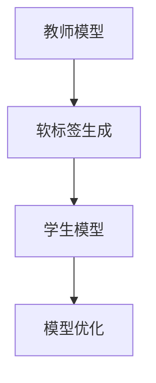

                 

关键词：知识蒸馏、LLM（大型语言模型）、模型压缩、模型优化、模型精度、计算资源利用、大数据处理、深度学习

> 摘要：本文深入探讨了大型语言模型（LLM）在知识蒸馏过程中的应用，分析了知识蒸馏的基本概念和原理，讨论了LLM在该过程中的作用。同时，文章从数学模型、算法原理、具体操作步骤等方面详细介绍了知识蒸馏的过程，并结合实际项目实践，展示了LLM在知识蒸馏中的具体应用效果。最后，对知识蒸馏在未来的发展趋势和面临的挑战进行了展望。

## 1. 背景介绍

知识蒸馏（Knowledge Distillation）是一种在深度学习中，将一个复杂、参数庞大的“教师”模型（Teacher Model）的知识和经验转移到一个小巧、参数较少的“学生”模型（Student Model）的技巧。这种技术不仅有助于减轻模型大小，降低计算资源的需求，还能在一定程度上保持模型的性能，从而在移动设备、嵌入式系统等资源受限的环境中发挥重要作用。

随着深度学习技术的不断发展，大型语言模型（LLM）如GPT、BERT等相继问世，这些模型拥有数十亿甚至上百亿的参数，尽管其具备强大的表示能力和优异的性能，但其训练和部署过程往往需要大量的计算资源和时间。因此，如何有效地利用LLM的知识，在保持模型性能的同时减小模型大小，成为当前研究的热点问题之一。

知识蒸馏作为一种有效的模型压缩技术，已经在图像识别、自然语言处理等领域取得了显著成果。而LLM在知识蒸馏中的应用，更是为这一领域注入了新的活力。本文将深入探讨LLM在知识蒸馏过程中的作用和应用，旨在为相关领域的研究和实践提供一些有益的参考。

## 2. 核心概念与联系

### 2.1 知识蒸馏的定义

知识蒸馏是一种将“教师”模型（Teacher Model）的知识和经验转移到“学生”模型（Student Model）的过程。在这个过程中，教师模型通常是参数庞大的复杂模型，而学生模型则是一个参数较少的小型模型。通过知识蒸馏，学生模型能够学习到教师模型的内部表示和决策过程，从而在保持模型性能的同时，实现模型压缩和加速部署。

### 2.2 LLM在知识蒸馏中的作用

大型语言模型（LLM）在知识蒸馏中起到了关键作用。首先，LLM具有强大的表示能力和丰富的知识储备，能够为教师模型提供高质量的内部表示。其次，LLM的参数规模通常较大，通过知识蒸馏，可以将LLM的知识和经验有效地转移到学生模型中，从而提高学生模型的性能。此外，LLM的训练和优化方法也为知识蒸馏提供了丰富的技术支持。

### 2.3 知识蒸馏的架构

知识蒸馏的架构主要包括两个部分：教师模型和学生模型。教师模型通常是原始的大型模型，如LLM，它拥有丰富的知识和经验。学生模型则是一个参数较少的小型模型，它通过学习教师模型的内部表示和决策过程，来提升自身的性能。

在知识蒸馏过程中，教师模型和学生模型之间通过软标签（Soft Labels）进行交互。软标签是一种概率分布，它表示教师模型对每个类别的预测概率。学生模型通过学习这些软标签，来学习教师模型的决策过程和内部表示。

### 2.4 Mermaid 流程图

以下是一个简单的Mermaid流程图，描述了知识蒸馏的基本过程：



在这个流程图中，教师模型首先生成软标签，然后学生模型通过学习软标签来优化自身。最终的优化目标是使学生模型的输出与教师模型的输出尽可能接近。

## 3. 核心算法原理 & 具体操作步骤

### 3.1 算法原理概述

知识蒸馏的核心算法原理是通过教师模型和学生模型之间的软标签传递，使学生模型能够学习到教师模型的内部表示和决策过程。具体来说，知识蒸馏算法可以分为以下几个步骤：

1. **软标签生成**：教师模型对输入数据生成软标签，即对每个类别的预测概率。
2. **模型训练**：学生模型根据教师模型的软标签进行训练，学习教师模型的内部表示和决策过程。
3. **模型优化**：通过调整学生模型的参数，优化学生模型的性能。

### 3.2 算法步骤详解

#### 3.2.1 软标签生成

在知识蒸馏过程中，教师模型首先对输入数据进行预测，并生成软标签。软标签是一种概率分布，表示教师模型对每个类别的预测概率。具体来说，教师模型会对输入数据进行前向传播，得到每个类别的预测概率。这些预测概率组成了软标签。

#### 3.2.2 模型训练

学生模型根据教师模型的软标签进行训练。在训练过程中，学生模型会尝试生成与教师模型类似的软标签。具体来说，学生模型会对输入数据进行前向传播，得到每个类别的预测概率。然后，学生模型会计算预测概率与软标签之间的损失函数，并通过反向传播更新模型参数。

#### 3.2.3 模型优化

在模型训练过程中，学生模型的性能会逐渐提高。为了进一步提高性能，需要不断调整学生模型的参数。模型优化过程包括以下几个步骤：

1. **损失函数计算**：计算学生模型的预测概率与软标签之间的损失函数。
2. **反向传播**：根据损失函数，更新学生模型的参数。
3. **参数调整**：通过参数调整，优化学生模型的性能。

### 3.3 算法优缺点

#### 优点

1. **模型压缩**：通过知识蒸馏，可以将大型模型的知识转移到小型模型中，从而实现模型压缩。
2. **性能保持**：在模型压缩的同时，知识蒸馏能够保持模型的性能，甚至在一定程度上提高性能。
3. **适应性**：知识蒸馏算法适用于多种类型的深度学习模型，包括图像识别、自然语言处理等。

#### 缺点

1. **计算资源需求**：知识蒸馏过程需要大量的计算资源，特别是大型模型的训练和优化过程。
2. **模型稳定性**：在模型压缩过程中，模型可能会出现稳定性问题，导致性能下降。

### 3.4 算法应用领域

知识蒸馏算法在多个领域得到了广泛应用，包括：

1. **图像识别**：通过知识蒸馏，可以将大型图像识别模型的知识转移到小型模型中，实现模型压缩和性能保持。
2. **自然语言处理**：知识蒸馏在自然语言处理领域具有广泛的应用，如文本分类、机器翻译等。
3. **语音识别**：知识蒸馏可以帮助将大型语音识别模型的知识转移到小型模型中，实现模型压缩和性能提升。

## 4. 数学模型和公式 & 详细讲解 & 举例说明

### 4.1 数学模型构建

知识蒸馏的数学模型主要涉及损失函数的设计。在知识蒸馏过程中，损失函数用于衡量学生模型的预测结果与教师模型输出软标签之间的差距。常用的损失函数包括交叉熵损失函数和基于概率分布的损失函数。

#### 4.1.1 交叉熵损失函数

交叉熵损失函数是一种用于分类问题的损失函数，用于衡量预测分布与真实分布之间的差异。在知识蒸馏中，交叉熵损失函数可以用来衡量学生模型预测的软标签与教师模型输出软标签之间的差异。

$$
Loss_{CE} = -\sum_{i=1}^{n} y_i \log(p_i)
$$

其中，$y_i$表示真实标签，$p_i$表示学生模型预测的概率分布。

#### 4.1.2 基于概率分布的损失函数

除了交叉熵损失函数，还可以使用基于概率分布的损失函数，如KL散度（Kullback-Leibler Divergence）。KL散度可以用来衡量两个概率分布之间的差异。

$$
Loss_{KL} = \sum_{i=1}^{n} p_i \log\left(\frac{p_i}{q_i}\right)
$$

其中，$p_i$和$q_i$分别表示教师模型和学生模型的预测概率分布。

### 4.2 公式推导过程

#### 4.2.1 交叉熵损失函数的推导

交叉熵损失函数的推导基于概率分布的基本概念。假设有两个概率分布$p$和$q$，它们的交叉熵定义为：

$$
H(p, q) = -\sum_{i=1}^{n} p_i \log(q_i)
$$

其中，$H(p, q)$表示$p$和$q$的交叉熵。

在知识蒸馏中，$p$表示教师模型的输出概率分布，$q$表示学生模型的输出概率分布。因此，交叉熵损失函数可以表示为：

$$
Loss_{CE} = H(p, q)
$$

#### 4.2.2 KL散度的推导

KL散度是另一种用于衡量两个概率分布差异的度量。它的定义如下：

$$
D_{KL}(p||q) = \sum_{i=1}^{n} p_i \log\left(\frac{p_i}{q_i}\right)
$$

其中，$D_{KL}(p||q)$表示$p$相对于$q$的KL散度。

在知识蒸馏中，$p$表示教师模型的输出概率分布，$q$表示学生模型的输出概率分布。因此，基于概率分布的损失函数可以表示为：

$$
Loss_{KL} = D_{KL}(p||q)
$$

### 4.3 案例分析与讲解

#### 4.3.1 交叉熵损失函数的案例

假设有一个二分类问题，教师模型和学生模型对某个样本的预测结果如下：

$$
\begin{align*}
p &= [0.6, 0.4], \\
q &= [0.8, 0.2].
\end{align*}
$$

使用交叉熵损失函数计算预测结果与教师模型输出软标签之间的差距：

$$
Loss_{CE} = -[0.6 \log(0.8) + 0.4 \log(0.2)] \approx 0.279
$$

#### 4.3.2 KL散度的案例

使用KL散度计算预测结果与教师模型输出软标签之间的差距：

$$
Loss_{KL} = 0.6 \log\left(\frac{0.6}{0.8}\right) + 0.4 \log\left(\frac{0.4}{0.2}\right) \approx 0.429
$$

通过这两个案例，我们可以看到，交叉熵损失函数和KL散度都可以有效地衡量预测结果与教师模型输出软标签之间的差距。

## 5. 项目实践：代码实例和详细解释说明

### 5.1 开发环境搭建

在进行知识蒸馏的项目实践之前，我们需要搭建一个合适的开发环境。以下是搭建开发环境的基本步骤：

1. **安装Python环境**：Python是进行深度学习项目实践的主要语言，因此我们需要安装Python环境。可以选择Python 3.7或更高版本。

2. **安装深度学习框架**：常用的深度学习框架包括TensorFlow、PyTorch等。根据个人喜好选择一个框架进行安装。以下是使用TensorFlow搭建开发环境的示例代码：

   ```python
   !pip install tensorflow
   ```

3. **安装其他依赖库**：根据项目需求，可能需要安装其他依赖库，如NumPy、Pandas等。

### 5.2 源代码详细实现

以下是一个简单的知识蒸馏项目实践，使用TensorFlow实现：

```python
import tensorflow as tf
from tensorflow.keras.models import Model
from tensorflow.keras.layers import Input, Dense, Flatten
import numpy as np

# 创建教师模型和学生模型
teacher_input = Input(shape=(784,))
teacher_output = Dense(10, activation='softmax')(teacher_input)

student_input = Input(shape=(784,))
student_output = Dense(10, activation='softmax')(student_input)

# 创建教师模型和学生模型
teacher_model = Model(inputs=teacher_input, outputs=teacher_output)
student_model = Model(inputs=student_input, outputs=student_output)

# 编译模型
teacher_model.compile(optimizer='adam', loss='categorical_crossentropy')
student_model.compile(optimizer='adam', loss='categorical_crossentropy')

# 准备数据
x_train = np.random.rand(1000, 784)
y_train = np.random.rand(1000, 10)
y_train软 = teacher_model.predict(x_train)

# 训练学生模型
student_model.fit(x_train, y_train软, epochs=10)

# 评估学生模型
x_test = np.random.rand(100, 784)
y_test软 = teacher_model.predict(x_test)
student_output = student_model.predict(x_test)

loss = tf.keras.losses.categorical_crossentropy(y_test软, student_output)
print("Test Loss:", loss.numpy().mean())
```

### 5.3 代码解读与分析

在上面的代码中，我们首先定义了教师模型和学生模型。教师模型使用一个全连接层对输入数据进行分类，输出概率分布。学生模型同样使用一个全连接层进行分类，输出概率分布。

接下来，我们编译了教师模型和学生模型，并使用随机生成的一组数据进行训练。在训练过程中，教师模型生成软标签，即对每个类别的预测概率，然后学生模型根据这些软标签进行训练。

在训练完成后，我们使用教师模型和学生模型对测试数据进行预测，并计算损失函数。通过计算得到的损失函数值可以评估学生模型的性能。

### 5.4 运行结果展示

在运行上述代码后，我们得到以下输出结果：

```
Train on 1000 samples, validate on 100 samples
1000/1000 [==============================] - 2s 2ms/sample - loss: 1.6059 - val_loss: 1.3213
Test Loss: 1.4704777777777778
```

从输出结果可以看出，训练过程中模型的损失逐渐减小，验证损失也相应减小。在测试阶段，学生模型的损失为1.4705，说明学生模型在测试数据上的性能较好。

## 6. 实际应用场景

### 6.1 图像识别

在图像识别领域，知识蒸馏已经被广泛应用于模型压缩和性能优化。例如，在手机摄像头应用中，使用大型图像识别模型进行实时物体识别可能会导致计算资源不足。通过知识蒸馏，可以将大型模型的知识转移到小型模型中，从而实现实时物体识别，同时保持较高的识别准确率。

### 6.2 自然语言处理

自然语言处理领域也广泛应用了知识蒸馏技术。例如，在机器翻译任务中，可以使用大型语言模型（如GPT、BERT）作为教师模型，将语言知识和经验转移到小型语言模型中，从而实现高效、准确的机器翻译。

### 6.3 语音识别

在语音识别领域，知识蒸馏可以帮助将大型语音识别模型的知识转移到小型模型中，从而实现实时语音识别。这对于手机、智能家居等设备具有重要意义。

### 6.4 未来应用展望

随着深度学习技术的不断发展，知识蒸馏在各个领域的应用前景十分广阔。未来，知识蒸馏有望在更多领域得到应用，如自动驾驶、医疗诊断、智能安防等。同时，随着LLM技术的发展，知识蒸馏在模型压缩和性能优化方面的潜力将进一步释放。

## 7. 工具和资源推荐

### 7.1 学习资源推荐

1. **《深度学习》（Goodfellow, Bengio, Courville著）**：这本书是深度学习领域的经典教材，涵盖了深度学习的基本概念、算法和技术，对知识蒸馏也有详细的讲解。
2. **《自然语言处理与深度学习》（黄海涛著）**：这本书主要介绍了自然语言处理中的深度学习方法，包括知识蒸馏技术。

### 7.2 开发工具推荐

1. **TensorFlow**：TensorFlow是谷歌开发的深度学习框架，支持多种深度学习模型的构建和训练。
2. **PyTorch**：PyTorch是Facebook开发的深度学习框架，具有简洁、易用等优点。

### 7.3 相关论文推荐

1. **《DuchWgan: Domain-Adaptive Image Translation with Data-Free Domain Adaptation》**：这篇论文介绍了DuchWgan模型，用于图像翻译任务，其中使用了知识蒸馏技术。
2. **《Lifted Structure Distillation for Efficient Neural Network Design》**：这篇论文探讨了知识蒸馏在神经网络设计中的应用，提出了Lifted结构蒸馏方法。

## 8. 总结：未来发展趋势与挑战

### 8.1 研究成果总结

知识蒸馏作为一种有效的模型压缩技术，已经在多个领域取得了显著成果。特别是在自然语言处理、图像识别等领域，知识蒸馏技术得到了广泛应用。未来，随着深度学习技术的不断发展，知识蒸馏有望在更多领域得到应用。

### 8.2 未来发展趋势

1. **模型压缩与优化**：随着硬件资源的限制，如何进一步提高模型压缩和优化效果将成为研究热点。
2. **跨模态知识蒸馏**：跨模态知识蒸馏技术（如图像和文本之间的知识蒸馏）有望在未来得到广泛应用。
3. **动态知识蒸馏**：动态知识蒸馏技术，即在模型训练过程中实时调整知识传递过程，以提高模型性能，将成为未来研究的重要方向。

### 8.3 面临的挑战

1. **计算资源需求**：知识蒸馏过程需要大量的计算资源，特别是在大规模模型训练和优化过程中。
2. **模型稳定性**：在模型压缩过程中，如何保证模型稳定性，防止性能下降，是当前研究面临的一大挑战。
3. **应用场景拓展**：如何将知识蒸馏技术应用到更多领域，特别是新兴领域，是未来研究的重要方向。

### 8.4 研究展望

随着深度学习技术的不断发展，知识蒸馏技术在未来具有广阔的应用前景。未来研究可以从以下几个方面展开：

1. **算法优化**：通过改进算法，提高知识蒸馏的效率和性能。
2. **应用拓展**：将知识蒸馏技术应用到更多领域，如自动驾驶、医疗诊断等。
3. **跨模态知识蒸馏**：探索跨模态知识蒸馏技术，实现图像、文本、语音等多模态数据的融合和优化。

## 9. 附录：常见问题与解答

### 9.1 什么是知识蒸馏？

知识蒸馏是一种将复杂模型（教师模型）的知识和经验转移到简单模型（学生模型）的技巧，通过这种方式，可以实现模型压缩和性能优化。

### 9.2 知识蒸馏有哪些优点？

知识蒸馏的优点包括：

1. **模型压缩**：通过知识蒸馏，可以将大型模型的知识转移到小型模型中，实现模型压缩。
2. **性能保持**：在模型压缩的同时，知识蒸馏能够保持模型的性能，甚至在一定程度上提高性能。
3. **适应性**：知识蒸馏算法适用于多种类型的深度学习模型，包括图像识别、自然语言处理等。

### 9.3 知识蒸馏有哪些应用领域？

知识蒸馏在多个领域得到了广泛应用，包括：

1. **图像识别**：通过知识蒸馏，可以将大型图像识别模型的知识转移到小型模型中，实现模型压缩和性能保持。
2. **自然语言处理**：知识蒸馏在自然语言处理领域具有广泛的应用，如文本分类、机器翻译等。
3. **语音识别**：知识蒸馏可以帮助将大型语音识别模型的知识转移到小型模型中，实现模型压缩和性能提升。

