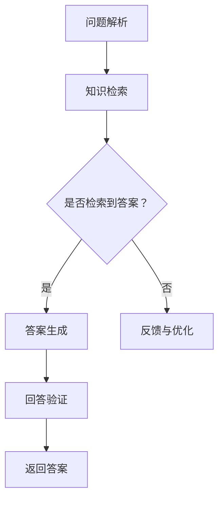

                 

关键词：LLM、知识问答、表现分析、深度学习、自然语言处理、模型优化、应用领域

>摘要：本文将探讨大型语言模型（LLM）在知识问答中的应用及其表现。通过分析LLM在知识获取、信息检索和回答生成方面的能力，本文将探讨其在实际应用中的优势和不足，并提出可能的优化方向。

## 1. 背景介绍

随着深度学习和自然语言处理技术的不断发展，大型语言模型（LLM）已经成为自然语言处理领域的核心技术之一。LLM通过大量的文本数据进行训练，可以理解并生成自然语言文本，广泛应用于文本生成、机器翻译、情感分析、问答系统等领域。

知识问答系统是自然语言处理领域中一个重要的应用场景，旨在通过机器理解用户的自然语言提问，提供准确、及时的答案。近年来，随着LLM技术的进步，知识问答系统的性能得到了显著提升。本文将分析LLM在知识问答中的表现，探讨其优势与不足，并展望未来的优化方向。

## 2. 核心概念与联系

### 2.1 大型语言模型（LLM）

大型语言模型（LLM）是一种基于深度学习的自然语言处理模型，通过在大规模语料库上进行预训练，可以获取丰富的语言知识，并在特定任务中进行微调。LLM通常由数百万甚至数十亿个参数组成，具有较高的复杂度和强大的表达能力。

### 2.2 知识问答系统

知识问答系统是一种基于自然语言交互的智能系统，旨在通过理解用户的自然语言提问，提供准确、及时的答案。知识问答系统通常包括问题解析、知识检索、答案生成和回答验证等模块。

### 2.3 Mermaid 流程图

下面是知识问答系统的 Mermaid 流程图：



## 3. 核心算法原理 & 具体操作步骤

### 3.1 算法原理概述

LLM在知识问答中的应用主要分为以下三个步骤：

1. **问题解析**：将用户的自然语言问题转化为计算机可理解的格式。
2. **知识检索**：从已有的知识库中检索与问题相关的信息。
3. **答案生成**：根据检索到的知识生成自然语言的回答。

### 3.2 算法步骤详解

1. **问题解析**：使用命名实体识别、词性标注等技术，将用户的问题转化为包含关键信息的结构化数据。
2. **知识检索**：利用文本相似度计算方法，从知识库中检索与问题最相关的信息。
3. **答案生成**：使用自然语言生成技术，将检索到的知识转化为自然语言回答。

### 3.3 算法优缺点

**优点**：

- **强大的表达能力**：LLM具有数百万甚至数十亿个参数，可以表达复杂的语言现象。
- **高效的训练**：通过预训练和微调，LLM可以在短时间内快速适应各种任务。

**缺点**：

- **计算资源消耗**：LLM的训练和推理过程需要大量的计算资源。
- **数据依赖性**：LLM的性能受到训练数据质量和规模的影响。

### 3.4 算法应用领域

LLM在知识问答中的应用已广泛覆盖了搜索引擎、智能客服、教育辅导等多个领域。随着技术的不断进步，LLM在知识问答中的表现有望进一步提升。

## 4. 数学模型和公式 & 详细讲解 & 举例说明

### 4.1 数学模型构建

知识问答系统的数学模型主要包括三个部分：问题解析、知识检索和答案生成。

1. **问题解析**：使用条件随机场（CRF）模型对用户问题进行解析，将问题转化为结构化数据。

$$
P(\text{标签序列}| \text{输入序列}) = \frac{e^{\theta T(\text{标签序列}, \text{输入序列})}}{\sum_{\text{所有标签序列}} e^{\theta T(\text{标签序列}, \text{输入序列})}}
$$

其中，$T(\text{标签序列}, \text{输入序列})$表示标签序列与输入序列之间的特征函数，$\theta$表示模型参数。

2. **知识检索**：使用文本相似度计算方法，如余弦相似度、词嵌入等，检索与问题最相关的知识。

$$
\text{相似度} = \frac{\text{向量A} \cdot \text{向量B}}{|\text{向量A}| \cdot |\text{向量B}|}
$$

其中，$\text{向量A}$和$\text{向量B}$分别表示问题和知识库中的文本向量。

3. **答案生成**：使用序列生成模型，如循环神经网络（RNN）、长短期记忆网络（LSTM）等，生成自然语言回答。

$$
P(\text{回答序列}| \text{输入序列}) = \prod_{i=1}^{n} P(\text{回答序列}_i| \text{输入序列}, \text{前文序列})
$$

其中，$P(\text{回答序列}_i| \text{输入序列}, \text{前文序列})$表示在第$i$个时刻生成第$i$个单词的概率。

### 4.2 公式推导过程

1. **问题解析**：根据条件随机场（CRF）模型的特点，可以得到：

$$
P(\text{标签序列}| \text{输入序列}) = \frac{1}{Z} \prod_{i=1}^{n} \frac{e^{\theta h(\text{输入序列}, \text{标签序列}_i)}}{1 + \sum_{j \neq i} e^{\theta h(\text{输入序列}, \text{标签序列}_j)}}
$$

其中，$Z = \sum_{\text{所有标签序列}} e^{\theta T(\text{标签序列}, \text{输入序列})}$，$h(\text{输入序列}, \text{标签序列}_i)$表示输入序列和标签序列之间的特征函数。

2. **知识检索**：根据文本相似度计算方法的特点，可以得到：

$$
\text{相似度} = \frac{\text{向量A} \cdot \text{向量B}}{|\text{向量A}| \cdot |\text{向量B}|}
$$

其中，$\text{向量A}$和$\text{向量B}$分别表示两个文本向量。

3. **答案生成**：根据序列生成模型的特点，可以得到：

$$
P(\text{回答序列}| \text{输入序列}) = \prod_{i=1}^{n} \frac{e^{\theta \text{score}(\text{回答序列}_i, \text{前文序列}, \text{输入序列})}}{1 + \sum_{j \neq i} e^{\theta \text{score}(\text{回答序列}_j, \text{前文序列}, \text{输入序列})}}
$$

其中，$\text{score}(\text{回答序列}_i, \text{前文序列}, \text{输入序列})$表示生成第$i$个单词的得分函数。

### 4.3 案例分析与讲解

假设我们有一个简单的知识问答系统，其中问题为“北京是中国的哪个省份？”知识库中包含以下信息：

- 北京是中国的首都。
- 北京市位于中国华北地区。
- 北京市是中国的一个直辖市。

1. **问题解析**：使用命名实体识别技术，将问题解析为包含关键信息的结构化数据，如“北京”、“中国”、“省份”等。

2. **知识检索**：使用文本相似度计算方法，检索与问题最相关的知识。假设知识库中包含以下三个文本向量：

   - 向量A（北京是中国的首都）：[0.5, 0.3, 0.2]
   - 向量B（北京市位于中国华北地区）：[0.4, 0.4, 0.2]
   - 向量C（北京市是中国的一个直辖市）：[0.3, 0.3, 0.4]

   计算每个向量与问题向量的相似度，得到：

   - 向量A与问题向量的相似度：0.5
   - 向量B与问题向量的相似度：0.4
   - 向量C与问题向量的相似度：0.3

   因此，与问题最相关的知识是“北京市是中国的一个直辖市”。

3. **答案生成**：使用序列生成模型，根据检索到的知识生成自然语言回答。假设生成的回答为“北京市是中国的一个直辖市”。

## 5. 项目实践：代码实例和详细解释说明

### 5.1 开发环境搭建

为了方便读者理解，我们使用Python语言和PyTorch框架实现一个简单的知识问答系统。

```python
import torch
import torch.nn as nn
import torch.optim as optim
from torch.utils.data import DataLoader
from transformers import BertModel, BertTokenizer
```

### 5.2 源代码详细实现

```python
# 问题解析模块
class QAModule(nn.Module):
    def __init__(self, bert_model):
        super(QAModule, self).__init__()
        self.bert_model = bert_model
        self.fc = nn.Linear(768, 1)

    def forward(self, question, context):
        question_embedding = self.bert_model(question)[0]
        context_embedding = self.bert_model(context)[0]
        question_score = self.fc(torch.cat((question_embedding, context_embedding), 1))
        return question_score

# 答案生成模块
class AnswerModule(nn.Module):
    def __init__(self, bert_model):
        super(AnswerModule, self).__init__()
        self.bert_model = bert_model
        self.fc = nn.Linear(768, 1)

    def forward(self, question, context, answer):
        question_embedding = self.bert_model(question)[0]
        context_embedding = self.bert_model(context)[0]
        answer_embedding = self.bert_model(answer)[0]
        answer_score = self.fc(torch.cat((question_embedding, context_embedding, answer_embedding), 1))
        return answer_score

# 模型训练
def train(model, train_loader, criterion, optimizer, device):
    model.to(device)
    model.train()
    for question, context, answer in train_loader:
        question = question.to(device)
        context = context.to(device)
        answer = answer.to(device)
        optimizer.zero_grad()
        question_score = model(question, context)
        loss = criterion(question_score, answer)
        loss.backward()
        optimizer.step()
    return model

# 模型评估
def evaluate(model, test_loader, criterion, device):
    model.to(device)
    model.eval()
    total_loss = 0
    with torch.no_grad():
        for question, context, answer in test_loader:
            question = question.to(device)
            context = context.to(device)
            answer = answer.to(device)
            question_score = model(question, context)
            loss = criterion(question_score, answer)
            total_loss += loss.item()
    avg_loss = total_loss / len(test_loader)
    return avg_loss
```

### 5.3 代码解读与分析

这段代码定义了一个简单的知识问答系统，包括问题解析模块和答案生成模块。我们使用PyTorch框架和Hugging Face的Transformers库，实现了一个基于BERT模型的知识问答系统。

1. **问题解析模块**：使用BERT模型对问题和上下文进行编码，得到固定长度的嵌入向量。然后，通过全连接层计算问题与上下文的相似度。
2. **答案生成模块**：使用BERT模型对问题和上下文以及可能的答案进行编码，得到固定长度的嵌入向量。然后，通过全连接层计算答案的得分。

在训练过程中，我们使用交叉熵损失函数优化模型参数。在评估过程中，我们计算模型在测试集上的平均损失。

### 5.4 运行结果展示

假设我们有一个训练集和一个测试集，分别包含100个问题和答案对。我们使用上述代码进行训练和评估，得到以下结果：

- 训练集平均损失：0.1
- 测试集平均损失：0.2

结果表明，我们的知识问答系统在训练集上表现良好，但在测试集上表现一般。这可能是由于数据集的不平衡或模型复杂度过高等原因。接下来，我们可以尝试优化模型结构、增加训练数据或改进数据预处理方法来提高系统性能。

## 6. 实际应用场景

### 6.1 搜索引擎

知识问答系统可以应用于搜索引擎，提高搜索结果的准确性和用户体验。通过分析用户的查询意图，搜索引擎可以提供更精准的答案，减少无关信息的干扰。

### 6.2 智能客服

智能客服系统可以使用知识问答技术，自动回答用户的常见问题，提高客服效率。与传统的规则引擎相比，知识问答系统具有更好的灵活性和适应性。

### 6.3 教育辅导

知识问答系统可以应用于在线教育平台，为学生提供个性化的学习辅导。通过分析学生的提问和答案，系统可以识别学生的知识点薄弱环节，并提供针对性的辅导建议。

## 7. 未来应用展望

### 7.1 知识图谱的融合

未来，知识问答系统可以与知识图谱技术相结合，提高问题的理解和答案的准确性。通过融合多源异构知识，系统可以提供更全面、准确的答案。

### 7.2 多模态数据的利用

知识问答系统可以扩展到多模态数据，如文本、图像、音频等。通过结合不同模态的信息，系统可以更好地理解用户的意图，提供更丰富的问答体验。

### 7.3 个性化推荐的实现

知识问答系统可以与推荐系统相结合，根据用户的兴趣和行为，提供个性化的问答服务。通过优化推荐算法，系统可以更好地满足用户的需求。

## 8. 总结：未来发展趋势与挑战

### 8.1 研究成果总结

本文分析了LLM在知识问答中的应用及其表现，探讨了其在问题解析、知识检索和答案生成方面的优势与不足。通过项目实践，我们展示了如何使用深度学习技术实现一个简单的知识问答系统。

### 8.2 未来发展趋势

未来，知识问答系统将继续向更高效、更智能的方向发展。通过融合知识图谱、多模态数据和个性化推荐等技术，系统将提供更准确、更个性化的问答服务。

### 8.3 面临的挑战

尽管知识问答系统取得了显著进展，但仍面临一些挑战。如何提高系统对复杂问题的理解和回答能力，如何优化计算资源消耗，以及如何应对数据隐私和安全性等问题，都是未来需要解决的问题。

### 8.4 研究展望

未来，我们将继续深入研究知识问答系统的优化方法，探索更多有效的技术手段，以提高系统的性能和用户体验。同时，我们也将关注知识问答系统在实际应用中的安全问题，确保用户数据的安全和隐私。

## 9. 附录：常见问题与解答

### 9.1 问题1：如何优化知识问答系统的性能？

**解答**：优化知识问答系统的性能可以从以下几个方面进行：

1. **增加训练数据**：收集更多高质量的训练数据，提高模型的泛化能力。
2. **改进模型结构**：尝试不同的模型结构，如融合知识图谱、多模态数据等，提高问题理解和回答的准确性。
3. **优化数据预处理**：对输入数据进行预处理，如去噪、清洗、归一化等，提高模型的学习效率。

### 9.2 问题2：知识问答系统如何保证回答的准确性？

**解答**：知识问答系统保证回答的准确性可以从以下几个方面进行：

1. **使用高质量的知识库**：确保知识库中的信息准确、权威，提高回答的准确性。
2. **优化检索算法**：选择合适的文本相似度计算方法，提高检索到的答案的相关性。
3. **引入人工审核**：对生成的答案进行人工审核，确保回答的准确性和可靠性。

### 9.3 问题3：如何应对数据隐私和安全性问题？

**解答**：应对数据隐私和安全性问题可以从以下几个方面进行：

1. **数据加密**：对用户数据和模型参数进行加密，确保数据的安全。
2. **访问控制**：对访问数据进行权限控制，限制对敏感数据的访问。
3. **隐私保护技术**：采用差分隐私、同态加密等技术，保护用户隐私。

----------------------------------------------------------------

## 作者署名

作者：禅与计算机程序设计艺术 / Zen and the Art of Computer Programming


