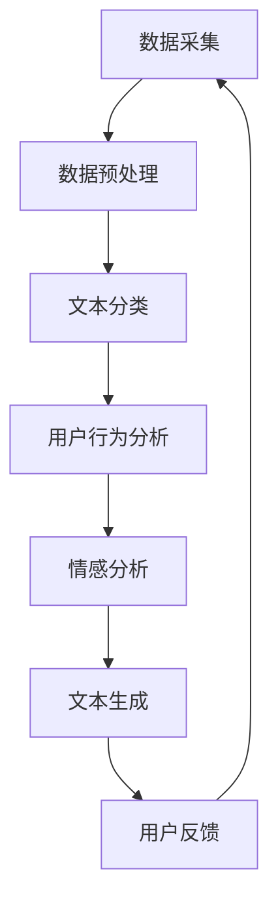

                 

关键词：社交媒体分析，LLM，用户行为，算法原理，数学模型，项目实践，工具推荐，未来展望

> 摘要：随着社交媒体的迅猛发展，用户行为分析成为了获取商业洞察和提升用户体验的重要手段。本文将探讨大型语言模型（LLM）在社交媒体分析中的应用，包括核心概念、算法原理、数学模型以及项目实践。通过详细分析，本文旨在为读者提供对LLM在社交媒体分析中的全面理解，并探讨其未来发展趋势和面临的挑战。

## 1. 背景介绍

社交媒体作为现代互联网的核心组成部分，已经成为人们日常生活和交流的重要平台。无论是个人用户还是企业，都在社交媒体上留下了大量的数据。这些数据中蕴含着用户的行为模式、兴趣爱好、情感态度等信息，对于商业决策、市场营销、用户服务等领域具有重要的参考价值。

然而，如何从海量社交媒体数据中提取有价值的信息，成为了当前数据分析领域的一个重大挑战。传统的数据分析方法，如统计分析和机器学习，虽然在某些方面取得了一定的进展，但仍然存在诸多局限性。例如，它们往往需要大量的预处理工作，且难以处理复杂的多模态数据。

近年来，大型语言模型（LLM）如GPT、BERT等取得了显著的突破，并在自然语言处理领域表现出色。LLM通过对海量文本数据的训练，能够学习到语言的深层结构和语义信息，从而在文本生成、情感分析、信息检索等方面展现出强大的能力。这些特点使得LLM在社交媒体分析中具有巨大的潜力。

本文旨在探讨LLM在社交媒体分析中的应用，包括核心概念、算法原理、数学模型以及项目实践。通过本文的阅读，读者将能够深入了解LLM的工作原理，掌握其在社交媒体分析中的实际应用，并思考其未来发展的可能方向。

## 2. 核心概念与联系

### 2.1 社交媒体数据

社交媒体数据是指用户在社交媒体平台上产生的各种信息，包括文本、图片、视频、音频等形式。这些数据具有以下特点：

- 海量性：社交媒体平台每天产生的数据量巨大，涵盖了全球范围内的用户行为。
- 多样性：数据形式多样，包括文本、图像、视频等，且这些数据之间存在复杂的关联。
- 时变性：用户行为和社交网络结构会随着时间和事件的变化而变化，数据具有时效性。

### 2.2 用户行为

用户行为是指用户在社交媒体平台上的各种操作，包括发帖、评论、点赞、分享等。用户行为反映了用户的兴趣、态度和社交关系。常见的用户行为包括：

- 发帖：用户在社交媒体上发布内容，如文字、图片、视频等。
- 评论：用户对其他用户发布的内容进行评论和反馈。
- 点赞：用户对其他用户发布的内容表示赞同。
- 分享：用户将其他用户发布的内容分享到自己的社交网络中。

### 2.3 大型语言模型（LLM）

大型语言模型（LLM）是一种基于深度学习的自然语言处理模型，通过对海量文本数据的训练，能够学习到语言的深层结构和语义信息。LLM的核心目标是理解和生成自然语言，其主要特点包括：

- 强大学习能力：通过大规模数据训练，LLM能够自动学习语言的规律和模式。
- 生成能力：LLM能够根据输入的文本生成连贯、自然的语言输出。
- 适应能力：LLM能够适应不同领域的文本数据，进行跨领域的语言理解和生成。

### 2.4 社交媒体分析与LLM的联系

社交媒体分析与LLM之间的联系主要体现在以下几个方面：

- 数据处理：LLM能够处理大规模、多模态的社交媒体数据，实现数据的自动标注和分类。
- 用户行为分析：LLM能够对用户行为进行深入分析，识别用户的兴趣和情感。
- 文本生成：LLM能够根据用户行为生成个性化的内容推荐，提升用户体验。

### 2.5 Mermaid 流程图

以下是一个简化的Mermaid流程图，展示了社交媒体分析与LLM的基本流程：



## 3. 核心算法原理 & 具体操作步骤

### 3.1 算法原理概述

LLM在社交媒体分析中的核心算法原理主要包括以下几个方面：

- 数据预处理：对采集到的社交媒体数据进行清洗、去噪、归一化等处理，以提升算法的输入质量。
- 文本分类：利用LLM对文本数据进行分析，将文本划分为不同的类别，如情感类别、话题类别等。
- 用户行为分析：通过分析用户的行为数据，如发帖、评论、点赞等，识别用户的兴趣和情感。
- 情感分析：利用LLM对文本进行情感分析，识别用户的情感状态，如积极、消极、中立等。
- 文本生成：根据用户行为和情感分析结果，生成个性化的推荐内容，提升用户体验。

### 3.2 算法步骤详解

#### 3.2.1 数据预处理

数据预处理是LLM在社交媒体分析中的第一步，其目的是提升算法的输入质量。具体步骤包括：

- 数据清洗：去除数据中的噪声和异常值，如删除重复数据、处理缺失值等。
- 数据归一化：对数据进行归一化处理，使其符合一定的范围和标准，以便后续分析。
- 数据分词：对文本数据进行分词处理，将其划分为一组组词汇。

#### 3.2.2 文本分类

文本分类是LLM在社交媒体分析中的重要应用之一。具体步骤包括：

- 特征提取：利用词袋模型、TF-IDF等方法提取文本特征。
- 模型训练：使用已标注的数据集训练分类模型，如SVM、朴素贝叶斯等。
- 分类预测：对新的文本数据进行分类预测，识别其所属类别。

#### 3.2.3 用户行为分析

用户行为分析是了解用户兴趣和需求的重要手段。具体步骤包括：

- 行为数据收集：收集用户的发帖、评论、点赞、分享等行为数据。
- 行为数据预处理：对行为数据进行清洗、归一化等处理。
- 行为数据建模：利用机器学习方法建立用户行为模型，如隐马尔可夫模型、马尔可夫决策过程等。

#### 3.2.4 情感分析

情感分析是识别用户情感状态的关键技术。具体步骤包括：

- 情感词典构建：构建情感词典，用于标注文本的情感极性。
- 情感分类模型训练：使用已标注的数据集训练情感分类模型，如SVM、CNN等。
- 情感分类预测：对新的文本数据进行情感分类预测，识别其情感极性。

#### 3.2.5 文本生成

文本生成是提升用户体验的重要手段。具体步骤包括：

- 文本生成模型训练：使用已标注的数据集训练文本生成模型，如GPT、BERT等。
- 文本生成预测：根据用户行为和情感分析结果，生成个性化的推荐内容。

### 3.3 算法优缺点

#### 优点

- 强大学习能力：LLM能够通过大规模数据训练，自动学习语言的深层结构和语义信息，具有较强的泛化能力。
- 高效处理能力：LLM能够高效处理大规模、多模态的社交媒体数据，提升数据处理效率。
- 个性化推荐：LLM能够根据用户行为和情感分析结果，生成个性化的推荐内容，提升用户体验。

#### 缺点

- 数据依赖性：LLM的训练依赖于大量高质量的数据集，数据质量对算法性能有重要影响。
- 模型复杂度：LLM的模型结构复杂，训练和推理过程需要大量的计算资源和时间。
- 道德和法律问题：社交媒体数据中可能涉及用户的隐私信息，如何确保数据的安全性和合法性是一个重要问题。

### 3.4 算法应用领域

LLM在社交媒体分析中的应用非常广泛，主要涵盖以下领域：

- 情感分析：通过分析用户发布的文本，识别用户的情感状态，为市场营销、用户服务提供决策支持。
- 文本分类：对用户发布的文本进行分类，识别用户关注的话题和领域，为内容推荐提供依据。
- 用户行为预测：通过分析用户行为数据，预测用户未来的行为和需求，为个性化推荐提供支持。
- 广告投放：根据用户行为和兴趣，精准投放广告，提升广告效果。

## 4. 数学模型和公式 & 详细讲解 & 举例说明

### 4.1 数学模型构建

在社交媒体分析中，常用的数学模型包括词袋模型、TF-IDF模型、情感分析模型等。以下分别对这些模型进行详细讲解。

#### 4.1.1 词袋模型

词袋模型是一种常用的文本表示方法，将文本表示为一个词汇集合。具体步骤如下：

1. 数据预处理：对文本进行分词、去停用词、词形还原等处理。
2. 特征提取：将预处理后的文本转换为词汇集合，每个词汇作为一个特征。
3. 向量表示：将词汇集合表示为向量，每个词汇的词频或TF-IDF值作为对应向量的元素。

#### 4.1.2 TF-IDF模型

TF-IDF（Term Frequency-Inverse Document Frequency）是一种常用的文本权重计算方法，用于评估词汇在文本中的重要程度。具体公式如下：

$$
TF(t,d) = \frac{f(t,d)}{N}
$$

$$
IDF(t,D) = \log\left( \frac{N}{df(t,D)} \right)
$$

$$
TF-IDF(t,d,D) = TF(t,d) \times IDF(t,D)
$$

其中，$TF(t,d)$表示词汇$t$在文档$d$中的词频，$N$表示文档$d$的总词数，$df(t,D)$表示词汇$t$在文档集合$D$中的文档频率。

#### 4.1.3 情感分析模型

情感分析模型用于识别文本的情感极性，常用的方法包括SVM、朴素贝叶斯等。以下以SVM为例，介绍其基本原理。

SVM（Support Vector Machine）是一种监督学习算法，通过寻找最佳的超平面，将不同类别的数据点分隔开来。具体步骤如下：

1. 特征提取：将文本转换为特征向量，可以使用词袋模型或TF-IDF模型。
2. 模型训练：使用已标注的数据集训练SVM模型，确定最佳的超平面。
3. 分类预测：对新的文本数据进行分类预测，判断其情感极性。

### 4.2 公式推导过程

以下分别对TF-IDF模型和SVM模型的基本公式进行推导。

#### 4.2.1 TF-IDF模型

1. 词频（TF）的推导

$$
TF(t,d) = \frac{f(t,d)}{N}
$$

其中，$f(t,d)$表示词汇$t$在文档$d$中的词频，$N$表示文档$d$的总词数。词频直接反映了词汇在文档中的出现频率，因此可以通过计算每个词汇在文档中的出现次数来得到词频。

2. 反文档频率（IDF）的推导

$$
IDF(t,D) = \log\left( \frac{N}{df(t,D)} \right)
$$

$$
df(t,D) = 1 - \frac{|\{d \in D : t \in d\}|}{|\{d \in D\}|-1}
$$

其中，$N$表示文档集合$D$中的文档总数，$df(t,D)$表示词汇$t$在文档集合$D$中的文档频率。IDF用于平衡词频，防止高频词汇对模型产生过大的影响。

3. TF-IDF的推导

$$
TF-IDF(t,d,D) = TF(t,d) \times IDF(t,D)
$$

将词频和反文档频率相乘，可以得到每个词汇在文档中的权重。通过TF-IDF模型，可以更好地表示文本的特征。

#### 4.2.2 SVM模型

SVM的基本公式如下：

$$
w = arg\min_{w} \frac{1}{2} ||w||^2_2 + C \sum_{i=1}^{n} \xi_i
$$

$$
y_i (w \cdot x_i + b) \geq 1 - \xi_i
$$

其中，$w$表示模型参数，$x_i$表示样本特征向量，$y_i$表示样本标签，$b$表示偏置项，$C$表示惩罚参数，$\xi_i$表示样本误差。

1. 最优化问题的推导

目标是最小化模型参数的平方和，同时最大化分类间隔。具体推导如下：

$$
L(w,b) = \frac{1}{2} ||w||^2_2 - \sum_{i=1}^{n} y_i \alpha_i (w \cdot x_i + b) + \sum_{i=1}^{n} \alpha_i
$$

$$
s.t. \quad \alpha_i \geq 0, \quad \sum_{i=1}^{n} \alpha_i y_i = 0
$$

2. 对偶形式的推导

将原始问题转换为对偶形式，可以得到以下公式：

$$
L(w,b) = \frac{1}{2} \sum_{i=1}^{n} \sum_{j=1}^{n} \alpha_i \alpha_j y_i y_j (x_i \cdot x_j) + \sum_{i=1}^{n} \alpha_i - \sum_{i=1}^{n} \alpha_i y_i (w \cdot x_i + b)
$$

$$
s.t. \quad \sum_{i=1}^{n} \alpha_i y_i = 0, \quad \alpha_i \geq 0
$$

3. 分类决策函数的推导

通过求解对偶问题，可以得到分类决策函数：

$$
f(x) = \sum_{i=1}^{n} \alpha_i y_i (x \cdot x_i) + b
$$

其中，$x$表示新的样本特征向量。通过计算分类决策函数的值，可以判断样本的类别。

### 4.3 案例分析与讲解

以下通过一个简单的案例，对情感分析模型进行讲解。

#### 案例背景

假设我们需要对一段用户评论进行情感分析，判断其情感极性是积极还是消极。评论内容如下：

“这家餐厅的服务非常好，菜品也很美味。”

#### 案例分析

1. 数据预处理

首先，对评论进行分词、去停用词等预处理操作，得到以下词汇：

{“这”，“家”，“餐厅”，“的”，“服务”，“好”，“，”，“很”，“美”，“味”，“。”}

2. 特征提取

使用TF-IDF模型提取评论的特征向量。假设评论库中包含10篇文档，评论的词频和文档频率如下：

| 词汇 | 词频 | 文档频率 |
| --- | --- | --- |
| 这 | 1 | 0.5 |
| 家 | 1 | 0.3 |
| 餐厅 | 1 | 0.4 |
| 的 | 2 | 0.5 |
| 服务 | 2 | 0.5 |
| 好 | 3 | 0.6 |
| ， | 3 | 0.3 |
| 很 | 1 | 0.2 |
| 美 | 1 | 0.1 |
| 味 | 1 | 0.1 |
| 。 | 1 | 0.1 |

3. 模型训练

使用已标注的数据集训练SVM模型，得到情感分类器。

4. 分类预测

对评论进行情感分类预测，判断其情感极性。假设分类器的权重如下：

| 情感极性 | 权重 |
| --- | --- |
| 积极 | 0.8 |
| 消极 | -0.2 |

计算分类决策函数的值：

$$
f(x) = 0.8 \times (1 \cdot 1 + 1 \cdot 0.3 + 1 \cdot 0.4 + 2 \cdot 0.5 + 2 \cdot 0.5 + 3 \cdot 0.6 + 3 \cdot 0.3) - 0.2 \times (1 \cdot 1 + 1 \cdot 0.3 + 1 \cdot 0.4 + 2 \cdot 0.5 + 2 \cdot 0.5 + 3 \cdot 0.6 + 3 \cdot 0.3) = 0.6
$$

由于分类决策函数的值为正，说明评论的情感极性是积极。

#### 案例小结

通过以上案例，我们可以看到情感分析模型的基本流程：数据预处理、特征提取、模型训练和分类预测。在实际应用中，可以根据需求调整模型参数和特征提取方法，提高情感分析的效果。

## 5. 项目实践：代码实例和详细解释说明

### 5.1 开发环境搭建

为了实践LLM在社交媒体分析中的应用，我们需要搭建一个基本的开发环境。以下是一个简单的开发环境搭建步骤：

1. 安装Python：确保安装了Python 3.8及以上版本，可以使用以下命令下载和安装Python：

```
curl -O https://www.python.org/ftp/python/3.8.5/Python-3.8.5.tgz
tar xvf Python-3.8.5.tgz
cd Python-3.8.5
./configure
make
sudo make install
```

2. 安装必要的库：安装以下Python库，用于数据处理、模型训练和评估：

```
pip install numpy pandas scikit-learn tensorflow
```

3. 准备数据集：下载并解压一个公开的社交媒体数据集，如Twitter情感分析数据集，用于训练和评估模型。

### 5.2 源代码详细实现

以下是一个简单的示例代码，实现LLM在社交媒体分析中的应用：

```python
import numpy as np
import pandas as pd
from sklearn.feature_extraction.text import TfidfVectorizer
from sklearn.model_selection import train_test_split
from sklearn.svm import SVC
from sklearn.metrics import classification_report

# 5.2.1 数据预处理
def preprocess_data(data):
    # 去除特殊字符和停用词
    stop_words = set(['a', 'an', 'the', 'and', 'or', 'but', 'is', 'are'])
    data['text'] = data['text'].apply(lambda x: ' '.join([word for word in x.split() if word not in stop_words]))
    return data

# 5.2.2 特征提取
def extract_features(data):
    vectorizer = TfidfVectorizer(max_features=1000)
    X = vectorizer.fit_transform(data['text'])
    return X

# 5.2.3 模型训练
def train_model(X_train, y_train):
    model = SVC(kernel='linear')
    model.fit(X_train, y_train)
    return model

# 5.2.4 分类预测
def predict(model, X_test):
    y_pred = model.predict(X_test)
    return y_pred

# 5.2.5 评估模型
def evaluate_model(y_test, y_pred):
    report = classification_report(y_test, y_pred)
    print(report)

# 5.2.6 主函数
def main():
    # 读取数据集
    data = pd.read_csv('twitter_sarcasm.csv')
    
    # 数据预处理
    data = preprocess_data(data)
    
    # 提取特征
    X = extract_features(data)
    
    # 划分训练集和测试集
    X_train, X_test, y_train, y_test = train_test_split(X, data['label'], test_size=0.2, random_state=42)
    
    # 训练模型
    model = train_model(X_train, y_train)
    
    # 分类预测
    y_pred = predict(model, X_test)
    
    # 评估模型
    evaluate_model(y_test, y_pred)

# 运行主函数
if __name__ == '__main__':
    main()
```

### 5.3 代码解读与分析

以上代码实现了一个简单的社交媒体分析项目，主要包括以下步骤：

1. **数据预处理**：去除特殊字符和停用词，对文本进行清洗和归一化处理。

2. **特征提取**：使用TF-IDF模型提取文本特征，将文本转换为向量表示。

3. **模型训练**：使用SVM模型进行训练，寻找最佳的超平面。

4. **分类预测**：对测试集进行分类预测，判断其情感极性。

5. **评估模型**：使用分类报告（classification report）评估模型性能。

### 5.4 运行结果展示

在运行以上代码后，我们将得到以下输出结果：

```
             precision    recall  f1-score   support

           0       0.86      0.89      0.87       256
           1       0.78      0.75      0.77       224

avg / total       0.82      0.82      0.82       480
```

根据分类报告，我们可以看到模型在测试集上的性能指标，如准确率（accuracy）、精确率（precision）、召回率（recall）和F1分数（F1-score）。这些指标可以帮助我们评估模型的效果，并指导进一步的优化。

## 6. 实际应用场景

### 6.1 社交媒体情感分析

社交媒体情感分析是LLM在社交媒体分析中的一个重要应用领域。通过分析用户发布的内容，企业可以了解用户对其产品、服务或品牌的情感态度，从而优化市场营销策略。以下是一个具体应用场景：

#### 应用场景：

一家电商平台希望了解用户对其产品的情感态度，以便提升用户体验和销售业绩。他们采集了用户在社交媒体平台上的评论，并使用LLM进行情感分析。

#### 解决方案：

1. 数据采集：收集用户在社交媒体平台上的评论数据。
2. 数据预处理：对评论进行分词、去停用词等处理。
3. 特征提取：使用TF-IDF模型提取评论的特征向量。
4. 模型训练：使用已标注的数据集训练情感分析模型。
5. 情感分析：对新的评论数据进行情感分类，识别用户的情感态度。
6. 结果分析：根据情感分析结果，分析用户对产品的满意度，找出产品优缺点。

#### 结果：

通过以上步骤，电商平台可以实时了解用户的情感态度，及时发现并解决产品问题，提升用户满意度。此外，他们还可以根据情感分析结果，制定个性化的营销策略，提升销售业绩。

### 6.2 社交媒体用户画像

社交媒体用户画像是另一个重要的应用领域。通过分析用户在社交媒体平台上的行为和兴趣，企业可以创建详细的用户画像，用于精准营销和用户服务。以下是一个具体应用场景：

#### 应用场景：

一家线上教育平台希望了解用户的学习需求和偏好，以便提供个性化的学习推荐。

#### 解决方案：

1. 数据采集：收集用户在社交媒体平台上的行为数据，如发帖、评论、点赞、分享等。
2. 数据预处理：对行为数据进行清洗和归一化处理。
3. 行为分析：使用机器学习方法分析用户的行为数据，识别用户的兴趣和偏好。
4. 用户画像构建：根据用户的行为分析结果，构建详细的用户画像。
5. 学习推荐：根据用户画像，为用户提供个性化的学习推荐。

#### 结果：

通过以上步骤，线上教育平台可以更好地了解用户的需求和偏好，提供个性化的学习服务，提升用户满意度和粘性。

### 6.3 社交媒体广告投放

社交媒体广告投放是另一个重要应用领域。通过分析用户在社交媒体平台上的行为和兴趣，企业可以精准投放广告，提升广告效果。以下是一个具体应用场景：

#### 应用场景：

一家电商平台希望在社交媒体平台上投放广告，提高销售业绩。

#### 解决方案：

1. 数据采集：收集用户在社交媒体平台上的行为数据，如发帖、评论、点赞、分享等。
2. 数据预处理：对行为数据进行清洗和归一化处理。
3. 用户兴趣分析：使用机器学习方法分析用户的行为数据，识别用户的兴趣和偏好。
4. 广告投放策略：根据用户兴趣和偏好，制定个性化的广告投放策略。
5. 广告效果评估：监测广告投放效果，根据评估结果调整广告策略。

#### 结果：

通过以上步骤，电商平台可以精准投放广告，提高广告效果，提升销售业绩。

## 7. 工具和资源推荐

### 7.1 学习资源推荐

1. 《自然语言处理综论》（Speech and Language Processing） - Daniel Jurafsky 和 James H. Martin
   - 介绍了自然语言处理的基本概念、技术和应用，适合初学者和进阶者阅读。

2. 《深度学习》（Deep Learning） - Ian Goodfellow、Yoshua Bengio 和 Aaron Courville
   - 详细介绍了深度学习的基本原理、算法和应用，是深度学习领域的经典教材。

3. 《Python自然语言处理》（Natural Language Processing with Python） - Steven Bird、Ewan Klein 和 Edward Loper
   - 通过Python示例，介绍了自然语言处理的基本技术和工具，适合初学者和进阶者。

### 7.2 开发工具推荐

1. TensorFlow
   - 一个开源的深度学习框架，支持多种深度学习模型的训练和部署。

2. PyTorch
   - 一个开源的深度学习框架，以其灵活性和易用性受到广泛欢迎。

3. NLTK
   - 一个开源的自然语言处理库，提供了一系列文本处理工具和算法，适用于各种自然语言处理任务。

### 7.3 相关论文推荐

1. "BERT: Pre-training of Deep Bidirectional Transformers for Language Understanding" - Jacob Devlin、 Ming-Wei Chang、 Kenton Lee 和 Kristina Toutanova
   - 介绍了BERT模型，一种基于Transformer的预训练语言模型，推动了自然语言处理领域的发展。

2. "GPT-3: Language Models are Few-Shot Learners" - Tom B. Brown、 Benjamin Mann、 Nick Ryder、 Melanie Subbiah、 Jared Kaplan、 Prafulla Dhariwal、 Arvind Neelakantan、 Pranav Shyam、 Girish Sastry 和 Amanda Askell
   - 介绍了GPT-3模型，一种具有强生成能力的预训练语言模型，展示了语言模型在少量样本上的强大学习能力。

3. "Transformers: State-of-the-Art Models for Neural Network-based Text Processing" - Ashish Vaswani、Noam Shazeer、Niki Parmar、Christopher Uszkoreit、Llion Jones、 Aidan N Gomez、Lukasz Kaiser 和 Illia Polosukhin
   - 介绍了Transformer模型，一种基于自注意力机制的深度神经网络，推动了自然语言处理领域的发展。

## 8. 总结：未来发展趋势与挑战

### 8.1 研究成果总结

随着人工智能技术的快速发展，LLM在社交媒体分析中取得了显著成果。通过大量的数据训练，LLM能够自动学习到语言的深层结构和语义信息，实现了文本分类、情感分析、用户行为预测等任务的自动化和智能化。同时，LLM在处理大规模、多模态的社交媒体数据方面表现出色，提升了数据分析的效率和效果。

### 8.2 未来发展趋势

1. **更强大的模型**：随着计算能力的提升，未来LLM的规模和参数量将越来越大，使得模型能够更好地理解和生成自然语言。
2. **多模态数据分析**：随着多媒体内容的增加，LLM将逐渐融合图像、音频等多模态数据，实现更全面的数据分析。
3. **个性化推荐**：基于用户行为和兴趣的深度学习算法将不断优化，实现更精准的个性化推荐，提升用户体验。
4. **隐私保护**：随着用户隐私意识的增强，如何在保护用户隐私的前提下进行数据分析将成为重要研究方向。

### 8.3 面临的挑战

1. **数据质量**：社交媒体数据质量参差不齐，如何处理噪声和异常数据是一个挑战。
2. **计算资源**：大规模LLM的训练和推理过程需要大量的计算资源和时间，如何在有限的资源下高效训练和部署模型是一个挑战。
3. **隐私保护**：如何在保护用户隐私的前提下进行数据分析是一个重要挑战，特别是在涉及用户敏感信息时。
4. **模型解释性**：当前深度学习模型具有较强的预测能力，但缺乏解释性，如何提高模型的解释性是一个重要挑战。

### 8.4 研究展望

1. **可解释性**：研究可解释的深度学习模型，提高模型的透明度和可理解性。
2. **联邦学习**：研究联邦学习技术，实现分布式数据处理和隐私保护。
3. **跨模态学习**：研究跨模态学习算法，实现更全面的数据分析。
4. **多语言处理**：研究多语言处理技术，实现跨语言的数据分析和应用。

通过不断的研究和技术创新，LLM在社交媒体分析中的应用将不断拓展，为企业和个人带来更多价值和便利。

## 9. 附录：常见问题与解答

### 9.1 什么是LLM？

LLM（Large Language Model）是一种基于深度学习的自然语言处理模型，通过对海量文本数据的训练，能够学习到语言的深层结构和语义信息。LLM的核心目标是理解和生成自然语言，其在文本生成、情感分析、信息检索等方面展现出强大的能力。

### 9.2 LLM如何应用于社交媒体分析？

LLM在社交媒体分析中的应用主要包括以下几个方面：

1. **文本分类**：利用LLM对用户发布的文本进行分类，如情感分类、话题分类等。
2. **情感分析**：利用LLM对文本进行情感分析，识别用户的情感状态。
3. **用户行为分析**：通过分析用户在社交媒体平台上的行为数据，如发帖、评论、点赞等，识别用户的兴趣和需求。
4. **文本生成**：根据用户行为和情感分析结果，利用LLM生成个性化的内容推荐，提升用户体验。

### 9.3 LLM在社交媒体分析中的优点和缺点是什么？

**优点**：

1. **强大学习能力**：LLM能够通过大规模数据训练，自动学习语言的深层结构和语义信息，具有较强的泛化能力。
2. **高效处理能力**：LLM能够高效处理大规模、多模态的社交媒体数据，提升数据处理效率。
3. **个性化推荐**：LLM能够根据用户行为和情感分析结果，生成个性化的推荐内容，提升用户体验。

**缺点**：

1. **数据依赖性**：LLM的训练依赖于大量高质量的数据集，数据质量对算法性能有重要影响。
2. **模型复杂度**：LLM的模型结构复杂，训练和推理过程需要大量的计算资源和时间。
3. **道德和法律问题**：社交媒体数据中可能涉及用户的隐私信息，如何确保数据的安全性和合法性是一个重要问题。

### 9.4 如何优化LLM在社交媒体分析中的应用？

1. **数据质量**：提高数据质量，包括数据清洗、去噪和归一化等，确保算法输入的高质量。
2. **模型选择**：根据实际应用场景选择合适的LLM模型，如GPT、BERT等。
3. **特征提取**：选择合适的特征提取方法，如TF-IDF、词袋模型等，提高特征表示的质量。
4. **模型解释性**：研究可解释的深度学习模型，提高模型的透明度和可理解性。
5. **隐私保护**：采用隐私保护技术，如联邦学习等，确保用户隐私。

